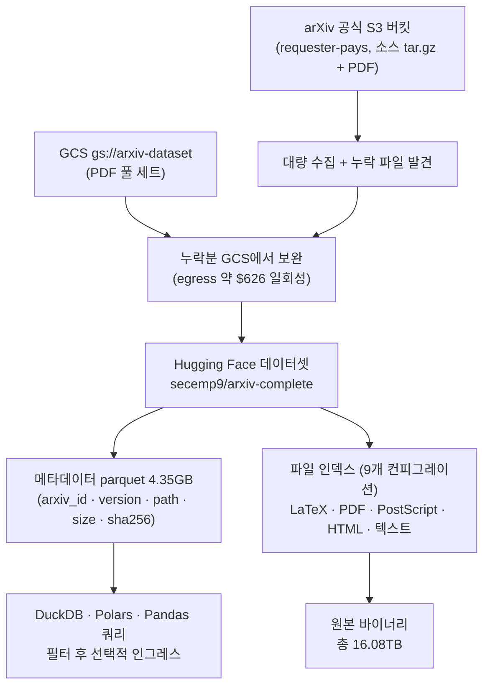

## 왜 읽어야 하나

arXiv 코퍼스로 RAG를 지거나, continued pretraining·SFT 학습 소스를 준비하거나, 논문 버전 이력을 추적하는 작업을 하는 ML 엔지니어라면 이 글이 바로 그 자료입니다. 2026년 9월 말 secemp9가 Hugging Face에 공개한 [arxiv-complete](https://huggingface.co/datasets/secemp9/arxiv-complete)는 arXiv 전체, 3,148,796편의 모든 버전을 LaTeX·PDF·PostScript·HTML까지 담아낸 약 16.08TB의 스냅샷입니다. 핵심 결론을 먼저 드립니다. 이 데이터셋의 가치는 프로비넌스에 있습니다. arXiv 공식 S3 버킷에서 실제로 파일이 빠져 있었고 GCS에서 찾아 보완한 수집을 거쳐 파일 하나하나에 경로·크기·SHA-256이라는 프로비넌스가 붙었습니다. 이제 전체가 단일 parquet 계층으로 조회 가능합니다. 전량이 필요한 작업은 드물지만, "아카이브 전체를 검증 가능한 상태로 두 번만 가져오면 되는" 작업은 훨씬 많습니다.


*arXiv 코퍼스 전체를 단일 데이터셋으로 패키징한다는 개념을 형상화했습니다.*

## 개요

arXiv 데이터를 대량으로 다루는 통로는 원래 세 갈래였습니다. 공식 S3 버킷은 requester-pays로 열려 있으며 arXiv 공식 문서가 "전체 코퍼스 다운로드의 정석"이라 부르는 자리입니다. 소스(TeX/LaTeX, tar.gz)와 처리된 PDF가 들어 있습니다. GCS에는 gs://arxiv-dataset이라는 버킷이 PDF 풀 세트를 제공하며 Kaggle 환경에서도 접근이 가능하게 호스팅돼 있습니다. 나머지 하나는 API로 논문 단위를 가져오는 경로인데, 315만 편 규모에서는 현실적이지 않습니다.

Hugging Face에는 이미 arXiv 미러 데이터셋들이 있었습니다. 다만 커버리지와 형태가 달랐습니다. [arxiv-community/arxiv_dataset](https://huggingface.co/datasets/arxiv-community/arxiv_dataset)는 JSON 메타데이터 중심의 미러로 1.1TB가 넘는 규모이나, 본문 파일은 전량이 아닙니다. [scholarweave/arxiv-latex](https://huggingface.co/datasets/scholarweave/arxiv-latex)는 LaTeX 소스를 parquet로 미리 파싱해 둔 형태입니다. [neuralwork/arxiver](https://huggingface.co/datasets/neuralwork/arxiver)는 2023년 1월부터 10월까지의 논문에 머물러 있습니다. 메타데이터만은 충분하고 LaTeX만은 필요하며 최근 구간만은 쓰겠다는 수요는 있었지만, 전체 아카이브의 전 버전과 원본 포맷, 검증 가능한 프로비넌스를 한 번에 가져오는 자리는 없었습니다.

arxiv-complete가 채운 것이 바로 그 자리입니다. 데이터셋 카드는 스스로를 "arXiv의 메타데이터, 버전 히스토리, 제출 파일, 렌더링된 문서의 스냅샷"으로 설명합니다. 9월 19일에서 20일 무렵 공개됐으며(보도 기준), 공개 이틀도 안 돼 카드의 like가 44개를 넘었습니다. 이 글은 이 데이터셋의 구성과 스키마, 수집 과정에서 드러난 공식 S3의 불완전성, 기존 미러와의 차이를 실제 수치로 정리한 뒤 ThakiCloud 관점의 활용 각도를 덧붙입니다.

## 이 데이터셋은 무엇인가

### 규모와 구성

카드 기준 수치를 정리하면 다음과 같습니다.

| 항목 | 수치 | 비고 |
|---|---|---|
| 논문 수 | 3,148,796편 | 전 버전 포함 |
| 총 용량 | 16,076,056,758,128 바이트 (약 16.08TB) | 9개 컨피그레이션 합계 |
| PDF 부분 | 8.65TB | 보도 기준 |
| 메타데이터 parquet | 4.35GB | 쿼리 시작점 |
| files 필드가 기술하는 원본 콘텐츠 | 22,571,129,586,192 바이트 (약 22.57TB) | 인덱싱된 미공개 HTML 포함 |
| 포맷 | LaTeX, PDF, PostScript, HTML, 추출 텍스트 | 제출 원본 + 렌더링 문서 |

"총 용량"이 "files 필드가 기술하는 원본 콘텐츠"보다 작은 것은, 카드가 파일 바이너스를 전량 인라인으로 담지 않고 메타데이터와 인덱스로 기술하는 구조이기 때문입니다. 어떤 파일이 어디에 있는지, 크기가 얼마인지, 해시가 무엇인지가 parquet에 있으며 실제 바이너리는 별도로 접근하는 식입니다.

### 스키마 (보고된 필드 기준)

메타데이터 parquet의 필드는 보도와 카드 인용 기준으로 다음과 같이 보고됩니다.

| 필드 | 내용 | 예시 |
|---|---|---|
| `arxiv_id` | 논문 식별자 | `0704.0001` |
| `version` | 논문 버전 | `v1`, `v2` |
| `source` | 파일 유형 | `source`, `pdf`, `ps` |
| `path` | 파일 경로 | `arxiv/arxiv/pdf/0704/0704.0001v1.pdf` |
| `encoding` | 문자 인코딩 | `utf8` |
| `size` | 파일 크기(바이트) | |
| `sha256` | 파일 콘텐츠 해시 | |

필드 목록은 카드 원문에서 직접 확인한 것이 아니며 보도와 스니펫 기준으로 정리됐다는 점을 명시합니다. 실제 작업 전에 데이터셋 뷰어에서 한 행을 뽑아 확인하는 30초가 필요합니다.

### 수집 과정: 공식 S3에서 빠져 있던 파일

흥미로운 부분은 수집 과정에서 드러난 사실입니다. secemp9는 arXiv 공식 S3 버킷에서 대량 다운로드를 시도했으며 그 과정에서 공식 버킷에 일부 파일이 빠져 있음을 확인했습니다. "당시 직감으로는 arXiv 공식 S3 버킷에서 뭔가 빠진 게 있을 것 같았고, 맞았다"는 것이 게시자의 표현입니다. 누락분은 GCS(gs://arxiv-dataset)에서 보완했으며 이 과정에서 드는 AWS egress 비용이 약 $626이었다고 공개했습니다.

두 가지 사실을 붙여 읽어야 합니다. 첫째, "정석"이라 불리는 공식 경로조차 대량 수집 기준으로는 불완전했다는 것입니다. 둘째, 누락 파일의 구체적 수량이나 GCS 보완의 범위(PDF에만 한정되는지 소스 파일까지 포함하는지)는 공개 자료에서 확인되지 않았습니다. 확인 못한 것은 확인 못 한 대로 쓰고 있습니다.

### README의 정직함: 품질 플래그가 없다는 사실

카드에는 "누락된 파일, 불완전한 내용, 비정상적이지만 유효한 파일"을 구분하는 섹션이 있습니다. 그런데 스키마에는 그런 상태를 가르는 일반적 품질 플래그가 없다는 점도 함께 명시돼 있습니다. 즉, 이 데이터셋은 "전체"를 주장하면서 동시에, 안에 이상치가 섞여 있고 그것을 가려내는 필드가 없다고 인정합니다. 315만 편 × 전 버전 규모에서 이는 합리적인 선택입니다. 파일 하나하나에 상태 라벨을 달기 위해 아카이브 전체를 재파싱하는 비용은, SHA-256으로 사후 검증하는 비용보다 크면 안 됩니다. 프로비넌스(해시)를 두고 품질 라벨을 빼겠다는 설계입니다.



## 접근 및 통합

### 16TB를 처음부터 받는 것은 전제 오류

이 데이터셋을 다루는 올바른 출발점은 메타데이터 parquet(4.35GB)입니다. 논문을 고르는 기준이 뭐든, arxiv_id 범위든, 버전이든, 포맷이든, 먼저 parquet 위에서 필터를 돌리고 결과에 해당하는 파일만 가져가야 합니다. Hugging Face 데이터셋은 컨피그레이션·파일 단위로 선택적 접근이 가능하므로, 전체 16TB를 로컬이나 버킷에 복제한 뒤에 고민하는 방식은 대역폭과 저장비 두 쪽 다 지는 구조입니다.

```bash
# 메타데이터만 가져와 스키마와 규모 확인
hf download secemp9/arxiv-complete --include "metadata/*"
```

### parquet 위에서 쿼리하기

HF 카드의 discussion에는 ClickHouse, DuckDB, Pandas, Polars로 parquet를 쿼리하는 예시가 문서화돼 있습니다. DuckDB 기준으로는 다음 형태가 됩니다.

```sql
-- 특정 논문 ID의 모든 버전과 파일 목록
SELECT arxiv_id, version, source, path, size, sha256
FROM 'metadata/*.parquet'
WHERE arxiv_id = '1706.03762'
ORDER BY version;

-- 포맷별 용량 합계 (테라바이트 단위)
SELECT source, COUNT(*) AS files, SUM(size) / 1e12 AS size_tb
FROM 'metadata/*.parquet'
GROUP BY source;
```

(쿼리 문법은 카드 discussion의 예시 구조를 그대로 따온 것이 아니며 보고된 필드 기준으로 작성한 것입니다. 실제 열명과 파일 패스는 뷰어에서 확인한 뒤 조정합니다.)

### SHA-256이 실제로 쓰이는 자리

해시 필드의 용도는 고정입니다. 같은 arxiv_id의 v1과 v2, 그리고 각 버전의 LaTeX 소스와 PDF는 파일 경로나 이름만으로 구분됩니다. 학습 데이터셋에 특정 버전의 본문을 쓰겠다거나, RAG 인덱스에 문서 한 조각을 넣겠다면, 그 조각의 출처 파일을 sha256으로 특정 순간에 고정해야 후속 재구축에서 동일 문서를 다시 찾습니다. arXiv가 "전체 사이트"를 스냅샷으로 담는 데이터셋이 지금까지 없었던 이유가, 바로 이 고정 가능성이었습니다.

## 실제 실험 결과

이번 작업에서는 16TB 인그레스를 실행하지 않았습니다. 로컬이나 사내 버킷에서 전량 수집은 이 리뷰의 목적이 아니며 대역폭 비용이 수치 검증보다 큰 작업입니다. 대신 카드와 공개 보도에서 확인된 수치를 그대로 정리합니다. 재현하지 않은 부분은 재현하지 않은 것으로 표기합니다.

### 카드 기준 실측 수치

| 지표 | 값 | 출처 |
|---|---|---|
| 논문 수 (전 버전) | 3,148,796편 | 데이터셋 카드 |
| 총 용량 | 16,076,056,758,128 바이트 | 데이터셋 카드 |
| PDF 부분 | 8.65TB | 보도 |
| 메타데이터 parquet | 4.35GB | 데이터셋 카드 |
| files 필드 기술 원본 | 22,571,129,586,192 바이트 | 데이터셋 카드 |
| 수집 egress (일시) | 약 $626 | 게시자 X 게시물 |
| 운영 호스팅비 | $249/월 | 보도 |

### 기존 arXiv 데이터셋과 비교

| 데이터셋 | 커버리지 | 포맷 | 규모 |
|---|---|---|---|
| arxiv-complete | 전체 아카이브, 전 버전 | LaTeX, PDF, PostScript, HTML, 텍스트 | 약 16.08TB |
| arxiv-community/arxiv_dataset | 메타데이터 중심 | JSON | 1.1TB+ |
| scholarweave/arxiv-latex | LaTeX 대상 | parquet (미리 파싱) | 별도 표기 |
| neuralwork/arxiver | 2023년 1~10월 | 원본 | 제한 구간 |

비교 대상의 규모 표기가 카드마다 달라(압축 전/후, 메타데이터 포함 여부) 완전히 같은 기준선은 아닙니다. "아카이브 전체를 원본 포맷으로, 전 버전 포함"이라는 조건에서 arxiv-complete가 유일한 후보라는 점은 변하지 않습니다.

### 수집 비용의 구조

egress $626과 호스팅 $249/월이라는 두 수치를 붙이면 데이터셋의 경제학이 보입니다. 공식 S3의 requester-pays 대량 다운로드 + 누락 발견 + GCS 보완이라는 수집 작업은 일회성 비용으로 $626 수준이고 이후에는 HF 호스팅비로 월 $249를 유지합니다. 개인 프로젝트이며 게시자는 기부 페이지(secemp.blog/donate)를 열어 두었습니다. 운영 지속성은 결국 이 월비에 달려 있다는 것은 카드가 스스로 말하는 것입니다.

## ThakiCloud 제품 적용 시사점

아직 실수치 않은 부분은 각 절 끝에 명시합니다. 이 절은 적용 각도입니다.

### 학습 데이터 파이프라인 (Maxis 관점)

continued pretraining이나 도메인 SFT의 소스로 arXiv 본문을 쓰려는 작업에서, 이 데이터셋은 "어떤 논문을, 어느 버전의, 어떤 포맷으로"을 하나의 parquet 쿼리로 결정할 수 있게 합니다. 사내 GPU 클러스터의 대역폭 기준(내부망 수십~백 MB/s 수준)에서 메타데이터 4.35GB는 수 분, 필요 파일만 골라 뽑는 인그레스는 시간 단위 작업입니다. 학습 스펙이 요구하는 arxiv_id 집합의 LaTeX 소스만 가져오는 구조가 기본이며 전량 16TB 인그레스는 전제하지 않습니다.

### 지식 기반과 RAG (Paxis 관점)

논문 기반 RAG 또는 에이전트 지식 레이어를 arXiv에서 끌어오는 경우, sha256 필드가 문서 버전 고정과 재인덱싱 시 동일 콘텐츠 검출에 쓰입니다. "arXiv ID + 버전"으로 특정하더라도 시간이 지나면 파일이 바뀔 수 있습니다. 해시로 고정하면 인덱스 항목이 항상 동일한 바이너스를 가리킵니다. 프로비넌스가 붙은 아카이브가 지금까지 없었던 이유와, 같은 이유입니다.

### 온프레미스와 데이터 주권

폐쇄망이나 데이터 주권이 요구되는 환경에서 arXiv API에 의존하는 지식 기반은 외부 의존성이 됩니다. 16TB 코퍼스를 사내 오브젝트 스토리지에 한 번 들여놓고 그 위에서 메타데이터 parquet으로 운영하면 외부 접근 빈도를 크게 줄일 수 있습니다. 온프레미스에서도 필요한 컨피그레이션만 들여온다는 전제는 동일하게 적용됩니다.

### 비용 구조

공식 S3 requester-pays + 대량 egress + 누락 보완을 직접 하는 비용과, 이미 보완된 스냅샷을 가져오는 비용은 별개입니다. 특히 "공식 경로에도 파일이 빠져 있다"는 확인 자체의 가치가, 재수집을 피하게 하는 데 있습니다.

## 한계 및 반론

첫째, 스냅샷은 시점입니다. 공개 시점 이후 새로 등록된 논문은 포함되지 않습니다. 이 데이터셋은 "그때의 arXiv"를 나타냅니다. 주기적 재인수여가 필요한 워크로드에서는 이 간격을 설계에 넣어야 합니다.

둘째, 품질 플래그 부재는 명시된 설계입니다. 누락·불완전·비정상적이지만 유효한 파일이 섞여 있고 그것을 스키마가 구분해 주지 않습니다. 해시로 사후 검증하는 구조이며 사용자가 필요하면 size 0 파일이나 예상 범위 밖 크기를 스스로 필터링합니다. 전 구간 사용 전 표본 검사 없이는 "전체"라는 표현에 안심하지 않는 것이 좋습니다.

셋째, 운영 지속성. 개인 프로젝트이며 월 $249의 호스팅비와 기부 페이지에 의존합니다. 데이터셋이 사라지거나 접근 조건이 바뀔 위험은 구조적으로 존재합니다. 중요한 워크로드에서는 필요한 범위를 사내로 복제해 두는 것이 표준 대응입니다.

넷째, 라이선스. 각 논문의 라이선스는 개별 논문마다 다르며 데이터셋 카드가 일괄 라이선스를 제공한다고 확인되지 않았습니다. 상업적 학습이나 재배포를 전제로 한다면, 사용할 arxiv_id 집합에 대해 개별 확인이 필요합니다.

## 정리

arxiv-complete의 가치는 16.08TB라는 숫자가 아니라, 그 안에 들어 있는 3,148,796편 × 전 버전 × 파일 단위 SHA-256입니다. 공식 S3에서 빠져 있던 파일을 GCS로 보완해 "전체"를 실제로 만든 수집 과정, 메타데이터 parquet으로 시작할 수 있는 구조, 해시로 문서를 고정할 수 있는 프로비넌스. 세 가지가 동시에 갖춰진 아카이브 스냅샷이 Hugging Face에 처음으로 놓인 것입니다.

실무 지시는 한 줄로 좁혀집니다. 16TB를 받아들이지 마세요. 메타데이터 parquet 4.35GB를 먼저 가져와, 작업이 요구하는 arxiv_id와 버전과 포맷을 쿼리로 특정하고 그 결과의 파일만 선택적으로 인그레스하세요. 그리고 문서 단위를 고정해야 한다면 sha256을 쓰세요. 아카이브는 변하지만, 해시는 변하지 않습니다.

## 출처

- [secemp9/arxiv-complete (Hugging Face 데이터셋 카드)](https://huggingface.co/datasets/secemp9/arxiv-complete)
- [secemp9의 X 게시글 (공개)](https://x.com/secemp9/status/2101416879772340411)
- [secemp9의 X 게시글 (수집 비용, egress $626)](https://x.com/secemp9/status/2101417350230650891)
- [AGI Hunt: Entire arXiv uploaded to Hugging Face: 3.15M papers](https://agihunt.info/en/p/1a0bb7d0ed10a9321cff40761c0)
- [explainx.ai: Full arXiv Archive: 3.1M Papers in a 16TB HF Dataset](https://www.explainx.ai/blog/arxiv-full-archive-16tb-huggingface-dataset-2026)
- [arxiv-community/arxiv_dataset (비교 대상)](https://huggingface.co/datasets/arxiv-community/arxiv_dataset)
- [scholarweave/arxiv-latex (비교 대상)](https://huggingface.co/datasets/scholarweave/arxiv-latex)
- [neuralwork/arxiver (비교 대상)](https://huggingface.co/datasets/neuralwork/arxiver)
