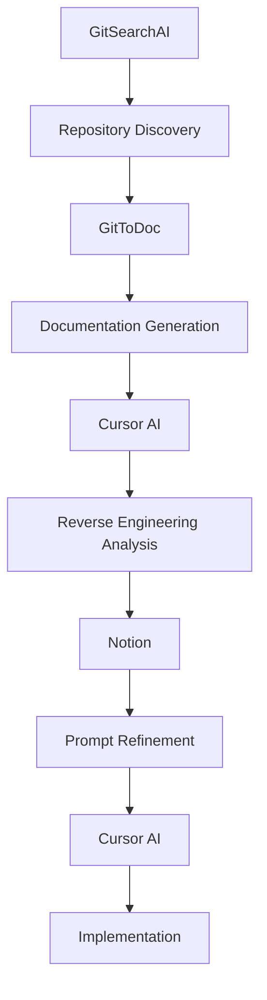
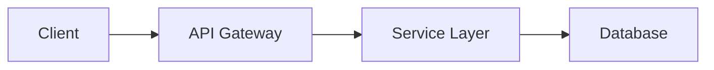

## 들어가며

역 엔지니어링(Reverse Engineering)은 기존 시스템이나 제품을 분석하여 그 구조와 작동 원리를 이해하고, 때로는 재현하는 기술입니다. 소프트웨어 개발 영역에서 역 엔지니어링은 레거시 코드 이해, 경쟁사 분석, 보안 취약점 발견 등 다양한 목적으로 활용되어 왔습니다.

오늘날 AI 도구들의 발전으로 역 엔지니어링의 패러다임이 급격히 변화하고 있습니다. 이 글에서는 시대별 대표 사례를 통해 역 엔지니어링의 진화 과정을 살펴보고, 현대적 AI 기반 방법론을 소개합니다.

## 역 엔지니어링의 시대별 발전사

### 1970년대-1980년대: 하드웨어 복제의 시대

**IBM PC 호환기계의 탄생**

1980년대 초, IBM이 개인용 컴퓨터 시장을 장악했을 때, 수많은 기업들이 IBM PC를 역 엔지니어링하여 호환 기계를 만들었습니다.

- **Compaq Portable (1983)**: 최초의 성공적인 IBM PC 완전 호환 기계
- **Phoenix BIOS**: IBM의 BIOS를 법적 문제 없이 역 엔지니어링한 대표 사례
- **클린 룸 방식**: 원본 코드를 본 팀과 구현 팀을 분리하여 저작권 침해를 방지

```bash
# 당시 역 엔지니어링 과정
1. 하드웨어 신호 분석
2. 어셈블리 코드 디스어셈블링
3. 기능별 모듈 분석
4. 클린 룸에서 재구현
```

### 1990년대: 소프트웨어 리버싱의 황금기

**Samba 프로젝트 (1992)**

Microsoft의 SMB/CIFS 프로토콜을 역 엔지니어링하여 Unix/Linux에서 Windows 파일 공유가 가능하게 만든 획기적 프로젝트입니다.

- **네트워크 패킷 캡처 분석**
- **프로토콜 문서화**
- **오픈소스 구현체 개발**

**Wine 프로젝트 (1993)**

Windows API를 역 엔지니어링하여 Linux에서 Windows 애플리케이션을 실행할 수 있게 한 프로젝트입니다.

```c
// Wine의 Windows API 재구현 예시
HWND WINAPI CreateWindowExW(DWORD dwExStyle, LPCWSTR lpClassName,
                           LPCWSTR lpWindowName, DWORD dwStyle,
                           int X, int Y, int nWidth, int nHeight,
                           HWND hWndParent, HMENU hMenu,
                           HINSTANCE hInstance, LPVOID lpParam)
{
    // Windows API 동작을 Linux/X11로 변환
    return create_window_internal(/* ... */);
}
```

### 2000년대: 웹과 네트워크 프로토콜 리버싱

**Pidgin/Gaim 프로젝트**

다양한 인스턴트 메신저 프로토콜(AIM, MSN, Yahoo, ICQ)을 역 엔지니어링하여 통합 메신저를 개발했습니다.

- **네트워크 트래픽 분석**
- **암호화 프로토콜 해석**
- **멀티 프로토콜 지원 아키텍처**

**Flash 플레이어 대안들**

Adobe Flash의 SWF 포맷을 역 엔지니어링한 여러 오픈소스 프로젝트들이 등장했습니다.

### 2010년대: 모바일과 클라우드 시대

**Android 커스텀 ROM**

- **CyanogenMod/LineageOS**: Android 소스코드와 바이너리 드라이버 역 엔지니어링
- **루팅 도구들**: 제조사 보안 메커니즘 우회 기법

**API 리버싱**

```python
# REST API 역 엔지니어링 예시
import requests
import json

# 네트워크 트래픽 캡처를 통한 API 엔드포인트 발견
def reverse_engineer_api():
    # 1. 브라우저 개발자 도구로 네트워크 요청 분석
    # 2. 헤더와 페이로드 구조 파악
    # 3. 인증 메커니즘 이해
    headers = {
        'Authorization': 'Bearer token_discovered',
        'Content-Type': 'application/json'
    }
    
    response = requests.get('https://api.example.com/v1/data', headers=headers)
    return response.json()
```

## 현대적 AI 기반 역 엔지니어링 방법론

### 새로운 패러다임: AI-Powered Software Archaeology

기존의 수동적이고 시간 소모적인 역 엔지니어링 과정이 AI 도구들로 인해 혁신적으로 변화하고 있습니다.

### 현대적 역 엔지니어링 워크플로우



#### 1단계: GitSearchAI - 저장소 발견

**[GitSearchAI](http://gitsearchai.com)**는 GitHub의 방대한 저장소들을 AI로 검색할 수 있는 도구입니다.

```bash
# 전통적 방법
git clone https://github.com/target/repo
find . -name "*.py" | xargs grep -l "specific_function"

# AI 기반 방법
# GitSearchAI에서 자연어로 검색
# "authentication middleware implementation in Python Flask"
```

**활용 사례:**

- 특정 기능 구현 패턴 검색
- 유사한 아키텍처를 가진 프로젝트 발견
- 보안 구현 모범 사례 조사

#### 2단계: GitToDoc - 문서화 자동 생성

**[GitToDoc](http://gittodoc.com)**은 저장소를 분석하여 자동으로 문서를 생성합니다.

```markdown
# 기존 방식: 수동 분석
1. README.md 읽기
2. 코드 구조 파악
3. 의존성 분석
4. API 문서 찾기

# AI 방식: 자동 문서 생성
- 코드베이스 전체 구조 요약
- 주요 함수와 클래스 설명
- 데이터 플로우 다이어그램
- API 엔드포인트 목록
```

#### 3단계: Cursor - AI 기반 코드 분석

**Cursor AI**를 활용한 역 엔지니어링 프롬프트 예시:

```markdown
# 역 엔지니어링 분석 프롬프트
이 코드베이스를 분석하여 다음을 파악해주세요:

1. **아키텍처 패턴**: 사용된 디자인 패턴과 아키텍처 스타일
2. **데이터 플로우**: 데이터가 어떻게 처리되고 이동하는지
3. **핵심 알고리즘**: 주요 비즈니스 로직의 구현 방식
4. **보안 메커니즘**: 인증, 인가, 암호화 구현
5. **성능 최적화**: 캐싱, 데이터베이스 쿼리 최적화 등

특히 [specific_component]의 작동 원리를 자세히 설명해주세요.
```

#### 4단계: Notion - 프롬프트 개선

Notion에서 분석 결과를 정리하고 추가 분석을 위한 프롬프트를 개선합니다.

```markdown
# Notion 템플릿: 역 엔지니어링 분석 결과

## 📋 프로젝트 개요
- **프로젝트명**: 
- **주요 기술 스택**: 
- **아키텍처**: 

## 🔍 핵심 발견사항
### 아키텍처 패턴
- [ ] MVC
- [ ] MVP  
- [ ] MVVM
- [ ] Clean Architecture

### 데이터 플로우


## 🛠 구현 계획

### Phase 1: 핵심 기능 재구현

- [ ] 인증 시스템
- [ ] 데이터 모델
- [ ] API 엔드포인트

### Phase 2: 최적화 및 확장

- [ ] 성능 최적화
- [ ] 보안 강화
- [ ] 테스트 커버리지 향상

```

#### 5단계: Cursor - 실행 및 구현

개선된 프롬프트로 실제 구현을 진행합니다.

```python
# Cursor AI로 생성된 역 엔지니어링 결과 구현 예시
class ReversedAuthSystem:
    """
    원본 시스템의 인증 메커니즘을 분석하여 재구현
    
    발견된 패턴:
    - JWT 토큰 기반 인증
    - 리프레시 토큰 로테이션
    - RBAC 권한 시스템
    """
    
    def __init__(self, secret_key: str):
        self.secret_key = secret_key
        self.token_blacklist = set()
    
    def authenticate(self, credentials: dict) -> dict:
        """원본 시스템과 동일한 인증 플로우 재현"""
        # 분석된 알고리즘 기반 구현
        pass
    
    def authorize(self, token: str, resource: str) -> bool:
        """권한 검사 로직 재구현"""
        # 역 엔지니어링으로 파악된 RBAC 로직
        pass
```

### AI 시대 역 엔지니어링의 장점

#### 1. 속도와 효율성

- **기존**: 몇 주~몇 달의 분석 시간
- **현재**: 몇 시간~며칠로 단축

#### 2. 정확성 향상

- AI가 패턴을 놓치지 않고 분석
- 인간의 실수나 편견 최소화

#### 3. 문서화 자동화

- 분석 과정과 결과가 자동으로 문서화
- 팀 간 지식 공유 용이

#### 4. 반복 가능한 프로세스

- 표준화된 워크플로우
- 일관된 품질의 분석 결과

## 실제 적용 사례

### 케이스 스터디 1: 레거시 시스템 현대화

```bash
# 기존 COBOL 시스템을 Python으로 현대화
1. GitSearchAI로 유사한 현대화 사례 검색
2. GitToDoc으로 레거시 코드 문서화
3. Cursor로 비즈니스 로직 분석
4. Notion에서 마이그레이션 계획 수립
5. Cursor로 Python 코드 생성
```

### 케이스 스터디 2: API 클라이언트 라이브러리 개발

```python
# 서드파티 API를 위한 SDK 개발
# 1. GitSearchAI에서 기존 SDK 패턴 조사
# 2. GitToDoc으로 API 문서 자동 생성
# 3. Cursor로 클라이언트 코드 분석 및 생성

class ThirdPartyAPIClient:
    """역 엔지니어링으로 개발된 API 클라이언트"""
    
    def __init__(self, api_key: str, base_url: str):
        self.api_key = api_key
        self.base_url = base_url
        self.session = self._create_session()
    
    def _create_session(self):
        """분석된 인증 패턴 기반 세션 생성"""
        # AI로 분석된 헤더 패턴 적용
        pass
```

## 윤리적 고려사항

### 합법적 역 엔지니어링

- **상호 운용성**: 시스템 간 호환성 확보
- **보안 감사**: 취약점 발견 및 수정
- **교육 목적**: 학습과 연구

### 주의사항

- **저작권 존중**: 클린 룸 방식 적용
- **라이선스 준수**: 오픈소스 라이선스 확인
- **특허 침해 방지**: 특허 조사 필수

## 미래 전망

### AI 기반 도구의 발전

```python
# 미래의 역 엔지니어링 도구 예상
class FutureReverseEngineer:
    def __init__(self):
        self.llm = "GPT-6"  # 더 강력한 언어 모델
        self.code_analyzer = MultiModalAnalyzer()  # 코드+문서+실행 결과 통합 분석
        self.pattern_db = GlobalPatternDatabase()  # 전 세계 패턴 데이터베이스
    
    def analyze_system(self, target):
        """완전 자동화된 시스템 분석"""
        # 1. 자동 코드 발견 및 수집
        # 2. 멀티모달 분석 (코드, 문서, 실행 로그)
        # 3. 패턴 매칭 및 유사도 분석
        # 4. 자동 재구현 및 테스트
        pass
```

### 새로운 도전과 기회

- **실시간 분석**: 라이브 시스템 분석
- **보안 강화**: AI vs AI 대결 구도
- **자동화 확산**: 완전 자동화된 역 엔지니어링

## 결론

역 엔지니어링은 하드웨어 복제에서 시작하여 소프트웨어 분석, 그리고 현재의 AI 기반 자동화까지 지속적으로 진화해왔습니다.

현대적 AI 도구들의 조합:

- **GitSearchAI** → 저장소 발견
- **GitToDoc** → 문서화 자동화  
- **Cursor** → 코드 분석 및 생성
- **Notion** → 프로세스 관리

이러한 워크플로우는 개발자들이 더 빠르고 정확하게 기존 시스템을 이해하고 개선할 수 있게 해줍니다. 하지만 기술의 발전과 함께 윤리적 책임도 함께 고려해야 할 것입니다.

앞으로 AI 기술의 발전으로 역 엔지니어링은 더욱 정교하고 자동화될 것으로 예상되며, 이는 소프트웨어 개발 전반에 혁신적인 변화를 가져올 것입니다.

---

*이 글이 도움이 되셨다면 GitHub에서 ⭐️를 눌러주세요! 더 많은 AI 및 개발 관련 콘텐츠를 원하시면 [ThakiCloud](https://thakicldoud.github.io)를 방문해보세요.*
