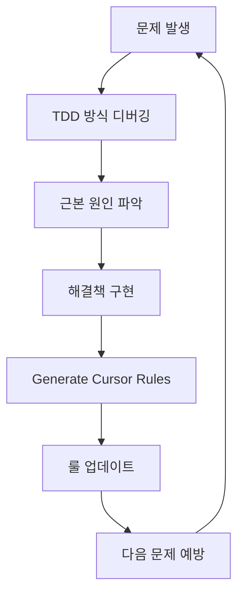

## 개요

"한달 500개가 터무니없이 적다"는 말, 한번쯤 들어보셨을 겁니다. 하지만 정말 그럴까요? [Builder.io의 Steve Sewell](https://www.builder.io/blog/cursor-tips)은 "이제 80% 시간을 AI와 대화하며 코딩한다"고 말합니다. 핵심은 **양이 아닌 질**입니다.

이 가이드는 2025년 6월 최신 Cursor AI 기능을 바탕으로, **월 500회 제한을 절대 넘지 않으면서도** 생산성을 극대화하는 전략적 활용법을 제시합니다. 무작정 AI에게 맡기는 것이 아닌, **전략적 협업**을 통해 진짜 개발자다운 워크플로를 구축해보겠습니다.

## 🎯 **핵심 철학: 전략적 AI 협업**

### **Before: 무분별한 AI 의존**
```markdown
❌ 문제 발생 → 즉시 AI에게 해결 요청 → 실패 → 다시 요청 → 반복
→ 결과: 월 500회 금방 소진, 근본적 해결책 부재
```

### **After: 전략적 협업 워크플로**
```markdown
✅ 문제 분석 → PRD/룰 기반 정제된 요청 → AI 협업 → 검증 → 룰 업데이트
→ 결과: 월 200-300회로 충분, 지속적 품질 향상
```

## 🏗 **1단계: 프로젝트 기반 구조 구축**

### **PRD 중심 개발 문화**

```markdown
# 실전 PRD 템플릿 (Cursor Rules 연동)

## 프로젝트 개요
- 비전: [30자 이내 핵심 가치]
- 문제 정의: [구체적 페인포인트]
- 성공 지표: [측정 가능한 KPI]

## 기술 스택 매트릭스
| Layer | 선택 기술 | 대안 기술 | 선택 근거 |
|-------|-----------|-----------|-----------|
| Frontend | React 18 | Vue 3 | 팀 숙련도, 생태계 |
| State | Zustand | Redux | 학습 곡선, 번들 크기 |
| Styling | Tailwind | Styled-Components | 개발 속도, 일관성 |

## AI 협업 가이드라인
- 모델 선택: 단순 변경(Claude Sonnet) vs 복잡 계획(Claude Opus)
- 컨텍스트: @Docs React, @Code utils, @Git main
- 검증 기준: TypeScript 통과, 테스트 커버리지 80%+
```

### **Cursor Rules 자동 생성 워크플로**

```bash
# init-cursor.sh 활용 (프로젝트에서 제공)
./init-cursor.sh

# 생성된 구조
.cursor/rules/
├── prd.mdc              # 프로젝트 전체 맥락
├── tech-stack-doc.mdc   # 기술 스택 가이드라인
├── frontend-guidelines.mdc  # 프론트엔드 규칙
├── backend-structure.mdc    # 백엔드 아키텍처
└── security-checklist.mdc   # 보안 체크리스트
```

## 🎮 **2단계: 모델별 전략적 활용**

### **모델 선택 매트릭스**

| 작업 유형 | 추천 모델 | 이유 | 예상 토큰 |
|-----------|-----------|------|-----------|
| 단순 버그 수정 | Claude Sonnet | 빠른 속도, 정확성 | 1,000-3,000 |
| 아키텍처 설계 | Claude Opus | 깊은 사고, 창의성 | 5,000-10,000 |
| 코드 리뷰 | GPT-4.1 | 명확한 지시 수행 | 2,000-5,000 |
| 테스트 작성 | Gemini Pro | 엣지 케이스 발견 | 3,000-7,000 |

### **실전 모델 전환 예시**

```typescript
// 1. Sonnet으로 빠른 프로토타입
interface UserProfile {
  id: string;
  name: string;
  // TODO: Opus로 확장 설계 필요
}

// 2. Opus로 복잡한 비즈니스 로직 설계
interface UserProfileAdvanced {
  id: UserId;
  personalInfo: PersonalInfo;
  preferences: UserPreferences;
  permissions: PermissionMatrix;
  // 완전한 도메인 모델링
}
```

## 🧪 **3단계: TDD 기반 디버깅 워크플로**

### **기존 방식의 문제점**
```markdown
❌ 버그 발견 → AI에게 "고쳐줘" → 실패 → 다시 "고쳐줘" → 무한 반복
→ 토큰 낭비, 근본 원인 미파악
```

### **TDD 기반 3단계 디버깅**

#### **1단계: 실패하는 테스트 작성 (Agent 모드)**
```typescript
// Cursor 프롬프트
/*
X 페이지에서 Y를 누르면 A처럼 동작해야 하는데 B처럼 동작해. 
TDD 방식으로 고쳐보려고 하는데, 이 현상을 재현하는 테스트 코드를 작성해서 실행해줘. 
현 시점에 테스트 코드는 일단 실패해야 한다는 걸 기억해. 
내가 틀렸을 수도 있으니 재현이 안되면 알려주고. 
내 명령 없이 문제를 고치기 시작하지 마.
*/

// 결과: 실패하는 테스트 코드 생성
describe('UserProfile Bug Reproduction', () => {
  it('should update username when form is submitted', async () => {
    // 현재 실패하는 테스트
    expect(result.username).toBe('newUsername'); // 실패!
  });
});
```

#### **2단계: 근본 원인 분석 (Ask 모드)**
```typescript
// Cursor 프롬프트
/*
버그의 근본 원인을 파악하려고 해. 
이 현상이 왜, 어떨 때 일어나는지 가능한 옵션들을 제시해줘. 
그리고 그 옵션들 중 무엇이 맞는지 확인하기 위한 방법도 같이 얘기해줘. 
어떤 정보가 더 필요한지, 어떤 걸 로그로 찍어봐야 하는지 등. 
그 방법을 실행할 필요는 없고 설명만 해줘.
*/

// AI 분석 결과
/*
가능한 원인들:
1. State 업데이트 타이밍 이슈 (React 18 Concurrent Features)
2. Form validation 로직 간섭
3. API 응답 처리 순서 문제

확인 방법:
1. React DevTools로 state 변화 추적
2. Network 탭에서 API 호출 순서 확인
3. Console에 state 변화 로그 추가
*/
```

#### **3단계: 테스트 기반 수정 (Agent 모드)**
```typescript
// Cursor 프롬프트
/*
아까 만들어진 테스트 코드는 .cursorignore에 추가해줘. 
그다음 네가 제시한대로 가능성 높은 것부터 근본 원인을 파악해가면서, 
이상적인 작동 흐름을 플로우차트로 정리해줘. 
그리고 그 이상적인 흐름을 활용해서 테스트 코드가 통과될 때까지 코드를 수정해줘. 
내가 확인하거나 개입해야 할 게 있으면 알려주고.
*/

// 결과: 체계적 수정 + 통과하는 테스트
```

## 🧠 **4단계: 자가 학습 시스템 구축**

### **Generate Cursor Rules 활용**

```typescript
// 디버깅 완료 후 룰 생성 요청
/*
이번 대화 내용을 기반으로 Rule을 만들거나 수정해줘.
특히 React 18 Concurrent Features 관련 state 업데이트 이슈를 
향후 예방할 수 있는 가이드라인을 추가해줘.
*/

// 자동 생성된 룰 예시
/*
---
title: "React State Management Best Practices"
alwaysApply: true
---

## State 업데이트 패턴
- useState 배치 업데이트 고려
- useEffect dependency array 정확성 검증
- Concurrent Features 호환성 체크

## 디버깅 체크리스트
1. TDD 방식으로 실패 테스트 먼저 작성
2. React DevTools로 state 변화 추적
3. 근본 원인 파악 후 수정
*/
```

### **점진적 지능 향상 사이클**



## ⚡ **5단계: 생산성 극대화 기법**

### **멀티탭 워크플로**

```typescript
// 탭 1: Agent 모드 (코드 수정)
// 현재 UserProfile 컴포넌트 리팩터링 진행 중...

// 탭 2: Ask 모드 (다음 작업 계획)
/*
UserProfile 리팩터링이 끝나면 다음에 할 작업들:
1. API 인터페이스 타입 안전성 강화
2. 에러 바운더리 추가
3. 접근성 개선 (ARIA 라벨링)

각 작업의 우선순위와 예상 소요 시간을 알려줘.
*/

// 탭 3: Ask 모드 (아키텍처 문의)
/*
현재 컴포넌트 구조에서 상태 관리를 Zustand로 마이그레이션할 때
고려해야 할 breaking changes와 마이그레이션 전략을 제시해줘.
*/
```

### **Auto 옵션 최적화**

```yaml
# .cursor/settings.json
{
  "auto-run": true,           # 터미널 명령 자동 실행
  "auto-fix-lints": true,     # 린트 에러 자동 수정
  "auto-apply-edits": true,   # 코드 변경 자동 적용
  "privacy-mode": false,      # 성능 우선 (보안 민감 시 true)
  "max-mode": false          # 토큰 절약 모드 (필요 시 true)
}
```

## 🔧 **6단계: 고급 컨텍스트 활용**

### **@ 기호 전략적 활용**

```typescript
// 1. @Code로 특정 함수만 참조
/*
@Code:UserProfile.validateForm 함수를 참고해서
비슷한 패턴으로 AddressForm.validateForm을 만들어줘.
*/

// 2. @Docs로 정확한 라이브러리 사용법
/*
@Docs:React Hook Form
폼 검증에서 실시간 에러 표시와 함께
접근성을 고려한 에러 메시지 패턴을 구현해줘.
*/

// 3. @Git으로 변경사항 비교
/*
@Git:feature/user-profile 브랜치와 현재 코드를 비교해서
어떤 부분이 변경되었는지 요약해주고,
잠재적 충돌 지점을 알려줘.
*/

// 4. @Web으로 최신 정보 확인
/*
@Web:React 18.3 새로운 기능
최신 React 버전의 새로운 기능 중에서
현재 프로젝트에 적용하면 좋을 만한 것들을 추천해줘.
*/
```

### **Context7 MCP 활용**

```typescript
// Context7로 라이브러리 정확한 사용법 확인
/*
@Context7:zustand
Zustand에서 TypeScript와 함께 사용할 때
타입 안전성을 보장하는 베스트 프랙티스를 알려줘.
특히 immer와 함께 사용하는 패턴을 중점적으로.
*/

// 결과: 최신 공식 문서 기반 정확한 가이드 제공
```

## 🛡 **7단계: 보안 및 품질 관리**

### **Privacy 모드 전략적 사용**

```typescript
// 회사 프로젝트 vs 개인 프로젝트 구분
interface PrivacyStrategy {
  companyProject: {
    privacyMode: true;
    features: ["basic-completion", "ask-mode"];
    restrictions: ["no-background-agent", "no-data-collection"];
  };
  
  personalProject: {
    privacyMode: false;
    features: ["all-features", "background-agent", "advanced-tools"];
    benefits: ["faster-performance", "latest-features"];
  };
}
```

### **MCP 도구 생태계 활용**

```yaml
# 추천 MCP 도구 조합
essential_mcps:
  development:
    - context7          # 라이브러리 문서 참조
    - playwright        # E2E 테스트 자동화
    - supabase         # 데이터베이스 연동
  
  quality_assurance:
    - snyk             # 보안 취약점 검사
    - semgrep          # 코드 품질 분석
    - sentry           # 에러 모니터링
  
  deployment:
    - netlify          # 프론트엔드 배포
    - heroku           # 백엔드 배포
    - browserbase      # 브라우저 자동화

productivity:
  - memory-bank       # 컨텍스트 기억
  - taskmaster        # 작업 관리
  - vooster          # 음성 인터페이스
```

## 📊 **8단계: 파일 구조 최적화**

### **Cursor 내부 도구 이해**

```typescript
// Cursor 도구 제한사항 고려한 파일 구조
interface OptimalFileStructure {
  maxFileLength: 500;        // 250줄 제한 고려
  maxToolCalls: 25;          // 세션당 도구 호출 제한
  directoryNaming: "clear";  // List Directory 효율성
  
  // 권장 구조
  structure: {
    "components/": {
      "UserProfile/": {
        "index.ts": "export만",
        "UserProfile.tsx": "메인 컴포넌트 (300줄 이내)",
        "UserProfile.test.tsx": "테스트 (200줄 이내)",
        "types.ts": "타입 정의 (100줄 이내)"
      }
    }
  };
}
```

### **Always Applied 룰 최적화**

```markdown
---
title: "Project Structure Guide"
alwaysApply: true
---

# 핵심 디렉토리 구조
```
src/
├── components/          # 재사용 컴포넌트
├── pages/              # 라우트 컴포넌트
├── hooks/              # 커스텀 훅
├── utils/              # 유틸리티 함수
├── types/              # TypeScript 타입
└── stores/             # Zustand 스토어
```

# 파일 명명 규칙
- 컴포넌트: PascalCase.tsx
- 훅: use + PascalCase.ts
- 유틸: camelCase.ts
- 타입: PascalCase.types.ts

# 코드 스타일 가이드
- 함수형 컴포넌트 우선
- 커스텀 훅으로 로직 분리
- TypeScript strict 모드
- ESLint + Prettier 적용
```

## 🚀 **9단계: 모듈화 전략**

### **Ask → Plan → Execute 패턴**

```typescript
// 1단계: 모듈화 전략 문의 (Ask)
/*
이 프로젝트를 모듈화한다면 어떤 관점이나 전략에서 하는 게 좋을지 제안해줘.
예를 들면:
1) Layered Architecture 관점
2) Domain-Driven Design 관점  
3) Feature-Sliced Design 관점
4) Clean Architecture 관점
*/

// 2단계: 종합 계획 수립 (Ask)
/*
네가 제시한 전략들을 종합하여 
현재 프로젝트 규모와 팀 상황에 맞는 
적절한 모듈화 계획을 세워줘.
단계별 마이그레이션 로드맵도 포함해서.
*/

// 3단계: 실행 (Agent)
/*
그 계획을 문서화한 뒤 실행해줘.
기존 기능을 깨뜨리지 않도록 점진적으로 진행하고,
각 단계마다 테스트를 실행해서 검증해줘.
*/
```

### **Feature-Sliced Design 적용 예시**

```typescript
// 모듈화 결과
src/
├── shared/              # 공통 유틸리티
│   ├── ui/             # 기본 UI 컴포넌트
│   ├── lib/            # 라이브러리 설정
│   └── api/            # API 클라이언트
├── entities/           # 비즈니스 엔티티
│   ├── user/
│   ├── product/
│   └── order/
├── features/           # 기능 단위
│   ├── auth/
│   ├── user-profile/
│   └── product-search/
├── widgets/            # 복합 UI 블록
│   ├── header/
│   ├── sidebar/
│   └── product-card/
└── pages/              # 페이지 조합
    ├── home/
    ├── profile/
    └── checkout/
```

## 💡 **10단계: 실전 워크플로 통합**

### **일일 개발 루틴**

```typescript
// 아침 9:00 - 계획 수립 (Ask 모드)
/*
어제 작업한 내용을 @Recent Change로 확인하고,
오늘 할 작업들의 우선순위를 정해줘.
각 작업의 예상 소요 시간과 필요한 컨텍스트도 알려줘.
*/

// 오전 10:00-12:00 - 집중 개발 (Agent 모드)
// TDD 방식으로 새 기능 구현

// 오후 1:00-2:00 - 코드 리뷰 및 정리 (Ask 모드)
/*
오전에 작성한 코드를 리뷰해줘.
개선점, 잠재적 버그, 성능 이슈를 중점적으로 봐줘.
*/

// 오후 2:00-5:00 - 버그 수정 및 최적화 (Agent 모드)
// 리뷰 결과 기반 개선 작업

// 오후 5:00-6:00 - 문서화 및 룰 업데이트
/*
오늘 배운 내용을 바탕으로 Cursor Rules를 업데이트해줘.
특히 새로 발견한 패턴이나 주의사항을 추가해줘.
*/
```

### **Git 워크플로 통합**

```bash
# Cursor AI와 Git 완전 통합
# 1. 작업 시작
git checkout -b feature/user-authentication

# 2. Cursor로 개발 진행
# (TDD 방식으로 기능 구현)

# 3. AI 커밋 메시지 생성
# Cursor의 AI Commit Message 기능 활용

# 4. 자동 PR 생성 및 코드 리뷰
/*
현재 브랜치의 변경사항을 바탕으로
PR 템플릿을 작성해줘. 다음 내용을 포함해서:
- 변경사항 요약
- 테스트 결과
- 잠재적 영향도
- 리뷰 포인트
*/
```

## 📈 **성과 측정 및 최적화**

### **월별 사용량 분석**

```typescript
interface CursorUsageAnalysis {
  monthly_limit: 500;
  actual_usage: {
    week1: 80;   // 프로젝트 초기 설정
    week2: 120;  // 핵심 기능 개발
    week3: 90;   // 버그 수정 및 최적화
    week4: 70;   // 문서화 및 배포
    total: 360;  // 여유분 140회
  };
  
  efficiency_metrics: {
    bugs_prevented: 15;      // 룰 기반 예방
    development_speed: "2.5x"; // 기존 대비
    code_quality_score: 92;   // 자동 검증
    learning_curve: "steep";  // 지속적 개선
  };
}
```

### **ROI 계산**

```typescript
// 투자 대비 효과 분석
const cursor_roi = {
  monthly_cost: 20,        // Cursor Pro 구독료
  time_saved: 40,          // 월 40시간 절약
  hourly_rate: 50,         // 시간당 가치
  monthly_value: 2000,     // 40h × $50
  roi_percentage: 9900     // (2000-20)/20 × 100
};

// 결론: 99배 투자 수익률
```

## 🎯 **결론: 전략적 AI 협업의 미래**

### **핵심 성공 요소**

1. **구조화된 접근**: PRD → 룰 → 실행 → 검증 → 개선
2. **모델별 특화**: 작업 성격에 맞는 모델 선택
3. **TDD 방식**: 테스트 기반 안전한 개발
4. **자가 학습**: Generate Cursor Rules로 지속적 개선
5. **컨텍스트 활용**: @ 기호와 MCP로 정확한 정보 제공

### **2025년 하반기 전망**

```typescript
// 예상되는 발전 방향
interface Future_Cursor_Features {
  multimodal_input: "음성 + 화면 + 텍스트 통합";
  team_collaboration: "실시간 멀티 개발자 세션";
  advanced_reasoning: "더 깊은 코드 이해와 제안";
  custom_models: "프로젝트별 특화 모델 훈련";
}
```

### **지금 시작하는 액션 플랜**

```markdown
## 이번 주 실행 목록
- [ ] PRD 템플릿 작성 및 프로젝트 적용
- [ ] init-cursor.sh로 룰 구조 생성
- [ ] TDD 방식 디버깅 한 번 실습
- [ ] Context7 MCP 설치 및 테스트
- [ ] 개인 워크플로 문서화

## 이번 달 목표
- [ ] 월 500회 제한 내에서 프로젝트 완성
- [ ] 팀 전체 Cursor 도입 계획 수립
- [ ] 자동화 가능한 반복 작업 식별
- [ ] 성과 측정 지표 정의 및 추적

## 장기 비전 (3개월)
- [ ] 완전 자동화된 CI/CD 파이프라인 구축
- [ ] AI 협업 기반 개발 문화 정착
- [ ] 프로젝트별 커스텀 룰셋 완성
- [ ] 팀 생산성 2배 이상 향상 달성
```

**월 500회는 제한이 아닌 충분한 기회입니다.** 핵심은 AI를 단순한 코드 생성기가 아닌 **전략적 파트너**로 활용하는 것입니다. 

[Builder.io의 Steve Sewell](https://www.builder.io/blog/cursor-tips)처럼 "80% 시간을 AI와 대화하며 코딩"하되, 그 대화의 질을 극대화하세요. 구조화된 접근법과 지속적 학습을 통해 Cursor AI와 함께 새로운 개발 패러다임을 경험해보시기 바랍니다. 🚀