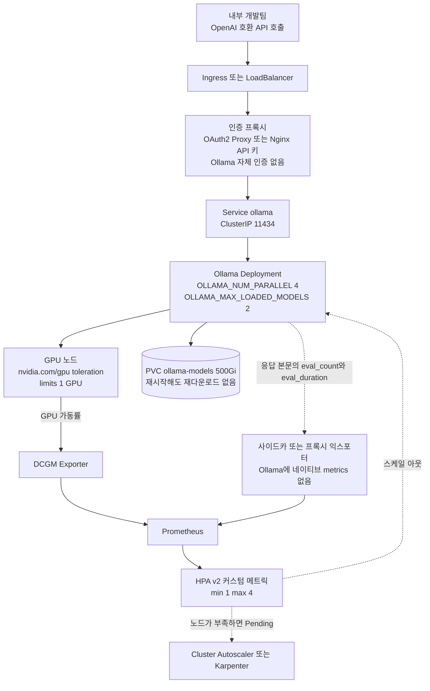

⏱️ **예상 읽기 시간**: 9분

Ollama는 실험 도구 수준을 넘어 팀 단위 인프라로 쓰이는 사례가 많아졌습니다. 로컬 Mac에서 `ollama run`으로 돌리는 것과 Kubernetes 클러스터에서 팀 전체가 쓰는 서빙 레이어로 운용하는 것은 설계가 완전히 다릅니다. 이 글은 후자를 다룹니다.

전체 구조를 먼저 보면 뒤에 나오는 조각들이 어디에 붙는지 잡힙니다.



점선은 기본 제공되지 않아 직접 세워야 하는 경로입니다. 아래 모니터링 절에서 이 부분을 따로 다룹니다.


*글의 핵심 개념을 형상화했습니다.*

## 왜 Ollama인가: vLLM과의 포지셔닝

vLLM은 처리량 최적화에 집중합니다. PagedAttention, continuous batching, FP8 추론처럼 GPU 자원을 극한까지 쓰는 데 초점이 있습니다. 반면 Ollama는 설치와 모델 관리의 단순함이 강점입니다. `ollama pull llama3:70b` 한 줄로 모델을 받고, OpenAI 호환 API 서버가 자동으로 뜹니다.

두 도구는 경쟁 관계라기보다 계층이 다릅니다. 처리량이 중요한 공개 인퍼런스 엔드포인트에는 vLLM이 맞고, 내부 개발팀이 쓰는 코드 보조 도구나 소규모 프라이빗 챗봇에는 Ollama의 운용 편의성이 더 적합합니다.

## 기본 Kubernetes 배포

### Namespace와 RBAC

```bash
kubectl create namespace ollama
kubectl label namespace ollama kueue.x-k8s.io/team=internal-tools
```

### GPU PersistentVolumeClaim

모델 파일은 수십 GB에서 수백 GB입니다. PVC를 쓰지 않으면 Pod가 재시작할 때마다 모델을 다시 다운로드합니다. 이건 운용상 재앙입니다.

```yaml
apiVersion: v1
kind: PersistentVolumeClaim
metadata:
  name: ollama-models
  namespace: ollama
spec:
  accessModes:
    - ReadWriteOnce
  storageClassName: nfs-retain    # 클러스터에 맞는 StorageClass 사용
  resources:
    requests:
      storage: 500Gi
```

여러 Pod가 같은 모델 볼륨을 공유해야 한다면 `ReadWriteMany`를 지원하는 StorageClass(NFS, CephFS, Azure Files 등)가 필요합니다. `ReadWriteOnce`면 Pod 하나에만 붙습니다.

### Deployment

```yaml
apiVersion: apps/v1
kind: Deployment
metadata:
  name: ollama
  namespace: ollama
spec:
  replicas: 1
  selector:
    matchLabels:
      app: ollama
  template:
    metadata:
      labels:
        app: ollama
    spec:
      tolerations:
      - key: nvidia.com/gpu
        operator: Equal
        value: present
        effect: NoSchedule
      containers:
      - name: ollama
        image: ollama/ollama:latest
        ports:
        - containerPort: 11434
        env:
        - name: OLLAMA_MODELS
          value: "/models"
        - name: OLLAMA_NUM_PARALLEL
          value: "4"         # 동시 요청 처리 수
        - name: OLLAMA_MAX_LOADED_MODELS
          value: "2"         # 메모리에 올려둘 최대 모델 수
        volumeMounts:
        - name: models
          mountPath: /models
        resources:
          limits:
            nvidia.com/gpu: "1"
            memory: "32Gi"
          requests:
            nvidia.com/gpu: "1"
            memory: "16Gi"
      volumes:
      - name: models
        persistentVolumeClaim:
          claimName: ollama-models
```

`OLLAMA_NUM_PARALLEL`은 동시에 처리할 요청 수를 제한합니다. GPU 메모리가 충분하지 않으면 여러 요청을 동시에 처리할 수 없습니다. 기본값(1)을 그대로 두면 요청이 직렬로 처리되어 응답 지연이 길어집니다.

### Service

```yaml
apiVersion: v1
kind: Service
metadata:
  name: ollama
  namespace: ollama
spec:
  selector:
    app: ollama
  ports:
  - port: 11434
    targetPort: 11434
  type: ClusterIP
```

클러스터 외부에서 접근이 필요하면 Ingress를 올리거나 LoadBalancer로 노출합니다. 인증 레이어가 없으므로 외부 노출 시 반드시 인증 프록시를 앞에 놓아야 합니다.

## Modelfile로 커스텀 모델 구성

Ollama의 Modelfile은 베이스 모델을 기반으로 시스템 프롬프트, 파라미터, 컨텍스트 길이를 고정한 커스텀 모델을 만드는 도구입니다.

```dockerfile
FROM llama3:8b

SYSTEM """
당신은 ThakiCloud 내부 코드 리뷰 도우미입니다.
Go, Kubernetes YAML, Python 코드에 특화되어 있습니다.
보안 취약점, 성능 문제, 코드 스타일을 순서대로 검토합니다.
"""

PARAMETER temperature 0.1      # 코드 리뷰는 낮은 temperature가 유리
PARAMETER num_ctx 8192          # 긴 파일을 다루려면 충분한 컨텍스트 필요
PARAMETER num_predict 2048
```

Modelfile을 빌드하고 배포하는 방법은 두 가지입니다.

**방법 1: InitContainer로 모델 프리로드**

```yaml
initContainers:
- name: model-puller
  image: ollama/ollama:latest
  command:
  - sh
  - -c
  - |
    ollama serve &
    sleep 5
    ollama pull llama3:8b
    # Modelfile을 ConfigMap으로 마운트한 뒤 build
    ollama create code-reviewer -f /modelfiles/Modelfile
    kill %1
  volumeMounts:
  - name: models
    mountPath: /models
  - name: modelfiles
    mountPath: /modelfiles
```

**방법 2: Job으로 별도 실행**

Pod가 뜬 뒤 별도 Job을 실행해 모델을 pull하고 Modelfile을 빌드합니다. 초기 배포 시 한 번만 돌리면 됩니다.

## 구조화된 출력(Structured Output)

Ollama는 `format` 파라미터로 JSON 출력을 강제할 수 있습니다.

```bash
curl http://ollama:11434/api/generate -d '{
  "model": "llama3:8b",
  "prompt": "다음 코드에서 보안 취약점을 찾아 JSON으로 반환해:",
  "format": "json",
  "stream": false
}'
```

Modelfile에서도 출력 형식을 시스템 프롬프트로 고정할 수 있습니다.

```dockerfile
SYSTEM """
요청에 대한 응답을 항상 다음 JSON 스키마로 반환합니다:
{"issues": [{"severity": "high|medium|low", "line": number, "description": string}]}
JSON 구조 외에 다른 텍스트를 포함하지 않습니다.
"""
```

실무에서는 `format: "json"`을 켜도 모델이 스키마를 완전히 지키지 않는 경우가 있습니다. 응답을 파싱한 뒤 스키마를 검증하는 레이어가 필요합니다.

## 모니터링: Ollama에는 네이티브 `/metrics`가 없습니다

여기서 먼저 짚고 갈 것이 있습니다. **Ollama는 Prometheus `/metrics` 엔드포인트를 제공하지 않습니다.** 이를 추가해 달라는 이슈가 열려 있고 연결된 PR도 아직 머지되지 않았습니다. ServiceMonitor를 만들어 `path: /metrics`로 붙여 두면 스크레이프가 조용히 실패하고, 대시보드는 빈 채로 남습니다. 배포 직후가 아니라 트래픽이 몰린 날 알게 되는 종류의 문제입니다.

실제로 쓸 수 있는 경로는 세 가지이고, 셋 다 직접 세워야 합니다.

**첫째, 응답 본문의 타이밍 필드입니다.** `/api/generate`와 `/api/chat` 응답에는 `eval_count`, `eval_duration`, `prompt_eval_count` 같은 필드가 들어 있습니다. 토큰 처리량과 지연을 여기서 계산할 수 있습니다. 다만 이건 호출자가 받는 값이라, 메트릭으로 만들려면 클라이언트나 프록시가 집계해 내보내야 합니다.

**둘째, 프록시 익스포터입니다.** 앞단에 이미 인증 프록시를 두고 있으므로 같은 자리에서 요청 수와 지연을 재는 것이 가장 저렴합니다. Ollama 앞에 서서 자체 포트로 메트릭을 노출하는 서드파티 익스포터도 있습니다. 어느 쪽이든 메트릭 이름은 그 익스포터가 정하는 것이지 Ollama가 정하는 것이 아니므로, 대시보드와 알림은 실제로 배포한 익스포터의 이름을 확인하고 작성해야 합니다.

**셋째, GPU 레벨은 DCGM Exporter가 덮습니다.** 이쪽은 Ollama와 무관하게 잘 동작합니다. GPU 노드에 DaemonSet으로 올리면 가동률과 메모리를 Prometheus로 보냅니다. 모델 서빙에서 정작 스케일 판단에 필요한 신호 대부분이 GPU 쪽에 있으므로, 하나만 먼저 붙인다면 이것을 붙이는 편이 낫습니다.

```yaml
# DCGM Exporter를 향한 ServiceMonitor. Ollama Pod가 아니라 GPU 익스포터를 스크레이프합니다.
apiVersion: monitoring.coreos.com/v1
kind: ServiceMonitor
metadata:
  name: dcgm-exporter
  namespace: ollama
spec:
  selector:
    matchLabels:
      app: dcgm-exporter
  endpoints:
  - port: metrics
    interval: 30s
```

## HPA 오토스케일링

GPU 기반 HPA는 GPU 가동률 메트릭을 기반으로 스케일합니다. NVIDIA의 DCGM Exporter를 통해 GPU 활용률을 Prometheus로 수집하면 HPA의 커스텀 메트릭으로 사용할 수 있습니다.

```yaml
apiVersion: autoscaling/v2
kind: HorizontalPodAutoscaler
metadata:
  name: ollama
  namespace: ollama
spec:
  scaleTargetRef:
    apiVersion: apps/v1
    kind: Deployment
    name: ollama
  minReplicas: 1
  maxReplicas: 4
  metrics:
  - type: Pods
    pods:
      metric:
        name: ollama_queue_depth    # 대기 중인 요청 수 (커스텀 메트릭)
      target:
        type: AverageValue
        averageValue: "10"
```

`ollama_queue_depth`는 예시 이름입니다. 앞 절에서 본 대로 Ollama가 직접 내보내는 메트릭이 아니므로, 프록시 익스포터가 실제로 노출하는 이름으로 바꿔야 합니다. 존재하지 않는 메트릭을 가리키는 HPA는 스케일하지 않고 조용히 앉아 있습니다. Prometheus Adapter 같은 어댑터로 커스텀 메트릭 API에 등록되어 있는지도 함께 확인해야 합니다.

GPU 노드가 부족하면 HPA가 스케일 아웃을 시도해도 Pod가 Pending 상태에 머뭅니다. Cluster Autoscaler나 Karpenter와 함께 써야 노드 레벨 스케일도 됩니다.

## 인증 프록시 패턴

Ollama 자체에 인증 기능이 없습니다. 팀 내부 서비스라도 인증 없이 열면 누구나 모델을 써버립니다. 간단한 방법은 OAuth2 Proxy나 Nginx에서 API 키를 검증하는 것입니다.

```yaml
# Nginx ConfigMap 예시
nginx.conf: |
  location / {
    if ($http_x_api_key != "your-team-key") {
      return 401;
    }
    proxy_pass http://ollama:11434;
  }
```

Keycloak 같은 IdP와 연동하면 팀별 접근 권한도 관리할 수 있습니다.

## 운용 팁

**모델 업데이트는 별도 Job으로 스케줄합니다.** `ollama pull`은 실행 중인 Pod와 함께 돌릴 수 있지만, 업데이트 중 용량 부족으로 Pod가 재시작하는 일이 생깁니다. 점검 시간에 Job으로 별도 실행하는 쪽이 안전합니다.

**`OLLAMA_MAX_LOADED_MODELS`를 GPU 메모리에 맞게 조정합니다.** 70B 모델 두 개를 동시에 올리면 VRAM이 부족합니다. 실제 VRAM 대비 모델 크기를 계산하고 이 값을 설정해야 합니다.

**로그 레벨을 조정합니다.** 기본 설정에서 Ollama는 요청마다 상세 로그를 남깁니다. `OLLAMA_DEBUG=false`로 프로덕션 로그를 줄일 수 있습니다.

## 정리

Ollama를 Kubernetes에서 제대로 운용하려면 모델 PVC, GPU toleration, 인증 프록시, 모니터링 네 가지를 갖춰야 합니다. 앞의 셋은 매니페스트를 쓰면 끝나지만 마지막 하나는 사정이 다릅니다. Ollama가 메트릭을 주지 않으므로 관측은 DCGM과 프록시 익스포터로 직접 조립해야 하고, 이 사실을 모르고 ServiceMonitor만 걸어 두면 모니터링을 갖췄다고 착각한 채로 운영하게 됩니다. Modelfile로 팀 전용 모델을 구성하면 시스템 프롬프트와 파라미터를 버전 관리할 수 있습니다. 처리량보다 운용 단순함이 중요한 내부 도구 서빙에서 Ollama는 설정 비용 대비 좋은 선택입니다.

## 참고 자료

- Ollama, [FAQ](https://docs.ollama.com/faq): `OLLAMA_NUM_PARALLEL` 기본값 1, `OLLAMA_MAX_LOADED_MODELS`, `OLLAMA_MODELS`
- Ollama, [Modelfile Reference](https://docs.ollama.com/modelfile): `FROM`, `SYSTEM`, `PARAMETER temperature`, `num_ctx`
- Ollama, [Structured Outputs](https://docs.ollama.com/capabilities/structured-outputs): `format` 파라미터
- Ollama, [Troubleshooting](https://docs.ollama.com/troubleshooting): `OLLAMA_DEBUG`
- ollama/ollama, [add /metrics endpoint (issue #3144)](https://github.com/ollama/ollama/issues/3144): 네이티브 Prometheus 엔드포인트는 미구현 상태의 열린 요청입니다
- Kubernetes, [HorizontalPodAutoscaler Walkthrough](https://kubernetes.io/docs/tasks/run-application/horizontal-pod-autoscale-walkthrough/) 및 [HPA v2 API Reference](https://kubernetes.io/docs/reference/kubernetes-api/autoscaling/horizontal-pod-autoscaler-v2/)
- NVIDIA, [dcgm-exporter](https://github.com/NVIDIA/dcgm-exporter): GPU 메트릭 DaemonSet
- vLLM, [Documentation](https://docs.vllm.ai/en/latest/): PagedAttention과 continuous batching

## 관련 슬라이드

본문 내용을 NotebookLM(`executive_report` 스타일)으로 요약한 슬라이드입니다.


