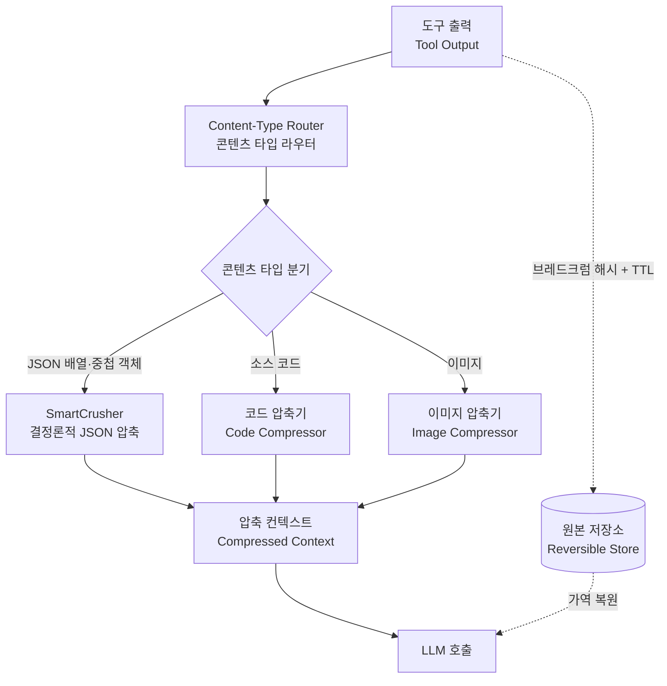

*컨텍스트는 공짜가 아닙니다. 흩어진 토큰을 무손실로 응축하는 것이 Headroom의 일입니다.*

## 개요

AI 코딩 에이전트를 매일 돌리는 팀이라면 가장 큰 숨은 비용이 어디서 나오는지 알고 있습니다. 바로 컨텍스트입니다. 도구 출력, RAG 결과, 로그, 파일, 대화 히스토리가 매 턴 쌓이고, 그 토큰이 그대로 청구서가 됩니다. 멀티에이전트 워크플로에서는 이 비용이 선형이 아니라 곱셈으로 늘어납니다. 서브에이전트 한 개가 큰 검색 결과 JSON을 컨텍스트에 넣을 때마다 캐시 read 토큰이 함께 불어나기 때문입니다.

이 글은 단순 도구 소개가 아닙니다. 저희 ThakiCloud는 이미 Headroom을 프로덕션 도구 체인에 채택해 운영 중이고, 이번에는 저희 repo의 실제 JSON 도구 출력 3종을 가져와 Headroom을 직접 돌렸습니다. 설치 명령, 통합 코드, 그리고 실측 토큰 절감 수치까지 재현 가능한 형태로 정리합니다. 결론을 먼저 말하면, 반복 구조가 강한 JSON일수록 절감이 크고, 저희 데이터에서는 토큰 기준 최대 71.2%까지 줄었습니다. 모든 수치는 샌드박스에서 실제로 측정한 값이며, 추정값을 섞지 않았습니다.

## Headroom이란 무엇인가

Headroom(PyPI 패키지명 `headroom-ai`, GitHub `chopratejas/headroom`)은 넷플릭스 출신 엔지니어 Tejas Chopra가 오픈소스화한 컨텍스트 압축 도구입니다. 표방하는 목표는 명확합니다. 도구 출력, 로그, 파일, RAG 청크를 LLM에 닿기 전에 압축해 토큰을 줄이되 답은 동일하게 유지하는 것입니다.

기존 컨텍스트 절감 도구들은 대부분 비가역입니다. 한 번 자르면 원본을 되돌릴 수 없습니다. Headroom의 핵심 차별점은 로컬에서 동작하고, 여러 콘텐츠 타입을 커버하며, 가역(reversible)이라는 점입니다. 원본은 설정된 TTL 안에서 브레드크럼 해시로 복원할 수 있습니다. 즉 "압축했더니 에이전트가 디테일을 잃었다"는 전형적 실패를 구조적으로 막습니다. 압축본을 우선 투입하고, 특정 섹션이 필요할 때만 원본을 복원하는 운영이 가능합니다.

붙이는 방식도 세 가지입니다. 라이브러리로 직접 호출하거나, 프록시로 끼우거나, MCP 서버로 띄울 수 있습니다. 콘텐츠 타입을 인식해서 JSON의 이상치만 남기거나 로그의 실패 라인만 남기는 식으로 선택적으로 압축합니다.

### 내부 구성: SmartCrusher가 핵심

Headroom은 콘텐츠 타입별로 다른 압축기를 라우팅합니다. 이번 실험에서 실제로 동작한 변환기는 라우터 로그에 `router:protected:user_message`, `router:mixed:...`로 찍혔습니다. 즉 사용자 메시지는 보호하고, 도구 메시지의 JSON 페이로드만 골라 압축한다는 뜻입니다.

- **SmartCrusher**: 딕셔너리 배열, 중첩 객체, 혼합 타입을 다루는 범용 JSON 압축기입니다. 반복 구조의 JSON 도구 출력(검색 결과, 로그 행, 레코드 리스트)에서 중복되는 키를 폴딩하고 스키마를 추론해 결정론적으로 줄입니다. 이번 측정에서 절감의 대부분을 책임진 컴포넌트입니다.
- **코드 압축기**: 소스 코드를 구조 인식으로 압축합니다.
- **이미지 압축**: 이미지 페이로드도 절감 대상입니다.

아래 다이어그램이 이번에 관측한 데이터 흐름입니다. 도구 출력이 라우터를 거쳐 SmartCrusher로 들어가고, 압축 컨텍스트가 LLM 호출로 가는 동안 원본은 별도로 보관되어 필요 시 가역 복원됩니다.


*Headroom 데이터 흐름: 도구 출력이 라우터를 거쳐 SmartCrusher로 압축된 후 LLM에 전달되며, 원본은 TTL 안에서 가역 복원됩니다. 도표를 클릭하면 크게 볼 수 있습니다.*

## 설치 및 통합

저희 환경의 Python 런타임은 단일 인터프리터(3.12.8) `.venv`로 통합되어 있습니다. 설치는 한 줄입니다.

```bash
VIRTUAL_ENV="$PWD/.venv" uv pip install "headroom-ai[code,relevance]"
```

`[code,relevance]` extra는 코드 구조 인식 압축과 관련도 기반 필터링을 켭니다. 평문 텍스트의 의미 기반 압축까지 쓰려면 추가 모델(약 261MB)이 필요하지만, 가장 효과가 큰 JSON 경로는 이 기본 설치만으로 동작합니다.

통합은 메시지 리스트를 그대로 넘기는 방식이 가장 단순합니다. 저희가 실제로 쓰는 래퍼(`scripts/headroom_compress.py`)의 핵심은 다음과 같습니다. 도구 출력을 `tool` 역할 메시지의 `content`로 넣고 `compress`를 호출하면 끝입니다.

```python
from headroom import compress

messages = [
    {"role": "user", "content": "Summarize this tool output"},
    {"role": "assistant", "content": None,
     "tool_calls": [{"id": "c1", "type": "function",
                     "function": {"name": "tool", "arguments": "{}"}}]},
    {"role": "tool", "tool_call_id": "c1", "content": raw_json_string},
]

result = compress(messages, model="claude-sonnet-4-5-20250929")
compressed = result.messages[-1]["content"]
print(result.tokens_before, "->", result.tokens_after, result.transforms_applied)
```

`compress`가 반환하는 객체에는 `tokens_before`, `tokens_after`, `transforms_applied`가 들어 있어, 압축이 실제로 무엇을 했는지 코드가 사후 검증할 수 있습니다. 모델이 자기보고하는 숫자가 아니라 라이브러리가 측정한 값이라는 점이 중요합니다. 저희는 여기에 더해 별도 토크나이저(tiktoken)로 한 번 더 교차 검증했습니다.

## 실제 실험 결과

실험은 격리된 git worktree 샌드박스에서 진행했습니다. 메인 작업 트리를 건드리지 않고, 결과만 evidence 디렉터리에 남기는 구조입니다. 테스트 데이터는 저희 repo의 실제 산출물 중 반복 구조가 뚜렷한 JSON 3종을 골랐습니다.

1. **skill_index.json**: 스킬 검색용 BM25 인덱스. 동일 스키마의 레코드가 대량 반복됩니다.
2. **seedance-prompts/raw-prompts.json**: 프롬프트 카탈로그 605개. 자연어 텍스트 비중이 높습니다.
3. **twitter timeline 아카이브**: 타임라인 레코드 1,385개. 동일 키 구조의 객체 배열입니다.

토큰 카운트는 `cl100k_base` 토크나이저로 측정했습니다. 바이트와 토큰을 모두 기록한 이유는, 압축이 단순 바이트 절감이 아니라 실제 청구 단위인 토큰에서 얼마나 효과가 있는지를 봐야 하기 때문입니다. 측정 결과는 다음과 같습니다.

| 테스트 데이터 | 원본 토큰 | 압축 토큰 | 토큰 절감 | 바이트 절감 | 소요 |
|---|---|---|---|---|---|
| skill_index (BM25 인덱스) | 1,618,287 | 465,445 | **71.2%** | 64.9% | 2.08s |
| twitter-timeline (레코드 배열) | 399,926 | 192,465 | **51.9%** | 57.0% | 0.24s |
| seedance-prompts (프롬프트 카탈로그) | 1,085,592 | 713,210 | **34.3%** | 38.5% | 0.57s |


*ThakiCloud repo의 JSON 도구 출력 3종에 대한 실측 절감률. 바이트와 토큰을 함께 표기했습니다.*

수치를 읽는 방법이 중요합니다. **반복 구조가 강할수록 절감이 큽니다.** skill_index는 동일 스키마 레코드가 빽빽하게 반복되는 인덱스라 SmartCrusher의 키 폴딩 효과가 극대화되어 토큰을 71.2%나 줄였습니다. twitter timeline도 균일한 객체 배열이라 절반 이상 절감했습니다. 반면 seedance-prompts는 자연어 프롬프트 텍스트가 레코드의 대부분을 차지해, 구조 압축으로 깎을 여지가 상대적으로 적어 34.3%에 그쳤습니다. 이 차이가 바로 "JSON 경로에서 가장 효과가 크다"는 설계 의도를 그대로 보여줍니다.

소요 시간도 주목할 만합니다. 160만 토큰짜리 인덱스를 2초 만에 처리했고, 나머지는 1초 미만입니다. 이 정도면 도구 출력이 컨텍스트로 들어가기 직전에 인라인으로 끼워도 체감 지연이 거의 없습니다. 결정론적 압축이라 같은 입력에는 항상 같은 출력이 나오고, 따라서 캐시 친화적이기도 합니다.

한 가지 정직하게 짚을 점이 있습니다. 위 수치는 한 번씩 측정한 단일 런 값이며, 데이터셋 3종에 대한 결과입니다. 다른 종류의 JSON, 특히 값이 거의 유니크하고 반복 키가 적은 데이터에서는 절감률이 더 낮게 나올 수 있습니다. 그래도 저희 실측 범위에서 토큰 기준 34~71%라는 폭은, 적어도 반복 구조 도구 출력에 대해서는 충분히 의미 있는 결과입니다.

## ThakiCloud K8s AI/ML SaaS 플랫폼 적용 및 시사점

저희가 Headroom을 채택한 지점은 정확히 위 실험이 보여준 곳입니다. 바로 **반복 구조의 대용량 JSON 도구 출력**입니다. 저희 컨텍스트 위생 룰(`ecc-token-strategy`)에는 이런 규칙이 명시되어 있습니다. 반복 구조의 JSON 배열 도구 출력은 컨텍스트에 넣기 전에 SmartCrusher로 결정론적으로 압축한다, 평문은 압축 대상이 아니라 JSON 경로에 한정한다, 그리고 우선순위는 서브에이전트 요약이 먼저고 그다음이 headroom 압축이다.

이것이 K8s 위 멀티에이전트 오케스트레이션에서 특히 중요한 이유는 비용의 구조 때문입니다. 다수의 서브에이전트가 도는 워크플로에서 컨텍스트 위생은 곧 세 가지를 동시에 의미합니다. 첫째는 토큰 비용 통제입니다. 둘째는 캐시 히트율 관리입니다. 결정론적 압축은 동일 입력에 동일 출력을 보장하므로 프롬프트 캐시를 깨지 않습니다. 셋째는 응답 지연 관리입니다. 컨텍스트가 작을수록 모델이 더 빨리 응답합니다.

저희 LLM 서빙은 K8s 위에서 Kueue로 GPU 워크로드를 스케줄링하고, 다수의 추론 요청이 동시에 흐릅니다. 이 환경에서 컨텍스트가 비대해지면 그 비용은 한 요청에 그치지 않고 전체 처리량을 갉아먹습니다. Headroom은 이 레이어를 코드를 거의 바꾸지 않고 끼워 넣을 수 있게 해줍니다. 검색 결과나 로그 배열을 컨텍스트에 넣기 직전에 한 줄로 압축하고, 특정 섹션이 필요할 때만 가역 복원하는 운영이 가능합니다.

데이터 사이언티스트 관점에서도 실용적입니다. RAG 파이프라인에서 검색된 청크가 반복 메타데이터(소스 URL, 타임스탬프, 점수 같은 동일 키)를 잔뜩 달고 오는 경우, 그 메타데이터 부분이 바로 SmartCrusher가 가장 잘 깎는 영역입니다. 본문은 보존하면서 구조적 군더더기만 줄이므로, 검색 정확도를 희생하지 않고 컨텍스트 예산을 확보할 수 있습니다.

## 한계 및 반론

이 도구를 무비판적으로 권하지는 않습니다. 솔직한 한계와 반론을 정리합니다.

**첫째, 로컬 실행이 전제입니다.** Headroom은 로컬 프로세스를 실행할 수 있어야 동작하므로, 샌드박스로 완전히 격리된 실행 환경에서는 쓸 수 없습니다. 이 제약이 맞지 않는 배포 형태가 분명히 있습니다.

**둘째, 평문에는 효과가 제한적입니다.** 위 seedance-prompts 결과가 보여주듯, 자연어 텍스트 비중이 높은 데이터는 구조 압축으로 깎을 여지가 적습니다. 평문까지 의미 기반으로 줄이려면 추가 모델을 설치해야 하고, 그 경로는 결정론성과 속도를 일부 포기하게 됩니다.

**셋째, 단일 프로바이더만 쓰는 팀에는 과잉일 수 있습니다.** 한 모델 프로바이더의 네이티브 compaction만으로 충분하고 크로스 에이전트 메모리가 필요 없다면, 별도 압축 레이어를 도입하는 운영 부담이 이득보다 클 수 있습니다.

**넷째, 가장 강한 반론은 "그냥 서브에이전트로 요약하면 되지 않나"입니다.** 실제로 저희 룰의 우선순위도 서브에이전트 요약이 headroom 압축보다 앞섭니다. 요약은 비가역이지만 절감 폭이 훨씬 크고 의미 단위로 압축됩니다. 그렇다면 Headroom의 자리는 어디인가. 답은 "요약하면 디테일을 잃는데, 그 디테일이 나중에 필요할지 모를 때"입니다. 가역성이 바로 이 빈틈을 메웁니다. 압축본으로 평소에 돌다가, 특정 레코드의 원본이 필요해지는 순간 TTL 안에서 정확히 복원합니다. 요약과 압축은 경쟁 관계가 아니라 보완 관계입니다.

정리하면 Headroom은 "컨텍스트는 공짜가 아니다"라는 원칙을 가역 압축이라는 구체적 설계로 구현한 사례입니다. 저희 실측 범위에서 반복 구조 JSON에 대해 토큰을 34~71% 줄였고, 결정론성과 가역성 덕분에 캐시를 깨지 않으면서 디테일도 잃지 않았습니다. ThakiCloud가 컨텍스트 위생을 어떻게 비용과 신뢰성 문제로 다루는지에 관심 있는 엔지니어라면, 이런 레이어를 프로덕션에서 직접 운영하는 곳이 저희입니다.

---

출처: Headroom (headroom-ai), PyPI https://pypi.org/project/headroom-ai/ · GitHub https://github.com/chopratejas/headroom (작성자 Tejas Chopra). 본문 수치는 ThakiCloud repo 데이터로 직접 측정한 실측값입니다.
