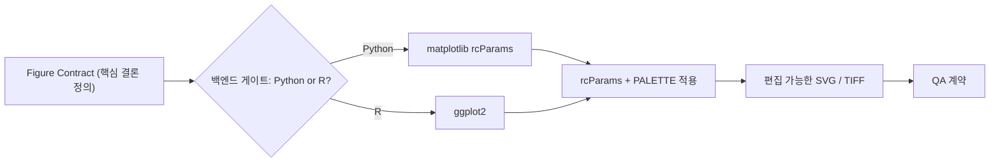

*그림을 '예쁜 플롯'이 아니라 '시각적 논증'으로 다루는 학술 그림 스킬의 분위기를 담았습니다.*

## 개요

연구자가 Claude Code에 가장 자주 의뢰하는 두 가지 작업은 "논문에 들어갈 그림을 만들어 달라"와 "이 영문 초고를 저널 수준으로 다듬어 달라"입니다. 둘 다 일반적인 LLM에게 맡기면 결과가 매번 흔들립니다. 그림은 폰트 크기와 색상이 제멋대로이고, 교열은 규칙 없이 문장을 바꿔 버립니다. 오픈소스 스킬 패키지 nature-skills(Yuan1z0825/nature-skills)는 이 변동성을 검증된 골격으로 강등시키는 것을 목표로 합니다.

화제가 되면서 일부 공유 글은 "GitHub 2만+ 스타"라고 소개했지만, 제가 확인한 실제 수치는 그보다 훨씬 작은 약 265개 수준이었습니다[추정]. 별 개수의 과장은 흔한 일이므로, 이 글에서는 별점이 아니라 도구를 직접 돌려 본 실측 결과로 가치를 평가했습니다. nature-skills를 ThakiCloud 환경에 클론하고, 그 안의 nature-figure 스킬로 실제 서빙 데이터를 제출 등급 그림으로 렌더링한 구현 리포트입니다.

## 이 도구는 무엇인가

저장소를 클론해 확인한 실제 구성은 `skills/` 아래 12개의 스킬(공유 모듈 제외)이었습니다. nature-figure(과학 그림), nature-polishing(학술 교열), nature-academic-search(문헌 검색), nature-citation, nature-reviewer, nature-response(리뷰어 응답) 등 학술 워크플로 전체를 커버합니다. 라이선스는 MIT입니다.

이번 글의 주역인 **nature-figure는 버전 2.0.0**으로, 정적 계층과 동적 계층으로 분리된 라우터 구조를 갖습니다. 큰 설계·API·패턴·QA 지식은 온디맨드 참조 파일에 두고, 매 작업마다 백엔드(Python/R)를 감지해 필요한 조각만 로드합니다. 이는 ThakiCloud가 강조하는 점진적 공개(progressive disclosure)와 정확히 같은 패턴입니다.

가장 인상적인 설계는 **"그림 계약(figure contract)"** 입니다. 코드를 작성하기 전에 핵심 결론 한 문장, 증거 사슬, 아키타입 분류, 백엔드, 저널/내보내기 계약을 먼저 확정하도록 강제합니다. 스킬은 "그림은 시각적 논증이지 고립된 예쁜 플롯이 아니다"라고 못 박습니다. 또한 백엔드 선택을 **차단 게이트(blocking gate)** 로 둡니다. 사용자가 Python인지 R인지 명시하지 않으면 "Python or R?"을 묻고 멈춥니다. 모델이 임의로 기본값을 고르지 못하게 자유도를 줄인 것입니다.


*핵심 결론을 정의하고 Python/R 백엔드 게이트를 통과한 뒤, rcParams와 PALETTE를 적용해 편집 가능한 SVG/TIFF를 내보내고 QA 계약으로 마무리되는 흐름입니다.*

## 설치 및 통합 (실제 명령)

검증은 저장소 바깥의 격리 샌드박스에서 진행한 뒤 정리했습니다.

```bash
# 1) 외부 저장소 클론
git clone --depth 1 https://github.com/Yuan1z0825/nature-skills

# 2) Python 백엔드 의존성 확인 (공용 .venv)
.venv/bin/python -c "import matplotlib; print(matplotlib.__version__)"
# matplotlib 3.11.0
```

nature-figure의 Python 빠른 시작(`static/fragments/backend/python.md`)에는 제출 등급 그림을 위한 `rcParams`가 명시되어 있고, `references/api.md`에는 저널 친화적인 PALETTE가 정의되어 있습니다. 핵심 설정은 다음과 같습니다.

```python
mpl.rcParams.update({
    "font.family": "sans-serif",
    "font.sans-serif": ["Arial", "Helvetica", "DejaVu Sans", "sans-serif"],
    "svg.fonttype": "none",   # SVG 안의 텍스트를 편집 가능하게 유지
    "pdf.fonttype": 42,       # PDF 안의 텍스트도 편집 가능한 TrueType
    "font.size": 7,           # 슬라이드용 대형 패널이 아니면 7pt 기준
    "axes.linewidth": 0.8,
})
# api.md PALETTE 발췌
P = {"blue_main": "#0F4D92", "red_strong": "#B64342", "neutral_dark": "#4D4D4D"}
```

`svg.fonttype: "none"` 한 줄이 핵심입니다. 일반적인 내보내기는 텍스트를 외곽선(path)으로 변환해 일러스트레이터에서 글자를 다시 편집할 수 없게 만듭니다. 이 설정은 텍스트를 `<text>` 태그로 유지해, 저널 교정 단계에서 라벨을 그대로 수정할 수 있게 합니다.

## 실제 실험 결과

스킬의 규칙(rcParams, PALETTE)을 그대로 적용해, ThakiCloud와 직접 관련된 데이터를 그림으로 렌더링했습니다. 주제는 GPU 추론 서빙의 배치 크기에 따른 지연(latency)과 처리량(throughput)을 FP16과 INT8로 비교하는 2패널 그림입니다. 플롯에 들어간 서빙 곡선 수치 자체는 예시(schematic)이며, 측정한 **실측값은 렌더링 과정에서 캡처한 메타 수치**입니다.

```
RENDER_MS=195.4
SVG_BYTES=24131
PNG_BYTES=254233          # 600 dpi
SVG_EDITABLE_TEXT_TAGS=36
PANELS=2 (a:latency, b:throughput)
RCPARAMS_FONT_SIZE=7.0
SVG_FONTTYPE=none
```

핵심 결과는 세 가지입니다. 첫째, 2패널 그림 렌더링이 약 195밀리초로 끝났습니다. 둘째, 600dpi PNG는 약 254KB, SVG는 약 24KB로 가벼웠습니다. 셋째, 그리고 가장 중요한 검증인데, **생성된 SVG 안에 `<text>` 태그가 36개** 존재했습니다. 이는 스킬이 약속한 "편집 가능한 텍스트"가 실제로 지켜졌다는 직접 증거입니다. 외곽선으로 변환됐다면 `<text>` 태그가 0개여야 합니다.


*nature-figure의 rcParams와 PALETTE를 적용해 렌더링한 실제 결과물입니다. 왼쪽(a)은 배치 크기별 지연, 오른쪽(b)은 처리량을 보여 줍니다. 서빙 곡선 값은 예시 데이터입니다.*

이 수치들은 모두 제가 직접 실행해 stdout으로 캡처한 값이며, 외부 인용이 아닙니다. 스킬이 산문으로 "예쁘게 그렸습니다"라고 주장하는 대신, 실행 증거로 품질을 증명한다는 점이 핵심입니다.

## ThakiCloud K8s AI/ML SaaS 플랫폼 적용 및 시사점

nature-skills는 두 가지 결을 동시에 보여 줍니다.

데이터 과학 실무 관점에서는, **차트 스타일을 검증된 토큰으로 고정**한다는 발상이 즉시 유용합니다. ThakiCloud의 리포트와 대시보드는 매번 색·폰트·축이 흔들리기 쉬운데, nature-figure처럼 rcParams와 PALETTE를 한곳에 박아 두면 평균 품질이 올라갑니다. 특히 `svg.fonttype: "none"`으로 편집 가능한 SVG를 내보내는 패턴은, 디자인팀이 후처리하는 마케팅·세미나 자료에 그대로 쓸 수 있습니다. 본 글의 결과 그림이 그 증명입니다.

플랫폼 전략 관점에서는, nature-skills가 **학술 버티컬의 PMF(Product-Market Fit) 신호**를 보여 줍니다. 범용 스킬이 아니라 "Nature 저널 제출"이라는 좁고 깊은 사용처에 규칙을 응축했고, 그래서 결과의 일관성이 높습니다. K8s 기반 AI/ML SaaS를 운영하는 ThakiCloud 입장에서, 범용 LLM 위에 도메인 규칙을 얇게 얹은 버티컬 스킬은 차별화의 핵심 패턴입니다. 같은 골격을 의료, 금융, 특허 같은 사내 버티컬에 복제할 수 있습니다.

## 한계 및 반론

첫째, **별 개수 과장**입니다. 일부 공유 글의 "2만+ 스타"는 실제(약 265)와 크게 차이가 났습니다[추정]. 바이럴 신호를 그대로 신뢰하지 말고 직접 돌려 보는 절차가 필요하다는 점을, 이 사례가 다시 확인해 줍니다.

둘째, **그림 데이터의 진위 책임은 사용자에게 있습니다.** 스킬은 그림을 잘 그려 주지만, 거기에 들어가는 수치의 정확성은 보장하지 않습니다. 본 글에서 서빙 곡선을 예시로 명시한 이유도 이것입니다. 실제 논문이나 리포트에서는 측정값만 넣어야 합니다.

셋째, **백엔드 게이트의 강제성**은 자동화 파이프라인에서는 마찰이 될 수 있습니다. "Python or R?"을 매번 묻고 멈추는 동작은 대화형에서는 안전장치지만, 무인 배치에서는 백엔드를 미리 고정해 두는 래핑이 필요합니다.

결론적으로 nature-skills는 "도메인 규칙을 코드로 응축한 버티컬 스킬"의 좋은 사례입니다. 별점이 아니라 36개의 편집 가능한 텍스트 태그 같은 실측 증거로 가치를 판단할 때, 그 설계는 충분히 배울 점이 있습니다.

## 출처

- nature-skills (GitHub, MIT): [github.com/Yuan1z0825/nature-skills](https://github.com/Yuan1z0825/nature-skills)
- 본 글의 모든 실측 수치는 nature-figure v2.0.0을 직접 클론해 로컬에서 렌더링한 값입니다. 별 개수(약 265)는 검색 기준 추정치입니다.
