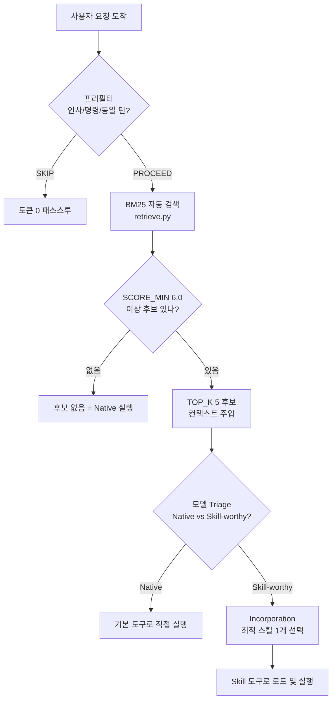

## 개요: 스킬 폭증이 만들어낸 문제

AI 에이전트 시스템을 오래 운영하다 보면 자연스럽게 스킬이 쌓입니다. 처음에는 수십 개, 어느새 수백 개, 그리고 어느 날 카탈로그를 열어보니 1,620개가 되어 있습니다. ThakiCloud의 Claude Code 기반 에이전트 인프라가 지금 그 상태입니다. 로컬 스킬 약 1,620개, 서브에이전트 55개, always-on 룰 36개, 슬래시 커맨드 22개, 훅 12개가 함께 돌아가고 있습니다.

여기서 처음 맞닥뜨리는 직관은 "스킬이 많을수록 에이전트가 더 강해진다"는 것입니다. 틀렸습니다. 스킬이 많아지면 에이전트는 오히려 느려지고, 잘못된 스킬을 집어들거나, 아무 스킬도 쓰지 않고 날것 그대로 답하기 시작합니다. 문제는 스킬 수가 아니라 라우팅이었습니다.

이 글은 1,600개가 넘는 스킬 생태계를 1인으로 운영하면서 체득한 라우팅 설계 원칙을 기록합니다. Skill Retrieval Augmentation(SRA, arXiv:2604.24594)을 실제 운영 환경에 어떻게 적용했는지, BM25 게이트가 무엇을 하는지, description 품질이 왜 검색 정확도를 결정하는지, 그리고 솔직히 무엇이 아직 부족한지를 다룹니다.

## 스킬이 많으면 왜 느려지나: 노이즈 세금

Claude Code의 컨텍스트 창은 유한합니다. 스킬 목록 전체를 매 턴 컨텍스트에 넣으면 실제 작업에 쓸 수 있는 토큰이 줄어듭니다. 이것이 "노이즈 세금"입니다. 1,620개 스킬의 이름과 짧은 설명만 나열해도 수만 토큰에 달합니다. 이걸 매 턴 주입하면 비용이 폭증하고, 모델은 관련 없는 스킬 이름들 사이에서 길을 잃습니다.

더 심각한 문제는 "억지 매칭"입니다. 모델이 스킬 목록에서 이름이 조금 겹치는 스킬을 잘못 집어드는 현상입니다. 예를 들어 "버그 고쳐줘"라는 간단한 요청에 `4phase-debugging` 스킬을 로드해 복잡한 워크플로를 실행하거나, 단순 파일 편집에 `technical-writer` 스킬을 꺼내는 식입니다. 스킬이 많아질수록 이 노이즈 확률은 높아집니다.

SRA 논문(arXiv:2604.24594)은 이 문제를 "1000개 이상 스킬 환경에서 디스트랙터 노이즈가 정확도의 주요 위험"으로 정의합니다. 해결 방향은 명확합니다. 스킬 전체를 에이전트에게 보여주는 것이 아니라, 현재 요청에 실제로 관련 있는 소수 후보만 걸러내는 것입니다.

## SRA + BM25 2단 게이트

ThakiCloud가 채택한 구조는 SRA 논문의 3단계 프로토콜과 BM25 기반 자동 게이트를 결합한 것입니다.



### Stage 1: Retrieval - BM25 자동 검색

`skill-router-gate.py` 훅이 `UserPromptSubmit` 이벤트에 배선되어 있습니다. 사용자가 프롬프트를 제출하는 순간, 이 훅이 먼저 실행됩니다.

훅의 첫 번째 단계는 프리필터입니다. 인사("안녕하세요"), 단순 확인("알겠어"), 순수 명령(파일 경로 직접 편집)은 BM25 검색 없이 즉시 패스스루합니다. 이미 명시적 스킬 트리거 키워드(`/review`, `/debug` 등)가 있으면 그 스킬로 강제 라우팅합니다.

두 번째 단계는 BM25 검색입니다. `retrieve.py`가 SKILL.md frontmatter, 에이전트 정의, 스킬 카탈로그를 BM25로 인덱싱해 둔 상태에서 현재 쿼리와 관련도를 계산합니다. IDF 가중과 한영 교차 동의어 사전(25개 이상 어휘 쌍)을 활용해 1,200개 이상의 스킬을 실시간으로 좁힙니다. 점수가 SCORE_MIN(6.0) 이상인 후보만, 최대 TOP_K(5개)를 추려 컨텍스트에 주입합니다. 직전 턴과 동일한 요청이면 재주입을 생략합니다. 모든 라우팅 결과는 `state/skill-router.jsonl`에 로깅됩니다.

### Stage 2: Triage - Native vs Skill-worthy

모델이 주입된 후보 목록을 보고 현재 작업의 성격을 판단합니다.

- Native 작업: 파일 편집, git 명령, 간단한 Q&A, 코드 한 줄 수정, grep. 내장 도구만으로 충분한 작업입니다. 스킬 로드 없이 바로 실행합니다.
- Skill-worthy 작업: 구조화된 글쓰기, 멀티 도메인 코드 리뷰, 파이프라인 오케스트레이션, 도메인 특화 분석, 문서 생성. 체크리스트나 워크플로가 있는 스킬에서 이득을 보는 작업입니다.

판단이 애매하면 Native가 기본값입니다. 스킬 로드의 오버헤드를 감수할 만큼 구조화된 워크플로가 필요한가를 기준으로 삼습니다.

### Stage 3: Incorporation - 최적 스킬 1개 선택

Skill-worthy로 분류되면 BM25가 제시한 후보 중 하나를 선택하고, 선택 이유를 한 문장으로 명시한 뒤 Skill 도구로 로드합니다. 후보가 2개 이상이고 동점 수준이면 사용자에게 물어봅니다. 후보가 없으면 Native로 돌아갑니다. 억지 매칭은 하지 않습니다.

에이전트 전용 풀도 별도로 관리합니다. 서브에이전트 55개는 일반 스킬 풀과 분리된 인덱스에서 검색해, 사용자 요청 스킬과 오케스트레이션 에이전트가 혼선 없이 라우팅됩니다.

## description 품질 규율

BM25의 정확도는 결국 각 스킬의 description 품질에 달려 있습니다. BM25는 텍스트를 읽습니다. description이 모호하면 유사 스킬들이 같은 쿼리에서 비슷한 점수를 받아 잘못된 후보가 올라옵니다.

ThakiCloud가 강제하는 description 형식은 세 요소로 구성됩니다.

```yaml
description: >-
  [스킬이 하는 것 - 한 문장, 3인칭].
  Use when [영어+한국어 트리거 키워드].
  Do NOT use for [이 스킬이 아닌 경우] (use [인접 스킬명]).
```

첫 문장은 능력(capability)입니다. "무엇을 하는가"를 동사 하나로 정의합니다. 두 번째 문장은 발화 트리거입니다. 영어와 한국어를 모두 포함해야 합니다. 한국어 요청은 한국어 트리거가, 영어 요청은 영어 트리거가 매칭됩니다. 한쪽만 있으면 절반의 쿼리를 놓칩니다. 세 번째 문장은 경계(boundary)입니다. "이 스킬로 오면 안 되는 패턴"과 "대신 써야 하는 인접 스킬"을 명시합니다. 이것이 disambiguation의 핵심입니다.

description은 1,024자 이내여야 합니다. BM25 인덱싱 효율과 컨텍스트 주입 비용을 고려한 상한입니다.

2026-06-22에 도입한 추가 규율은 Skill IR(Intent-Trigger schema)입니다. 복잡한 신규 스킬을 만들기 전에 6개 필드를 먼저 채웁니다: intent(어떤 단일 문제를 푸는가), triggers(영문+한글 발화 키워드), inputs(무엇을 받나), outputs(무엇을 내놓나), boundaries(안 하는 것+인접 스킬), references(의존 스크립트/룰). 이 IR을 먼저 고정하면 트리거 충돌과 중복 스킬이 description 작성 단계에서 걸러집니다. 단순한 스킬에는 적용하지 않습니다.

실패에서 추출한 교훈이 하나 있습니다. "스킬 이름이 그럴싸하면 description이 대충이어도 찾겠지"는 착각입니다. BM25는 이름이 아니라 description 전문을 봅니다. 이름이 멋져도 description에 트리거가 없으면 검색에 걸리지 않습니다.

## 측정: 무엇이 개선됐나

벤치마크 방법론을 먼저 밝힙니다. 아래 수치는 63개 케이스로 구성된 골드셋(gold set) 벤치 결과입니다. 실제 운영 환경에서 매 턴 측정한 값이 아닙니다. 엔진의 잠재 정확도를 측정한 것으로, 운영 정확도는 다를 수 있습니다.

라우터 수리 전후 비교(sra-bench 63케이스 기준):

| 지표 | 수리 전 | 수리 후 |
|------|---------|---------|
| Recall@5 | 44.0% | 73.3% |
| Gated(게이트 통과율) | - | 53.3% |
| Top-1 정확도 | - | 31.1% |
| 환각(잘못된 스킬 로드) | 10.0% | 0.0% |

수리 전 Recall@5 44%는 관련 스킬이 후보 5개 안에 절반도 안 들어왔다는 의미입니다. 이 상태에서 모델이 아무리 잘 골라도 정답이 없는 경우가 절반이었습니다. 수리 후 73.3%로 올랐고, 환각(존재하지 않거나 완전히 무관한 스킬을 로드하는 현상)은 0%로 떨어졌습니다.

개선의 주요 원인은 세 가지였습니다. 첫째, description에 한국어 트리거가 없었던 스킬들을 일괄 보완했습니다. 둘째, 인접 스킬끼리 description이 겹쳐 점수 충돌을 일으키던 케이스를 Do-NOT-use 절로 분리했습니다. 셋째, BM25 SCORE_MIN 임계값을 튜닝해 점수 낮은 노이즈 후보가 컨텍스트에 들어가지 않도록 했습니다.

Top-1 정확도 31.1%는 여전히 낮습니다. 후보 5개 안에 정답이 있는 73%와의 차이가 바로 "모델이 후보 중에서 최적을 고르는 능력"에 해당합니다. 이 부분은 description 개선으로 계속 올릴 수 있는 영역이지만, 현재 천장은 [추정] 50%대입니다.

복합 요청(예: "리서치하고 팩트체크해서 docx로 만들어 슬랙에 올려줘")에 대한 별도 실험도 진행했습니다. 12개 케이스 기준으로 단일 쿼리 retrieve(SINGLE) 전략의 step_coverage는 32.8%였습니다. 하나의 쿼리로 여러 단계를 묶어 검색하면 뒤 단계 스킬들이 누락되는 현상입니다. 이 문제는 현재 완전히 해결되지 않았으며, 복합 요청은 에이전트가 sub-task로 분해해 각각 retrieve하는 방식으로 부분적으로 보완하고 있습니다.

## Praxis로의 제품화

이 라우팅 구조는 ThakiCloud의 SaaS 제품 Praxis에서 동일한 원리로 일반화됩니다. Praxis의 스킬 라우터는 2단 구조입니다. 1단은 다수 스킬 풀에서 도메인 후보를 좁히고, 2단은 7가지 요소(의도 일치도, 트리거 커버리지, 경계 위반 여부, 입력 충족도, 출력 적합성, 참조 의존성, 컨텍스트 비용)를 평가해 최적 스킬을 선택합니다.

핵심 차이는 규모의 다각화입니다. Claude Code 로컬 운영에서는 단일 에이전트가 1,600개 스킬을 보지만, Praxis에서는 테넌트별로 스킬 풀이 분리되고 라우터가 각 테넌트의 컨텍스트에 맞게 재조정됩니다. 1인 운영에서 검증한 BM25 + 게이트 + description 규율이 멀티테넌트 제품에 그대로 적용됩니다.

제품화 과정에서 가장 크게 바뀌는 부분은 description 작성 책임입니다. 로컬 운영에서는 운영자가 직접 description을 쓰고 벤치로 검증합니다. Praxis에서는 고객이 스킬을 등록할 때 description 품질을 자동으로 점검하는 게이트가 필요합니다. 이 게이트가 없으면 고객이 등록한 스킬들이 충돌하면서 라우팅 정확도가 떨어집니다. 현재 이 게이트는 개발 중입니다.

## 한계 및 교훈

솔직하게 정리합니다.

**BM25의 한계**: BM25는 어휘 일치 기반 검색입니다. "코드 리뷰해줘"와 "PR 피드백 줘"는 의미상 같지만 어휘가 다릅니다. 동의어 사전으로 일부 보완하지만 한계가 있습니다. 시맨틱 검색(임베딩 기반)을 BM25와 결합하는 하이브리드 방식이 이론상 더 정확합니다. 다만 임베딩 계산 비용과 인덱스 관리 복잡도를 고려해 아직 채택하지 않았습니다.

**골드셋 벤치 vs 운영 현실**: 측정 섹션에서 언급한 수치는 미리 준비한 63개 케이스에 대한 결과입니다. 실제 사용에서는 예상치 못한 표현, 복합 요청, 도메인 경계 케이스가 섞입니다. 벤치 수치가 운영 경험과 다를 수 있습니다.

**스킬 유지보수 비용**: 1,620개 스킬을 개별로 업데이트하는 것은 불가능합니다. description이 오래되면 트리거가 어긋나고 정확도가 떨어집니다. 현재는 야간 자동화 루프로 일부 스킬을 갱신하고 있지만, 전체 스킬의 freshness를 보장하는 체계적 방법은 없습니다.

**복합 요청 분해**: 앞서 언급한 것처럼 여러 단계를 아우르는 복합 요청은 현재 라우팅이 약합니다. 에이전트가 sub-task를 스스로 분해해 각 단계를 retrieve하는 방식이 Oracle 조건에서 step_coverage 42.5%로 단일 retrieve(32.8%)보다 높지만, 이 천장도 낮습니다. 복합 요청 라우팅은 description 품질 개선과 함께 추가 연구가 필요한 영역입니다.

**"스킬이 많다고 좋은 게 아니다"**: 이 문장이 이 글의 핵심입니다. 스킬은 세금입니다. 컨텍스트 비용, 유지보수 비용, 라우팅 노이즈를 높입니다. 스킬을 추가하기 전에 "이 스킬이 없으면 에이전트가 틀리나?"를 먼저 물어야 합니다. 이 질문에 "아니오"라고 답하면 스킬을 만들지 말아야 합니다.

1,620개는 많은 수입니다. 그러나 그중 매일 활성으로 쓰이는 스킬은 훨씬 적습니다. 나머지는 라우팅이 잘 되어 있어야만 필요할 때 꺼낼 수 있는 잠재 자산입니다. 라우팅이 없으면 그것들은 노이즈가 됩니다.

SRA + BM25 게이트 + description 품질 규율은 그 잠재 자산을 실제로 쓸 수 있게 만드는 인프라입니다. 완벽하지 않고 계속 개선 중이지만, 방향은 맞습니다.
