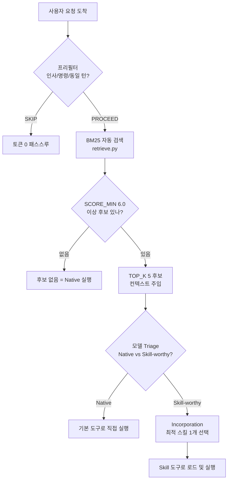

AI 에이전트에 스킬을 계속 추가하고 있는 운영자라면 이 글이 도움이 됩니다. 결론부터 말하면, 스킬이 많을수록 에이전트가 강해진다는 직관은 틀렸고 라우팅이 없으면 스킬은 그냥 세금입니다.

ThakiCloud의 Claude Code 기반 에이전트 인프라는 지금 로컬 스킬 약 1,620개, 서브에이전트 55개, always-on 룰 36개, 슬래시 커맨드 22개, 훅 12개가 함께 돌아갑니다. 이 규모에 도달하면 스킬을 하나 더 넣는 일이 이득이 아니라 손해가 되는 지점이 옵니다. 모델이 관련 없는 스킬 이름들 사이에서 길을 잃고, 이름이 조금 겹치는 엉뚱한 스킬을 집어들거나, 아예 아무 스킬도 안 쓰고 날것으로 답하기 시작합니다.

## 스킬이 많으면 왜 느려지나

Claude Code의 컨텍스트 창은 유한합니다. 1,620개 스킬의 이름과 짧은 설명만 나열해도 수만 토큰입니다. 이걸 매 턴 주입하면 실제 작업에 쓸 토큰이 줄고 비용은 폭증합니다. 더 나쁜 건 정확도가 함께 떨어진다는 점입니다. "버그 고쳐줘"라는 간단한 요청에 `4phase-debugging` 스킬이 딸려 나와 복잡한 워크플로를 돌리거나, 단순 파일 편집에 `technical-writer`가 튀어나오는 억지 매칭이 스킬 수에 비례해 잦아집니다.

SRA 논문(arXiv:2604.24594)은 이를 "1,000개 이상 스킬 환경에서 디스트랙터 노이즈가 정확도의 주요 위험"이라고 정의합니다. 처방은 분명합니다. 스킬 전체를 매번 보여주지 말고, 지금 요청에 실제로 관련 있는 소수 후보만 걸러서 보여주면 됩니다.

## SRA + BM25 2단 게이트

ThakiCloud가 쓰는 구조는 SRA 논문의 3단계 프로토콜에 BM25 자동 게이트를 결합한 것입니다.

```mermaid
flowchart TD
    A[사용자 요청 도착] --> B{프리필터<br/>인사/명령/동일 턴?}
    B -- SKIP --> C[토큰 0 패스스루]
    B -- PROCEED --> D[BM25 자동 검색<br/>retrieve.py]
    D --> E{SCORE_MIN 6.0<br/>이상 후보 있나?}
    E -- 없음 --> F[후보 없음 = Native 실행]
    E -- 있음 --> G[TOP_K 5 후보<br/>컨텍스트 주입]
    G --> H{모델 Triage<br/>Native vs Skill-worthy?}
    H -- Native --> I[기본 도구로 직접 실행]
    H -- Skill-worthy --> J[Incorporation<br/>최적 스킬 1개 선택]
    J --> K[Skill 도구로 로드 및 실행]
```

첫 관문은 검색입니다. `skill-router-gate.py` 훅이 사용자가 프롬프트를 제출하는 `UserPromptSubmit` 순간에 먼저 실행됩니다. 인사나 단순 확인, 파일 경로를 직접 편집하는 순수 명령은 검색을 건너뛰고 토큰 0으로 통과시킵니다. `/review`, `/debug` 같은 명시적 트리거가 있으면 그 스킬로 바로 보냅니다. 그 외의 진짜 작업성 요청만 `retrieve.py`가 받아 BM25로 처리합니다. 이 엔진은 SKILL.md frontmatter와 에이전트 정의, 카탈로그를 미리 인덱싱해 두고, IDF 가중과 한영 교차 동의어 사전(25개 이상 어휘 쌍)으로 1,200개 이상의 스킬을 실시간으로 좁힙니다. 점수가 6.0 이상인 후보만 최대 5개를 뽑아 컨텍스트에 주입하고, 직전 턴과 같은 요청이면 재주입을 생략합니다.

다음은 모델의 분류입니다. 파일 편집이나 git 명령, grep, 코드 한 줄 수정처럼 내장 도구로 끝나는 일은 Native로 판단해 스킬 없이 바로 실행합니다. 구조화된 글쓰기나 멀티 도메인 리뷰, 파이프라인 오케스트레이션, 문서 생성처럼 체크리스트와 워크플로가 이득이 되는 일만 Skill-worthy로 넘깁니다. 애매하면 Native가 기본값입니다. 마지막으로 후보 중 하나를 고르고 이유를 한 문장으로 밝힌 뒤 로드합니다. 동점 후보가 둘 이상이면 사용자에게 물어보고, 마땅한 게 없으면 Native로 돌아갑니다. 억지로 끼워 맞추지 않습니다.

## description이 검색 정확도를 결정한다

BM25는 이름이 아니라 description 전문을 읽습니다. 그래서 description이 모호하면 비슷한 스킬들이 같은 점수를 받아 엉뚱한 후보가 올라옵니다. ThakiCloud는 모든 스킬에 세 문장 형식을 강제합니다. 첫 문장은 이 스킬이 무엇을 하는지 동사 하나로 정의하고, 둘째 문장은 영어와 한국어 트리거 키워드를 모두 담습니다. 한쪽 언어만 넣으면 그 언어로 들어온 요청의 절반을 놓칩니다. 셋째 문장은 경계입니다. "이 스킬로 오면 안 되는 경우"와 "그 대신 써야 하는 인접 스킬"을 못박아 유사 스킬 간 혼선을 끊습니다. description은 인덱싱 효율과 주입 비용을 고려해 1,024자 이내로 제한합니다.

여기서 얻은 교훈이 하나 있습니다. 이름이 그럴싸하면 대충 써도 찾아줄 거라는 생각은 착각입니다. 이름이 아무리 멋져도 description에 트리거가 없으면 검색에 안 걸립니다.

## 측정: 무엇이 개선됐나

아래 수치는 실운영 값이 아니라 63개 케이스 골드셋으로 잰 엔진의 잠재 정확도입니다. 운영 정확도는 다를 수 있습니다.

| 지표 | 수리 전 | 수리 후 |
|------|---------|---------|
| Recall@5 | 44.0% | 73.3% |
| Gated(게이트 통과율) | - | 53.3% |
| Top-1 정확도 | - | 31.1% |
| 환각(잘못된 스킬 로드) | 10.0% | 0.0% |

수리 전 Recall@5 44%는 관련 스킬이 후보 5개 안에 절반도 못 들어왔다는 뜻입니다. 모델이 아무리 잘 골라도 정답 자체가 없는 경우가 절반이었습니다. 이걸 73.3%까지 올렸고, 존재하지 않거나 완전히 무관한 스킬을 로드하는 환각은 0%로 떨어뜨렸습니다. 개선은 세 가지에서 나왔습니다. 한국어 트리거가 빠져 있던 스킬들을 일괄 보완했고, 인접 스킬끼리 겹쳐 점수 충돌을 일으키던 부분을 Do-NOT-use 절로 분리했으며, SCORE_MIN 임계값을 튜닝해 점수 낮은 노이즈가 컨텍스트에 새어드는 걸 막았습니다.

남은 숙제도 분명합니다. Top-1 정확도 31.1%는 후보 안에 정답이 있어도 모델이 최선을 고르지 못하는 경우가 많다는 뜻이고, 현재 천장은 대략 50%대로 [추정]합니다. 복합 요청은 더 약합니다. "리서치하고 팩트체크해서 docx로 만들어 슬랙에 올려줘" 같은 요청을 하나의 쿼리로 검색하면 뒤 단계 스킬이 누락됩니다. 12개 케이스 기준 단일 검색의 step_coverage는 32.8%에 그쳤고, 지금은 에이전트가 요청을 sub-task로 쪼개 각각 검색하는 방식으로 부분적으로만 보완하고 있습니다.

## 결국 하고 싶은 말

이 라우팅 구조는 ThakiCloud의 SaaS 제품 Paxis에서 그대로 일반화됩니다. 로컬에서는 운영자가 직접 description을 쓰고 벤치로 검증하지만, Paxis에서는 고객이 등록한 스킬끼리 충돌하지 않도록 description 품질을 자동 점검하는 게이트가 필요하고, 현재 개발 중입니다.

정리하면 스킬은 자산이 아니라 세금입니다. 컨텍스트 비용, 유지보수 비용, 라우팅 노이즈를 모두 늘립니다. 그래서 새 스킬을 만들기 전에 "이게 없으면 에이전트가 틀리나?"를 먼저 물어야 하고, 답이 "아니오"면 만들지 말아야 합니다. 1,620개 중 매일 실제로 쓰이는 스킬은 훨씬 적습니다. 나머지는 라우팅이 잘 되어 있을 때만 꺼내 쓸 수 있는 잠재 자산이고, 라우팅이 없으면 그저 노이즈입니다. SRA와 BM25 게이트, description 규율은 그 잠재 자산을 실제로 쓸 수 있게 만드는 인프라입니다. 완벽하지 않고 계속 고치는 중이지만, 방향은 맞습니다.
