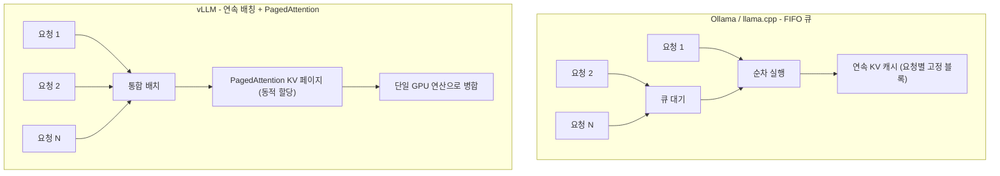

로컬에서 LLM을 돌리려고 검색하면 거의 항상 두 이름이 먼저 나옵니다. Ollama와 vLLM입니다. "성능을 원하면 Ollama 쓰지 말고 vLLM을 써라"는 식의 강한 주장도 자주 보입니다. 맞는 말일까요. 결론부터 말하면 절반만 맞습니다. 노트북에서 혼자 한 번에 한 요청씩 쓰는 상황과, 서버에서 수십 명이 동시에 붙는 상황은 완전히 다른 문제이기 때문입니다. 이 글은 2026년에 공개된 RTX 4090 벤치마크 수치를 근거로 두 도구가 어디서 갈리는지, 그리고 그 차이가 ThakiCloud의 Kubernetes 기반 서빙에 어떤 의미인지를 정리합니다.

## 개요

Ollama와 vLLM은 둘 다 LLM을 로컬 혹은 자체 인프라에서 띄우는 추론 엔진입니다. 그러나 설계 목표가 다릅니다. Ollama는 한 사람이 모델을 빠르게 내려받아 손쉽게 실행하도록 만든 도구입니다. 설치가 간단하고, 모델 관리가 내장돼 있으며, Go로 짠 가벼운 서버라 시작이 빠릅니다. vLLM은 처음부터 다중 동시 요청을 한 GPU에 욱여넣어 처리량을 극대화하도록 설계된 프로덕션 서빙 엔진입니다. 핵심 무기는 PagedAttention과 연속 배칭(continuous batching)입니다.

이 차이가 왜 지금 다시 중요해졌을까요. 2024년 이후 두 도구 모두 구조가 크게 바뀌었습니다. Ollama는 llama.cpp 커널 최적화와 양자화 추론 경로를 다듬어 단일 스트림 성능을 끌어올렸고, vLLM은 설치 경험을 단순화하면서 PagedAttention과 추측 디코딩(speculative decoding)을 계속 개선했습니다. 1년 전 벤치마크가 더 이상 현재를 반영하지 못한다는 뜻입니다. 그래서 최신 수치로 다시 봐야 합니다.

ThakiCloud는 멀티테넌트 환경에서 여러 고객의 추론 요청을 같은 GPU 풀 위에서 처리합니다. 이런 환경에서 "혼자 쓸 때 빠른가"는 거의 의미가 없고 "동시에 붙었을 때 무너지지 않는가"가 전부입니다. 그 관점에서 두 도구의 확장 곡선을 보겠습니다.

## 이 도구는 무엇인가

두 엔진의 결정적 차이는 KV 캐시를 다루는 방식입니다. 트랜스포머는 생성 중에 이전 토큰들의 키와 값을 캐시에 쌓아 둡니다. 이 KV 캐시가 GPU 메모리를 가장 많이 잡아먹습니다. Ollama와 llama.cpp는 요청마다 KV 캐시를 연속된 메모리 블록으로 미리 할당합니다. 구현이 단순하지만, 동시 요청이 늘면 단편화가 생겨 동시 처리 능력이 빠르게 한계에 부딪힙니다.

vLLM의 PagedAttention은 KV 캐시를 운영체제의 가상 메모리 페이지처럼 다룹니다. 작고 연속되지 않은 블록 단위로 필요할 때 할당하므로, 같은 VRAM에 훨씬 많은 동시 시퀀스를 담을 수 있습니다. 여기에 연속 배칭이 더해집니다. 새 요청이 도착하면 앞선 요청이 끝나기를 기다리지 않고 진행 중인 배치에 곧바로 끼워 넣습니다. 이 두 가지가 vLLM이 동시성에서 다른 곡선을 그리는 이유입니다.

아래 도식은 두 엔진이 동시 요청을 처리하는 방식의 차이를 나타냅니다.



요약하면 Ollama는 한 번에 한 요청을 깔끔하게 처리하는 데 최적화돼 있고, vLLM은 여러 요청을 한 GPU 연산으로 묶어 처리하는 데 최적화돼 있습니다. 이 설계 차이가 벤치마크 숫자로 그대로 드러납니다.

## 설치 및 통합

두 도구 모두 Docker로 띄우는 것이 재현성 측면에서 가장 깔끔합니다. Ollama는 다음과 같이 시작합니다.

```bash
docker run -d --gpus=all -v ollama:/root/.ollama \
  -p 11434:11434 --name ollama ollama/ollama
docker exec -it ollama ollama run llama3.1:8b
```

vLLM은 OpenAI 호환 서버 이미지를 그대로 띄울 수 있습니다.

```bash
docker run --gpus all -p 8000:8000 \
  --ipc=host vllm/vllm-openai:latest \
  --model meta-llama/Llama-3.1-8B-Instruct \
  --dtype auto
```

두 서버 모두 OpenAI 호환 API를 노출하므로 클라이언트 코드는 동일하게 둘 수 있습니다.

```bash
curl http://localhost:8000/v1/completions \
  -H "Content-Type: application/json" \
  -d '{"model":"meta-llama/Llama-3.1-8B-Instruct","prompt":"안녕하세요","max_tokens":64}'
```

재현성을 위해서는 이미지 다이제스트를 고정하는 것이 좋습니다. 공개 벤치마크는 `docker inspect ollama/ollama:<tag>`와 `docker inspect vllm/vllm-openai:<tag>`로 RepoDigest를 기록하고, `ollama --version`과 `pip show vllm` 출력을 함께 남기라고 권합니다. 버전이 한 칸만 달라져도 수치가 흔들리기 때문입니다.

한 가지 정직하게 밝혀 둡니다. 이 글을 작성한 환경은 Apple Silicon(macOS, MPS)이라 CUDA 기반 vLLM 벤치마크를 직접 재현할 수 없었습니다. 그래서 아래 수치는 제가 돌린 것이 아니라 동일 하드웨어에서 측정한 공개 벤치마크(SitePoint, 2026년 3월, RTX 4090)를 인용한 것입니다. 출처는 글 끝에 명시했습니다. 직접 측정하지 않은 숫자를 마치 우리 실험치인 것처럼 쓰지 않기 위해 구분합니다.

## 실제 실험 결과 (공개 벤치마크 인용)

인용한 벤치마크 환경은 다음과 같습니다. GPU는 NVIDIA RTX 4090(24GB), CPU는 AMD Ryzen 9 7950X, RAM 64GB DDR5, Ubuntu 24.04, CUDA 12.6, Python 3.12입니다. 모델은 Llama 3.1 8B와 DeepSeek-R1-Distill-Llama-8B를 같은 프롬프트로 비교했습니다.

먼저 단일 사용자 순차 처리량입니다. 통념과 달리 vLLM이 압도하지 않습니다. Llama 3.1 8B 기준 Ollama(Q4_K_M)는 약 62 tok/s, vLLM(FP16)은 약 71 tok/s, vLLM AWQ는 약 68 tok/s를 냈습니다. 13% 정도의 격차는 구조보다 양자화 차이에서 더 많이 옵니다. 한 사람이 쓸 때는 Ollama의 가벼운 서버 오버헤드와 양자화 커널 최적화가 vLLM의 구조적 강점을 상쇄합니다.

그림이 완전히 바뀌는 지점은 동시성입니다. 아래 표는 토큰 총처리량(tok/s)을 동시 사용자 수에 따라 정리한 것입니다.

| 구성 | Ollama | vLLM FP16 | vLLM AWQ |
|---|---|---|---|
| Llama 3.1 8B, 1명 | 62 | 71 | 68 |
| Llama 3.1 8B, 10명 | 148 | 485 | 452 |
| Llama 3.1 8B, 50명 | 155 | 920 | 875 |
| DeepSeek-R1 8B, 1명 | 58 | 67 | 63 |
| DeepSeek-R1 8B, 10명 | 135 | 445 | 418 |
| DeepSeek-R1 8B, 50명 | 142 | 840 | 795 |

10명 동시에서 이미 vLLM이 약 3.3배, 50명에서는 약 6배 처리량을 냅니다. Ollama는 FIFO 큐로 사실상 순차 처리하기 때문에 동시성이 올라가도 총처리량이 거의 늘지 않고 평평해집니다. 반면 vLLM은 연속 배칭으로 동시 요청을 흡수해 비례에 가깝게 확장합니다.


지연시간도 같은 이야기를 다른 각도로 보여줍니다. 단일 사용자에서 첫 응답까지 시간(TTFR)은 Ollama가 약 45ms, vLLM이 약 82ms로 Ollama가 더 빠릅니다. 그러나 50명 동시에서는 위치가 뒤집힙니다. Ollama의 TTFR은 요청이 큐에서 대기하면서 약 3,200ms까지 치솟고, vLLM은 연속 배칭 덕에 약 145ms를 유지합니다. 혼자 쓸 때 더 빠른 도구가 부하에서 가장 느려지는 역전이 일어납니다.

자원 사용량은 트레이드오프를 분명히 합니다. Llama 3.1 8B 기준 유휴 상태에서 Ollama는 약 5.2GB VRAM, vLLM FP16은 약 16.1GB를 씁니다. 50명 동시에서 Ollama는 약 5.4GB로 거의 고정되지만 vLLM FP16은 약 21.8GB까지 늘어납니다. 활성 시퀀스의 KV 캐시를 위해 페이지를 동적으로 할당하기 때문입니다. AWQ 변형은 같은 부하에서 약 12.4GB로 더 보수적입니다. 시스템 RAM과 CPU도 Ollama가 더 낮습니다(유휴 RAM 약 1.8GB 대 4.6GB). 즉 vLLM의 높은 처리량은 공짜가 아니라 더 많은 VRAM과 RAM을 대가로 얻는 것입니다.

## 개발자 경험과 생태계

성능 외에 운용 비용을 좌우하는 것이 개발자 경험입니다. Ollama는 설치 한 줄과 `ollama run`이면 모델이 뜨고, 모델 다운로드와 양자화 변형 관리가 내장돼 있습니다. 진입 장벽이 낮아 한때 취미용 도구로 여겨졌지만, 지금은 CI 파이프라인의 코드 리뷰 프롬프트, Jetson Orin 같은 엣지 배포, 내부 개발 툴체인에 폭넓게 등장합니다.

vLLM은 과거에 Python ML 도구에 익숙해야 다룰 수 있었지만, 최근 설치 경험이 크게 단순해졌습니다. OpenAI 호환 서버 이미지를 그대로 띄우면 기존 OpenAI 클라이언트 코드가 거의 수정 없이 붙습니다. 텐서 병렬, 추측 디코딩, LoRA 어댑터 핫스왑 같은 프로덕션 기능이 풍성하다는 점이 생태계 측면의 강점입니다. 두 도구가 OpenAI 호환 API라는 공통 표면을 공유하므로, 개발 단계는 Ollama로 시작하고 프로덕션은 vLLM으로 옮기는 전환이 비교적 매끄럽습니다.

## ThakiCloud K8s AI/ML SaaS 플랫폼 적용 및 시사점

이 비교는 ThakiCloud가 왜 멀티테넌트 서빙에 vLLM 계열을 표준으로 두는지를 정확히 설명합니다. 우리 플랫폼은 한 명이 한 모델을 독점하는 환경이 아닙니다. 여러 고객의 요청이 같은 GPU 풀 위에서 동시에 흐릅니다. 이 조건에서 중요한 것은 단일 스트림 속도가 아니라 동시성 확장 곡선과 부하 시 지연시간 안정성입니다. 50명 동시에서 6배 처리량과 20배 이상 낮은 지연시간은 곧 동일 GPU로 수용 가능한 테넌트 수, 즉 단위 비용의 차이로 직결됩니다.

운용 관점에서 우리는 vLLM 서빙 파드를 Kubernetes 위에 올리고 Kueue로 GPU 워크로드를 큐잉합니다. 서빙 워크로드는 대략 다음 형태로 정의합니다.

```yaml
apiVersion: apps/v1
kind: Deployment
metadata:
  name: vllm-llama31-8b
spec:
  replicas: 1
  template:
    spec:
      containers:
        - name: vllm
          image: vllm/vllm-openai:latest
          args:
            - "--model=meta-llama/Llama-3.1-8B-Instruct"
            - "--max-num-seqs=64"
            - "--gpu-memory-utilization=0.90"
          resources:
            limits:
              nvidia.com/gpu: "1"
          ports:
            - containerPort: 8000
```

여기서 `--max-num-seqs`와 `--gpu-memory-utilization`이 핵심 손잡이입니다. PagedAttention의 동적 VRAM 사용은 파드 메모리 한도와 GPU 분할 정책을 설계할 때 반드시 반영해야 하는 변수입니다. 위 수치에서 보듯 동시성이 올라가면 VRAM이 16GB에서 22GB로 움직이므로, 정적 할당으로 잡으면 OOM이나 과소 활용 중 하나에 빠집니다. 그래서 우리는 모델별로 최대 동시 시퀀스와 KV 캐시 상한을 측정해 파드 리소스를 잡는 방식을 씁니다. Kueue는 GPU가 빌 때까지 작업을 큐에 두었다가 자원이 확보되면 디스패치하므로, 동시 테넌트가 몰릴 때도 GPU 과청약을 막아 줍니다.

동시에 Ollama가 무의미하다는 뜻은 아닙니다. 내부 개발자의 로컬 프로토타이핑, 단일 사용자 데모 환경, CI 파이프라인에서 가벼운 코드 리뷰 프롬프트를 돌리는 용도라면 Ollama의 빠른 시작과 낮은 자원 바닥이 오히려 유리합니다. ThakiCloud 입장에서 정리하면 경계가 분명합니다. 고객에게 노출되는 프로덕션 멀티테넌트 추론은 vLLM, 개발자 개인 워크플로와 엣지 데모는 Ollama입니다. 온프레미스 self-hosting을 요구하는 고객(국정원 보안 요건 등 데이터 외부 반출이 불가능한 환경)에게는 이 두 엔진 모두를 자체 GPU 위에서 돌릴 수 있다는 점 자체가 제안의 핵심입니다.

## 한계 및 반론

몇 가지를 분명히 해 둡니다. 첫 번째로 인용한 벤치마크는 단일 RTX 4090 한 장 기준입니다. 멀티 GPU나 70B 이상 대형 모델, 텐서 병렬 구성에서는 곡선이 달라질 수 있습니다. 이 영역은 vLLM이 사실상 유일한 선택지에 가깝지만, 구체 수치는 다른 하드웨어에서 다시 측정해야 합니다.

두 번째로 Ollama의 동시성 약점은 테스트된 버전 기준입니다. Ollama도 배칭을 개선하고 있으므로 향후 버전에서는 격차가 줄 수 있습니다. "Ollama는 동시성에 약하다"를 영구 명제로 받아들이면 안 됩니다. 도구는 빠르게 바뀝니다.

세 번째로 vLLM의 높은 처리량에는 비용이 따릅니다. 더 많은 VRAM과 RAM, 더 복잡한 운용, Python 런타임 오버헤드입니다. 동시 요청이 거의 없는 워크로드에 vLLM을 올리는 것은 과한 설계입니다. 도구 선택은 "어느 것이 더 빠른가"가 아니라 "내 동시성 프로파일이 어디에 있는가"에서 시작해야 합니다.

마지막으로 이 글의 핵심 수치는 제가 직접 측정한 것이 아니라 공개 벤치마크 인용입니다. 우리 실제 GPU 환경에서의 재현 측정은 별도 후속 글로 다룰 계획입니다. 직접 측정 없이 인용 수치를 우리 결론처럼 일반화하지 않도록 주의해 읽어 주시기 바랍니다.

## 출처

- SitePoint, "Ollama vs vLLM: Performance Benchmark 2026" (2026-03-05): [https://www.sitepoint.com/ollama-vs-vllm-performance-benchmark-2026/](https://www.sitepoint.com/ollama-vs-vllm-performance-benchmark-2026/)
- vLLM 공식 문서: [https://docs.vllm.ai](https://docs.vllm.ai)
- Ollama: [https://ollama.com](https://ollama.com)
