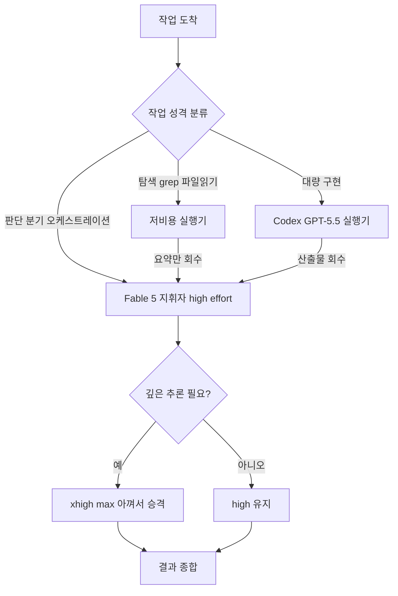

*무거운 작업과 가벼운 작업을 서로 다른 모델로 흘려보내는 라우팅의 개념을 형상화했습니다.*

## 개요

강력한 코딩 모델을 하나 붙잡고 모든 작업을 시키면 편합니다. 문제는 그 편함이 토큰 예산과 레이트리밋으로 되돌아온다는 점입니다. 가장 비싼 모델을 가장 단순한 작업에까지 쓰면, 정작 어려운 추론이 필요할 때 한도가 바닥나 있습니다.

2026년 7월 초, T3 스택 창시자 Theo(@theo)가 Claude Fable 5를 하루 종일 돌리면서도 레이트리밋에 걸리지 않는 방법을 공유했습니다. 요지는 단순합니다. 한 모델에 모든 것을 몰아주지 말고, 작업 성격에 따라 모델과 effort를 갈라 쓰라는 것입니다. 이 글에서는 그가 제시한 네 가지 전략을 실제 인용과 함께 정리하고, ThakiCloud가 Paxis와 ai-platform 운영에서 이미 쓰고 있는 모델 라우팅 규율과 나란히 놓아 봅니다.

이 주제가 중요한 이유는 명확합니다. 에이전트가 자율적으로 오래 도는 시대에는 모델 한 번의 품질보다 세션 전체의 토큰 흐름을 어떻게 설계하느냐가 실제 생산성과 비용을 가릅니다.

## 문제: 레이트리밋은 품질이 아니라 배분의 문제다

레이트리밋에 자주 걸리는 사용자는 대체로 모델이 약해서가 아니라 배분이 서툴러서 걸립니다. 파일 하나 읽기, 단순 grep, 로그 요약 같은 저난도 작업에도 최고 티어 모델을 최고 effort로 돌리면, 토큰이 선형이 아니라 기하급수로 소모됩니다. 특히 사고(thinking) 토큰은 눈에 보이지 않게 쌓입니다.

핵심 통찰은 이것입니다. 최고 모델은 유한한 자원이고, 그 자원을 어디에 쓸지 결정하는 일이 곧 라우팅입니다. Theo의 팁 네 가지는 전부 이 하나의 원칙을 서로 다른 각도에서 실천한 것입니다.

## Theo의 네 가지 전략

### 1. effort는 기본적으로 high로, xhigh와 max는 아껴서

Theo는 Fable을 당분간 "high" effort로만 쓴다고 밝혔습니다. 그의 표현을 그대로 옮기면, xhigh는 "토큰을 게걸스럽게 먹고(token hungry)", max와 extra는 "더 낮은 옵션보다 오히려 결과가 나쁜 용광로(a furnace with worse outputs than lower options)"라는 것입니다.

여기서 배울 점은 effort를 올린다고 품질이 단조 증가하지 않는다는 사실입니다. 사고 토큰이 늘어나면 오히려 산만해지거나 과도하게 우회하는 출력이 나올 수 있습니다. 대부분의 실무 작업에는 high가 품질과 비용의 균형점입니다. xhigh와 max는 정말로 깊은 추론이 필요한 단계에만 아껴서 씁니다.

### 2. Codex를 하위 실행기로 오케스트레이션

두 번째 전략은 모델을 계층으로 나누는 것입니다. Theo는 Claude Code가 Codex(GPT-5.5)를 구현 작업의 하위 실행기로 부르도록 가르쳤습니다. 그의 관찰에 따르면 GPT-5.5는 대단히 조종 가능(steerable)해서, Fable이 GPT-5.5를 어떻게 몰아갈지 학습할 수 있다는 것입니다.

즉 Fable은 지휘자(conductor)로서 판단과 분기를 맡고, 반복적이고 양이 많은 구현은 더 싼 실행기에 위임합니다. 이렇게 하면 값비싼 지휘 모델의 토큰은 판단에만 쓰이고, 구현 물량은 다른 예산에서 나갑니다.

### 3. CLAUDE.md에 모델 우선순위를 명시

세 번째는 이 라우팅을 즉흥이 아니라 계약으로 굳히는 것입니다. Theo는 CLAUDE.md에 어떤 작업에 어떤 모델을 우선할지, 서브에이전트와 워크플로를 오케스트레이션할 때 어떻게 배분할지를 큰 섹션으로 적어 두었다고 했습니다.

이 대목이 특히 중요합니다. 라우팅 규칙을 문서에 박아 두면 세션마다 다시 판단할 필요가 없고, 팀 전체가 같은 배분 규율을 공유합니다. 반복되는 프롬프트를 규칙으로 만드는 것은 프롬프트 위생의 기본이기도 합니다.

### 4. 토큰 무거운 작업은 다른 모델에 위임하고 결과만 회수

마지막으로 Theo는 불필요하게 토큰을 많이 먹는 작업(컴퓨터 사용, 코드베이스 전수 분석 등)은 다른 모델로 처리한 뒤 결과만 Fable에 보고하도록 했습니다.

이것은 메인 컨텍스트 위생과 직결됩니다. 대용량 탐색 출력을 지휘 모델의 컨텍스트에 그대로 쏟으면, 이후 모든 턴에서 그 큰 컨텍스트를 다시 읽는 비용이 선형으로 붙습니다. 무거운 읽기는 하위 실행기가 처리하고 요약만 올리면, 지휘 모델의 컨텍스트는 깨끗하게 유지됩니다.

네 전략을 하나의 흐름으로 그리면 다음과 같습니다.

## ThakiCloud 제품 적용 시사점

Theo의 팁이 반갑게 읽히는 이유는, ThakiCloud가 운영하는 에이전트 플랫폼 Paxis가 이미 같은 원칙 위에 서 있기 때문입니다. Paxis는 ai-platform 위에서 도는 Agent-Native Cloud 제어 평면으로, 스킬과 도구, 정책, 감사 로그를 일급 리소스로 다룹니다. 그 안에서 모델 라우팅은 장식이 아니라 비용 구조의 뼈대입니다.

우리의 서브에이전트 라우팅 규율은 Theo의 4번 전략과 정확히 같은 곳을 겨냥합니다. 탐색과 파일 읽기는 가장 싼 티어로, 구현과 리뷰는 중간 티어로, 아키텍처와 복잡한 다단계 추론만 최상위 티어로 보냅니다. 서브에이전트는 대용량 출력을 원본 그대로 올리지 않고 요약과 파일 경로만 회수합니다. 지휘 모델의 컨텍스트를 깨끗하게 유지하는 이 규칙은 Theo가 "결과만 보고하라"고 말한 것과 같은 실천입니다.

지휘자와 실행기를 나누는 2번 전략도 Paxis의 설계와 맞닿아 있습니다. Paxis의 스킬 하니스는 960개가 넘는 스킬을 BM25로 선택해 격리된 샌드박스에서 실행하는데, 이때 오케스트레이션 레이어는 가벼운 판단만 맡고 무거운 실행은 별도 워커로 격리됩니다. 값비싼 판단 모델을 라우팅과 집약에만 쓰고, 실제 중노동은 더 싼 워커에 배치하는 구조는 Theo가 Fable을 지휘자로, Codex를 실행기로 둔 것과 같은 그림입니다.

3번 전략, 즉 라우팅을 문서와 정책으로 굳히는 발상은 Paxis에서는 정책 게이트와 감사 로그로 구현됩니다. 어떤 작업이 어떤 자원으로 흘러야 하는지를 즉흥 판단이 아니라 명시된 규칙으로 고정하면, 자율 에이전트가 오래 돌아도 배분 규율이 흔들리지 않습니다.

인프라 층에서는 ai-platform 렌즈도 함께 작동합니다. 모델을 K8s와 Kueue 기반 GPU 위에서 서빙할 때, 저난도 요청을 작은 모델과 낮은 배치 우선순위로 흘려보내면 GPU 시간이 절약되고, 그 절약이 다시 에이전트 경제성으로 이어집니다. 낮은 서빙 비용이 곧 더 공격적인 라우팅을 감당할 여력을 만들어 줍니다. 요컨대 저비용 서빙(ai-platform)이 에이전트 오케스트레이션의 경제성(Paxis)을 떠받치는 구조입니다.

## 한계 및 반론

이 접근에도 약점은 있습니다. 첫째, 라우팅이 복잡해질수록 관리 비용이 생깁니다. 모델을 여러 개 엮으면 각 모델의 컨텍스트 창, 가격, 가용성이 서로 달라 디버깅이 어려워집니다. 지휘자가 실행기의 출력을 잘못 해석하면 오히려 왕복이 늘어 토큰을 더 씁니다.

둘째, "high가 항상 최선"은 Theo 개인의 관찰이며 작업 종류에 따라 다릅니다. 정말로 어려운 아키텍처 판단이나 미묘한 버그 추적에서는 더 높은 effort가 값을 합니다. 규칙은 기본값일 뿐, 예외를 판단하는 눈이 여전히 필요합니다.

셋째, 서로 다른 벤더의 모델을 섞는 오케스트레이션은 데이터 흐름과 보안 경계를 넓힙니다. 코드베이스 분석을 외부 실행기에 넘길 때 무엇이 그 모델의 컨텍스트로 들어가는지 반드시 통제해야 합니다. Paxis가 모든 행동을 정책 게이트와 감사 로그로 통과시키는 이유가 바로 여기에 있습니다.

결론적으로 레이트리밋은 더 비싼 요금제로 밀어붙일 문제가 아니라 배분으로 푸는 문제입니다. 싸게 시작하고, 무거운 판단에만 비싼 모델을 쓰며, 그 규칙을 문서와 정책으로 굳히는 것. 이것이 Theo의 네 가지 팁이 공통으로 가리키는 방향이자, ThakiCloud가 Paxis에서 매일 실천하는 규율입니다.

## 출처

- Theo(@theo), "I've been getting a TON done with Fable today and I'm not hitting rate limits": [x.com/theo/status/2072481845363822914](https://x.com/theo/status/2072481845363822914)
- "T3 Stack creator Theo shares Fable AI workflow", digg.com: [digg.com/tech/wmowks0x](https://digg.com/tech/wmowks0x)
- "Fable Is Back. Here's How to Actually Code With It", Wavect: [wavect.io/blog/coding-with-claude-fable-5](https://wavect.io/blog/coding-with-claude-fable-5/)
