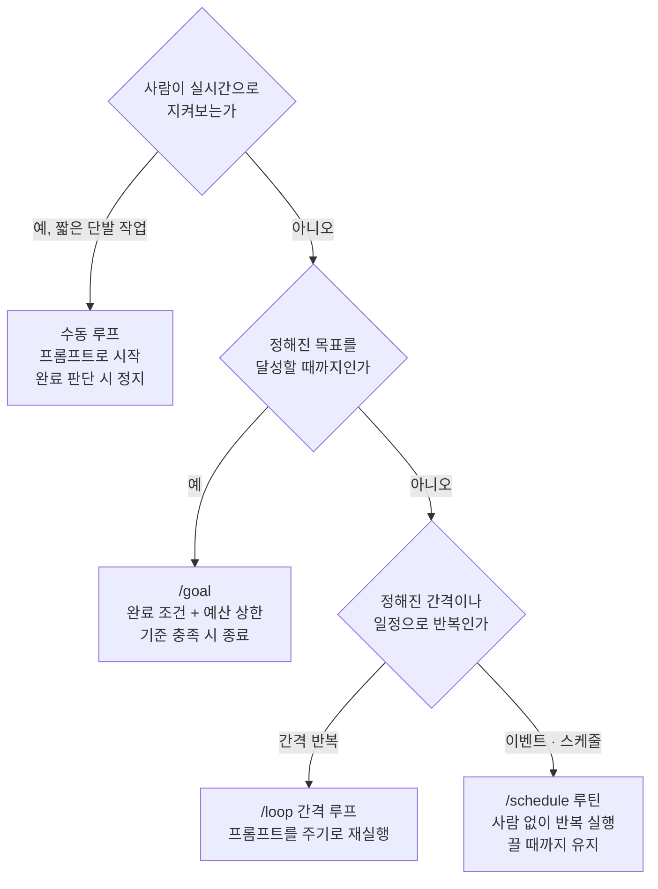

## 이 글을 누가 읽으면 좋은가

이 글은 코딩 에이전트를 단발 도구가 아니라 오래 돌아가는 자동화 시스템으로 운영하려는 개발자와 플랫폼 엔지니어를 위해 씁니다. "매번 프롬프트를 치는 대신 에이전트가 스스로 반복하게 하려면 무엇을 정해 줘야 하는가", "무한 반복과 비용 폭주를 어떻게 막는가"라는 실무 질문을 다룹니다. Anthropic이 공개한 공식 루프 문서를 읽고, 그 개념을 실제 무인 파이프라인에 배선한 우리 운영 경험과 겹쳐 봅니다.

## 개요

지금까지 코딩 에이전트를 쓰는 방식은 대화였습니다. 사람이 프롬프트를 치면 에이전트가 한 번 응답하고 멈춥니다. 다음 지시가 올 때까지 기다립니다. 이 방식은 짧은 작업에는 훌륭하지만, PR 리뷰 반영, CI 수정, 이슈 트리아지, 의존성 업그레이드처럼 반복적이고 끝이 정해진 작업의 흐름에는 맞지 않습니다. 사람이 계속 옆에 붙어 매 턴을 프롬프트해야 하기 때문입니다.

Anthropic은 2026년 7월 7일 「Getting started with loops」라는 공식 문서를 공개하며 이 전환에 이름을 붙였습니다. 루프 엔지니어링입니다. 문서의 핵심 문장은 이렇습니다. 매 프롬프트를 직접 타이핑하는 것을 멈추고, 에이전트를 대신 프롬프트해 주는 시스템을 설계하기 시작하는 것. 이 글은 그 문서가 정리한 루프의 종류와 정지 조건을 읽고, 우리가 이 패턴을 실제로 무인 파이프라인에 어떻게 배선했는지까지 이어 봅니다.

## 루프 엔지니어링이란 무엇인가

루프 엔지니어링은 프롬프트 엔지니어링의 다음 단계입니다. 프롬프트 엔지니어링이 "한 번의 응답을 잘 받아내는 지시문"을 다듬는 일이라면, 루프 엔지니어링은 "관찰하고 판단하고 실행하고 다시 관찰하는 반복 구조" 자체를 설계하는 일입니다. 좋은 루프의 품질을 결정하는 것은 모델의 능력만이 아니라 루프가 매 회차마다 받는 피드백의 질입니다.

가장 신뢰할 수 있는 피드백은 테스트, 타입 체커, 린터처럼 통과와 실패를 객관적으로 돌려주는 결정론적 검증입니다. "완료된 것 같습니다"라는 모델의 자기 보고는 루프의 종료 조건이 될 수 없습니다. 루프가 언제 멈춰야 하는지는 모델의 주장이 아니라 도구의 판정이 결정해야 합니다.

## 세 가지 루프 유형과 /goal

공식 문서는 루프를 세 가지 유형으로 나눕니다. 어느 것을 쓸지는 "사람이 실시간으로 개입하는가", "끝이 정해져 있는가", "정해진 시각에 반복되는가"로 갈립니다.

첫째는 수동 루프입니다. 사용자 프롬프트로 시작하고, Claude가 작업을 끝냈다고 판단하거나 추가 맥락이 필요하다고 판단하면 멈춥니다. 정기적인 프로세스나 스케줄에 속하지 않는 비교적 짧은 작업에 적합합니다.

둘째는 `/loop` 간격 루프입니다. 하나의 프롬프트를 정해진 간격으로 재실행합니다. 문서가 든 예시는 이렇습니다. `/loop 5m check my PR, address review comments, and fix failing CI` 처럼 5분마다 PR을 확인하고 리뷰 코멘트를 반영하며 실패한 CI를 고치는 식입니다.

셋째는 `/schedule` 스케줄 루틴입니다. 이벤트나 일정에 의해, 실시간으로 지켜보는 사람 없이 발동합니다. 각 작업은 목표를 달성하면 종료하지만, 루틴 자체는 끌 때까지 계속 돌아갑니다. 버그 리포트, 이슈 트리아지, 마이그레이션, 의존성 업그레이드처럼 잘 정의된 반복 작업 스트림에 적합합니다.

이 셋을 관통하는 것이 `/goal`입니다. `/goal`은 완료 조건을 설정하고, 사람이 매 단계를 프롬프트하지 않아도 Claude가 그 조건을 향해 계속 작업하게 합니다. 방향형 목표를 두고 도구 피드백으로 수렴시키는 구조입니다.

## 좋은 성공 기준을 설계하는 법

루프의 성패는 성공 기준을 얼마나 잘 정의하느냐에 달려 있습니다. 공식 문서는 좋은 성공 기준의 세 가지 성질을 강조합니다.

첫째는 검증 가능성입니다. Claude가 프로그램적으로 또는 명시적 관찰로 완료를 확인할 수 있어야 합니다. "모든 유닛 테스트가 통과한다"는 검증 가능한 기준입니다. 반면 "코드를 개선한다"는 검증 불가능합니다.

둘째는 범위 경계입니다. 무엇이 범위 안이고 무엇이 밖인지를 명시해야 합니다. "결제 서비스를 리팩터하되 데이터베이스 계층은 건드리지 말라"처럼 경계가 있는 목표가 안전합니다.

셋째는 성공 지표입니다. 숫자가 도움이 됩니다. "`/search` 엔드포인트의 API 응답 시간을 200ms 아래로 낮춰라"는 구체적인 목표를 줍니다. 테스트 통과, Lighthouse 점수, 빈 큐처럼 결정론적으로 판정되는 기준이 가장 잘 작동합니다.

그리고 안전 밸브가 하나 더 필요합니다. 턴 캡입니다. "5번 시도 후 정지" 같은 상한이 없으면, 모호한 목표를 두고 에이전트가 "이 정도면 됐다"를 판단하느라 오랜 시간과 토큰을 쓸 수 있습니다. 완료 조건에 턴 캡을 함께 넣는 것이 가장 단순한 방어책입니다.

## 검증 게이트와 스킬

문서가 반복해서 짚는 원칙은 피드백의 질이 루프의 질을 결정한다는 것입니다. 그래서 스킬이 등장합니다. 스킬은 루프가 매 회차마다 실행하는 검증 절차를 재사용 가능한 형태로 묶어, 에이전트가 자기 출력을 스스로 검증할 방법을 갖게 합니다. 루프가 아무것도 거르지 못하고 항상 통과만 시킨다면, 그것은 검증기가 고장 났다는 신호입니다.

이 지점이 실무적으로 가장 중요합니다. 병렬로 여러 하위 작업을 펼치는 팬아웃 루프는 검증 스테이지 없이 결과를 합치면 환각을 누적합니다. 코드 작업이면 테스트의 종료 코드가, 리서치나 콘텐츠 작업이면 적대적 반증 표결이 결과를 감사한 뒤에야 다음 단계로 넘어가야 합니다. 품질이 안 나올 때 흔한 오해는 모델을 더 비싼 등급으로 올리는 것이지만, 더 흔한 원인은 검증 스테이지의 부재입니다.

## ThakiCloud 제품 적용 시사점

우리에게 이 문서가 특별한 이유는, 여기 적힌 패턴을 이미 실제 무인 파이프라인에 배선해 운영하고 있기 때문입니다.

우리 저장소에는 세 가지 층의 루프가 돌고 있습니다. 첫째, 컴파일러와 테스트 러너를 보상 신호로 삼아 코드 변환을 테스트 통과까지 반복하는 pge-loop가 있습니다. 이것은 문서의 `/goal`이 말하는 "검증 가능한 완료 조건"을 `make test-short`의 종료 코드로 구현한 것입니다. 둘째, 목표를 달성 상태까지 자율적으로 추구하는 Goal Mode가 있습니다. 상태 파일과 예산 상한, `check_cmd` 게이트를 갖춰 문서의 턴 캡과 성공 지표 원칙을 그대로 따릅니다. 셋째, 정해진 시각에 사람 없이 반복되는 launchd cron 러너들이 문서의 `/schedule` 루틴에 해당합니다. 모니터링과 콘텐츠 생성처럼 매 틱마다 사람의 판단이 필요 없는 작업은 Claude를 상주시키지 않고 cron으로 돌려 비용을 0으로 유지합니다.

이 운영 규율이 곧 Paxis의 설계 철학입니다. Paxis는 ThakiCloud의 Agent-Native Cloud 제어 평면으로, 스킬과 도구, 정책, 감사 로그를 일급 리소스로 다룹니다. 루프 엔지니어링의 관점에서 Paxis가 제공하는 것은 네 가지입니다. 자연어 Cron으로 스케줄 루틴을 선언하고, DAG 멀티에이전트로 팬아웃과 검증 스테이지를 조립하며, 960개가 넘는 스킬을 BM25로 선택해 격리 샌드박스에서 실행하고, 모든 루프의 행동을 정책 게이트와 감사 로그로 통과시킵니다. 문서가 강조하는 "검증 없는 팬아웃은 위험하다"는 원칙이, Paxis에서는 정책 게이트라는 인프라 기능으로 강제됩니다.

그 아래에서 ai-platform 렌즈도 함께 작동합니다. 오래 돌아가는 루프는 결국 추론 비용의 문제입니다. Kubernetes와 Kueue 기반 GPU 스케줄링 위에서 낮은 서빙 비용을 유지하는 것이, 스케줄 루틴을 지속 가능하게 만드는 경제적 토대가 됩니다. 저비용 서빙이 에이전트 루프의 경제성을 만들고, 그 위에서 Paxis가 루프의 안전과 조립을 책임지는 구조입니다.

## 한계 및 반론

루프 엔지니어링을 만능으로 받아들이면 오히려 위험합니다.

첫 번째 한계는 검증 불가능한 작업입니다. 성공을 결정론적으로 판정할 수 없는 작업을 루프로 돌리면, 에이전트는 종료 조건 없이 예산만 태웁니다. 게이트를 먼저 정의할 수 없다면 루프가 아니라 단발 실행이 옳습니다.

두 번째 한계는 비용입니다. 매 틱마다 거대한 맥락을 다시 읽는 긴 세션 루프는 캐시 읽기 비용이 선형으로 늘어납니다. 24시간 모니터링을 한 세션에 누적하는 패턴은 특히 비쌉니다. 사람이나 이벤트가 있을 때만 에이전트를 부르고, 단순 폴링은 cron으로 빼는 것이 원칙입니다.

세 번째 한계는 인지적 항복입니다. 루프가 깊어질수록 결과를 신뢰하고 검토를 멈추는 경향이 생깁니다. 자동화는 사고를 대체하는 것이 아니라 보조하는 도구입니다. 핵심 산출물은 주기적으로 사람이 표본 검토해야 하며, 검증기가 아무것도 거르지 못하면 그것을 고장 신호로 읽어야 합니다.

이 세 한계는 모두 하나의 원칙으로 요약됩니다. 루프를 시작하기 전에 종료 게이트를 먼저 정의하라. 게이트가 있으면 루프는 복리로 품질을 쌓고, 게이트가 없으면 루프는 환각을 복리로 쌓습니다.

## 출처

- Anthropic, "Getting started with loops" (2026-07-07): [claude.com/blog/getting-started-with-loops](https://claude.com/blog/getting-started-with-loops)
- Claude Code Docs, "Keep Claude working toward a goal": [code.claude.com/docs/en/goal](https://code.claude.com/docs/en/goal)
