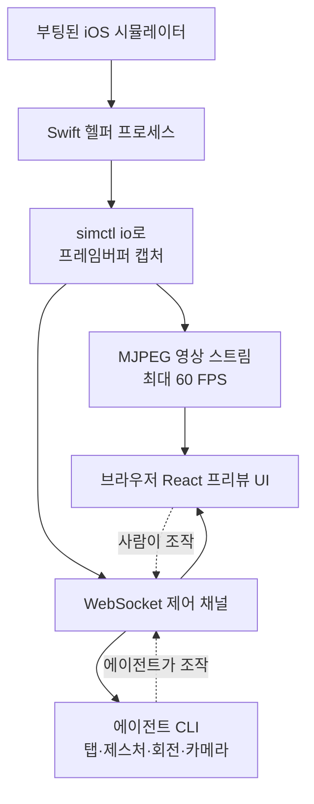

AI 코딩 에이전트에게 iOS 앱을 만들어 달라고 하면 한 가지 근본적인 벽에 부딪힙니다. 에이전트는 코드를 쓰고 빌드까지는 할 수 있지만, 화면에서 실제로 무슨 일이 벌어지는지 볼 수 없습니다. 특히 개발 환경을 클라우드의 Mac Mini에 올려 두면 문제가 더 커집니다. GUI가 없는 헤드리스 서버에서는 Xcode 시뮬레이터 창 자체가 뜨지 않기 때문입니다.

Expo 코어 팀의 Evan Bacon이 만든 [serve-sim](https://github.com/EvanBacon/serve-sim)은 이 벽을 정면으로 겨냥합니다. 실제로 이 도구는 인디 개발자 levelsio가 "클라우드의 Mac Mini에서 Claude Code가 빌드한 iOS 앱을 브라우저로 실시간 확인할 수 있게 됐다"고 소개하면서 널리 알려졌습니다. serve-sim의 슬로건은 간단합니다. "Apple 시뮬레이터의 `npx serve`."

## 개요

serve-sim이 흥미로운 이유는 단순한 화면 미러링 도구가 아니기 때문입니다. 이 도구는 두 가지를 동시에 엽니다. 하나는 시뮬레이터 화면을 브라우저로 보내는 영상 스트림이고, 다른 하나는 브라우저나 에이전트가 시뮬레이터를 조작하도록 하는 제어 채널입니다. 즉 "보는 것"과 "조작하는 것"을 모두 원격에서 가능하게 만듭니다.

이 조합이 중요한 이유는 AI 코딩 에이전트의 개발 루프를 완성하기 때문입니다. 에이전트가 코드를 고치고, 빌드하고, 실행한 뒤, 그 결과 화면을 보고, 버튼을 눌러 다음 단계로 넘어가는 전체 순환을 사람 없이 돌릴 수 있게 됩니다. ThakiCloud의 Agent-Native Cloud인 Paxis가 지향하는 "에이전트가 격리된 환경에서 실제 작업을 수행하는" 구조와 정확히 맞닿아 있어, 하나의 오픈소스 도구가 그 워크플로를 어떻게 구현하는지 살펴볼 가치가 있습니다.


*헤드리스 서버의 시뮬레이터 화면이 스트림이 되어 원격 브라우저로 흘러 들어가는 구조를 형상화했습니다.*

## serve-sim은 무엇인가

serve-sim의 동작 원리는 생각보다 단순하고 영리합니다. 별도의 Xcode 플러그인을 설치하거나 앱에 계측 코드를 심을 필요가 없습니다. 대신 작은 Swift 헬퍼 프로세스를 띄워, 이미 부팅된 iOS 시뮬레이터의 프레임버퍼를 애플이 제공하는 `simctl io` 인터페이스로 캡처합니다.

캡처한 화면은 두 갈래로 노출됩니다. 첫째, MJPEG 스트림으로 브라우저에 최대 60 FPS의 영상을 보냅니다. 둘째, WebSocket 제어 채널을 함께 열어 브라우저 쪽에서 탭·제스처 같은 입력을 시뮬레이터로 되돌려 보냅니다. 그 위에 React로 만든 프리뷰 UI가 얹혀, 사람이 브라우저에서 실제 기기처럼 앱을 만질 수 있습니다.



핵심은 "어떤 부팅된 시뮬레이터든" 대상이 된다는 점입니다. 앱을 수정할 필요가 없으므로, 이미 있는 프로젝트에 그대로 붙일 수 있습니다. 게다가 시뮬레이터 로그를 브라우저로 전달해, browser-use 계열 MCP 도구가 그 로그를 읽어 상태를 판단하게 할 수도 있습니다. 브라우저 창에 영상·이미지를 드래그 앤 드롭하면 시뮬레이터 기기에 파일로 추가되는 편의 기능도 있습니다.

## 설치 및 사용

serve-sim의 진입 장벽은 낮습니다. Node.js가 있는 맥에서 한 줄이면 됩니다.

```bash
npx serve-sim
```

실행하면 로컬 `http://localhost:3200`에서 프리뷰를 확인할 수 있습니다. 로컬에서 쓰거나, LAN을 통해 같은 네트워크의 다른 기기에서 접속하거나, 원격 맥에 올려 두고 터널링으로 어디서든 접속하는 세 가지 모드를 지원합니다. levelsio의 사례가 바로 세 번째로, 클라우드의 헤드리스 Mac Mini에서 실행하고 원격 브라우저로 확인하는 방식입니다.

에이전트 통합은 별도의 Agent Skill로 제공됩니다. 저장소의 `skills/serve-sim`에 담긴 이 스킬은 Claude Code·Cursor·Codex CLI·Gemini CLI를 비롯해 오픈 Agent Skills 표준을 구현한 모든 호스트에게 시뮬레이터를 CLI로 조작하는 방법을 가르칩니다. 탭, 제스처, 하드웨어 버튼, 화면 회전, 카메라 입력 주입, 그리고 스트림을 호스트의 프리뷰 창으로 넘기는 동작까지 포함됩니다.

## 재현 참고

이 글을 작성한 실행 환경은 GUI가 없는 헤드리스 배치 세션으로, Node.js 실행이 정책상 차단되어 있어 `npx serve-sim`을 직접 구동해 화면을 캡처하지는 못했습니다. 따라서 이 글의 명령과 동작 설명은 저장소 README와 공식 소개 자료에서 확인한 사실에 근거하며, 벤치마크 수치를 지어내지 않았습니다. 실제 시뮬레이터 스트리밍 화면과 지연 시간은 macOS + Xcode 시뮬레이터가 부팅된 환경에서 위 명령으로 직접 확인하시기 바랍니다.

## ThakiCloud 제품 적용 시사점

serve-sim은 표면적으로는 iOS 개발자용 도구지만, 그 아래에는 에이전트 네이티브 개발이라는 더 큰 흐름이 깔려 있습니다.

**Paxis 렌즈 (에이전트 네이티브 개발).** ThakiCloud의 Paxis는 스킬을 격리 샌드박스에서 실행하고 모든 행동을 정책 게이트와 감사 로그로 통과시키는 Agent-Native Cloud 제어 평면입니다. serve-sim이 채택한 개방형 Agent Skills 표준은 Paxis의 스킬 하네스가 다루는 것과 같은 계약 모델입니다. 하나의 스킬이 "시뮬레이터를 탭하고 회전시키고 화면을 읽는" 능력을 여러 에이전트 호스트에 공통으로 제공한다는 발상은, Paxis가 960개 이상의 스킬을 BM25로 선택해 격리 실행하는 구조와 정확히 같은 방향을 향합니다. 특히 serve-sim의 제어 채널처럼 에이전트가 실제 UI를 조작하는 워크로드는, 그 조작이 정책 게이트를 통과하고 감사 로그로 기록되어야 안전하게 프로덕션에 올릴 수 있습니다. serve-sim이 "능력"을 제공한다면, Paxis는 그 능력을 "안전하게 통제"하는 계층을 제공합니다.

**ai-platform 렌즈 (헤드리스 실행 인프라).** serve-sim의 진짜 매력은 헤드리스 원격 맥에서 동작한다는 점입니다. GUI 없는 서버에서 빌드하고 스트리밍한다는 발상은 ThakiCloud ai-platform이 Kubernetes 위에서 워크로드를 GUI 없이 스케줄링하고 실행하는 방식과 같은 철학입니다. iOS 빌드가 요구하는 macOS 러너를 온디맨드로 붙이고, 그 위에서 에이전트가 빌드·테스트를 자동으로 돌린 뒤 결과만 사람에게 스트리밍하는 파이프라인은 CI를 넘어 "에이전트 주도 QA"로 확장될 수 있습니다. 저비용 헤드리스 실행 인프라(ai-platform)가 에이전트 자동화(Paxis)의 경제성을 떠받치는 구조입니다.

## 한계 및 반론

몇 가지는 냉정하게 짚어야 합니다.

첫째, serve-sim은 시뮬레이터를 대상으로 합니다. 실제 물리 기기가 아니라 시뮬레이터이므로, 카메라·센서·성능 특성처럼 실기기에서만 드러나는 문제는 여전히 잡지 못합니다. 시뮬레이터 통과가 실기기 통과를 보장하지 않는다는 오래된 한계는 그대로 남습니다.

둘째, MJPEG 스트리밍은 단순하고 호환성이 좋지만 압축 효율이 높지 않습니다. 60 FPS 고화질 스트림을 원격 터널로 계속 흘리면 대역폭과 지연이 병목이 될 수 있습니다. 반응 속도가 중요한 제스처 테스트에서는 네트워크 왕복 지연이 그대로 조작 지연으로 이어집니다.

셋째, 에이전트가 화면을 "보고 조작"할 수 있게 되는 것과, 그 판단이 정확한 것은 별개입니다. 에이전트가 스트림을 잘못 해석해 엉뚱한 버튼을 누르는 실패는 여전히 가능하며, 이 지점이 바로 정책 게이트와 사람 검토가 필요한 이유입니다. 도구가 능력을 열어 줄수록, 그 능력을 통제하는 계층의 중요성이 커집니다.

그럼에도 serve-sim의 방향은 분명합니다. "에이전트가 코드만 쓰는 단계"에서 "에이전트가 빌드하고 실행하고 직접 화면을 조작하며 검증하는 단계"로 넘어가는 데 필요한 실질적인 다리를 하나 놓았습니다. 헤드리스 클라우드에서 모바일 앱을 에이전트로 개발하려는 팀이라면, 지금 바로 `npx serve-sim` 한 줄로 그 세계를 열어 볼 수 있습니다.


## 관련 슬라이드

본문 내용을 NotebookLM(`neo_swiss` 스타일)으로 요약한 슬라이드입니다.


## 출처

- Evan Bacon. "serve-sim: The `npx serve` of Apple Simulators." GitHub. <https://github.com/EvanBacon/serve-sim>
- @levelsio, serve-sim 소개 트윗. <https://x.com/levelsio/status/2075328941317886210>
