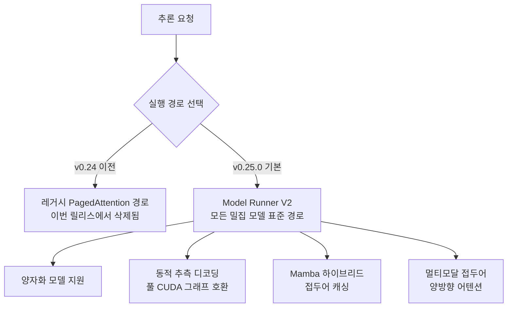

## 개요

vLLM은 오픈 웨이트 LLM을 프로덕션에서 서빙할 때 사실상의 표준 추론 엔진입니다. 높은 처리량과 다양한 하드웨어 지원 덕분에, 자체 GPU에 모델을 올려 서빙하는 팀 대부분이 vLLM을 거칩니다. 그런 엔진의 새 릴리스는 단순한 버전 올림이 아니라, 서빙 스택 전체의 운영 방식에 영향을 주는 사건입니다.

이 글은 추론 인프라를 직접 운영하거나 서빙 비용을 책임지는 엔지니어를 위한 것입니다. 2026년에 공개된 vLLM v0.25.0은 232명의 기여자(신규 64명 포함)가 보낸 558개의 커밋을 담고 있습니다. 규모만큼이나 방향도 분명합니다. 지난 몇 개 릴리스에 걸쳐 준비해 온 새 실행 아키텍처를 이번에 기본값으로 승격하고, 그 과정에서 오래된 경로를 정리했습니다.

핵심을 먼저 요약하면 두 가지입니다. 첫째, **Model Runner V2(MRv2)가 모든 밀집(dense) 모델의 기본 실행 경로**가 되었습니다. 둘째, vLLM을 유명하게 만든 **PagedAttention의 레거시 구현이 삭제**되었습니다. 이 두 변화가 서빙 운영자에게 무엇을 의미하는지, 그리고 함께 들어온 비디오와 추측 디코딩 관련 기능이 어떤 워크로드에 도움이 되는지 짚습니다.

## 이 릴리스는 무엇을 바꿨나

가장 큰 구조적 변화는 MRv2의 승격입니다. 이전 릴리스에서 양자화 모델 지원을 다지며 준비해 온 MRv2가, 이번 v0.25.0부터 밀집 모델의 표준 실행 경로가 되었습니다. 이제 특별한 플래그 없이도 대부분의 모델이 이 새 코어 위에서 돕니다. vLLM 팀은 MRv2를 더 모듈화되고 빠른 코어로 설명하며, 이번 릴리스에서 이를 기본 경로로 확정했습니다.

이 변화의 자연스러운 귀결이 PagedAttention 레거시 구현의 삭제입니다. V1과 MRv2 백엔드가 표준 경로가 되면서, 과거의 어텐션 구현은 더 이상 유지할 이유가 없어졌습니다. PagedAttention은 KV 캐시를 페이지 단위로 관리해 메모리 낭비를 줄인 vLLM 초기의 상징 같은 기법이었지만, 그 아이디어는 이미 새 백엔드 안에 흡수되었습니다. 이번에 삭제된 것은 개념이 아니라 오래된 코드 경로입니다.

전체 실행 경로의 변화를 그림으로 정리하면 다음과 같습니다.



## 핵심 변경 상세

이번 릴리스에서 MRv2 위에 새로 얹힌 기능들은 대체로 멀티모달과 긴 컨텍스트를 겨냥합니다.

첫째, **효율적 비디오 샘플링(EVS, Efficient Video Sampling)**입니다. 비디오를 다루는 비전 언어 모델은 프레임 수가 늘수록 토큰이 폭증해 메모리와 지연이 급격히 나빠집니다. EVS는 거의 정지된 시공간 영역의 토큰을 잘라내되, 남는 토큰의 위치 정체성(positional identity)은 보존합니다. 유지되는 토큰 수가 클립 길이에 대해 선형보다 느리게 증가하기 때문에, 메모리와 지연 예산을 넘기지 않으면서 훨씬 긴 시간적 컨텍스트를 다룰 수 있습니다.

둘째, **동적 추측 디코딩(dynamic speculative decoding)이 풀 CUDA 그래프와 호환**됩니다. 추측 디코딩은 작은 초안 모델이 여러 토큰을 미리 제안하고 본 모델이 이를 검증해 처리량을 끌어올리는 기법입니다. 이것이 CUDA 그래프 캡처와 함께 동작한다는 것은, 커널 실행 오버헤드를 줄이는 최적화와 추측 디코딩의 이득을 동시에 누릴 수 있다는 뜻입니다.

셋째, 여기에는 중요한 상호 배제가 하나 있습니다. **EVS 프루닝을 켜면 비디오 CUDA 그래프는 자동으로 비활성화**됩니다. EVS가 토큰 수를 데이터에 따라 달라지게 만들어, 고정된 형태를 전제하는 CUDA 그래프 캡처와 맞지 않기 때문입니다. 즉 긴 비디오의 토큰 절감을 택하면 그 경로에서는 CUDA 그래프 최적화를 포기하게 됩니다. 워크로드에 따라 어느 쪽이 유리한지 팀이 판단해야 하는 트레이드오프입니다.

이 밖에 실시간 임베딩(realtime embeddings), Mamba 하이브리드 모델을 위한 접두어 캐싱, 멀티모달 접두어의 양방향 어텐션 지원이 함께 들어왔습니다. Mamba 계열 하이브리드 아키텍처가 늘어나는 흐름에서, 이들에 대한 접두어 캐싱 지원은 반복 요청의 비용을 낮추는 실질적인 개선입니다.

## 설치 및 확인

vLLM v0.25.0은 표준 방식으로 설치합니다.

```bash
uv pip install vllm==0.25.0
```

설치 후 모델을 서빙하는 기본 명령은 이전과 동일합니다.

```bash
vllm serve <model-id>
```

MRv2가 기본 경로가 되었기 때문에, 밀집 모델을 서빙할 때 별도의 실행기 플래그를 지정할 필요는 대체로 없습니다.

정직하게 밝히면, 이 글을 작성한 환경에는 GPU가 없어 실제 처리량이나 지연을 직접 측정하지는 못했습니다. 그래서 이 글에는 저희가 실측하지 않은 성능 수치를 넣지 않았습니다. 인용한 사실은 모두 공식 릴리스 노트에서 확인한 것입니다. 즉 커밋과 기여자 수, MRv2의 기본 승격, PagedAttention 레거시 삭제, EVS와 동적 추측 디코딩의 특성은 공개된 릴리스 정보에 근거합니다. 실제 벤치마크는 자체 GPU 클러스터에서 대상 모델과 트래픽 패턴으로 직접 측정하시기를 권합니다.

## ThakiCloud 제품 적용 시사점

이 릴리스는 ThakiCloud의 **ai-platform** 운영과 곧바로 맞닿아 있습니다. ai-platform은 K8s와 Kueue로 GPU를 스케줄링하고 vLLM으로 다양한 고객 환경에 모델을 서빙합니다. vLLM이 서빙 스택의 핵심 엔진이기 때문에, 그 실행 아키텍처의 변화는 곧 저희 운영 방식의 변화이기도 합니다.

MRv2가 기본값이 되었다는 것은, 하나의 실행 경로를 표준으로 삼아 검증과 최적화를 집중할 수 있게 되었다는 뜻입니다. 여러 경로가 공존할 때는 버그 재현과 성능 튜닝이 경로마다 갈라지지만, 표준 경로가 정해지면 운영 복잡도가 줄어듭니다. 멀티테넌트 환경에서 수십 개의 모델을 동시에 서빙하는 입장에서는 이 단순화가 안정성으로 직결됩니다.

동적 추측 디코딩과 CUDA 그래프의 결합, 그리고 Mamba 하이브리드 접두어 캐싱은 서빙 단가를 낮추는 방향의 개선입니다. 낮은 서빙 비용은 온프레미스와 소버린 AI를 요구하는 고객에게 그대로 경쟁력이 됩니다. 자체 인프라에서 값싸게 서빙할 수 있어야, 그 위에서 도는 에이전트와 애플리케이션의 경제성이 성립하기 때문입니다. 이 지점에서 ai-platform의 저비용 서빙은 Paxis 같은 상위 에이전트 계층의 경제성을 떠받치는 토대가 됩니다.

## 한계 및 반론

가장 먼저 짚을 것은 이것이 파괴적 변경(breaking change)을 포함한다는 점입니다. PagedAttention 레거시 경로가 삭제되었기 때문에, 그 경로에 의존하던 커스텀 설정이나 서드파티 통합이 있다면 v0.25.0에서 깨질 수 있습니다. 프로덕션 서빙에서 버전을 올릴 때는 스테이징에서 대상 모델을 실제로 띄워 회귀를 확인한 뒤에 반영해야 합니다. 새 릴리스라고 곧바로 프로덕션에 올리는 것은 위험합니다.

둘째, 앞서 적은 EVS와 CUDA 그래프의 상호 배제처럼, 새 기능이 무조건 이득만 주지는 않습니다. 워크로드의 특성에 따라 어떤 최적화를 켜고 끌지 팀이 판단해야 하며, 이 판단은 실측 없이는 어렵습니다. "새 기능을 다 켜면 빨라진다"는 기대는 현실에서 자주 어긋납니다.

셋째, 릴리스 규모 자체가 리스크입니다. 558개의 커밋이 한 번에 들어온 릴리스는 그만큼 예상하지 못한 상호작용의 여지가 큽니다. 특정 모델 아키텍처나 하드웨어 조합에서만 나타나는 문제가 있을 수 있으므로, 자신이 서빙하는 정확한 모델과 GPU 조합에서 검증하는 절차를 건너뛰지 않는 것이 안전합니다.

정리하면, vLLM v0.25.0은 오랜 준비의 결과를 기본값으로 확정한 릴리스입니다. MRv2로의 통일과 레거시 정리는 장기적으로 서빙 스택을 단순하고 빠르게 만드는 방향이며, 이는 vLLM을 핵심 엔진으로 쓰는 ThakiCloud ai-platform의 운영에도 그대로 이롭습니다. 다만 그 이점을 안전하게 취하려면, 파괴적 변경에 대한 검증과 워크로드별 실측이라는 기본기를 지켜야 합니다.

## 출처

- vLLM v0.25.0 릴리스: [github.com/vllm-project/vllm/releases/tag/v0.25.0](https://github.com/vllm-project/vllm/releases/tag/v0.25.0)
- Model Runner V2 소개: [vllm.ai/blog/2026-03-24-mrv2](https://vllm.ai/blog/2026-03-24-mrv2)
- 효율적 비디오 샘플링(EVS) 논문: [arxiv.org/pdf/2510.14624](https://arxiv.org/pdf/2510.14624)
