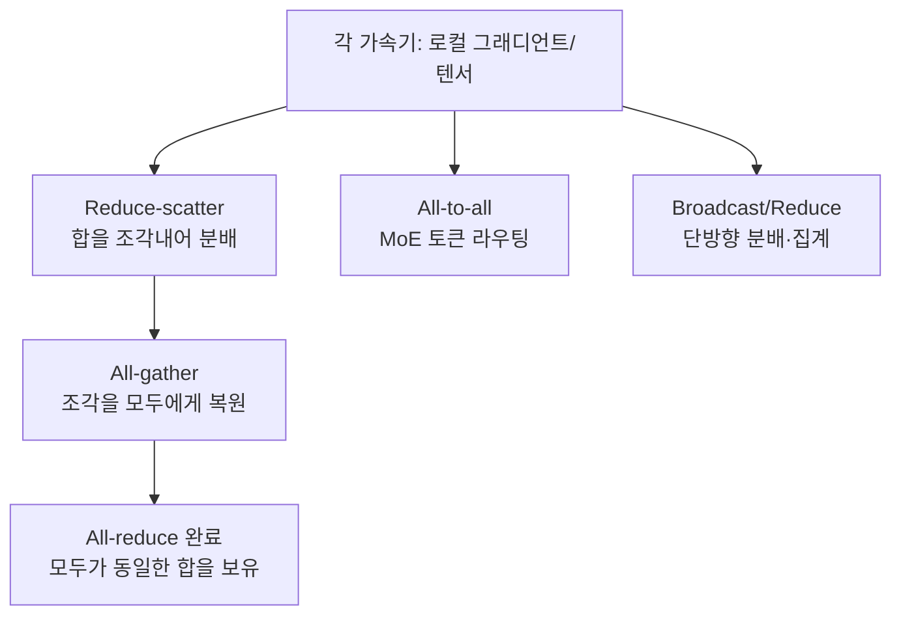

## 개요

대규모 언어 모델을 하나의 GPU에 올릴 수 없게 된 지는 이미 오래되었습니다. 수백억에서 수조 개의 파라미터를 가진 모델은 수십에서 수천 개의 가속기에 걸쳐 나뉘고, 학습 한 스텝마다 그 가속기들이 서로의 결과를 맞춰야 합니다. 이 "서로 맞추는" 과정이 바로 컬렉티브 커뮤니케이션이고, 현대 분산 학습에서 실제로 시간을 잡아먹는 지점은 행렬 곱이 아니라 이 통신인 경우가 대부분입니다.

이 글은 GPU나 TPU 클러스터에서 모델을 학습하거나 서빙하는 인프라 엔지니어, 그리고 서빙 비용과 확장성을 책임지는 사람을 위한 것입니다. 널리 읽힌 Aleksa Gordić의 딥다이브 "Inside TPU and GPU Clusters: The Anatomy of Collective Communication"을 출발점으로 삼되, 거기서 다루는 핵심 개념을 표준 레퍼런스(NCCL, TPU v4 논문 등)로 다시 확인하며 정리했습니다.

핵심 메시지를 먼저 요약하면 이렇습니다. 첫째, 분산 학습의 성능은 몇 가지 컬렉티브 연산으로 환원됩니다. 둘째, 같은 연산이라도 그것이 도는 물리적 토폴로지(NVIDIA의 스위치 기반 구조 대 Google의 토러스 구조)에 따라 비용이 완전히 달라집니다. 셋째, 어떤 병렬화 전략을 쓰느냐가 어떤 컬렉티브를 얼마나 자주 부를지를 결정합니다. 이 세 가지를 이해하면, GPU 몇 장을 어디에 어떻게 배치할지가 성능에 왜 그렇게 큰 영향을 주는지 설명할 수 있습니다.

## 컬렉티브 커뮤니케이션이란 무엇인가

컬렉티브 연산은 여러 프로세스(보통 가속기 한 장에 하나씩)가 함께 참여하는 통신 패턴입니다. 점대점(P2P) 통신이 한 명이 다른 한 명에게 보내는 것이라면, 컬렉티브는 그룹 전체가 규칙에 따라 데이터를 나누고 합칩니다. 분산 학습에서 반복적으로 등장하는 것은 다음 몇 가지입니다.

- **All-reduce**: 모든 참여자가 가진 텐서를 원소별로 합(또는 평균)한 뒤, 그 결과를 모두에게 되돌려줍니다. 데이터 병렬 학습에서 그래디언트를 맞출 때 쓰는 바로 그 연산입니다.
- **Reduce-scatter**: 합을 구하되 결과를 한 명이 다 갖지 않고 조각내어 나눠 갖습니다.
- **All-gather**: 각자가 가진 조각을 모두가 전부 갖도록 모읍니다. reduce-scatter의 짝이 되는 연산으로, 둘을 이어 붙이면 all-reduce가 됩니다.
- **All-to-all**: 각 참여자가 다른 모든 참여자에게 서로 다른 데이터 조각을 보냅니다. 전치(transpose)에 가까운 패턴으로, 전문가 혼합(MoE) 모델에서 토큰을 전문가에게 라우팅할 때 핵심입니다.
- **Broadcast / Reduce**: 한 명이 모두에게 같은 데이터를 뿌리거나, 모두의 데이터를 한 명에게 모아 줄이는 단방향 연산입니다.

여기서 중요한 통찰 하나는 all-reduce가 원자적 연산이 아니라는 점입니다. all-reduce는 **reduce-scatter 다음에 all-gather**로 분해됩니다. 이 분해가 뒤에 나오는 비용 공식의 뿌리가 됩니다.



## GPU 클러스터의 물리적 구조

NVIDIA 기반 클러스터는 두 개의 층으로 나뉜다고 보면 이해가 쉽습니다. 노드 안(scale-up)과 노드 사이(scale-out)입니다.

노드 안에서는 **NVLink**와 **NVSwitch**가 GPU들을 촘촘히 연결합니다. 한 서버 안의 8장 같은 GPU들은 NVSwitch를 통해 서로 완전 연결에 가깝게 묶여, 어느 GPU에서 어느 GPU로든 균일하게 높은 대역폭으로 통신합니다. 텐서 병렬화처럼 통신이 매우 잦은 작업을 이 도메인 안에 가두는 이유가 여기에 있습니다.

노드 사이에서는 **InfiniBand**나 **RoCE**(RDMA over Converged Ethernet)로 구성된 리프-스파인(팻트리) 네트워크가 쓰입니다. 이 스케일아웃 패브릭은 랙과 서버를 가로질러 GPU를 잇습니다. 여기서 자주 등장하는 설계가 레일 최적화(rail-optimized) 토폴로지입니다. 각 노드의 같은 순번 NIC를 같은 스위치("레일")에 붙여, 노드 간 all-reduce가 스파인 층을 덜 거치도록 만드는 방식입니다.

이 유연성에는 대가가 따릅니다. 스케일아웃에 필요한 수천 개의 스위치는 클러스터 전체 전력의 5~10%가량을 소비하고, 상당한 자본 지출을 요구합니다[추정 범위는 구성에 따라 달라집니다]. 즉 NVIDIA의 접근은 "어느 GPU든 어느 GPU와도 잘 통신하게" 만드는 대신, 그 균일함을 능동적으로 패킷을 처리하는 스위치들로 사서 씁니다.

## TPU 클러스터의 다른 선택

Google의 TPU는 전혀 다른 길을 갑니다. TPU 칩은 능동 스위치 패브릭 대신 **ICI(Inter-Chip Interconnect)** 라는 전용 고속 링크로 이웃 칩과 직접 연결됩니다. 최신 세대의 각 칩은 ±X, ±Y, ±Z 여섯 방향으로 ICI 링크를 뻗어 **3D 토러스** 격자를 이룹니다(초기 세대는 2D 토러스로 256칩 규모의 pod를 구성했습니다). 이웃과만 직접 연결되므로 스위치 계층이 대부분 사라집니다.

그러면 멀리 떨어진 칩끼리, 또는 pod보다 큰 규모는 어떻게 잇느냐는 질문이 남습니다. 여기서 **광 회선 스위치(OCS, Optical Circuit Switch)** 가 등장합니다. TPU v4 논문에 따르면 OCS는 광섬유를 MEMS 거울로 재배치하는 방식으로, 광신호를 능동적으로 해석하지 않고 그대로 반사만 시킵니다. 덕분에 4096칩 규모를 재구성 가능한 방식으로 잇으면서도, 거울 방향을 유지하는 데만 전력이 들어 InfiniBand 스위치보다 훨씬 적은 전력으로 동작합니다. 토러스의 한 축을 광학적으로 감아 붙이거나, 고장 난 노드를 우회하도록 토폴로지를 소프트웨어로 재배선하는 것도 가능합니다.

정리하면, GPU 클러스터는 균일 접근을 위해 능동 스위치에 투자하고, TPU 클러스터는 이웃 직결 토러스에 광학 재구성을 얹어 전력과 비용을 절약합니다. 어느 쪽도 무조건 우월하지 않습니다. 토러스는 이웃 통신에 최적이지만 임의의 먼 통신에는 홉이 늘고, 스위치 패브릭은 균일하지만 비싸고 전력을 씁니다.

## 컬렉티브가 병렬화 전략에 매핑되는 방식

어떤 컬렉티브를 얼마나 부를지는 결국 어떤 병렬화를 쓰느냐로 정해집니다.

- **데이터 병렬(DP)**: 각 복제본이 서로 다른 배치를 처리한 뒤, 그래디언트를 **all-reduce**로 맞춥니다. 통신량은 모델 크기에 비례하고, 스텝마다 한 번 발생합니다.
- **완전 샤딩 데이터 병렬(FSDP/ZeRO)**: 파라미터를 조각내어 나눠 갖고, 순전파 직전 **all-gather**로 필요한 파라미터를 모으고, 역전파 후 **reduce-scatter**로 그래디언트를 다시 나눕니다. 메모리를 아끼는 대신 통신 빈도가 늘어납니다.
- **텐서 병렬(TP)**: 하나의 레이어 연산을 여러 GPU가 쪼개어 계산하고, 레이어 경계마다 **all-reduce** 또는 all-gather/reduce-scatter로 합칩니다. 통신이 극도로 잦아, 앞서 말한 NVLink 도메인 안에 가두는 것이 사실상 필수입니다.
- **파이프라인 병렬(PP)**: 모델을 층 단위로 잘라 서로 다른 GPU에 배치하고, 스테이지 사이는 주로 **P2P** 전송으로 활성값을 넘깁니다. 컬렉티브 대신 점대점 통신이 지배적입니다.
- **전문가 병렬(EP/MoE)**: 토큰을 각 전문가가 있는 가속기로 보내야 하므로 **all-to-all**이 핵심입니다. all-to-all은 참여자 수가 늘수록 통신 쌍이 제곱으로 늘어, 토폴로지에 특히 민감합니다.

실전에서는 이들을 겹쳐 씁니다. 예를 들어 TP는 노드 안 NVLink에, DP의 all-reduce는 노드 사이 InfiniBand에, PP는 그 사이를 잇는 식으로 배치를 설계합니다. 잘못 배치하면 잦은 텐서 병렬 통신이 느린 노드 간 링크로 새어 나가 전체 학습이 느려집니다.

## 성능을 지배하는 규칙: 링과 트리

컬렉티브를 실제로 구현하는 알고리즘은 여러 가지지만, 대역폭 관점에서 가장 유명한 것이 **링(ring) all-reduce**입니다. 참여자를 하나의 원형으로 잇고, 각 스텝마다 자기 조각을 다음 이웃에게 넘기며 reduce-scatter와 all-gather를 각각 N-1 스텝에 걸쳐 수행합니다.

이때 각 링크가 실어 나르는 데이터 총량은 다음과 같이 알려져 있습니다. 크기 S의 텐서를 N개 참여자가 all-reduce할 때, 링크당 트래픽은 대략

```
2 × (N − 1) / N × S
```

입니다. reduce-scatter에서 (N−1)/N × S, all-gather에서 다시 (N−1)/N × S가 흐르기 때문입니다. 여기서 중요한 성질은 N이 커져도 (N−1)/N이 1에 수렴하므로, 링크당 트래픽이 약 2S로 평평해진다는 점입니다. 이 때문에 링 all-reduce를 대역폭 최적(bandwidth-optimal)이라고 부르고, NCCL과 Gloo 같은 라이브러리가 오래 사용해 왔습니다.

문제는 지연(latency)입니다. 링은 N−1 스텝을 순차적으로 거치므로, 스텝마다 붙는 고정 지연(α)이 참여자 수에 비례해 쌓입니다. 작은 텐서를 아주 많은 노드가 all-reduce하면, 대역폭은 남는데 지연이 병목이 됩니다. 그래서 실제 라이브러리는 텐서 크기와 노드 수에 따라 링과 트리(또는 계층적) 알고리즘을 자동으로 골라 씁니다. 트리 방식은 지연을 log(N)에 가깝게 줄이는 대신 대역폭 효율을 일부 내줍니다. NCCL이 메시지 크기별로 다른 알고리즘을 선택하는 이유가 여기에 있습니다.

이 규칙이 실무에 주는 함의는 분명합니다. 배치 크기, 모델 크기, 노드 수를 바꾸면 지배적인 병목이 대역폭과 지연 사이를 오갑니다. 벤치마크 없이 "노드를 두 배로 늘리면 두 배 빨라진다"고 가정할 수 없는 이유입니다.

## ThakiCloud 제품 적용 시사점

이 주제는 인프라의 심장에 닿아 있어, ThakiCloud의 **ai-platform**(K8s 기반 AI/ML SaaS 인프라) 관점에서 특히 실질적입니다.

첫째, **토폴로지 인지 스케줄링**입니다. ai-platform은 Kueue로 GPU 워크로드를 스케줄링하는데, 텐서 병렬 잡을 같은 NVLink 도메인(같은 노드) 안에 배치하고 데이터 병렬의 all-reduce는 레일 최적화된 노드 간 링크에 태우는 배치 원칙이, 이 글에서 정리한 컬렉티브의 통신 특성과 정확히 맞물립니다. 어느 컬렉티브가 어느 링크로 흐르는지를 알아야 잡 배치가 성능으로 이어집니다.

둘째, **서빙에서의 텐서 병렬**입니다. vLLM 같은 엔진으로 큰 모델을 여러 GPU에 텐서 병렬로 서빙할 때, 레이어마다 all-reduce가 발생합니다. 이 통신이 NVLink 안에 머무르도록 파드를 배치하면 지연 목표를 지키기 쉽고, 노드 경계를 넘어가면 토큰당 지연이 눈에 띄게 늘어납니다. 멀티테넌트 환경에서 이런 배치 규율은 곧 서빙 비용과 SLA로 직결됩니다.

셋째, **온프렘·소버린 클라우드의 경제성**입니다. GPU 스위치가 전력의 상당 부분을 차지한다는 사실은, 온프레미스나 국내 소버린 환경에서 클러스터를 설계할 때 네트워크가 단순 부속이 아니라 총소유비용(TCO)의 핵심 변수임을 뜻합니다. ThakiCloud가 지향하는 self-hosting과 비용 효율은 이런 네트워크 설계 판단 위에서만 성립합니다.

에이전트 오케스트레이션 제품인 **Paxis** 관점에서도 접점이 있습니다. 분산 학습·대규모 추론 잡을 DAG로 조율하고 격리 실행하는 상황에서, 각 단계가 부르는 컬렉티브의 통신 프로파일을 이해하면 자원 예약과 정책 게이트를 더 정교하게 설계할 수 있습니다. 다만 이 글의 무게중심은 인프라 계층이므로 ai-platform 렌즈가 주가 됩니다.

## 한계 및 반론

이 관점에도 반론이 있습니다. 우선, 프레임워크가 컬렉티브를 상당히 추상화해 준다는 점입니다. PyTorch나 JAX의 상위 API를 쓰면 대부분의 배치 결정이 라이브러리와 스케줄러 안에서 자동으로 일어나고, 애플리케이션 개발자는 이 세부를 몰라도 됩니다. 그래서 "모든 팀이 토러스와 링 공식을 알아야 하는가"라고 물으면, 답은 아니오에 가깝습니다.

그러나 성능이 문제가 되는 순간, 이 추상화는 무너집니다. 학습이 예상보다 느리거나 서빙 지연이 튈 때, 원인을 찾으려면 결국 어떤 컬렉티브가 어느 링크로 흐르는지를 봐야 합니다. 추상화는 정상 경로에서는 편하지만 병목 진단에서는 새는 추상화가 됩니다.

또한 이 글이 정리한 규칙들은 하드웨어 세대에 따라 계속 바뀝니다. NVLink와 InfiniBand의 대역폭, TPU ICI의 링크 수, OCS의 규모는 세대마다 달라지므로, 구체적 수치는 항상 해당 세대의 공식 자료로 다시 확인해야 합니다. 이 글의 공식과 구조는 사고의 틀을 주지만, 프로덕션 판단은 실측 벤치마크로 닫아야 합니다. 마지막으로, 소프트웨어가 하드웨어를 따라가지 못하는 간극도 현실입니다. 이론상 최적인 토폴로지도 커널과 통신 라이브러리가 이를 온전히 활용하지 못하면 그림의 떡입니다.

## 출처

- Aleksa Gordić, "Inside TPU and GPU Clusters: The Anatomy of Collective Communication": https://www.aleksagordic.com/blog/collective-operations
- NVIDIA NCCL 문서 및 링 all-reduce 통신 비용 모델 (reduce-scatter + all-gather, 대역폭 최적성)
- Google TPU v4 논문, "TPU v4: An Optically Reconfigurable Supercomputer for Machine Learning with Hardware Support for Embeddings" (ICI 3D 토러스, OCS): https://arxiv.org/abs/2304.01433
