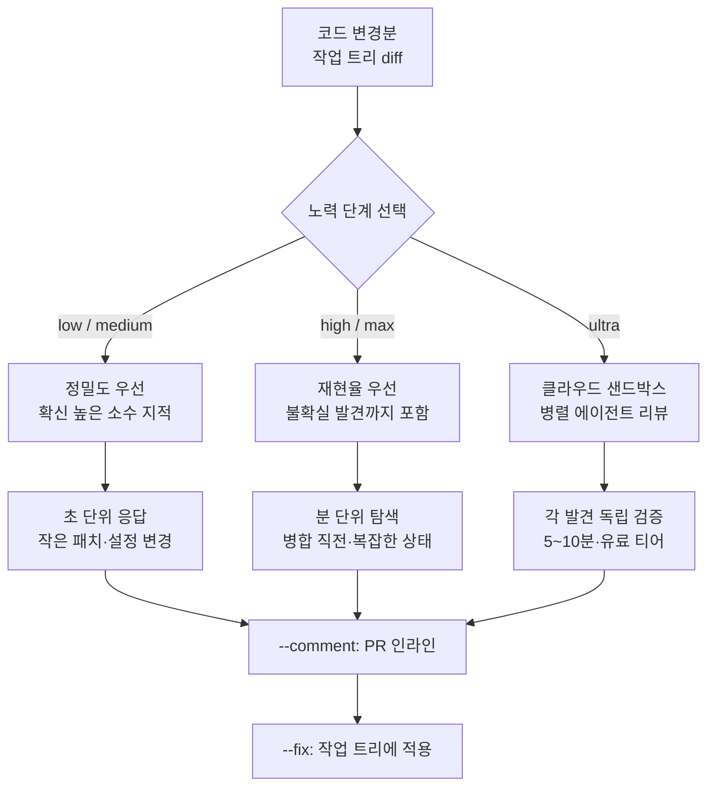

## 개요

코드 리뷰 도구를 고를 때 자주 놓치는 질문이 하나 있습니다. "이 변경에 얼마만큼의 리뷰가 필요한가"입니다. 오탈자 한 줄을 고친 커밋과 결제 로직을 갈아엎은 커밋에 같은 강도의 리뷰를 돌리는 것은 낭비이거나 부족이거나 둘 중 하나입니다. 대부분의 자동 리뷰 도구는 이 구분을 사용자에게 맡기지 않고 한 가지 강도로만 동작했습니다.

Claude Code는 v2.1.101에서 이 문제를 정면으로 다뤘습니다. 2026년 4월 11일 릴리스에서 기존 `/simplify` 명령을 `/code-review`로 바꾸고, 리뷰가 답을 내기 전에 얼마나 깊이 추론할지를 정하는 노력 단계(effort level) 플래그를 붙였습니다. low, medium, high, max, ultra의 다섯 단계이며, 단계마다 리뷰 자체가 다시 쓰입니다. 얕은 단계는 빠르고 확신이 높은 지적만 내놓고, 깊은 단계는 시간을 더 써서 엣지 케이스와 미묘한 회귀까지 훑습니다.

이 글은 AI 코딩 에이전트를 운용하는 ThakiCloud의 관점에서 이 설계를 읽습니다. 노력 단계가 왜 코드 리뷰의 비용과 품질을 나누는 올바른 축인지, 각 단계를 실무에서 언제 골라야 하는지, 그리고 이 발상이 저희가 운영하는 에이전트 플랫폼 Paxis의 스킬 하네스 및 검증 루프와 어떻게 겹치는지 순서대로 살펴봅니다. 아래에 인용한 소요 시간과 비용 수치는 모두 Anthropic이 공개한 문서와 릴리스 노트의 보고값이며, ThakiCloud가 직접 측정한 값이 아닙니다.

## 이 기능은 무엇인가

`/code-review`는 현재 작업 트리의 변경분을 읽고 문제를 찾아 보고하는 슬래시 명령입니다. 핵심 변화는 명령 뒤에 단계를 붙일 수 있다는 점입니다. `/code-review low`처럼 단계를 지정하면, 리뷰 엔진이 그 단계에 맞춰 탐색 범위와 추론 깊이를 조정합니다. 단계를 생략하면 기본값으로 동작합니다.

여기서 중요한 것은 단계가 단순히 "출력을 길게 하느냐 짧게 하느냐"가 아니라는 점입니다. 문서에 따르면 low와 medium은 소수의 확신 높은 발견만 반환하고, high와 max는 확실한 발견에 더해 불확실한 발견까지 함께 내놓습니다. 즉 얕은 단계는 정밀도(precision)를 우선하고, 깊은 단계는 재현율(recall)을 우선하도록 리뷰의 성격 자체가 바뀝니다. 이 구분은 리뷰를 받는 쪽의 심리와도 맞습니다. 작은 패치에서는 오탐이 섞인 긴 목록보다 확실한 몇 개가 낫고, 병합 직전에는 놓치는 것이 없는 편이 낫습니다.



## 다섯 단계를 언제 쓰는가

단계 선택은 변경의 위험도와 남은 시간을 저울질하는 일입니다. 문서가 제시한 성격을 실무 감각으로 옮기면 다음과 같이 정리됩니다.

low와 medium은 빠른 정신 점검용입니다. 설정 파일을 바꾸거나 작은 패치를 올리기 전, 명백한 정합성 버그만 걸러내고 싶을 때 씁니다. 응답이 초 단위로 돌아오므로 커밋 직전에 습관처럼 돌려도 흐름을 끊지 않습니다.

high와 max는 병합 직전이나 복잡한 상태를 다루는 코드 경로에서 씁니다. 기능 브랜치를 main에 합치기 전, 혹은 동시성이나 트랜잭션처럼 미묘한 회귀가 숨기 쉬운 곳을 손봤을 때가 여기 해당합니다. 이 단계는 시간을 더 들여 가정을 검증하고 엣지 케이스를 뒤지므로, 확실한 지적 사이에 "이건 아닐 수도 있지만 확인해 보라"는 발견이 섞여 나옵니다. 이 불확실성을 노이즈로 볼지 안전망으로 볼지는 상황에 달렸습니다. 병합 직전이라면 안전망 쪽이 맞습니다.

ultra는 성격이 다른 도구입니다. 뒤에서 따로 다룹니다.

이 사다리를 한 문장으로 요약하면, 리뷰 강도를 변경의 위험도에 맞추라는 것입니다. 이는 저희가 스케줄 스킬을 운영할 때 지키는 원칙과 정확히 같습니다. 싸게 시작하고, 실패가 쌓이면 그 작업만 비싼 티어로 올립니다. 모든 리뷰를 최고 강도로 돌리는 것은 비용 낭비이고, 모든 리뷰를 최저 강도로 돌리는 것은 사고의 씨앗입니다.

## --comment와 --fix: 리뷰를 워크플로에 넣기

노력 단계와 별개로 두 플래그가 리뷰를 실제 작업 흐름에 끼워 넣습니다. `--comment`는 발견을 PR의 인라인 코멘트로 게시하고, `--fix`는 발견을 작업 트리에 직접 적용합니다.

```bash
# 병합 직전 넓은 커버리지로 리뷰하고 PR에 코멘트 + 로컬 적용
/code-review high --comment --fix

# 클라우드 심층 리뷰 후 결과를 작업 트리에 적용
/code-review ultra --fix
```

문서가 제시한 1인 개발 워크플로는 이렇습니다. `--comment --fix`를 함께 걸어 발견을 PR에 남기고 로컬에도 적용한 뒤, diff를 눈으로 확인하고 푸시합니다. 리뷰어를 기다리지 않고 첫 번째 패스를 자동으로 통과시키는 방식입니다. 다만 `--fix`가 코드를 건드린다는 점에서, 적용된 diff를 사람이 반드시 검토해야 합니다. 자동 적용은 검토의 대체가 아니라 검토를 위한 준비입니다.

## ultrareview: 클라우드 멀티에이전트 리뷰

ultra 단계는 로컬에서 도는 나머지 넷과 다릅니다. `/code-review ultra`를 실행하면 Claude Code가 저장소 상태를 묶어 원격 샌드박스로 업로드하고, 그곳에서 특화된 리뷰어 에이전트들이 코드를 병렬로 분석합니다. 각 에이전트는 서로 다른 종류의 문제에 집중하며, 발견은 개별적으로 독립 검증을 거칩니다. 문서에 따르면 실행에 5분에서 10분이 걸리고, Pro와 Max 구독자에게 3회의 무료 실행 이후에는 실행당 5달러에서 20달러의 비용이 붙습니다.

여기서 두 가지 설계 결정이 눈에 띕니다. 첫째, 리뷰를 단일 에이전트가 아니라 여러 특화 에이전트의 팬아웃으로 처리한다는 점입니다. 하나의 리뷰어가 모든 유형의 결함을 동등하게 잘 찾기는 어렵기 때문에, 문제 유형별로 시각을 나누는 편이 커버리지를 넓힙니다. 둘째, 각 발견을 독립적으로 검증한다는 점입니다. 팬아웃은 그 자체로 환각을 누적할 위험이 있으므로, 합치기 전에 검증 단계로 닫아야 합니다. ultra는 이 두 원칙을 제품 기능으로 구현한 사례입니다.

## ThakiCloud 제품 적용 시사점

이 기능의 설계 원칙은 저희가 에이전트 플랫폼을 운영하며 지켜온 것과 놀랍도록 겹칩니다. 두 제품의 렌즈로 나눠 봅니다.

**Paxis 렌즈.** Paxis는 ThakiCloud의 Agent-Native Cloud로, 스킬(Skills), 도구(Tools), 정책(Policies), 감사 로그(Audit Logs)를 일급 리소스로 다룹니다. `/code-review`가 던지는 질문은 Paxis의 스킬 하네스가 매일 푸는 질문과 같습니다. 어떤 작업에 어떤 강도의 에이전트를 붙일 것인가입니다. Paxis는 960개가 넘는 스킬을 BM25로 선택해 격리 샌드박스에서 실행하는데, 여기서도 노력 단계와 같은 발상이 작동합니다. 탐색과 조회 같은 가벼운 작업은 값싼 티어에, 아키텍처 판단과 검증 같은 무거운 작업은 비싼 티어에 배정합니다. ultra의 멀티에이전트 병렬 리뷰와 발견별 독립 검증은 Paxis가 팬아웃 결과를 검증 스테이지로 닫는 방식과 같은 구조입니다. 검증 없는 팬아웃은 환각을 누적하고, 검증 게이트가 이를 막습니다. 코드 리뷰가 하나의 에이전트 스킬로 격리 실행되고 그 결과가 정책 게이트와 감사 로그를 통과한다면, 그것이 바로 Paxis가 지향하는 운영 모델입니다.

**ai-platform 렌즈.** ultra가 리뷰를 클라우드 샌드박스로 오프로드하고 실행당 비용을 매긴다는 사실은, 에이전트 워크로드가 결국 GPU와 격리 실행 인프라 위에서 돈다는 것을 다시 확인시켜 줍니다. ThakiCloud의 ai-platform은 K8s와 Kueue 기반 GPU 스케줄링, 멀티테넌트 격리, 온프레미스 서빙을 제공합니다. 리뷰어 에이전트 함대를 병렬로 띄우는 워크로드는 정확히 이런 인프라가 필요한 종류의 작업입니다. 특히 소스 코드를 외부 클라우드에 업로드하기 꺼리는 조직이라면, 같은 멀티에이전트 리뷰 패턴을 자체 인프라 안에서 돌리는 선택지가 중요해집니다. 저비용 서빙과 격리 실행이 갖춰져야 에이전트 경제성이 성립한다는 점에서, 두 렌즈는 서로를 보완합니다.

## 한계 및 반론

노력 단계는 만능이 아닙니다. 몇 가지 반론을 정직하게 적습니다.

첫째, 단계 선택 자체가 사용자의 판단에 의존합니다. 위험도를 잘못 읽으면 중요한 변경을 low로 흘려보내거나 사소한 변경에 ultra를 낭비합니다. 도구가 축을 제공했을 뿐, 올바른 축 위의 위치를 정하는 것은 여전히 사람의 몫입니다.

둘째, high와 max가 내놓는 불확실한 발견은 양날의 검입니다. 안전망이 되기도 하지만, 오탐이 많으면 리뷰 피로를 부르고 결국 목록을 무시하게 만듭니다. 검증되지 않은 지적을 얼마나 신뢰할지는 팀의 규율에 달렸습니다.

셋째, ultra는 저장소를 원격 샌드박스로 업로드합니다. 소스 코드가 민감한 조직에는 이 자체가 도입 장벽입니다. 또한 실행당 5달러에서 20달러의 비용은 자주 돌리기에는 부담이며, 무료 3회 이후의 경제성을 팀이 스스로 계산해야 합니다.

넷째, 자동 `--fix`는 검토를 대체하지 않습니다. 적용된 diff를 확인하지 않고 푸시하면, 편해 보이는 자동화가 오히려 조용한 버그를 밀어 넣을 수 있습니다. 자동화는 사고를 대체하는 것이 아니라 보조하는 도구입니다.

그럼에도 노력 단계라는 발상은 옳은 방향입니다. 리뷰의 강도를 변경의 위험도에 맞추는 것은, 저희가 에이전트를 운영하며 배운 비용과 품질의 균형과 정확히 같은 원칙이기 때문입니다.

## 출처

- [Code Review - Claude Code Docs](https://code.claude.com/docs/en/code-review)
- [Claude Code Review: How to Use /code-review and Ultrareview - Fastio](https://fast.io/resources/claude-code-review-guide/)
- [Claude Code Effort Levels Explained - MindStudio](https://www.mindstudio.ai/blog/claude-code-effort-levels-explained)
