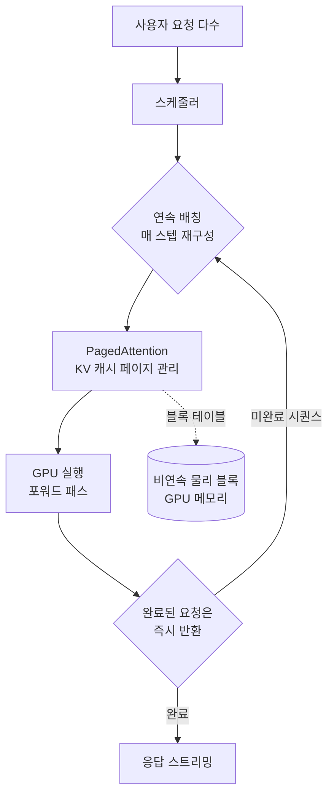

## 개요

대규모 언어모델을 실제 서비스에 올려 본 팀이라면 곧 깨닫게 되는 사실이 하나 있습니다. 서비스의 응답 속도와 비용을 결정하는 것은 어떤 모델을 골랐는가보다, 그 모델을 무엇으로 서빙하는가라는 점입니다. 같은 GPU, 같은 모델이라도 추론 엔진을 무엇으로 쓰느냐에 따라 초당 처리량이 몇 배씩 달라집니다. 그리고 처리량이 몇 배 달라진다는 말은 곧 같은 트래픽을 감당하는 데 필요한 GPU 대수가 몇 배 달라진다는 뜻이며, 이는 그대로 인프라 청구서의 자릿수를 바꿉니다.

이 글은 오늘날 프로덕션 LLM 서빙의 사실상 표준이 된 vLLM을 다룹니다. vLLM이 어떤 문제를 풀기 위해 등장했는지, 핵심 기법인 PagedAttention과 연속 배칭이 실제로 무엇을 하는지, 그리고 그것을 쿠버네티스 위에서 안정적으로 운영하려면 무엇을 신경 써야 하는지를 순서대로 살펴봅니다. 타키클라우드는 고객사의 온프레미스와 관리형 환경 양쪽에서 이 엔진을 운영하고 있으므로, 단순한 개념 설명을 넘어 운영자의 눈으로 정리하겠습니다.

## vLLM은 무엇인가

vLLM은 UC 버클리 연구진이 2023년에 공개한 오픈소스 추론 엔진입니다. 목표는 단순하고 분명합니다. LLM 추론을 더 빠르고 더 싸게 만드는 것입니다. 공개 이후 빠르게 확산되어 지금은 메타, 미스트랄, 코히어, IBM 등 여러 조직의 프로덕션 추론을 떠받치는 기본 선택지가 되었습니다.

vLLM이 겨냥한 것은 전통적인 추론 방식에 숨어 있는 두 가지 낭비입니다. 하나는 메모리 조각화이고, 다른 하나는 GPU 유휴 시간입니다. 이 둘은 겉으로 잘 드러나지 않지만, 합쳐 놓으면 비싼 GPU의 상당 부분을 아무 일도 하지 않는 상태로 놀리게 만듭니다. vLLM의 두 핵심 기법인 PagedAttention과 연속 배칭은 각각 이 두 낭비를 정면으로 겨냥합니다.

전체 구조를 먼저 그림으로 잡으면 다음과 같습니다.



## PagedAttention: 메모리 낭비를 없애다

LLM은 토큰을 하나씩 생성하면서, 앞서 계산한 키와 값을 저장해 둡니다. 이것을 KV 캐시라고 부르며, 긴 문장을 다룰수록 이 캐시가 GPU 메모리를 크게 차지합니다. 문제는 전통적인 방식이 각 요청마다 예상 최대 길이만큼 메모리를 미리, 그것도 연속된 큰 덩어리로 잡아 둔다는 데 있습니다. 실제 응답이 그보다 짧으면 잡아 둔 메모리의 상당 부분이 그냥 버려집니다. 여러 요청이 동시에 들어오면 이 낭비가 누적되어, GPU에 여유 메모리가 있는데도 새 요청을 받지 못하는 상황이 벌어집니다.

PagedAttention은 운영체제가 램을 다루는 방식, 곧 가상 메모리와 페이징에서 아이디어를 그대로 가져왔습니다. KV 캐시를 하나의 큰 덩어리로 잡는 대신, 작고 재사용 가능한 페이지 단위로 잘게 나눕니다. 각 시퀀스의 논리적 블록은 블록 테이블을 통해 GPU 메모리 안의 비연속 물리 블록으로 연결됩니다. 이렇게 하면 실제로 필요한 만큼만 페이지를 할당하므로, 메모리 낭비가 크게 줄어듭니다. vLLM 측 자료에 따르면 이 방식으로 메모리 낭비를 최대 90퍼센트까지 줄일 수 있다고 보고됩니다.

부가 효과도 큽니다. 병렬 샘플링이나 빔 서치처럼 하나의 프롬프트에서 여러 갈래를 만들어 내는 복잡한 디코딩에서, vLLM은 프롬프트의 KV 캐시를 복제할 필요가 없습니다. 여러 논리 블록이 같은 물리 블록을 가리키게 하고, 그중 하나가 블록을 수정할 때에만 복사본을 만드는 쓰기 시 복사 방식을 씁니다. 덕분에 같은 접두 문맥을 공유하는 요청들이 메모리를 아끼며 공존할 수 있습니다.

## 연속 배칭: GPU를 놀리지 않는다

두 번째 낭비는 시간의 낭비입니다. 전통적인 정적 배칭은 요청을 배치 단위로 묶어 함께 처리하고, 배치 안의 모든 요청이 끝날 때까지 다음 배치를 시작하지 않습니다. 문제는 요청마다 생성하는 토큰 수가 제각각이라는 데 있습니다. 짧은 답을 내는 요청은 진작 끝났는데도, 배치 안의 가장 긴 요청이 끝날 때까지 기다려야 합니다. 그동안 이미 끝난 요청이 차지하던 GPU 자리는 놀게 됩니다.

연속 배칭은 이 대기를 없앱니다. 스케줄러가 배치 단위가 아니라 반복 단위, 곧 매 포워드 패스마다 판단을 내립니다. 어떤 요청이 이번 스텝에 끝나면 그 자리를 즉시 대기 중이던 새 요청으로 채웁니다. 진행 중인 요청과 새 요청을 매 스텝 동적으로 섞기 때문에 GPU가 비는 순간이 거의 없습니다. 이 방식으로 같은 하드웨어에서 처리량이 3배에서 10배까지 올라간다고 보고됩니다.

PagedAttention과 연속 배칭을 함께 적용하면, 순진하게 구현한 서빙 대비 처리량이 대략 2배에서 4배 향상된다는 것이 공통된 관측입니다. 두 기법은 서로를 보완합니다. 연속 배칭이 매 스텝 새 요청을 끼워 넣으려면 그만큼 유연하게 메모리를 붙였다 떼었다 할 수 있어야 하는데, 그 유연성을 PagedAttention이 제공하기 때문입니다.

> 위 수치들은 vLLM 프로젝트와 여러 벤치마크 자료가 보고한 값이며, 실제 향상 폭은 모델 크기, 시퀀스 길이 분포, 하드웨어에 따라 달라집니다. 자사 환경의 정확한 수치는 실제 워크로드로 측정해야 합니다.

## 프로덕션에서 어떻게 쓰는가

개념을 이해했다면, 실제 운영은 의외로 단조롭습니다. vLLM은 OpenAI 호환 서버를 기본 제공하므로, 기존에 외부 API를 호출하던 코드가 엔드포인트 주소만 바꾸면 그대로 동작하는 경우가 많습니다.

가장 단순한 형태의 서버 기동은 다음과 같습니다.

```bash
# vLLM 설치 (CUDA 환경)
pip install vllm

# OpenAI 호환 서버 기동
vllm serve meta-llama/Llama-3.1-8B-Instruct \
  --tensor-parallel-size 1 \
  --max-model-len 8192 \
  --gpu-memory-utilization 0.90
```

호출은 기존 OpenAI 클라이언트를 그대로 씁니다.

```python
from openai import OpenAI

client = OpenAI(base_url="http://localhost:8000/v1", api_key="EMPTY")
resp = client.chat.completions.create(
    model="meta-llama/Llama-3.1-8B-Instruct",
    messages=[{"role": "user", "content": "vLLM을 한 문장으로 설명해줘"}],
)
print(resp.choices[0].message.content)
```

프로덕션에서 실제로 손이 가는 지점은 서버를 띄우는 명령 자체가 아니라 그 주변의 운영 파라미터입니다. 대표적으로 다음을 신경 써야 합니다.

- `--gpu-memory-utilization`: KV 캐시로 쓸 GPU 메모리 비율입니다. 너무 높이면 순간적으로 메모리 초과가 나고, 너무 낮추면 동시에 받을 수 있는 요청 수가 줄어듭니다.
- `--tensor-parallel-size`: 모델을 여러 GPU에 나눠 싣는 텐서 병렬 크기입니다. 단일 GPU에 올라가지 않는 큰 모델을 서빙할 때 필수입니다.
- `--max-model-len`: 최대 컨텍스트 길이입니다. 길게 잡을수록 요청당 KV 캐시가 커져 동시 처리량이 줄어드는 상충 관계가 있습니다.

쿠버네티스 위에서 운영할 때에는 여기에 스케줄링과 자원 관리가 더해집니다. GPU는 비싸고 유한한 자원이므로, 여러 팀과 여러 모델이 한 클러스터를 공유하면 곧바로 자원 경합이 발생합니다. 이때 필요한 것이 큐 기반 배치 스케줄링입니다. 타키클라우드는 이 계층에 Kueue를 두어, 어떤 워크로드가 언제 얼마만큼의 GPU를 점유할지를 정책으로 관리합니다.

## ThakiCloud 제품 적용 시사점

타키클라우드의 ai-platform은 쿠버네티스 기반의 AI/ML SaaS 인프라로, 고객사의 다양한 환경에서 모델을 서빙하는 것을 핵심 역량으로 삼습니다. vLLM은 이 서빙 계층의 기본 엔진입니다. PagedAttention과 연속 배칭이 만들어 내는 처리량 이득은 곧 서빙 비용의 절감으로 직결되며, 이는 저희가 고객사에 낮은 서빙 비용을 제시할 수 있는 근거가 됩니다.

특히 온프레미스와 소버린 환경에서 이 조합의 가치가 큽니다. 데이터를 외부로 내보낼 수 없는 고객사는 자체 GPU 인프라 안에서 모델을 돌려야 하는데, 이때 GPU 한 장이 감당하는 처리량을 최대한 끌어올리는 것이 곧 도입 가능성 그 자체를 결정합니다. 추론 엔진이 GPU를 2배 더 효율적으로 쓴다면, 같은 서비스를 절반의 하드웨어로 운영할 수 있다는 뜻이기 때문입니다.

운영 관점에서 타키클라우드가 더하는 가치는 엔진 그 자체가 아니라 그 주변의 골격입니다. Kueue를 통한 GPU 큐 관리, 멀티테넌트 격리, 자동 스케일링과 관측성, 그리고 여러 모델을 한 클러스터에서 안전하게 공존시키는 정책 계층입니다. vLLM이 단일 서버의 효율을 책임진다면, 플랫폼은 그 서버 수십 대를 조직 전체가 안정적으로 공유하도록 만드는 일을 책임집니다.

## 한계 및 반론

vLLM이 만능은 아닙니다. 몇 가지 정직한 한계를 남깁니다.

첫째, vLLM의 강점은 처리량, 곧 동시에 많은 요청을 받을 때 빛납니다. 반대로 요청이 드물게 하나씩만 들어오는 저부하 상황이라면 연속 배칭의 이점이 크지 않으며, 이때는 지연 시간 최적화에 특화된 다른 접근이 더 나을 수 있습니다. 자신의 트래픽 패턴이 대량 동시 요청인지, 드문드문한 단발 요청인지를 먼저 파악해야 합니다.

둘째, PagedAttention과 연속 배칭이 주는 수치는 워크로드에 크게 의존합니다. 시퀀스 길이가 매우 길거나 매우 짧은 경우, 또는 특정 하드웨어에서는 보고된 향상 폭이 그대로 재현되지 않을 수 있습니다. 도입 결정은 반드시 자사 워크로드를 대표하는 실제 부하 테스트에 근거해야 하며, 남이 보고한 배수를 그대로 자신의 것으로 가정해서는 안 됩니다.

셋째, 엔진의 효율이 좋아질수록 병목은 오히려 그 위쪽, 곧 스케줄링과 멀티테넌트 운영으로 옮겨 갑니다. 단일 서버를 아무리 최적화해도, 여러 팀이 GPU를 두고 다투는 문제는 엔진이 아니라 플랫폼 계층에서 풀어야 합니다. vLLM은 훌륭한 출발점이지만 완성점은 아니며, 프로덕션의 진짜 난제는 그 다음에 시작됩니다.

## 출처

- [vLLM Explained: PagedAttention and Continuous Batching (RunPod)](https://www.runpod.io/articles/guides/vllm-pagedattention-continuous-batching)
- [LLM Serving Optimization: Continuous Batching, PagedAttention, and Chunked Prefill (Spheron)](https://www.spheron.network/blog/llm-serving-optimization-continuous-batching-paged-attention/)
- [vLLM Production Deployment (Introl)](https://introl.com/blog/vllm-production-deployment-inference-serving-architecture-guide)
- [vLLM: Deploying LLMs at Scale (LearnOpenCV)](https://learnopencv.com/vllm-deploy-llms-at-scale-paged-attention/)
