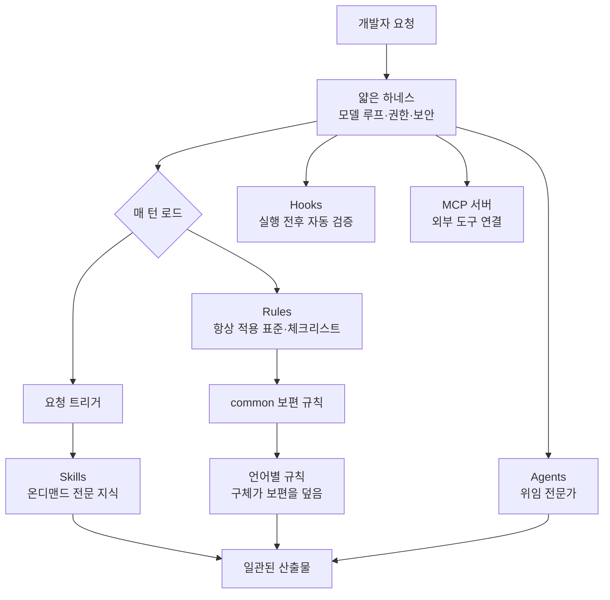

## 개요

AI 코딩 도구를 며칠만 진지하게 써 본 개발자라면 곧 같은 벽에 부딪힙니다. 어제 분명히 "이 프로젝트는 이렇게 커밋하고, 이 폴더는 건드리지 말고, 테스트는 이 명령으로 돌린다"고 알려 줬는데, 오늘 새 세션을 열면 도구는 그 약속을 하나도 기억하지 못합니다. 매번 같은 규칙을 다시 붙여 넣고, 매번 컨벤션을 어긴 코드를 되돌리는 작업이 반복됩니다. 모델이 똑똑해질수록 이 격차는 더 답답해집니다. 능력은 충분한데, 그 능력을 우리 규칙 안에서 일관되게 쓰게 만드는 골격이 없기 때문입니다.

`everything-claude-code`는 바로 이 골격을 정면으로 다룬 오픈소스 설정 모음입니다. 한 Anthropic 해커톤 우승자가 실제 TypeScript 마이크로서비스 프로젝트를 6개월 넘게 굴리며 다듬은 프로덕션급 설정을 통째로 공개했고, 공개 이후 GitHub에서 빠르게 별을 모았습니다(트윗 기준 약 9,700개, [추정]). 이 글은 이 저장소가 무엇을 담고 있는지, 어떤 설계 원칙 위에 서 있는지, 그리고 그 원칙이 타키클라우드가 만드는 에이전트 플랫폼과 어떻게 맞닿는지를 순서대로 살펴봅니다. 타키클라우드는 이 저장소의 규칙 세트를 실제 사내 표준으로 채택해 운용하고 있으므로, 단순 소개를 넘어 직접 써 본 관점에서 정리하겠습니다.

## everything-claude-code는 무엇인가

`everything-claude-code`(줄여서 ECC)는 스스로를 "에이전트 하네스 성능 최적화 시스템"이라고 소개합니다. 담고 있는 것은 여섯 종류의 설정 자산입니다. 위임 작업을 처리하는 서브에이전트(agents), 온디맨드로 불려 나오는 전문 지식 묶음(skills), 도구 실행 전후에 자동으로 끼어드는 훅(hooks), 반복 작업을 감싼 슬래시 커맨드(commands), 항상 적용되는 규칙(rules), 그리고 외부 도구를 붙이는 MCP 서버 설정(MCPs)입니다.

중요한 점은 이것이 특정 취미 프로젝트의 설정이 아니라는 것입니다. 저자는 2025년 9월 Anthropic x Forum Ventures 해커톤에서 Claude Code만으로 제품을 만들어 우승했고, 그 뒤 매일 실제 제품을 만들며 이 설정을 10개월 넘게 갈고닦았습니다. 저장소가 스스로 밝히는 품질 지표도 구체적입니다. 테스트 1,282개, 커버리지 98%, 정적 분석 규칙 102개를 갖췄다고 명시합니다. 설정 모음이 이 정도 규율을 갖췄다는 사실 자체가, 저자가 "AI에게 맡길 규칙"과 "그 규칙을 지키는지 검증하는 코드"를 분리해 관리한다는 증거입니다.

또 하나의 특징은 하네스 중립성입니다. ECC는 Claude Code뿐 아니라 Codex, Opencode, Cursor 같은 다른 코딩 에이전트에서도 쓰이도록 설계됐습니다. 같은 규칙과 스킬을 여러 도구에 걸쳐 재사용한다는 발상은, 뒤에서 다룰 설계 철학의 자연스러운 귀결입니다.

## 아키텍처: 얇은 하네스, 두꺼운 스킬

ECC의 심장은 하나의 원칙입니다. **능력은 하네스가 아니라 스킬에 쌓는다.** 하네스, 그러니까 모델 루프·파일 접근·권한·보안 같은 실행 골격은 최소로 유지하고, 도메인 지식·판단 기준·템플릿·실패 사례는 스킬과 규칙에 두껍게 쌓습니다. 그래야 같은 스킬이 Claude Code든 Cursor든 여러 하네스를 가로질러 그대로 작동합니다.

이 철학은 곧바로 두 가지 실질적인 구분으로 이어집니다. 첫째, 규칙(Rules)과 스킬(Skills)의 역할 분리입니다. 규칙은 "테스트 커버리지 80% 이상", "하드코딩된 시크릿 금지"처럼 넓게 항상 적용되는 표준과 체크리스트입니다. 매 턴 로드됩니다. 반면 스킬은 특정 작업에 깊게 필요한 실행 지식으로, 요청이 그것을 부를 때만 로드됩니다. 규칙은 *무엇을* 할지 정하고, 스킬은 *어떻게* 할지 알려 줍니다.

둘째, 규칙 자체를 계층으로 쌓습니다. `common/` 디렉터리에는 언어와 무관한 보편 원칙(코딩 스타일, 깃 워크플로, 테스트, 보안 등)이 들어가고, 그 위에 `typescript/`, `python/`, `golang/`, `web/` 같은 언어별 디렉터리가 보편 규칙을 확장하거나 덮어씁니다. 우선순위는 CSS 명시도나 `.gitignore` 규칙과 같습니다. 더 구체적인 규칙이 더 일반적인 규칙을 이깁니다. 예를 들어 보편 규칙은 불변성을 기본 원칙으로 권하지만, Go의 언어별 규칙은 포인터 리시버를 통한 구조체 변경이 관용적이라고 명시해 그 지점만 덮어씁니다.

전체 구조를 그림으로 잡으면 다음과 같습니다.



이 구조가 앞의 "매번 규칙을 잊는" 문제를 어떻게 푸는지 보이기 시작합니다. 규칙은 매 세션 자동으로 로드되므로 개발자가 컨벤션을 다시 붙여 넣을 필요가 없습니다. 스킬은 필요할 때만 로드되므로 컨텍스트 창을 낭비하지 않습니다. 훅은 도구가 규칙을 어겼는지 코드 수준에서 자동 검증합니다. 모델의 자기 보고에 기대지 않고, 결정론적 검사가 품질을 강제하는 셈입니다.

## 실제로 어떻게 도입하는가

도입 경로는 두 가지입니다. 가장 쉬운 길은 Claude Code 플러그인 마켓플레이스를 통해 설치하는 것입니다. 좀 더 직접적인 길은 저장소를 클론한 뒤 필요한 자산만 자신의 Claude 설정 디렉터리로 복사하는 것입니다. 계층 구조를 깨뜨리지 않으려면 디렉터리 단위로 복사해야 합니다.

```bash
# ECC 규칙 네임스페이스를 한 번 만들어 둡니다.
mkdir -p ~/.claude/rules/ecc

# 보편 규칙(모든 프로젝트 필수)을 복사합니다.
cp -r rules/common ~/.claude/rules/ecc/

# 프로젝트 스택에 맞는 언어별 규칙을 복사합니다.
cp -r rules/typescript ~/.claude/rules/ecc/
cp -r rules/golang ~/.claude/rules/ecc/
cp -r rules/web ~/.claude/rules/ecc/
```

여기서 흔한 실수 하나를 저장소가 명시적으로 경고합니다. `rules/common/*`처럼 와일드카드로 평탄화해 복사하면 안 됩니다. 보편 디렉터리와 언어별 디렉터리에는 같은 이름의 파일(`coding-style.md`, `testing.md` 등)이 들어 있어서, 평탄화하면 언어별 파일이 보편 파일을 덮어쓰고 상대 경로 참조(`../common/`)가 깨집니다. 계층을 유지하려면 반드시 디렉터리 통째로 복사해야 합니다.

MCP 서버 설정은 별도로 다뤄야 합니다. `mcp-configs`에서 필요한 서버 설정만 골라 가져오되, **한꺼번에 전부 켜지 않는 것**이 핵심입니다. 저장소는 이 지점을 강하게 경고합니다. 도구가 너무 많이 붙으면 200k였던 컨텍스트 창이 실질적으로 70k까지 줄어들 수 있기 때문입니다. 활성화된 MCP 서버 하나하나가 매 턴 스키마 비용을 지불하므로, 실제로 쓰는 서버만 켜는 위생이 필요합니다.

훅은 저장소가 강조하는 자동화의 핵심입니다. 예를 들어 파일을 수정한 뒤 포매터를 돌리는 훅, 커밋 전 파일 크기를 검사하는 훅, 세션 종료 시 프로덕션 빌드를 검증하는 훅을 프로젝트의 기존 도구 엔트리포인트에 연결합니다. 원격에서 일회성 패키지를 실행하는 훅은 지양하고, 저장소가 소유한 로컬 의존성을 쓰는 것이 권장 방식입니다.

## 타키클라우드 제품 적용 시사점

ECC가 던지는 설계 원칙은 타키클라우드가 만드는 것과 놀랄 만큼 겹칩니다. 여기서 두 개의 렌즈로 나눠 보겠습니다.

**Paxis 렌즈(에이전트 플랫폼).** 타키클라우드의 Paxis는 ai-platform 위에서 도는 Agent-Native Cloud 제어 평면으로, Skills·Tools·Policies·Audit Logs를 일급 리소스로 다룹니다. ECC의 "얇은 하네스, 두꺼운 스킬" 철학은 정확히 Paxis가 제품화하는 모델입니다. Paxis의 Skill Harness는 960개가 넘는 스킬을 BM25로 선택해 격리된 샌드박스에서 실행하고, 모든 행동을 정책 게이트와 감사 로그로 통과시킵니다. 다시 말해 ECC가 개인 개발자의 `~/.claude` 디렉터리에서 손으로 관리하는 규칙·스킬·훅의 계층을, Paxis는 멀티테넌트 클라우드 수준에서 자동 선택·격리 실행·정책 강제·감사로 끌어올립니다. ECC가 개인 워크플로에서 검증한 원리를 조직과 플랫폼 규모에서 운영 가능한 형태로 만든 것이 Paxis라고 볼 수 있습니다. ECC의 "규칙은 매 턴 로드되어 세금을 낸다"는 통찰은 Paxis가 스킬을 온디맨드로만 로드하고 BM25로 노이즈를 거르는 설계와 그대로 이어집니다.

**ai-platform 렌즈(인프라).** 계층화된 규칙이라는 발상은 인프라 표준화에도 그대로 적용됩니다. ECC가 보편 규칙과 언어별 규칙을 나누듯, 타키클라우드의 ai-platform은 조직 공통 기본값과 클러스터별·테넌트별 오버라이드를 나눠 관리합니다. K8s·Kueue GPU 스케줄링·vLLM 서빙 같은 인프라 표준을 한 번 정의해 여러 고객 환경에 일관되게 적용하되, 환경별 특수성은 하위 계층에서 덮어쓰는 구조는 ECC의 규칙 우선순위 모델과 같은 형태입니다. 온프레미스와 소버린 요구가 강한 고객일수록, "한 번 정의한 표준을 일관되게 강제하되 환경별로 안전하게 덮어쓴다"는 규율이 곧 운영 신뢰성으로 이어집니다.

정리하면, ECC는 개인이 손으로 다듬은 하네스 위생의 정수이고, 타키클라우드는 그 위생을 플랫폼이 자동으로 지켜 주는 제품을 만듭니다. 저비용 서빙(ai-platform)이 에이전트의 경제성을 만들고, 그 위에서 정책과 감사를 갖춘 스킬 실행(Paxis)이 신뢰를 만듭니다.

## 한계 및 반론

균형을 위해 반대편도 짚겠습니다. 첫째, ECC는 한 사람의 취향과 워크플로가 강하게 반영된 설정입니다. 6개월간 특정 TypeScript 마이크로서비스를 다듬으며 나온 결과물이므로, 그대로 복사해 다른 스택이나 다른 팀 문화에 붙이면 오히려 마찰이 생길 수 있습니다. 저장소가 "그대로 복붙하지 말고 프로젝트 요구에 맞게 조정하라"고 반복해 경고하는 이유입니다.

둘째, 설정이 두꺼워질수록 관리 비용도 커집니다. 규칙이 매 턴 로드된다는 것은 곧 매 턴 토큰을 소비한다는 뜻입니다. 규칙과 스킬을 늘리다 보면 "이게 정말 매 세션 필요한가"를 끊임없이 되물어야 하고, 그렇지 않으면 컨텍스트 예산이 조용히 새어 나갑니다. ECC 자신도 "모든 문장이 임대료를 내야 한다"는 규율로 이 문제를 다루지만, 규율을 지키는 것은 결국 사람의 몫입니다.

셋째, 하네스 중립성은 이상이지 보장이 아닙니다. 같은 스킬이 Claude Code와 Cursor에서 동일하게 작동한다는 약속은, 각 하네스의 도구 표면과 권한 모델이 실제로 호환될 때만 성립합니다. 하네스마다 훅 실행 방식이나 파일 접근 규칙이 다르면, 중립적으로 쓴 스킬이 특정 하네스에서 조용히 어긋날 수 있습니다.

그럼에도 ECC의 가치는 분명합니다. AI 코딩 도구의 품질 문제는 대개 모델이 약해서가 아니라, 모델을 감싸는 규칙과 검증 골격이 없어서 생깁니다. ECC는 그 골격을 실전에서 검증된 형태로 공개했고, 타키클라우드는 같은 원리를 플랫폼 규모로 끌어올리는 길을 걷고 있습니다. AI에게 코드를 맡기려는 팀이라면, 모델을 바꾸기 전에 하네스부터 점검하라는 이 저장소의 메시지는 새겨 둘 만합니다.

## 출처

- [everything-claude-code (affaan-m/everything-claude-code), GitHub](https://github.com/affaan-m/everything-claude-code)
- Anthropic x Forum Ventures 해커톤 우승작 [zenith.chat](https://zenith.chat/) 관련 저자 소개
- 원 트윗: @Ryrenz (RT @hjguyhan), 2026-07-20
