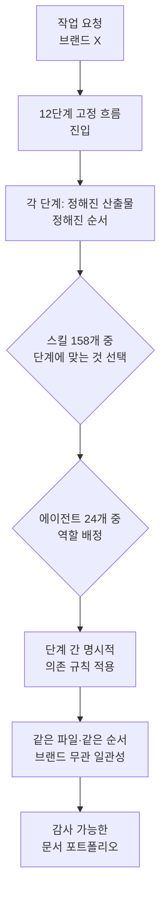

## 개요

에이전트 시스템을 조금이라도 진지하게 만들어 본 사람이라면 곧 같은 역설에 부딪힙니다. 스킬과 에이전트를 많이 넣을수록 시스템이 똑똑해질 것 같지만, 실제로는 그 반대인 경우가 많습니다. 스킬이 수십 개를 넘어가면 에이전트가 어떤 스킬을 언제 써야 할지 헷갈리기 시작하고, 에이전트가 여러 개가 되면 같은 일을 서로 다르게 처리하거나 산출물의 순서와 형식이 매번 흔들립니다. 능력은 늘었는데 결과의 일관성은 오히려 떨어지는 것입니다.

오픈소스 마케팅 플러그인 **Digital Marketing Pro**는 이 역설을 정면으로 다룬 흥미로운 사례입니다. 이 플러그인은 스킬 158개와 전문 에이전트 24개(저장소 문서 기준 25개, 원 트윗은 24개로 소개)를 하나로 묶고도, 매번 같은 파일을 같은 순서로 뽑아내는 일관성을 유지합니다. 비결은 더 똑똑한 모델이 아니라 12단계로 고정된 전략 흐름, 즉 결정론적 골격입니다. 이 글은 마케팅 도구 자체가 아니라, 그 안에 담긴 에이전트 엔지니어링 설계를 뜯어봅니다. 스킬이 폭발적으로 늘어나도 무너지지 않는 구조가 무엇인지, 그리고 그 원리가 타키클라우드가 만드는 에이전트 플랫폼과 어떻게 맞닿는지 순서대로 살펴보겠습니다.

이 사례가 개발자에게 의미 있는 이유는 분명합니다. "스킬을 많이 만들면 되지 않나"라는 소박한 기대가 왜 실무에서 자주 실패하는지, 그리고 그 실패를 무엇으로 막는지를 구체적인 오픈소스 코드로 보여 주기 때문입니다.

## 이 플러그인은 무엇인가

Digital Marketing Pro는 MIT 라이선스로 공개된 오픈소스 마케팅 플러그인입니다. 표면적인 목적은 대행사와 사내 마케팅 팀이 여러 브랜드의 마케팅 문서를 일관되게 생산하도록 돕는 것입니다. 저장소 설명에 따르면 50개에서 200개 사이의 고객 브랜드를 다루는 대행사를 겨냥하며, 모든 브랜드를 동일한 12단계 흐름에 통과시켜 같은 파일을 같은 순서로 생성합니다.

숫자만 보면 이 플러그인은 상당히 큽니다. 스킬 158개, 전문 에이전트 24개, 그리고 12단계 전략 흐름을 61개의 세부 단계로 펼친 구조를 갖고 있습니다. 여기에 EU AI Act 제50조 대응, Google AI Mode를 포함한 6개 플랫폼용 AEO/GEO(답변 엔진 최적화) 기능, 팀 단위로 상태를 유지하는 Cowork 지원까지 얹혀 있습니다.

주목할 점은 설치 대상입니다. 이 플러그인은 Claude Code 하나에만 묶여 있지 않고, Cowork, Codex, Cursor, Copilot CLI, Antigravity 등 여러 에이전트 런타임에 설치됩니다. 즉 하나의 스킬·에이전트 묶음이 여러 harness를 가로질러 동작하도록 설계되었습니다. 이 점은 뒤에서 따로 다룰 만큼 중요한 설계 결정입니다.

정리하면 이 플러그인은 "마케팅 도구"라는 겉모습 아래, 대규모 스킬·에이전트 묶음을 어떻게 조직하고 일관되게 실행할 것인가에 대한 하나의 답을 담고 있습니다.

## 결정론적 골격이 스킬 폭발을 다스린다

이 플러그인의 핵심 통찰은 158개의 스킬과 24개의 에이전트가 자유롭게 협업하도록 두지 않는다는 데 있습니다. 대신 모든 작업을 12단계로 고정된 전략 흐름에 강제로 통과시킵니다. 각 단계는 정해진 산출물을 정해진 순서로 만들며, 단계 사이에는 명시적인 의존 규칙이 있습니다. 앞 단계의 결과가 있어야 다음 단계가 실행되고, 결과 파일의 이름과 순서가 브랜드가 바뀌어도 동일하게 유지됩니다.

이것이 왜 중요한지는 반대 상황을 상상하면 분명해집니다. 만약 24개의 에이전트가 자유롭게 "가장 좋아 보이는" 스킬을 골라 자유 순서로 실행한다면, 브랜드마다 산출물의 구성과 형식이 달라질 것입니다. 어떤 브랜드는 경쟁사 분석이 먼저 나오고, 어떤 브랜드는 그 단계가 통째로 빠질 수 있습니다. 대행사가 200개의 고객을 관리한다면 이런 편차는 곧 감사 불가능한 혼돈이 됩니다. 12단계 흐름은 바로 이 자유도를 의도적으로 줄여, 평균 품질과 일관성을 끌어올립니다.

아래는 이 결정론적 골격이 스킬과 에이전트의 자유도를 어떻게 제약하는지를 단순화한 흐름입니다.

여기서 배울 점은 마케팅과 무관합니다. 스킬과 에이전트가 늘어날 때 품질을 지키는 방법은 모델을 더 똑똑하게 만드는 것이 아니라, 자유 설계를 검증된 골격에 채우기로 강등시키는 것입니다. 포맷과 순서와 의존성을 결정론적 구조가 소유하고, 모델은 그 골격 안의 내용만 채웁니다. 스킬이 158개든 500개든, 골격이 자유도를 잡아 주는 한 결과는 예측 가능합니다.

## 여섯 개 런타임에 설치된다는 것의 의미

또 하나 눈여겨볼 설계는 이 플러그인이 여러 에이전트 런타임에 걸쳐 설치된다는 점입니다. Claude Code, Cursor, Codex, Copilot CLI 등은 각각 다른 harness입니다. 시스템 프롬프트도 다르고, 도구 정의 방식도 다르고, 권한 모델도 다릅니다. 그런데도 같은 스킬·에이전트 묶음이 이들 위에서 동작하도록 설계되었다는 것은, 능력을 harness가 아니라 스킬 쪽에 쌓았다는 뜻입니다.

이 구분은 실무적으로 중요합니다. 만약 마케팅 워크플로의 지식이 특정 도구의 설정 파일이나 시스템 프롬프트에 박혀 있다면, 도구를 바꾸는 순간 모든 것을 다시 만들어야 합니다. 반대로 지식이 이식 가능한 스킬 묶음에 담겨 있으면, harness는 얇게 유지하고 스킬은 도구를 가로질러 재사용됩니다. Digital Marketing Pro의 크로스 런타임 설치는 이 "얇은 harness, 두꺼운 스킬" 원칙을 상업적 규모에서 실천한 사례입니다.

물론 여러 런타임을 동시에 지원하는 데는 대가가 따릅니다. 런타임마다 스킬을 로드하고 호출하는 방식이 미묘하게 다르므로, 공통 분모에 맞춰 설계하다 보면 특정 런타임의 고유 기능을 충분히 활용하지 못할 수 있습니다. 그럼에도 이식성을 우선한 선택은, 스킬 자산이 도구 종속에서 벗어나 오래 살아남게 하는 합리적 방향입니다.

## ThakiCloud 제품 적용 시사점

이 사례가 흥미로운 이유는, 타키클라우드가 **Paxis**로 만들고 있는 것과 놀랍도록 닮은 문제를 다루기 때문입니다. Paxis는 타키클라우드의 에이전트 네이티브 클라우드로, Skills와 Tools, Policies, Audit Logs를 일급 리소스로 다룹니다. 스킬 하네스가 960개가 넘는 스킬 중 적합한 것을 BM25로 선택해 격리된 샌드박스에서 실행하고, 모든 행동을 정책 게이트와 감사 로그로 통과시킵니다.

Digital Marketing Pro가 스킬 158개를 12단계 흐름으로 다스린 것과 정확히 같은 문제를, Paxis는 더 큰 규모에서 풉니다. 스킬이 960개를 넘어가면 "어떤 스킬을 언제 쓸 것인가"는 사람이 일일이 지정할 수 없는 규모가 되므로, BM25 기반 스킬 선택이 이 골격을 대신합니다. 자유롭게 아무 스킬이나 부르는 대신, 요청과 가장 관련 있는 스킬만 후보로 올려 자유도를 줄이는 것입니다. 이는 12단계 흐름이 자유 순서를 막은 것과 같은 원리이되, 고정 흐름 대신 검색 기반 선택으로 자유도를 제어한다는 점이 다릅니다.

또한 이 플러그인이 EU AI Act 제50조 대응과 감사 가능한 문서 산출을 내세운 점은, Paxis가 감사 로그와 정책 게이트를 일급으로 다루는 방향과 맞닿습니다. 규제와 감사가 중요한 고객 환경에서는 "무엇이 어떤 순서로 어떤 근거로 생성되었는가"를 추적할 수 있어야 합니다. 결정론적 흐름과 감사 로그는 이 추적성을 만드는 두 축이며, Paxis는 이를 플랫폼 차원에서 제공합니다. 스킬을 아무리 많이 쌓아도 정책 게이트와 감사 로그가 모든 행동을 기록하므로, 대규모 스킬 자산을 규제 환경에서도 안전하게 운용할 수 있습니다.

마지막으로 크로스 런타임 이식성은 타키클라우드가 지향하는 방향과도 일치합니다. 스킬이라는 자산을 특정 도구에 묶지 않고 harness를 가로질러 재사용하는 설계는, Paxis가 스킬을 일급 리소스로 다루는 이유와 같습니다. 능력을 harness가 아니라 스킬에 쌓아 두면, 도구가 바뀌어도 축적한 자산은 그대로 남습니다.

## 한계 및 반론

이 사례를 과대해석하지 않는 것도 중요합니다. 12단계 고정 흐름은 일관성을 주는 대신 유연성을 희생합니다. 표준 흐름에서 벗어나는 예외적 요구, 예를 들어 특정 브랜드에만 필요한 비정형 작업은 이 골격 안에서 어색하게 처리되거나 아예 다뤄지지 못할 수 있습니다. 결정론적 골격은 반복 가능한 대량 작업에는 강력하지만, 창의적 예외가 많은 작업에는 오히려 족쇄가 됩니다.

스킬 158개라는 숫자 자체도 신중하게 볼 필요가 있습니다. 스킬이 많다는 것은 그만큼 유지보수 대상이 많다는 뜻이며, 각 스킬이 실제로 검증되고 최신 상태를 유지하는지는 별개의 문제입니다. 숫자가 곧 품질을 보장하지는 않습니다. 12단계 흐름이 실제로 호출하는 핵심 스킬이 몇 개인지, 나머지가 얼마나 자주 쓰이는지는 저장소 문서만으로는 확인하기 어렵습니다[추정].

또한 이 글은 플러그인의 설계 원리를 분석한 것이지, 마케팅 산출물의 실제 품질을 검증한 것은 아닙니다. 결정론적 흐름이 일관된 문서를 만든다는 것과 그 문서가 실제 마케팅 성과로 이어진다는 것은 다른 문제입니다. 우리가 이 사례에서 취할 것은 마케팅 결과가 아니라, 대규모 스킬·에이전트 묶음을 결정론적 골격으로 다스리는 엔지니어링 패턴입니다.

## 출처

- 저장소: [github.com/indranilbanerjee/digital-marketing-pro](https://github.com/indranilbanerjee/digital-marketing-pro)
- 원 소스: [@tom_doerr 트윗](https://x.com/hjguyhan/status/2079315207579660557)
