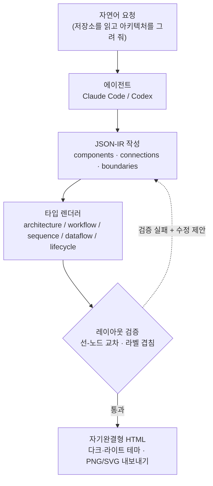

## 왜 읽어야 하나

이 글은 **아키텍처 다이어그램을 자주 그리지만 Mermaid 문법이나 그리기 도구에 시간을 빼앗기는 개발자와 플랫폼 엔지니어**를 위한 것입니다. 도구를 하나 고르기 위한 판단 근거가 필요한 사람에게 도움이 됩니다.

먼저 결론부터 말씀드리겠습니다. Archify의 진짜 가치는 "말로 그림을 그려 준다"는 편의가 아니라, **에이전트가 만든 배치를 렌더러가 강제로 검증해 어긋난 그림을 아예 만들지 못하게 막는다**는 점에 있습니다. 실제로 돌려 보니 첫 시도는 렌더가 거부당했고, 그 거부가 이 도구를 쓸 만하게 만드는 핵심이었습니다.

## 개요

아키텍처 다이어그램은 개발자가 가장 자주 그리면서도 가장 귀찮아하는 산출물입니다. Mermaid를 쓰면 문법을 외워야 하고, 그리기 도구를 쓰면 상자와 선을 손으로 끌어다 맞춰야 합니다. 다 그려 놓아도 다크 모드가 안 맞거나, 발표 자료에 넣으려면 다시 내보내기를 해야 합니다.

최근 중국 개발자 커뮤니티에서 화제가 된 **Archify**는 이 지점을 겨냥합니다. "이 저장소 몇 개를 읽고 아키텍처 비교도를 그려 줘" 같은 평범한 문장을 Claude Code나 Codex에 던지면, 브라우저에서 바로 열리는 자기완결형 HTML 다이어그램 한 장이 나옵니다. 다크·라이트 테마를 토글할 수 있고, PNG·SVG로 내보낼 수도 있습니다.

여기까지는 흔한 홍보 문구입니다. 그래서 저희는 문구를 믿는 대신 실제로 설치해 돌려 보고, 다키클라우드의 ai-platform 구조를 직접 그려 봤습니다. 그 과정에서 이 도구가 왜 단순한 "AI 그림 생성기"와 다른지가 드러났습니다. 이 글은 그 실험 기록이자, 다키클라우드가 만드는 에이전트 플랫폼 Paxis의 설계 철학과 어떻게 맞닿는지에 대한 정리입니다.

## 이 도구는 무엇인가

Archify는 `tt-a1i`가 MIT 라이선스로 공개한 오픈소스 에이전트 스킬입니다. 실험 시점 기준 버전은 2.11.0이며, Cocoon AI의 architecture-diagram-generator v1.0을 포크해 다시 쓴 것으로, 원래의 시각 언어는 Cocoon AI에 크레딧을 남기고 있습니다. Claude, Codex CLI, opencode 등 여러 에이전트 런타임에 설치됩니다.

핵심 구조를 이해하면 이 도구가 왜 특이한지 보입니다. Archify는 그림을 곧바로 그리지 않습니다. 대신 다이어그램을 **JSON-IR(중간 표현)** 로 기술하고, 타입별 렌더러가 그 JSON을 받아 HTML을 만듭니다. 렌더러는 다섯 종류입니다. 아키텍처(architecture), 워크플로(workflow), 시퀀스(sequence), 데이터플로(dataflow), 라이프사이클(lifecycle)입니다. 즉 "무엇을 그릴지"는 구조화된 JSON이 담고, "어떻게 그릴지"는 검증된 코드가 소유합니다.

다섯 렌더러는 각각 다른 종류의 그림을 담당합니다. architecture는 시스템 구성 요소와 경계를 담고, workflow는 승인 흐름이나 CI/CD 같은 절차를, sequence는 요청 생애주기나 API 호출 순서를, dataflow는 ETL과 이벤트 스트림 같은 데이터 이동을, lifecycle는 배포나 에이전트 실행의 상태 전이를 표현합니다. 그리려는 대상이 정해지면 그에 맞는 렌더러와 스키마가 붙고, 그 스키마가 입력 JSON을 강제합니다.


이 역할 분담이 Mermaid와의 결정적 차이를 만듭니다. Mermaid는 문법을 파싱해 자동 배치(dagre)로 그림을 뽑지만, 선이 상자를 가로지르거나 라벨이 겹쳐도 그대로 그려 냅니다. Archify는 반대로 배치 좌표를 명시하게 하고, 렌더 직전에 **레이아웃 규칙을 강제로 검사**합니다. 규칙을 어기면 그림을 만들지 않고 오류를 냅니다.

전체 흐름은 다음과 같습니다.



## 설치 및 통합

설치는 npx 한 줄이면 됩니다. 전역 설치는 아래와 같습니다.

```bash
# 전역 설치 후 에이전트 선택
npx skills add tt-a1i/archify -g

# 영구 설치 없이 한 번만 써 보기
npx skills use tt-a1i/archify@archify --agent codex
```

저장소를 직접 클론해 CLI로 검증하고 예제를 뽑아 볼 수도 있습니다. 실제로 저희가 실행한 명령과 출력은 다음과 같습니다. 실험 환경은 Node.js v24.1.0이었고, Archify가 요구하는 런타임은 Node 18 이상, 런타임 의존성은 사실상 없었습니다(개발 의존성으로 스키마 검증용 ajv 하나만 있습니다).

```bash
git clone --depth 1 https://github.com/tt-a1i/archify.git
cd archify/archify

# 설치 상태 점검
node bin/archify.mjs doctor
```

`doctor` 명령의 실제 출력입니다. 다섯 개 렌더러와 스키마 검증기가 모두 정상으로 확인되었습니다.

```text
Archify doctor

[ok] Node.js v24.1.0 (requires >=18)
[ok] Core template
[ok] Standalone schema validators
[ok] architecture renderer, schema, and example
[ok] workflow renderer, schema, and example
[ok] sequence renderer, schema, and example
[ok] dataflow renderer, schema, and example
[ok] lifecycle renderer, schema, and example

Archify is ready.
```

내장 예제를 한 장 뽑아 보면, 외부 서버 없이 브라우저에서 바로 열리는 508KB짜리 자기완결형 HTML 한 파일이 생성됩니다.

```bash
node bin/archify.mjs demo ./out
# Demo ready: ./out/archify-demo.html   (약 508KB, 단일 HTML)
```

## 실제 실험 결과

문서만 읽으면 여기까지가 전부처럼 보입니다. 그래서 저희는 남의 예제가 아니라 **다키클라우드 ai-platform의 실제 구조**를 JSON-IR로 직접 기술해 렌더링해 봤습니다. Kueue로 GPU를 스케줄링하고 vLLM으로 모델을 서빙하며, Keycloak으로 멀티테넌트 인증을, PostgreSQL과 NATS로 상태와 이벤트를, ArgoCD로 GitOps 배포를 다루는 아홉 개 구성 요소를 넣었습니다.

JSON-IR은 사람이 읽고 쓰기에도 어렵지 않았습니다. 구성 요소는 종류와 라벨, 위치와 크기를 가진 객체이고, 연결은 어디에서 어디로 가는지와 라벨을 담습니다. 예를 들어 게이트웨이와 GPU 서빙 부분은 다음과 같이 기술했습니다.

```json
{
  "components": [
    { "id": "gateway", "type": "backend", "label": "API Gateway",
      "sublabel": "Go Fiber :8080", "pos": [280, 300], "size": [140, 60] },
    { "id": "vllm", "type": "backend", "label": "vLLM Server",
      "sublabel": "OpenAI API", "pos": [540, 300], "size": [140, 60] }
  ],
  "connections": [
    { "id": "gw-to-vllm", "from": "gateway", "to": "vllm", "label": "route inference" },
    { "id": "vllm-gpu", "from": "vllm", "to": "gpupool", "label": "CUDA", "variant": "emphasis" }
  ]
}
```

첫 렌더 시도는 **실패했습니다.** 그리고 이 실패가 이 글에서 가장 중요한 대목입니다. 렌더러는 그림을 그리는 대신 다음과 같은 구체적인 문제를 세 가지 짚어 냈습니다.

```text
Error: Architecture layout validation failed:
- [clean-flow/edge-through-node] connection "kueue-gpu" (kueue -> gpupool)
  crosses component "vllm" (unrelated to this relationship)
- [clean-flow/edge-through-node] connection "kueue-gpu" (kueue -> gpupool)
  crosses component "argocd" (unrelated to this relationship)
- Label "publish" overlaps component "gateway"
  Suggested fix: labelDy +24 (below); or labelAt [350, 374]
```

즉 Kueue에서 GPU 풀로 가는 연결선이 관계없는 vLLM과 ArgoCD 상자를 관통했고, "publish" 라벨이 게이트웨이 상자와 겹쳤습니다. 주목할 점은 렌더러가 문제만 지적한 게 아니라 **어떻게 고치라는 제안까지** 함께 줬다는 것입니다. 라벨을 얼마나 내리라는 좌표까지 계산해 줬습니다.

제안대로 연결선에 우회 경로(via)를 주고 라벨 위치를 조정한 뒤 다시 렌더링하니 이번에는 통과했습니다. 실측 결과는 다음과 같습니다.

| 항목 | 측정값 |
| --- | --- |
| 렌더 시간 | 약 0.073초 |
| 출력 파일 | 519,709바이트 (약 508KB) 단일 HTML |
| 인라인 SVG | 1개 (다이어그램 전체가 하나의 SVG) |
| 테마 지원 | `data-theme` 27곳 · `prefers-color-scheme` 7곳 |
| 외부 참조 | 1건 (JetBrains Mono 웹폰트, 시스템 폰트로 폴백) |


정리하면, 렌더 자체는 73밀리초로 사실상 즉시입니다. 결과물은 이미지 서버나 CDN에 의존하지 않는 자기완결형 HTML 한 장이며, 유일한 외부 참조는 코드용 웹폰트 하나뿐이라 오프라인에서도 시스템 폰트로 깨지지 않고 열립니다. 다크·라이트 테마는 장식이 아니라 실제 CSS 변수와 `prefers-color-scheme`로 구현되어 있었습니다.

여기서 얻은 교훈은 분명합니다. Archify의 검증기는 "예쁜 그림"을 만드는 장치가 아니라, **선이 엉키거나 라벨이 겹치는 나쁜 다이어그램을 배포 단계에서 원천 차단하는 게이트**입니다. 사람이 손으로 그렸다면 그냥 넘어갔을 시각적 결함을, 코드가 매번 같은 기준으로 잡아냈습니다.

## 다키클라우드 제품 적용 시사점

이 도구의 설계는 다키클라우드가 두 제품에서 지키는 원칙과 정확히 맞닿습니다.

**Paxis 렌즈(에이전트·스킬).** Paxis는 다키클라우드의 Agent-Native Cloud로, 스킬을 일급 리소스로 다룹니다. 960개가 넘는 스킬을 BM25로 선택해 격리된 샌드박스에서 실행하고, 모든 행동을 정책 게이트와 감사 로그로 통과시킵니다. Archify는 정확히 이런 스킬 하니스가 선택해 실행하기 좋은 형태의 도구입니다. 더 중요한 것은 그 내부 설계입니다. Archify는 **모델이 내용(JSON-IR)을 만들고, 코드가 포맷과 검증을 소유**합니다. 이는 다키클라우드가 배치 산출물에서 반복해 강조하는 원칙, 즉 자유도가 높은 생성 단계와 결정론적 검증 단계를 분리하라는 원칙과 같습니다. 모델에게 "예쁘게 그려 줘"라고 부탁하는 대신, 구조화된 표현을 만들게 하고 그 표현이 규칙을 지키는지는 코드가 강제하는 방식입니다. 저희의 첫 렌더가 거부당한 경험이 바로 이 원칙이 실제로 작동한 순간이었습니다.

**ai-platform 렌즈(인프라·문서화).** 자기완결형 HTML은 온프렘·소버린 환경에서 특히 유용합니다. 외부 다이어그램 SaaS에 내부 아키텍처를 올릴 수 없는 고객에게, 렌더가 로컬에서 끝나고 결과가 단일 파일로 남는 방식은 그대로 반입 가능한 산출물이 됩니다. 또한 JSON-IR은 텍스트라 Git으로 버전 관리되고 diff가 됩니다. ArgoCD로 매니페스트를 관리하듯 아키텍처 다이어그램도 코드로 관리하며, 변경 이력을 추적하고 리뷰할 수 있습니다. 신입 온보딩 문서나 고객용 배포 구조도를 매번 손으로 다시 그리는 대신, 구조가 바뀔 때 JSON만 고쳐 다시 렌더하면 됩니다.


두 렌즈는 서로를 보완합니다. 검증된 스킬(Paxis)이 재현 가능한 산출물(ai-platform 문서화)을 만들고, 그 산출물이 다시 온프렘 고객에게 반입 가능한 자산이 됩니다.

## 한계 및 반론

물론 Archify가 만능은 아닙니다. 몇 가지 분명한 약점이 있습니다.

첫째, **배치 좌표를 명시해야 합니다.** Mermaid의 자동 배치와 달리 각 구성 요소의 위치와 크기를 좌표로 줘야 하고, 그 배치가 검증을 통과해야 합니다. 저희 첫 시도가 실패한 것처럼, 이 과정은 완전히 공짜가 아닙니다. 다만 실무에서는 에이전트가 이 좌표를 대신 채우고 검증 오류를 받아 스스로 고치므로, 사람이 감당할 부담은 줄어듭니다.

둘째, **출력이 가볍지 않습니다.** 다이어그램 한 장이 약 508KB의 HTML입니다. 폰트와 스크립트를 자기완결형으로 담기 때문인데, 단순한 SVG나 Mermaid 블록보다는 무겁습니다. 블로그처럼 여러 다이어그램을 한 페이지에 넣는 경우에는 부담이 될 수 있습니다.

셋째, **라이브러리로 배포된 도구가 아닙니다.** package.json이 `private: true`로 표시되어 있어, npm 패키지로 가져다 쓰는 방식이 아니라 저장소의 스킬·CLI로 소비하는 형태입니다. 파이프라인에 라이브러리로 묶으려면 별도 고민이 필요합니다.

넷째, **정적 스냅샷입니다.** 실시간 데이터로 갱신되는 대시보드가 아니라, 특정 시점의 구조를 담은 그림입니다. 빠르게 낙서하듯 스케치하고 싶을 때는 검증 규칙의 엄격함이 오히려 마찰이 될 수 있습니다. 물론 그 엄격함이 이 도구의 존재 이유이기도 합니다.

## 정리

Archify를 직접 설치해 다키클라우드 스택을 그려 본 결론은 이렇습니다. 이 도구의 핵심은 "말로 그림을 그린다"는 편의가 아니라, **에이전트가 만든 배치를 렌더러가 매번 같은 기준으로 검증해 나쁜 다이어그램을 배포 전에 막는다**는 규율입니다. 서론에서 말씀드린 그대로, 저희 첫 렌더가 거부당한 경험이 이 도구를 신뢰하게 만든 지점이었습니다.

그래서 다음 행동은 명확합니다. 아키텍처 다이어그램을 자주 그리고, 그 그림을 문서나 저장소에 코드처럼 남기고 싶다면 Archify를 한 번 돌려 볼 값어치가 있습니다. 반대로 빠른 스케치나 페이지에 여러 장을 얹는 용도라면 Mermaid가 여전히 가볍습니다. 판단 기준은 "이 그림을 재현 가능하고 검증된 자산으로 관리할 것인가"입니다. 그렇다면 Archify가, 그리고 같은 원리를 제품으로 만드는 Paxis의 스킬 하니스가 답이 됩니다.


> 출처
> - Archify 저장소: [github.com/tt-a1i/archify](https://github.com/tt-a1i/archify) (MIT, v2.11.0)
> - 원 소개 트윗: [@alin_zone via @hjguyhan](https://x.com/hjguyhan/status/2079683904030777353)
> - 실험 기록: 본문의 명령·출력·측정값은 2026-07-22 로컬 실행(Node v24.1.0)에서 캡처했습니다.
