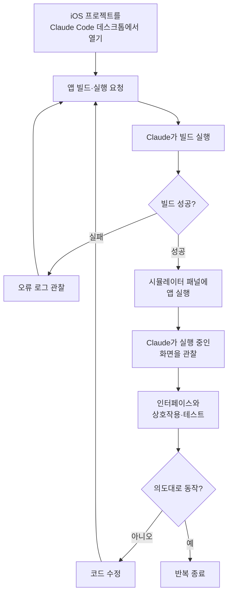

## 왜 읽어야 하나

macOS에서 Claude Code로 iOS 앱을 만드는 개발자라면, 이 글의 결론은 하나입니다. 코딩 에이전트가 자기가 만든 앱을 직접 실행해 보고 화면을 관찰하면서 고치는 "닫힌 루프"가 이제 별도 도구 없이 데스크톱 앱 안에서 돌아간다는 것입니다. 무엇을 새로 배워야 하는지, 그리고 이 변화가 단순한 편의 기능이 아니라 에이전트가 코드 품질을 스스로 수렴시키는 방식의 문제인 이유를 아래에서 순서대로 풀어 보겠습니다.

## 개요

AI 코딩 에이전트가 정말로 유용해지는 순간은, 코드를 한 번 뱉어 놓고 끝나는 게 아니라 그 코드가 실제로 동작하는지를 스스로 확인하고 다시 고칠 때입니다. 백엔드 코드라면 테스트를 돌려서 통과 여부라는 객관적 신호를 얻을 수 있습니다. 그런데 모바일 앱의 UI는 이야기가 다릅니다. 온보딩 화면이 의도대로 나오는지, 버튼을 눌렀을 때 다음 화면으로 넘어가는지는 눈으로 화면을 봐야 알 수 있는 영역이었습니다. 지금까지 이 확인은 사람의 몫이었고, 에이전트는 코드를 짜 놓고 사람이 시뮬레이터를 켜서 눌러 보고 피드백을 줄 때까지 멈춰 있었습니다.

2026년 7월 21일, Claude Code 데스크톱 앱이 이 간극을 정면으로 메우는 기능을 공개 베타로 내놨습니다. iOS 앱을 빌드해 실행하면 Apple의 iOS 시뮬레이터가 대화 바로 옆 패널에 열리고, Claude가 실행 중인 앱 화면을 직접 보면서 인터페이스와 상호작용하고, 원하는 대로 동작할 때까지 코드를 계속 고칩니다. 사람이 시뮬레이터를 켜서 확인하고 결과를 다시 말로 옮겨 주던 왕복이 하나의 루프 안으로 접혀 들어간 셈입니다.

타키클라우드는 에이전트 네이티브 클라우드를 만들면서 "에이전트가 자기 행동의 결과를 어떻게 관찰하고 다음 행동을 정하는가"라는 질문에 계속 부딪힙니다. 이번 기능은 그 질문에 대한 아주 구체적인 답 하나이기 때문에, 단순 기능 소개를 넘어 루프 설계의 관점에서 함께 살펴보겠습니다.

## iOS 시뮬레이터 연동은 무엇인가

핵심은 단순합니다. Claude Code 데스크톱에서 iOS 프로젝트를 열고 앱을 빌드해 실행해 달라고 하면, 시뮬레이터가 대화 옆 패널로 뜨고 Claude가 그 화면을 관찰 대상으로 삼습니다. 세션마다 독립된 시뮬레이터가 열리므로, 여러 작업을 동시에 진행해도 서로의 화면이 섞이지 않습니다. 그리고 이 패널은 로컬 세션에서만 동작합니다. 시뮬레이터 자체가 macOS 위에서만 도는 소프트웨어이기 때문입니다.

이 기능이 흥미로운 이유는 렌더링을 하나 더 붙인 게 아니라 에이전트에게 "관찰 채널"을 하나 더 열어 줬다는 데 있습니다. 이전까지 코딩 에이전트가 확인할 수 있는 신호는 대부분 텍스트였습니다. 컴파일러 오류, 테스트 결과, 로그 같은 것들입니다. 반면 앱이 실제로 어떻게 보이고 어떻게 반응하는지는 사람이 눈으로 보고 말로 옮겨 줘야만 에이전트에게 전달됐습니다. 시뮬레이터 연동은 이 시각적 결과를 에이전트가 직접 확인할 수 있는 신호로 바꿔 놓습니다.

전체 흐름을 단순화하면 아래와 같은 반복 루프가 됩니다.

그림에서 보이듯, 사람의 개입은 처음 요청과 마지막 확인에만 있고 가운데의 빌드·실행·관찰·수정은 에이전트 안에서 돕니다. 백엔드 개발에서 테스트 러너가 통과와 실패라는 객관적 신호를 돌려주며 루프를 닫는 것과 정확히 같은 구조를, 이번에는 시각적 UI 영역에서 시뮬레이터가 맡는 것입니다.

## 어떻게 켜고 쓰는가

이 기능은 별도의 복잡한 설정을 요구하지 않습니다. 대신 몇 가지 전제 조건이 분명합니다. 먼저 macOS여야 합니다. iOS 시뮬레이터는 Apple 생태계 밖에서는 돌지 않기 때문에 Windows나 Linux에서는 이 패널을 쓸 수 없습니다. 그리고 iOS 플랫폼이 설치된 Xcode가 있어야 합니다. Claude가 실제로 빌드를 수행하고 시뮬레이터를 띄우는 밑단은 결국 Xcode의 빌드 도구와 시뮬레이터이기 때문입니다. 요금제 측면에서는 Pro, Max, Team 플랜 사용자가 이 기능을 쓸 수 있습니다.

사용 자체는 대화형입니다. Claude Code 데스크톱에서 iOS 프로젝트를 열고, 그 앱의 프로젝트 폴더를 프로젝트로 지정해 세션을 시작합니다. iOS 시뮬레이터용 앱을 빌드하는 프로젝트라면 어떤 것이든 동작합니다. 그다음 Claude에게 앱을 실행하거나 테스트해 달라고 요청하면 됩니다. 예를 들어 "앱을 빌드해서 시뮬레이터로 실행하고 온보딩 흐름을 확인해 줘"처럼 자연어로 지시하면, Claude가 빌드를 돌리고 시뮬레이터 패널에 앱을 띄운 뒤 그 화면을 관찰하며 확인 작업을 진행합니다.

정리하면 새로 외워야 할 명령어나 설정 파일은 사실상 없습니다. 바뀌는 것은 "에이전트에게 무엇을 시킬 수 있는가"의 범위입니다. 지금까지 "이 화면이 이렇게 나오게 고쳐 줘"라고 부탁한 뒤 사람이 직접 켜서 확인해야 했다면, 이제는 그 확인까지 지시 안에 포함시킬 수 있습니다. 공개 베타 단계인 만큼 세부 동작은 앞으로 다듬어지겠지만, 상호작용 모델의 방향은 이미 분명합니다.

## 닫힌 루프가 코딩 에이전트에 주는 것

이 기능의 진짜 의미는 편의성보다 루프의 완결성에 있습니다. 에이전트가 유용하려면 자기 출력을 검증할 방법이 있어야 하고, 그 검증이 사람의 눈과 손에 매번 의존하면 에이전트는 반쪽짜리 자동화에 머무릅니다. iOS UI 작업은 그동안 이 반쪽 상태의 대표적인 사례였습니다. 코드는 에이전트가 짜지만, 그 결과가 화면에서 맞는지는 사람이 봐야 했으니까요.

시뮬레이터를 대화 옆에 붙이고 에이전트가 실행 화면을 관찰하게 하면, 관찰과 판단과 수정이 한 루프 안에서 이어집니다. 빌드가 실패하면 오류를 읽고 고치고, 앱이 뜨면 화면을 보고 의도와 다른 부분을 찾아 다시 고칩니다. 이 반복이 사람의 왕복 없이 돌아간다는 점이 핵심입니다. 물론 이 관찰은 화면을 캡처해 확인하는 방식이라 사람이 손으로 만지며 느끼는 미묘한 인터랙션까지 완벽히 대체하지는 못합니다. 그럼에도 "코드를 고쳤는데 화면이 어떻게 바뀌었는지 모른 채 다음 지시를 기다리는" 단절이 사라진다는 것만으로도 작업의 결이 달라집니다.

이 구조는 타키클라우드가 내부적으로 정리해 온 루프 엔지니어링 원칙과도 맞닿아 있습니다. 신뢰할 수 있는 피드백은 통과와 실패를 객관적으로 돌려주는 결정론적 신호이고, 에이전트의 자기 보고("잘 된 것 같습니다")는 루프의 종료 조건이 될 수 없다는 원칙입니다. 시뮬레이터는 그 결정론적 신호를 시각 영역으로 확장하는 장치입니다. 빌드 성공 여부는 이미 명확한 신호였고, 이제 실행 화면이라는 또 하나의 관찰 채널이 붙으면서 UI 작업의 루프가 한층 촘촘하게 닫힙니다.

## ThakiCloud 제품 적용 시사점

이번 기능은 에이전트 주제이므로 Paxis 렌즈로 보는 것이 자연스럽습니다. Paxis는 타키클라우드의 에이전트 네이티브 클라우드로, 스킬과 도구와 정책과 감사 로그를 일급 리소스로 다루며, 스킬을 격리된 샌드박스에서 실행하고 모든 행동을 정책 게이트와 감사 로그로 통과시킵니다. Claude Code의 시뮬레이터 연동이 보여 주는 "빌드하고 실행하고 관찰하고 고치는 닫힌 루프"는 Paxis가 지향하는 실행 모델과 정확히 같은 계열입니다. 에이전트가 격리된 환경에서 무언가를 실행하고 그 결과를 관찰해 다음 행동을 정하되, 그 과정이 통제된 경계 안에서 이루어진다는 구조입니다.

Paxis 관점에서 이 사례가 주는 시사점은 두 가지입니다. 첫째, 에이전트에게 실행 결과를 관찰할 채널을 열어 주는 것이 자동화의 깊이를 결정한다는 점입니다. 텍스트 신호만으로는 닫히지 않던 UI 작업의 루프가 시각적 관찰 채널 하나로 닫히듯, Paxis에서도 각 스킬이 자기 산출물을 검증할 신호를 갖추는 것이 품질의 관건입니다. 둘째, 그 실행이 세션마다 격리된 환경에서 이루어진다는 점입니다. Claude Code가 세션별로 독립된 시뮬레이터를 여는 것처럼, Paxis의 샌드박스 격리 실행은 여러 에이전트 작업이 서로를 오염시키지 않게 보장하는 같은 원리의 설계입니다.

인프라 관점에서 한 줄 덧붙이면, 이런 닫힌 루프가 실용적이 되려면 실행 환경을 값싸고 빠르게 띄우고 거둘 수 있어야 합니다. 타키클라우드의 ai-platform이 쿠버네티스 위에서 격리된 실행 환경을 효율적으로 스케줄링하는 역량은, 에이전트 루프를 대규모로 돌릴 때의 경제성을 뒷받침하는 밑단이 됩니다. 저비용의 격리 실행이 있어야 관찰과 수정을 반복하는 에이전트 루프가 비용 부담 없이 돌아갑니다.

## 한계 및 반론

이 기능을 과대평가하지 않기 위해 경계도 분명히 해야 합니다. 우선 플랫폼이 macOS로 못 박혀 있습니다. iOS 시뮬레이터가 Apple 밖에서 돌지 않기 때문에 어쩔 수 없는 제약이지만, 그만큼 이 루프는 Mac 사용자에게만 열려 있습니다. Xcode 설치도 필수 전제이고, Pro와 Max와 Team 플랜에서만 쓸 수 있으며, 패널은 로컬 세션에 한정됩니다. 원격 세션이나 팀 공유 환경에서 같은 경험을 기대하기는 아직 이릅니다.

기능 자체도 공개 베타입니다. 발표와 함께 공개된 것은 동작 방식과 사용법이지, 이 루프가 실제로 얼마나 빠르고 정확하게 수렴하는지에 대한 벤치마크가 아닙니다. 따라서 "얼마나 좋아지는가"를 수치로 단언할 수는 없습니다. 또한 에이전트의 화면 관찰은 실행 화면을 캡처해 확인하는 방식이라, 사람이 실제 기기에서 손끝으로 느끼는 제스처의 미세한 반응이나 성능 체감까지 대체하지는 못합니다. 복잡한 애니메이션, 접근성 동작, 실기기에서만 드러나는 문제는 여전히 사람의 검증이 필요합니다.

마지막으로 짚을 반론은, 이런 편의가 검토 없는 신뢰로 이어질 위험입니다. 루프가 매끄럽게 돌수록 사람은 결과를 그대로 받아들이기 쉬워집니다. 에이전트가 "확인했습니다"라고 말한다고 해서 그 판단이 곧 검증은 아닙니다. 시뮬레이터 관찰은 유용한 신호이지 최종 승인이 아니며, 특히 사용자 경험의 미묘한 부분은 여전히 사람이 직접 눌러 보고 판단해야 합니다.

## 정리

Claude Code의 iOS 시뮬레이터 연동은 작아 보이지만 방향은 분명합니다. 코딩 에이전트가 자기가 만든 것을 직접 실행해 관찰하고 고치는 닫힌 루프가, UI라는 그동안 사람에게 의존하던 영역까지 확장됐다는 것입니다. macOS에서 Claude Code로 iOS 앱을 만드는 개발자라면 지금 시도해 볼 만한 변화이고, 무엇을 시킬 수 있는지의 범위가 넓어졌다는 점에서 작업 방식 자체를 다시 생각하게 합니다.

더 크게 보면, 이 사례는 에이전트를 유용하게 만드는 것이 모델의 크기만이 아니라 "결과를 관찰해 다음 행동을 정하는 루프를 얼마나 잘 닫는가"라는 하니스의 문제라는 점을 다시 확인시켜 줍니다. 타키클라우드가 Paxis와 ai-platform으로 풀고 있는 문제도 정확히 이것입니다. 오늘의 한 줄 결론은 이렇습니다. 다음에 에이전트에게 UI 작업을 맡길 때는, 코드를 고쳐 달라는 데서 멈추지 말고 "실행해서 확인까지 해 줘"라고 지시해 보십시오. 루프를 사람이 아니라 에이전트가 닫게 하는 것, 그것이 이번 기능이 주는 가장 실용적인 변화입니다.

## 관련 슬라이드

본문 내용을 NotebookLM(`blue_collage` 스타일)으로 요약한 슬라이드입니다.

## 출처

- [Claude Code 공식 문서: Test iOS apps in the simulator](https://code.claude.com/docs/en/desktop-ios-simulator)
- [ClaudeDevs 발표 (X)](https://x.com/ClaudeDevs/status/2079674432038248611)
- [9to5Mac: Claude Code brings live iOS app testing into its Mac app](https://9to5mac.com/2026/07/21/claude-code-brings-live-ios-app-testing-into-its-mac-app/)
- [MacRumors: Claude Code Can Now Build and Test iOS Apps in Apple's Simulator](https://www.macrumors.com/2026/07/21/claude-code-ios-simulator/)
