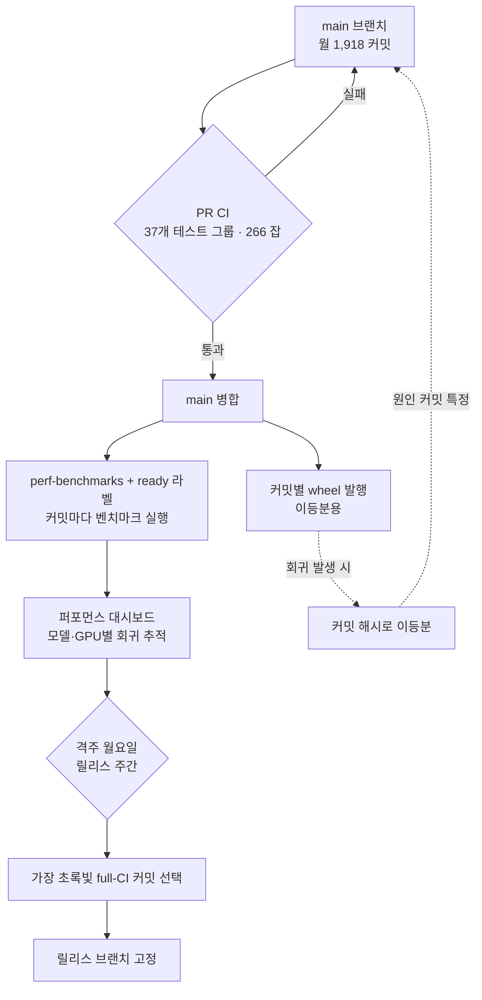

## 왜 읽어야 하나

이 글은 vLLM으로 LLM을 서빙하거나, 빠르게 움직이는 오픈소스에 프로덕션을 의존하는 플랫폼 엔지니어와 MLOps 실무자를 위해 씁니다. "우리가 쓰는 추론 엔진이 매주 수백 개씩 바뀌는데, 어느 버전을 언제 올려야 안전한가"를 결정해야 하는 사람이 읽을 글입니다.

핵심 결론을 먼저 말씀드리겠습니다. 월 2,000 커밋이라는 속도에서도 프로덕션 품질을 지키는 열쇠는 테스트를 무한정 늘리는 것이 아닙니다. **벤치마크 게이트로 성능 회귀를 막고, 릴리스 브랜치를 가장 건강한 커밋에 고정하며, 회귀가 생기면 커밋 단위로 이등분해 원인을 특정하는** 세 가지 결정론적 장치입니다. 이 셋은 타키클라우드가 vLLM을 K8s 위에서 멀티테넌트로 서빙할 때 그대로 차용할 수 있는 운영 패턴이기도 합니다.

## 개요

2026년 7월 16일, vLLM 유지관리팀은 「Keeping vLLM Production Quality」라는 운영기를 공개했습니다. 숫자부터가 압도적입니다. 2026년 6월 한 달 동안 vLLM은 main 브랜치에 **1,918개의 커밋**을 병합했습니다. 하루 평균 약 64개로, PyTorch나 Kubernetes 같은 대형 오픈소스와 맞먹는 속도입니다. 같은 달 CI는 **1,300만 분(job minutes)**을 소비했고, 피크 시점에는 **1,400개의 러너**가 동시에 돌았습니다.

이 속도가 왜 문제가 되는지는 추론 엔진의 특성에서 나옵니다. 일반적인 웹 서비스라면 "테스트가 통과하면 대체로 안전하다"는 가정이 통합니다. 그러나 LLM 추론 엔진에서는 **모든 테스트를 통과하고도 특정 모델이 느려지거나, 출력이 미묘하게 틀어지는** 일이 벌어집니다. 커널 하나가 바뀌면 특정 GPU 아키텍처에서만 처리량이 절반으로 떨어질 수 있고, 그런 회귀는 단위 테스트의 통과/실패로는 절대 잡히지 않습니다.

타키클라우드처럼 vLLM을 프로덕션 서빙의 핵심 의존성으로 쓰는 조직에게 이 운영기는 단순한 남의 집 이야기가 아닙니다. 우리가 올리는 vLLM 버전 하나하나가 고객 워크로드의 지연 시간과 처리량을 좌우하기 때문입니다. 그래서 vLLM이 스스로를 어떻게 지키는지 이해하면, 우리가 그 위에서 무엇을 게이트로 삼아야 하는지가 보입니다.

## 이 기술은 무엇인가

vLLM의 품질 유지 체계는 세 개의 층으로 나뉩니다. 각 층이 서로 다른 종류의 실패를 막습니다.

**첫째, 광범위한 기능 CI입니다.** vLLM의 CI 스위트는 **37개의 테스트 그룹, 266개의 잡**으로 구성됩니다. 서로 다른 커널부터 스페큘러티브 디코딩(speculative decoding), LoRA에 이르기까지 주요 컴포넌트와 기능을 모두 덮습니다. 이 층은 "코드가 동작하는가"를 검증합니다.

**둘째, 연속 벤치마킹(continuous benchmarking)입니다.** 기능 CI가 놓치는 성능 회귀를 잡기 위한 층입니다. 여러 모델과 GPU 디바이스에 걸쳐 성능을 자동으로 측정하고, 시간에 따라 추적해 회귀나 개선을 드러냅니다. 이 층은 "코드가 여전히 빠른가, 출력이 여전히 옳은가"를 검증합니다.

**셋째, 릴리스 엔지니어링입니다.** 아무리 좋은 CI와 벤치마크가 있어도, 어느 커밋을 사용자에게 릴리스로 내보낼지는 별도의 결정입니다. vLLM은 이 결정을 사람의 직관이 아니라 반복 가능한 규칙에 맡깁니다.

아래 다이어그램이 세 층이 어떻게 맞물리는지 보여줍니다. 세로로 읽으면 커밋 하나가 사용자에게 도달하기까지의 흐름이 됩니다.



## 무엇이 실패했고, 어떻게 고쳤나

이 체계는 처음부터 완성돼 있던 것이 아닙니다. 2026년 5월, vLLM은 v0.20.0을 릴리스한 뒤 며칠 만에 두 개의 긴급 패치를 잘라내야 했습니다. 두 가지 문제가 CI를 그대로 통과해 사용자에게 도달했기 때문입니다.

하나는 **gpt-oss 모델이 Blackwell GPU에서 여러 장으로 분할될 때 깨지는** 문제였고, 다른 하나는 **DeepSeek V4의 처리량이 GB200에서 급락하는** 문제였습니다. 당시 vLLM에는 벤치마킹 파이프라인이 없었습니다. 두 문제 모두 기능 테스트는 멀쩡히 통과했지만, 실제 하드웨어에서의 성능과 정확성은 아무도 자동으로 측정하지 않았습니다.

이 사건이 연속 벤치마킹 층을 만든 직접적 계기입니다. 여기서 얻을 수 있는 교훈은 명확합니다. **"테스트 통과 = 안전"이라는 등식은 추론 엔진에서 성립하지 않습니다.** 기능적 정확성과 성능은 별개의 축이며, 각각을 독립적으로 게이트해야 합니다.

## 유지관리팀이 실제로 쓰는 명령

이 체계는 개념만이 아니라 사용자가 직접 쓸 수 있는 도구로 노출돼 있습니다. 특히 성능 회귀를 추적하는 두 가지 실무 도구가 유용합니다.

성능 대시보드는 특정 라벨이 붙은 PR에서 자동으로 갱신됩니다. `perf-benchmarks`와 `ready` 라벨이 함께 붙은 커밋마다, 그리고 PR이 main에 병합될 때마다 벤치마크가 실행되어 공개 대시보드에 게시됩니다.

```text
# 성능 벤치마크를 트리거하는 라벨 (vLLM PR 워크플로)
perf-benchmarks + ready
# → 커밋마다 여러 모델·GPU에서 벤치마크 실행 → 공개 퍼포먼스 대시보드에 게시
```

더 흥미로운 것은 **커밋 단위 이등분(bisect)**입니다. vLLM은 이전 커밋들에 대한 wheel을 발행하기 때문에, 설치 URL에 커밋 해시를 지정하면 특정 커밋 시점의 vLLM을 그대로 설치할 수 있습니다.

```bash
# 특정 커밋 해시의 vLLM wheel 설치 (동작·성능 회귀 이등분용)
pip install https://wheels.vllm.ai/<commit-hash>/vllm-<version>-cp38-abi3-manylinux1_x86_64.whl

# "언제부터 느려졌나"를 이등분으로 좁힌다:
#   좋은 커밋 A ── ? ── 나쁜 커밋 B
#   → 중간 커밋을 설치해 재현 → 범위를 절반으로
```

여기서 릴리스 엔지니어링의 진짜 가치가 드러납니다. vLLM은 격주 월요일에 릴리스 주간을 시작합니다. 릴리스 매니저는 그날 main 브랜치의 최근 full-CI 실행들을 검토해 **가장 초록빛(greenest) 커밋**을 고릅니다. 이렇게 하면 릴리스 특화 변경을 더하기 전에 가장 건강한 출발점을 확보하게 됩니다. 그리고 릴리스 브랜치를 자주 자르는 데에는 숨은 이득이 있습니다. **이등분할 커밋이 수천 개가 아니라 500개 정도일 때 회귀 추적이 훨씬 쉬워진다**는 점입니다. 릴리스 케이던스 자체가 디버깅 비용을 낮추는 장치인 셈입니다.

## vLLM이 공개한 규모 지표

아래는 vLLM 운영기가 공개한 2026년 6월 기준 실측 수치입니다. 재현 실험이 아니라 유지관리팀이 발표한 값을 그대로 인용합니다.

| 지표 | 값 | 의미 |
|---|---|---|
| main 병합 커밋 | 월 1,918개 (하루 ~64개) | PyTorch·Kubernetes급 변경 속도 |
| CI 소비 시간 | 월 1,300만 분 | 방대한 검증 비용 |
| 동시 러너 피크 | 1,400개 | 병렬 검증 규모 |
| CI 테스트 그룹 | 37개 | 커널·spec decoding·LoRA 등 |
| CI 잡 | 266개 | 컴포넌트별 세분화 |
| 릴리스 케이던스 | 격주 월요일 | 이등분 범위를 ~500 커밋으로 |

이 수치가 말하는 바는 단순합니다. 이 정도 속도에서 품질을 지키려면 검증을 **사람의 리뷰에 의존해서는 안 되며**, 결정론적 게이트와 자동 측정으로 대체해야 한다는 것입니다.

## 타키클라우드 제품 적용 시사점

타키클라우드의 **ai-platform**은 K8s와 Kueue GPU 스케줄링 위에서 다양한 고객 환경에 모델을 서빙합니다. vLLM은 그 서빙 경로의 핵심 엔진이며, 따라서 vLLM의 품질 유지 방식은 곧 우리의 릴리스 정책 설계에 직접 반영됩니다.

첫째, **버전 고정과 벤치마크 게이트를 분리**합니다. vLLM의 교훈대로 기능 테스트 통과만으로 새 버전을 프로덕션에 올리지 않습니다. 대표 고객 워크로드(모델·GPU 조합)에 대한 처리량·지연 시간 벤치마크를 롤아웃 전에 자동으로 돌리고, 회귀가 감지되면 승격을 차단하는 게이트를 둡니다. 이것은 vLLM의 연속 벤치마킹 층을 우리 배포 파이프라인의 게이트로 옮겨 오는 것입니다.

둘째, **ArgoCD 기반 GitOps 롤아웃에 vLLM 릴리스 핀을 명시**합니다. main의 최신 커밋을 따라가는 대신, vLLM이 스스로 검증해 잘라낸 릴리스 태그를 정본으로 삼고, 그 태그를 클러스터별 values에 고정합니다. 카나리(canary)로 소수 테넌트에 먼저 올린 뒤 벤치마크 대시보드가 초록빛일 때만 전체로 확장하는 흐름은 vLLM의 "가장 건강한 커밋 선택" 원칙을 배포 층에서 재현하는 것입니다.

셋째, **커밋 단위 wheel을 사내 회귀 추적에 활용**합니다. 특정 고객에게서 "지난주보다 느려졌다"는 신호가 오면, vLLM의 커밋별 wheel로 이등분해 원인 커밋을 특정할 수 있습니다. 멀티테넌트 환경에서 회귀의 책임 소재를 빠르게 좁히는 것은 운영 신뢰도의 핵심입니다.

이 세 가지는 결국 하나의 원칙으로 수렴합니다. **빠르게 움직이는 상류(upstream) 의존성 위에서 프로덕션을 운영하려면, 품질 판단을 사람의 감이 아니라 자동 게이트에 위임해야 한다**는 것입니다.

## 한계 및 반론

vLLM의 접근이 모든 조직에 그대로 이식되지는 않습니다. 몇 가지 현실적 제약이 있습니다.

가장 큰 것은 **비용**입니다. 월 1,300만 CI 분과 1,400개 동시 러너는 상당한 인프라 예산을 전제합니다. 소규모 팀이 이 규모의 벤치마크 팜을 그대로 복제하는 것은 비현실적입니다. 따라서 우리에게 필요한 것은 규모의 복제가 아니라 **핵심 워크로드로 좁힌 대표 벤치마크**입니다. 전체 모델·GPU 매트릭스가 아니라, 실제 고객 트래픽의 상위 몇 개 조합만 게이트하는 편이 비용 대비 효과가 큽니다.

둘째, 벤치마크는 **커버리지가 곧 한계**입니다. 벤치마크에 없는 모델·시퀀스 길이·배치 조합에서의 회귀는 여전히 새어 나갑니다. vLLM의 5월 사건도 벤치마크가 없어서 놓친 것이며, 벤치마크를 추가한 뒤에도 대시보드에 없는 조합은 사각지대로 남습니다. 게이트는 "측정한 것"만 지켜 준다는 점을 잊으면 안 됩니다.

셋째, 격주 릴리스 케이던스는 **안정성과 최신성의 트레이드오프**입니다. 릴리스를 자주 자르면 이등분은 쉬워지지만, 최신 기능을 프로덕션에 반영하는 속도는 느려집니다. 최신 커널 최적화가 급히 필요한 고객이 있다면, 안정 릴리스만 고집하는 정책이 오히려 병목이 될 수 있습니다. 이 균형점은 조직마다 다릅니다.

## 정리

빠르게 움직이는 오픈소스 위에서 프로덕션을 지키는 문제로 돌아오겠습니다. vLLM이 월 2,000 커밋 속도에서도 무너지지 않는 이유는 테스트를 무한정 늘려서가 아니라, **성능 회귀를 막는 벤치마크 게이트, 가장 건강한 커밋을 고르는 릴리스 브랜치 고정, 원인을 좁히는 커밋 단위 이등분**이라는 세 가지 결정론적 장치를 갖췄기 때문입니다.

타키클라우드처럼 vLLM을 서빙 핵심으로 쓰는 조직이 오늘 당장 할 수 있는 행동은 분명합니다. 새 vLLM 버전을 올릴 때 기능 테스트 통과에만 의존하지 말고, 대표 고객 워크로드에 대한 벤치마크를 롤아웃 게이트로 세우십시오. 그리고 main을 따라가는 대신 vLLM이 검증한 릴리스 태그를 GitOps values에 고정하십시오. 이 두 가지만 배포 파이프라인에 넣어도, 상류의 속도를 그대로 흡수하면서 하류의 안정성을 지킬 수 있습니다. 품질은 더 많은 테스트가 아니라, 옳은 곳에 놓인 게이트에서 나옵니다.


## 관련 슬라이드

본문 내용을 NotebookLM(`architectural_mono` 스타일)으로 요약한 슬라이드입니다.


## 출처

- vLLM Blog, "Keeping vLLM Production Quality: A Look Inside CI, Benchmarking, and the Release Process" (2026-07-16): [https://vllm.ai/blog/2026-07-16-keeping-vllm-production-quality](https://vllm.ai/blog/2026-07-16-keeping-vllm-production-quality)
- vLLM Performance Dashboard (docs): [https://docs.vllm.ai/en/latest/benchmarking/dashboard/](https://docs.vllm.ai/en/latest/benchmarking/dashboard/)
