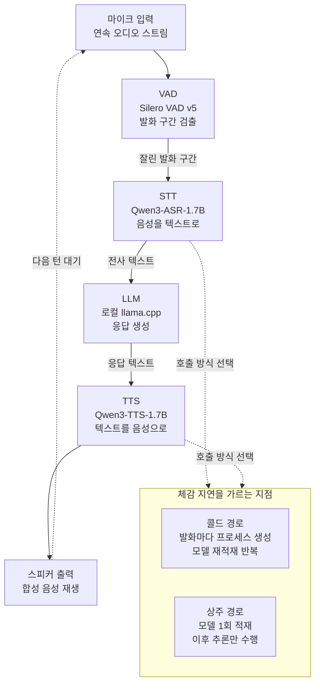

## 왜 읽어야 하나

이 글은 음성 인터페이스를 클라우드 API 없이 자체 인프라나 단말에서 돌려야 하는 엔지니어를 위해 씁니다. 망 분리 환경이라 외부 API를 못 쓰거나, 통화 음성을 밖으로 내보낼 수 없거나, 사용자당 음성 API 과금이 서비스 단가를 무너뜨리는 상황에서 "로컬 스택으로 갈아탈 수 있는가"를 판단해야 하는 분들이 대상입니다.

핵심 결론을 먼저 말씀드리겠습니다. 완전 로컬 음성 에이전트에서 대화가 끊기는 진짜 원인은 모델이 커서가 아니라 **모델을 발화마다 다시 메모리에 올리는 호출 구조**입니다. 저희가 맥북에서 측정한 결과, 같은 엔진에 같은 오디오를 넣고 호출 경로만 상주형으로 바꿨더니 음성 인식 처리 시간이 발화당 14.42초에서 5.92초로 줄었습니다. 모델을 바꾸거나 GPU를 늘린 것이 아니라, 프로세스를 살려둔 것이 전부입니다.

## 개요

지난 주말 X 타임라인에서 중국 개발자 커뮤니티발 데모 하나가 돌았습니다. 인터넷 연결도, API 키도 없이 노트북 한 대에서 도는 음성 대화 에이전트인데, 구성이 명확했습니다. 음성 구간을 잘라내는 VAD는 Silero VAD v5, 음성 인식은 Whisper, 응답 생성은 로컬 llama.cpp, 음성 합성은 Qwen3-TTS입니다. 모델 네 개를 전부 한 기기에 밀어 넣었다는 점이 화제였습니다.

이 조합이 새로운 발명은 아닙니다. 허깅페이스의 [speech-to-speech](https://github.com/huggingface/speech-to-speech) 프로젝트가 이미 같은 4단 파이프라인을 오픈소스로 제공하고 있고, whisper.cpp 저장소에도 [Silero VAD 내장 지원 이슈](https://github.com/ggml-org/whisper.cpp/issues/3003)가 올라와 있습니다. 부품은 전부 공개되어 있고 조립도 어렵지 않습니다. 그래서 흥미로운 질문은 "만들 수 있는가"가 아니라 **"만들면 대화가 되는 속도가 나오는가"** 입니다.

데모 영상은 이 질문에 답하지 않습니다. 영상은 편집되고, 응답 사이의 침묵은 잘려 나갑니다. 그래서 저희는 같은 구조를 다키클라우드가 이미 운용 중인 로컬 음성 스택으로 재현해 단계별 벽시계 시간을 직접 쟀습니다. 측정 환경은 Apple Silicon(arm64) 맥북이고, 두 모델 모두 PyTorch MPS 백엔드로 돌렸습니다. 아래 숫자는 전부 이 기기에서 나온 실측값이며, 추정치는 하나도 섞지 않았습니다.

## 이 스택은 무엇인가

로컬 음성 에이전트는 네 개의 모델이 직렬로 물린 닫힌 루프입니다. 각 단계가 앞 단계의 출력을 기다리기 때문에, 체감 지연은 네 단계 지연의 합입니다.



원본 데모와 저희 재현에는 한 가지 차이가 있습니다. 원본은 음성 인식에 Whisper를 썼지만, 저희는 사내 표준인 Qwen3-ASR-1.7B를 썼습니다. 다키클라우드는 음성 전사 경로를 이 모델로 통일해 두었고, 한국어 고유명사를 힌트로 앵커링하는 기능이 필요했기 때문입니다. 합성은 원본과 동일하게 Qwen3-TTS 계열을 썼습니다. 둘 다 Apache-2.0 라이선스라 상용 배포에 제약이 없다는 점도 로컬 스택을 고를 때 중요한 조건입니다.

한국어 고유명사 앵커링은 실제로 차이를 만듭니다. 힌트 없이 전사하면 회사명이 "탁기 클라우드"처럼 갈라지는데, 컨텍스트로 "다키클라우드"를 넘기면 그대로 붙습니다. 도메인 용어가 많은 사내 회의록이나 상담 녹취에서는 이 차이가 후처리 비용 전체를 좌우합니다.

## 설치 및 통합

저희 저장소에는 두 엔진이 각각 격리된 가상환경에 이미 배선되어 있습니다. 음성 인식은 `transformers` 버전을 고정하기 때문에 합성 엔진과 같은 환경에 두면 서로를 깨뜨립니다. 그래서 인터프리터를 분리하고, 래퍼 스크립트가 알아서 해당 환경으로 재실행합니다.

```bash
# 음성 인식 (Qwen3-ASR): 전용 venv, transformers 핀 격리
python3 -m venv --system-site-packages ~/.venvs/qwen-asr
~/.venvs/qwen-asr/bin/python -m pip install 'qwen-asr==0.0.6'

# 단발 전사: 언어 지정 + 고유명사 앵커링
python3 scripts/stt/stt_transcribe.py \
  --file scripts/stt/samples/ko_brand_test.wav \
  --language ko \
  --context "다키클라우드, 쿠버네티스" \
  --format json
```

실행하면 아래와 같이 고정된 JSON 계약이 돌아옵니다. 출력 포맷을 모델이 아니라 코드가 소유하기 때문에 파이프라인 뒤쪽에서 파싱이 흔들리지 않습니다.

```json
{
  "status": "ok",
  "engine": "qwen3-asr",
  "language": "Korean",
  "text": "안녕하세요. 다키클라우드 음성 인식 테스트입니다."
}
```

음성 합성도 같은 구조입니다. 단발 호출과 배치 호출이 나뉘어 있고, 배치는 세그먼트 목록을 한 번에 받습니다.

```bash
# 단발 합성
python3 scripts/tts/qwen3_tts.py \
  --text "네, 다키클라우드 온프레미스 환경에서도 동일하게 동작합니다." \
  --lang ko --out reply.wav

# 배치 합성: 모델을 1회만 올리고 세그먼트를 순차 처리
python3 scripts/tts/qwen3_tts.py --spec tts_spec.json --outdir warm_tts/
```

측정은 격리된 git worktree 샌드박스에서 돌렸습니다. 실험이 메인 작업 트리를 오염시키지 않으면서 로그는 저장소에 남기기 위해서입니다.

```bash
bash scripts/blog/impl_sandbox.sh setup local-voice-agent-stack
bash scripts/blog/impl_sandbox.sh run local-voice-agent-stack -- python3 <실험 스크립트>
bash scripts/blog/impl_sandbox.sh teardown local-voice-agent-stack
```

## 실제 실험 결과

세 번의 실행으로 나눠 쟀습니다. 첫 번째는 원본 데모처럼 발화마다 프로세스를 새로 띄우는 콜드 경로, 두 번째는 배치로 묶은 경로, 세 번째는 배치 경로 두 개를 서로 맞붙인 A/B입니다.

**첫 번째 실행에서 이미 이상한 점이 보였습니다.** 2.72초짜리 오디오를 전사하는 데 14.42초가 걸렸는데, 4배 가까이 긴 10.52초짜리 오디오는 14.26초가 걸렸습니다. 오디오 길이가 4배로 늘었는데 처리 시간은 오히려 조금 줄었습니다. 실시간 대비 배수로 보면 5.3배에서 1.36배로 떨어집니다. 이런 모양은 추론이 아니라 **호출당 고정 비용**이 지배할 때 나옵니다.


*오디오 길이와 처리 시간이 비례하지 않으면 병목은 추론이 아니라 호출당 고정 비용입니다.*

합성 쪽도 같았습니다. 33자 문장을 합성하는 데 77.57초, 39자 문장에 40.40초가 걸렸습니다. 첫 호출이 유독 느린 것은 모델을 처음 내려받고 올리는 비용이 얹혔기 때문입니다.

**두 번째 실행에서 배치로 묶어 봤습니다.** 합성은 기대대로 좋아졌습니다. 네 문장을 한 프로세스에서 처리하니 실시간 대비 배수가 8.02배에서 4.70배로 떨어지고, 발화당 18.51초가 나왔습니다. 그런데 음성 인식은 배치로 묶었는데도 발화당 13.49초로, 콜드 단발의 14.42초와 거의 같았습니다. 배치가 아무 일도 하지 않은 셈입니다.

여기서 코드를 열어 봤습니다. 저희 음성 인식 래퍼의 배치 옵션은 항목마다 엔진 스크립트를 새 서브프로세스로 띄우고 있었습니다. 정작 엔진 자체에는 모델을 한 번만 올리고 목록을 처리하는 별도 경로가 이미 구현되어 있었는데, 래퍼가 그 경로를 쓰지 않고 우회하고 있었던 것입니다.

**세 번째 실행은 그 가설을 검증하는 A/B입니다.** 같은 클립 네 개를 같은 기기에서 연달아 두 경로로 돌렸습니다.

| 경로 | 클립 4개 총 시간 | 발화당 | 비고 |
|---|---|---|---|
| 래퍼 배치 (항목마다 재적재) | 45.50초 | 11.38초 | 서브프로세스 4회 생성 |
| 엔진 배치 (모델 1회 적재) | 23.66초 | 5.92초 | 모델 적재 1회 |

**1.92배 차이입니다.** 재적재로 낭비된 시간은 발화당 5.46초였습니다. 모델도, 오디오도, 기기도 그대로이고 호출 경로만 바꿨습니다.


*왼쪽은 콜드 단발 호출과 엔진 상주 호출의 발화당 처리 시간, 오른쪽은 같은 클립 네 개를 두 배치 경로로 처리한 총 시간입니다.*

정직하게 남길 것이 두 가지 있습니다. 첫째, **응답 생성 단계는 측정하지 못했습니다.** 이 기기에는 ollama도 llama.cpp 실행 파일도 설치되어 있지 않았고, 없는 수치를 지어내지 않기 위해 미측정으로 기록했습니다. 따라서 위 숫자는 4단 루프 전체가 아니라 음성 입출력 양끝의 지연입니다. 둘째, 래퍼 배치 경로의 총 시간이 두 번째 실행에서 53.96초, 세 번째 실행에서 45.50초로 흔들렸습니다. 노트북 부하 상태에 따른 편차이며, 그래서 A/B는 반드시 같은 실행 안에서 연달아 재야 합니다.

그럼에도 결론은 뒤집히지 않습니다. 발화당 5.92초는 여전히 자연스러운 대화 속도가 아닙니다. 사람이 대화라고 느끼려면 응답 시작까지 1초 안쪽이어야 하는데, 음성 인식만으로 6초를 쓰고 여기에 응답 생성과 합성이 더 붙습니다. 데모 영상이 매끄러워 보이는 것과 실제 왕복 지연은 다른 이야기입니다.

## ThakiCloud 제품 적용 시사점

이 실험은 다키클라우드의 두 제품 모두에 직접 걸립니다.


**ai-platform 렌즈로 보면, 음성 워크로드는 상주 서비스로 설계해야 합니다.** 저희 ai-platform은 K8s 위에서 GPU 자원을 Kueue로 스케줄링해 모델을 멀티테넌트로 서빙합니다. 이 실험이 확인해 준 것은 음성 모델을 잡(Job) 형태로 매번 띄우는 설계가 왜 실패하는지입니다. 파드가 뜨고 가중치가 올라오는 시간이 추론 시간을 압도하기 때문에, 음성 인식과 합성은 요청마다 실행하는 배치 잡이 아니라 가중치를 물고 있는 상주 추론 서비스로 배치해야 합니다. 같은 이유로 오토스케일 정책도 요청 수가 아니라 콜드 스타트 비용을 기준으로 최소 레플리카를 잡아야 합니다.

이 그림이 특히 중요한 고객군이 있습니다. 통화 녹취를 다루는 금융권, 진료 음성을 다루는 의료기관, 망 분리가 전제인 공공기관은 음성 데이터를 외부 API로 보낼 수 없습니다. 온프레미스 음성 스택은 선택지가 아니라 요구사항입니다. 그리고 Apache-2.0 모델로 스택을 구성하면 사용량 기반 과금 없이 하드웨어 비용만으로 서비스를 유지할 수 있습니다.

**Paxis 렌즈로 보면, 이번에 드러난 것은 도구 호출 계층의 설계 결함입니다.** Paxis는 ai-platform 위에서 도는 다키클라우드의 Agent-Native Cloud로, 스킬과 도구를 일급 리소스로 다루면서 격리된 샌드박스에서 실행하고 모든 실행을 정책 게이트와 감사 로그로 통과시킵니다. 이 구조에서 도구 하나가 프로세스를 어떻게 띄우는지는 에이전트 전체의 응답 속도로 번집니다. 이번 사례에서 배치 옵션이 내부적으로 서브프로세스를 팬아웃하고 있었다는 사실은 래퍼의 계약만 봐서는 드러나지 않았고, 실제로 재보고 나서야 잡혔습니다. 무거운 모델을 감싸는 도구는 계약에 "모델을 몇 번 적재하는가"를 명시해야 한다는 것이 이번 실험의 실무 교훈입니다.

## 한계 및 반론

이 측정에는 분명한 경계가 있습니다.


먼저 **응답 생성 단계가 빠져 있습니다.** 4단 루프에서 가장 무거운 단계가 보통 LLM인데, 그 단계를 재지 못했으니 이 글의 숫자를 전체 왕복 지연으로 읽으면 안 됩니다. 실제 왕복은 여기에 응답 생성 시간이 더해집니다.

다음으로 **하드웨어가 노트북 한 대입니다.** MPS 백엔드는 일부 연산을 CPU로 폴백하기 때문에, 같은 모델을 데이터센터 GPU에 올리면 절대 수치는 크게 달라집니다. 이 글이 일반화하는 것은 절대 시간이 아니라 "적재 비용이 추론 비용을 압도한다"는 구조적 관찰입니다.

반론도 가능합니다. **개인용 로컬 에이전트라면 6초 지연이 문제가 아닐 수 있습니다.** 프라이버시가 목적이고 사용자가 혼자 쓰는 도구라면 몇 초의 침묵은 감수할 만합니다. 원본 데모가 매력적인 이유도 속도가 아니라 "내 기기 밖으로 아무것도 나가지 않는다"는 점입니다. 다만 이 논리는 상용 서비스로 넘어가는 순간 무너집니다. 상담이나 회의 지원처럼 여러 사람이 동시에 쓰는 워크로드에서는 지연이 곧 이탈이기 때문입니다.

마지막으로 **저희가 잡은 결함은 저희 저장소의 구현 문제이지 엔진의 문제가 아닙니다.** Qwen3-ASR 엔진에는 모델을 한 번만 올리는 경로가 처음부터 있었고, 그 위에 얹은 편의 래퍼가 그것을 우회했을 뿐입니다. 다른 팀이 같은 스택을 조립할 때 같은 함정에 빠진다는 보장은 없습니다.

## 정리

완전 로컬 음성 에이전트는 이미 조립 가능한 기술입니다. 부품은 전부 공개되어 있고, Apache-2.0 라이선스라 상용 배포도 막히지 않습니다. 문제는 조립이 아니라 배선입니다.

저희가 직접 재보고 확인한 것은 세 가지입니다. 첫째, 콜드 호출 구조에서는 오디오 길이와 무관하게 발화당 14초 안팎이 고정으로 나갑니다. 둘째, 모델을 상주시키면 같은 엔진으로 5.92초까지 내려가며 그 차이가 1.92배입니다. 셋째, 그럼에도 6초는 대화 속도가 아니므로 자연스러운 음성 인터페이스를 목표로 한다면 하드웨어 가속과 스트리밍 처리가 추가로 필요합니다.

로컬 음성 스택 도입을 검토하신다면, 모델 선택보다 먼저 확인하실 것을 하나만 꼽겠습니다. **쓰려는 래퍼가 모델을 요청마다 다시 올리는지 한 번만 올리는지 코드로 확인하십시오.** 저희 경우 그 한 줄의 차이가 벤치마크 전체를 두 배로 갈랐고, 모델을 바꿨다면 결코 찾지 못했을 원인이었습니다.

## 출처

- [huggingface/speech-to-speech](https://github.com/huggingface/speech-to-speech): 오픈소스 로컬 음성 에이전트 파이프라인
- [whisper.cpp: Silero VAD 내장 지원 이슈 #3003](https://github.com/ggml-org/whisper.cpp/issues/3003)
- 실측 로그: 다키클라우드 내부 샌드박스 실행 기록(run-1 ~ run-3)
