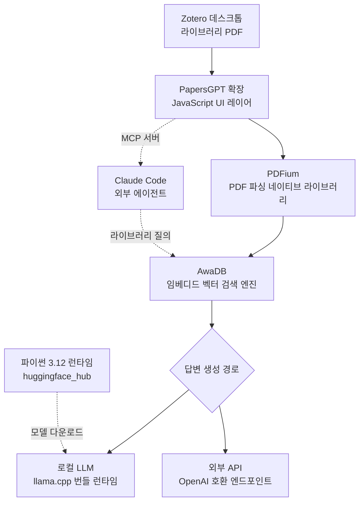

논문 1,000개를 몇 분 만에 색인한다는 Zotero 플러그인이 최근 국내 타임라인에서 화제가 됐습니다. 동시에 합리적인 의심도 함께 돌았습니다. 개발사는 네이티브 C++ 엔진을 쓴다고 적어 놨는데, 정작 GitHub 저장소 언어 통계에는 JavaScript와 TypeScript밖에 없다는 지적이었습니다. 결론부터 말씀드리면 C++ 엔진은 실재합니다. 다만 소스가 아니라 프리빌트 바이너리로 배포 파일 안에 들어 있어서 저장소 통계에 잡히지 않을 뿐입니다. 배포본 131MB를 직접 내려받아 55개 엔트리를 전부 분류한 결과를 정리했습니다.

## 왜 읽어야 하나

이 글은 사내에 로컬 우선 AI 도구를 도입할지 판단해야 하는 플랫폼 엔지니어와 보안 담당자를 위해 썼습니다. 핵심 결론은 이렇습니다. 데스크톱 AI 플러그인의 진짜 실체는 저장소의 소스 코드가 아니라 배포 아티팩트 안에 있으며, 그것을 열어보지 않으면 여러분은 자기 파일 시스템에 무엇을 설치하는지 모르는 상태로 도입 결정을 내리게 됩니다. PapersGPT의 경우 확장 프로그램 한 개를 설치하는 행위가 실제로는 임베디드 벡터 데이터베이스, PDF 파서, llama.cpp 추론 런타임, 그리고 완전한 파이썬 인터프리터를 한꺼번에 들여놓는 일이었습니다. 이 사실은 도구를 쓰지 말라는 뜻이 아니라, 검증 단위를 바꿔야 한다는 뜻입니다.

## 개요

Zotero는 연구자들이 논문 PDF와 서지 정보를 모아 두는 오픈소스 레퍼런스 매니저입니다. 문제는 자료가 쌓이기만 하고 읽히지 않는다는 데 있습니다. 폴더에 PDF 200개가 잠들어 있는 상황은 게으름 때문이 아니라, 찾는 비용이 읽는 비용보다 커졌기 때문에 생깁니다.

PapersGPT는 그 지점을 공략하는 Zotero 확장 프로그램입니다. 라이브러리 전체를 색인해서 여러 논문을 가로지르는 질문에 답하고, 답변에 붙은 인용을 클릭하면 원문 위치로 이동합니다. 개발사 문서에서 강조하는 것은 세 가지입니다. 색인이 100퍼센트 로컬에서 끝나 비행기 모드에서도 동작한다는 점, 네이티브 C++ 코어 덕분에 문서 1,000개를 시간 단위가 아니라 분 단위로 처리한다는 점, 그리고 MCP 플러그인이라 Claude나 Claude Code에 그대로 연결할 수 있다는 점입니다.

저장소는 [papersgpt/papersgpt-for-zotero](https://github.com/papersgpt/papersgpt-for-zotero)이고 AGPL-3.0 라이선스가 붙어 있습니다. 2024년 11월 22일에 만들어졌고 이 글을 쓰는 시점에 별 2,571개, 포크 91개, 열린 이슈 75개입니다. 마지막 푸시는 2026년 7월 22일입니다. 그런데 GitHub API가 알려주는 언어 구성은 JavaScript 4,250,035바이트, TypeScript 211,657바이트, CSS 25,113바이트가 전부입니다. C++는 한 바이트도 없습니다.

여기서 두 갈래 가설이 갈립니다. 성능 주장이 마케팅 문구에 불과하거나, 아니면 C++ 코드가 저장소 바깥에 존재하고 컴파일된 형태로만 사용자에게 전달되거나입니다. 둘 중 어느 쪽인지는 배포 파일을 열어 보면 바로 확인됩니다.

## 이 도구는 무엇인가

동작 구조를 먼저 정리하겠습니다. 사용자가 Zotero에 확장 프로그램을 설치하면, 확장 프로그램은 자기가 품고 있던 네이티브 실행 파일들을 로컬에 풀어 놓고 그것들과 통신하는 얇은 UI 레이어로 동작합니다. 임베딩 기반의 퍼지 검색 대신 문서 구조를 파싱해서 색인한다고 문서는 설명합니다.



핵심은 왼쪽 세로 축입니다. PDF를 읽고, 색인하고, 답을 만드는 경로 전체가 사용자 장비 안에서 닫혀 있습니다. 클라우드는 선택 사항이고 기본 경로가 아닙니다. 오른쪽 점선은 이 도구가 단순한 뷰어가 아니라 MCP 서버로도 노출된다는 뜻입니다. Claude Code에서 Zotero 라이브러리 전체를 하나의 지식원으로 붙여 쓸 수 있다는 의미이고, 실무자 관점에서는 이 부분이 가장 실용적입니다. 파일 경로를 설명하고 하나씩 열어 달라고 요청하는 과정이 사라집니다.

## 설치 및 통합

배포본을 직접 확인하려면 릴리스 아티팩트를 내려받으면 됩니다. Zotero에 설치할 때도 같은 파일을 씁니다.

```bash
# 최신 릴리스 메타데이터 확인
curl -s https://api.github.com/repos/papersgpt/papersgpt-for-zotero/releases/latest \
  | python3 -c "import json,sys; d=json.load(sys.stdin); \
    print(d['tag_name'], d['published_at']); \
    [print(a['name'], a['size']) for a in d['assets']]"

# 배포 아티팩트 내려받기 (131MB)
curl -L -o papersgpt-v0.6.1.xpi \
  https://github.com/papersgpt/papersgpt-for-zotero/releases/download/papersgpt-v0.6.1/papersgpt-v0.6.1.xpi
```

Zotero 확장 프로그램의 `.xpi`는 형식상 zip 아카이브입니다. 그래서 별도 도구 없이 표준 라이브러리만으로 내부를 열어볼 수 있습니다. 저희는 다운로드부터 엔트리 분류까지를 스크립트 하나로 묶어 격리된 작업 트리에서 실행했습니다. 파일 확장자를 믿는 대신 매직 바이트를 읽어 Mach-O, ELF, PE 여부를 직접 판정했습니다.

```python
MAGICS = [
    (b"\xcf\xfa\xed\xfe", "Mach-O 64-bit (macOS)"),
    (b"\xca\xfe\xba\xbe", "Mach-O universal (macOS)"),
    (b"\x7fELF", "ELF (Linux)"),
    (b"MZ", "PE/COFF (Windows)"),
    (b"GGUF", "GGUF model weights"),
]

with zipfile.ZipFile(XPI) as zf:
    for info in zf.infolist():
        if info.is_dir() or info.file_size < 4096:
            continue
        with zf.open(info) as fh:
            head = fh.read(8)
        kind = next((label for magic, label in MAGICS if head.startswith(magic)), "")
        if kind:
            natives.append((info.file_size, kind, info.filename))
```

실행에 필요한 것은 파이썬 표준 라이브러리뿐입니다. 별도 의존성을 설치하지 않았고, Zotero 데스크톱 앱도 필요하지 않았습니다. 전체 스크립트는 `outputs/blog-impl/papersgpt-zotero-local-rag/`에 남겨 두었습니다.

## 실제 실험 결과

내려받는 데 10.6초가 걸렸습니다. 파일 크기는 137,481,144바이트, 약 131.1MB입니다. SHA-256 다이제스트는 `e0ef451af731c2a5781f17b2dc0998903332d82880d64ae9fdf3bf122d088f1f`입니다. 압축 파일 안에는 디렉터리를 제외하고 55개 엔트리가 들어 있었습니다.

먼저 확장자별 집계입니다. 압축을 푼 기준 용량이 큰 순서입니다.

| 확장자 | 파일 수 | 용량 |
|---|---|---|
| `.zip` (중첩 아카이브) | 4 | 99.0MB |
| 확장자 없음 (실행 파일) | 2 | 31.6MB |
| `.dll` | 5 | 26.1MB |
| `.dylib` | 3 | 22.3MB |
| `.js` | 3 | 9.8MB |
| 이미지 및 기타 | 41 | 약 1.0MB |

자바스크립트는 9.8MB이고, 그중 사실상 전부가 `chrome/content/scripts/index.js` 한 파일입니다. 나머지 120MB 넘는 용량은 전부 네이티브 코드이거나 네이티브 코드를 담은 중첩 아카이브였습니다. 매직 바이트로 판정한 네이티브 페이로드는 8개, 합계 50,812,989바이트, 약 48.5MB입니다. 스크립트 대비 비율로는 5.0배입니다.

개별 파일을 보면 정체가 분명해집니다.

| 파일 | 용량 | 정체 |
|---|---|---|
| `resource/win/libawadb.dll` | 14.1MB | AwaDB 임베디드 벡터 검색 엔진 (Windows) |
| `resource/mac/libawadb.dylib` | 10.9MB | 같은 엔진 (macOS 유니버설) |
| `resource/mac/libpdfium.dylib` | 10.8MB | PDFium PDF 파서 |
| `resource/win/pdfium.dll` | 5.5MB | 같은 파서 (Windows) |
| `resource/mac/papersgpt-agent-mac` | 20.7MB | MCP 에이전트 실행 파일 |
| `resource/win/papersgpt-agent` | 10.9MB | 같은 에이전트 (Windows) |
| `resource/win/libcrypto-3-x64.dll` | 5.5MB | OpenSSL |

C++ 엔진에 대한 의문은 여기서 해소됩니다. AwaDB는 C++로 작성된 임베디드 벡터 데이터베이스이고, PDFium은 크로미움에서 갈라져 나온 C++ PDF 엔진입니다. 개발사의 주장은 사실이었고, 다만 그 코드가 저장소에 없기 때문에 GitHub 언어 통계에 잡히지 않았던 것입니다.

더 흥미로운 것은 99MB를 차지하는 중첩 zip 네 개였습니다. 열어 보니 이 확장 프로그램은 추론 스택과 런타임까지 통째로 품고 있었습니다.

`resource/mac/llm-server-deploy-package.zip`은 36.7MB에 파일 31개가 들어 있고, 그 안에는 `libllama-server-impl.dylib` 28.1MB, `libllama-common.dylib` 14.7MB, `libllama.dylib` 4.9MB, `libggml-cpu.dylib` 2.2MB가 있었습니다. llama.cpp입니다. 윈도우 쪽 `llm-server-deploy-package.zip`은 14.0MB에 파일 21개이고, `papersgpt-local-llm-base` 18.6MB와 `llama.dll` 3.0MB에 더해 `ggml-cpu-sapphirerapids.dll`, `ggml-cpu-zen4.dll`, `ggml-cpu-icelake.dll`, `ggml-cpu-skylakex.dll`, `ggml-cpu-cooperlake.dll`, `ggml-cpu-cannonlake.dll`이 각각 1.3MB에서 1.6MB 사이로 들어 있었습니다. CPU 마이크로아키텍처별 커널을 미리 빌드해 두고 런타임에 고르는 구성입니다.

나머지 두 개는 더 놀랍습니다. `resource/mac/download-release.zip`은 24.9MB인데 압축을 풀면 파일이 1,851개이고, 그 안에 `python-3.12/lib/libpython3.12.dylib` 38.3MB가 들어 있습니다. `huggingface_hub`, `hf_xet`, `certifi`의 CA 번들까지 포함된 완전한 파이썬 3.12 배포판입니다. 윈도우용 `download-release.zip`은 23.4MB에 파일 1,932개이고 `python311.dll`, `sqlite3.dll`, 그리고 번들된 `pip-24.0` 휠까지 들어 있었습니다. 로컬 LLM을 한 번의 클릭으로 Hugging Face에서 내려받는 기능이 바로 이 임베디드 파이썬으로 구현돼 있습니다.

마지막으로 확인한 사실 하나가 도입 판단에 직접 영향을 줍니다. 아카이브 안의 플랫폼 디렉터리는 `resource/mac`과 `resource/win` 두 개뿐이었습니다. `resource/linux`는 없습니다. 리눅스 데스크톱이나 서버에서는 이 도구가 동작하지 않습니다.

한 가지는 정직하게 밝히겠습니다. 저희는 실제 Zotero 라이브러리를 붙여 논문 1,000개 색인 시간을 측정하지는 않았습니다. 이번 실험의 범위는 배포 아티팩트의 구성 검증까지이고, 속도 주장에 대해서는 그것을 가능하게 하는 네이티브 엔진이 실제로 존재한다는 사실만 확인했습니다. 색인 처리량 수치는 여전히 개발사 자체 발표이며 독립 검증된 값이 아닙니다.

## ThakiCloud 제품 적용 시사점

이 해부 결과는 저희가 두 제품에서 매일 부딪히는 문제와 정확히 겹칩니다.

먼저 ai-platform 관점입니다. ThakiCloud의 ai-platform은 쿠버네티스 위에서 고객사 환경에 모델을 서빙하는 인프라이고, 고객 상당수가 데이터를 외부로 보낼 수 없는 조건에서 움직입니다. PapersGPT가 증명하는 것은 로컬 우선 RAG가 이미 데스크톱 한 대에서 성립한다는 사실입니다. 벡터 검색은 임베디드 엔진으로, 추론은 llama.cpp CPU 커널로 충분히 돌아갑니다. 다만 반대 방향의 교훈이 더 중요합니다. 이 접근은 사용자 장비마다 48.5MB의 바이너리와 파이썬 런타임을 복제하는 방식이고, 조직 단위로 확장하면 버전 드리프트와 패치 지연이 그대로 비용이 됩니다. 같은 기능을 사내에서 제공한다면 임베딩과 추론을 중앙 GPU 풀에 올리고 클라이언트는 얇게 유지하는 편이 관리 가능합니다. Kueue로 GPU를 큐잉하고 vLLM으로 서빙하면 모델 업데이트가 한 곳에서 끝나며, 데이터는 여전히 고객 경계 안에 머뭅니다. 온프레미스와 데이터 주권이라는 요구를 만족시키는 방법이 반드시 개인 장비 설치일 필요는 없습니다.

다음은 Paxis 관점입니다. Paxis는 ai-platform 위에서 도는 ThakiCloud의 Agent-Native Cloud 제어 평면으로, Skills와 Tools, Policies, Audit Logs를 일급 리소스로 다룹니다. PapersGPT는 MCP 서버로 노출되기 때문에 Claude Code 같은 코딩 에이전트에 그대로 연결됩니다. 편의성은 분명하지만, 에이전트에 커넥터를 붙이는 순간 그 커넥터가 사용자 파일 시스템에 대해 갖는 권한이 곧 에이전트의 권한이 됩니다. 이번에 확인한 것처럼 그 커넥터 내부에는 소스가 공개되지 않은 실행 파일 8개와 임베디드 파이썬 인터프리터가 들어 있습니다. Paxis가 MCP 커넥터를 정책 게이트 뒤에 두고 모든 호출을 감사 로그로 남기는 이유가 여기 있습니다. 커넥터를 신뢰하는 대신 커넥터의 행동을 기록하고 제한하는 방식이며, 도구 하나하나를 사람이 전수 감사할 수 없는 환경에서는 이쪽이 현실적인 방어선입니다. 스킬과 도구를 격리 샌드박스에서 실행하는 설계도 같은 판단에서 나왔습니다.

## 한계 및 반론

이번 분석에는 명확한 한계가 있습니다. 저희는 정적 구성만 확인했습니다. 바이너리를 리버스 엔지니어링하지 않았고 실행 중 네트워크 트래픽도 관찰하지 않았습니다. 따라서 100퍼센트 로컬 처리라는 주장을 검증한 것이 아니라, 그 주장을 구현할 수 있는 부품이 실제로 들어 있다는 사실만 확인했습니다.

반론도 공정하게 적겠습니다. 프리빌트 바이너리를 배포하는 것 자체는 흔한 관행이며 그 자체로 문제는 아닙니다. 데스크톱 사용자에게 컴파일러를 요구하지 않으려면 다른 선택지가 마땅치 않고, PDFium이나 llama.cpp처럼 널리 쓰이는 프로젝트를 번들하는 것도 합리적입니다. 다만 저장소에 AGPL-3.0이 걸려 있는데 성능의 핵심을 담당하는 네이티브 코어의 소스가 저장소에 없다는 조합은 사용자가 사실상 감사할 수 없는 구성입니다. 오픈소스라는 인상과 실제 검증 가능성 사이에 간격이 있습니다.

기능 측면의 한계도 있습니다. 리눅스 빌드가 없어서 서버나 리눅스 워크스테이션 환경에서는 선택지에서 빠집니다. 별 2,571개에 열린 이슈가 75개라는 수치는 활발한 프로젝트라는 뜻이기도 하지만 미해결 항목이 쌓여 있다는 뜻이기도 합니다. 그리고 라이브러리 전체를 가로지르는 종합 능력은 문서에 설명된 대로라면 강력하지만, 저희가 직접 측정하지 않은 영역입니다.

## 정리

트위터에서 제기된 의심은 절반만 맞았습니다. 네이티브 C++ 엔진은 실재합니다. AwaDB와 PDFium, llama.cpp가 프리빌트 바이너리로 들어 있고 크기는 48.5MB로 자바스크립트의 5배입니다. 다만 그 소스는 저장소에 없으므로 사용자가 검증할 수 없습니다. 두 사실은 모순되지 않으며, 둘 다 알고 있어야 제대로 된 판단이 나옵니다.

실무자에게 남기고 싶은 한 줄은 이것입니다. 데스크톱 AI 도구를 도입할 때 저장소를 보지 말고 배포 아티팩트를 여십시오. 이 글에서 쓴 방법은 파이썬 표준 라이브러리만으로 몇 분이면 끝나고, 확장자 대신 매직 바이트를 읽는 것만으로 무엇이 설치되는지 목록이 나옵니다. 그 목록을 확인한 뒤에도 도입하겠다고 판단한다면 그것은 정보에 근거한 결정입니다. 확인하지 않고 설치한다면 그것은 결정이 아니라 기대입니다.

## 출처

- [papersgpt/papersgpt-for-zotero (GitHub)](https://github.com/papersgpt/papersgpt-for-zotero)
- [PapersGPT v0.6.1 릴리스](https://github.com/papersgpt/papersgpt-for-zotero/releases/tag/papersgpt-v0.6.1)
- [Zotero 공식 사이트](https://www.zotero.org/)
