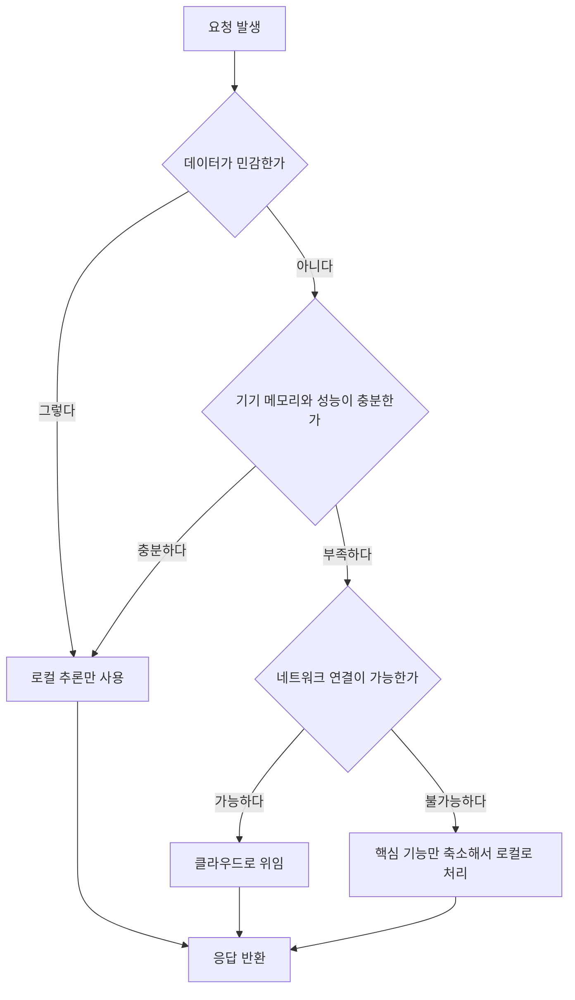

사내망 밖으로 데이터를 내보낼 수 없는 환경에서 AI 기능을 만들어야 하는 엔지니어라면 이 글이 도움이 됩니다. 클라우드 API를 그대로 붙일 수 없을 때 모델을 기기 안에서 돌리는 선택이 아키텍처 전반에 무엇을 강제하는지, 그리고 그 제약 안에서 실제로 얻는 것과 포기해야 하는 것이 무엇인지를 정리했습니다.

로컬 우선이라는 표현은 종종 성능 최적화 이야기로 오해받습니다. 하지만 실무에서 이 선택을 강제하는 이유는 대부분 속도나 비용이 아니라 데이터가 기기를 벗어날 수 없다는 규정이나 계약 조건입니다. 그 출발점의 차이가 설계 전체를 다르게 만듭니다.


*글의 핵심 개념을 형상화했습니다.*

## 데이터가 기기를 떠나지 않는다는 제약

의료 기록을 다루는 앱, 금융 상담을 요약하는 서비스, 폐쇄망 안에서 운영되는 공공기관 시스템을 만들어본 적이 있다면 이 문제를 압니다. 사용자의 입력을 클라우드 API로 보내는 순간, 그 데이터는 이미 서비스 제공자의 서버에 도달한 상태입니다. 로그로 남을 수도 있고, 모델 학습에 재사용될 수도 있고, 보안 사고로 유출될 수도 있습니다. [개인정보보호법](https://pipc.go.kr/eng/index.do)이나 [GDPR](https://gdpr-info.eu/) 같은 규제가 강화될수록 이 위험은 선택지가 아니라 준수해야 할 조건으로 바뀝니다.

로컬 우선 설계는 이 문제를 근본적으로 다르게 풉니다. 데이터를 안전하게 전송하는 방법을 고민하는 대신, 데이터가 애초에 기기를 떠날 필요가 없도록 만듭니다. 추론이 사용자의 스마트폰이나 노트북, 혹은 사내 서버 안에서 끝나면 유출 경로 자체가 사라집니다. 이 차이는 보안 감사를 통과하느냐 마느냐를 가르는 실질적인 기준이 되기도 합니다.

다만 이 제약을 받아들이는 순간 다른 문제가 함께 따라옵니다. 클라우드의 대형 모델이 갖는 추론 능력을 기기 안에서 그대로 재현할 수는 없습니다. 로컬 우선을 선택한다는 것은 프라이버시를 얻는 대신 모델 성능의 상한선을 낮추는 거래를 받아들이는 일입니다. 이 거래를 정직하게 인정하고 설계를 시작해야 나중에 기대와 실제 사이의 간극에 놀라지 않습니다.

이 제약이 개인 사용자 앱에만 해당하는 이야기는 아닙니다. 기업 고객을 상대하는 소프트웨어에서는 계약서 자체에 데이터 반출 금지 조항이 명시되는 경우가 흔합니다. 이런 환경에서는 클라우드 API의 응답 품질이 아무리 뛰어나도 애초에 검토 대상이 될 수 없습니다. 계약이 기술 선택을 앞질러 결정해버리는 셈입니다. 그래서 로컬 우선 설계는 처음부터 기술팀만의 판단이 아니라 법무나 보안 조직과 함께 조건을 확인하는 데서 시작하는 편이 안전합니다.

## 왜 지연 시간이 아키텍처를 바꾸는가

클라우드 API 호출은 네트워크 왕복을 피할 수 없습니다. 서울에서 해외 리전까지 오가는 데만 100밀리초 안팎이 걸리고, 여기에 모델 추론 시간이 더해집니다. 이 정도 지연은 챗봇처럼 텍스트 한 번 주고받는 상호작용에서는 크게 문제되지 않을 수 있습니다. 하지만 실시간 음성 대화나 카메라 프레임마다 반응해야 하는 증강현실 기능에서는 이야기가 달라집니다.

지연 시간이 늘어나면 단순히 사용자가 더 오래 기다리는 것으로 끝나지 않습니다. 어떤 기능을 아예 제품에 넣을 수 있는지 자체가 결정됩니다. 음성으로 자연스럽게 대화를 이어가려면 상대방의 말이 끝난 직후 곧바로 반응이 나와야 하는데, 네트워크 왕복이 끼어드는 순간 그 자연스러움은 깨집니다. 실시간 자막이나 즉각적인 이미지 필터링도 마찬가지입니다. 이런 기능은 애초에 로컬 추론 없이는 설계 도면에 올릴 수조차 없습니다.

로컬 추론은 네트워크 구간을 완전히 제거합니다. 적절한 크기의 모델을 적합한 하드웨어에서 돌리면 응답을 수십 밀리초 안에 만들어낼 수 있습니다. 이 속도는 최적화의 결과가 아니라 구조적으로 얻어지는 값입니다. 왕복할 네트워크 자체가 없기 때문입니다. 그래서 로컬 우선 아키텍처를 검토할 때는 비용 절감보다 먼저 이 질문을 던지는 편이 정확합니다. 우리 제품에 네트워크 왕복이 끼어드는 순간 성립하지 않는 기능이 있는가.

## 로컬 하드웨어의 현실: 메모리와 양자화의 트레이드오프

여기서부터는 로컬 AI를 다루는 글에서 자주 생략되는 이야기를 해야 합니다. 로컬이 항상 더 낫다는 식의 서술은 과장입니다. 실제로 로컬 추론을 도입하면 클라우드에서는 신경 쓸 필요가 없던 제약이 한꺼번에 몰려옵니다.

가장 먼저 부딪히는 벽은 메모리입니다. 스마트폰이나 노트북의 메모리는 운영체제와 다른 애플리케이션이 이미 상당 부분 점유하고 있어서, 모델이 실제로 쓸 수 있는 여유는 총 메모리보다 훨씬 작습니다. 큰 모델을 그대로 올리면 메모리 부족으로 앱이 강제 종료되는 일이 벌어집니다. 그래서 로컬 배포용 모델은 대부분 양자화를 거칩니다. 원래 32비트나 16비트로 저장되던 가중치를 8비트나 4비트로 줄이면 모델 크기와 메모리 사용량이 함께 줄어듭니다.

문제는 양자화가 공짜가 아니라는 점입니다. 비트 수를 낮출수록 크기는 줄지만 원본 모델이 갖고 있던 미묘한 표현력도 함께 깎여 나갑니다. 압축을 조금만 하면 품질 손실은 거의 느껴지지 않지만 메모리 절감 폭도 작습니다. 반대로 공격적으로 압축하면 메모리에는 여유가 생기지만 답변이 부자연스러워지거나 드물게 사실과 다른 내용을 만들어내는 빈도가 늘어날 수 있습니다. 이 지점에서 정답은 하나로 정해지지 않습니다. 자신의 태스크에서 실제로 감내할 수 있는 품질 저하 수준을 직접 측정하고 정해야 합니다.

하드웨어 가속 경로도 기기마다 균일하지 않습니다. 최신 애플 실리콘은 [전용 신경망 엔진](https://machinelearning.apple.com/research/neural-engine-transformers)을 갖추고 있어 적은 전력으로도 효율적인 추론이 가능하지만, 구형 안드로이드 기기는 신경망 가속 레이어를 제대로 지원하지 않거나 지원하더라도 동작이 불안정한 경우가 많습니다. 그래서 로컬 우선 제품을 설계할 때는 가속 경로가 실패했을 때 CPU 추론으로 조용히 넘어가는 폴백 경로를 처음부터 함께 짜야 합니다. 이 폴백이 없으면 최신 기기에서는 매끄럽게 동작하던 기능이 구형 기기에서는 아예 멈추거나 눈에 띄게 느려집니다.

기기 발열도 무시할 수 없는 변수입니다. 모바일 칩에서 추론을 오래 지속하면 발열 제어를 위해 처리 속도가 스스로 낮아지는 현상이 나타납니다. 벤치마크를 짧게 한 번만 돌려서 얻은 숫자는 실제 사용 환경의 성능을 과대평가하기 쉽습니다. 연속 사용 시나리오까지 포함해 성능을 검증해야 실제 배포 후에 겪을 저하를 미리 알 수 있습니다.

모델 파일 자체의 용량도 앱 배포 과정에서 걸림돌이 됩니다. [앱스토어](https://developer.apple.com/help/app-store-connect/reference/maximum-build-file-sizes/)나 [플레이스토어](https://developer.android.com/topic/performance/reduce-apk-size)는 초기 설치 용량에 제한을 두는 경우가 많고, 사용자도 수 기가바이트짜리 앱을 선뜻 내려받지 않습니다. 그래서 모델을 앱 번들에 포함하지 않고 최초 실행 시점에 별도로 내려받게 하는 구조를 많이 씁니다. 이때는 다운로드가 끊기거나 실패했을 때의 재시도 경로, 그리고 모델이 준비되지 않은 동안 사용자에게 무엇을 보여줄지도 함께 설계해야 합니다.

## 언제 로컬을 쓰고 언제 클라우드로 넘길 것인가

이런 제약을 인정하고 나면 자연스럽게 다음 질문이 따라옵니다. 로컬만으로 모든 것을 해결할 수 없다면, 언제 로컬을 쓰고 언제 클라우드로 넘겨야 할까요. 이 판단 기준을 흐름으로 정리하면 다음과 같습니다.



가장 먼저 물어야 할 질문은 데이터의 민감도입니다. 규제나 계약으로 외부 전송이 아예 금지된 데이터라면 성능이나 편의성과 관계없이 로컬 처리가 강제됩니다. 이 조건을 만족하면 나머지 판단은 필요하지 않습니다.

민감도 조건에서 자유롭다면 그다음은 기기 성능입니다. 로컬 모델로 충분한 품질을 낼 수 있는 태스크라면 굳이 클라우드까지 갈 이유가 없습니다. 반대로 복잡한 추론이나 최신 정보가 필요한 질의라면 로컬 모델의 한계가 곧바로 드러납니다. 이럴 때는 클라우드로 넘기는 편이 사용자 경험에 유리합니다.

네트워크가 아예 끊긴 상황도 고려해야 합니다. 지하철이나 비행기, 혹은 통신이 제한된 현장에서도 앱이 완전히 멈추지 않으려면 핵심 기능만이라도 로컬에서 계속 동작해야 합니다. 여기서 중요한 원칙은 모든 기능을 오프라인에서 완벽하게 재현하려 하지 않는 것입니다. 요약이나 검색처럼 자주 쓰이는 핵심 동작만 로컬로 남기고, 고급 기능은 네트워크가 복구될 때까지 잠시 비활성화하는 편이 훨씬 현실적입니다.

이 판단을 런타임마다 매끄럽게 처리하려면 자주 반복되는 질의를 캐싱해두는 것도 도움이 됩니다. 완전히 같은 질문이 아니어도 의미가 비슷한 질문의 결과를 재사용하면, 클라우드 호출 자체가 필요 없는 경우를 상당수 걸러낼 수 있습니다. 다음은 기기 상태를 확인해 로컬과 클라우드 사이에서 경로를 정하는 간단한 게이트 예시입니다.

```python
def choose_inference_path(is_sensitive: bool, device_ram_mb: int,
                           min_ram_for_local_mb: int, network_available: bool) -> str:
    if is_sensitive:
        return "local"
    if device_ram_mb >= min_ram_for_local_mb:
        return "local"
    if network_available:
        return "cloud"
    return "local_reduced"
```

이 함수는 실제 제품에서는 훨씬 복잡해지겠지만, 핵심은 판단 순서를 코드로 명시해두는 데 있습니다. 민감도 확인이 언제나 맨 앞에 와야 하고, 그다음에야 성능과 네트워크 상태를 따집니다. 순서가 바뀌면 민감한 데이터가 실수로 클라우드까지 넘어가는 사고로 이어질 수 있습니다.

## 로컬 우선 설계에서 흔히 놓치는 함정

로컬 우선 아키텍처를 처음 도입할 때 자주 반복되는 실수가 몇 가지 있습니다.

첫째는 자신이 테스트한 기기의 성능을 모든 사용자의 기준으로 착각하는 일입니다. 개발자가 쓰는 최신 플래그십 기기에서는 로컬 모델이 매끄럽게 돌아가지만, 실제 사용자 중 상당수는 몇 년 된 중저가 기기를 쓰고 있습니다. 다양한 사양의 실제 기기에서 검증하지 않으면 출시 후에야 이 격차를 발견하게 됩니다.

둘째는 로컬 모델을 한 번 배포하면 끝이라고 생각하는 것입니다. 모델도 소프트웨어와 마찬가지로 취약점이 발견될 수 있고, 새로운 버전이 성능이나 품질 면에서 크게 개선되기도 합니다. 배포된 모델 파일을 안전하게 갱신할 수 있는 경로를 처음부터 설계에 포함해야 합니다.

셋째는 로컬 모델이 최신 정보를 알지 못한다는 사실을 간과하는 것입니다. 로컬에 내장된 모델은 학습 시점 이후의 사건이나 데이터를 알 수 없습니다. 프라이버시가 아무리 중요해도 최신 정보가 꼭 필요한 질의라면 로컬만으로는 답을 줄 수 없습니다. 이런 태스크는 애초에 하이브리드 설계의 대상으로 분류해야 합니다.

넷째는 배터리와 발열을 사용자 경험의 일부로 여기지 않는 것입니다. 로컬 추론은 기기의 연산 자원을 직접 쓰기 때문에 배터리 소모와 발열이 클라우드 방식보다 눈에 띄게 커질 수 있습니다. 앱이 똑똑하다는 인상보다 배터리를 많이 먹는다는 인상이 먼저 남으면 결국 삭제로 이어집니다.

다섯째는 응답의 출처를 사용자에게 숨기는 것입니다. 같은 질문이라도 로컬 모델이 답했는지 클라우드 모델이 답했는지에 따라 신뢰할 수 있는 범위가 달라집니다. 이 구분을 화면 어딘가에 작게라도 표시해두면, 사용자가 답변을 어느 정도까지 믿어야 할지 스스로 판단할 수 있습니다. 구분을 감추면 당장은 매끄러워 보여도 나중에 품질 편차의 원인을 설명하기 어려워집니다.

## ThakiCloud 관점에서

저희는 고객사 환경에 쿠버네티스 기반 AI 플랫폼을 직접 서빙합니다. 그리고 로컬 우선 개발자들이 마주하는 고민이 저희가 온프레미스 환경에서 매일 마주하는 고민과 본질적으로 같다는 것을 반복해서 확인합니다. 둘 다 출발점은 데이터 주권입니다. 개인 사용자의 기기 안에서 데이터가 벗어나지 않아야 한다는 요구와, 고객사의 사내 인프라 경계 밖으로 데이터가 나가서는 안 된다는 요구는 규모만 다를 뿐 같은 원칙에서 나옵니다.

다른 점은 제약의 층위입니다. 개인 기기는 메모리와 배터리, 발열이라는 물리적 한계 안에서 모델을 돌려야 하지만, 저희가 서빙하는 환경은 고객사 내부의 GPU 클러스터를 활용할 수 있어 상대적으로 큰 모델도 폐쇄망 안에서 돌릴 여지가 있습니다. 그럼에도 폴백 경로 설계, 캐싱 전략, 어떤 요청을 로컬에서 끝내고 어떤 요청을 더 큰 자원으로 넘길지 정하는 판단 구조는 거의 그대로 재사용됩니다. 결국 로컬 우선 개발이 기기 하나를 대상으로 풀던 문제를, 저희는 조직 전체를 대상으로 같은 방식으로 풀고 있는 셈입니다.

모델 갱신 문제도 같은 방식으로 되풀이됩니다. 개인 기기의 로컬 모델을 안전하게 업데이트해야 하는 고민은, 저희가 고객사의 폐쇄망 안에서 서빙 중인 모델을 무중단으로 교체해야 하는 고민과 형태만 다를 뿐 본질은 같습니다. 외부 네트워크에 의존하지 않고 내부에서 배포와 롤백을 완결할 수 있어야 한다는 요구는 기기 하나든 클러스터 전체든 똑같이 적용됩니다.

로컬 우선 AI는 만능 해법이 아닙니다. 클라우드 대형 모델과 같은 수준의 추론 능력을 기대할 수 없고, 기기마다 성능 편차도 크며, 배터리와 발열이라는 현실적인 제약도 함께 짊어져야 합니다. 하지만 데이터가 애초에 기기를 벗어날 필요가 없다는 구조적 이점과 네트워크 왕복 없이 얻는 즉각적인 응답은 다른 방식으로는 대체하기 어렵습니다. 이 거래를 정직하게 인정하고, 민감도와 성능과 네트워크 상태를 순서대로 따지는 판단 구조를 코드로 명시해두는 것이 로컬 우선 설계의 실질적인 출발점입니다.

이 글의 내용은 저희가 사내에서 정리한 전자책 『로컬 우선 AI 소프트웨어 개발』의 일부를 블로그용으로 다시 쓴 것입니다.

## 참고 자료

- [GDPR 공식 규정 전문 (gdpr-info.eu)](https://gdpr-info.eu/)
- [개인정보보호위원회 공식 사이트 (PIPC)](https://pipc.go.kr/eng/index.do)
- [Deploying Transformers on the Apple Neural Engine (Apple Machine Learning Research)](https://machinelearning.apple.com/research/neural-engine-transformers)
- [Maximum Build File Sizes (App Store Connect Help)](https://developer.apple.com/help/app-store-connect/reference/maximum-build-file-sizes/)
- [Reduce your app size (Android Developers)](https://developer.android.com/topic/performance/reduce-apk-size)

## 관련 슬라이드

본문 내용을 NotebookLM(`architectural_mono` 스타일)으로 요약한 슬라이드입니다.


## 챕터 삽화


