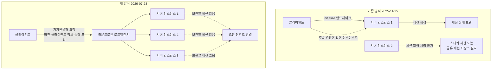

MCP 서버를 운영해 보신 분이라면 스케일아웃을 시도하다 한 번쯤 멈칫하셨을 겁니다. 인스턴스를 두 대로 늘리는 순간 세션이 문제가 됩니다. 클라이언트가 처음 붙은 인스턴스에 계속 붙어 있어야 하니 스티키 세션을 걸거나 세션 저장소를 공유해야 했습니다. Anthropic이 2026년 7월 28일에 공개한 [새 MCP 명세](https://blog.modelcontextprotocol.io/posts/2026-07-28/)는 그 전제 자체를 걷어냈습니다.

## 왜 읽어야 하나

이 글은 MCP 서버를 이미 운영 중이거나 곧 배포할 백엔드 엔지니어와 플랫폼 담당자를 위해 썼습니다. 핵심 결론을 먼저 말씀드리겠습니다. 이번 개정의 본질은 기능 추가가 아니라 상태를 프로토콜에서 페이로드로 옮긴 것이며, 그 결과 MCP 서버는 특별한 취급이 필요한 상태 유지 서비스에서 평범한 무상태 HTTP 서비스가 됐습니다. 그리고 당장 무엇이 깨지지는 않습니다. 기존 서버는 계속 동작하고 폐기 항목에는 최소 12개월의 유예가 붙었습니다. 그래서 이 글의 실질적 목적은 긴급 대응이 아니라 다음 분기 로드맵에 무엇을 넣을지 정하는 데 있습니다.

## 개요

MCP는 처음 설계될 때 로컬 도구를 붙이는 프로토콜에 가까웠습니다. 데스크톱 앱이 로컬 프로세스와 연결을 하나 열고 그 연결 위에서 대화하는 그림이라면 세션은 자연스러운 개념입니다. 연결이 살아 있는 동안 협상한 내용을 기억하면 되니까요.

문제는 MCP가 원격 서비스로 옮겨 가면서 드러났습니다. 여러 인스턴스가 로드밸런서 뒤에 서고, 오토스케일러가 인스턴스를 늘렸다 줄이고, 서버리스 런타임이 요청 단위로 컨테이너를 띄우는 환경에서 세션은 비용입니다. 요청이 어느 인스턴스로 가도 상관없어야 스케일링이 쉬운데, 세션은 정확히 그 자유를 빼앗습니다. 이번 개정은 이 지점을 정면으로 다뤘고, 여러 정리 글이 출시 이후 최대 규모의 개정이라고 평가합니다.

## 무엇이 바뀌었나

가장 큰 변화는 프로토콜 코어가 무상태가 됐다는 점입니다. 구체적으로는 두 가지가 사라졌습니다. 연결을 열 때 주고받던 `initialize` 핸드셰이크가 없어졌고, 프로토콜 수준의 세션 개념 자체가 없어졌습니다.

대신 모든 요청이 자기완결형이 됐습니다. 예전에는 연결 시점에 한 번 교환하던 프로토콜 버전과 클라이언트 정보와 능력 협상 내용을 이제는 요청마다 실어 보냅니다. 언뜻 낭비처럼 보이지만 얻는 것이 큽니다. 세션 식별자가 없으므로 어떤 요청이든 어떤 인스턴스로 보내도 됩니다. 스티키 세션 설정도, 공유 세션 저장소도 필요 없이 평범한 라운드로빈 로드밸런서 뒤에 MCP 서버를 세울 수 있습니다.

전송 계층에도 변화가 붙었습니다. Streamable HTTP 전송은 이제 `Mcp-Method`와 `Mcp-Name` 헤더를 요구합니다. 목적은 분명합니다. 로드밸런서와 게이트웨이와 레이트리미터가 본문을 열어 보지 않고도 어떤 작업인지 알고 라우팅할 수 있게 하는 것입니다. JSON 본문을 파싱해야만 도구 호출인지 목록 조회인지 알 수 있던 구조에서는 인프라 계층이 할 수 있는 일이 거의 없었습니다.

## 세션이 사라진 자리는 무엇이 채우나

세션을 없애면 세션이 하던 일을 누군가 대신해야 합니다. 명세는 두 가지 장치를 새로 넣었습니다.

첫째는 Multi Round-Trip Requests입니다. SEP-2322로 도입됐고, 예전에 길게 열어 두던 SSE 스트림을 대체합니다. 동작 방식은 이렇습니다. 서버가 처리 도중 클라이언트에게 무언가 물어봐야 하면 연결을 붙잡는 대신 `InputRequiredResult`를 돌려줍니다. 이 응답에는 물어볼 항목인 `inputRequests`와 불투명한 `requestState` 토큰이 함께 담깁니다. 클라이언트는 답을 모은 뒤 원래 호출을 `inputResponses`와 함께 다시 보냅니다. 상태가 붙잡힌 연결이 아니라 페이로드 안에 들어 있으므로 무상태 모델과 맞아떨어집니다.

둘째는 발견과 캐싱입니다. 예전에 세션 헤더나 `initialize` 핸드셰이크에 기대던 서버는 이제 `server/discover` 메서드를 구현해야 합니다. 그리고 목록 조회와 읽기 결과에 `ttlMs`와 `cacheScope`를 붙여 캐시 가능하다는 사실을 명시합니다. 매 요청이 자기완결형이 되면 도구 목록 같은 정보를 반복해서 주고받게 되는데, 캐시 힌트가 그 반복 비용을 상쇄합니다. 여기에 인가 강화와 공식 확장 프레임워크가 함께 들어갔고 Tier 1 SDK도 갱신됐습니다.

## 무엇이 폐기됐고 무엇으로 대체하나

SEP-2577이 세 가지 기능을 폐기 대상으로 표시했습니다. Roots와 Sampling과 Logging입니다. 여기에 레거시 HTTP with SSE 전송도 함께 정리됐습니다.

| 폐기 항목 | 권장 대체 |
|---|---|
| Roots | 도구 파라미터, 리소스 URI, 또는 설정 |
| Sampling | LLM 제공자 API 직접 호출 |
| Logging | stderr 및 OpenTelemetry |
| 레거시 HTTP with SSE 전송 | Streamable HTTP |

대체 방향에 일관된 논리가 보입니다. 세 기능은 모두 서버가 클라이언트 쪽으로 무언가를 요청하거나 연결을 붙잡아야 성립하는 기능이었습니다. 무상태 모델에서는 그 전제가 성립하지 않으니, 상태가 필요 없는 경로로 각각 옮긴 것입니다. Logging을 stderr와 OpenTelemetry로 넘긴 선택이 특히 그렇습니다. 관측성은 프로토콜이 떠안을 문제가 아니라 이미 성숙한 표준이 있는 영역이라는 판단으로 읽힙니다.

폐기가 곧 제거는 아닙니다. 정식 폐기 정책이 이번에 함께 명문화됐는데, 어떤 기능이 폐기로 표시된 개정이 나온 시점부터 최소 12개월이 지나야 제거 대상이 될 수 있습니다.

## 마이그레이션은 언제 해야 하나

결론부터 말씀드리면 지금 당장 급하게 고칠 필요는 없습니다.

프로덕션에 v1 서버를 운영 중이어도 7월 28일에 깨지는 것은 없습니다. 기존 서버는 계속 동작하고 폐기 항목에는 1년의 유예가 있습니다. 호환성 설계도 신중합니다. v2 서버는 `server/discover`와 함께 레거시 `initialize` 핸드셰이크에도 응답하므로, 서버를 올려도 2025-11-25 명세를 쓰는 기존 클라이언트가 끊기지 않습니다. 반대편에서도 클라이언트 기본 모드가 `server/discover`를 먼저 시도하고 실패하면 `initialize`로 폴백합니다. 양쪽 다 점진적 전환을 전제로 설계됐습니다.

그래서 현실적인 순서는 이렇게 잡힙니다. 먼저 폐기된 세 기능을 쓰고 있는지 코드베이스에서 확인합니다. Sampling을 쓰고 있었다면 대체 작업이 가장 큽니다. 서버가 클라이언트의 모델을 빌려 쓰던 구조를 제공자 API 직접 호출로 바꾸는 일은 비용 부담 주체와 키 관리 위치를 함께 바꾸는 결정이라 단순 치환이 아닙니다. Logging은 상대적으로 쉽고, Roots는 대체 경로가 셋이라 설계 판단이 필요합니다.

## ThakiCloud 제품 적용 시사점

이 변화는 저희 두 제품에 서로 다른 방식으로 닿습니다.

Paxis 쪽이 더 직접적입니다. Paxis는 ThakiCloud의 Agent-Native Cloud 제어 평면으로, 스킬과 도구와 정책과 감사 로그를 일급 리소스로 다루며 MCP 커넥터를 통해 외부 도구를 연결합니다. 무상태 전환은 이 커넥터 계층의 운영 난이도를 낮춥니다. 세션이 사라지면 커넥터가 특정 서버 인스턴스에 묶여 있을 이유가 없고, 재연결이 실패했을 때 복구해야 할 상태도 줄어듭니다. 더 흥미로운 것은 헤더 기반 라우팅입니다. `Mcp-Method`와 `Mcp-Name`이 헤더로 노출된다는 말은, 본문을 열어 보지 않고도 어떤 도구가 호출되는지 게이트웨이 계층에서 알 수 있다는 뜻입니다. 정책 게이트를 붙이기에 이보다 좋은 자리는 드뭅니다. 도구 이름 단위로 허용과 거부를 판단하고 레이트리밋을 걸고 감사 로그를 남기는 일을 애플리케이션이 아니라 인프라 계층에서 처리할 수 있게 됩니다.

ai-platform 쪽은 서빙 토폴로지의 문제로 옮겨 옵니다. ThakiCloud의 ai-platform은 쿠버네티스 위에서 모델과 서비스를 운영하는 멀티테넌트 인프라입니다. 무상태 MCP 서버는 이 환경에서 다루기 훨씬 쉬운 워크로드입니다. 스티키 세션 설정이 필요 없으니 기본 서비스 로드밸런싱을 그대로 쓸 수 있고, 요청 사이에 보관할 상태가 없으니 수평 확장과 축소가 자유롭습니다. 트래픽이 없을 때 인스턴스를 0으로 내리는 선택지도 열립니다. 온프레미스와 소버린 환경에서는 의미가 하나 더 붙습니다. 세션 저장소로 쓰던 외부 상태 저장소가 빠지면 배포에 필요한 구성 요소가 줄고, 구성 요소가 줄면 폐쇄망 반입 심사에서 설명해야 할 표면도 줄어듭니다.

## 한계 및 반론

무상태 전환이 공짜는 아닙니다.

매 요청이 자기완결형이라는 말은 매 요청이 더 무거워진다는 뜻이기도 합니다. 프로토콜 버전과 클라이언트 정보와 능력 협상 내용이 반복해서 오갑니다. 명세가 캐시 힌트를 넣은 이유가 여기에 있지만, 캐시는 클라이언트가 실제로 존중해야 효과가 납니다. 구현이 게으르면 대역폭과 지연이 늘어나는 쪽으로 기울 수 있습니다.

Sampling 폐기는 단순한 치환이 아닙니다. 서버가 클라이언트의 모델을 빌려 쓰는 구조에는 나름의 장점이 있었습니다. 서버는 모델 자격 증명을 갖지 않아도 됐고 추론 비용은 클라이언트가 부담했습니다. 제공자 API 직접 호출로 옮기면 서버가 키를 보관해야 하고 비용도 서버 쪽으로 넘어옵니다. 배포 모델에 따라 이 변화가 꽤 클 수 있습니다.

그리고 시점의 문제가 있습니다. 이 글을 쓰는 시점 기준으로 명세가 공개된 지 일주일 남짓입니다. SDK는 갱신됐고 클라우드 게이트웨이 중에는 이미 지원을 발표한 곳도 있지만, 생태계 전반이 두 명세를 함께 지원하는 과도기를 얼마나 매끄럽게 지날지는 아직 관찰 대상입니다. 전환기에는 양쪽을 다 지원하는 비용이 발생하는데, 그 비용은 12개월에 걸쳐 나눠 내게 됩니다.

## 정리

이번 개정을 한 문장으로 줄이면, MCP가 로컬 도구를 붙이는 프로토콜에서 분산 환경에서 도는 프로토콜로 옮겨 갔다는 것입니다. 서두에 말씀드린 결론이 여기서 회수됩니다. 상태를 프로토콜에서 페이로드로 옮긴 결정 하나가 스티키 세션과 공유 세션 저장소와 오토스케일링 제약을 한꺼번에 걷어냈고, 그 대가로 요청은 무거워지고 폐기된 기능은 대체 경로를 찾아야 합니다.

지금 하실 일은 마이그레이션이 아니라 점검입니다. 코드베이스에서 Sampling과 Roots와 Logging을 쓰는 지점을 찾아 목록으로 만들어 두시기 바랍니다. 12개월은 길어 보이지만 대체 설계가 필요한 항목이 섞여 있으면 생각보다 빠듯합니다. 반대로 새 MCP 서버를 이제 막 설계 중이라면 판단은 간단합니다. 폐기된 세 기능은 처음부터 쓰지 않고, 무상태를 전제로 설계하시면 됩니다.

## 출처

- [The 2026-07-28 Specification, Model Context Protocol Blog](https://blog.modelcontextprotocol.io/posts/2026-07-28/)
- [Beta SDKs for the 2026-07-28 MCP Spec Release Candidate](https://blog.modelcontextprotocol.io/posts/sdk-betas-2026-07-28/)
- [MCP 2026-07-28 spec: what changed, what breaks, Stacktree](https://stacktr.ee/blog/mcp-2026-spec-changes)
- [Model Context Protocol prepares to break with its stateful past, The Register](https://www.theregister.com/devops/2026/07/23/model-context-protocol-prepares-to-break-with-its-stateful-past/5276722)
- [How AgentCore Gateway supports the MCP 2026-07-28 spec, AWS](https://aws.amazon.com/blogs/machine-learning/how-agentcore-gateway-supports-the-mcp-2026-07-28-spec/)
