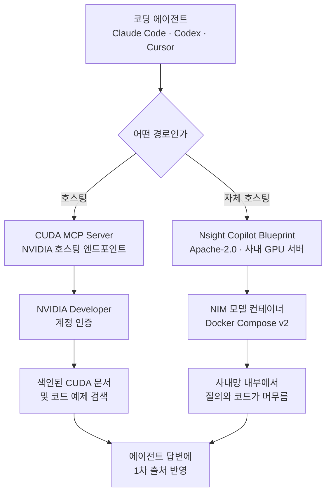

CUDA 커널을 손보다가 코딩 에이전트에게 물어보신 적이 있을 겁니다. 그리고 꽤 자주 틀린 답을 받으셨을 겁니다. 에이전트가 거짓말을 하는 것이 아니라, 학습 시점에 굳어 버린 CUDA 지식을 그대로 꺼내 놓기 때문입니다. API 시그니처가 바뀌었거나 권장 패턴이 달라졌어도 모델은 그 사실을 모릅니다. NVIDIA가 이 문제를 문서 쪽에서 풀기로 했습니다. 공식 CUDA 문서와 코드 예제를 색인해 MCP 서버로 열어 둔 [CUDA MCP Server](https://developer.nvidia.com/nsight-ai)입니다.

## 왜 읽어야 하나

이 글은 CUDA 코드를 다루면서 코딩 에이전트를 쓰는 엔지니어, 그리고 사내 개발 환경에 어떤 외부 MCP 서버를 허용할지 정해야 하는 플랫폼 담당자를 위해 썼습니다. 결론을 먼저 말씀드리겠습니다. 이 서버는 붙이는 비용이 명령 한 줄로 사실상 없다시피 하므로 개인 개발자라면 지금 붙이는 편이 낫지만, 조직 단위로는 그냥 붙이면 안 됩니다. NVIDIA Developer 계정 인증이 클라이언트마다 필요하고 질의 내용이 외부로 나가기 때문입니다. 그리고 NVIDIA는 그 사실을 숨기지 않고, 민감한 코드를 다루는 조직은 자체 호스팅 경로를 쓰라고 문서에 직접 적어 두었습니다. 그래서 이 글은 연결 방법과 함께 연결하면 안 되는 경우를 같이 다룹니다.


## 개요

CUDA는 이 문제가 유독 아프게 나타나는 영역입니다. 툴킷 릴리스가 자주 나오고, 아키텍처 세대가 바뀔 때마다 권장 패턴이 함께 바뀌며, 같은 코드가 세대에 따라 전혀 다른 성능을 내기 때문입니다. 게다가 잘못된 답이 조용히 통과합니다. 문법이 틀리면 컴파일러가 잡아 주지만, 낡은 권장 패턴을 따라 쓴 커널은 멀쩡히 컴파일되고 멀쩡히 실행되며 그저 느릴 뿐입니다. 프로파일러를 붙여 보기 전까지는 문제가 있다는 사실조차 드러나지 않습니다. 에이전트가 옛 지식으로 답할 때 가장 위험한 분야가 바로 이런 곳입니다.

코딩 에이전트의 지식 신선도 문제는 새롭지 않습니다. 지금까지의 해법은 대체로 두 가지였습니다. 하나는 에이전트에게 웹 검색을 붙여 주는 것이고, 다른 하나는 문서를 직접 벡터 데이터베이스에 넣어 사내 RAG를 만드는 것입니다. 앞의 방식은 검색 결과의 품질을 통제할 수 없어서 오래된 블로그 글이나 커뮤니티 오답을 그대로 물고 옵니다. 뒤의 방식은 품질은 통제되지만 색인을 직접 만들고 최신 상태로 유지해야 합니다. CUDA처럼 문서량이 많고 릴리스 주기가 빠른 영역에서는 이 유지 비용이 만만치 않습니다.

CUDA MCP Server는 세 번째 선택지입니다. 문서의 원저작자인 NVIDIA가 직접 색인을 만들어 관리하고, 그것을 MCP라는 표준 인터페이스로 열어 둡니다. 에이전트 입장에서는 검색 도구가 하나 늘어난 것이고, 사용자 입장에서는 색인 관리 부담이 사라진 것입니다. NVIDIA는 이 서버를 Nsight AI라는 우산 아래에 두었는데, 제품 페이지 설명에 따르면 Nsight AI는 기존 Nsight Copilot을 대체하는 개편된 브랜드입니다.

세 선택지를 같은 축으로 놓고 보면 성격 차이가 분명해집니다.

| 접근 | 색인 관리 주체 | 근거 품질 | 데이터 유출 면 |
|---|---|---|---|
| 웹 검색 붙이기 | 없음 | 통제 불가, 커뮤니티 오답 혼입 | 질의가 검색 엔진으로 |
| 사내 RAG 구축 | 우리 팀 | 통제 가능, 최신화 비용 큼 | 내부에 머무름 |
| 벤더 MCP 서버 | NVIDIA | 1차 출처, 최신화 위임 | 질의가 벤더로 |

정리하면 벤더 MCP는 사내 RAG의 유지 비용을 없애 주는 대신 질의 경로를 외부로 옮깁니다. 이 맞바꿈이 받아들일 만한지가 도입 판단의 전부이고, 답은 조직마다 다릅니다.

## 이 기술은 무엇인가

Nsight AI는 하나의 제품이 아니라 세 가지 진입점의 묶음입니다. 성격이 꽤 다르므로 구분해서 보는 편이 좋습니다.

첫째는 이 글의 주제인 **CUDA MCP Server**입니다. NVIDIA가 호스팅하며, 사용자는 엔드포인트 하나만 에이전트에 등록하면 됩니다. 서버는 색인된 CUDA 문서와 코드 예제에 대한 검색 도구를 제공하고, 에이전트는 CUDA 질문을 받으면 그 코퍼스를 검색해 답변에 반영합니다.

둘째는 **Nsight Copilot Blueprint**입니다. 자체 호스팅용 오픈소스 CUDA AI 백엔드이며, GPU 가속 시스템 위에 직접 올립니다. 호스팅 서비스를 쓸 수 없는 조직을 위한 경로입니다.

셋째는 **Nsight Compute 통합과 VS Code 확장**입니다. 프로파일러 안에서 대화형 가이드를 받는 쪽에 가깝습니다. 예를 들어 커널의 비합병 메모리 접근을 짚어 주고 개선 방향을 안내하는 식입니다.



두 경로의 갈림길은 성능이 아니라 데이터가 어디로 흐르는가입니다. NVIDIA도 FAQ에서 같은 기준을 제시합니다. 호스팅 서버는 NVIDIA가 큐레이션한 문서 접근을 제공하지만, 매우 민감하거나 독점적인 코드를 다루는 사용자는 자체 호스팅 Blueprint를 써서 데이터가 온프레미스에 머물도록 하라고 명시합니다. 벤더가 자기 호스팅 서비스의 적용 범위를 스스로 좁혀 적어 둔 문서는 흔치 않으므로, 이 문장은 그대로 신뢰하고 판단 기준으로 삼을 만합니다.


## 설치 및 통합

연결은 실제로 명령 한 줄입니다. 아래는 NVIDIA 제품 페이지가 클라이언트별로 안내하는 내용 그대로입니다.

Claude Code는 다음과 같이 등록합니다.

```bash
claude mcp add --scope user --transport http nvidia-cuda-docs \
  https://api.copilot.nsight.ngc.nvidia.com/mcp/cuda-docs
```

Codex는 전용 서브커맨드를 씁니다.

```bash
codex mcp add nvidia-cuda-docs \
  --url https://api.copilot.nsight.ngc.nvidia.com/mcp/cuda-docs
```

Cursor처럼 설정 파일에 직접 적는 클라이언트는 표준 `mcpServers` 블록을 씁니다.

```json
{
  "mcpServers": {
    "nvidia-cuda-docs": {
      "url": "https://api.copilot.nsight.ngc.nvidia.com/mcp/cuda-docs"
    }
  }
}
```

여기서 걸리기 쉬운 지점이 하나 있습니다. Antigravity는 같은 구조를 쓰지만 키 이름이 `url`이 아니라 `serverUrl`입니다.

```json
{
  "mcpServers": {
    "nvidia-cuda-docs": {
      "serverUrl": "https://api.copilot.nsight.ngc.nvidia.com/mcp/cuda-docs"
    }
  }
}
```

인증은 등록 시점이 아니라 첫 연결 시점에 발생합니다. NVIDIA Developer 계정으로 로그인하면 이후에는 클라이언트가 그 인증을 재사용합니다. 사람이 앉아 있는 데스크톱에서는 자연스러운 흐름이지만, 이 대화형 로그인 단계는 뒤에서 다룰 자동화 환경의 제약으로 이어집니다.

등록 자체가 됐는지는 클라이언트의 서버 목록으로 확인하시면 됩니다. Claude Code라면 `claude mcp list`로 `nvidia-cuda-docs` 항목이 잡히는지 보면 되고, 목록에 떴다고 해서 인증까지 끝난 것은 아니라는 점만 기억하시면 됩니다. 등록과 인증은 별개의 단계입니다.

`--scope`를 어떻게 줄지도 미리 정하시는 편이 좋습니다. NVIDIA 안내는 `--scope user`를 쓰는데, 이렇게 하면 그 머신의 모든 프로젝트에서 서버가 보입니다. 개인 노트북에서는 편하지만, 프로젝트마다 허용 커넥터가 다른 조직 환경에서는 전역 등록이 오히려 통제를 어렵게 만듭니다. 사내에서는 프로젝트 범위로 좁혀 등록하고 어떤 저장소에서 어떤 커넥터를 허용할지 명시적으로 관리하시길 권합니다.

자체 호스팅을 택한다면 요구 사항이 훨씬 무겁습니다. NVIDIA GPU 가속 시스템에 Ubuntu 22.04 이상, Docker Compose v2, NVIDIA Container Toolkit이 필요하고, 여유 디스크가 최소 200GB 있어야 합니다. 저장소는 [NVIDIA-AI-Blueprints/nsight-copilot](https://github.com/NVIDIA-AI-Blueprints/nsight-copilot)이며 Apache-2.0 라이선스입니다. GitHub API로 확인한 시점 기준으로 저장소는 2026년 2월 12일에 만들어졌고 마지막 푸시는 2026년 7월 19일이며 스타는 11개입니다. 별 수가 적다고 품질을 의심할 필요는 없습니다. 배포 대상이 GPU 서버를 갖춘 조직으로 한정되므로 애초에 스타가 모이는 종류의 저장소가 아닙니다. 다만 커뮤니티 검증이 얇다는 뜻이기는 하므로, 도입한다면 사내에서 직접 검증할 시간을 잡아 두시는 편이 좋습니다.

## 실제 실험 결과

엔드포인트가 실제로 살아 있는지 직접 확인했습니다. 공개된 엔드포인트에 평범한 GET 요청을 보낸 결과입니다.

```text
GET https://api.copilot.nsight.ngc.nvidia.com/mcp/cuda-docs
→ HTTP Error 405: Method Not Allowed
```

404가 아니라 405라는 점이 확인의 핵심입니다. 경로 자체는 존재하고 라우팅되고 있으며, 다만 GET 메서드를 받지 않는다는 뜻입니다. MCP의 스트리머블 HTTP 전송은 JSON-RPC를 POST로 실어 보내므로 이 응답은 정상 동작입니다. 브라우저로 열어 보고 페이지가 안 뜬다고 서버가 죽었다고 판단하지 않으셔도 됩니다.

여기서부터는 정직하게 적겠습니다. **전체 MCP 핸드셰이크는 이번 환경에서 완료하지 못했습니다.** 첫 연결에 NVIDIA Developer 계정 대화형 로그인이 필요한데 이 세션은 헤드리스라 그 단계를 통과할 수 없었습니다. 따라서 서버가 노출하는 정확한 도구 이름, 검색 응답의 형태, 질의 지연 시간은 이 글에서 수치로 제시하지 않겠습니다. 확인하지 않은 숫자를 적는 것보다 비워 두는 편이 낫습니다.

다만 이 실패 자체가 실무적으로는 결과입니다. 인증이 대화형이라는 사실은 CI 러너나 야간 배치 에이전트처럼 사람이 붙어 있지 않은 환경에서 이 서버를 쓰려 할 때 그대로 걸림돌이 됩니다. 개발자 노트북에서는 한 번 로그인하고 잊으면 되지만, 컨테이너가 매번 새로 뜨는 파이프라인에서는 자격 증명을 어떻게 넘길지 따로 설계해야 합니다. 도입 검토 시 데스크톱 시나리오만 보고 결정하지 않으시길 권합니다.

직접 평가하실 때 무엇을 재면 좋을지도 적어 두겠습니다. 첫째는 최신성입니다. 최근에 바뀐 API나 새로 나온 권장 패턴을 골라 물어보고, 붙이기 전과 후의 답이 달라지는지 봅니다. 달라지지 않는다면 색인이 여러분이 쓰는 CUDA 버전 대역을 덮지 못하는 것입니다. 둘째는 인용 정확도입니다. 답변이 근거로 든 문서 위치를 실제로 열어 내용이 맞는지 확인합니다. 검색이 붙었다고 해서 인용이 정확해지는 것은 아닙니다. 셋째는 응답 지연입니다. 문서 검색이 매 질문마다 왕복을 하나 추가하므로, 대화가 느려져서 결국 꺼 버리게 되는지를 며칠 써 보고 판단하시면 됩니다. 이 세 가지는 각자의 코드베이스와 CUDA 버전에 따라 결과가 달라지므로 남의 벤치마크로 대신할 수 없습니다.


## ThakiCloud 제품 적용 시사점

이 사례에서 ThakiCloud가 눈여겨보는 지점은 CUDA 지식 자체가 아니라 구조입니다.

**Paxis** 관점에서 보면 이것은 도메인 1차 출처를 MCP 커넥터로 표준화한 사례입니다. Paxis는 업무를 에이전트로 자동화하는 Enterprise Agent Platform이고, 그 안에서 스킬은 검색되어 격리 샌드박스에서 실행되며 모든 행동은 정책 게이트와 감사 로그를 통과합니다. 외부 MCP 커넥터는 이 구조에 붙는 지식 공급원이며, 그래서 판단 기준이 명확합니다. 커넥터가 늘어날수록 에이전트의 답변 근거는 좋아지지만 동시에 데이터가 나가는 출구도 늘어납니다. CUDA MCP Server처럼 벤더가 1차 출처를 직접 관리하는 커넥터는 근거 품질 면에서 매력적이므로, 어떤 워크로드에 허용하고 어떤 워크로드에 막을지 커넥터 단위로 정하는 정책이 필요합니다. 전부 허용하거나 전부 막는 이분법은 둘 다 손해입니다.

**Telox**와 **Velox** 관점에서는 GPU 위에서 도는 개발 보조 워크로드가 하나 더 생겼다는 의미입니다. Nsight Copilot Blueprint는 NIM 모델 컨테이너를 사내 GPU 시스템에 올리는 구조이고 디스크만 200GB 이상을 요구합니다. GPUaaS인 Telox나 베어메탈인 Velox 위에서는 이런 상시 개발 보조 백엔드가 학습이나 추론 워크로드와 GPU를 나눠 쓰게 되므로, 스케줄링과 격리를 처음부터 같이 설계하는 편이 낫습니다. 개발 편의를 위한 사이드카가 프로덕션 잡의 자원을 잠식하면 도입 효과가 상쇄됩니다.

**Aegis** 관점이 가장 직접적입니다. NVIDIA가 FAQ에서 민감한 코드는 자체 호스팅을 쓰라고 적은 그 문장이 곧 Aegis가 존재하는 이유입니다. 금융과 공공과 국방과 제조 고객은 커널 코드나 최적화 대상 워크로드 자체가 자산이며, 그 질의를 외부 엔드포인트로 보낼 수 없습니다. 온프레미스 폐쇄망에 같은 기능을 세우고 데이터 주권을 유지하는 것이 Aegis의 역할이고, 이번 Blueprint는 그 위에 얹을 수 있는 오픈소스 구성 요소가 하나 늘었다는 뜻입니다. 같은 워크로드를 호스팅 환경에서도 고객 폐쇄망에서도 동일하게 돌린다는 원칙이 여기서도 그대로 적용됩니다.

## 한계 및 반론

가장 큰 한계는 적용 범위입니다. 이 서버는 CUDA 문서 검색만 합니다. 커널을 프로파일링해 주지도, 성능 회귀를 잡아 주지도 않습니다. 문서를 잘못 읽어서 생기는 오류는 줄지만 알고리즘 설계나 메모리 접근 패턴에서 오는 문제는 그대로 남습니다. 에이전트가 CUDA를 이해하게 되는 것이 아니라 CUDA 문서를 정확히 인용하게 되는 것에 가깝습니다.

자체 호스팅이 만능 대안이라는 인식도 경계할 필요가 있습니다. Blueprint는 문서 색인만 올리는 가벼운 서비스가 아니라 NIM 모델 컨테이너를 포함한 백엔드이고, 제품 페이지는 하드웨어 호환성이 포함된 NIM 모델의 요구 사항에 따라 달라진다고 각주로 못박아 두었습니다. 다시 말해 200GB라는 디스크 숫자는 하한이고, 실제로 필요한 GPU 메모리와 연산량은 어떤 모델이 묶여 오느냐에 따라 바뀝니다. 온프레미스로 가면 데이터 주권은 얻지만 그 대가로 GPU 자원과 운영 인력을 계속 쓰게 됩니다. 호스팅 서비스가 공짜로 대신해 주던 모델 업데이트와 색인 갱신도 이제 우리 일이 됩니다. 데이터를 내보낼 수 없어서 자체 호스팅을 택하는 것은 타당하지만, 비용이 사라지는 것이 아니라 형태를 바꿔 우리 쪽으로 옮겨 온다는 점은 예산에 반영하셔야 합니다.

락인 관점의 반론도 가능합니다. 개발 워크플로 안쪽에 벤더 호스팅 엔드포인트를 두는 것은 의존성을 하나 늘리는 일입니다. 다만 이 반론은 MCP 구조 덕분에 상당 부분 완화됩니다. 커넥터는 설정 한 줄이므로 떼어 내는 비용도 붙이는 비용만큼 낮고, 같은 인터페이스로 자체 호스팅 백엔드를 대신 붙일 수 있습니다. 락인의 실질적 위험은 엔드포인트가 아니라 그 위에 쌓은 워크플로에 있으므로, 커넥터를 교체 가능한 부품으로 취급하는 설계를 유지하면 됩니다.

마지막으로 검증의 얇음을 지적해 둡니다. 이 글은 공식 제품 페이지와 저장소 메타데이터, 그리고 엔드포인트 응답 코드까지만 직접 확인했습니다. 검색 품질이 실제로 좋은지는 계정 인증을 붙여 CUDA 질문을 여러 개 던져 봐야 알 수 있고, 그 작업은 아직 하지 않았습니다. 도입을 결정하기 전에 각자의 실제 질문으로 확인해 보시길 권합니다.


## 정리

정리하면 이렇습니다. CUDA MCP Server는 코딩 에이전트의 CUDA 지식 신선도 문제를 문서의 원저작자가 직접 푸는 접근이고, 붙이는 비용이 명령 한 줄이라 개인 개발자에게는 판단이 쉽습니다. 지금 붙이시면 됩니다.

조직 단위 판단은 다릅니다. 서두에서 말씀드린 결론을 다시 가져오면, 이 서버는 그냥 붙이는 것이 아니라 커넥터 단위 정책과 함께 붙여야 합니다. 질의가 외부로 나가고 인증이 대화형이라는 두 가지 성질이 워크로드에 따라 결정적으로 달라지기 때문입니다. 민감한 코드를 다룬다면 NVIDIA 스스로 안내하는 대로 Apache-2.0 자체 호스팅 경로를 검토하시고, 그 경우 GPU와 디스크 요구 사항을 먼저 확인하시기 바랍니다.

다음 행동을 한 줄로 제안하면, 개인 노트북에는 오늘 붙여 보시고 사내 배포는 커넥터 허용 정책을 정한 뒤에 하시는 것입니다. 순서를 바꾸면 되돌리는 데 훨씬 큰 비용이 듭니다.


## 출처

- [NVIDIA Nsight AI 제품 페이지](https://developer.nvidia.com/nsight-ai)
- [NVIDIA-AI-Blueprints/nsight-copilot (Apache-2.0)](https://github.com/NVIDIA-AI-Blueprints/nsight-copilot)
- [NVIDIA HPC Developer 발표 게시물](https://x.com/NVIDIAHPCDev/status/2082144045107917084)
