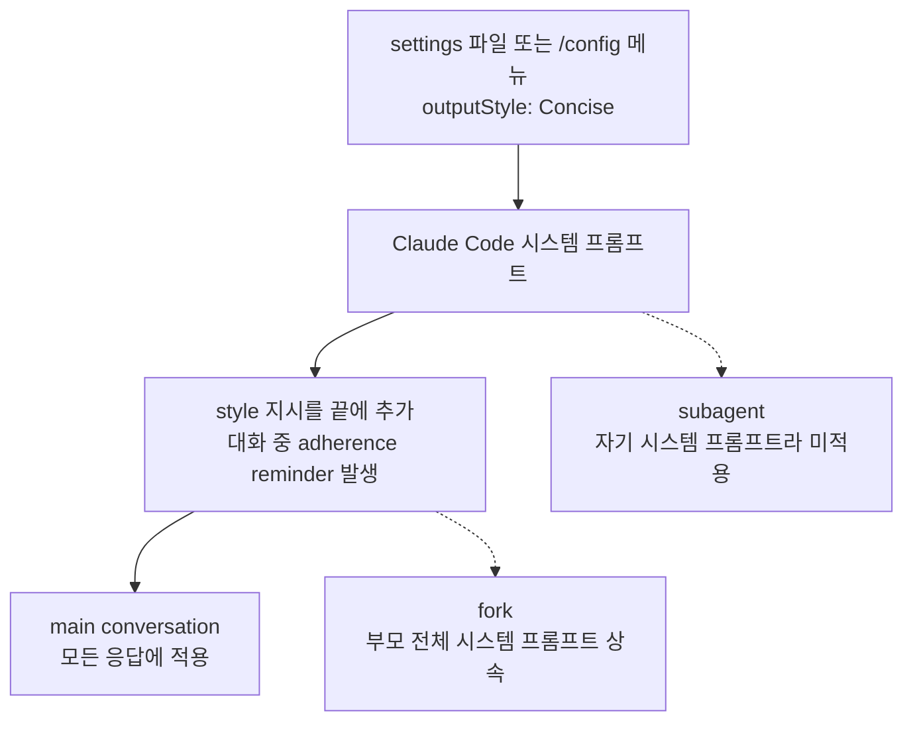

## 왜 읽어야 하나

Claude Code를 매일 쓰는 개발자, 혹은 그 위에 헤드리스 에이전트 루프를 올리는 엔지니어라면 이번 글이 "Concise를 켤 것인가, 그리고 어디까지 먹느냐"를 결정하는 자료입니다. 8월 20일 Claude Code v2.1.237이 내장 output style에 Concise를 추가했습니다. 핵심 결론을 먼저 드립니다. Concise는 응답 길이를 시스템 프롬프트 레벨에서 줄이는 첫 내장 기능이고, 그 설계에서 중요한 것은 "짧게"가 아니라 잘라내지 않는 선이 어디인가입니다. 에러 리포트, 보안 경고, 파괴적 작업 확인 문구는 통째로 유지됩니다. 그리고 main conversation에만 적용되고 subagent에는 적용되지 않기 때문에, 서브에이전트를 많이 띄우는 환경에서는 절약 효과가 계산에서 빠질 수 있습니다.

## 개요

Claude Code의 output style은 응답의 역할, 톤, 기본 포맷을 바꾸는 메커니즘입니다. 이번 릴리스 전까지 내장 style은 Default(기존 시스템 프롬프트), Proactive(즉시 실행, 일상 결정에서 멈추지 않고 합리적 가정으로 진행), Explanatory(작업 사이에 교육용 "Insights"를 제공), Learning(learn-by-doing 모드로 사용자가 직접 작은 코드 조각을 쓰도록 TODO(human) 마커를 삽입) 네 종류였습니다. Concise는 다섯 번째 내장 style으로, 응답 길이를 기본값에서 조절하는 최초의 내장 style입니다.

출시 발표는 @ClaudeDevs 계정에서 8월 20일에 나왔고, "결과부터 말하고, 응답은 짧게 유지하되, 더 자세히 물으면 전체를 준다"는 한 줄 요약이었습니다. 공식 문서는 Concise의 동작 계약, output style의 작동 메커니즘, 관련 기능들과의 차이를 명시하고 있습니다.

## Concise가 무엇을 하는가

문서의 정의를 그대로 따지면 Concise는 다음을 지시합니다.

- 결과가 먼저 나옵니다. 서론과 내레이션(preamble, narration)은 생략됩니다.
- 기본 응답 길이는 짧습니다. 다만 요청한 일은 Default style과 똑같이 빈틈없이 수행합니다.
- 설명이나 더 많은 디테일을 물으면 그때 전체로 답합니다. 짧기는 하지만 정보량이 줄어드는 것은 아닙니다.
- 안전 정보는 예외입니다. 에러 리포트, 보안 경고, 파괴적 작업에 대한 확인 문구는 내용을 통째로 유지합니다.
- Claude Code v2.1.237 이상만 지원됩니다.

마지막 예외 조항이 이 기능의 실용성을 결정합니다. "짧게"만 지시하면 모델은 에러 메시지나 경고도 줄일 유인이 있고, 그 순간 output style은 토큰 절약이 아니라 안전 정보를 잃는 도구가 됩니다. Concise는 잘라내는 대상(서론·내레이션)과 잘라내지 않는 대상(에러·보안·확인)을 명시적으로 분리해 두고, 대화 중 "더 자세히"라는 요청으로 언제든 전체 디테일로 복귀할 수 있게 합니다.

활성화 방법은 두 가지입니다. 터미널에서 `/config`를 실행해 Output style 메뉴에서 고르면 선택이 `.claude/settings.local.json`의 local project 레벨에 저장됩니다. 아니면 settings 파일에 `outputStyle` 필드를 직접 씁니다.

```json
{
  "outputStyle": "Concise"
}
```

문서가 명시하는 주의가 하나 있습니다. 설정은 바로 적용되지 않고, `/clear` 이후 또는 다음 세션 시작 시점에 발효됩니다. 또 과거의 독립 명령 `/output-style`은 v2.1.73에서 deprecated, v2.1.91에서 제거됐습니다. 지금은 `/config`가 유일한 메뉴 경로입니다.

## 어떻게 동작하는가

output style의 작동 메커니즘은 네 가지입니다.

1. 시스템 프롬프트를 직접 수정합니다. style의 커스텀 지시가 시스템 프롬프트 끝에 추가됩니다.
2. 대화 중 adherence reminder가 발생합니다. 모든 output style은 Claude가 지시를 따르도록 재확인 신호를 넣습니다.
3. 커스텀 style은 기본적으로 내장 소프트웨어 엔지니어링 지시(변경 범위 설정, 코멘트 작성, 작업 검증 등)를 제외합니다. 유지하려면 frontmatter의 `keep-coding-instructions`를 true로 둡니다. 내장 style에는 이 문제가 없는데, Concise는 "공백 없이 일을 수행한다"고 명시되어 있기 때문입니다.
4. 적용 범위는 main conversation입니다. subagent는 자기 시스템 프롬프트를 가지고 돌기 때문에 output style의 영향을 받지 않습니다. 예외는 fork인데, fork는 부모의 전체 시스템 프롬프트를 상속합니다.



이 구조가 "어디까지 먹느냐"의 답입니다. 하나의 대화 안에서 계속 코딩하고 리뷰를 받는 인터랙티브 세션에서는 모든 턴에 적용됩니다. 반면 서브에이전트를 스폰해서 탐색·구현·리뷰를 나누는 워크플로에서는 서브에이전트 응답이 Concise의 영향을 받지 않습니다.

### 토큰 사용량은 어디로 가나

문서는 토큰 영향도 명시합니다. 시스템 프롬프트에 지시를 추가하면 인풋 토큰이 늘지만, 프롬프트 캐싱 덕분에 세션의 첫 요청 이후에는 그 비용이 크게 줄어듭니다. 즉 output style의 인풋 쪽 비용은 세션당 거의 일회성이고, 차이가 나는 것은 아웃풋 쪽입니다. Explanatory와 Learning은 기본값보다 긴 응답을 의도적으로 만들어 아웃풋 토큰을 늘리고, Concise는 반대 방향입니다. 커스텀 style의 아웃풋은 지시가 무엇으로 답하게 하는가에 달려 있습니다.

## Concise, 아니면 다른 기능인가

Claude Code에는 Claude의 행동을 바꾸는 기능이 여러 개 있고, output style과 위치가 다릅니다. 문서의 비교 표를 정리하면 다음과 같습니다.

| 기능 | 작동 방식 | 언제 쓸 것인가 |
|---|---|---|
| Output styles | 시스템 프롬프트를 수정 | 매 턴마다 다른 역할, 톤, 기본 응답 포맷이 필요할 때 |
| CLAUDE.md | 시스템 프롬프트 뒤에 사용자 메시지를 추가 | 프로젝트 컨벤션과 코드베이스 맥락을 항상 알릴 때 |
| --append-system-prompt | 삭제 없이 시스템 프롬프트에 추가 | 한 번의 호출용 일회성 추가일 때 |
| Agents | subagent가 자기 시스템 프롬프트·모델·도구로 동작 | 집중 작업용 별도로 스코프된 헬퍼가 필요할 때 |
| Skills | 호출 시 또는 관련되면 지시 로드 | 재사용 워크플로가 있을 때 |

구분 기준은 "어디에, 어떤 스코프로, 얼마 동안"입니다. output style은 시스템 프롬프트 자체를 바꾸고 세션 전체에 적용됩니다. CLAUDE.md는 시스템 프롬프트를 건드리지 않고 그 뒤에 사용자 메시지를 얹고, 이 레포의 caveman-mode 룰 같은 말투 규칙 파일도 이 경로에 해당합니다. --append-system-prompt는 프로세스 한 번짜리이고, skills는 온디맨드입니다.

여기서 흥미로운 지점은, "짧게 답해라"는 지시를 CLAUDE.md나 rules 파일로 돌리면 매 세션 컨텍스트에 상주하는 텍스트가 하나 더 생기고, 그 효과가 모델 버전이나 다른 스타일 지시와 충돌하면 조정할 수단이 `/config` 하나뿐인 내장 style보다 넓지 않다는 것입니다. Concise는 이 지시를 제품 레벨로 끌어 올려, 안전 예외(에러·보안·확인)까지 공식 문서로 보증한 것입니다.

## 에이전트 루프에서 Concise의 위치

헤드리스 에이전트를 돌리는 관점에서 output style은 세 지점에서 의미를 가집니다.

**첫째, 아웃풋 토큰은 과금 단위입니다.** 서빙 엔진 관점에서 인풋은 캐시가 상당 부분을 흡수해도, 아웃풋은 매 토큰이 그대로 계산됩니다. 긴 세션에서 매 턴의 서론·내레이션이 쌓이면, 그 비용은 컨텍스트 길이와 함께 복리로 갑니다. Concise가 줄이는 것은 정확히 그 축입니다.

**둘째, 멀티 에이전트 구성에서는 효과가 계산에서 빠질 수 있습니다.** subagent가 자기 시스템 프롬프트로 돌기 때문에, 메인 세션만 Concise여도 서브에이전트 응답은 기본 길이가 유지됩니다. 서브에이전트가 산출물의 대부분을 차지하는 워크플로(탐색 fan-out, 구현 위임)에서는 "Concise를 켰다"의 실제 절감이 문서의 설명보다 작아집니다. fork가 부모를 상속하는 것은 이 예외 구조 안에서 드문 적용 경로입니다.

**셋째, 안전 정보 보존은 규제가 아니라 설계입니다.** 자동화 파이프라인에서 모델이 에러 리포트를 줄이면 디버깅이 어렵고, 보안 경고를 줄이면 게이트가 무너집니다. Concise가 "짧게"와 "통째로 유지"를 프롬프트 레벨에서 분리한 것은, 토큰 절약 기능에 안전 하한을 공식 문서로 박아 넣은 것입니다. 내부 에이전트 fleets를 돌리는 조직에서는 이 하한이 output style 선택의 1차 기준이 됩니다.

실제로 ThakiCloud의 내부 에이전트 fleets는 이번 릴리스 이전에 말투 규칙 파일(terse 응답을 강제하는 rules)로 같은 방향을 수동으로 돌렸습니다. 결과부터, 단어로, 장식은 삭제라는 지시를 CLAUDE.md 계열로 상주시킨 것입니다. 내장 Concise와 비교하면 차이가 명확합니다. 수동 rules는 매 세션 컨텍스트에 상주하고, 안전 예외를 모델이 지킬 것을 "부탁"하는 수준이고, 내장 style은 시스템 프롬프트 레벨에서 적용되며 안전 예외가 문서화되어 있습니다. 같은 목적을 제품 레벨로 가져간 것이 Concise이고, 조직이 자기 맥락에 맞춰 더 강한 제약을 원할 때는 rules 파일이 여전히 유효한 레이어입니다.

## ThakiCloud 제품 적용 시사점

Concise는 "응답 길이를 조절한다"는 작은 기능이지만, 두 제품 관점에서 각자 의미 있는 위치에 있습니다.

**Paxis 관점.** Paxis가 자동화하는 기업 워크플로의 경제성은 결국 토큰 단가에 걸립니다. 에이전트가 매 턴 서론과 내레이션을 붙이면, 그 비용은 워크플로 단위가 아니라 토큰 단위로 청구됩니다. output style이 "안전 정보는 잘라내지 않는다"는 하한을 공식화한 것은, 에이전트 운영에서 "절약"과 "신뢰"를 한 설정 값으로 분리해서 다룰 수 있다는 뜻입니다. Paxis의 워크플로 오케스트레이션 관점에서, 서브에이전트 미적용 한계도 같은 이야기입니다. 절감의 적용 범위는 에이전트 구조를 아는 사람만 계산할 수 있고, 그 구조를 가시적으로 다루는 것이 Paxis의 역할입니다.

**ai-platform(Metis) 관점.** Metis가 서빙하는 토큰에서 아웃풋 토큰은 캐싱으로 흡수되지 않는 순수 과금 축입니다. Explanatory·Learning이 아웃풋을 늘리고, Concise가 줄인다는 것은, 같은 모델이 같은 입력을 받아도 output style에 따라 단위 요청의 과금 토큰이 달라진다는 뜻입니다. 서빙 관점에서 output style은 모델 선택과 동급의 비용 변수로 올라올 수 있습니다. 저비용 서빙이 에이전트 워크플로의 경제성을 만드는 구조에서, 응답 길이 조절 레이어가 공식화된 것은 그 구조의 한 변수가 더 관리 가능해졌다는 신호입니다.

## 한계 및 반론

- **subagent 미적용.** 가장 큰 실용 한계입니다. 문서가 명시하듯 output style은 main conversation 전용이고, 서브에이전트 밀도가 높은 워크플로에서는 "Concise를 켰다"가 실제 절감으로 전환되지 않습니다. 이 한계가 해소되기 전까지 멀티 에이전트 토큰 예산 계산에는 서브 응답 길이를 별개로 잡아야 합니다.
- **프롬프트 레벨 제어에 그칩니다.** Concise가 "짧게"를 보증하는 방식은 지시입니다. 하드 리밋이 아니라 모델의 준수를 전제로 하므로, 지시를 무시하거나 부분적으로만 따르는 턴이 나타날 수 있습니다. 토큰 예산을 수치로 고정해야 하는 파이프라인에는 output style만으로는 부족하고, max_tokens 계열의 하드 상한이 별도 레이어로 필요합니다.
- **정량 절감 수치가 공개되지 않았습니다.** 문서와 changelog는 방향(아웃풋을 줄인다)만 명시하고, Concise 전환 전후의 토큰 절감률을 숫자로 발표하지 않았습니다. "얼마나 줄어드는가"는 조직의 워크로드에서 직접 재야 하는 값입니다.
- **커스텀 style의 함정.** output style 메커니즘 자체를 커스텀으로 쓸 때, 기본 동작이 내장 엔지니어링 지시를 삭제하는 것입니다(`keep-coding-instructions` 기본 false). "간단하게 답하는 style"을 커스텀으로 만들면 품질 관련 지시까지 함께 빠질 수 있고, 이 함정은 내장 Concise에는 해당하지 않습니다.
- **`/clear` 발효 지연.** 설정 변경이 세션 중간이 아니라 `/clear` 또는 다음 세션에 발효되는 것은, 배포 스크립트에서 output style을 전환한 뒤 바로 효과를 기대하는 패턴에서 예상 밖의 결과를 만듭니다.

## 정리

Concise는 output style이라는 메커니즘이 "응답 길이"라는 첫 내장 케이스를 얻은 릴리스입니다. 읽어야 할 핵심은 세 가지입니다.

첫째, 잘라내는 선이 명시되어 있습니다. 서론과 내레이션은 줄이고, 에러 리포트·보안 경고·파괴적 작업 확인은 통째로 유지하며, "더 자세히" 요청에 전체로 복귀합니다. 둘째, 적용 범위는 main conversation입니다. subagent는 제외되고 fork는 상속합니다. 멀티 에이전트 환경에서는 이 범위를 알고 계산해야 합니다. 셋째, 위치가 CLAUDE.md와 skills 사이에 있습니다. 매 턴 시스템 프롬프트 레벨이지만, 프로젝트 컨벤션 텍스트가 아니기 때문에 컨텍스트 상주 비용과 충돌 관리에서 유리합니다.

실무 takeaway는 단순합니다. Claude Code v2.1.237 이상이라면 `/config`에서 Output style을 Concise로 바꿔 `/clear` 후 한 세션 써 보십시오. 응답이 짧아졌고 에러와 경보는 그대로인지, 그 한 세션이 내 워크로드에 맞는지를 몸으로 확인하는 것이 이 기능의 올바른 도입 방식입니다. 서브에이전트를 많이 띄운다면, 메인 세션의 절감만 보고 전체 예산을 계산하지 말 것. 그것이 이번 릴리스가 남긴 가장 실용적인 교훈입니다.

## 출처

- [Claude Code changelog v2.1.237](https://github.com/anthropics/claude-code/blob/main/CHANGELOG.md) (built-in "Concise" output style 추가)
- [Claude Code 공식 문서: Output styles](https://code.claude.com/docs/en/output-styles) (동작 메커니즘, 토큰 사용, 관련 기능 비교)
- 발표 트윗: [@ClaudeDevs](https://x.com/ClaudeDevs/status/2090245922685063634) (8월 20일)