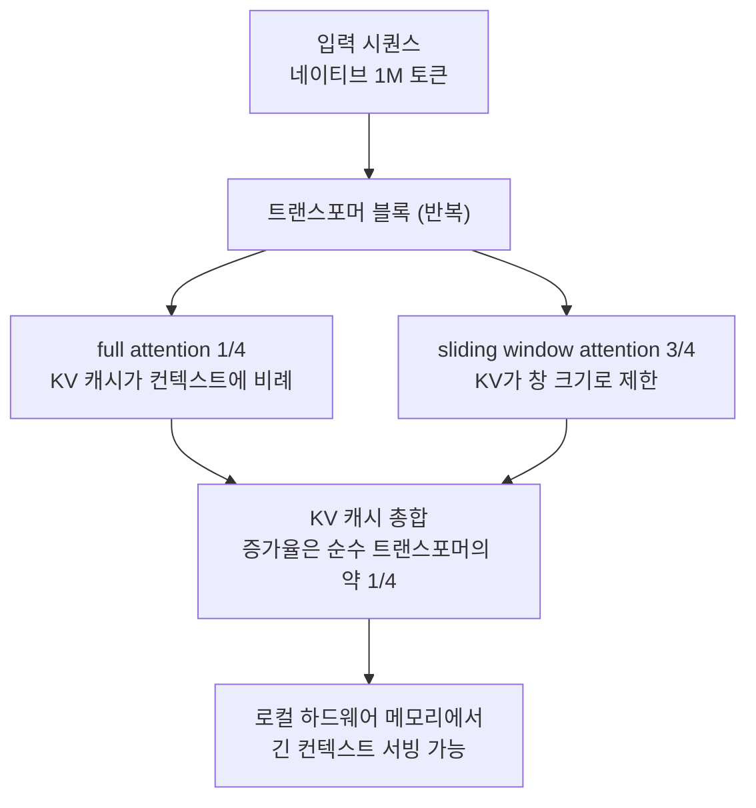

## 왜 읽어야 하나

클러스터나 데이터센터 없이 CPU와 단일 GPU로 로컬 인퍼런스 경로를 고르는 개발자를 위한 글입니다. 결론부터 말하면 Spark-X2.5는 4B 파라미터와 100만 토큰 네이티브 컨텍스트의 조합이 더 이상 "돌긴 하는데 쓸모가 없는" 타협이 아님을 보여주었고, 이 조합을 가능하게 한 구조가 컨텍스트에 비례해 자라는 KV 캐시 층을 4분의 1로 줄인 하이브리드 어텐션입니다. 오프라인 환경이나 소비자 머신에 무엇을 돌릴지 결정하는 분이라면, 이 모델의 명세와 라이선스, 그리고 로컬 생태계에서 차지하는 위치를 후보 목록에 올릴 가치가 있습니다.

## 무슨 일이 있었나

iFlytek의 모델 팀 XHToken이 2026년 9월 1일경 Spark-X2.5-4B와 Spark-X2.5-1.7B 두 모델을 오픈소스로 공개했습니다(공식 레포지토리 [XHToken/Spark-X2.5](https://github.com/XHToken/Spark-X2.5)). 라이선스는 Apache 2.0으로 상업 이용에 매출 문턱이 없습니다. 9월 7일에는 공식 계정 @SparkLLM이 "Spark-X2.5 now runs locally"라는 제목으로 실제 Windows CPU 실행 데모를 올렸고, 공식 GGUF 패키지와 llama.cpp 지원이 함께 화제가 됐습니다. 데모의 내용은 GPU 없는 Windows 머신에서 커뮤니티 GGUF를 받아 로컬 API로 사용하는 것입니다.

통상의 소형 모델 릴리스와 차별되는 지점은 컨텍스트입니다. 100만 토큰 네이티브 컨텍스트는 기존 모델을 롱 컨텍스트 학습으로 늘린 외삽 값이 아니라, 모델이 처음부터 주장하는 수치입니다. 아래에서 보는 어텐션 구조가 그 수치를 지탱합니다.

## 이 기술은 무엇인가

Spark-X2.5는 MoE가 아니라 하이브리드 어텐션을 단 dense 모델입니다. 각 트랜스포머 블록 안의 어텐션 층 4개 중 1개가 full attention이고 나머지 3개가 sliding window attention입니다. full attention의 KV 캐시는 컨텍스트가 길어질수록 선형으로 자랍니다. sliding window attention은 창(window) 크기 안의 KV만 유지하므로, 시퀀스가 아무리 길어져도 그 층의 메모리는 고정됩니다.



"컨텍스트에 따라 자라는" 층의 비율을 4분의 1로 제한하는 것이 이 구조의 본질입니다. 같은 깊이의 순수 트랜스포머라면 모든 층의 KV가 컨텍스트와 함께 자라지만, Spark-X2.5에서는 full attention 층만 자랍니다. 4B급 모델에서 이것이 의미하는 것은 100만 토큰급 시퀀스의 KV가 소비자 GPU 한 장에 들어갈 것인가, CPU 메모리 영역으로 흘러갈 것인가의 문제입니다.

아키텍처 이름은 Spark2_5ForCausalLM이며, 토크나이저와 추론 인터페이스는 표준 CausalLM 형태를 따릅니다. 1.7B 버전은 같은 구조에 더 얕은 깊이입니다.

## 설치 및 통합

실행 경로는 두 개입니다. 공식 GGUF와 llama.cpp 포크 경로, 그리고 커뮤니티 프리빌드 패키지 경로. 현재 시점에서 메인라인 llama.cpp에는 Spark2_5 아키텍처가 아직 들어오지 않았습니다. 지원은 대기 중인 풀 리퀘스트(ggml-org/llama.cpp #27868) 형태로 진행 중이라, 머지 전까지 XHToken이 함께 제공한 포크를 쓰는 것이 공식 경로입니다.

GGUF는 커뮤니티 리포지토리가 4B 퀀트를 여러 수준으로 올리고 있습니다. Q4_K_M과 Q8_0가 대표적입니다.

```bash
pip install -U "huggingface_hub[cli]"
hf download stornic56/Spark-X2.5-4B-GGUF --include "Spark-X2.5-4B-Q4_K_M.gguf" --local-dir ./
```

llama.cpp 빌드는 포크(또는 메인라인에 #27868을 적용한 트리)를 받아 CMake로 수행합니다. GPU가 있으면 CUDA 옵션을, 없으면 CPU로.

```bash
git clone <XHToken이 제공한 llama.cpp 포크> llama.cpp
cmake -B build -DLLAMA_CUDA=OFF
cmake --build build -j --config Release
```

서버는 llama-server로 띄우고, OpenAI 호환 인터페이스로 접속합니다.

```bash
./build/bin/llama-server -m Spark-X2.5-4B-Q4_K_M.gguf -ngl 0
```

`-ngl 0`은 GPU 오프로딩 없이 CPU에서 돌리는 설정으로, Windows 데모에서 보여준 경로와 동일합니다. 커뮤니티 리포지토리 gasschina/Spark-X2.5-4B-build-cpp는 Colab T4를 위해 CUDA 바이너리를 미리 빌드해 두고 로컬 API 시작 스크립트까지 묶어 주므로, 빠르게 확인하고 싶다면 이 경로가 가장 빠릅니다.

## 데모와 벤치마크 결과

아래 수치는 iFlytek의 공식 발표와 커뮤니티 패키지 기준이며, 저희가 재측정한 값이 아닙니다. 독립 재현 전까지 상대 비교의 기준선으로 읽어야 할 숫자 집합입니다.

| 영역 | 벤치마크 | 4B 점수 |
|---|---|---|
| 에이전트 | MCP-Atlas | 54.6 |
| 에이전트 | τ³-bench | 30.4 |
| 에이전트 | BrowseComp | 40.9 |
| 코딩 | SWE-Bench Multilingual | 53.3 |
| 코딩 | SWE-Bench Verified | 41.6 |
| 코딩 | SWE-Bench Pro | 44.4 |
| 수학 | AIME 2026 | 90.7 |
| 수학 | HMMT Feb 2026 | 81.2 |
| 지식 | GPQA | 67.4 |

4B급이라는 점을 감안하면 SWE-Bench Verified 41.6과 GPQA 67.4는 직전 세대 8~12B급과 크게 차이나지 않는 수치입니다. 로컬 실행이라는 포지션에서 가장 눈이 가는 숫자는 에이전트 점수입니다. MCP-Atlas 54.6은 도구를 실제로 붙여 쓰는 워크로드에서 나온 값이고, 로컬 모델의 쓰임새가 정답 생성이 아니라 에이전트 루프의 실행 체라는 점에서 이 축의 점수가 조합의 성패를 가릅니다.

메모리 사용량은 하이브리드 어텐션 구조가 숫자로 번역되는 지점입니다. 4B 가중치는 9GB 안팎에서 로드되지만, KV 캐시는 별개의 축입니다. SGLang 기준 측정에 따르면 컨텍스트 캡을 65k로 잡으면 KV에 41GB가량을 추가로 얹는다고 보고됩니다. "1M 네이티브"가 "1M이 9GB에 들어간다"는 뜻은 아니라는 이야기입니다. 실제로 쓸 컨텍스트 길이에 따라 서빙 메모리를 따로 계산하는 값이 KV입니다.

## 로컬에서 이 조합이 중요한 이유

로컬 실행의 가치는 속도가 아니라 주권입니다. 오프라인 환경, 데이터 주권 요구, 토큰당 과금의 경제학. 이런 상황에서는 세상에서 가장 좋은 모델이 아니라 "그 일에 충분한 모델이 내 하드웨어에서 도는가"가 질문입니다. 그 질문에 답하는 축은 세 가지, 파라미터 수와 라이선스와 생태계입니다.

Spark-X2.5는 이 세 축에서 깔끔한 위치에 놓입니다. Apache 2.0은 매출 문턱 없는 자유 라이선스이고, 4B급은 16GB급 소비자 GPU나 CPU에 메모리 조합으로 들어갑니다. GGUF와 llama.cpp은 로컬에서 가장 넓은 도달력을 가진 배포 경로입니다. 여기에 하이브리드 어텐션이 "1M 컨텍스트"를 더했는데, 이 항목은 이전까지는 데이터센터급 메모리가 전제였던 값이었습니다.

Windows CPU 데모도 이 축에서 의미가 있습니다. 가장 빠른 경로는 아니지만, 가장 인프라가 없는 경로입니다. GPU도, 컨테이너도, 계정도 없이 받아서 빌드해서 돌리는 것. iFlytek이라는 팀이 클라우드 GPU 인퍼런스로 알려져 온 상황에서 이 경로를 공식 노선으로 대우하는 것 자체가, 로컬 시장의 무게중심이 "어떤 OS든 어떤 하드웨어든" 쪽으로 움직이고 있다는 신호로 읽힙니다.

## ThakiCloud 제품 적용 시사점

ThakiCloud 플랫폼 관점에서는 두 지점이 있습니다.

첫째, KV 경제 구조는 데이터센터 서빙 비용을 가르는 변수와 같은 것입니다. 저희가 Metis 서버리스 엔드포인트 튜닝에서 확인한 것처럼 서빙 쪽 노브(torch compile, max-num-seqs)가 단일 스트림 처리량을 18.8배 바꿨지만, 그 위에 결정적인 변수는 모델의 KV 캐시 크기였습니다. 배치 천장을 소유하는 자원이라서요. Spark-X2.5는 운영 노브가 아니라 아키텍처로 KV 증가율 자체를 낮추는 구조를 보여 줍니다. 1M 컨텍스트급 워크로드의 엔드포인트 선정과 가격 모델에서, 파라미터 수와 나란히 "토큰당 KV 증가율"을 1급 명세로 넣어야 하는 시점이라는 것입니다.

둘째, 로컬 실행은 에이전트 경제학의 최하위 티어입니다. Paxis 워크로드에서 에이전트의 긴 컨텍스트와 메모리는 작업의 길이에 따라 누적되는 비용입니다. 4B가 1M 컨텍스트를 Apache 2.0과 함께 고객 하드웨어 위에서 도는 조합은, 에이전트 작업 중 "긴 컨텍스트의 일상 업무"를 담당하는 저비용 티어의 후보입니다. 일상 워크로드는 로컬 소형 모델이, 고가치 판단은 대형 모델이 가져가는 분업이 성립하면 에이전트 파이프라인 전체의 단위 경제가 바뀝니다. GGUF와 llama.cpp의 이동성이 그 티어가 온프레미스(Aegis)와 폐쇄망 환경에 들어가는 조건입니다.

## 한계 및 반론

첫째는 구조적 전제입니다. 로컬 실행을 가능하게 하는 llama.cpp 지원이 메인라인이 아니라 포크와 대기 중인 PR 형태라는 것. 머지(merge) 전까지 빌드 재생산성과 업스트림 bug fix가 포크에 의존하고, 커뮤니티 퀀트 패키지도 출처가 제각각입니다. 프로덕션으로 가져가려면 의존성 관리 단계에서 확인해야 할 조건입니다.

둘째, 벤치마크는 벤더 자보고입니다. τ³-bench에서 AIME 2026까지의 점수 집합은 공식 발표 기준이며, 로컬 서빙에서의 속도, 메모리, 퀀트 이후 품질은 독립적으로 검증되지 않았습니다. 특히 Q4_K_M급 퀀트는 품질 손실이 없다는 보장이 없고, 도구 호출에 의존하는 에이전트 워크로드에서 퀀트 이후 점수 하락이 "로컬에서 쓸 만하다"를 가른다면, 그것은 공식 벤치마크가 아니라 자기 워크로드로 재측정한 숫자로 답해야 할 질문입니다.

셋째, 1M 컨텍스트는 네이티브 학습 값이고 서빙 KV는 별개 축이라는 것입니다. SGLang 측정에서 65k에 41GB가 얹어진다는 보고가 그 증거입니다. 실제로 롱 컨텍스트를 쓰려면 컨텍스트 캡 설정에 따라 어떤 메모리 클래스에 떨어지는지 확인하는 계산이 필요합니다.

## 정리

Spark-X2.5가 던진 메시지는 "로컬 실행이 컨텍스트를 포기하는 것이라던 시대가 끝났다"는 것입니다. KV 증가를 4분의 1로 제한하는 하이브리드 어텐션으로 4B 모델이 1M 네이티브 컨텍스트를 갖고, Apache 2.0과 GGUF로 가장 넓은 로컬 배포 경로 위에 올라 있습니다. 로컬 경로를 고르는 입장이라면, 자기 하드웨어에서 Q4_K_M을 먼저 돌려 속도와 품질을 자기 워크로드로 재보는 실험부터 시작할 것을 권합니다. 1M 컨텍스트가 로컬에서 가치가 있는지 여부는 공식 벤치마크가 아니라 그 실험의 숫자가 답합니다.

이 글의 수치는 iFlytek 공식 발표와 @SparkLLM 계정의 커뮤니티 데모 기준이며, ThakiCloud가 재측정한 값은 아닙니다.
