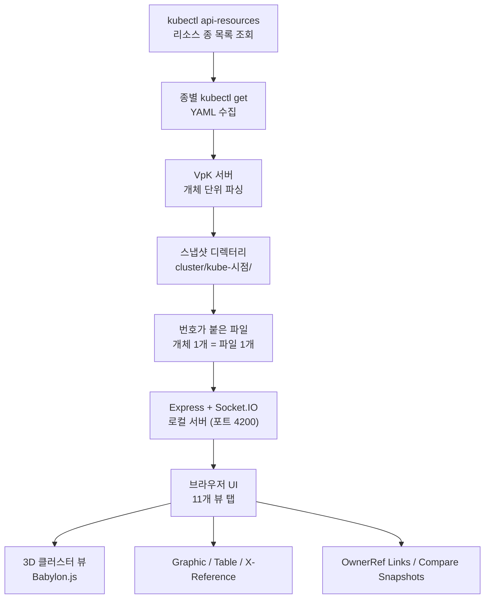

## 왜 읽어야 하나

클러스터에 지금 무엇이 돌고 있는지, K8s를 모르는 사람(투자자, 고객, 신규 입사자)에게 3초 안에 보여줘야 하는 개발자나 플랫폼 운영자라면 이 글을 읽어야 합니다. 대시보드 숫자나 `kubectl get` 표를 던지는 대신, 클러스터를 실제 데이터센터 랙처럼 3D 형태로 보여주는 오픈소스 도구 VpK를 실습 기록으로 정리했습니다.

핵심 결론을 먼저 말합니다. VpK의 본질은 "실시간 모니터링"이 아니라 "그 순간의 사진"입니다. kubectl로 클러스터 리소스 50종을 찍고 그 사진만 파싱해 브라우저에서 11가지 단면으로 본다는 설계 때문에 프로덕션에도 읽기 전용으로 안전하며 Docker 볼륨 하나면 오프라인에서 그대로 돌아갑니다. 이 글은 그 설계를 직접 설치·실행하며 검증한 결과입니다.


*서버 랙과 그 위에 떠다니는 트랜스퍼런트 큐브. VpK가 클러스터를 보여주는 방식의 개념 형상화.*

## 개요

2026년 9월 9일, 상하이 독립개발자 Viking(@vikingmute)의 트윗이 커뮤니티를 달궜습니다. "오늘 본 것 중 가장 아름다운 사이트"라는 제목에 첨부된 것은 kubernetes3d.com 의 /rack 페이지. Kubernetes 클러스터를 물리적인 서버 랙 형태로 3D 렌더링하는 사이트였습니다. 트윗은 같은 클러스터를 front, back, side 세 개의 면으로 나눠 보여준다는 점, 그리고 실제 조작이 가능하다는 점에서 "eye candy"가 아니라 "도구"라고 평가했습니다.

VpK(Visual parsed Kubernetes)는 그 사이트의 원본 오픈소스 프로젝트입니다. GitHub의 k8debug/vpk 리포지토리가 공식 소스이며, 라이선스는 MIT. Node.js 서버와 브라우저 클라이언트로 구성되고 DockerHub의 k8debug/vpk 컨테이너로도 배포됩니다. K8Debug는 Kubernetes 관련 기술 콘텐츠를 오래 다뤄 온 개발자 브랜드로, VpK는 "Kubernetes가 정의한 것을 이해하는 데 도움이 되고자 만들어졌다"는README에서 말하는 자기소개처럼 학습·설계·설명용 도구입니다.

관측 도구(Grafana, Headlamp 계열)와의 차이를 한 단어로 잡으면 "사진"이라고 할 수 있습니다. VpK는 라이브 클러스터를 계속 지켜보지 않습니다. kubectl로 한 장면을 찍고(스냅샷), 그 사진 파일을 분석해 화면에 올립니다. README는 이 지점을 분명히 합니다. kubectl get 출력으로 리소스별 파일을 만들고 나면 "이 시점에서 VpK는 더 이상 K8 인스턴스와 통신하지 않는다"는 것입니다.

## 이 도구는 무엇인가

VpK의 내부 흐름은 단순합니다. 서버는 먼저 kubectl api-resources로 클러스터가 알고 있는 리소스 종(kind) 목록을 가져옵니다. 그리고 그 종마다 kubectl get을 실행해 YAML 출력을 받고 개체(object) 단위로 파싱해 순번이 붙은 파일로 저장합니다. 저장 위치는 cluster/ 디렉터리 아래, 스냅샷 시점이 이름이 되는 하위 디렉터리(예: kube-2026-09-10-13h-50m-13s)입니다.



UI는 탭 11개로 구성됩니다. Overview, Cluster(3D), Schematics, Graphic View, Storage, Security, Table View, X-Reference, OwnerRef Links, Compare Snapshots 그리고 타임라인 계열 뷰. 각각은 "같은 클러스터의 다른 단면"입니다. 트윗이 front/back/side라고 표현한 것이 바로 이 원리죠.

3D 클러스터 뷰(Cluster 탭)는 Babylon.js로 렌더링합니다. 실제 코드(vpkCluster3D.js, 2,269줄)를 보면 노드는 큐브, 포드는 작은 큐브, 컨트롤 플레인은 원호(arc), 엔드포인트 연결은 튜브(CreateTube)로 그려집니다. Graphic View 탭은 자원 종과 개체 이름의 계층 트리(Hierarchy)와 서클 팩(Circle Pack)을, Table View는 namespace/kind/name 컬럼의 정렬 가능한 표를 제공합니다.

X-Reference 탭은 vpkconfig.json 의 xrefRules가 소유하는 기능입니다. 이 실험에서 확인된 규칙은 Pod의 env와 볼륨이 참조하는 ConfigMap·Secret, ServiceAccount의 secrets·imagePullSecrets, Route의 host입니다. "이 Pod이 실제로 어떤 시크릿을 쓰나"를 물어보는 순간 링크를 그려주는 기능으로, 운영 데이터 시각화에서 가장 자주 막히는 질문을 직접 답변합니다.

OwnerRef Links 탭은 소유자 참조(ownerReference)를 따라 Deployment에서 ReplicaSet, ReplicaSet에서 Pod으로 이어지는 소유 구조를 보여줍니다. Compare Snapshots 탭은 스냅샷 두 장을 받아 차이가 났는지 비교합니다. 스냅샷이 시점 단위 디렉터리가 되기 때문에, 이 기능을 쓰면 "1시간 전에 무엇이 달라졌나"를 타임랩스처럼 재생할 수 있습니다.

클러스터 연결은 provider 개념으로 추상화되어 있습니다. vpkconfig.json에는 Existing kubectl connection(usekubeconn), oc, minikube, microk8s, IBM IKS, CRC, OKD 계열까지 9종의 provider가 정의되어 있고 각 provider는 getCmd·authCmd·stopCmd와 인증 파라미터를 포함합니다. kubectl이 아니라 oc나 microk8s kubectl로 클러스터에 가는 환경도 그대로 지원하는 이유입니다.

## 설치 및 통합

설치는 Node.js와 npm만 있으면 됩니다. 실험에 실제 사용한 명령은 다음과 같습니다.

```bash
# 소스 획득
git clone https://github.com/k8debug/vpk.git
cd vpk

# 의존성 설치 (package.json: v5.0.0, express + socket.io + ejs)
npm install

# 서버 기동 (기본 포트 4200)
npm start
# 실행 시 서버 로그
#   Visual parsed Kubernetes  Version: 5.2.0  Server Port: 4200
#   vpkMNL105 - Vpk running locally
```

브라우저에서 http://127.0.0.1:4200 을 열면 UI가 뜹니다. 상단의 provider 선택("Select option")에서 Existing kubectl connection을 고르면, 서버가 현재 kubeconfig의 컨텍스트를 대상으로 kubectl api-resources부터 스냅샷을 시작합니다. 실험에서는 minikube 컨텍스트(v1.32.0)를 사용했습니다.

Docker 방식도 제공됩니다. k8debug/vpk 컨테이너는 웹 애플리케이션을 4200 포트에서 제공하고 스냅샷 디렉터리를 볼륨으로 마운트합니다.

```bash
docker run -v /data/snapshot:/vpk/cluster -p 4200:4200 k8debug/vpk
```

이 방식의 핵심은 -v 옵션 하나입니다. 스냅샷 디렉터리만 넣으면 VpK는 그 사진만으로 모든 뷰를 렌더링합니다. kubectl도, 클러스터 API 서버도, 네트워크도 불필요합니다. 오프라인 문서화, 투자자 데모, 보안 감사 자료처럼 "그날의 클러스터"를 고정해서 보여줘야 하는 경우를 위한 설계입니다. 스냅샷 자체는 k8debug/snapshot 라는 같은 계정의 별도 도구로도 만들 수 있습니다.

## 실제 실험 결과

실험 환경은 Apple Silicon MacBook(darwin arm64)의 minikube 클러스터, kubernetes v1.32.0, docker 드라이버(CPU 4개, 메모리 7.5GB)입니다. 워크로드로는 kube-system 기본 컴포넌트(kube-proxy, coreDNS, etcd 등)에 demo-web·demo-api 두 데플로이먼트(nginx, 각 2레플리카)와 demo-web 서비스를 추가해 총 4개의 유저 포드를 넣었습니다.

VpK 서버를 기동한 뒤 브라우저 대신 Socket.IO 클라이언트 스크립트로 UI의 실제 이벤트 흐름을 직접 구동했습니다. connectK8 이벤트 하나를 보내면 서버가 kubectl 스냅샷 사이클을 돌리는데 getKStatus 이벤트가 "Processed count 1 of 50"부터 "Processed count 50 of 50 - Resource kind: volumeattachments"까지 진행을 알립니다. 즉, 이 minikube 클러스터가 kubectl로 인식하는 리소스 종은 50개였고 VpK는 그 50종을 전부 조회·파싱했습니다.

스냅샷 결과, 첫 번째 스냅샷 디렉터리(kube-2026-09-10-13h-34m-12s)에는 315개의 번호가 붙은 YAML 파일이 생겼습니다. 워크로드 4개를 추가한 뒤 두 번째 스냅샷(kube-2026-09-10-13h-50m-13s)을 만들자 파일은 352개로 늘었습니다. 파일 하나당 Kubernetes 개체 하나. Pod, Deployment, Service, ConfigMap, Secret, Role, RoleBinding, EndpointSlice 등이 개체 단위로 나뉘어 저장되는 구조를 숫자로 확인할 수 있습니다. 서버 로그의 타임스탬프로 보면 스냅샷 사이클 시작(22:50:18)부터 클라이언트의 디렉터리 조회(22:51:51)까지 약 100초, 50종 전체 조회에 걸린 실제 시간입니다.

3D 뷰(Cluster 탭)는 SwiftShader 소프트웨어 WebGL로 헤드리스 렌더링까지 확인했습니다. 아래 스크린샷은 실제 minikube 클러스터의 스냅샷을 VpK가 3D로 그린 것입니다. 중앙의 갈색 큐브가 노드, 그 위의 초록 큐브들이 포드, 보라 원호가 컨트롤 플레인, 세로 선들이 엔드포인트 연결입니다.


*Cluster 탭 3D 뷰. 노드·포드·컨트롤 플레인을 Babylon.js로 렌더링한 실제 실험 결과.*

흥미로운 점은 브라우저 없이도 전체 흐름이 돌았다는 것입니다. VpK의 UI는 Express + Socket.IO 구조라 클라이언트 스크립트가 connectK8, clusterDir, schematic 같은 이벤트를 보내면 서버가 getKStatus(진행), clusterDirResult(스냅샷 디렉터리), schematicResult(파싱 데이터)로 답변합니다. 실험은 이 이벤트 3개만으로 스냅샷 생성부터 뷰 데이터 회수까지 끝냈고 3D 스크린샷은 헤드리스 브라우저(소프트웨어 WebGL)가 Cluster 탭을 열고 "Refresh 3D View"를 눌러 찍은 것입니다. 사람 대신 이벤트 시퀀스가 UI를 돌린다는 점에서, 이 도구는 에이전트가 직접 쓸 수 있는 구조라고 평가할 만합니다.

Graphic View 탭은 같은 스냅샷을 계층 트리와 서클 팩으로 보여줍니다. 왼쪽 트리에서 Event, Pod, ReplicaSet, Role, Secret, ServiceAccount, Service, Deployment, Endpoint, EndpointSlice 등 자원 종이 개체 이름으로 펼쳐지고 오른쪽 서클 팩은 같은 데이터를 밀도 형태로 압축합니다. "같은 데이터를 두 가지 형태로"라는 말은 11개 뷰 탭 전체가 공유하는 원리입니다.


*Graphic View 탭. 같은 스냅샷을 Hierarchy(트리)와 Circle Pack(서클)으로 동시에 렌더링.*

정직하게 한계를 붙입니다. minikube는 1노드라 3D 씬이 드뭅니다. 트윗이 "가장 아름다운"이라고 말한 kubernetes3d.com 의 rack 페이지(다중 노드 랙, front/back/side)는 멀티노드 클러스터에서 비로소 제 모습을 보입니다. 실제 GPU 클러스터(멀티노드) 대상 실행은 네트워크 환경(VPN)이 갖춰진 다음 세션의 일로 남겨둡니다.

## ThakiCloud 제품 적용 시사점

ai-platform(Metis) 관점에서 VpK는 "클러스터를 설명하는 3초"를 만드는 도구입니다. Metis의 데모나 투자자 브리핑에서 "클러스터에 무엇이 돌고 있는지"를 보여줄 때 대시보드 30장을 넘기는 것보다 스냅샷 1장을 3D로 여는 쪽이 상태 전달이 빠릅니다. 특히 스냅샷 기반 읽기 전용 설계는 프로덕션 클러스터에 대한 부담이 없다는 점에서 데모 클러스터(B200/H200 계열)를 "그날의 상태로 고정"해 자료에 담는 용도에 바로 맞습니다. MIT 라이선스라 도입 비용이 0이고 Docker 볼륨 마운트 하나면 폐쇄망에서도 돌아갑니다. 온프레미스·소버린 배포(Telox, Aegis 이야기)에서 "클러스터 상태를 문서화하는 방법"이라는 주제와 자연스럽게 이어집니다.

Paxis 관점에서는 front/back/side 원리가 의미 있습니다. 같은 클러스터 상태가 뷰에 따라 전혀 다른 형태로 읽히는 것. 3D는 물리적 단면, Table은 자원 단면, X-Reference는 참조 관계 단면, Compare는 시간 단면입니다. "하나의 상태를 여러 단면으로"라는 이 원리는 Paxis의 운영 UX에서 에이전트 실행 상태를 보는 방식(스케줄 단면, 비용 단면, 감사 단면)과 같은 계열입니다. 단, VpK는 학습·설명 도구이지 실시간 관측 도구가 아니라는 점을 위치에서 분명히 해야 합니다. 운영 모니터링은 Grafana 계열이 여전히 정본이고 VpK는 그 데이터를 "사람에게 보여주는" 층의 도구입니다.

## 한계 및 반론

가장 큰 한계는 "사진"이라는 본질이 만들어냅니다. 라이브 모니터링이 목적이면 VpK는 답이 아닙니다. 스냅샷을 다시 찍을 때까진 화면이 그대로고 변화는 Compare 탭에서 "지난 사진과 지금 사진의 차이"로만 보입니다. 두 번째, UI는 탭 11개에 표·트리·3D가 섞여 있어 처음에는 어색합니다. "eye candy"라는 평가는 rack 페이지의 멀티노드 렌더링에서 완성되고 로컬 UI의 3D 뷰는 정보의 밀도에서 먼저 옵니다.

세 번째는 보안입니다. xrefNames에 secrets가 포함되는 만큼, 스냅샷 디렉터리에는 클러스터의 Secret YAML이 그대로 들어갑니다. 스냅샷은 "kubectl로 볼 수 있는 것의 사진"이라는 뜻입니다. 프로덕션 자격증명으로 스냅샷을 만들었다면 그 디렉터리의 취급은 자격증명 파일과 같은 등급으로, Docker 볼륨 마운트 경로와 공유 권한을 의식해야 합니다. 네 번째, 50종이라는 숫자는 kubectl api-resources가 인식하는 종의 개수입니다. 클러스터마다, 그리고 admission·CRD 구성에 따라 이 숫자는 달라집니다. 다섯 번째, 3D 뷰의 헤드리스 검증은 소프트웨어 WebGL(SwiftShader)로 했습니다. GPU 가속 환경의 실사용 렌더링 품질과는 별개입니다.

반론도 들어볼 필요가 있습니다. "kubectl explain이나 Headlamp로 충분하지 않나"라는 질문에는 목적이 다르다로 답합니다. VpK는 조작 가능한 3D 공간과 스냅샷 비교, xref 자동 링크를 "설명용 산출물"로 만들어주는 도구이고 실시간 콘솔이 아닙니다. "그날의 클러스터를 나중에, 사람에게, 보여줘야 할 때"라는 조건이 붙으면 Headlamp로 할 수 없는 일이 됩니다.

## 정리

클러스터를 설명해야 할 때 대시보드 숫자가 아니라 사진부터 만드세요. VpK는 kubectl로 50종의 리소스를 찍고 개체 352개를 번호가 붙은 파일로 나눈 뒤, 그 사진만으로 11개 단면을 브라우저에서 보여주는 도구입니다. 읽기 전용·오프라인·MIT 라이선스라는 세 조건이 프로덕션에도 안전하고 폐쇄망에도 들어가게 합니다.

다음 행동은 하나입니다. kubectl 접근이 있는 데모 클러스터에서 git clone, npm install, npm start를 10분 안에 끝내고 첫 스냅샷을 3D로 여세요. 그 3초가 곧 당신의 첫 설명 자료입니다. 그리고 "같은 상태를 여러 단면으로"라는 VpK의 원리를 운영 데이터 시각화(클러스터든, 에이전트 실행이든)에 옮겨 쓰는 것. 그것이 이 실험이 남긴 전부입니다.

## 출처

- VpK GitHub: https://github.com/k8debug/vpk (MIT, K8Debug)
- 공식 데모 (rack 페이지): https://kubernetes3d.com/rack
- 원문 트윗: https://x.com/hjguyhan/status/2098019711086919723 (@vikingmute, 2026-09-09)
- 스냅샷 도구: https://github.com/k8debug/snapshot
- 본문의 모든 수치(50종, 315/352 파일, 약 100초, v1.32.0, 포트 4200, Version 5.2.0)는 2026-09-10 MacBook(minikube docker driver)에서 직접 재현한 실험 로그를 기반으로 합니다.
