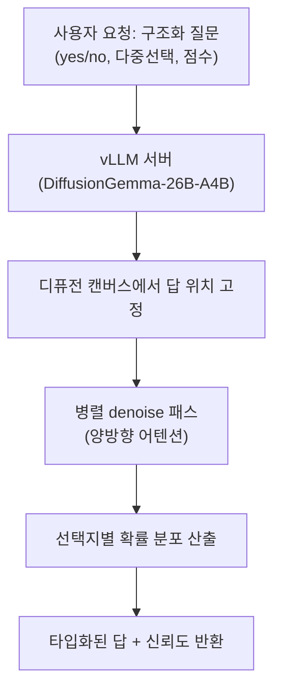

*글의 핵심 개념을 형상화했습니다.*

## 왜 읽어야 하나

이 글은 LLM 서빙을 담당하고 vLLM을 돌리는 플랫폼 엔지니어와 개발자를 향해 씁니다. 끝까지 읽으면 디퓨전 LLM이 무엇인지, 그동안 우리가 쓰는 오토레거시 LLM과 어디가 다른지, 그리고 상업용 전용 모델이었던 'System-1 결정 API'를 오픈웨이트로 self-host할 수 있는지 여부를 알게 됩니다.

결론을 먼저 단정하겠습니다. vLLM은 이제 구글의 디퓨전 LLM인 DiffusionGemma를 네이티브로 서빙하고 그 위의 structured-reads(Jev 유사) 모드로 TypeSafe의 상업용 System-1 결정 모델 Jev의 기능을 오픈웨이트에서 재현할 수 있습니다. yes/no, 다중선택, 점수화 질문에는 타입화된 답과 선택지별 신뢰도를 하나의 병렬 디퓨전 패스로 계산해 냅니다.

*글의 핵심 개념을 형상화했습니다: 노이즈로 덮인 토큰 캔버스가 병렬로 denoise되며 고정된 답칸에 확률 분포로 수렴하는 과정.*

## 개요

이 글은 세 가지를 순서대로 다룹니다. 먼저 디퓨전 LLM이 무엇이고 오토레거시 LLM과 무엇이 다른지. 다음으로 vLLM이 DiffusionGemma를 어떻게 지원하고 structured-reads 모드가 그 위에 무엇을 추가하는지. 마지막으로 vLLM 기반 추론을 서빙하는 ThakiCloud에 이 일이 어떤 의미인지입니다.

## 디퓨전 LLM이란

지금까지 주류 LLM은 오토레거스였습니다. 토큰을 하나씩 순서대로 만들고 매 스테프에서 그전까지 만든 토큰을 보고 다음 토큰을 예측합니다. 이 구조 때문에 생성 길이가 곧 지연 시간과 직결됩니다. 구조화된 출력을 얻으려면 모델이 JSON을 직접 쓰게 하고 나중에 파싱하는 방식, 혹은 constrained decoding 같은 장치를 뒤에 붙였습니다.

디퓨전 LLM은 다른 접근입니다. 문장을 순서대로 '이어 쓰는' 대신, 처음에 노이즈로 덮인 토큰 캔버스 전체를 놓고 그 캔버스를 반복적으로 정리(denoise)해 갑니다. 한 스테프에 한 토큰만 추가하지 않고 캔버스의 토큰 위치를 병렬로 함께 다듬습니다. 어텐션이 양방향(bidirectional)이라 왼쪽·오른쪽 모두를 볼 수 있어, 모델은 '과거만' 보며 움직이지 않습니다. 생성은 왼쪽에서 오른쪽으로 이어가기보다, 전체가 동시에 해소되어 가는 과정입니다.

이 설계가 속도 주장의 근거입니다. 가이드에 인용되는 벤치마크는 스테프마다 256개 토큰을 병렬로 다루고 단일 H100에서 초당 1000개 토큰 수준이라는 수치를 봅니다. [추정] 이 수치를 우리는 독립적으로 검증하지 못했지만, 병렬 denoising 구조 자체가 오토레거시 디코딩이 안 닿는 처리량 대역을 노린다는 점은 구조에서 읽을 수 있습니다.

## DiffusionGemma란

DiffusionGemma는 구글이 오픈웨이트로 낸 텍스트 디퓨전 LLM입니다. 파라미터는 약 260억(MoE, Mixture of Experts) 구조이고 체크포인트 이름은 `diffusiongemma-26B-A4B-it`입니다. Gemma 백본 위에 서 있고 비전 타워를 통해 텍스트·이미지·비디오 입력을 함께 다룹니다.

핵심은 연구 커뮤니티의 실험 단계를 지나 서빙 플랫폼이 직접 지원하는 모델이 됐다는 점입니다. vLLM이 DiffusionGemma를 네이티브로 추가했고 디퓨전 LLM이 vLLM에 직접 통합된 것은 이것이 처음입니다. 구글 팀과 함께한 작업입니다. vLLM 문서에서는 단일 Gemma4 백본을 두 모드로 돌린다고 설명합니다. causal attention으로 KV 캐시를 쓰는 인코더 모드, 그리고 그 인코더 KV를 bidirectional attention으로 읽는 디코더 모드. YOCO에 가까운 형태입니다.

즉, 우리가 이미 프로덕션에서 쓰는 LLM 서빙 엔진이 디퓨전 모델의 낯선 디코딩 구조(양방향 어텐션, 반복 정제, 블록 기반 생성)를 배우고 실행하게 되었습니다. 디퓨전 LLM이 '특별 케이스로 따로 돌리는 것'에서 '서빙 플랫폼이 지원하는 모델 클래스'로 격상된 것입니다.

## Jev란, structured-reads란

이제 'Jev' 쪽을 봅니다. Jev는 TypeSafe AI의 System-1 결정 모델입니다. System 1이란, 느리고 숙고하는 System 2와 대비해 빠르고 직관적인 결정을 뜻하는 용어입니다. Jev는 산문을 쓰지 않습니다. 판단·분류·라우팅·점수화만 하고 끝입니다. 프로그램의 상태와 타입화된 질문을 주면, 확률을 담은 타입화된 답을 반환합니다. 그 확률은 실제 정답률에 보정(calibrate)되어 있다는 것이 핵심입니다.

TypeSafe의 Jev는 상업용·전용 모델이고 API로 접근하며 RLCD로 학습했습니다. 자체 마케팅은 지연을 수십~수백 ms 대에 두고 일반 LLM 방식보다 훨씬 빠르고 싸다고 강조합니다.

vLLM의 신규 structured-reads 모드(Jev 유사. vLLM PR #57250, `siliconflow/vllm-structured-reads`)는 DiffusionGemma 위에서 이런 능력을 오픈 패치로 재현합니다. 메커니즘은 이렇습니다. 먼저 디퓨전 캔버스에서 답 토큰이 들어갈 위치를 고정합니다. 다음에 구조화된 질문(yes/no, 선택지가 있는 다중선택, 순서가 있는 레벨로 점수화)을 시스템 프롬프트에 담습니다. 그리고 DiffusionGemma가 그 고정된 칸을 단일 병렬 디퓨전 패스로 채우며 선택지별 확률 분포를 산출합니다.

즉, 모델로 "예" 또는 "아니오"라는 문구를 써서 파싱하는 대신, 하나의 포워드 패스에서 답이 어느 선택지인지와 그 확신이 얼마인지 계산해 냅니다. 패치는 vLLM 0.29.0 기반의 순수 파이썬 오버레이에 재생성 스크립트이고 HTTP shape을 동일하게 내므로, TypeSafe API를 부르지 않고 self-host할 수 있습니다.

패치 작성자는 상업용 Jev와 DiffusionGemma-as-Jev의 라이브 비교를 돌렸고 DiffusionGemma 쪽이 유리하며, Jev가 반드시 빠른 것도 아니라고(API 대 DGX Spark) 주장합니다. 이것은 작성자 자기보고이므로 검증된 결론이라기보다 주장으로 읽어야 합니다.

*structured-reads(Jev 유사)의 데이터 흐름. 문장 생성 후 파싱 대신, 단일 병렬 패스에서 답과 확신을 함께 계산합니다.*

## ThakiCloud 제품 적용 시사점

ThakiCloud의 ai-platform은 vLLM을 핵심 서빙 엔진으로 모델을 서빙합니다. 이 관점에서 디퓨전 LLM과 structured-reads는 '남의 기능'이 아니라 우리가 이미 돌리는 서빙 위에 얹히는 새로운 능력 축입니다.

첫째, 서빙 능력입니다. vLLM이 지금까지 오토레거시 모델에 특화되어 있었다면, 디퓨전 모델을 네이티브로 지원하는 순간 고객에게 새로운 모델 클래스를 제공할 수 있습니다. structured-reads(타입화된 결정 + 신뢰도 서빙)는 '텍스트를 반환한다'를 넘어 '결정을 반환한다'는 능력입니다. 출력을 소비하는 쪽이 소프트웨어인 사용법에 가치가 있습니다.

둘째, 경제성입니다. 상업 전용 모델이던 System-1 결정 API를 오픈웨이트로 재현해 self-host할 수 있다는 것은 비용과 주권의 변화를 의미합니다. 폐쇄망·데이터 주권 요건 때문에 데이터를 밖으로 못 내보내는 고객에게, 같은 shape의 결정 API를 자기 환경에서 돌릴 수 있다는 것은 실질 차별점입니다.

Paxis 관점에서도 같습니다. 에이전트 하네스는 빠른 결정을 많이 합니다. 라우팅·분류·점수화·정책 체크. 타입화된 답과 신뢰도를 되돌려 주는 System-1 결정이 바로 에이전트 오케스트레이션이 소비하고 싶은 형태입니다. ai-platform에서 저비용·저지연의 구조화 결정 서빙이 가능하면, Paxis 에이전트 루프의 실행 경제성을 올리는 인프라가 됩니다.

## 한계 및 반론

첫째, 자기보고 벤치마크입니다. DiffusionGemma-as-Jev가 상업용 Jev와 동급이거나 더 낫다는 주장은 패치 작성자가 한 것입니다. 독립 벤치마크가 아직 없습니다. 상업용 Jev는 RLCD로 결정 작업에 특화해 학습한 모델이고 DiffusionGemma-as-Jev는 일반 디퓨전 모델 위에 구조를 올린 패치입니다. 실제 정밀도가 두 모델 사이에서 얼마나 갈지는 열린 질문입니다.

둘째, 디퓨전이 항상 더 빠른 것은 아닙니다. 병렬 denoising은 답 공간이 고정된 구조화 출력(yes/no, 다중선택, 점수)에서 유리합니다. 긴 자유 텍스트 생성에서는 잘 튜닝된 오토레거시 엔진을 이긴다고 단정할 수 없습니다. '빠르다'는 명성을 모든 생성에 확장하면 안 됩니다.

셋째, structured-reads는 답 공간을 고정합니다. 질문에서 정의한 선택지 안에서만 고릅니다. '새로운 답을 만들어 내는' 작업에는 맞지 않습니다. 진짜 개방형 생성이 필요한 태스크에는 여전히 기존 경로가 맞습니다.

넷째, 하드웨어·메모리 수치(약 18GB VRAM, 처리량)는 2차 가이드에서 온 것이라 독립 검증이 안 된 값입니다. 프로덕션 배포 전에는 자기 환경에서 재측정이 필요합니다.

## 정리

디퓨전 LLM은 연구계의 특이점이 아닙니다. vLLM이 DiffusionGemma를 네이티브로 지원하면서 서빙 플랫폼이 돌릴 수 있는 모델 클래스가 되었습니다. 그 위의 structured-reads(Jev 유사 모드)는 상업 전용 모델이던 System-1 결정 API를 오픈웨이트로 재현해 self-host할 수 있다는 데모입니다. yes/no, 다중선택, 점수화와 선택지별 신뢰도를 하나의 병렬 패스로 계산해 냅니다.

플랫폼 엔지니어에게는 다음 행동이 단순합니다. 소프트웨어가 결정을 소비하는 사용법(라우팅, 분류, 점수화, 정책 체크)이 있다면 자기 환경에서 DiffusionGemma structured-reads 모드를 올려 상업용 Jev API와 비용·정밀도를 재는 것이 좋습니다. 그 수치는 자기 측정에서 나와야지, 작성자 주장을 그대로 받아들이면 안 됩니다.

ThakiCloud에게는, 이미 돌리는 vLLM 서빙 위의 새로운 능력 축이자 Paxis 에이전트 루프의 실행 경제성을 올리는 인프라입니다.

## 출처

- vLLM 문서 · structured reads: https://docs.vllm.ai/en/latest/examples/features/structured_diffusion/
- vLLM 발표 · DiffusionGemma: https://vllm-project.github.io/2026-06-10/diffusion-gemma.html
- 오픈 패치 (PR #57250): https://github.com/siliconflow/vllm-structured-reads
- Google DeepMind · DiffusionGemma: https://deepmind.google/models/gemma/diffusiongemma/
- TypeSafe AI · Introducing System One Models & Jev: https://typesafe.ai/blog/introducing-system-one-models-and-jev
- explainx.ai · DiffusionGemma as Jev: https://explainx.ai/blog/diffusiongemma-jev-vllm-open-source-2026
