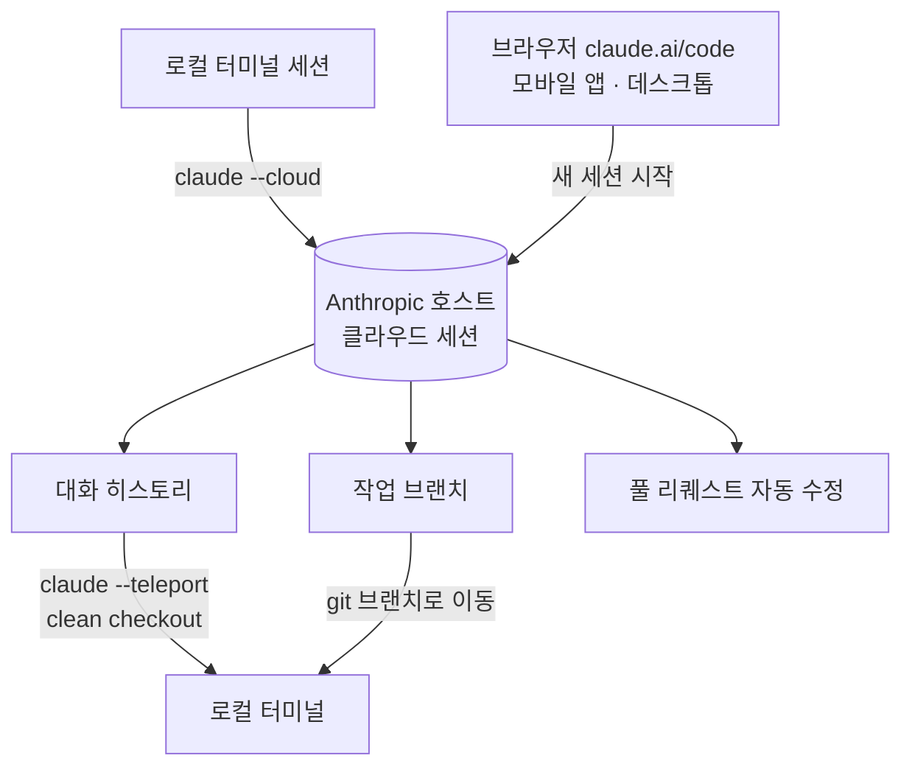

## 왜 읽어야 하나

코딩 에이전트를 매일 쓰거나, 생산 환경에서 에이전트 워크로드를 운영하는 엔지니어라면 이 글을 읽어야 합니다. 결론을 먼저 한 문장으로 잡습니다. 클라우드 세션의 정식 출시는 '세션'을 그 세션을 시작한 머신보다 오래 사는 단위로 만들었고 로컬과 클라우드 사이를 오가는 핸드오프는 1방향(클라우드에서 로컬로)이고 비용 모델은 플랜 단위로 뭉쳐 있습니다. 이 셋이 에이전트 플랫폼 설계의 참고 형태가 됐다는 것이 오늘의 핵심입니다.

*세션이 로컬 머신과 클라우드 인프라 사이를 오가는 모습을 형상화했습니다.*

## 개요

Claude Code는 터미널 퍼스트 도구입니다. 세션은 로컬 프로세스였고, 터미널이 열려 있는 동안에만 존재했습니다. 그 위에 'Claude Code on the web'이 연구 프리뷰로 시작됐는데, 9월 23~24일경(보도에 따르면) 클라우드 세션이 연구 프리뷰를 벗어났습니다. 노트북을 닫아도 Claude Code가 계속 일한다는 것이 공식 메시지입니다.

이 출시는 바로 전 주에 나온 발표와 잇닿아 있습니다. 9월 17일 베타로 나온 재설계된 Claude Code Projects는 하나의 대화로 여러 병렬 클라우드 세션을 조율하는 '조율자' 구조였는데, [지난 글](/tech-blog/ko/agentops/claude-code-projects-parallel-agent-threads/)에서 그 병렬 세션과 shared memory 구조를 분석했습니다. Projects가 '세션을 여러 개 띄우는 법'을 정한 직후, 클라우드 세션 GA가 '그 세션이 어디에 있고 어떻게 이동하는지'를 정했습니다. 두 발표를 합쳐 읽으면 Anthropic이 코딩 에이전트의 실행 환경에 대한 전체 그림이 보입니다.

## 클라우드 세션은 무엇인가

클라우드 세션은 Anthropic이 호스트하는 인프라 위에서 도는 Claude Code 세션입니다. 사용자의 머신과 물리적으로 분리돼 있고, 세션의 상태인 대화 히스토리와 작업 중이던 브랜치가 그 인프라 위에 상주합니다. ClaudeDevs의 발표 톤대로 말하면 "laptop을 닫아도 Claude Code가 계속 일한다"는 것입니다.

진입 지점은 네 곳입니다. 브라우저의 claude.ai/code, Claude 모바일 앱의 Code 탭, 데스크톱 앱, 그리고 터미널. 첫 세 곳은 새 클라우드 세션을 시작하는 곳이고 터미널은 기존 로컬 세션을 클라우드로 올리는 통로입니다.

여기서 중요한 구분은 '원격 제어'와 '세션 이동'입니다. 화면만 원격으로 보는 것이 아니라, 세션이라는 것 자체가 이동합니다. 대화 컨텍스트, 히스토리, 작업 브랜치가 묶여서 다른 실행 환경으로 옮겨가는 것입니다. 발표된 구조에서 세션은 더 이상 프로세스가 아니라, 상태와 실행 환경을 가진 워크로드에 가깝습니다.

## 사용법: --cloud와 --teleport

명령은 두 개로 압축됩니다.

로컬 세션을 클라우드에 올리기는 터미널에서 `claude --cloud`입니다. 현재 세션의 상태를 Anthropic 인프라로 넘기고, 이후 작업을 브라우저나 모바일에서 이어받는 흐름입니다.

클라우드 세션을 로컬로 데려오기는 `claude --teleport`입니다. 같은 저장소의 깨끗한 체크아웃(clean checkout) 상태에서 실행하면, 클라우드 세션의 작업 브랜치와 전체 대화 히스토리를 로컬 터미널로 가져옵니다. 조건이 하나 있습니다. 로컬 체크아웃이 클라우드 세션이 일하던 저장소와 일치해야 한다는 것입니다. 브랜치와 히스토리가 git 기반이라 이 조건이 성립해야 손바꿈이 완성됩니다.

세션 진행 중에 움직이는 방법도 보고됩니다. v2.1.0부터 인세션 슬래시 명령 `/teleport`(축약 `/tp`)로 로컬 터미널과 웹 인터페이스 사이를 옮긴다는 것이 복수의 서드파티 보고서에 나옵니다. 공식 문서에는 문서화된 두 명령(--cloud, --teleport)과 함께, 클라우드 세션이 풀 리퀘스트의 자동 수정까지 수행한다고 명시돼 있습니다.

플랜 커버리지는 Pro, Max, Team, Enterprise까지입니다. Enterprise는 프리미엄 시트 또는 Chat + Claude Code 시트가 조건입니다. 즉 개인 플랜에서 시작해 팀과 엔터프라이즈로 그대로 확장되는 구조로 정리가 됐습니다.

GA와 함께 일회성 크레딧도 발표됐습니다. 기존 구독자에게 Pro는 100달러, Max는 250달러 크레딧을 주고 10월 7일까지 사용하도록 한 것입니다(보도 기준). 정식 출시의 온보딩 장치가 크레딧인 셈입니다.

실무 시나리오를 하나 그려봅니다. 아침에 브라우저에서 '로그 회전 버그를 찾아 PR을 올려라'는 작업을 클라우드 세션에 맡깁니다. 출근길에 모바일 앱에서 진행 상황을 확인하고 한 줄 지시를 추가합니다. 사무실에 도착하면 로컬 터미널에서 `claude --teleport`로 세션을 내려받고, 로컬 도구(디버거, 프로파일러)와 붙여서 디테일 작업을 이어갑니다. 세션이 머신을 세 번 옮겨가면서 대화 컨텍스트는 한 곳에서도 끊기지 않습니다. 이 흐름이 성립하는 조건은 위에서 본 것들입니다. clean checkout, 1방향 텔레포트, 플랜 한도.

## GA가 바꾼 것

연구 프리뷰 단계와 비교해서 바뀐 것은 세 가지입니다.

첫째, 유효 기간과 안정성의 약속이 달라집니다. 프리뷰는 '사용해 보시오'였고, 정식 출시는 '이것이 서비스다'입니다. 세션의 영속성, 핸드오프의 동작, 플랜 커버리지가 이제 제품 계약의 일부가 됩니다.

둘째, 비용 모델이 플랜 단위로 확정됐습니다. 클라우드 세션을 돌리는 인프라 비용이 토큰 단가처럼 세분화돼 청구되는 것이 아니라, Pro/Max/Team/Enterprise 플랜 안에서 소모되는 구조입니다. 사용자가 체감하는 비용은 '이 세션이 내 플랜 한도의 얼마를 썼나'가 됩니다.

셋째, 팀과 엔터프라이즈까지 범위가 확장됐습니다. 개인 생산성 도구를 넘어, 팀 단위 코딩 에이전트 워크로드로의 도어가 열린 것입니다. Projects의 병렬 세션과 결합하면, 조율자 한 명이 여러 클라우드 세션을 돌리는 구조가 팀 인프라 위에서 돌아갑니다.

## ThakiCloud 제품 적용 시사점

**Paxis 렌즈.** Paxis는 에이전트 실행을 일급 리소스로 다루는 제어 평면입니다. 스킬, 도구, 정책, 감사 로그가 개별 관리되는 객체로 올라오는 구조죠. 클라우드 세션 GA는 '세션'이라는 객체가 한 단계 더 올라왔다는 신호입니다. 세션이 머신에서 독립되고, 상태(히스토리, 브랜치)를 가진 워크로드가 되며 플랜이라는 비용 단위와 연결됩니다. Paxis 관점에서 세 가지가 대응됩니다.

첫째, 세션은 워크로드입니다. 다키클라우드의 내부 플랫폼에서는 코딩 에이전트가 헤드리스로 상시 가동됩니다. launchd 러너 함대가 매일 정해진 시각에 실험, 리포트, 배포 태스크를 수행하는 것이 그것이고, 그 러너가 부르는 엔진은 사내 모델입니다. 클라우드 세션이 Anthropic 인프라에서 '세션 = 상주 워크로드'를 제품화한 것이라면, 그 형태는 이미 다키클라우드 안에서 운영 패턴으로 존재합니다. 차이점이 있으면 그것은 소유 구조일 뿐입니다. 누구의 인프라에서, 어떤 엔진으로 돌리느냐.

둘째, 핸드오프는 상태 이전 계약입니다. `--teleport`가 clean checkout이라는 조건 아래에서 브랜치와 히스토리를 옮기는 것은, 플랫폼 관점에서 '세션 상태의 이전 프로토콜'을 공개한 것입니다. 상태의 저장소(git 브랜치, 대화 로그), 이전 조건(일치하는 체크아웃), 이전 방향(클라우드에서 로컬)이 명시적으로 정의됐습니다. 에이전트 플랫폼이 세션 이동 기능을 만들 때 이 셋을 계약으로 잡아야 한다는 교훈입니다.

셋째, 비용은 플랜 단위로 뭉칩니다. 토큰 단가 기반의 Metis 서빙 경제와 달리, 클라우드 세션은 구독 플랜 안에서 비용이 소모됩니다. 두 모델은 상충이 아니라 공존입니다. 대량·안정 워크로드는 토큰 단가 경제(Metis)에서, 인터랙티브·반영구 세션은 플랜 경제에서 돌아가는 것이 합리적 배치입니다.

## 한계 및 반론

1방향성입니다. 텔레포트가 실질적으로 클라우드에서 로컬로만 동작한다는 것이 복수의 보고서에 나옵니다. 로컬에서 클라우드로 올리기는 `--cloud`가 있지만, 두 방향이 대칭인 핸드오프가 아님에 유의해야 합니다. 세션의 '정거장'이 Anthropic 인프라에 고정되는 한, 로컬은 항상 착륙 지점에 머무는 쪽입니다.

clean checkout 조건입니다. 텔레포트가 성립하려면 로컬에 같은 저장소의 깨끗한 체크아웃이 필요합니다. 저장소 구조가 달라지거나 브랜치가 뒤섞인 상태에서는 손바꿈이 불가능합니다. git 기반 상태 이전의 당연한 결과이지만, 실무에서는 '왜 안 되지?'의 첫 번째 원인입니다.

비용 불투명성입니다. 플랜 단위로 뭉쳐 있는 만큼, 개별 클라우드 세션이 한도의 얼마를 소모하는지는 사용자 측에서 정확히 계산하기 어렵습니다. GA 크레딧(Pro 100달러, Max 250달러)은 이 불투명성을 일부 완화하는 장치입니다. 크레딧 소모 속도를 관찰하면 세션당 대략적 비용 체감을 얻을 수 있죠. 대량으로 돌릴수록 토큰 단가 모델과 플랜 모델의 경계가 모호해지고, 그 지점에서 사내 엔진 전환의 동기가 생깁니다.

벤더 고정입니다. 세션 상태가 Anthropic 인프라에 상주한다는 것은, 실행 환경과 비용, 그리고 정책이 모두 한 벤더의 관할 아래 들어간다는 뜻입니다. 엔터프라이즈 시트 조건은 이를 부분적으로 완화하지만, 데이터와 워크로드의 소유는 여전히 상대 인프라에 있습니다.

반론으로, '이 정도는 당연한 것 아닌가'라는 시선도 가능합니다. CI가 이미 코드를 원격에서 돌리고, 코발런츠류의 클라우드 개발 환경이 이미 존재했으니, 세션의 클라우드화는 새로운 카테고리의 출현이라기보다 자연스러운 확장이라는 것입니다. 이 반론에 답은, 이전에는 '세션의 상태(대화 히스토리)가 워크로드에 묶여 이동했다'는 점에 있습니다. 코드만 옮겨지는 것과, 대화 컨텍스트까지 묶여 옮겨지는 것은 에이전트 운영에서 다른 문제입니다.

## 정리

코딩 에이전트를 매일 쓴다면, 지금 당장 해볼 것이 하나 있습니다. 진행 중이던 일을 `claude --teleport`로 로컬로 가져오는 경험을 해보는 것입니다. 클라우드에서 세션을 시작하고 출근해서 터미널로 이어받는 흐름이 성립하는지, clean checkout 조건이 내 저장소와 맞는지를 한 번 확인해두는 것이 좋습니다.

에이전트 플랫폼을 설계한다면 세 가지가 교과서가 됩니다. 세션은 머신이 아닌 워크로드이고, 상태 이전에는 명시적 계약(저장소, 조건, 방향)이 필요합니다. 비용은 워크로드 단위로 뭉치는 모델과 토큰 단가 모델이 공존합니다. 다키클라우드의 내부 함대는 이미 이 셋을 운영 패턴으로 갖고 있고, Paxis는 그 패턴을 일급 리소스로 드러내는 제어 평면입니다.

한 줄로 닫습니다. 세션이 배포 가능한 단위가 됐고 이제 남은 질문은 '어디에 세우느냐'입니다.

## 출처

- [ClaudeDevs 공식 발표 (X)](https://x.com/ClaudeDevs/status/2102871550974427462)
- [Claude Code 문서: Claude Code on the web](https://code.claude.com/docs/en/claude-code-on-the-web)
- [Claude Code 문서: web-quickstart](https://code.claude.com/docs/en/web-quickstart)
- [Anthropic 블로그: Claude Code on the web(연구 프리뷰 발표)](https://claude.com/blog/claude-code-on-the-web)
- [MarkTechPost: Claude Code Projects beta(2026-09-17)](https://www.marktechpost.com/2026-09-17/anthropic-launches-claude-code-projects-in-beta-parallel-cloud-sessions-that-keep-running-after-you-close-your-laptop/)
- [PromptShelf: --teleport 플래그 가이드](https://thepromptshelf.dev/blog/claude-code-teleport-flag-guide-2026/)
- [aq.dev: 로컬-클라우드 세션 이동 가이드](https://aq.dev/guides/move-claude-code-between-laptop-and-cloud/)
- [ClaudeLog: 원격 사용 FAQ](https://claudelog.com/faqs/how-to-use-claude-code-remotely/)
