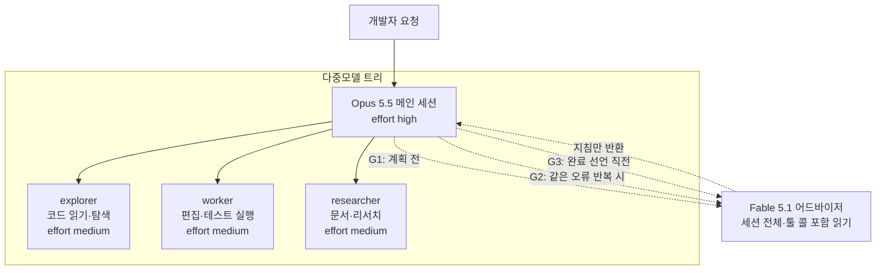

## 왜 읽어야 하나

Claude Code를 매일 쓰거나, 헤드리스 에이전트 함대를 운영하는 엔지니어라면 "세션의 어느 지점에 어떤 모델을 배치할 것인가"라는 결정이 반복됩니다. 결론부터 잡습니다. 어드바이저 패턴(강한 모델이 세션 전체를 읽고 계획 전, 오류 반복 시, 완료 선언 직전이라는 세 시점에서만 발언하는 구조)은 코드 작성 전에 설계 실수를 막아주지만, 단순 작업 기준으로는 모델 시간 약 5배, 토큰 약 3배의 비용을 냅니다. 그리고 이 재현에서 패턴보다 먼저 배운 것은 "누가 실제로 서빙했는가"를 트랜스크립트에서 읽는 리드백 습관이었습니다.


*아래의 앰버 색 스캐폴드를 조립하는 실행자 역할과, 그것을 지켜보는 인디고 색 어드바이저를 형상화했습니다.*

## 개요

9월 28일 thedelost의 트윗이 이런 제안을 했습니다. "Opus 5.5가 메인 모델이라면 Fable 5.1을 유탄으로 두지 마세요. `/advisor fable`로 호출 대기(on call)를 시켜라." 트윗의 그림은 이렇습니다. Opus 5.5가 코드를 계속 쓰면, Fable 5.1은 세션 전체(툴 콜 포함)를 읽고 딱 세 곳에서만 말을 건다고 합니다.

- **계획 전**: "이 접근이 맞는가?"
- **같은 오류가 반복될 때**: "잘못된 곳에서 파고드는 아닌가?"
- **"완료" 선언 직전**: "무엇을 놓쳤는가?"

"Fable 5.1이 리뷰하고, Opus 5.5가 ship한다"는 한 줄이 핵심입니다. 트윗 후반부는 한 단계 내려간 다중모델 트리를 제시합니다. Opus 5.5가 high 이포트로 메인 세션을 돌리고, explorer(코드 읽기), worker(편집과 테스트 실행), researcher(문서 수집) 세 서브에이전트가 medium 이포트로 나누고, Fable 5.1이 어드바이저로 대기한다는 구조입니다. 같은 트윗에는 저지연 의사결정 엔진 Jev를 한 층 더 아래에 놓고 "생각이 필요 없는 포크(어떤 파일, 어떤 툴, 재시도 or 중단)는 0.5초 안에 Jev로 보내고 큰 모델은 트리만 갈라지는 포크를 본다"는 한 줄도 있습니다.

이 패턴은 프롬프트 트릭이 아니라 내장 메커니즘입니다. Claude Code 공식 문서(advisor 항목)에는 `/advisor` 명령, `advisorModel` 설정, `--advisor` 플래그, 모델 페어링과 Fable 어드바이저의 사용량 크레딧 처리가 문서화되어 있고, 플랫폼 문서의 정의는 "빠르고 비용이 낮은 실행자 모델이 생성 도중 더 높은 지능의 어드바이저 모델에게 전략적 지도를 묻게 하는 도구"입니다. 어드바이저는 대화 전체를 읽고 계획을 산출합니다.


## 이 기술은 무엇인가

### 어드바이저 메커니즘

문서에 따르면 진입 경로는 세 갈래입니다. 세션 안에서는 `/advisor fable`로 바꾸면 되며, 이 값이 기본값으로 저장됩니다. `settings.json`에 `advisorModel`을 넣으면 영속 설정이 되고, `--advisor` 플래그는 한 세션만 적용합니다. Fable 5.1의 모델 ID는 `claude-fable-5-1`입니다(커뮤니티 이슈의 settings 표기에서 확인). 반대로 끌 수 있는 지점도 코드로 확인해야 합니다. `CLAUDE_CODE_DISABLE_ADVISOR_TOOL` 같은 환경변수와, 서브에이전트 이포트를 덮어쓰는 `CLAUDE_CODE_EFFORT_LEVEL`이 대표적입니다.

트윗은 이 설정을 만드는 "설치 프롬프트"까지 붙여줍니다. 프롬프트가 Claude에게 지시하는 내용은 이렇습니다. (1) `~/.claude/agents`와 `.claude/agents`를 확인해 explorer, worker, researcher에 맞는 기존 서브에이전트를 찾고, 없는 역할에만 새 정의를 초안하라고. 각 서브에이전트에는 opus, 이포트 medium을 지정하고, 다른 모델을 고정(pinning)한 것은 건드리지 않고 나열하라고. (2) 메인 세션을 `settings.json`의 `effortLevel`로 high로, `advisorModel`을 fable로 세팅하라고. (3) 어드바이저를 끄고 있는 환경변수와 `CLAUDE_CODE_EFFORT_LEVEL`을 찾아 보고만 하고 바꾸지 말라고. (4) CLAUDE.md에 "큰 계획 전, 오류 반복 시, 긴 작업 완료 선언 전에 어드바이저를 consult한다"는 규칙 한 줄을 추가하라고. 그리고 모든 변경을 diff로 먼저 보여달라고 요구합니다.

### 다중모델 트리


*트윗의 다중모델 트리: 빠른 모델이 탐색·편집·리서치를 나누고, 어드바이저가 세 게이트(G1/G2/G3)에서만 발언합니다.*

분업 논리는 단순합니다. 탐색과 편집 같은 반복 작업은 싼 모델이 빠르고, 판단은 비싼 모델이 정확하고, 가장 강한 모델은 "판단해야 하는 순간"에만 전체 컨텍스트를 소비합니다. 어드바이저가 세션 전체(툴 콜 포함)를 읽는다는 것이 비용 구조의 핵심입니다. 세 번의 게이트마다 실행자가 쌓아온 컨텍스트 전체를 어드바이저가 다시 읽는 셈이므로, 세션이 길수록 게이트당 비용도 커집니다.

커뮤니티에서는 이 페어링을 "Fable 어드바이저 + Sonnet 실행자"로 확산시켜 쓰고 있다고 보도되고 있습니다. "작업의 93%를 비용의 일부로 완수한다"거나 "토큰 비용을 약 60% 줄인다"는 식의 제3자 추정치가 나오는 데요, 공식 벤치마크는 아니므로 [추정]으로만 다룹니다.

## 설치 및 통합

문서와 트윗에서 확인된 실제 명령입니다.

```bash
# 세션 안에서 어드바이저 설정 (기본값으로 저장됨)
/advisor fable

# 영속 설정: settings.json
# {
#   "advisorModel": "claude-fable-5-1",
#   "effortLevel": "high"
# }

# 한 세션만 적용
claude --advisor fable
```

게이트가 실제로 걸리는지 확인하는 절차(트윗의 설치 프롬프트 3단계)는 이렇게 됩니다.

```bash
# 어드바이저를 끄고 있는 환경변수 점검
env | grep -i "CLAUDE_CODE_DISABLE_ADVISOR_TOOL\|CLAUDE_CODE_EFFORT_LEVEL"
```

`CLAUDE_CODE_EFFORT_LEVEL`이 잡혀 있으면 서브에이전트 이포트를 무시하고 그 값이 전체에 적용되므로, 트리 그림이 의도와 다른 비용으로 돌아옵니다. 확인만 하고 바꾸지는 않는 것이 트윗의 지시입니다. 보고를 받고 사람이 판단하게 하라는 뜻입니다.


CLAUDE.md에 추가하는 규칙 한 줄(트윗 4단계):

> 큰 계획 전에, 오류가 반복되면, 긴 작업을 완료했다고 선언하기 전에 어드바이저에게 먼저 묻는다.

이 한 줄이 "프롬프트에 의존하는 게이트"와 "설정값에 의존하는 게이트"의 차이를 만듭니다. 전자는 모델이 지키지 않으면 아무 일도 일어나지 않지만, 후자는 세션의 구조 자체가 세 번의 질문 지점을 보장합니다.

## 실제 실험 결과

### 재현 설계

이 세션에서는 내장 `/advisor`를 헤드리스로 직접 실행할 수 없었습니다(이 세션의 승인 게이트가 `claude` 바이너리 실행을 차단했음). 그래서 "3게이트 패턴"을 서브에이전트 오케스트레이션으로 재현했습니다. 실험은 두 아머입니다.

- **Arm A (솔로)**: sonnet 요청 실행자가 계획과 코드를 한 번에 산출. 게이트 없음.
- **Arm B (3게이트)**: sonnet 요청 실행자가 계획만 먼저 산출 → fable 요청 어드바이저가 계획을 리뷰(G1) → 실행자가 코드 산출 → 최종 리뷰어 게이트(G3, 두 아머 공통).


과제는 두 아머에 동일했습니다. 슬라이딩 윈도우 레이트 리미터(`ratelimit.py`)와 pytest 스위트(`test_ratelimit.py`)를 표준 라이브러리만으로, `now`를 명시적으로 받는 결정론적 코드로 작성. 최소 8개 테스트 케이스(한계값, 부인 요청 미기록, 부분 만료, current의 비소비 등).

### 가장 중요한 리드백: 누가 서빙했는가

실험 도중 발견한 환경 사실을 먼저 적습니다. 이 세션의 게이트웨이는 요청한 모델 이름을 로컬 엔진으로 리라이트했습니다. 네 개 서브에이전트와 메인 세션 트랜스크립트(185개 어시스턴트 메시지)의 `message.model` 필드를 읽자, 전부 동일한 엔진이었습니다.

```
thakicloud/Qwen3.8-27B-NVFP4-GPTQ-txt-1m-cache
```

즉 sonnet을 요청한 실행자도, fable을 요청한 어드바이저도, 실제로는 같은 로컬 엔진이 서빙한 것입니다. 이번 A/B가 측정한 것은 "티어 차이(강한 모델 vs 약한 모델)"가 아니라 "역할 차이(솔로 vs 3게이트)"입니다. 이 구분을 하지 않았다면 "Fable 어드바이저가 Opus를 이겼다"는 식의 오보를 써버렸을 것입니다.


### 실측 수치

모든 수치는 에이전트 usage 필드와 샌드박스 실행 로그(run-2부터 run-14)에서 읽은 것입니다.

| 단계 | 모델 시간 | 토큰(컨텍스트 포함) | 결과 |
|---|---|---|---|
| A 실행자(일회 계획+코드) | 70.1초 | 108,750 | 11/11 첫 통과 |
| B 계획 | 38.2초 | 105,084 | 5개 항목 계획 |
| B G1 어드바이저 | 66.8초 | 108,380 | REVISE, 필수 변경 3건 |
| B 코드 | 251초 | 117,993 | 9/9 첫 통과 |
| G3 최종 리뷰(공유) | 139.8초 | 133,388 | 결함 1건 발견(A 코드) |


*단계별 모델 시간(좌)과 토큰(우). 회색은 두 아머가 공유한 G3 최종 리뷰입니다.*

### G1이 코드 전에 잡은 것

B 아머의 계획만 받은 G1 어드바이저는 REVISE를 선고하고 필수 변경 3건을 냈습니다.

1. **부동소수점 경계 정밀도**. 구현이 쓰는 판정식(`ts > now - W`)과 테스트가 생각하는 판정식(`now - ts < W`)은 불완전 표현되는 소수점에서 갈라질 수 있습니다. 경계 테스트는 정확히 표현되는 값(ts=0.0, W=10.0, now=10.0, 직전 9.999)으로 고정해야 합니다.
2. **공유 판정식과 문서화된 경계**. "나이 == W이면 만료"라는 배타적 경계 결정을 docstring으로 명시하고, `allow()`와 `current()`가 같은 판정식을 쓰도록 하여 두 메서드가 경계에서 서로 다른 답을 내릴 수 없게 합니다.
3. **단조 now 계약**. 모든 테스트가 now를 비감소(단조 증가) 방향으로만 진전시킵니다. 과거로 되돌아간 now의 동작은 계약 밖이므로 테스트에서 정의하지 않습니다.

A 아머의 코드는 이 세 가지 중 "두 판정식이 갈라진다"는 위험을 실제로 안고 있었습니다. A의 evict는 `t <= now - W`를, current는 `now - t < W`를 각자 계산했고, 이번 테스트 데이터에서는 우연히 모두 일치했습니다. G1의 지적은 "지금 틀린 것"이 아니라 "같은 값에서 갈릴 수 있는 것"이었습니다.

### G3가 그린 스위트 뒤에 숨은 것을 잡은 것

G3 최종 리뷰어는 두 아머의 최종 코드를 정적 추적으로 리뷰했습니다(이 세션에서 실행은 승인 게이트로 막혀 있었음). 그 결과 armA 코드에 진짜 결함을 지목했습니다. deque의 헤드만 팝하는 evict는, 새 타임스탬프 뒤에 앉아 있는 만료 항목을 절대 보지 못합니다. 비단조 now 시퀀스(`allow(100)` → `allow(0)` → `allow(15)`, limit=2, W=10)에서 `ts=0`은 15초 전 것이지만 evict되지 않고, `allow(15)`는 `current(15) == 1`이 한계 미만임을 알면서도 `False`를 반환합니다.

우리는 이 지목을 실제로 실행해 확인했습니다(run-10/11). armA는 `allow(15)=False`, armB(전체 필터 방식)는 `allow(15)=True`. 11/11 전 통과 스위트를 가진 코드에, 스위트의 모든 테스트가 단조 now를 썼기 때문에 한 번도 발현하지 않았던 결함이 있었던 것입니다. armA를 공유 판정식+주문 독립 evict로 수정하고 회귀 테스트를 추가한 뒤 12/12를 확인했습니다(run-12).

한 줄로 요약하면: **G1은 코드 전에 설계를 고쳤고, G3는 코드 후에(그린 스위트를 통과한 뒤에) 스위트가 못 본 결함을 찾았습니다.** 이 실험의 모든 "가치"는 이 두 순간에서 나옵니다.


## ThakiCloud 제품 적용 시사점

**Paxis 렌즈**: 다키클라우드의 Paxis는 에이전트 오케스트레이션에서 이미 모델을 역할별로 분리해 라우팅합니다(haiku 탐색, sonnet 구현, opus 아키텍처, fable 컨덕터). 이번 실험은 그 분리 위에 "언제 강한 모델이 말을 걸 것인가"라는 질문을 세 개의 결정 지점(계획 전, 오류 반복, 완료 직전)으로 줄이는 패턴입니다. 이는 Paxis의 검증 단계(verifier)와 동일한 형태입니다. 적대적 프롬프트, 새 컨텍스트, 그리고 산출물을 코드(테스트 종료 코드)로 판정하는 구조. 이번 A/B는 "그린 테스트가 전부는 아니다. 게이트가 테스트가 놓친 것을 실제로 잡을 수 있다"는 우리 인프라 위의 첫 실측 증거입니다.

**ai-platform 렌즈**: "요청한 모델은 서빙한 모델이 아니다." 게이트웨이가 모델 이름을 리라이트하면, 플릿 운영자의 비용·품질 가정이 조용히 무너집니다. 이는 다키클라우드 GPU 잡 운영 규칙(job parameter provenance)이 말하는 것과 같은 구조입니다. 노브(knob)가 실제로 잡까지 도달했는지는 산출물에서 읽어야 하고, 요청을 믿어서는 안 된다는 것. 로컬 엔진이 프론티어 모델의 이름으로 서빙하는 플릿에서, 트랜스크립트의 `model` 필드와 usage가 유일한 ground truth입니다. 어드바이저 트리를 도입한다면, "어떤 모델이 게이트를 서빙했는가"를 실행 로그에 쓰는 리드백 단계를 함께 도입해야 합니다.

## 한계 및 반론

- **n=1 아머당, 단일 소형 작업.** 이 과제에서는 솔로가 5배 빠르고 3분의 1 토큰이었습니다. 게이트의 가치는 "오류가 비싼" 긴 세션, 멀티파일 리팩, 보안 민감 변경에서 dopiero 회수되는 구조입니다. 이번 실험은 그 역(반대)을 증명하지 못합니다.
- **티어 대조 없음.** 모든 역할이 동일 엔진이 서빙했으므로 "Fable이 Opus보다 잘 봤다"는 주장은 이번 실험에서 지지되지 않습니다. 역할(게이트) 효과만 측정됐습니다.
- **G3 리뷰어의 실행 제한.** G3는 정적 추적으로만 검증했습니다(실행이 승인 게이트로 차단). 발견한 결함은 우리가 별도 실행으로 확인했지만, 게이트 자체의 판정 신뢰도는 이 실험에서는 코드 검증보다 낮았습니다.
- **기능의 가용성은 버전·플랜에 묶여 있습니다.** advisor 항목은 특정 Claude Code 버전과 플랜에서 사용되며, Fable 어드바이저 사용량이 Fable 주간 미터에 표시되지 않는다는 알려진 이슈(커뮤니티 GitHub 이슈)도 있습니다. 비용 관측이 불완전할 수 있다는 뜻입니다.
- **"4배 빨라졌다"류 커뮤니티 클레임은 이번 측정과 방향이 다릅니다.** 게이트는 단순 작업에서 비용을 냅니다. 빠름이 아니라 안전이 매수되는 것입니다.

## 정리

어드바이저 트리는 "빠른 모델이 일하고, 강한 모델은 게이트에서만 말하는" 역할 분업입니다. 이번 재현에서 3게이트는 두 가지를 실제로 해냈습니다. 코드 작성 전에 부동소수점 경계의 이중 판정식 위험을 막았고, 11/11 전 통과 스위트 뒤에 숨겨진 주문 의존 evict 결함을 찾았습니다. 대가는 단순 작업 기준 모델 시간 약 5배(356초 대 70초, 공유 G3 제외), 토큰 약 3배(331k 대 109k)였습니다.

따라서 권고는 조건부입니다. 긴 세션, 고위험 변경, 반복 오류가 시작된 순간에는 게이트를 켜고, 결정론적인 소형 작업에는 솔로가 정답입니다. 그리고 게이트웨이가 모델 이름을 리라이트하는 모든 플릿에서, 실험도 운영도 "누가 서빙했는가"를 트랜스크립트에서 읽는 리드백이 먼저입니다. 그 리드백이 이번 실험에서 패턴 자체보다 먼저 교훈이 된 이유입니다.


---

*출처: [thedelost 트윗(2026-09-28)](https://x.com/thedelost/status/2104677530825634273), [Claude Code advisor 문서](https://code.claude.com/docs/en/advisor), [Claude Platform advisor tool 문서](https://platform.claude.com/docs/en/agents-and-tools/tool-use/advisor-tool). 커뮤니티 비용 추정치는 제3자 보도이며 [추정]으로 표기했습니다.*
