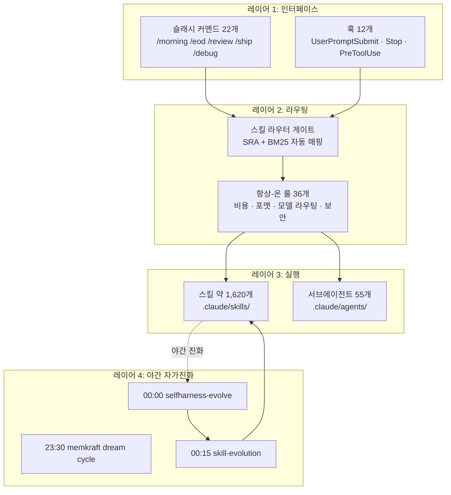

## 개요: 1인이 이 규모를 어떻게?

이 질문을 많이 받습니다. 스킬 약 1,620개, 서브에이전트 55개, 항상 켜져 있는 룰 36개, 슬래시 커맨드 22개, 훅 12개. 야간에는 무인 launchd 잡들이 스스로 진화 루프를 돌립니다. 집 PC와 회사 PC, 두 개 머신을 오가며 main 브랜치 하나로 동기화합니다. 단 한 명의 엔지니어가 이걸 혼자 운영하고 있습니다.

숫자만 보면 불가능해 보입니다. 하지만 이 숫자들은 관리해야 할 대상이 아닙니다. 대부분은 시스템이 알아서 씁니다. 엔지니어가 코드를 짜는 동안 스킬 라우터가 맞는 스킬을 고르고, 잠든 동안 evolution 루프가 스킬을 다듬으며, 비용 가드레일이 예산을 지킵니다.

비결은 규모를 관리하는 것이 아니라 **규모가 스스로 관리되도록 설계하는 것**입니다. 스킬이 스킬을 진화시키고, 에이전트가 에이전트를 라우팅하며, 회고 루프가 모델 선택을 최적화합니다. 사람이 하는 일은 방향을 설정하고, 이상 신호를 보며, 주요 판단을 내리는 것뿐입니다.

이 글은 그 운영 체계를 처음으로 전체적으로 공개합니다. 스킬 라우팅, 야간 진화, 비용 통제가 어떻게 하나의 운영체계로 맞물리는지, 그리고 이 경험이 어떻게 ThakiCloud Paxis 제품의 원천이 되는지를 설명합니다.

---

## 스택 전경: 4개 레이어로 보는 자동화 구조

전체 스택은 네 개의 레이어로 나뉩니다.

**레이어 1(인터페이스)**은 사람이 직접 닿는 곳입니다. `/morning`, `/eod`, `/review`, `/ship`, `/debug` 같은 슬래시 커맨드가 하루의 리듬을 만듭니다. 훅은 그 사이사이에서 조용히 작동합니다. `UserPromptSubmit` 훅은 매 프롬프트 전에 실행되고, `Stop` 훅은 작업이 끝날 때 플래그 파일을 확인합니다.

**레이어 2(라우팅)**는 이 스택의 두뇌입니다. 1,620개의 스킬 중 지금 이 요청에 맞는 것을 찾아야 합니다. 그 작업을 자동화한 것이 스킬 라우터 게이트입니다. 자세한 원리는 [스킬 라우팅 SRA 편](/dev/skill-ecosystem-routing-sra/)에서 다루었습니다.

**레이어 3(실행)**은 실제 작업이 일어나는 곳입니다. 스킬은 반복 가능한 워크플로를 캡슐화하고, 서브에이전트는 병렬 실행과 역할 분리를 담당합니다. 서브에이전트 55개는 Research, Content, Strategic Intel, Incident, Code Ship, Knowledge, Meeting, Sales 8개의 허브-앤-스포크 팀으로 구성됩니다. 각 팀에 오케스트레이터가 있고, 그 아래 전문 서브에이전트가 붙습니다.

**레이어 4(야간 자가진화)**는 이 시스템의 핵심 차별점입니다. 잠든 사이에 스택이 스스로를 개선합니다.

---

## 매 순간의 라우팅: 스킬 게이트가 하는 일

1,620개의 스킬은 모두 `.claude/skills/` 아래 존재하지만, 매 턴 모두 로드되지는 않습니다. 그랬다가는 컨텍스트 비용만으로 예산이 날아갑니다. 스킬 description 하나가 평균 300~500토큰이라고 가정하면[추정], 전부 로드하면 매 턴 수십만 토큰이 사라집니다. 대신 `UserPromptSubmit` 훅에 연결된 `skill-router-gate.py`가 BM25 검색으로 후보를 좁혀 컨텍스트에 주입합니다.

이 게이트는 세 가지 역할을 합니다.

첫째, **프리필터링**입니다. 인사, 확인, 순수 명령처럼 스킬이 필요 없는 턴은 토큰 소모 없이 즉시 통과시킵니다. 모든 요청에 BM25를 돌리면 그것 자체가 비용이 됩니다.

둘째, **후보 주입**입니다. 작업성 턴이라고 판단되면 `🧭 스킬 라우터 후보` 블록을 컨텍스트에 추가합니다. 모델은 이 힌트를 보고 적절한 스킬을 선택합니다. 후보는 상위 5개로 제한하며, 2개 이상이 동점이면 사용자에게 확인을 요청합니다.

셋째, **억지 매칭 방지**입니다. 스킬 이름이 부분적으로 겹친다고 무조건 선택하지 않습니다. 최고점이 임계값 미달이면 native 실행으로 넘어갑니다. 스킬 1,620개가 있는 환경에서 가장 흔한 실패는 관련 없는 스킬이 소음처럼 개입하는 것입니다. 이 라우터 설계의 세부 원리는 [스킬 라우팅 SRA 편](/dev/skill-ecosystem-routing-sra/)에서 다루었습니다.

항상-온 룰 36개는 이 라우팅과 별개로 모든 작업에 적용됩니다. 비용 통제, Slack 포맷 결정론, 모델 라우팅 테이블, 출력 토큰 규율 같은 것들입니다. 이 룰들은 모델에게 포맷을 "부탁"하는 것이 아니라 코드가 강제합니다.

예를 들어, 배치 콘텐츠 스킬에서 `quality_gate` 필드가 `"passed"`, `True`, `{...}` 세 가지로 제각각 나온 적이 있었습니다. 모델에게 자유도를 주면 Sonnet은 매 호출마다 다르게 출력합니다. 지금은 코드가 직접 `len()`으로 측정하고 임계 검사를 합니다. 모델의 자기 보고 숫자는 믿지 않습니다.

슬래시 커맨드 22개는 이 라우팅 위에서 작동하는 일종의 매크로입니다. `/morning`은 SOD git 동기화, Google Workspace 브리핑, 주식 파이프라인을 순서대로 실행합니다. `/eod`는 Cursor sync, release ship, Slack 요약을 묶습니다. 사람이 매번 순서를 기억할 필요가 없습니다.

---

## 매일 밤의 진화: 야간 launchd 루프

가장 많이 놀라는 부분입니다. 엔지니어가 자는 동안 세 개의 launchd 잡이 순서대로 실행됩니다.

**23:30 memkraft dream cycle.** 하루 동안 대화에서 나온 인사이트, 교훈, 패턴을 추출해 메모리 구조에 반영합니다. 사람이 일일이 기록하지 않아도 시스템이 오늘의 경험을 내일의 컨텍스트로 만들어 둡니다.

**00:00 selfharness-evolve.** 현재 스킬들의 성능 지표를 분석하고 description 품질, 트리거 충돌, 사용 빈도를 평가합니다. 개선이 필요한 스킬을 식별해 개선 제안을 생성합니다. 이 잡은 항상 local launchd에서 돌리며, 클라우드 routine은 사용하지 않습니다. 클라우드 sandbox에서는 bash 부팅이 안 되어 게이트가 날조될 수 있기 때문입니다.

**00:15 skill-evolution.** selfharness가 제안한 내용을 실제로 적용합니다. 스킬 description을 다듬고, 새로운 패턴을 발견하면 스킬을 생성하며, 더 이상 유효하지 않은 내용은 정리합니다.

자가진화 루프의 상세한 원리는 [자가진화 하니스 야간 편](/research/self-evolving-harness-nightly/)에서 별도로 다루었습니다.

중요한 설계 원칙이 있습니다. 이 야간 잡들은 스킬 내용에 대해서는 창의적이지만, 포맷은 코드가 소유합니다. 모델이 JSON을 손으로 쓰거나 품질 판정을 자기 보고하지 않습니다. 코드가 `len()`으로 측정하고, 정규식으로 검증하며, 임계 미달은 재배포합니다. Sonnet 급 모델이 반복 배치 작업에서 포맷을 일관되게 유지하는 유일한 방법은 자유도를 제거하는 것입니다.

---

## 비용을 새지 않게: 4층 가드레일

하루 AI 비용이 $705까지 나온 날이 있었습니다. 단일 모니터 세션(9.4시간, 1,145턴)이 전체의 54%를 차지했습니다. 그 사고에서 나온 것이 지금의 4층 가드레일입니다. 자세한 수치는 [LLM 비용 라우팅 가드레일 편](/llmops/llm-cost-routing-guardrails/)에서 공개했습니다.

**1층: 모델 라우팅 테이블.** 탐색, 파일 읽기, grep은 haiku(약 1배). 코딩, 리뷰, 테스트 작성은 sonnet(약 4배). 아키텍처, 복잡한 다단계 추론은 opus(약 19배). Agent 툴 호출 시 `model` 파라미터를 반드시 명시합니다. 생략하면 세션 기본 모델(비용 최대)로 실행됩니다. haiku 서브에이전트는 절대 추가 서브에이전트를 생성하지 않습니다. 그 작업이 haiku로 풀리지 않는다면 작업 크기가 잘못 분류된 것입니다.

**2층: 2K 토큰 룰.** 어떤 툴 호출이든 2K 토큰 이상 반환할 것으로 예상되면 서브에이전트로 위임합니다. 서브에이전트가 읽고, 처리하고, 요약만 반환합니다. 메인 컨텍스트에는 요약과 파일 경로만 남습니다. 대용량 JSON 배열은 headroom SmartCrusher로 50% 이상 압축한 뒤 투입합니다. MCP 툴 응답이 컨텍스트 비용 중 가장 큰 숨겨진 원인입니다. Playwright 페이지 읽기, GitHub API 응답, Notion 스레드 읽기는 한 번에 수천 토큰을 쏟아낼 수 있습니다. 200줄 이상이면 `/tmp/ctx-{task-id}.json`에 저장하고, 스키마와 샘플만 메인 컨텍스트로 올립니다.

**3층: 폴링 금지.** 24시간 모니터링을 Claude 핫루프로 돌리는 패턴은 금지입니다. 가격 스냅샷, 상태 비교, 헬스체크 같은 폴링은 launchd cron으로 돌리고 이상 감지 시에만 Slack 알림을 보냅니다. Claude 비용 $0으로 동일한 효과를 냅니다. 하루 9.4시간 모니터 세션이 $381을 소모했던 사고 이후 정착된 원칙입니다.

**4층: 회고 에스컬레이션.** 스케줄 스킬은 기본 sonnet으로 시작합니다. `skill_model_policy.json`이 스킬별 모델과 실패 streak을 추적합니다. 연속으로 `max_fail_streak`회 실패하면 해당 스킬만 opus로 자동 승격하고 Slack `#h-report`에 알림을 보냅니다. clean run이면 streak을 리셋합니다. 전체를 opus로 올리는 것이 아니라, 실제로 품질이 문제가 된 스킬만 정밀 승격합니다.

이 네 층이 맞물려 작동한 결과, 지금은 일반적인 날 Sonnet 위주로 유지됩니다. 동일한 산출량을 훨씬 낮은 비용으로 냅니다. 비용 통제 설계의 전체 수치는 [LLM 비용 라우팅 가드레일 편](/llmops/llm-cost-routing-guardrails/)에서 공개했습니다.

컨텍스트 위생도 중요합니다. 같은 파일을 세션 안에서 반복 읽으면 cache_read 토큰이 쌓입니다. 절대경로 명령에 불필요한 `cd` 프리픽스를 붙이는 것도 마찬가지입니다. `git` 명령은 현재 working tree에서 바로 동작하므로 `cd` 없이 쓰면 됩니다. 이런 작은 습관이 쌓여 세션 비용을 상당히 낮춥니다[추정].

---

## 이것이 곧 제품: Paxis와 AI Platform

이 1인 운영 방식 자체가 ThakiCloud가 Paxis로 제품화하려는 것입니다. 자율 에이전트 런타임, 스킬 생태계, 자가진화, 거버넌스, 비용 통제를 엔지니어 누구나 쓸 수 있게 만드는 것이 목표입니다.

지금까지 설명한 운영 체계는 두 가지 사실을 증명합니다.

첫 번째는 **이 운영 방식이 실제로 작동한다는 것**입니다. 개념이나 논문이 아니라, 실제 1인이 매일 사용하는 시스템입니다. 야간 진화 루프가 돌고, 비용 가드레일이 지출을 통제하며, 슬래시 커맨드가 하루의 리듬을 만듭니다.

두 번째는 **이 방식이 확장 가능하다는 것**입니다. 1인이 1,620개의 스킬을 관리하는 것은 스킬 하나하나를 직접 손대기 때문이 아닙니다. 시스템이 스스로 진화하고, 라우터가 올바른 스킬을 찾으며, 가드레일이 예산을 지킵니다. 이 구조는 팀으로 확장해도 동일하게 작동합니다.

Paxis는 이 경험을 플랫폼으로 만드는 작업입니다. 운영자가 스킬을 정의하고, 에이전트를 구성하며, 비용 정책을 설정하면 나머지는 런타임이 처리하는 방식으로 진행합니다. AI Platform은 그 위에서 K8s 기반 워크로드 오케스트레이션(Kueue, ArgoCD)을 더합니다.

---

## 한계 및 교훈

솔직하게 말씀드립니다.

**스킬 1,620개는 부채이기도 합니다.** 잘 만든 스킬은 자산이지만, 방치된 스킬은 컨텍스트 토큰을 소모하는 유령입니다. 스킬 description이 너무 유사하면 라우터가 혼란을 겪습니다. 야간 evolution 루프가 이 부채를 청소하지만, 근본적으로는 스킬을 만들 때 명확한 intent와 boundary를 정의해야 합니다.

**야간 자가진화는 느립니다.** 하루 밤에 의미 있는 변화가 쌓이려면 몇 주가 필요합니다. 급격한 방향 전환은 사람이 직접 개입해야 합니다. 자가진화는 방향을 바꾸는 것이 아니라 현재 방향에서 점진적으로 개선하는 것입니다.

**비용 가드레일도 완벽하지 않습니다.** MCP 툴이 한 번 응답에 수천 토큰을 쏟아내면 sandbox 규칙이 없으면 바로 컨텍스트가 오염됩니다. 가드레일은 설계하는 순간이 아니라, 문제가 생긴 뒤 교훈을 박아 넣는 방식으로 두터워집니다.

**멀티머신 동기화는 규율이 필요합니다.** 집 PC와 회사 PC가 feature 브랜치로 분기되면 어제 집에서 업데이트한 내용이 오늘 회사 세션에 반영되지 않습니다. 실제로 feature 브랜치에서 세션이 돌아 origin/main보다 25커밋 뒤처진 상태에서, 전날 적용한 전략 지시가 반영되지 않아 엉뚱한 판단을 내린 일이 있었습니다. 모든 작업은 main에서 하고, 작업이 끝나면 반드시 push합니다. 단순하지만 지키지 않으면 stale 코드로 판단하는 상황이 생깁니다. 세션 시작 전 `git log --oneline HEAD..origin/main`으로 뒤처짐을 확인하는 것이 습관이 되었습니다.

**스킬의 기회비용을 과소평가하기 쉽습니다.** 스킬을 만들면 바로 자산처럼 느껴집니다. 하지만 스킬은 인덱스에 올라가는 순간부터 매 세션 description의 컨텍스트 비용을 지불합니다. 유사한 스킬이 두 개 있으면 라우터가 혼란을 겪습니다. 스킬을 만들기 전에 "이 스킬이 없으면 에이전트가 실제로 틀리나?"를 먼저 물어야 합니다. 대답이 "아니요"라면 스킬이 아니라 룰 한 줄이면 충분합니다.

---

이 글에서 설명한 운영 체계는 하루아침에 만들어진 것이 아닙니다. 문제가 생기고, 교훈을 추출하고, 룰과 스킬에 박아 넣는 과정의 누적입니다. `2026-XX-XX 사고:` 형식으로 룰에 기록한 교훈이 지금 36개 룰 파일 전체에 흩어져 있습니다. 각 룰의 헤더를 보면 그 룰이 어떤 장애에서 나왔는지 바로 알 수 있습니다.

솔로 AI 팀을 운영하고 싶다면 가장 먼저 투자해야 할 것은 스킬 품질과 비용 가드레일입니다. 화려한 기능이 아니라, 조용히 작동하는 라우팅과 야간에 스스로 나아지는 진화 루프가 실질적인 레버리지입니다. 이 글이 비슷한 규모의 자동화를 고민하는 분들에게 참고가 되길 바랍니다.

다음 글에서는 Paxis의 스킬 생태계 설계 원칙, 특히 thin harness와 fat skill의 구분이 왜 중요한지를 다룰 예정입니다.
