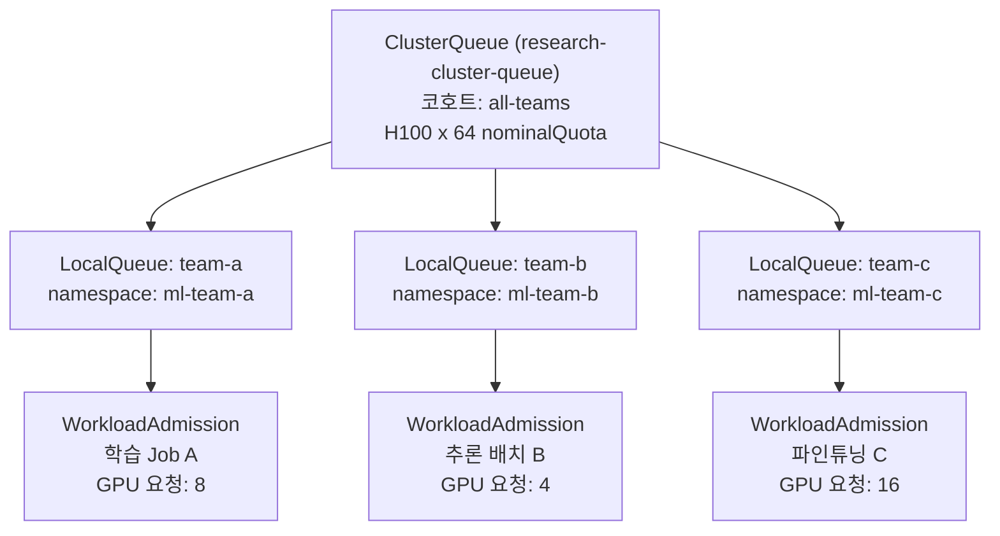

## 개요

엔터프라이즈 GPU 클러스터를 운영하는 조직이라면 누구나 같은 불편한 진실을 마주합니다. 하드웨어 투자 규모와 실제 활용률 사이의 격차입니다. 피치덱 수치 기준으로 1,000 GPU 클러스터에서 GPU 유휴율이 30~50%에 달할 경우 연간 수천만 달러 규모의 낭비로 이어질 수 있습니다[추정/피치덱 수치]. 하드웨어 비용이 아니라, 전력과 냉각 비용을 지불하면서 아무것도 계산하지 않는 비용입니다.

이 문제의 핵심은 사람이 기계 속도로 워크로드 스케줄링을 최적화할 수 없다는 데 있습니다. 분산 학습 작업은 수십 개의 GPU 파드를 동시에 확보하지 못하면 일부만 기동된 채 나머지 자원을 낭비합니다. 여러 팀이 동일한 클러스터 큐를 공유하면 우선순위 경쟁이 발생하고 중요한 학습 작업이 지연됩니다. 추론 서비스는 밤새 GPU를 점유하고 있지만 트래픽은 없습니다.

ThakiCloud AI Platform은 이 세 가지 병목을 Kueue + KAI 커스텀 스케줄러, vLLM + KEDA Scale-to-Zero 조합으로 처리합니다. 이 글에서는 각 메커니즘이 실제로 어떻게 작동하는지, 그리고 어떤 아키텍처 결정이 비용 회수를 가능하게 하는지를 설명합니다.

---

## GPU 비용이 새는 3가지 지점

### 지점 1: 스케줄링 없는 GPU 유휴

큐 관리 없이 여러 팀이 K8s 클러스터를 공유하면 공정성이 보장되지 않습니다. 먼저 `kubectl apply`를 실행한 팀이 GPU를 선점하고, 뒤늦게 요청한 팀의 학습 작업은 대기 상태로 남습니다. 선점한 팀의 작업이 끝나면 GPU가 해제되지만, 다음 작업이 즉시 대기하고 있지 않으면 GPU는 잠시 유휴 상태가 됩니다. 클러스터 전체에서 이러한 틈새가 누적되면 실효 활용률이 크게 낮아집니다.

### 지점 2: Gang Scheduling 부재로 인한 분산 학습 지연

분산 학습 작업(DDP, Megatron, DeepSpeed 등)은 모든 워커 파드가 동시에 시작해야 의미 있는 계산을 시작할 수 있습니다. Gang Scheduling이 없으면 다음과 같은 현상이 발생합니다.

- 8개 GPU가 필요한 작업에서 6개 파드는 기동됐지만 2개는 노드 부족으로 Pending
- 기동된 6개 파드는 Pending인 2개를 기다리며 GPU를 점유하지만 계산은 하지 않음
- 수십 분, 경우에 따라 수 시간 동안 부분 점유 상태 지속

이 상태에서 다른 팀의 소규모 작업이 클러스터에 들어오면 남은 자원이 파편화되어 더 큰 작업이 더 오래 대기하게 됩니다.

### 지점 3: 추론 엔드포인트의 상시 GPU 점유

모델 서빙 엔드포인트는 처음 기동될 때 GPU 메모리를 할당합니다. KEDA나 유사한 오토스케일러 없이 배포된 추론 서비스는 요청이 없는 새벽에도 GPU를 점유합니다. 소규모 조직은 1~2개 GPU를 불필요하게 점유하는 것처럼 보이지만, 수십 개의 모델 엔드포인트를 운영하는 조직에서는 이 낭비가 기하급수적으로 커집니다.

---

## Kueue 페어셰어 + Gang Scheduling

### ClusterQueue와 LocalQueue 계층

Kueue는 K8s 네이티브 워크로드 큐 관리 시스템으로, `ClusterQueue`와 `LocalQueue` 두 계층으로 구성됩니다. `ClusterQueue`는 클러스터 전체 GPU 할당 정책을 정의하고, `LocalQueue`는 개별 네임스페이스(팀/프로젝트)가 바라보는 큐입니다.

```yaml
# 개념적 예시 -- 실행 캡처 아님
apiVersion: kueue.x-k8s.io/v1beta1
kind: ClusterQueue
metadata:
  name: research-cluster-queue
spec:
  namespaceSelector: {}
  resourceGroups:
    - coveredResources: ["cpu", "memory", "nvidia.com/gpu"]
      flavors:
        - name: "h100-flavor"
          resources:
            - name: "nvidia.com/gpu"
              nominalQuota: 64      # 팀 기본 할당
              borrowingLimit: 32    # 다른 팀 여유분 차용 상한
              lendingLimit: 16      # 다른 팀에 빌려줄 수 있는 상한
  cohort: "all-teams"              # 페어셰어 코호트 그룹
```

`cohort` 필드가 페어셰어의 핵심입니다. 동일 코호트에 속한 `ClusterQueue`들은 서로 남는 `nominalQuota`를 `borrowingLimit` 범위 내에서 빌릴 수 있습니다. A팀이 야간에 GPU를 사용하지 않으면 B팀이 일시적으로 빌려 쓰고, A팀이 다시 요청하면 우선권을 돌려받습니다.



위 구조에서 Kueue는 각 팀의 `nominalQuota` 소진율을 추적하고, 코호트 내에서 공정한 분배가 이루어지도록 입장(admission) 결정을 내립니다. 한 팀이 `nominalQuota`를 초과해 차용 중일 때 다른 팀이 요청을 제출하면, 차용 중인 워크로드의 우선순위가 자동으로 낮아집니다.

### KAI 스케줄러와 Gang Scheduling

K8s 기본 스케줄러는 파드를 개별적으로 배치합니다. 분산 학습처럼 모든 파드가 동시에 시작해야 하는 작업에는 Gang Scheduling이 필요합니다. ThakiCloud는 KAI(Kubernetes AI) 커스텀 스케줄러 플러그인을 통해 이를 구현합니다.

Gang Scheduling의 핵심 원칙은 "전부 또는 없음(all-or-nothing)"입니다. 16개 GPU를 요청하는 분산 학습 작업은 16개가 모두 확보될 수 있을 때까지 단 하나의 파드도 노드에 배치되지 않습니다. 이를 통해 부분 점유로 인한 자원 낭비를 차단합니다.

```yaml
# 개념적 예시 -- 실행 캡처 아님
apiVersion: batch/v1
kind: Job
metadata:
  name: distributed-training-llama3
spec:
  parallelism: 16   # 16개 워커 파드 동시 실행
  completions: 16
  template:
    metadata:
      annotations:
        kueue.x-k8s.io/queue-name: "team-a-local-queue"
    spec:
      schedulingGates:
        - name: "kueue.x-k8s.io/admission"   # Kueue가 입장 허가 전까지 스케줄링 게이트
      containers:
        - name: trainer
          resources:
            limits:
              nvidia.com/gpu: "1"
```

`schedulingGates`를 통해 Kueue가 입장 허가를 내리기 전까지 K8s 스케줄러는 이 작업의 파드를 건드리지 않습니다. Kueue가 클러스터에 16개 GPU 공간이 확보됨을 확인한 뒤 게이트를 제거하면, KAI 스케줄러가 16개 파드를 동시에 최적 노드에 배치합니다.

KAI 스케줄러는 GPU 배치 시 토폴로지 인식도 수행합니다. InfiniBand로 연결된 동일 랙 내 노드를 우선 선택해 분산 학습의 통신 오버헤드를 최소화합니다. 이는 GPU 활용률뿐 아니라 학습 속도에도 직접적인 영향을 미칩니다.

### ResourceFlavor와 노드 이질성 처리

실제 운영 환경에서는 H100, A100, MIG 인스턴스 등 다양한 GPU 타입이 혼재합니다. Kueue의 `ResourceFlavor`는 이 이질성을 추상화합니다.

```yaml
# 개념적 예시 -- 실행 캡처 아님
apiVersion: kueue.x-k8s.io/v1beta1
kind: ResourceFlavor
metadata:
  name: h100-full
spec:
  nodeLabels:
    nvidia.com/gpu.product: "NVIDIA-H100-80GB-HBM3"
---
apiVersion: kueue.x-k8s.io/v1beta1
kind: ResourceFlavor
metadata:
  name: h100-mig-3g
spec:
  nodeLabels:
    nvidia.com/gpu.product: "NVIDIA-H100-80GB-HBM3"
    nvidia.com/mig.profile: "3g.40gb"
```

`ClusterQueue`는 작업 특성에 따라 적합한 `ResourceFlavor`로 자동 라우팅합니다. 소규모 파인튜닝 작업은 MIG 슬라이스로, 대규모 사전 학습은 풀 GPU로 배치됩니다. 사람이 직접 매번 노드 어피니티를 작성할 필요가 없습니다.

---

## 추론 비용: vLLM Scale-to-Zero

### KEDA HTTP 기반 오토스케일링

추론 서비스는 학습 워크로드와 다른 특성을 가집니다. 학습은 시작하면 끝날 때까지 연속적으로 GPU를 소비하지만, 추론은 요청이 없는 시간대에는 GPU가 필요하지 않습니다.

ThakiCloud는 vLLM + KEDA 조합으로 추론 엔드포인트를 서버리스 방식으로 운영합니다. KEDA의 HTTP 어댑터는 엔드포인트로 들어오는 요청을 모니터링하고, 요청 수에 따라 vLLM 레플리카 수를 자동으로 조정합니다.

```yaml
# 개념적 예시 -- 실행 캡처 아님
apiVersion: keda.sh/v1alpha1
kind: ScaledObject
metadata:
  name: llm-inference-scaler
spec:
  scaleTargetRef:
    name: vllm-llama3-deployment
  minReplicaCount: 0      # Scale-to-Zero 허용
  maxReplicaCount: 8
  cooldownPeriod: 300     # 마지막 요청 후 5분 대기 후 0으로 축소
  triggers:
    - type: prometheus
      metadata:
        serverAddress: http://victoria-metrics:8428
        metricName: http_requests_per_second
        threshold: "10"   # 레플리카당 초당 10 요청 기준
        query: sum(rate(vllm_request_success_total[1m]))
```

`minReplicaCount: 0`이 Scale-to-Zero의 핵심입니다. 새벽 2시에 요청이 없으면 vLLM 파드가 0으로 축소되고 GPU를 반환합니다. 오전 업무 시작과 함께 첫 요청이 들어오면 KEDA가 파드를 기동하고, vLLM이 GPU 메모리에 모델을 로드한 뒤 응답을 반환합니다.

### Cold Start 지연 트레이드오프

Scale-to-Zero의 명백한 단점은 콜드 스타트 지연입니다. vLLM이 7B 파라미터 모델을 로드하는 데 수십 초가 소요될 수 있습니다. 이는 SLA 요구사항에 따라 다음 세 가지 전략으로 대응합니다.

첫째, `minReplicaCount: 1`로 설정해 최소 1개 레플리카를 항상 유지하는 방법입니다. GPU를 1개 상시 점유하는 비용과 콜드 스타트 없는 응답성을 교환합니다.

둘째, 업무 시간 기반 사전 기동(pre-warm) 스케줄을 설정하는 방법입니다. CronJob이나 외부 스케줄러로 업무 시작 30분 전에 레플리카를 1로 올려두고, 업무 종료 후 Scale-to-Zero합니다.

셋째, vLLM의 양자화(quantization)를 활용해 로드 시간 자체를 줄이는 방법입니다. AWQ나 GPTQ 포맷의 모델은 FP16 대비 로드 시간이 크게 단축됩니다.

비용 절감 효과를 극대화하면서도 응답성을 유지하려면, 엔드포인트의 실제 트래픽 패턴을 VictoriaMetrics에서 확인한 뒤 `cooldownPeriod`와 `minReplicaCount` 조합을 사용 패턴에 맞게 튜닝하는 것이 실용적입니다.

---

## 비용 가시성: DCGM/VictoriaMetrics

### GPU 텔레메트리 수집 구조

비용을 최적화하려면 무엇이 얼마나 소비되는지 정확히 알아야 합니다. ThakiCloud는 NVIDIA DCGM Exporter를 통해 GPU 수준의 세밀한 텔레메트리를 수집하고, VictoriaMetrics에 장기 저장합니다.

DCGM Exporter가 노출하는 핵심 메트릭은 다음과 같습니다.

| 메트릭 | 설명 | 비용 분석 활용 |
|--------|------|----------------|
| `DCGM_FI_DEV_GPU_UTIL` | GPU 연산 유닛 활용률 (%) | 실효 활용률 기준선 |
| `DCGM_FI_DEV_MEM_COPY_UTIL` | GPU 메모리 대역폭 활용률 | 메모리 바운드 병목 진단 |
| `DCGM_FI_DEV_FB_USED` | GPU 프레임버퍼 사용량 (MiB) | 모델 로드 상태 확인 |
| `DCGM_FI_PROF_PIPE_TENSOR_ACTIVE` | 텐서 코어 활성 비율 | 실제 AI 연산 수행 여부 |

`DCGM_FI_DEV_GPU_UTIL`이 낮은데 `DCGM_FI_DEV_FB_USED`가 높다면, GPU 메모리를 점유 중이지만 연산은 하지 않는 상태입니다. 이것이 Scale-to-Zero의 직접적인 타겟입니다.

### 팀별 GPU 비용 어트리뷰션

VictoriaMetrics에 저장된 텔레메트리를 K8s 레이블과 결합하면 팀별, 프로젝트별 GPU 소비를 추적할 수 있습니다. Kueue의 `LocalQueue`는 네임스페이스와 1:1로 매핑되므로, 네임스페이스 레이블을 기준으로 GPU 사용량을 집계하면 각 팀의 실제 소비를 파악할 수 있습니다.

```
# VictoriaMetrics 쿼리 예시 (MetricsQL)
# 네임스페이스별 평균 GPU 활용률 (최근 24시간)
avg by (namespace) (
  avg_over_time(DCGM_FI_DEV_GPU_UTIL{kubernetes_namespace!=""}[24h])
)
```

이 데이터를 대시보드로 시각화하면 관리자는 어떤 팀이 할당된 GPU를 효율적으로 사용하는지, 어떤 작업이 장시간 GPU를 점유하면서도 낮은 활용률을 보이는지를 파악할 수 있습니다.

---

## ThakiCloud 적용 시사점

ThakiCloud AI Platform의 데이터 플레인은 추론 클러스터, 학습 클러스터, 개발 클러스터를 논리적으로 분리하되, 동일한 Kueue + KAI + KEDA 스택을 각 클러스터에 배포합니다. 멀티클러스터 관리 레이어(MCC)는 단일 컨트롤 플레인에서 모든 클러스터의 큐 상태를 통합 조회합니다.

ArgoCD GitOps를 통해 `ClusterQueue`, `ResourceFlavor`, `ScaledObject` 등의 스케줄링 정책이 Git 리포지토리에서 선언적으로 관리됩니다. 새 팀을 온보딩하거나 `nominalQuota`를 조정할 때 `kubectl apply`가 아닌 PR로 변경을 제안하고 리뷰를 거쳐 클러스터에 반영합니다. 이는 정책 변경의 감사 추적을 보장하고, 실수로 인한 자원 과할당을 사전에 방지합니다.

클러스터 확장 트리거도 메트릭 기반으로 자동화할 수 있습니다. VictoriaMetrics에서 Kueue 큐 대기 시간이 30분을 지속적으로 초과하면 알림을 발생시키고, 이를 신규 GPU 노드 추가의 신호로 활용합니다. GPU 활용률이 클러스터 평균 80%를 30일 이상 유지하면 다음 72-GPU 단위 확장을 검토합니다.

---

## 한계 및 고려사항

### Kueue 성숙도와 에코시스템 의존성

Kueue는 CNCF 프로젝트이지만 아직 비교적 젊은 프로젝트입니다. Kubeflow, Ray, 기본 Job 등 주요 워크로드 타입은 지원되지만, 일부 커스텀 CRD 기반 프레임워크는 통합에 추가 작업이 필요할 수 있습니다. 도입 전 사용 중인 ML 프레임워크가 Kueue와 호환되는지 확인하는 것이 중요합니다.

### Gang Scheduling과 클러스터 파편화

Gang Scheduling은 파편화를 해소하지만 동시에 새로운 트레이드오프를 만듭니다. 클러스터에 8개 GPU가 2개 노드에 4개씩 흩어져 있을 때, 8개를 동시에 요구하는 작업이 Gang Scheduling으로 인해 장시간 대기할 수 있습니다. 이 경우 bin-packing 정책과 Gang Scheduling 정책을 상황에 맞게 조합하는 튜닝이 필요합니다.

### Scale-to-Zero의 운영 복잡성

추론 엔드포인트가 많아질수록 KEDA ScaledObject의 수도 증가합니다. 각 엔드포인트마다 적절한 `cooldownPeriod`, `threshold`, `minReplicaCount`를 설정하고 유지하는 것은 운영 부담이 됩니다. 이를 줄이려면 엔드포인트를 SLA 등급으로 분류하고, 등급별 표준 템플릿을 관리하는 접근이 실용적입니다.

### GPU 비용 절감의 전제: 정확한 메트릭

DCGM Exporter가 수집하는 `GPU_UTIL` 수치는 SM(Streaming Multiprocessor) 활성 비율을 나타냅니다. 이 값이 낮다고 무조건 유휴 상태는 아닙니다. 메모리 복사나 통신 대기로 인한 낮은 SM 활용률은 워크로드 최적화 문제이지 스케줄링 문제가 아닙니다. 텔레메트리를 해석할 때 단일 메트릭이 아니라 SM 활용률, 메모리 대역폭, 텐서 코어 활성률을 복합적으로 분석해야 정확한 진단이 가능합니다.

---

GPU 클러스터는 그 자체로 거대한 자원이지만, 스케줄링 정책 없이는 그 잠재력을 다 쓰지 못합니다. Kueue 페어셰어로 큐 경합을 해소하고, Gang Scheduling으로 분산 학습 대기를 제거하고, Scale-to-Zero로 유휴 추론 비용을 차단하는 세 가지 조합이 K8s 네이티브 GPU 비용 최적화의 실질적인 출발점입니다.
