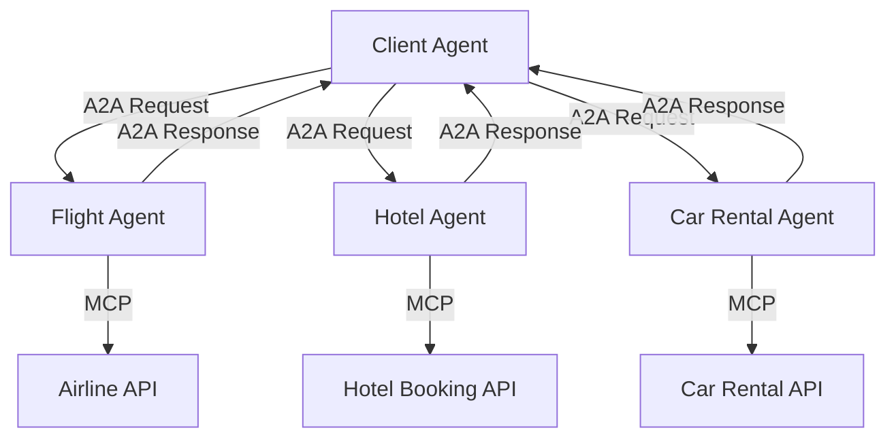

에이전틱 AI의 급속한 발전과 함께, 여러 에이전트가 협력하여 복잡한 작업을 수행하는 멀티 에이전트 시스템이 주목받고 있습니다. 하지만 이러한 시스템에서 가장 중요한 과제는 에이전트 간의 안전하고 표준화된 통신입니다. Google이 발표한 Agent-to-Agent(A2A) 프로토콜은 이 문제를 해결하기 위한 혁신적인 접근법을 제시합니다.

## A2A 프로토콜이란?

**Agent-to-Agent(A2A) 프로토콜**은 Google에서 개발한 에이전트 간 상호 운용성과 보안을 위한 표준화된 통신 프로토콜입니다. 이 프로토콜은 자율적인 AI 에이전트들이 조직 경계와 기술적 경계를 넘나들며 안전하게 협력할 수 있도록 설계되었습니다.

### 핵심 특징

- **선언적 통신**: 명시적이고 구조화된 메시지 교환
- **신원 기반 인증**: 강력한 암호화 기반 인증 시스템
- **AgentCards를 통한 발견**: 에이전트 능력 및 메타데이터 표준화
- **감사 가능성**: 모든 상호작용의 추적 및 기록

## 에이전틱 AI의 진화와 보안 필요성

### 기존 AI 시스템의 한계

전통적인 AI 시스템은 고립된 작업별 모델로 제한되었습니다. 하지만 에이전틱 AI는:

- **자율적 의사결정**: 단순한 프롬프트 응답을 넘어선 능동적 행동
- **도구 사용**: 외부 리소스와 API를 활용한 작업 수행
- **동적 협력**: 실시간으로 다른 에이전트와 협업

### 보안 위협과 과제

멀티 에이전트 환경에서 발생하는 주요 보안 위협들:

```text
1. 신원 위조 (Spoofing)
2. 데이터 유출 (Data Exfiltration)  
3. 작업 조작 (Task Tampering)
4. 권한 상승 (Privilege Escalation)
5. 프롬프트 인젝션 (Prompt Injection)
```

## A2A 프로토콜 핵심 구성 요소

### AgentCards: 에이전트 발견 메커니즘

**AgentCards**는 에이전트의 능력, 메타데이터, 접근 정보를 표준화된 형태로 표현합니다:

```json
{
  "name": "DocumentAnalyzer",
  "version": "1.0",
  "capabilities": [
    "pdf_processing",
    "text_extraction",
    "sentiment_analysis"
  ],
  "endpoints": {
    "task_execution": "https://api.example.com/v1/tasks",
    "authentication": "https://auth.example.com/oauth2"
  },
  "security_requirements": {
    "auth_method": "OAuth2",
    "encryption": "TLS 1.3"
  }
}
```

### 작업 생명주기 관리

A2A는 작업의 전체 생명주기를 체계적으로 관리합니다:

1. **작업 요청** (Task Request)
2. **작업 수락** (Task Acceptance)  
3. **진행 상황 업데이트** (Progress Updates)
4. **결과 전달** (Result Delivery)
5. **완료 확인** (Completion Acknowledgment)

### 인증 및 권한 관리

```yaml
Authentication Flow:
  1. Agent Discovery via AgentCards
  2. OAuth2/OpenID Connect Authentication
  3. JWT Token Exchange
  4. Role-Based Access Control (RBAC)
  5. Continuous Authorization Validation
```

## MAESTRO 프레임워크를 통한 위협 모델링

**MAESTRO**(Multi-Agent System Threat and Risk Operations) 프레임워크는 A2A 환경의 보안 위험을 체계적으로 분석하는 도구입니다.

### 주요 위협 벡터

#### 1. AgentCard 조작

- **위험**: 악의적 에이전트가 허위 능력 정보 제공
- **완화**: 스키마 검증, 디지털 서명, 신뢰 점수 시스템

#### 2. 작업 재생 공격 (Task Replay)

- **위험**: 이전 작업 메시지 재사용으로 인한 중복 실행
- **완화**: 타임스탬프, 논스(nonce), 일회용 토큰 사용

#### 3. 크로스 에이전트 권한 상승

- **위험**: 한 에이전트의 권한을 이용한 다른 에이전트 공격
- **완화**: 최소 권한 원칙, 에이전트별 샌드박싱

## 보안 구현 모범 사례

### 1. 강력한 암호화 통신

```python
# TLS 1.3을 사용한 안전한 통신 설정
import ssl
import asyncio
import aiohttp

async def secure_agent_communication():
    ssl_context = ssl.create_default_context()
    ssl_context.minimum_version = ssl.TLSVersion.TLSv1_3
    
    async with aiohttp.ClientSession(
        connector=aiohttp.TCPConnector(ssl=ssl_context)
    ) as session:
        # A2A 프로토콜 통신 구현
        pass
```

### 2. 제로 트러스트 아키텍처

```yaml
Zero Trust Principles for A2A:
  - Never Trust, Always Verify
  - Least Privilege Access
  - Assume Breach Mentality
  - Continuous Monitoring
  - Identity-Centric Security
```

### 3. 로깅 및 감사

```python
# 구조화된 로깅 예제
import structlog
import uuid

logger = structlog.get_logger()

def log_agent_interaction(source_agent, target_agent, task_type, status):
    logger.info(
        "agent_interaction",
        interaction_id=str(uuid.uuid4()),
        source_agent=source_agent,
        target_agent=target_agent,
        task_type=task_type,
        status=status,
        timestamp=datetime.utcnow().isoformat()
    )
```

## MCP와의 시너지 효과

**Model Context Protocol(MCP)**과 A2A의 결합은 더욱 강력한 에이전틱 시스템을 구현할 수 있게 합니다:

### 통합 아키텍처

| 계층 | A2A 역할 | MCP 역할 |
|-----|---------|---------|
| 에이전트 간 통신 | 수평적 협력 | - |
| 도구/리소스 접근 | - | 수직적 통합 |
| 인증 | 에이전트 간 | 클라이언트-서버 |
| 데이터 흐름 | 작업 위임 | 컨텍스트 제공 |

### 실제 구현 예제

```python
class A2AMCPIntegratedAgent:
    def __init__(self, agent_id, mcp_servers):
        self.agent_id = agent_id
        self.mcp_servers = mcp_servers
        self.a2a_client = A2AClient()
        
    async def execute_delegated_task(self, task):
        # MCP를 통한 도구 접근
        tools = await self.get_mcp_tools(task.required_capabilities)
        
        # A2A를 통한 다른 에이전트와 협력
        collaborators = await self.discover_agents(task.domain)
        
        # 통합 실행
        result = await self.coordinate_execution(task, tools, collaborators)
        return result
```

## 실제 구축 시나리오

### 시나리오: 여행 계획 에이전트 시스템

1. **클라이언트 에이전트**: 사용자 요구사항 분석
2. **항공편 에이전트**: 항공권 검색 및 예약
3. **숙박 에이전트**: 호텔 검색 및 예약  
4. **렌터카 에이전트**: 차량 대여 서비스



### 보안 고려사항

- **인증 체인**: 각 에이전트 간 독립적 인증
- **데이터 격리**: 민감 정보의 에이전트별 분리
- **감사 추적**: 전체 작업 흐름의 로깅

## 미래 전망과 발전 방향

### 표준화 진행

A2A 프로토콜은 다음과 같은 방향으로 발전할 것으로 예상됩니다:

- **업계 표준 채택**: 주요 클라우드 제공업체들의 지원
- **생태계 확장**: 더 많은 도구와 플랫폼 통합
- **보안 강화**: 적응형 신뢰, 연속적 정책 시행

### 권장 구현 로드맵

```text
Phase 1: 기본 A2A 구현
├── AgentCard 스키마 정의
├── 기본 인증 시스템 구축
└── 단순 작업 위임 테스트

Phase 2: 보안 강화
├── MAESTRO 위협 모델링 적용
├── 암호화 통신 구현
└── 로깅 및 모니터링 시스템

Phase 3: 고급 기능
├── MCP 통합
├── 다중 에이전트 오케스트레이션
└── 프로덕션 배포 최적화
```

## 결론

A2A 프로토콜은 에이전틱 AI 시스템의 미래를 위한 핵심 인프라입니다. 표준화된 통신, 강력한 보안, 그리고 확장 가능한 아키텍처를 통해 신뢰할 수 있는 멀티 에이전트 생태계 구축이 가능합니다.

LLMOps 엔지니어로서 A2A를 도입할 때는:

- **보안을 최우선**으로 고려한 설계
- **점진적 구현**을 통한 위험 최소화  
- **지속적 모니터링**을 통한 시스템 신뢰성 확보

이러한 접근을 통해 안전하고 효율적인 에이전틱 AI 시스템을 구축할 수 있을 것입니다.

---

**참고 자료**:

- [Building A Secure Agentic AI Application Leveraging Google's A2A Protocol](https://arxiv.org/pdf/2504.16902)
- [Google Developer Blog: A2A Protocol](https://developers.googleblog.com/en/a2a-a-new-era-of-agent-interoperability/)
