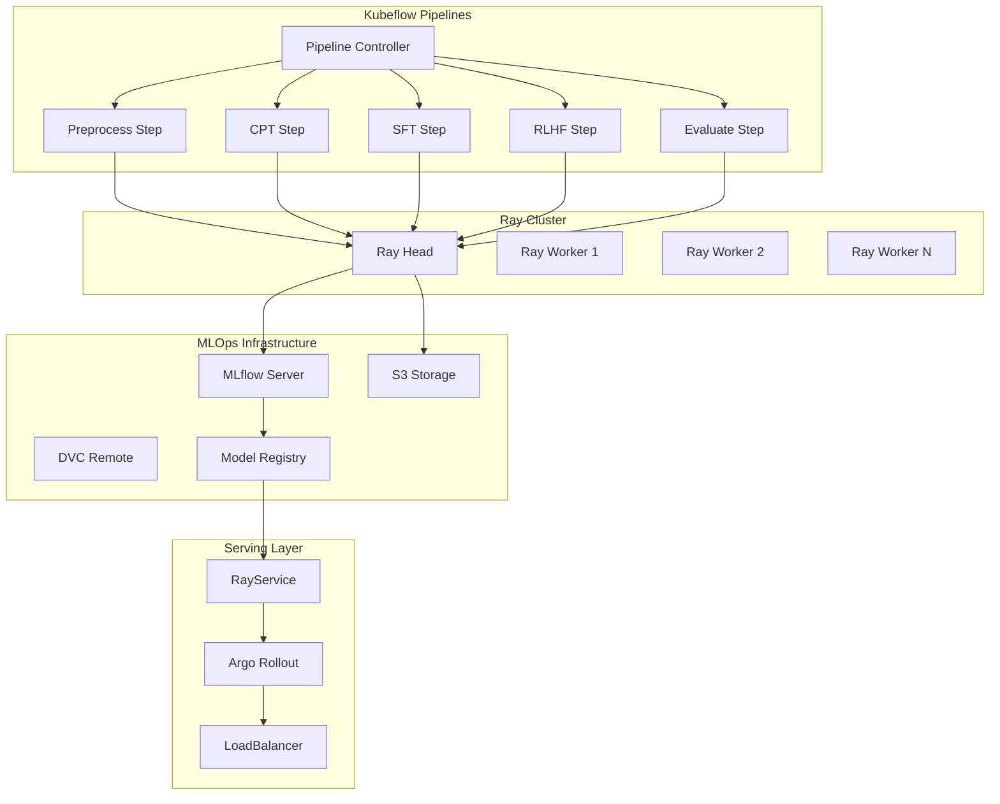

## 1. 아키텍처 설계 및 설치

### 1.1 통합 아키텍처 다이어그램



### 1.2 필수 구성 요소 설치

```bash
# 1. Kubeflow Pipelines 설치
export PIPELINE_VERSION=2.0.3
kubectl apply -k "github.com/kubeflow/pipelines/manifests/kustomize/cluster-scoped-resources?ref=$PIPELINE_VERSION"
kubectl wait --for condition=established --timeout=60s crd/applications.app.k8s.io
kubectl apply -k "github.com/kubeflow/pipelines/manifests/kustomize/env/platform-agnostic-pns?ref=$PIPELINE_VERSION"

# 2. KubeRay Operator 설치
helm repo add kuberay https://ray-project.github.io/kuberay-helm/
helm install kuberay-operator kuberay/kuberay-operator --version 1.0.0

# 3. Argo Rollouts 설치
kubectl create namespace argo-rollouts
kubectl apply -n argo-rollouts -f https://github.com/argoproj/argo-rollouts/releases/latest/download/install.yaml
```

### 1.3 Ray Cluster 설정

```yaml
# ray-cluster-for-kubeflow.yaml
apiVersion: ray.io/v1alpha1
kind: RayCluster
metadata:
  name: kubeflow-ray-cluster
  namespace: kubeflow
spec:
  rayVersion: '2.8.0'
  headGroupSpec:
    rayStartParams:
      dashboard-host: '0.0.0.0'
      num-cpus: '0'
    template:
      spec:
        containers:
        - name: ray-head
          image: rayproject/ray:2.8.0-py310-gpu
          ports:
          - containerPort: 6379
            name: gcs-server
          - containerPort: 8265
            name: dashboard
          - containerPort: 10001
            name: client
          resources:
            limits:
              cpu: "8"
              memory: "32Gi"
            requests:
              cpu: "4"
              memory: "16Gi"
          env:
          - name: RAY_CLUSTER_NAME
            value: "kubeflow-ray-cluster"
          volumeMounts:
          - name: shared-storage
            mountPath: /shared
        volumes:
        - name: shared-storage
          persistentVolumeClaim:
            claimName: kubeflow-shared-pvc
  
  workerGroupSpecs:
  - replicas: 4
    minReplicas: 2
    maxReplicas: 20
    groupName: gpu-workers
    rayStartParams:
      num-cpus: '16'
      num-gpus: '4'
    template:
      spec:
        containers:
        - name: ray-worker
          image: rayproject/ray:2.8.0-py310-gpu
          resources:
            limits:
              cpu: "32"
              memory: "128Gi"
              nvidia.com/gpu: "4"
            requests:
              cpu: "16"
              memory: "64Gi"
              nvidia.com/gpu: "4"
          volumeMounts:
          - name: shared-storage
            mountPath: /shared
        volumes:
        - name: shared-storage
          persistentVolumeClaim:
            claimName: kubeflow-shared-pvc
```

## 2. RayJob 기반 파이프라인 컴포넌트

### 2.1 전처리 컴포넌트 (Ray Data)

```python
# components/preprocess_component.py
from kfp import dsl
from kfp.kubernetes import use_k8s_secret
import kfp

@dsl.component(
    base_image="rayproject/ray:2.8.0-py310-gpu",
    packages_to_install=["ray[data]", "datasets", "transformers", "mlflow", "dvc"]
)
def preprocess_with_ray(
    input_data_path: str,
    output_data_path: str,
    ray_cluster_address: str = "ray://kubeflow-ray-cluster-head:10001",
    mlflow_tracking_uri: str = "http://mlflow-server:5000"
) -> str:
    """Ray Data를 활용한 대규모 데이터 전처리"""
    import ray
    import mlflow
    from ray import data
    import json
    from datetime import datetime
    
    # Ray 클러스터 연결
    ray.init(address=ray_cluster_address)
    mlflow.set_tracking_uri(mlflow_tracking_uri)
    
    with mlflow.start_run(run_name="preprocess-ray-data"):
        # Ray Data로 대규모 데이터 처리
        ds = data.read_json(input_data_path)
        
        def clean_korean_text(batch):
            """한국어 텍스트 정제"""
            import re
            
            cleaned_texts = []
            for text in batch["text"]:
                # 한국어 텍스트 정규화
                text = re.sub(r'\s+', ' ', text)
                text = re.sub(r'[^\w\s가-힣]', '', text)
                text = text.strip()
                
                if len(text) > 50:  # 최소 길이 필터링
                    cleaned_texts.append(text)
            
            return {"text": cleaned_texts}
        
        # 분산 처리로 데이터 정제
        processed_ds = ds.map_batches(
            clean_korean_text,
            batch_size=1000,
            num_cpus=2
        )
        
        # 결과 저장
        processed_ds.write_json(output_data_path)
        
        # 메트릭 로깅
        total_records = processed_ds.count()
        mlflow.log_metrics({
            "total_records": total_records,
            "processing_time": 0  # 실제 구현에서는 시간 측정
        })
        
        ray.shutdown()
        return output_data_path
```

### 2.2 CPT 학습 컴포넌트 (Ray Train)

```python
# components/cpt_component.py
from kfp import dsl
import kfp

@dsl.component(
    base_image="rayproject/ray:2.8.0-py310-gpu",
    packages_to_install=[
        "ray[train]", "torch", "transformers", "datasets", 
        "unsloth @ git+https://github.com/unslothai/unsloth.git",
        "mlflow", "dvc"
    ]
)
def cpt_training_with_ray(
    input_data_path: str,
    model_output_path: str,
    model_name: str = "unsloth/Qwen2.5-7B-bnb-4bit",
    learning_rate: float = 1e-5,
    num_epochs: int = 2,
    ray_cluster_address: str = "ray://kubeflow-ray-cluster-head:10001",
    mlflow_tracking_uri: str = "http://mlflow-server:5000"
) -> str:
    """Ray Train을 활용한 CPT 분산 학습"""
    import ray
    from ray import train
    from ray.train.torch import TorchTrainer
    from ray.train import ScalingConfig, RunConfig
    import mlflow
    import torch
    from unsloth import FastLanguageModel
    from datasets import load_dataset
    from transformers import TrainingArguments
    from trl import SFTTrainer
    
    # Ray 클러스터 연결
    ray.init(address=ray_cluster_address)
    mlflow.set_tracking_uri(mlflow_tracking_uri)
    
    def train_func(config):
        """분산 학습 함수"""
        import torch.distributed as dist
        from torch.nn.parallel import DistributedDataParallel as DDP
        
        # 분산 환경 설정
        rank = train.get_context().get_world_rank()
        local_rank = train.get_context().get_local_rank()
        world_size = train.get_context().get_world_size()
        
        device = torch.device(f"cuda:{local_rank}")
        torch.cuda.set_device(device)
        
        # MLflow 로깅 (rank 0에서만)
        if rank == 0:
            mlflow.start_run(run_name="cpt-distributed-training")
            mlflow.log_params(config)
        
        # 모델 로딩
        model, tokenizer = FastLanguageModel.from_pretrained(
            model_name=config["model_name"],
            max_seq_length=4096,
            dtype=None,
            load_in_4bit=True,
        )
        
        # LoRA 설정
        model = FastLanguageModel.get_peft_model(
            model,
            r=64,
            target_modules=["q_proj", "k_proj", "v_proj", "o_proj"],
            lora_alpha=16,
            lora_dropout=0.1,
            bias="none",
            use_gradient_checkpointing="unsloth",
        )
        
        model = model.to(device)
        
        # DDP 래핑
        if world_size > 1:
            model = DDP(model, device_ids=[local_rank])
        
        # 데이터셋 로딩
        dataset = load_dataset("json", data_files=config["input_data_path"], split="train")
        
        # 학습 설정
        training_args = TrainingArguments(
            output_dir="/tmp/cpt_output",
            num_train_epochs=config["num_epochs"],
            per_device_train_batch_size=4,
            learning_rate=config["learning_rate"],
            logging_steps=100,
            save_steps=1000,
            fp16=True,
            dataloader_num_workers=4,
        )
        
        # 트레이너 설정
        trainer = SFTTrainer(
            model=model,
            tokenizer=tokenizer,
            args=training_args,
            train_dataset=dataset,
            dataset_text_field="text",
        )
        
        # 학습 실행
        trainer.train()
        
        # 모델 저장 (rank 0에서만)
        if rank == 0:
            trainer.save_model(config["model_output_path"])
            
            # MLflow에 모델 로깅
            final_loss = trainer.state.log_history[-1]["train_loss"]
            mlflow.log_metrics({
                "final_loss": final_loss,
                "total_steps": trainer.state.global_step
            })
            mlflow.pytorch.log_model(model, "cpt_model")
            mlflow.end_run()
        
        # Ray Train 메트릭 리포팅
        train.report({"loss": trainer.state.log_history[-1]["train_loss"]})
    
    # 학습 설정
    config = {
        "model_name": model_name,
        "input_data_path": input_data_path,
        "model_output_path": model_output_path,
        "learning_rate": learning_rate,
        "num_epochs": num_epochs
    }
    
    # TorchTrainer 설정 및 실행
    trainer = TorchTrainer(
        train_loop_per_worker=train_func,
        train_loop_config=config,
        scaling_config=ScalingConfig(
            num_workers=4,
            use_gpu=True,
            resources_per_worker={"CPU": 4, "GPU": 1}
        ),
        run_config=RunConfig(
            name="cpt-training",
            storage_path="/shared/ray_results"
        )
    )
    
    result = trainer.fit()
    ray.shutdown()
    
    return model_output_path
```

### 2.3 RLHF 컴포넌트 (Ray Train + Tune)

```python
# components/rlhf_component.py
from kfp import dsl
import kfp

@dsl.component(
    base_image="rayproject/ray:2.8.0-py310-gpu",
    packages_to_install=[
        "ray[train,tune]", "torch", "transformers", "datasets", 
        "unsloth @ git+https://github.com/unslothai/unsloth.git",
        "trl", "mlflow", "dvc"
    ]
)
def rlhf_training_with_ray(
    base_model_path: str,
    preference_data_path: str,
    model_output_path: str,
    ray_cluster_address: str = "ray://kubeflow-ray-cluster-head:10001",
    mlflow_tracking_uri: str = "http://mlflow-server:5000"
) -> str:
    """Ray Train + Tune을 활용한 RLHF 학습"""
    import ray
    from ray import train, tune
    from ray.train.torch import TorchTrainer
    from ray.tune.schedulers import ASHAScheduler
    import mlflow
    import torch
    from unsloth import FastLanguageModel
    from datasets import load_dataset
    from trl import PPOTrainer, PPOConfig
    
    # Ray 클러스터 연결
    ray.init(address=ray_cluster_address)
    mlflow.set_tracking_uri(mlflow_tracking_uri)
    
    def rlhf_objective(config):
        """RLHF 튜닝 목적 함수"""
        with mlflow.start_run(nested=True):
            mlflow.log_params(config)
            
            # 모델 로딩
            model, tokenizer = FastLanguageModel.from_pretrained(
                model_name=base_model_path,
                max_seq_length=2048,
                dtype=None,
                load_in_4bit=True,
            )
            
            # PPO 설정
            ppo_config = PPOConfig(
                model_name=base_model_path,
                learning_rate=config["learning_rate"],
                batch_size=config["batch_size"],
                mini_batch_size=config["mini_batch_size"],
                ppo_epochs=config["ppo_epochs"],
                gamma=config["gamma"],
                lam=config["lam"],
                cliprange=config["cliprange"],
            )
            
            # 선호도 데이터셋 로딩
            dataset = load_dataset("json", data_files=preference_data_path, split="train")
            
            # PPO 트레이너 설정
            ppo_trainer = PPOTrainer(
                config=ppo_config,
                model=model,
                tokenizer=tokenizer,
                dataset=dataset,
            )
            
            # RLHF 학습 실행
            for epoch in range(3):  # 간소화된 학습
                for batch in ppo_trainer.dataloader:
                    # PPO 스텝 실행
                    stats = ppo_trainer.step(
                        queries=batch["query"],
                        responses=batch["response"],
                        scores=batch["score"]
                    )
                    
                    # 메트릭 로깅
                    if stats:
                        mlflow.log_metrics(stats, step=epoch)
            
            # 모델 저장
            model.save_pretrained(model_output_path)
            
            # 최종 성능 평가
            reward_score = 0.8  # 실제로는 보상 모델로 평가
            tune.report(reward=reward_score)
            mlflow.log_metric("final_reward", reward_score)
            
            return reward_score
    
    # 하이퍼파라미터 검색 공간
    search_space = {
        "learning_rate": tune.loguniform(1e-6, 1e-3),
        "batch_size": tune.choice([4, 8, 16]),
        "mini_batch_size": tune.choice([2, 4]),
        "ppo_epochs": tune.choice([2, 4, 6]),
        "gamma": tune.uniform(0.9, 0.99),
        "lam": tune.uniform(0.9, 0.99),
        "cliprange": tune.uniform(0.1, 0.3),
    }
    
    # 스케줄러 설정
    scheduler = ASHAScheduler(
        time_attr="training_iteration",
        metric="reward",
        mode="max",
        max_t=10,
        grace_period=2
    )
    
    # 튜닝 실행
    tuner = tune.Tuner(
        rlhf_objective,
        param_space=search_space,
        tune_config=tune.TuneConfig(
            scheduler=scheduler,
            num_samples=5,
            max_concurrent_trials=2
        )
    )
    
    results = tuner.fit()
    best_result = results.get_best_result("reward", "max")
    
    # 최적 파라미터로 최종 학습
    final_model = rlhf_objective(best_result.config)
    
    ray.shutdown()
    return model_output_path
```

---

## 3. Kubeflow Pipeline 정의 및 통합

### 3.1 통합 파이프라인 정의

```python
# korean_llm_pipeline.py
from kfp import dsl, compiler
from kfp.kubernetes import use_k8s_secret
from components.preprocess_component import preprocess_with_ray
from components.cpt_component import cpt_training_with_ray
from components.rlhf_component import rlhf_training_with_ray
import kfp

@dsl.pipeline(
    name="Korean LLM Training with Ray Integration",
    description="Complete MLOps pipeline using Kubeflow + Ray for Korean LLM training"
)
def korean_llm_ray_pipeline(
    raw_data_path: str = "s3://korean-llm-data/raw_corpus.jsonl",
    instruction_data_path: str = "s3://korean-llm-data/instruction_dataset.jsonl",
    preference_data_path: str = "s3://korean-llm-data/preference_dataset.jsonl",
    model_name: str = "unsloth/Qwen2.5-7B-bnb-4bit",
    cpt_learning_rate: float = 1e-5,
    sft_learning_rate: float = 2e-5,
    ray_cluster_address: str = "ray://kubeflow-ray-cluster-head:10001",
    mlflow_tracking_uri: str = "http://mlflow-server:5000"
):
    """한국어 LLM 학습을 위한 Kubeflow + Ray 통합 파이프라인"""
    
    # 1단계: 데이터 전처리 (Ray Data)
    preprocess_task = preprocess_with_ray(
        input_data_path=raw_data_path,
        output_data_path="s3://korean-llm-data/processed_corpus.jsonl",
        ray_cluster_address=ray_cluster_address,
        mlflow_tracking_uri=mlflow_tracking_uri
    )
    
    # DVC 연동을 위한 메타데이터 추가
    preprocess_task.add_pod_annotation("dvc.stage", "preprocess")
    preprocess_task.add_pod_annotation("mlflow.experiment", "korean-llm-training")
    
    # 2단계: CPT 학습 (Ray Train)
    cpt_task = cpt_training_with_ray(
        input_data_path=preprocess_task.output,
        model_output_path="s3://korean-llm-models/cpt_model",
        model_name=model_name,
        learning_rate=cpt_learning_rate,
        num_epochs=2,
        ray_cluster_address=ray_cluster_address,
        mlflow_tracking_uri=mlflow_tracking_uri
    )
    
    # 리소스 요구사항 설정
    cpt_task.set_cpu_limit("32")
    cpt_task.set_memory_limit("128Gi")
    cpt_task.set_gpu_limit("4")
    cpt_task.add_pod_annotation("dvc.stage", "cpt_training")
    
    # 3단계: SFT 학습 (일반 컴포넌트)
    sft_task = sft_training_component(
        base_model_path=cpt_task.output,
        instruction_data_path=instruction_data_path,
        model_output_path="s3://korean-llm-models/sft_model",
        learning_rate=sft_learning_rate,
        num_epochs=3
    )
    
    sft_task.set_cpu_limit("16")
    sft_task.set_memory_limit("64Gi")
    sft_task.set_gpu_limit("2")
    sft_task.add_pod_annotation("dvc.stage", "sft_training")
    
    # 4단계: RLHF 학습 (Ray Train + Tune)
    rlhf_task = rlhf_training_with_ray(
        base_model_path=sft_task.output,
        preference_data_path=preference_data_path,
        model_output_path="s3://korean-llm-models/rlhf_model",
        ray_cluster_address=ray_cluster_address,
        mlflow_tracking_uri=mlflow_tracking_uri
    )
    
    rlhf_task.set_cpu_limit("64")
    rlhf_task.set_memory_limit("256Gi")
    rlhf_task.set_gpu_limit("8")
    rlhf_task.add_pod_annotation("dvc.stage", "rlhf_training")
    
    # 5단계: 모델 평가
    evaluation_task = model_evaluation_component(
        model_path=rlhf_task.output,
        test_data_path="s3://korean-llm-data/test_dataset.jsonl"
    )
    
    evaluation_task.add_pod_annotation("dvc.stage", "evaluation")
    
    # 6단계: 모델 레지스트리 등록
    registry_task = register_model_component(
        model_path=rlhf_task.output,
        model_name="korean-llm-v1",
        evaluation_metrics=evaluation_task.output,
        mlflow_tracking_uri=mlflow_tracking_uri
    )
    
    # 조건부 배포 설정
    with dsl.Condition(evaluation_task.outputs["accuracy"] > 0.85):
        deploy_task = deploy_model_component(
            model_path=rlhf_task.output,
            model_name="korean-llm-v1"
        )

@dsl.component(
    base_image="python:3.9-slim",
    packages_to_install=["transformers", "datasets", "torch", "mlflow"]
)
def sft_training_component(
    base_model_path: str,
    instruction_data_path: str,
    model_output_path: str,
    learning_rate: float = 2e-5,
    num_epochs: int = 3
) -> str:
    """SFT 학습 컴포넌트 (일반 Pod)"""
    import torch
    from transformers import AutoTokenizer, AutoModelForCausalLM, TrainingArguments
    from datasets import load_dataset
    from trl import SFTTrainer
    import mlflow
    
    mlflow.set_tracking_uri("http://mlflow-server:5000")
    
    with mlflow.start_run(run_name="sft-training"):
        # 모델 로딩
        model = AutoModelForCausalLM.from_pretrained(base_model_path)
        tokenizer = AutoTokenizer.from_pretrained(base_model_path)
        
        # 데이터셋 로딩
        dataset = load_dataset("json", data_files=instruction_data_path, split="train")
        
        # 학습 설정
        training_args = TrainingArguments(
            output_dir="/tmp/sft_output",
            num_train_epochs=num_epochs,
            per_device_train_batch_size=4,
            learning_rate=learning_rate,
            logging_steps=100,
            save_steps=1000,
            fp16=True,
        )
        
        # 트레이너 설정 및 학습
        trainer = SFTTrainer(
            model=model,
            tokenizer=tokenizer,
            args=training_args,
            train_dataset=dataset,
            dataset_text_field="text",
        )
        
        trainer.train()
        trainer.save_model(model_output_path)
        
        # 메트릭 로깅
        final_loss = trainer.state.log_history[-1]["train_loss"]
        mlflow.log_metrics({
            "final_loss": final_loss,
            "total_steps": trainer.state.global_step
        })
        
        return model_output_path

@dsl.component(
    base_image="python:3.9-slim",
    packages_to_install=["transformers", "datasets", "torch", "evaluate"]
)
def model_evaluation_component(
    model_path: str,
    test_data_path: str
) -> dict:
    """모델 평가 컴포넌트"""
    import torch
    from transformers import AutoTokenizer, AutoModelForCausalLM
    from datasets import load_dataset
    import json
    
    # 모델 로딩
    model = AutoModelForCausalLM.from_pretrained(model_path)
    tokenizer = AutoTokenizer.from_pretrained(model_path)
    
    # 테스트 데이터 로딩
    test_dataset = load_dataset("json", data_files=test_data_path, split="train")
    
    # 평가 실행
    correct_predictions = 0
    total_samples = min(100, len(test_dataset))
    
    for sample in test_dataset[:total_samples]:
        prompt = sample["prompt"]
        expected = sample["expected"]
        
        inputs = tokenizer(prompt, return_tensors="pt")
        outputs = model.generate(**inputs, max_new_tokens=128)
        prediction = tokenizer.decode(outputs[0], skip_special_tokens=True)
        
        if expected.lower() in prediction.lower():
            correct_predictions += 1
    
    accuracy = correct_predictions / total_samples
    
    results = {
        "accuracy": accuracy,
        "total_samples": total_samples,
        "correct_predictions": correct_predictions
    }
    
    return results
```

### 3.2 DVC 및 MLflow 통합

```python
# mlops_integration.py
import dvc.api
import mlflow
from mlflow.tracking import MlflowClient
import boto3
from datetime import datetime

class MLOpsIntegration:
    def __init__(self, mlflow_uri, dvc_remote, s3_bucket):
        self.mlflow_client = MlflowClient(mlflow_uri)
        self.dvc_remote = dvc_remote
        self.s3_client = boto3.client('s3')
        self.s3_bucket = s3_bucket
        
    def setup_experiment_tracking(self, pipeline_run_id):
        """실험 추적 설정"""
        # MLflow 실험 생성
        experiment_name = f"korean-llm-pipeline-{datetime.now().strftime('%Y%m%d')}"
        
        try:
            experiment = self.mlflow_client.get_experiment_by_name(experiment_name)
            experiment_id = experiment.experiment_id
        except:
            experiment_id = self.mlflow_client.create_experiment(experiment_name)
        
        # DVC 파이프라인 초기화
        dvc_pipeline = {
            "stages": {
                "preprocess": {
                    "cmd": f"echo 'Preprocessing started for {pipeline_run_id}'",
                    "deps": ["s3://korean-llm-data/raw_corpus.jsonl"],
                    "outs": ["s3://korean-llm-data/processed_corpus.jsonl"]
                },
                "cpt_training": {
                    "cmd": f"echo 'CPT training started for {pipeline_run_id}'",
                    "deps": ["s3://korean-llm-data/processed_corpus.jsonl"],
                    "outs": ["s3://korean-llm-models/cpt_model"],
                    "metrics": ["metrics/cpt_metrics.json"]
                },
                "sft_training": {
                    "cmd": f"echo 'SFT training started for {pipeline_run_id}'",
                    "deps": ["s3://korean-llm-models/cpt_model"],
                    "outs": ["s3://korean-llm-models/sft_model"],
                    "metrics": ["metrics/sft_metrics.json"]
                },
                "rlhf_training": {
                    "cmd": f"echo 'RLHF training started for {pipeline_run_id}'",
                    "deps": ["s3://korean-llm-models/sft_model"],
                    "outs": ["s3://korean-llm-models/rlhf_model"],
                    "metrics": ["metrics/rlhf_metrics.json"]
                }
            }
        }
        
        return experiment_id, dvc_pipeline
    
    def log_stage_completion(self, stage_name, metrics, artifacts):
        """스테이지 완료 로깅"""
        with mlflow.start_run(run_name=f"{stage_name}-completion"):
            # 메트릭 로깅
            mlflow.log_metrics(metrics)
            
            # 아티팩트 로깅
            for artifact_path in artifacts:
                if artifact_path.startswith("s3://"):
                    # S3에서 로컬로 다운로드 후 MLflow에 업로드
                    local_path = self.download_s3_artifact(artifact_path)
                    mlflow.log_artifact(local_path)
                else:
                    mlflow.log_artifact(artifact_path)
            
            # DVC 메트릭 업데이트
            self.update_dvc_metrics(stage_name, metrics)
    
    def download_s3_artifact(self, s3_path):
        """S3 아티팩트 다운로드"""
        # s3://bucket/key 형태에서 bucket과 key 추출
        parts = s3_path.replace("s3://", "").split("/", 1)
        bucket = parts[0]
        key = parts[1]
        
        local_path = f"/tmp/{key.split('/')[-1]}"
        self.s3_client.download_file(bucket, key, local_path)
        return local_path
    
    def update_dvc_metrics(self, stage_name, metrics):
        """DVC 메트릭 업데이트"""
        metrics_file = f"metrics/{stage_name}_metrics.json"
        
        # S3에 메트릭 파일 업로드
        import json
        import tempfile
        
        with tempfile.NamedTemporaryFile(mode='w', suffix='.json', delete=False) as f:
            json.dump(metrics, f, indent=2)
            temp_path = f.name
        
        # S3에 업로드
        s3_key = f"metrics/{stage_name}_metrics.json"
        self.s3_client.upload_file(temp_path, self.s3_bucket, s3_key)
    
    def register_final_model(self, model_path, model_name, evaluation_metrics):
        """최종 모델 레지스트리 등록"""
        # MLflow 모델 레지스트리에 등록
        model_uri = f"s3://{self.s3_bucket}/{model_path}"
        
        mlflow.register_model(
            model_uri=model_uri,
            name=model_name,
            tags={
                "accuracy": str(evaluation_metrics["accuracy"]),
                "pipeline_version": "v1.0",
                "training_framework": "ray+kubeflow"
            }
        )
        
        # 성능 기준 충족 시 Production 스테이지로 승격
        if evaluation_metrics["accuracy"] > 0.85:
            client = MlflowClient()
            client.transition_model_version_stage(
                name=model_name,
                version=1,
                stage="Production"
                         )
```

---

## 4. RayService 및 Argo Rollout 배포

### 4.1 RayService 정의

```yaml
# rayservice-korean-llm.yaml
apiVersion: ray.io/v1alpha1
kind: RayService
metadata:
  name: korean-llm-service
  namespace: kubeflow
spec:
  serviceUnhealthySecondThreshold: 300
  deploymentUnhealthySecondThreshold: 300
  
  rayClusterConfig:
    rayVersion: '2.8.0'
    headGroupSpec:
      rayStartParams:
        dashboard-host: '0.0.0.0'
        num-cpus: '0'
      template:
        spec:
          containers:
          - name: ray-head
            image: rayproject/ray:2.8.0-py310-gpu
            ports:
            - containerPort: 6379
              name: gcs-server
            - containerPort: 8265
              name: dashboard
            - containerPort: 8000
              name: serve
            resources:
              limits:
                cpu: "4"
                memory: "16Gi"
              requests:
                cpu: "2"
                memory: "8Gi"
            env:
            - name: MODEL_PATH
              value: "s3://korean-llm-models/rlhf_model"
            volumeMounts:
            - name: model-cache
              mountPath: /model-cache
          volumes:
          - name: model-cache
            emptyDir: {}
    
    workerGroupSpecs:
    - replicas: 3
      minReplicas: 2
      maxReplicas: 10
      groupName: inference-workers
      rayStartParams:
        num-cpus: '8'
        num-gpus: '1'
      template:
        spec:
          containers:
          - name: ray-worker
            image: rayproject/ray:2.8.0-py310-gpu
            resources:
              limits:
                cpu: "16"
                memory: "32Gi"
                nvidia.com/gpu: "1"
              requests:
                cpu: "8"
                memory: "16Gi"
                nvidia.com/gpu: "1"
            volumeMounts:
            - name: model-cache
              mountPath: /model-cache
          volumes:
          - name: model-cache
            emptyDir: {}
  
  serveConfigV2: |
    applications:
    - name: korean-llm-app
      import_path: korean_llm_serve:app
      runtime_env:
        pip:
          - torch
          - transformers
          - unsloth @ git+https://github.com/unslothai/unsloth.git
          - fastapi
          - uvicorn
      deployments:
      - name: KoreanLLMDeployment
        num_replicas: 3
        autoscaling_config:
          min_replicas: 2
          max_replicas: 10
          target_num_ongoing_requests_per_replica: 2
        ray_actor_options:
          num_cpus: 4
          num_gpus: 1
          memory: 16000000000  # 16GB
        user_config:
          model_path: "s3://korean-llm-models/rlhf_model"
          max_batch_size: 8
          max_sequence_length: 2048
```

### 4.2 Ray Serve 애플리케이션

```python
# korean_llm_serve.py
from ray import serve
from ray.serve import deployment
import torch
from transformers import AutoTokenizer, AutoModelForCausalLM
from unsloth import FastLanguageModel
from fastapi import FastAPI, HTTPException
from pydantic import BaseModel
import asyncio
from typing import List, Optional
import logging

# 로깅 설정
logging.basicConfig(level=logging.INFO)
logger = logging.getLogger(__name__)

# FastAPI 앱 생성
app = FastAPI(title="Korean LLM API", version="1.0.0")

class InferenceRequest(BaseModel):
    prompt: str
    max_length: int = 256
    temperature: float = 0.7
    top_p: float = 0.9
    top_k: int = 50
    do_sample: bool = True

class InferenceResponse(BaseModel):
    generated_text: str
    inference_time: float
    tokens_generated: int

@serve.deployment(
    num_replicas=3,
    autoscaling_config={
        "min_replicas": 2,
        "max_replicas": 10,
        "target_num_ongoing_requests_per_replica": 2,
        "metrics_interval_s": 10,
        "look_back_period_s": 30,
    },
    ray_actor_options={
        "num_cpus": 4,
        "num_gpus": 1,
        "memory": 16 * 1024 * 1024 * 1024,  # 16GB
    },
    health_check_period_s=10,
    health_check_timeout_s=30,
)
@serve.ingress(app)
class KoreanLLMDeployment:
    def __init__(self, model_path: str = "s3://korean-llm-models/rlhf_model"):
        self.model_path = model_path
        self.model = None
        self.tokenizer = None
        self.device = None
        self._load_model()
    
    def _load_model(self):
        """모델 로딩"""
        logger.info(f"모델 로딩 시작: {self.model_path}")
        
        # GPU 디바이스 설정
        if torch.cuda.is_available():
            self.device = torch.device("cuda")
            logger.info(f"GPU 디바이스 사용: {self.device}")
        else:
            self.device = torch.device("cpu")
            logger.info("CPU 디바이스 사용")
        
        try:
            # Unsloth 모델 로딩
            self.model, self.tokenizer = FastLanguageModel.from_pretrained(
                model_name=self.model_path,
                max_seq_length=2048,
                dtype=None,
                load_in_4bit=True,
            )
            
            # 추론 모드로 설정
            FastLanguageModel.for_inference(self.model)
            self.model = self.model.to(self.device)
            
            logger.info("모델 로딩 완료")
            
        except Exception as e:
            logger.error(f"모델 로딩 실패: {e}")
            raise e
    
    @app.post("/generate", response_model=InferenceResponse)
    async def generate(self, request: InferenceRequest) -> InferenceResponse:
        """텍스트 생성 API"""
        try:
            import time
            start_time = time.time()
            
            # 입력 토크나이징
            inputs = self.tokenizer(
                request.prompt,
                return_tensors="pt",
                truncation=True,
                max_length=1024
            ).to(self.device)
            
            # 텍스트 생성
            with torch.no_grad():
                outputs = self.model.generate(
                    **inputs,
                    max_new_tokens=request.max_length,
                    temperature=request.temperature,
                    top_p=request.top_p,
                    top_k=request.top_k,
                    do_sample=request.do_sample,
                    pad_token_id=self.tokenizer.eos_token_id,
                    eos_token_id=self.tokenizer.eos_token_id,
                )
            
            # 디코딩
            generated_text = self.tokenizer.decode(
                outputs[0],
                skip_special_tokens=True
            )
            
            # 프롬프트 제거
            response_text = generated_text[len(request.prompt):].strip()
            
            inference_time = time.time() - start_time
            tokens_generated = len(outputs[0]) - len(inputs.input_ids[0])
            
            return InferenceResponse(
                generated_text=response_text,
                inference_time=inference_time,
                tokens_generated=tokens_generated
            )
            
        except Exception as e:
            logger.error(f"추론 중 오류: {e}")
            raise HTTPException(status_code=500, detail=str(e))
    
    @app.get("/health")
    async def health_check(self):
        """헬스 체크 엔드포인트"""
        if self.model is None:
            raise HTTPException(status_code=503, detail="Model not loaded")
        return {"status": "healthy", "model_path": self.model_path}
    
    @app.get("/metrics")
    async def get_metrics(self):
        """메트릭 엔드포인트"""
        return {
            "model_loaded": self.model is not None,
            "device": str(self.device),
            "model_path": self.model_path
        }

# Ray Serve 앱 생성
app = KoreanLLMDeployment.bind()
```

### 4.3 Argo Rollout 설정

```yaml
# argo-rollout-korean-llm.yaml
apiVersion: argoproj.io/v1alpha1
kind: Rollout
metadata:
  name: korean-llm-rollout
  namespace: kubeflow
spec:
  replicas: 6
  strategy:
    canary:
      maxSurge: "25%"
      maxUnavailable: 0
      steps:
      - setWeight: 20
      - pause: {duration: 2m}
      - setWeight: 40
      - pause: {duration: 2m}
      - setWeight: 60
      - pause: {duration: 2m}
      - setWeight: 80
      - pause: {duration: 2m}
      analysis:
        templates:
        - templateName: korean-llm-success-rate
        - templateName: korean-llm-latency
        args:
        - name: service-name
          value: korean-llm-service
        - name: canary-hash
          valueFrom:
            podTemplateHashValue: Latest
      trafficRouting:
        istio:
          virtualService:
            name: korean-llm-vs
          destinationRule:
            name: korean-llm-dr
            canarySubsetName: canary
            stableSubsetName: stable
  
  selector:
    matchLabels:
      app: korean-llm-inference
  
  template:
    metadata:
      labels:
        app: korean-llm-inference
    spec:
      containers:
      - name: korean-llm
        image: korean-llm-service:latest
        ports:
        - containerPort: 8000
        resources:
          requests:
            cpu: "4"
            memory: "16Gi"
            nvidia.com/gpu: "1"
          limits:
            cpu: "8"
            memory: "32Gi"
            nvidia.com/gpu: "1"
        env:
        - name: MODEL_VERSION
          value: "v1.0"
        - name: RAY_ADDRESS
          value: "ray://korean-llm-service-head:10001"
        livenessProbe:
          httpGet:
            path: /health
            port: 8000
          initialDelaySeconds: 60
          periodSeconds: 30
        readinessProbe:
          httpGet:
            path: /health
            port: 8000
          initialDelaySeconds: 30
          periodSeconds: 10

---
apiVersion: argoproj.io/v1alpha1
kind: AnalysisTemplate
metadata:
  name: korean-llm-success-rate
spec:
  args:
  - name: service-name
  - name: canary-hash
  metrics:
  - name: success-rate
    interval: 30s
    count: 5
    successCondition: result[0] >= 0.95
    failureLimit: 2
    provider:
      prometheus:
        address: http://prometheus:9090
        query: |
          sum(rate(http_requests_total{service="{{args.service-name}}",code=~"2.."}[2m])) /
          sum(rate(http_requests_total{service="{{args.service-name}}"}[2m]))

---
apiVersion: argoproj.io/v1alpha1
kind: AnalysisTemplate
metadata:
  name: korean-llm-latency
spec:
  args:
  - name: service-name
  metrics:
  - name: latency-p95
    interval: 30s
    count: 5
    successCondition: result[0] <= 2000  # 2초 이하
    failureLimit: 2
    provider:
      prometheus:
        address: http://prometheus:9090
        query: |
          histogram_quantile(0.95,
            sum(rate(http_request_duration_seconds_bucket{service="{{args.service-name}}"}[2m])) by (le)
          ) * 1000
```

### 4.4 로드밸런서 및 모니터링

```yaml
# loadbalancer-monitoring.yaml
apiVersion: v1
kind: Service
metadata:
  name: korean-llm-external-service
  namespace: kubeflow
spec:
  type: LoadBalancer
  selector:
    app: korean-llm-inference
  ports:
  - port: 80
    targetPort: 8000
    protocol: TCP
  sessionAffinity: None

---
apiVersion: networking.istio.io/v1alpha3
kind: VirtualService
metadata:
  name: korean-llm-vs
  namespace: kubeflow
spec:
  http:
  - match:
    - headers:
        canary:
          exact: "true"
    route:
    - destination:
        host: korean-llm-service
        subset: canary
  - route:
    - destination:
        host: korean-llm-service
        subset: stable

---
apiVersion: networking.istio.io/v1alpha3
kind: DestinationRule
metadata:
  name: korean-llm-dr
  namespace: kubeflow
spec:
  host: korean-llm-service
  subsets:
  - name: stable
    labels:
      app: korean-llm-inference
  - name: canary
    labels:
      app: korean-llm-inference

---
apiVersion: v1
kind: ServiceMonitor
metadata:
  name: korean-llm-metrics
  namespace: kubeflow
spec:
  selector:
    matchLabels:
      app: korean-llm-inference
  endpoints:
  - port: metrics
    interval: 30s
    path: /metrics
```

---

## 5. 실행 및 운영

### 5.1 파이프라인 실행 스크립트

```python
# run_integrated_pipeline.py
import kfp
from kfp import compiler
from korean_llm_pipeline import korean_llm_ray_pipeline
from mlops_integration import MLOpsIntegration
import asyncio

async def run_complete_mlops_pipeline():
    """완전한 MLOps 파이프라인 실행"""
    
    # Kubeflow Pipelines 클라이언트
    kfp_client = kfp.Client(host="http://kubeflow-pipelines:8080")
    
    # MLOps 통합 클래스
    mlops = MLOpsIntegration(
        mlflow_uri="http://mlflow-server:5000",
        dvc_remote="s3://korean-llm-dvc",
        s3_bucket="korean-llm-artifacts"
    )
    
    # 파이프라인 컴파일
    compiler.Compiler().compile(
        pipeline_func=korean_llm_ray_pipeline,
        package_path="korean_llm_ray_pipeline.yaml"
    )
    
    # 실험 설정
    experiment = kfp_client.create_experiment(
        name="Korean LLM Ray Integration",
        description="Complete MLOps pipeline with Kubeflow + Ray"
    )
    
    # 파이프라인 실행
    run = kfp_client.run_pipeline(
        experiment_id=experiment.id,
        job_name="korean-llm-ray-training",
        pipeline_package_path="korean_llm_ray_pipeline.yaml",
        params={
            "raw_data_path": "s3://korean-llm-data/raw_corpus.jsonl",
            "instruction_data_path": "s3://korean-llm-data/instruction_dataset.jsonl",
            "preference_data_path": "s3://korean-llm-data/preference_dataset.jsonl",
            "model_name": "unsloth/Qwen2.5-7B-bnb-4bit",
            "cpt_learning_rate": 1e-5,
            "sft_learning_rate": 2e-5
        }
    )
    
    print(f"파이프라인 실행 시작: {run.id}")
    
    # 파이프라인 완료 대기
    kfp_client.wait_for_run_completion(run.id, timeout=86400)  # 24시간 타임아웃
    
    # 실행 결과 확인
    run_detail = kfp_client.get_run(run.id)
    
    if run_detail.run.status == "Succeeded":
        print("파이프라인 실행 성공!")
        
        # RayService 배포
        await deploy_rayservice()
        
        # Argo Rollout 시작
        await start_argo_rollout()
        
    else:
        print(f"파이프라인 실행 실패: {run_detail.run.status}")

async def deploy_rayservice():
    """RayService 배포"""
    import subprocess
    
    print("RayService 배포 시작...")
    
    # RayService 매니페스트 적용
    subprocess.run([
        "kubectl", "apply", "-f", "rayservice-korean-llm.yaml"
    ], check=True)
    
    # 서비스 준비 대기
    subprocess.run([
        "kubectl", "wait", "--for=condition=ready", 
        "rayservice/korean-llm-service", 
        "--timeout=600s", "-n", "kubeflow"
    ], check=True)
    
    print("RayService 배포 완료!")

async def start_argo_rollout():
    """Argo Rollout 시작"""
    import subprocess
    
    print("Argo Rollout 시작...")
    
    # Rollout 매니페스트 적용
    subprocess.run([
        "kubectl", "apply", "-f", "argo-rollout-korean-llm.yaml"
    ], check=True)
    
    # Rollout 상태 확인
    subprocess.run([
        "kubectl", "argo", "rollouts", "get", "rollout", 
        "korean-llm-rollout", "-n", "kubeflow"
    ], check=True)
    
    print("Argo Rollout 시작 완료!")

if __name__ == "__main__":
    asyncio.run(run_complete_mlops_pipeline())
```

### 5.2 모니터링 및 알림

```python
# monitoring_alerts.py
import asyncio
import aiohttp
import json
from datetime import datetime
import logging

class MLOpsMonitoring:
    def __init__(self):
        self.prometheus_url = "http://prometheus:9090"
        self.alertmanager_url = "http://alertmanager:9093"
        self.slack_webhook = "https://hooks.slack.com/services/YOUR/SLACK/WEBHOOK"
    
    async def check_pipeline_health(self):
        """파이프라인 헬스 체크"""
        checks = [
            self.check_kubeflow_pipeline_status(),
            self.check_ray_cluster_health(),
            self.check_rayservice_status(),
            self.check_model_performance()
        ]
        
        results = await asyncio.gather(*checks, return_exceptions=True)
        
        # 알림 발송
        for i, result in enumerate(results):
            if isinstance(result, Exception):
                await self.send_alert(f"Health check {i} failed: {result}")
    
    async def check_kubeflow_pipeline_status(self):
        """Kubeflow 파이프라인 상태 확인"""
        async with aiohttp.ClientSession() as session:
            query = 'kubeflow_pipeline_runs_total{status="Failed"}'
            params = {"query": query}
            
            async with session.get(f"{self.prometheus_url}/api/v1/query", params=params) as resp:
                data = await resp.json()
                
                if data["data"]["result"]:
                    failed_runs = int(data["data"]["result"][0]["value"][1])
                    if failed_runs > 0:
                        raise Exception(f"{failed_runs} pipeline runs failed")
    
    async def check_ray_cluster_health(self):
        """Ray 클러스터 상태 확인"""
        async with aiohttp.ClientSession() as session:
            query = 'ray_cluster_nodes{state="alive"}'
            params = {"query": query}
            
            async with session.get(f"{self.prometheus_url}/api/v1/query", params=params) as resp:
                data = await resp.json()
                
                if not data["data"]["result"]:
                    raise Exception("No alive Ray cluster nodes found")
    
    async def check_rayservice_status(self):
        """RayService 상태 확인"""
        async with aiohttp.ClientSession() as session:
            try:
                async with session.get("http://korean-llm-service:8000/health") as resp:
                    if resp.status != 200:
                        raise Exception(f"RayService health check failed: {resp.status}")
            except Exception as e:
                raise Exception(f"RayService unreachable: {e}")
    
    async def check_model_performance(self):
        """모델 성능 확인"""
        async with aiohttp.ClientSession() as session:
            query = 'rate(http_requests_total{service="korean-llm-service",code=~"5.."}[5m])'
            params = {"query": query}
            
            async with session.get(f"{self.prometheus_url}/api/v1/query", params=params) as resp:
                data = await resp.json()
                
                if data["data"]["result"]:
                    error_rate = float(data["data"]["result"][0]["value"][1])
                    if error_rate > 0.05:  # 5% 이상 에러율
                        raise Exception(f"High error rate detected: {error_rate:.2%}")
    
    async def send_alert(self, message):
        """Slack 알림 발송"""
        alert_data = {
            "text": f"🚨 Korean LLM MLOps Alert",
            "attachments": [{
                "color": "danger",
                "fields": [{
                    "title": "Alert Message",
                    "value": message,
                    "short": False
                }, {
                    "title": "Timestamp",
                    "value": datetime.now().isoformat(),
                    "short": True
                }]
            }]
        }
        
        async with aiohttp.ClientSession() as session:
            async with session.post(self.slack_webhook, json=alert_data) as resp:
                if resp.status != 200:
                    logging.error(f"Failed to send Slack alert: {resp.status}")

async def main():
    """모니터링 메인 루프"""
    monitoring = MLOpsMonitoring()
    
    while True:
        try:
            await monitoring.check_pipeline_health()
            print(f"Health check completed at {datetime.now()}")
        except Exception as e:
            print(f"Monitoring error: {e}")
        
        await asyncio.sleep(300)  # 5분마다 체크

if __name__ == "__main__":
    asyncio.run(main())
```

---

## 결론

본 가이드를 통해 Kubeflow Pipelines를 워크플로 오케스트레이터로, Ray를 분산 실행 엔진으로 활용하는 완전한 엔터프라이즈 MLOps 시스템을 구축했습니다.

**주요 성과**:

- 🔄 **명확한 역할 분리**: Kubeflow는 워크플로 관리, Ray는 분산 처리
- ⚡ **최적화된 성능**: 각 단계별 맞춤형 분산 처리로 효율성 극대화
- 📊 **통합 관리**: MLflow & DVC를 통한 실험 추적 및 버전 관리
- 🚀 **자동화된 배포**: RayService + Argo Rollout으로 안전한 배포

**엔터프라이즈 가치**:

- **확장성**: Ray의 동적 스케일링으로 워크로드에 따른 자동 확장
- **안정성**: Kubeflow의 워크플로 관리로 장애 복구 및 재실행 지원
- **효율성**: 각 스텝별 최적화된 리소스 사용으로 비용 절감
- **거버넌스**: 완전한 추적 가능성과 재현 가능한 파이프라인

**실무 적용 시나리오**:

- **대규모 LLM 학습**: 수백 GB 데이터셋의 효율적 처리
- **실시간 서빙**: 고성능 추론 서비스 제공
- **A/B 테스트**: 안전한 모델 배포 및 성능 비교
- **지속적 학습**: 새로운 데이터로 모델 지속 개선

이 시리즈의 다른 글 보기:

- [1편: Unsloth를 활용한 한국어 특화 LLM 학습 완전 가이드](#)
- [2편: 쿠버네티스 파이프라인 구축](#)
- [3편: Kubeflow 및 MLOps 프레임워크 활용](#)
- [4편: Ray와 KubeRay를 활용한 대규모 분산 학습](#)
- 5편: Kubeflow + Ray 통합 엔터프라이즈 MLOps 시스템 (현재 글)

Kubeflow와 Ray의 강력한 조합으로 한국어 특화 LLM 개발의 새로운 표준을 경험해보세요! 🚀

---

## 개요

본 가이드는 [Unsloth+TRL 한국어 LLM 학습 시리즈](#)의 5편으로, Kubeflow Pipelines를 워크플로 오케스트레이터로, Ray를 스텝 내부의 분산 실행 엔진으로 활용하는 완전한 엔터프라이즈 MLOps 시스템을 구축합니다.

**아키텍처 개요**:

```
Kubeflow Pipeline DAG
 ├─ Preprocess ( RayJob → ray.data )  ─┐
 ├─ CPT ( RayJob → ray.train )        │  모두 MLflow & DVC 연동
 ├─ SFT ( RayJob → ray.train )        ├─ 모델 아티팩트는 S3 → MLflow Registry
 ├─ RLHF ( RayJob → ray.train/tune )  │
 └─ Evaluate ( 일반 Pod or RayJob )   ┘
Serve 단계: RayService + Argo Rollout (A/B) → 외부 LoadBalancer
```

**학습 목표**:

- 🔄 **Kubeflow Pipelines**: DAG 기반 워크플로 오케스트레이션
- ⚡ **Ray Integration**: 각 스텝에서 분산 처리 엔진으로 활용
- 📊 **MLflow & DVC**: 실험 추적 및 데이터 버전 관리 통합
- 🚀 **RayService**: 고성능 모델 서빙 인프라
- 🔄 **Argo Rollout**: A/B 테스트 및 점진적 배포

---
