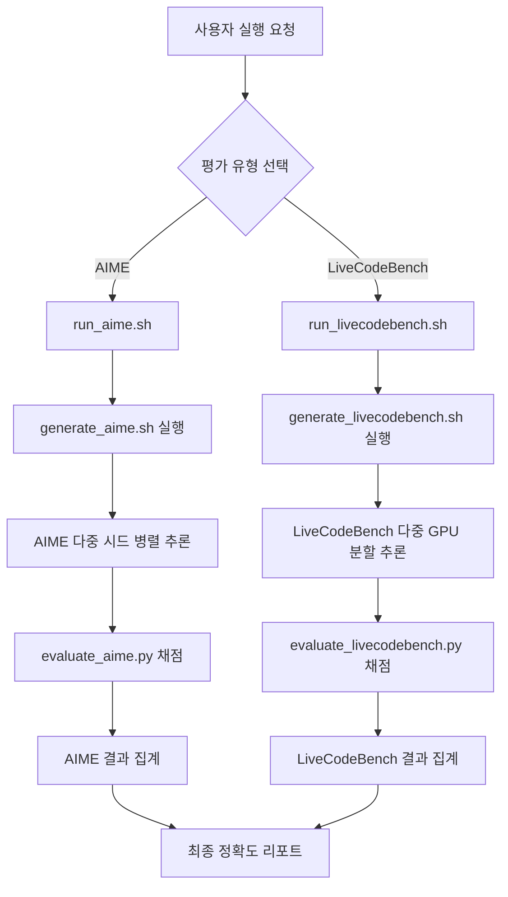
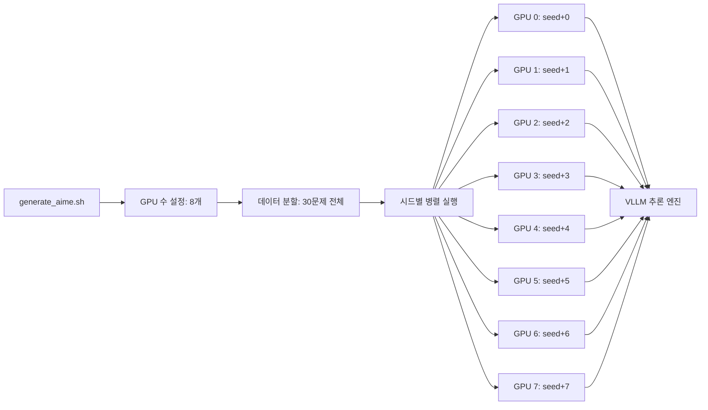
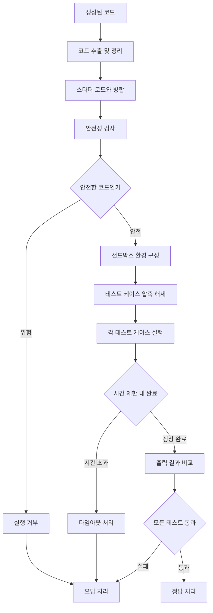

## 📋 문서 개요

본 문서는 **AceReason Evaluation Toolkit**의 전체 동작 과정을 단계별로 상세하게 분석한 자료입니다. 추론부터 채점까지의 전체 파이프라인과 각 컴포넌트의 역할, 채점 방식의 세부사항을 포함합니다.

---

## 🎯 시스템 개요

AceReason Evaluation Toolkit은 다음 두 가지 주요 평가를 수행합니다:

- **AIME (American Invitational Mathematics Examination)**: 고난도 수학 문제 추론 평가
- **LiveCodeBench**: 실시간 코딩 능력 평가

각 평가는 **생성(Generation) → 채점(Evaluation)** 의 2단계 파이프라인으로 구성됩니다.

---

## 🏗️ 전체 아키텍처 플로우


```mermaid
graph TB
    A[사용자 실행 요청] --> B{평가 유형 선택}
    B -->|AIME| C[run_aime.sh]
    B -->|LiveCodeBench| D[run_livecodebench.sh]
    
    C --> E[generate_aime.sh 실행]
    D --> F[generate_livecodebench.sh 실행]
    
    E --> G[AIME 다중 시드 병렬 추론]
    F --> H[LiveCodeBench 다중 GPU 분할 추론]
    
    G --> I[evaluate_aime.py 채점]
    H --> J[evaluate_livecodebench.py 채점]
    
    I --> K[AIME 결과 집계]
    J --> L[LiveCodeBench 결과 집계]
    
    K --> M[최종 정확도 리포트]
    L --> M
```

---

## 🔄 AIME 평가 프로세스 상세 분석

### Phase 1: 추론 생성 단계

#### 1.1 초기 설정 및 시드 분배

```bash
# run_aime.sh에서 모델별 시드 설정
if [ "$MODEL_NAME" == "nvidia/AceReason-Nemotron-7B" ]; then
    seed_list_aime24=(121 131 141 151 161 171 181 191)
    seed_list_aime25=(111 222 333 444 555 666 777 888)
    MODEL_TYPE="r1"
elif [ "$MODEL_NAME" == "nvidia/AceReason-Nemotron-14B" ]; then
    seed_list_aime24=(111 222 333 444 555 666 777 888)
    seed_list_aime25=(111 222 333 444 555 666 777 888)
    MODEL_TYPE="r1"
elif [ "$MODEL_NAME" == "nvidia/AceReason-Nemotron-1.1-7B" ]; then
    seed_list_aime24=(100 200 300 400 500 600 700 800)
    seed_list_aime25=(100 200 300 400 500 600 700 800)
    MODEL_TYPE="qwen"
fi
```

**핵심 특징:**

- **다중 시드**: 8개 서로 다른 시드로 통계적 신뢰성 확보
- **모델별 차별화**: 각 모델에 최적화된 시드 및 템플릿 적용
- **데이터셋 분리**: AIME 2024, AIME 2025 별도 평가

#### 1.2 병렬 추론 실행


```mermaid
graph LR
    A[generate_aime.sh] --> B[GPU 수 설정: 8개]
    B --> C[데이터 분할: 30문제 전체]
    C --> D[시드별 병렬 실행]
    
    D --> E[GPU 0: seed+0]
    D --> F[GPU 1: seed+1]
    D --> G[GPU 2: seed+2]
    D --> H[GPU 3: seed+3]
    D --> I[GPU 4: seed+4]
    D --> J[GPU 5: seed+5]
    D --> K[GPU 6: seed+6]
    D --> L[GPU 7: seed+7]
    
    E --> M[VLLM 추론 엔진]
    F --> M
    G --> M
    H --> M
    I --> M
    J --> M
    K --> M
    L --> M
```

**추론 파라미터:**

```bash
BSZ=30              # 배치 크기: 전체 문제 수
TOTAL=30            # 총 문제 수 (AIME)
GPUS=8              # GPU 수
OUT_SEQ_LEN=32768   # 최대 출력 시퀀스 길이
top_p=0.95          # Nucleus 샘플링
temperature=0.6     # 온도 매개변수
```

#### 1.3 모델별 템플릿 처리

**AceReason r1 모델 (7B, 14B)**:

```python
def apply_r1_template(problem):
    return f"""<|im_start|>user
{problem}
<|im_end|>
<|im_start|>assistant
<think>
{reasoning_process}
</think>

{final_answer}
<|im_end|>"""
```

**AceReason Qwen 모델 (1.1-7B)**:

```python
def apply_qwen_template(problem):
    return f"""<|im_start|>user
{problem}<|im_end|>
<|im_start|>assistant
{response}<|im_end|>"""
```

### Phase 2: 채점 및 평가 단계

#### 2.1 답안 추출 프로세스


<!--
  animated-architecture-diagram — self-contained D3 embed template.
  HuggingFace research-article style: declarative NODES/EDGES/SEQ model,
  data(solid)/event(dashed) edges, hover-trace + tooltip, flow-dot animation
  along edge paths, replay button, scroll-into-view autoplay, reduced-motion +
  light/dark aware. The renderer injects window.__ARCH_SPEC__ at the marker.
  Format (D3 machinery + CSS) is owned by this committed template; the model
  only authors the JSON spec (content). See references/spec-schema.md.
-->
<div class="d3-arch" data-arch-root id="kitcompleteanalysisguide-1"></div>
<style>
  /* ---- Theme tokens (standalone; light default + dark override) ---- */
  .d3-arch {
    --page-bg: #ffffff;
    --surface-bg: #f7f8fa;
    --text-color: #1a1d21;
    --muted-color: #6b7280;
    --border-color: #d5d9e0;
    --primary-color: hsl(217 91% 55%); /* brand accent — swap for #1B4F72 etc. */
    position: relative;
    font-family: -apple-system, BlinkMacSystemFont, "Segoe UI", "Noto Sans KR", system-ui, sans-serif;
    color: var(--text-color);
  }
  @media (prefers-color-scheme: dark) {
    .d3-arch {
      --page-bg: #0f1115;
      --surface-bg: #171a21;
      --text-color: #e6e8eb;
      --muted-color: #9aa3af;
      --border-color: #2a2f3a;
      --primary-color: hsl(217 91% 62%);
    }
  }
  .d3-arch[data-theme="light"] { --page-bg:#fff; --surface-bg:#f7f8fa; --text-color:#1a1d21; --muted-color:#6b7280; --border-color:#d5d9e0; --primary-color:hsl(217 91% 55%); }
  .d3-arch[data-theme="dark"]  { --page-bg:#0f1115; --surface-bg:#171a21; --text-color:#e6e8eb; --muted-color:#9aa3af; --border-color:#2a2f3a; --primary-color:hsl(217 91% 62%); }

  .d3-arch .diagram-scroll { overflow-x: auto; }
  .d3-arch svg { display: block; width: 100%; max-width: 100%; height: auto; font-family: inherit; }

  /* Group boxes */
  .d3-arch .group rect { fill: none; stroke: var(--border-color); stroke-dasharray: 3 3; rx: 12px; }
  .d3-arch .group text { font-size: 10px; font-weight: 700; letter-spacing: 0.08em; text-transform: uppercase; fill: var(--muted-color); }

  /* Nodes */
  .d3-arch .node rect { fill: var(--surface-bg); stroke: var(--border-color); stroke-width: 1; transition: stroke 0.15s ease, opacity 0.15s ease; }
  .d3-arch .node .node-title { font-size: 12px; font-weight: 600; fill: var(--text-color); }
  .d3-arch .node .node-sub { font-size: 9.5px; fill: var(--muted-color); }
  .d3-arch .node { cursor: default; transition: opacity 0.15s ease; }

  /* Edges */
  .d3-arch .edge { transition: opacity 0.15s ease; }
  .d3-arch .edge path.main { fill: none; stroke-width: 1.5; }
  .d3-arch .edge.data path.main { stroke: var(--primary-color); }
  .d3-arch .edge.event path.main { stroke: var(--muted-color); stroke-dasharray: 5 4; }
  .d3-arch .edge text { font-size: 9.5px; fill: var(--muted-color); paint-order: stroke; stroke: var(--page-bg); stroke-width: 3px; stroke-linejoin: round; }

  /* Hover highlighting */
  .d3-arch.hovering .edge:not(.hl) { opacity: 0.12; }
  .d3-arch.hovering .node:not(.hl):not(.nb) { opacity: 0.25; }
  .d3-arch .node.hl rect { stroke: var(--primary-color); stroke-width: 1.5; }

  /* Flow animation */
  .d3-arch .flow-dot.data { fill: var(--primary-color); stroke: var(--page-bg); stroke-width: 1.5; }
  .d3-arch .flow-dot.event { fill: var(--page-bg); stroke: var(--muted-color); stroke-width: 1.5; }
  .d3-arch .node.anim-hl rect { stroke: var(--primary-color); stroke-width: 1.5; }
  .d3-arch .replay-btn { font: inherit; font-size: 11px; font-weight: 600; padding: 4px 10px; border: 1px solid var(--border-color); border-radius: 8px; background: var(--surface-bg); color: var(--text-color); cursor: pointer; transition: border-color 0.15s ease, opacity 0.15s ease; }
  .d3-arch .replay-btn:hover:not(:disabled) { border-color: var(--primary-color); }
  .d3-arch .replay-btn:disabled { opacity: 0.45; cursor: default; }
  .d3-arch .replay-btn:focus-visible { outline: 2px solid var(--primary-color); outline-offset: 1px; }

  /* Legend */
  .d3-arch .legend { display: flex; flex-direction: column; align-items: flex-start; gap: 6px; margin-top: 10px; }
  .d3-arch .legend-title { font-size: 12px; font-weight: 700; color: var(--text-color); }
  .d3-arch .legend .items { display: flex; flex-wrap: wrap; gap: 8px 18px; align-items: center; }
  .d3-arch .legend .item { display: inline-flex; align-items: center; gap: 7px; white-space: nowrap; font-size: 12px; color: var(--text-color); }
  .d3-arch .legend .swatch { width: 22px; height: 0; }
  .d3-arch .legend .swatch.data-line { border-top: 2.5px solid var(--primary-color); }
  .d3-arch .legend .swatch.event-line { border-top: 2.5px dashed var(--muted-color); }
  .d3-arch .legend .hint { font-size: 11px; font-style: italic; color: var(--muted-color); }
</style>
<script>
  (() => {
    const SPEC = ({"title": "", "ariaLabel": "", "width": 884, "height": 1050, "legendTitle": "Legend", "hint": "Hover a node to trace its connections.", "groups": [], "nodes": [{"id": "A", "x": 376, "y": 24, "w": 120, "h": 46, "title": "모델 생성 텍스트"}, {"id": "B", "x": 376, "y": 148, "w": 120, "h": 46, "title": "패턴 매칭 시도"}, {"id": "C", "x": 367, "y": 272, "w": 138, "h": 52, "title": "\\\\boxed{"}, {"id": "D", "x": 724, "y": 848, "w": 128, "h": 46, "title": "LaTeX 박스 내용 추출"}, {"id": "E", "x": 278, "y": 416, "w": 138, "h": 52, "title": "**답** 패턴"}, {"id": "F", "x": 549, "y": 848, "w": 120, "h": 46, "title": "강조 텍스트 추출"}, {"id": "G", "x": 190, "y": 560, "w": 138, "h": 52, "title": "\\\\[...\\\\] 패턴"}, {"id": "H", "x": 374, "y": 848, "w": 120, "h": 46, "title": "수식 환경 추출"}, {"id": "I", "x": 95, "y": 704, "w": 153, "h": 52, "title": "is \\\\(...\\\\) 패턴"}, {"id": "J", "x": 199, "y": 848, "w": 120, "h": 46, "title": "인라인 수식 추출"}, {"id": "K", "x": 24, "y": 848, "w": 120, "h": 46, "title": "추출 실패"}, {"id": "L", "x": 462, "y": 972, "w": 120, "h": 46, "title": "답안 정규화"}], "edges": [{"src": "A", "dst": "B", "kind": "data", "line": [436, 70, 436, 148]}, {"src": "B", "dst": "C", "kind": "data", "line": [436, 194, 436, 272]}, {"src": "C", "dst": "D", "kind": "data", "label": "발견", "curve": [[505, 312], [788, 514], [788, 730], [788, 848]], "off": "50%"}, {"src": "C", "dst": "E", "kind": "data", "label": "미발견", "curve": [[404, 324], [347, 370], [347, 370], [347, 416]], "off": "50%"}, {"src": "E", "dst": "F", "kind": "data", "label": "발견", "curve": [[416, 461], [609, 586], [609, 730], [609, 848]], "off": "50%"}, {"src": "E", "dst": "G", "kind": "data", "label": "미발견", "curve": [[315, 468], [259, 514], [259, 514], [259, 560]], "off": "50%"}, {"src": "G", "dst": "H", "kind": "data", "label": "발견", "curve": [[322, 612], [434, 658], [434, 802], [434, 848]], "off": "50%"}, {"src": "G", "dst": "I", "kind": "data", "label": "미발견", "curve": [[227, 612], [172, 658], [172, 658], [172, 704]], "off": "50%"}, {"src": "I", "dst": "J", "kind": "data", "label": "발견", "curve": [[203, 756], [259, 802], [259, 802], [259, 848]], "off": "50%"}, {"src": "I", "dst": "K", "kind": "data", "label": "미발견", "curve": [[140, 756], [84, 802], [84, 802], [84, 848]], "off": "50%"}, {"src": "D", "dst": "L", "kind": "data", "curve": [[788, 894], [788, 933], [788, 933], [582, 981]]}, {"src": "F", "dst": "L", "kind": "data", "curve": [[609, 894], [609, 933], [609, 933], [554, 972]]}, {"src": "H", "dst": "L", "kind": "data", "curve": [[434, 894], [434, 933], [434, 933], [489, 972]]}, {"src": "J", "dst": "L", "kind": "data", "curve": [[259, 894], [259, 933], [259, 933], [462, 981]]}]});
    const ensureD3 = (cb) => {
      if (window.d3 && typeof window.d3.select === 'function') return cb();
      let s = document.getElementById('d3-cdn-script');
      if (!s) {
        s = document.createElement('script');
        s.id = 'd3-cdn-script';
        s.src = 'https://cdn.jsdelivr.net/npm/d3@7/dist/d3.min.js';
        document.head.appendChild(s);
      }
      const onReady = () => { if (window.d3 && typeof window.d3.select === 'function') cb(); };
      s.addEventListener('load', onReady, { once: true });
      if (window.d3) onReady();
    };

    const bootstrap = () => {
      const container = document.getElementById('kitcompleteanalysisguide-1')
        || document.querySelector('.d3-arch[data-arch-root]:not([data-mounted])');
      if (!container || (container.dataset && container.dataset.mounted === 'true')) return;
      if (container.dataset) container.dataset.mounted = 'true';

      try {
        const uid = 'kitcompleteanalysisguide-1';
        const NODES = SPEC.nodes || [];
        const EDGES = SPEC.edges || [];
        const GROUPS = SPEC.groups || [];
        const HOP = SPEC.hop || 800;
        const legendCfg = SPEC.legend || {};
        const dataLabel = legendCfg.data || 'Data path';
        const eventLabel = legendCfg.event || 'Event side-channel';

        const byId = Object.fromEntries(NODES.map((n) => [n.id, n]));
        const cx = (n) => n.x + n.w / 2;
        const asTitle = (t) => Array.isArray(t) ? t : [t];

        // Canvas: explicit, else auto from node/group extents + padding
        let W = SPEC.width, H = SPEC.height;
        if (!W || !H) {
          const xs = [], ys = [];
          NODES.forEach((n) => { xs.push(n.x + n.w); ys.push(n.y + n.h); });
          GROUPS.forEach((g) => { xs.push(g.x + g.w); ys.push(g.y + g.h); });
          W = W || Math.max(760, Math.ceil(Math.max(...xs, 0) + 24));
          H = H || Math.ceil(Math.max(...ys, 0) + 20);
        }

        // Tooltip
        container.style.position = container.style.position || 'relative';
        const tip = document.createElement('div');
        Object.assign(tip.style, {
          position: 'absolute', top: '0px', left: '0px',
          transform: 'translate(-9999px, -9999px)', pointerEvents: 'none',
          padding: '8px 10px', borderRadius: '8px', fontSize: '12px', lineHeight: '1.4',
          border: '1px solid var(--border-color)', background: 'var(--surface-bg)',
          color: 'var(--text-color)', boxShadow: '0 4px 24px rgba(0,0,0,.18)',
          opacity: '0', transition: 'opacity .12s ease', maxWidth: '260px', zIndex: '3'
        });
        const tipInner = document.createElement('div');
        tip.appendChild(tipInner);

        const scroll = document.createElement('div');
        scroll.className = 'diagram-scroll';
        container.appendChild(scroll);

        const svg = d3.select(scroll).append('svg')
          .attr('viewBox', `0 0 ${W} ${H}`)
          .attr('preserveAspectRatio', 'xMidYMid meet')
          .attr('role', 'img')
          .attr('aria-label', SPEC.ariaLabel || SPEC.title || 'Architecture diagram');
        svg.style('max-width', W + 'px').style('min-width', Math.min(W, 760) + 'px').style('margin', '0 auto');

        const defs = svg.append('defs');
        const mkMarker = (id, color) => {
          defs.append('marker')
            .attr('id', id).attr('viewBox', '0 0 10 10')
            .attr('refX', 9).attr('refY', 5)
            .attr('markerWidth', 6.5).attr('markerHeight', 6.5)
            .attr('orient', 'auto-start-reverse')
            .append('path').attr('d', 'M 0 0 L 10 5 L 0 10 z').style('fill', color);
        };
        mkMarker(`${uid}-arrow-data`, 'var(--primary-color)');
        mkMarker(`${uid}-arrow-event`, 'var(--muted-color)');

        // Groups
        const groups = svg.append('g');
        GROUPS.forEach((gr) => {
          const g = groups.append('g').attr('class', 'group');
          g.append('rect').attr('x', gr.x).attr('y', gr.y).attr('width', gr.w).attr('height', gr.h).attr('rx', 12);
          if (gr.label) g.append('text').attr('x', gr.lx != null ? gr.lx : gr.x + 12).attr('y', gr.ly != null ? gr.ly : gr.y + 18).text(gr.label);
        });

        // Edges (under nodes)
        const edgeLayer = svg.append('g');
        const curvePath = (p) => `M ${p[0][0]} ${p[0][1]} C ${p[1][0]} ${p[1][1]}, ${p[2][0]} ${p[2][1]}, ${p[3][0]} ${p[3][1]}`;
        EDGES.forEach((e, i) => {
          const kind = e.kind === 'event' ? 'event' : 'data';
          const g = edgeLayer.append('g').attr('class', `edge ${kind}`).attr('data-src', e.src).attr('data-dst', e.dst);
          const marker = `url(#${uid}-arrow-${kind})`;
          if (e.line) {
            const [x1, y1, x2, y2] = e.line;
            e.pathEl = g.append('path').attr('class', 'main').attr('d', `M ${x1} ${y1} L ${x2} ${y2}`).attr('marker-end', marker).node();
            if (e.label) g.append('text').attr('x', e.lx != null ? e.lx : (x1 + x2) / 2).attr('y', e.ly != null ? e.ly : (y1 + y2) / 2 - 6).attr('text-anchor', e.anchor || 'middle').text(e.label);
          } else if (e.curve) {
            e.pathEl = g.append('path').attr('class', 'main').attr('d', curvePath(e.curve)).attr('marker-end', marker).node();
            if (e.label && e.off) {
              const p = e.curve;
              const lp = p[3][0] < p[0][0] ? [p[3], p[2], p[1], p[0]] : p;
              const lpId = `${uid}-lbl-${i}`;
              g.append('path').attr('id', lpId).attr('d', curvePath(lp)).attr('fill', 'none').attr('stroke', 'none');
              g.append('text').attr('dy', -5).append('textPath').attr('href', `#${lpId}`).attr('startOffset', e.off).attr('text-anchor', 'middle').text(e.label);
            } else if (e.label) {
              g.append('text').attr('x', e.lx).attr('y', e.ly).attr('text-anchor', e.anchor || 'start').text(e.label);
            }
          }
        });

        // Nodes (over edges)
        const nodeLayer = svg.append('g');
        NODES.forEach((n) => {
          const g = nodeLayer.append('g').attr('class', 'node').attr('data-id', n.id);
          g.append('rect').attr('x', n.x).attr('y', n.y).attr('width', n.w).attr('height', n.h).attr('rx', 9);
          const title = asTitle(n.title);
          const lines = title.length;
          const baseY = n.y + n.h / 2 - (lines - 1) * 7 - (n.sub ? 5 : -4);
          title.forEach((t, li) => {
            g.append('text').attr('class', 'node-title').attr('x', cx(n)).attr('y', baseY + li * 14).attr('text-anchor', 'middle').text(t);
          });
          if (n.sub) g.append('text').attr('class', 'node-sub').attr('x', cx(n)).attr('y', baseY + (lines - 1) * 14 + 15).attr('text-anchor', 'middle').text(n.sub);
        });

        // Hover highlighting
        const edgeSel = svg.selectAll('.edge');
        const nodeSel = svg.selectAll('.node');
        nodeSel
          .on('mouseenter', function () {
            const id = this.getAttribute('data-id');
            const n = byId[id];
            container.classList.add('hovering');
            const nb = new Set([id]);
            edgeSel.classed('hl', function () {
              const hit = this.getAttribute('data-src') === id || this.getAttribute('data-dst') === id;
              if (hit) { nb.add(this.getAttribute('data-src')); nb.add(this.getAttribute('data-dst')); }
              return hit;
            });
            nodeSel.classed('hl', function () { return this.getAttribute('data-id') === id; })
                   .classed('nb', function () { return nb.has(this.getAttribute('data-id')); });
            if (n && n.desc) { tipInner.innerHTML = `<strong>${asTitle(n.title).join('')}</strong><br>${n.desc}`; tip.style.opacity = '1'; }
          })
          .on('mousemove', function (event) {
            const [mx, my] = d3.pointer(event, container);
            const flip = mx > container.clientWidth - 280;
            tip.style.transform = `translate(${flip ? mx - 270 : mx + 14}px, ${my + 14}px)`;
          })
          .on('mouseleave', function () {
            container.classList.remove('hovering');
            edgeSel.classed('hl', false);
            nodeSel.classed('hl', false).classed('nb', false);
            tip.style.opacity = '0';
            tip.style.transform = 'translate(-9999px, -9999px)';
          });

        // Flow animation sequence: explicit SEQ, else auto forward-cascade of data edges
        const resolveEdge = (s) => {
          if (typeof s.e === 'number') return s.e;
          if (s.from && s.to) return EDGES.findIndex((e) => e.src === s.from && e.dst === s.to);
          return -1;
        };
        let SEQ = (SPEC.seq || []).map((s) => ({ e: resolveEdge(s), t0: s.t0 })).filter((s) => s.e >= 0);
        if (!SEQ.length) {
          let t = 0;
          EDGES.forEach((e, i) => { if ((e.kind || 'data') === 'data') { SEQ.push({ e: i, t0: t }); t += HOP; } });
        }
        const TOTAL = SPEC.total || (Math.max(0, ...SEQ.map((s) => s.t0)) + HOP + 800);

        let playing = false, replayBtn = null;
        const pulseNode = (id) => {
          const sel = nodeSel.filter(function () { return this.getAttribute('data-id') === id; });
          sel.classed('anim-hl', true);
          setTimeout(() => sel.classed('anim-hl', false), 550);
        };
        const play = () => {
          if (playing) return;
          playing = true;
          if (replayBtn) replayBtn.disabled = true;
          const layer = svg.append('g');
          const steps = SEQ.map((s) => {
            const edge = EDGES[s.e];
            return { ...s, edge, len: edge.pathEl.getTotalLength(), dot: null, arrived: false };
          });
          const start = performance.now();
          const frame = (now) => {
            const t = now - start;
            steps.forEach((s) => {
              if (t < s.t0) return;
              const f = Math.min(1, (t - s.t0) / HOP);
              if (f >= 1) { if (s.dot) { s.dot.remove(); s.dot = null; } if (!s.arrived) { s.arrived = true; pulseNode(s.edge.dst); } return; }
              if (!s.dot) s.dot = layer.append('circle').attr('class', `flow-dot ${s.edge.kind || 'data'}`).attr('r', (s.edge.kind === 'event') ? 4 : 5);
              const p = s.edge.pathEl.getPointAtLength(d3.easeCubicInOut(f) * s.len);
              s.dot.attr('cx', p.x).attr('cy', p.y);
            });
            if (t < TOTAL) requestAnimationFrame(frame);
            else { layer.remove(); playing = false; if (replayBtn) replayBtn.disabled = false; }
          };
          requestAnimationFrame(frame);
        };

        // Legend
        const legend = document.createElement('div');
        legend.className = 'legend';
        legend.innerHTML = `
          <div class="legend-title">${SPEC.legendTitle || 'Legend'}</div>
          <div class="items">
            <span class="item"><span class="swatch data-line"></span><span>${dataLabel}</span></span>
            <span class="item"><span class="swatch event-line"></span><span>${eventLabel}</span></span>
            <button class="replay-btn" type="button" aria-label="Replay the flow animation">&#9654; Replay</button>
            <span class="hint">${SPEC.hint || 'Hover a component to trace its connections.'}</span>
          </div>`;
        container.appendChild(legend);
        container.appendChild(tip);
        replayBtn = legend.querySelector('.replay-btn');
        replayBtn.addEventListener('click', play);

        const prefersReduced = window.matchMedia && window.matchMedia('(prefers-reduced-motion: reduce)').matches;
        if (!prefersReduced && window.IntersectionObserver) {
          const io = new IntersectionObserver((entries) => {
            entries.forEach((en) => { if (en.isIntersecting) { io.disconnect(); play(); } });
          }, { threshold: 0.5 });
          io.observe(container);
        }
      } catch (err) {
        const pre = document.createElement('pre');
        pre.style.color = '#c0392b';
        pre.style.fontSize = '12px';
        pre.textContent = 'Failed to render architecture diagram: ' + (err && err.message ? err.message : err);
        container.appendChild(pre);
      }
    };

    if (document.readyState === 'loading') document.addEventListener('DOMContentLoaded', () => ensureD3(bootstrap), { once: true });
    else ensureD3(bootstrap);
  })();
</script>


**패턴 매칭 순서:**

1. `\\boxed{((?:[^{}]|\\{(?:[^{}]|\\{[^{}]*\\})*\\})*)}` - LaTeX boxed 형식
2. `\\*\\*(.*?)\\*\\*` - 마크다운 강조 형식
3. `\\\\\\[\\n(.*?)\\n\\\\\\]` - LaTeX 수식 환경
4. `is \\\\\\((.*?)\\\\\\)` - 인라인 수식
5. `\\\\\\[\\\\n(.*?)\\\\n\\\\\\]` - 대체 수식 환경

#### 2.2 답안 정규화 (math_answer_cleaning)

```python
def math_answer_cleaning(answer):
    # 1. \\text{} 래핑 제거
    extracted_content = is_completely_wrapped_by_text(answer)
    answer = extracted_content if extracted_content else answer
    
    # 2. 수학 표기 정규화
    answer = answer.replace(",\\!", "").replace("{,}", "").replace("\\$", "")
    answer = answer.replace("dfrac{", "frac{").replace("tfrac{", "frac{")
    answer = answer.replace("^\\circ", "").replace("^{\\circ}", "")
    
    # 3. 불필요한 텍스트 제거
    answer = answer.replace("\\quad", "")
    answer = re.sub(r'\\\\,\\\\text\\{.*?\\}', '', answer)
    answer = re.sub(r'\\\\text\\{.*?\\}', '', answer)
    
    # 4. 지수 표기 정규화
    answer = re.sub(r'([+-]?\\d*\\.?\\d+)[\\\\]times10\\^{([+-]?\\d+)}', r'\\1e\\2', answer)
    answer = re.sub(r'([+-]?\\d*\\.?\\d+)[\\\\]times10\\^([+-]?\\d+)', r'\\1e\\2', answer)
    
    # 5. 함수 표기 처리 (f(x)=ax+b → ax+b)
    func_pattern = r'^[a-zA-Z_]\\w*\\([a-zA-Z_]\\w*\\)$'
    if "=" in answer and (re.match(func_pattern, answer.split("=")[0]) or len(answer.split("=")[0])<=3):
        answer = answer.split("=", 1)[1]
    
    return answer.lower().replace(" ", "").replace("\\n", "").replace(",", "")
```

#### 2.3 수학적 동치성 검증


<!--
  animated-architecture-diagram — self-contained D3 embed template.
  HuggingFace research-article style: declarative NODES/EDGES/SEQ model,
  data(solid)/event(dashed) edges, hover-trace + tooltip, flow-dot animation
  along edge paths, replay button, scroll-into-view autoplay, reduced-motion +
  light/dark aware. The renderer injects window.__ARCH_SPEC__ at the marker.
  Format (D3 machinery + CSS) is owned by this committed template; the model
  only authors the JSON spec (content). See references/spec-schema.md.
-->
<div class="d3-arch" data-arch-root id="kitcompleteanalysisguide-2"></div>
<style>
  /* ---- Theme tokens (standalone; light default + dark override) ---- */
  .d3-arch {
    --page-bg: #ffffff;
    --surface-bg: #f7f8fa;
    --text-color: #1a1d21;
    --muted-color: #6b7280;
    --border-color: #d5d9e0;
    --primary-color: hsl(217 91% 55%); /* brand accent — swap for #1B4F72 etc. */
    position: relative;
    font-family: -apple-system, BlinkMacSystemFont, "Segoe UI", "Noto Sans KR", system-ui, sans-serif;
    color: var(--text-color);
  }
  @media (prefers-color-scheme: dark) {
    .d3-arch {
      --page-bg: #0f1115;
      --surface-bg: #171a21;
      --text-color: #e6e8eb;
      --muted-color: #9aa3af;
      --border-color: #2a2f3a;
      --primary-color: hsl(217 91% 62%);
    }
  }
  .d3-arch[data-theme="light"] { --page-bg:#fff; --surface-bg:#f7f8fa; --text-color:#1a1d21; --muted-color:#6b7280; --border-color:#d5d9e0; --primary-color:hsl(217 91% 55%); }
  .d3-arch[data-theme="dark"]  { --page-bg:#0f1115; --surface-bg:#171a21; --text-color:#e6e8eb; --muted-color:#9aa3af; --border-color:#2a2f3a; --primary-color:hsl(217 91% 62%); }

  .d3-arch .diagram-scroll { overflow-x: auto; }
  .d3-arch svg { display: block; width: 100%; max-width: 100%; height: auto; font-family: inherit; }

  /* Group boxes */
  .d3-arch .group rect { fill: none; stroke: var(--border-color); stroke-dasharray: 3 3; rx: 12px; }
  .d3-arch .group text { font-size: 10px; font-weight: 700; letter-spacing: 0.08em; text-transform: uppercase; fill: var(--muted-color); }

  /* Nodes */
  .d3-arch .node rect { fill: var(--surface-bg); stroke: var(--border-color); stroke-width: 1; transition: stroke 0.15s ease, opacity 0.15s ease; }
  .d3-arch .node .node-title { font-size: 12px; font-weight: 600; fill: var(--text-color); }
  .d3-arch .node .node-sub { font-size: 9.5px; fill: var(--muted-color); }
  .d3-arch .node { cursor: default; transition: opacity 0.15s ease; }

  /* Edges */
  .d3-arch .edge { transition: opacity 0.15s ease; }
  .d3-arch .edge path.main { fill: none; stroke-width: 1.5; }
  .d3-arch .edge.data path.main { stroke: var(--primary-color); }
  .d3-arch .edge.event path.main { stroke: var(--muted-color); stroke-dasharray: 5 4; }
  .d3-arch .edge text { font-size: 9.5px; fill: var(--muted-color); paint-order: stroke; stroke: var(--page-bg); stroke-width: 3px; stroke-linejoin: round; }

  /* Hover highlighting */
  .d3-arch.hovering .edge:not(.hl) { opacity: 0.12; }
  .d3-arch.hovering .node:not(.hl):not(.nb) { opacity: 0.25; }
  .d3-arch .node.hl rect { stroke: var(--primary-color); stroke-width: 1.5; }

  /* Flow animation */
  .d3-arch .flow-dot.data { fill: var(--primary-color); stroke: var(--page-bg); stroke-width: 1.5; }
  .d3-arch .flow-dot.event { fill: var(--page-bg); stroke: var(--muted-color); stroke-width: 1.5; }
  .d3-arch .node.anim-hl rect { stroke: var(--primary-color); stroke-width: 1.5; }
  .d3-arch .replay-btn { font: inherit; font-size: 11px; font-weight: 600; padding: 4px 10px; border: 1px solid var(--border-color); border-radius: 8px; background: var(--surface-bg); color: var(--text-color); cursor: pointer; transition: border-color 0.15s ease, opacity 0.15s ease; }
  .d3-arch .replay-btn:hover:not(:disabled) { border-color: var(--primary-color); }
  .d3-arch .replay-btn:disabled { opacity: 0.45; cursor: default; }
  .d3-arch .replay-btn:focus-visible { outline: 2px solid var(--primary-color); outline-offset: 1px; }

  /* Legend */
  .d3-arch .legend { display: flex; flex-direction: column; align-items: flex-start; gap: 6px; margin-top: 10px; }
  .d3-arch .legend-title { font-size: 12px; font-weight: 700; color: var(--text-color); }
  .d3-arch .legend .items { display: flex; flex-wrap: wrap; gap: 8px 18px; align-items: center; }
  .d3-arch .legend .item { display: inline-flex; align-items: center; gap: 7px; white-space: nowrap; font-size: 12px; color: var(--text-color); }
  .d3-arch .legend .swatch { width: 22px; height: 0; }
  .d3-arch .legend .swatch.data-line { border-top: 2.5px solid var(--primary-color); }
  .d3-arch .legend .swatch.event-line { border-top: 2.5px dashed var(--muted-color); }
  .d3-arch .legend .hint { font-size: 11px; font-style: italic; color: var(--muted-color); }
</style>
<script>
  (() => {
    const SPEC = ({"title": "", "ariaLabel": "", "width": 493, "height": 1050, "legendTitle": "Legend", "hint": "Hover a node to trace its connections.", "groups": [], "nodes": [{"id": "A", "x": 184, "y": 24, "w": 120, "h": 46, "title": "정규화된 답안"}, {"id": "B", "x": 175, "y": 148, "w": 138, "h": 52, "title": "문자열 완전 일치"}, {"id": "C", "x": 328, "y": 972, "w": 120, "h": 46, "title": "True 반환"}, {"id": "D", "x": 122, "y": 292, "w": 138, "h": 52, "title": "숫자 형식 검사"}, {"id": "E", "x": 288, "y": 704, "w": 120, "h": 46, "title": "수치적 동치성 검사"}, {"id": "F", "x": 25, "y": 436, "w": 138, "h": 52, "title": "SymPy 파싱 가능"}, {"id": "G", "x": 95, "y": 580, "w": 120, "h": 46, "title": "기호적 동치성 검사"}, {"id": "H", "x": 51, "y": 972, "w": 120, "h": 46, "title": "False 반환"}, {"id": "I", "x": 279, "y": 828, "w": 138, "h": 52, "title": "오차 범위 내 일치"}, {"id": "J", "x": 81, "y": 704, "w": 149, "h": 46, "title": "SymPy simplify 적용"}, {"id": "K", "x": 86, "y": 828, "w": 138, "h": 52, "title": "차이가 0인가"}], "edges": [{"src": "A", "dst": "B", "kind": "data", "line": [244, 70, 244, 148]}, {"src": "B", "dst": "C", "kind": "data", "label": "일치", "curve": [[313, 198], [455, 462], [455, 727], [410, 972]], "off": "50%"}, {"src": "B", "dst": "D", "kind": "data", "label": "불일치", "curve": [[225, 200], [191, 246], [191, 246], [191, 292]], "off": "50%"}, {"src": "D", "dst": "E", "kind": "data", "label": "둘 다 숫자", "curve": [[248, 344], [348, 462], [348, 603], [348, 704]], "off": "50%"}, {"src": "D", "dst": "F", "kind": "data", "label": "문자 포함", "curve": [[156, 344], [94, 390], [94, 390], [94, 436]], "off": "50%"}, {"src": "F", "dst": "G", "kind": "data", "label": "가능", "curve": [[116, 488], [155, 534], [155, 534], [155, 580]], "off": "50%"}, {"src": "F", "dst": "H", "kind": "data", "label": "불가능", "curve": [[72, 488], [34, 665], [34, 854], [85, 972]], "off": "50%"}, {"src": "E", "dst": "I", "kind": "data", "line": [348, 750, 348, 828]}, {"src": "I", "dst": "C", "kind": "data", "label": "일치", "curve": [[363, 880], [388, 926], [388, 926], [388, 972]], "off": "50%"}, {"src": "I", "dst": "H", "kind": "data", "label": "불일치", "curve": [[319, 880], [269, 926], [269, 926], [163, 972]], "off": "50%"}, {"src": "G", "dst": "J", "kind": "data", "line": [155, 626, 155, 704]}, {"src": "J", "dst": "K", "kind": "data", "line": [155, 750, 155, 828]}, {"src": "K", "dst": "C", "kind": "data", "label": "0", "curve": [[184, 880], [235, 926], [235, 926], [337, 972]], "off": "50%"}, {"src": "K", "dst": "H", "kind": "data", "label": "0 아님", "curve": [[139, 880], [111, 926], [111, 926], [111, 972]], "off": "50%"}]});
    const ensureD3 = (cb) => {
      if (window.d3 && typeof window.d3.select === 'function') return cb();
      let s = document.getElementById('d3-cdn-script');
      if (!s) {
        s = document.createElement('script');
        s.id = 'd3-cdn-script';
        s.src = 'https://cdn.jsdelivr.net/npm/d3@7/dist/d3.min.js';
        document.head.appendChild(s);
      }
      const onReady = () => { if (window.d3 && typeof window.d3.select === 'function') cb(); };
      s.addEventListener('load', onReady, { once: true });
      if (window.d3) onReady();
    };

    const bootstrap = () => {
      const container = document.getElementById('kitcompleteanalysisguide-2')
        || document.querySelector('.d3-arch[data-arch-root]:not([data-mounted])');
      if (!container || (container.dataset && container.dataset.mounted === 'true')) return;
      if (container.dataset) container.dataset.mounted = 'true';

      try {
        const uid = 'kitcompleteanalysisguide-2';
        const NODES = SPEC.nodes || [];
        const EDGES = SPEC.edges || [];
        const GROUPS = SPEC.groups || [];
        const HOP = SPEC.hop || 800;
        const legendCfg = SPEC.legend || {};
        const dataLabel = legendCfg.data || 'Data path';
        const eventLabel = legendCfg.event || 'Event side-channel';

        const byId = Object.fromEntries(NODES.map((n) => [n.id, n]));
        const cx = (n) => n.x + n.w / 2;
        const asTitle = (t) => Array.isArray(t) ? t : [t];

        // Canvas: explicit, else auto from node/group extents + padding
        let W = SPEC.width, H = SPEC.height;
        if (!W || !H) {
          const xs = [], ys = [];
          NODES.forEach((n) => { xs.push(n.x + n.w); ys.push(n.y + n.h); });
          GROUPS.forEach((g) => { xs.push(g.x + g.w); ys.push(g.y + g.h); });
          W = W || Math.max(760, Math.ceil(Math.max(...xs, 0) + 24));
          H = H || Math.ceil(Math.max(...ys, 0) + 20);
        }

        // Tooltip
        container.style.position = container.style.position || 'relative';
        const tip = document.createElement('div');
        Object.assign(tip.style, {
          position: 'absolute', top: '0px', left: '0px',
          transform: 'translate(-9999px, -9999px)', pointerEvents: 'none',
          padding: '8px 10px', borderRadius: '8px', fontSize: '12px', lineHeight: '1.4',
          border: '1px solid var(--border-color)', background: 'var(--surface-bg)',
          color: 'var(--text-color)', boxShadow: '0 4px 24px rgba(0,0,0,.18)',
          opacity: '0', transition: 'opacity .12s ease', maxWidth: '260px', zIndex: '3'
        });
        const tipInner = document.createElement('div');
        tip.appendChild(tipInner);

        const scroll = document.createElement('div');
        scroll.className = 'diagram-scroll';
        container.appendChild(scroll);

        const svg = d3.select(scroll).append('svg')
          .attr('viewBox', `0 0 ${W} ${H}`)
          .attr('preserveAspectRatio', 'xMidYMid meet')
          .attr('role', 'img')
          .attr('aria-label', SPEC.ariaLabel || SPEC.title || 'Architecture diagram');
        svg.style('max-width', W + 'px').style('min-width', Math.min(W, 760) + 'px').style('margin', '0 auto');

        const defs = svg.append('defs');
        const mkMarker = (id, color) => {
          defs.append('marker')
            .attr('id', id).attr('viewBox', '0 0 10 10')
            .attr('refX', 9).attr('refY', 5)
            .attr('markerWidth', 6.5).attr('markerHeight', 6.5)
            .attr('orient', 'auto-start-reverse')
            .append('path').attr('d', 'M 0 0 L 10 5 L 0 10 z').style('fill', color);
        };
        mkMarker(`${uid}-arrow-data`, 'var(--primary-color)');
        mkMarker(`${uid}-arrow-event`, 'var(--muted-color)');

        // Groups
        const groups = svg.append('g');
        GROUPS.forEach((gr) => {
          const g = groups.append('g').attr('class', 'group');
          g.append('rect').attr('x', gr.x).attr('y', gr.y).attr('width', gr.w).attr('height', gr.h).attr('rx', 12);
          if (gr.label) g.append('text').attr('x', gr.lx != null ? gr.lx : gr.x + 12).attr('y', gr.ly != null ? gr.ly : gr.y + 18).text(gr.label);
        });

        // Edges (under nodes)
        const edgeLayer = svg.append('g');
        const curvePath = (p) => `M ${p[0][0]} ${p[0][1]} C ${p[1][0]} ${p[1][1]}, ${p[2][0]} ${p[2][1]}, ${p[3][0]} ${p[3][1]}`;
        EDGES.forEach((e, i) => {
          const kind = e.kind === 'event' ? 'event' : 'data';
          const g = edgeLayer.append('g').attr('class', `edge ${kind}`).attr('data-src', e.src).attr('data-dst', e.dst);
          const marker = `url(#${uid}-arrow-${kind})`;
          if (e.line) {
            const [x1, y1, x2, y2] = e.line;
            e.pathEl = g.append('path').attr('class', 'main').attr('d', `M ${x1} ${y1} L ${x2} ${y2}`).attr('marker-end', marker).node();
            if (e.label) g.append('text').attr('x', e.lx != null ? e.lx : (x1 + x2) / 2).attr('y', e.ly != null ? e.ly : (y1 + y2) / 2 - 6).attr('text-anchor', e.anchor || 'middle').text(e.label);
          } else if (e.curve) {
            e.pathEl = g.append('path').attr('class', 'main').attr('d', curvePath(e.curve)).attr('marker-end', marker).node();
            if (e.label && e.off) {
              const p = e.curve;
              const lp = p[3][0] < p[0][0] ? [p[3], p[2], p[1], p[0]] : p;
              const lpId = `${uid}-lbl-${i}`;
              g.append('path').attr('id', lpId).attr('d', curvePath(lp)).attr('fill', 'none').attr('stroke', 'none');
              g.append('text').attr('dy', -5).append('textPath').attr('href', `#${lpId}`).attr('startOffset', e.off).attr('text-anchor', 'middle').text(e.label);
            } else if (e.label) {
              g.append('text').attr('x', e.lx).attr('y', e.ly).attr('text-anchor', e.anchor || 'start').text(e.label);
            }
          }
        });

        // Nodes (over edges)
        const nodeLayer = svg.append('g');
        NODES.forEach((n) => {
          const g = nodeLayer.append('g').attr('class', 'node').attr('data-id', n.id);
          g.append('rect').attr('x', n.x).attr('y', n.y).attr('width', n.w).attr('height', n.h).attr('rx', 9);
          const title = asTitle(n.title);
          const lines = title.length;
          const baseY = n.y + n.h / 2 - (lines - 1) * 7 - (n.sub ? 5 : -4);
          title.forEach((t, li) => {
            g.append('text').attr('class', 'node-title').attr('x', cx(n)).attr('y', baseY + li * 14).attr('text-anchor', 'middle').text(t);
          });
          if (n.sub) g.append('text').attr('class', 'node-sub').attr('x', cx(n)).attr('y', baseY + (lines - 1) * 14 + 15).attr('text-anchor', 'middle').text(n.sub);
        });

        // Hover highlighting
        const edgeSel = svg.selectAll('.edge');
        const nodeSel = svg.selectAll('.node');
        nodeSel
          .on('mouseenter', function () {
            const id = this.getAttribute('data-id');
            const n = byId[id];
            container.classList.add('hovering');
            const nb = new Set([id]);
            edgeSel.classed('hl', function () {
              const hit = this.getAttribute('data-src') === id || this.getAttribute('data-dst') === id;
              if (hit) { nb.add(this.getAttribute('data-src')); nb.add(this.getAttribute('data-dst')); }
              return hit;
            });
            nodeSel.classed('hl', function () { return this.getAttribute('data-id') === id; })
                   .classed('nb', function () { return nb.has(this.getAttribute('data-id')); });
            if (n && n.desc) { tipInner.innerHTML = `<strong>${asTitle(n.title).join('')}</strong><br>${n.desc}`; tip.style.opacity = '1'; }
          })
          .on('mousemove', function (event) {
            const [mx, my] = d3.pointer(event, container);
            const flip = mx > container.clientWidth - 280;
            tip.style.transform = `translate(${flip ? mx - 270 : mx + 14}px, ${my + 14}px)`;
          })
          .on('mouseleave', function () {
            container.classList.remove('hovering');
            edgeSel.classed('hl', false);
            nodeSel.classed('hl', false).classed('nb', false);
            tip.style.opacity = '0';
            tip.style.transform = 'translate(-9999px, -9999px)';
          });

        // Flow animation sequence: explicit SEQ, else auto forward-cascade of data edges
        const resolveEdge = (s) => {
          if (typeof s.e === 'number') return s.e;
          if (s.from && s.to) return EDGES.findIndex((e) => e.src === s.from && e.dst === s.to);
          return -1;
        };
        let SEQ = (SPEC.seq || []).map((s) => ({ e: resolveEdge(s), t0: s.t0 })).filter((s) => s.e >= 0);
        if (!SEQ.length) {
          let t = 0;
          EDGES.forEach((e, i) => { if ((e.kind || 'data') === 'data') { SEQ.push({ e: i, t0: t }); t += HOP; } });
        }
        const TOTAL = SPEC.total || (Math.max(0, ...SEQ.map((s) => s.t0)) + HOP + 800);

        let playing = false, replayBtn = null;
        const pulseNode = (id) => {
          const sel = nodeSel.filter(function () { return this.getAttribute('data-id') === id; });
          sel.classed('anim-hl', true);
          setTimeout(() => sel.classed('anim-hl', false), 550);
        };
        const play = () => {
          if (playing) return;
          playing = true;
          if (replayBtn) replayBtn.disabled = true;
          const layer = svg.append('g');
          const steps = SEQ.map((s) => {
            const edge = EDGES[s.e];
            return { ...s, edge, len: edge.pathEl.getTotalLength(), dot: null, arrived: false };
          });
          const start = performance.now();
          const frame = (now) => {
            const t = now - start;
            steps.forEach((s) => {
              if (t < s.t0) return;
              const f = Math.min(1, (t - s.t0) / HOP);
              if (f >= 1) { if (s.dot) { s.dot.remove(); s.dot = null; } if (!s.arrived) { s.arrived = true; pulseNode(s.edge.dst); } return; }
              if (!s.dot) s.dot = layer.append('circle').attr('class', `flow-dot ${s.edge.kind || 'data'}`).attr('r', (s.edge.kind === 'event') ? 4 : 5);
              const p = s.edge.pathEl.getPointAtLength(d3.easeCubicInOut(f) * s.len);
              s.dot.attr('cx', p.x).attr('cy', p.y);
            });
            if (t < TOTAL) requestAnimationFrame(frame);
            else { layer.remove(); playing = false; if (replayBtn) replayBtn.disabled = false; }
          };
          requestAnimationFrame(frame);
        };

        // Legend
        const legend = document.createElement('div');
        legend.className = 'legend';
        legend.innerHTML = `
          <div class="legend-title">${SPEC.legendTitle || 'Legend'}</div>
          <div class="items">
            <span class="item"><span class="swatch data-line"></span><span>${dataLabel}</span></span>
            <span class="item"><span class="swatch event-line"></span><span>${eventLabel}</span></span>
            <button class="replay-btn" type="button" aria-label="Replay the flow animation">&#9654; Replay</button>
            <span class="hint">${SPEC.hint || 'Hover a component to trace its connections.'}</span>
          </div>`;
        container.appendChild(legend);
        container.appendChild(tip);
        replayBtn = legend.querySelector('.replay-btn');
        replayBtn.addEventListener('click', play);

        const prefersReduced = window.matchMedia && window.matchMedia('(prefers-reduced-motion: reduce)').matches;
        if (!prefersReduced && window.IntersectionObserver) {
          const io = new IntersectionObserver((entries) => {
            entries.forEach((en) => { if (en.isIntersecting) { io.disconnect(); play(); } });
          }, { threshold: 0.5 });
          io.observe(container);
        }
      } catch (err) {
        const pre = document.createElement('pre');
        pre.style.color = '#c0392b';
        pre.style.fontSize = '12px';
        pre.textContent = 'Failed to render architecture diagram: ' + (err && err.message ? err.message : err);
        container.appendChild(pre);
      }
    };

    if (document.readyState === 'loading') document.addEventListener('DOMContentLoaded', () => ensureD3(bootstrap), { once: true });
    else ensureD3(bootstrap);
  })();
</script>


**수치적 동치성 검사:**

```python
def numeric_equal(prediction: float, reference: float):
    return isclose(prediction, reference, rel_tol=1e-4, abs_tol=1e-6)
```

**기호적 동치성 검사:**

```python
def symbolic_equal(a, b):
    try:
        # LaTeX → SymPy 변환
        expr_a = latex2sympy(a) if '\\' in a else parse_expr(a)
        expr_b = latex2sympy(b) if '\\' in b else parse_expr(b)
        
        # 차이가 0인지 확인
        return simplify(expr_a - expr_b) == 0
    except:
        return False
```

#### 2.4 다중 시드 결과 집계

```python
def get_answer_by_majority_voting(output_list):
    """다수결 투표로 최종 답안 결정"""
    extracted_answers = []
    for output in output_list:
        answer = extract_answer(output)
        if answer: extracted_answers.append(answer)
    
    if not extracted_answers:
        return None
    
    # 가장 빈번한 답안 선택
    counter = Counter(extracted_answers)
    return counter.most_common(1)[0][0]
```

---

## 🚀 LiveCodeBench 평가 프로세스 상세 분석

### Phase 1: 추론 생성 단계

#### 1.1 데이터 분할 및 병렬 처리

```bash
# generate_livecodebench.sh에서 데이터 분할
BSZ=132           # 배치 크기
TOTAL=1055        # 총 문제 수
GPUS=8            # GPU 수
chunk=$(( (TOTAL + GPUS - 1) / GPUS ))  # 132문제씩 분할

for (( gpu=0; gpu<GPUS; gpu++ )); do
  start=$(( gpu * chunk ))
  end=$(( start + chunk ))
  (( end > TOTAL )) && end=$TOTAL
  
  echo "GPU $gpu: processing [$start, $end)..."
  # inference.py 실행
done
```


<!--
  animated-architecture-diagram — self-contained D3 embed template.
  HuggingFace research-article style: declarative NODES/EDGES/SEQ model,
  data(solid)/event(dashed) edges, hover-trace + tooltip, flow-dot animation
  along edge paths, replay button, scroll-into-view autoplay, reduced-motion +
  light/dark aware. The renderer injects window.__ARCH_SPEC__ at the marker.
  Format (D3 machinery + CSS) is owned by this committed template; the model
  only authors the JSON spec (content). See references/spec-schema.md.
-->
<div class="d3-arch" data-arch-root id="kitcompleteanalysisguide-3"></div>
<style>
  /* ---- Theme tokens (standalone; light default + dark override) ---- */
  .d3-arch {
    --page-bg: #ffffff;
    --surface-bg: #f7f8fa;
    --text-color: #1a1d21;
    --muted-color: #6b7280;
    --border-color: #d5d9e0;
    --primary-color: hsl(217 91% 55%); /* brand accent — swap for #1B4F72 etc. */
    position: relative;
    font-family: -apple-system, BlinkMacSystemFont, "Segoe UI", "Noto Sans KR", system-ui, sans-serif;
    color: var(--text-color);
  }
  @media (prefers-color-scheme: dark) {
    .d3-arch {
      --page-bg: #0f1115;
      --surface-bg: #171a21;
      --text-color: #e6e8eb;
      --muted-color: #9aa3af;
      --border-color: #2a2f3a;
      --primary-color: hsl(217 91% 62%);
    }
  }
  .d3-arch[data-theme="light"] { --page-bg:#fff; --surface-bg:#f7f8fa; --text-color:#1a1d21; --muted-color:#6b7280; --border-color:#d5d9e0; --primary-color:hsl(217 91% 55%); }
  .d3-arch[data-theme="dark"]  { --page-bg:#0f1115; --surface-bg:#171a21; --text-color:#e6e8eb; --muted-color:#9aa3af; --border-color:#2a2f3a; --primary-color:hsl(217 91% 62%); }

  .d3-arch .diagram-scroll { overflow-x: auto; }
  .d3-arch svg { display: block; width: 100%; max-width: 100%; height: auto; font-family: inherit; }

  /* Group boxes */
  .d3-arch .group rect { fill: none; stroke: var(--border-color); stroke-dasharray: 3 3; rx: 12px; }
  .d3-arch .group text { font-size: 10px; font-weight: 700; letter-spacing: 0.08em; text-transform: uppercase; fill: var(--muted-color); }

  /* Nodes */
  .d3-arch .node rect { fill: var(--surface-bg); stroke: var(--border-color); stroke-width: 1; transition: stroke 0.15s ease, opacity 0.15s ease; }
  .d3-arch .node .node-title { font-size: 12px; font-weight: 600; fill: var(--text-color); }
  .d3-arch .node .node-sub { font-size: 9.5px; fill: var(--muted-color); }
  .d3-arch .node { cursor: default; transition: opacity 0.15s ease; }

  /* Edges */
  .d3-arch .edge { transition: opacity 0.15s ease; }
  .d3-arch .edge path.main { fill: none; stroke-width: 1.5; }
  .d3-arch .edge.data path.main { stroke: var(--primary-color); }
  .d3-arch .edge.event path.main { stroke: var(--muted-color); stroke-dasharray: 5 4; }
  .d3-arch .edge text { font-size: 9.5px; fill: var(--muted-color); paint-order: stroke; stroke: var(--page-bg); stroke-width: 3px; stroke-linejoin: round; }

  /* Hover highlighting */
  .d3-arch.hovering .edge:not(.hl) { opacity: 0.12; }
  .d3-arch.hovering .node:not(.hl):not(.nb) { opacity: 0.25; }
  .d3-arch .node.hl rect { stroke: var(--primary-color); stroke-width: 1.5; }

  /* Flow animation */
  .d3-arch .flow-dot.data { fill: var(--primary-color); stroke: var(--page-bg); stroke-width: 1.5; }
  .d3-arch .flow-dot.event { fill: var(--page-bg); stroke: var(--muted-color); stroke-width: 1.5; }
  .d3-arch .node.anim-hl rect { stroke: var(--primary-color); stroke-width: 1.5; }
  .d3-arch .replay-btn { font: inherit; font-size: 11px; font-weight: 600; padding: 4px 10px; border: 1px solid var(--border-color); border-radius: 8px; background: var(--surface-bg); color: var(--text-color); cursor: pointer; transition: border-color 0.15s ease, opacity 0.15s ease; }
  .d3-arch .replay-btn:hover:not(:disabled) { border-color: var(--primary-color); }
  .d3-arch .replay-btn:disabled { opacity: 0.45; cursor: default; }
  .d3-arch .replay-btn:focus-visible { outline: 2px solid var(--primary-color); outline-offset: 1px; }

  /* Legend */
  .d3-arch .legend { display: flex; flex-direction: column; align-items: flex-start; gap: 6px; margin-top: 10px; }
  .d3-arch .legend-title { font-size: 12px; font-weight: 700; color: var(--text-color); }
  .d3-arch .legend .items { display: flex; flex-wrap: wrap; gap: 8px 18px; align-items: center; }
  .d3-arch .legend .item { display: inline-flex; align-items: center; gap: 7px; white-space: nowrap; font-size: 12px; color: var(--text-color); }
  .d3-arch .legend .swatch { width: 22px; height: 0; }
  .d3-arch .legend .swatch.data-line { border-top: 2.5px solid var(--primary-color); }
  .d3-arch .legend .swatch.event-line { border-top: 2.5px dashed var(--muted-color); }
  .d3-arch .legend .hint { font-size: 11px; font-style: italic; color: var(--muted-color); }
</style>
<script>
  (() => {
    const SPEC = ({"title": "", "ariaLabel": "", "width": 587, "height": 809, "legendTitle": "Legend", "hint": "Hover a node to trace its connections.", "groups": [], "nodes": [{"id": "A", "x": 24, "y": 378, "w": 120, "h": 46, "title": "1055개 문제"}, {"id": "B", "x": 222, "y": 378, "w": 120, "h": 46, "title": "8개 GPU로 분할"}, {"id": "C", "x": 428, "y": 731, "w": 120, "h": 46, "title": "GPU 0: 0-131"}, {"id": "D", "x": 424, "y": 630, "w": 128, "h": 46, "title": "GPU 1: 132-263"}, {"id": "E", "x": 424, "y": 529, "w": 128, "h": 46, "title": "GPU 2: 264-395"}, {"id": "F", "x": 424, "y": 428, "w": 128, "h": 46, "title": "GPU 3: 396-527"}, {"id": "G", "x": 424, "y": 327, "w": 128, "h": 46, "title": "GPU 4: 528-659"}, {"id": "H", "x": 424, "y": 226, "w": 128, "h": 46, "title": "GPU 5: 660-791"}, {"id": "I", "x": 424, "y": 125, "w": 128, "h": 46, "title": "GPU 6: 792-923"}, {"id": "J", "x": 420, "y": 24, "w": 135, "h": 46, "title": "GPU 7: 924-1055"}], "edges": [{"src": "A", "dst": "B", "kind": "data", "line": [144, 401, 222, 401]}, {"src": "B", "dst": "C", "kind": "data", "curve": [[288, 424], [381, 754], [381, 754], [428, 754]]}, {"src": "B", "dst": "D", "kind": "data", "curve": [[291, 424], [381, 653], [381, 653], [424, 653]]}, {"src": "B", "dst": "E", "kind": "data", "curve": [[297, 424], [381, 552], [381, 552], [424, 552]]}, {"src": "B", "dst": "F", "kind": "data", "curve": [[327, 424], [381, 451], [381, 451], [424, 451]]}, {"src": "B", "dst": "G", "kind": "data", "curve": [[327, 378], [381, 350], [381, 350], [424, 350]]}, {"src": "B", "dst": "H", "kind": "data", "curve": [[297, 378], [381, 249], [381, 249], [424, 249]]}, {"src": "B", "dst": "I", "kind": "data", "curve": [[291, 378], [381, 148], [381, 148], [424, 148]]}, {"src": "B", "dst": "J", "kind": "data", "curve": [[288, 378], [381, 47], [381, 47], [420, 47]]}]});
    const ensureD3 = (cb) => {
      if (window.d3 && typeof window.d3.select === 'function') return cb();
      let s = document.getElementById('d3-cdn-script');
      if (!s) {
        s = document.createElement('script');
        s.id = 'd3-cdn-script';
        s.src = 'https://cdn.jsdelivr.net/npm/d3@7/dist/d3.min.js';
        document.head.appendChild(s);
      }
      const onReady = () => { if (window.d3 && typeof window.d3.select === 'function') cb(); };
      s.addEventListener('load', onReady, { once: true });
      if (window.d3) onReady();
    };

    const bootstrap = () => {
      const container = document.getElementById('kitcompleteanalysisguide-3')
        || document.querySelector('.d3-arch[data-arch-root]:not([data-mounted])');
      if (!container || (container.dataset && container.dataset.mounted === 'true')) return;
      if (container.dataset) container.dataset.mounted = 'true';

      try {
        const uid = 'kitcompleteanalysisguide-3';
        const NODES = SPEC.nodes || [];
        const EDGES = SPEC.edges || [];
        const GROUPS = SPEC.groups || [];
        const HOP = SPEC.hop || 800;
        const legendCfg = SPEC.legend || {};
        const dataLabel = legendCfg.data || 'Data path';
        const eventLabel = legendCfg.event || 'Event side-channel';

        const byId = Object.fromEntries(NODES.map((n) => [n.id, n]));
        const cx = (n) => n.x + n.w / 2;
        const asTitle = (t) => Array.isArray(t) ? t : [t];

        // Canvas: explicit, else auto from node/group extents + padding
        let W = SPEC.width, H = SPEC.height;
        if (!W || !H) {
          const xs = [], ys = [];
          NODES.forEach((n) => { xs.push(n.x + n.w); ys.push(n.y + n.h); });
          GROUPS.forEach((g) => { xs.push(g.x + g.w); ys.push(g.y + g.h); });
          W = W || Math.max(760, Math.ceil(Math.max(...xs, 0) + 24));
          H = H || Math.ceil(Math.max(...ys, 0) + 20);
        }

        // Tooltip
        container.style.position = container.style.position || 'relative';
        const tip = document.createElement('div');
        Object.assign(tip.style, {
          position: 'absolute', top: '0px', left: '0px',
          transform: 'translate(-9999px, -9999px)', pointerEvents: 'none',
          padding: '8px 10px', borderRadius: '8px', fontSize: '12px', lineHeight: '1.4',
          border: '1px solid var(--border-color)', background: 'var(--surface-bg)',
          color: 'var(--text-color)', boxShadow: '0 4px 24px rgba(0,0,0,.18)',
          opacity: '0', transition: 'opacity .12s ease', maxWidth: '260px', zIndex: '3'
        });
        const tipInner = document.createElement('div');
        tip.appendChild(tipInner);

        const scroll = document.createElement('div');
        scroll.className = 'diagram-scroll';
        container.appendChild(scroll);

        const svg = d3.select(scroll).append('svg')
          .attr('viewBox', `0 0 ${W} ${H}`)
          .attr('preserveAspectRatio', 'xMidYMid meet')
          .attr('role', 'img')
          .attr('aria-label', SPEC.ariaLabel || SPEC.title || 'Architecture diagram');
        svg.style('max-width', W + 'px').style('min-width', Math.min(W, 760) + 'px').style('margin', '0 auto');

        const defs = svg.append('defs');
        const mkMarker = (id, color) => {
          defs.append('marker')
            .attr('id', id).attr('viewBox', '0 0 10 10')
            .attr('refX', 9).attr('refY', 5)
            .attr('markerWidth', 6.5).attr('markerHeight', 6.5)
            .attr('orient', 'auto-start-reverse')
            .append('path').attr('d', 'M 0 0 L 10 5 L 0 10 z').style('fill', color);
        };
        mkMarker(`${uid}-arrow-data`, 'var(--primary-color)');
        mkMarker(`${uid}-arrow-event`, 'var(--muted-color)');

        // Groups
        const groups = svg.append('g');
        GROUPS.forEach((gr) => {
          const g = groups.append('g').attr('class', 'group');
          g.append('rect').attr('x', gr.x).attr('y', gr.y).attr('width', gr.w).attr('height', gr.h).attr('rx', 12);
          if (gr.label) g.append('text').attr('x', gr.lx != null ? gr.lx : gr.x + 12).attr('y', gr.ly != null ? gr.ly : gr.y + 18).text(gr.label);
        });

        // Edges (under nodes)
        const edgeLayer = svg.append('g');
        const curvePath = (p) => `M ${p[0][0]} ${p[0][1]} C ${p[1][0]} ${p[1][1]}, ${p[2][0]} ${p[2][1]}, ${p[3][0]} ${p[3][1]}`;
        EDGES.forEach((e, i) => {
          const kind = e.kind === 'event' ? 'event' : 'data';
          const g = edgeLayer.append('g').attr('class', `edge ${kind}`).attr('data-src', e.src).attr('data-dst', e.dst);
          const marker = `url(#${uid}-arrow-${kind})`;
          if (e.line) {
            const [x1, y1, x2, y2] = e.line;
            e.pathEl = g.append('path').attr('class', 'main').attr('d', `M ${x1} ${y1} L ${x2} ${y2}`).attr('marker-end', marker).node();
            if (e.label) g.append('text').attr('x', e.lx != null ? e.lx : (x1 + x2) / 2).attr('y', e.ly != null ? e.ly : (y1 + y2) / 2 - 6).attr('text-anchor', e.anchor || 'middle').text(e.label);
          } else if (e.curve) {
            e.pathEl = g.append('path').attr('class', 'main').attr('d', curvePath(e.curve)).attr('marker-end', marker).node();
            if (e.label && e.off) {
              const p = e.curve;
              const lp = p[3][0] < p[0][0] ? [p[3], p[2], p[1], p[0]] : p;
              const lpId = `${uid}-lbl-${i}`;
              g.append('path').attr('id', lpId).attr('d', curvePath(lp)).attr('fill', 'none').attr('stroke', 'none');
              g.append('text').attr('dy', -5).append('textPath').attr('href', `#${lpId}`).attr('startOffset', e.off).attr('text-anchor', 'middle').text(e.label);
            } else if (e.label) {
              g.append('text').attr('x', e.lx).attr('y', e.ly).attr('text-anchor', e.anchor || 'start').text(e.label);
            }
          }
        });

        // Nodes (over edges)
        const nodeLayer = svg.append('g');
        NODES.forEach((n) => {
          const g = nodeLayer.append('g').attr('class', 'node').attr('data-id', n.id);
          g.append('rect').attr('x', n.x).attr('y', n.y).attr('width', n.w).attr('height', n.h).attr('rx', 9);
          const title = asTitle(n.title);
          const lines = title.length;
          const baseY = n.y + n.h / 2 - (lines - 1) * 7 - (n.sub ? 5 : -4);
          title.forEach((t, li) => {
            g.append('text').attr('class', 'node-title').attr('x', cx(n)).attr('y', baseY + li * 14).attr('text-anchor', 'middle').text(t);
          });
          if (n.sub) g.append('text').attr('class', 'node-sub').attr('x', cx(n)).attr('y', baseY + (lines - 1) * 14 + 15).attr('text-anchor', 'middle').text(n.sub);
        });

        // Hover highlighting
        const edgeSel = svg.selectAll('.edge');
        const nodeSel = svg.selectAll('.node');
        nodeSel
          .on('mouseenter', function () {
            const id = this.getAttribute('data-id');
            const n = byId[id];
            container.classList.add('hovering');
            const nb = new Set([id]);
            edgeSel.classed('hl', function () {
              const hit = this.getAttribute('data-src') === id || this.getAttribute('data-dst') === id;
              if (hit) { nb.add(this.getAttribute('data-src')); nb.add(this.getAttribute('data-dst')); }
              return hit;
            });
            nodeSel.classed('hl', function () { return this.getAttribute('data-id') === id; })
                   .classed('nb', function () { return nb.has(this.getAttribute('data-id')); });
            if (n && n.desc) { tipInner.innerHTML = `<strong>${asTitle(n.title).join('')}</strong><br>${n.desc}`; tip.style.opacity = '1'; }
          })
          .on('mousemove', function (event) {
            const [mx, my] = d3.pointer(event, container);
            const flip = mx > container.clientWidth - 280;
            tip.style.transform = `translate(${flip ? mx - 270 : mx + 14}px, ${my + 14}px)`;
          })
          .on('mouseleave', function () {
            container.classList.remove('hovering');
            edgeSel.classed('hl', false);
            nodeSel.classed('hl', false).classed('nb', false);
            tip.style.opacity = '0';
            tip.style.transform = 'translate(-9999px, -9999px)';
          });

        // Flow animation sequence: explicit SEQ, else auto forward-cascade of data edges
        const resolveEdge = (s) => {
          if (typeof s.e === 'number') return s.e;
          if (s.from && s.to) return EDGES.findIndex((e) => e.src === s.from && e.dst === s.to);
          return -1;
        };
        let SEQ = (SPEC.seq || []).map((s) => ({ e: resolveEdge(s), t0: s.t0 })).filter((s) => s.e >= 0);
        if (!SEQ.length) {
          let t = 0;
          EDGES.forEach((e, i) => { if ((e.kind || 'data') === 'data') { SEQ.push({ e: i, t0: t }); t += HOP; } });
        }
        const TOTAL = SPEC.total || (Math.max(0, ...SEQ.map((s) => s.t0)) + HOP + 800);

        let playing = false, replayBtn = null;
        const pulseNode = (id) => {
          const sel = nodeSel.filter(function () { return this.getAttribute('data-id') === id; });
          sel.classed('anim-hl', true);
          setTimeout(() => sel.classed('anim-hl', false), 550);
        };
        const play = () => {
          if (playing) return;
          playing = true;
          if (replayBtn) replayBtn.disabled = true;
          const layer = svg.append('g');
          const steps = SEQ.map((s) => {
            const edge = EDGES[s.e];
            return { ...s, edge, len: edge.pathEl.getTotalLength(), dot: null, arrived: false };
          });
          const start = performance.now();
          const frame = (now) => {
            const t = now - start;
            steps.forEach((s) => {
              if (t < s.t0) return;
              const f = Math.min(1, (t - s.t0) / HOP);
              if (f >= 1) { if (s.dot) { s.dot.remove(); s.dot = null; } if (!s.arrived) { s.arrived = true; pulseNode(s.edge.dst); } return; }
              if (!s.dot) s.dot = layer.append('circle').attr('class', `flow-dot ${s.edge.kind || 'data'}`).attr('r', (s.edge.kind === 'event') ? 4 : 5);
              const p = s.edge.pathEl.getPointAtLength(d3.easeCubicInOut(f) * s.len);
              s.dot.attr('cx', p.x).attr('cy', p.y);
            });
            if (t < TOTAL) requestAnimationFrame(frame);
            else { layer.remove(); playing = false; if (replayBtn) replayBtn.disabled = false; }
          };
          requestAnimationFrame(frame);
        };

        // Legend
        const legend = document.createElement('div');
        legend.className = 'legend';
        legend.innerHTML = `
          <div class="legend-title">${SPEC.legendTitle || 'Legend'}</div>
          <div class="items">
            <span class="item"><span class="swatch data-line"></span><span>${dataLabel}</span></span>
            <span class="item"><span class="swatch event-line"></span><span>${eventLabel}</span></span>
            <button class="replay-btn" type="button" aria-label="Replay the flow animation">&#9654; Replay</button>
            <span class="hint">${SPEC.hint || 'Hover a component to trace its connections.'}</span>
          </div>`;
        container.appendChild(legend);
        container.appendChild(tip);
        replayBtn = legend.querySelector('.replay-btn');
        replayBtn.addEventListener('click', play);

        const prefersReduced = window.matchMedia && window.matchMedia('(prefers-reduced-motion: reduce)').matches;
        if (!prefersReduced && window.IntersectionObserver) {
          const io = new IntersectionObserver((entries) => {
            entries.forEach((en) => { if (en.isIntersecting) { io.disconnect(); play(); } });
          }, { threshold: 0.5 });
          io.observe(container);
        }
      } catch (err) {
        const pre = document.createElement('pre');
        pre.style.color = '#c0392b';
        pre.style.fontSize = '12px';
        pre.textContent = 'Failed to render architecture diagram: ' + (err && err.message ? err.message : err);
        container.appendChild(pre);
      }
    };

    if (document.readyState === 'loading') document.addEventListener('DOMContentLoaded', () => ensureD3(bootstrap), { once: true });
    else ensureD3(bootstrap);
  })();
</script>


#### 1.2 코드 생성 프로세스

**문제 구조:**

```json
{
    "question_id": "unique_identifier",
    "question_content": "문제 설명 및 요구사항",
    "starter_code": "def solution():\\n    pass",
    "private_test_cases": "base64_encoded_test_cases"
}
```

**생성된 코드 형식:**

````python
```python
def solution():
    # 모델이 생성한 솔루션 코드
    return result
```
````

### Phase 2: 코드 검증 및 채점

#### 2.1 코드 추출 프로세스

```python
def has_code(response):
    """생성된 응답에서 Python 코드 추출"""
    pattern = r"```python(?:[a-zA-Z0-9]*)\\n(.*?)```"
    matches = re.findall(pattern, response, re.DOTALL)
    return matches
```

#### 2.2 테스트 케이스 실행 파이프라인


```mermaid
graph TD
    A[생성된 코드] --> B[코드 추출 및 정리]
    B --> C[스타터 코드와 병합]
    C --> D[안전성 검사]
    D --> E{안전한 코드인가}
    E -->|위험| F[실행 거부]
    E -->|안전| G[샌드박스 환경 구성]
    G --> H[테스트 케이스 압축 해제]
    H --> I[각 테스트 케이스 실행]
    I --> J{시간 제한 내 완료}
    J -->|시간 초과| K[타임아웃 처리]
    J -->|정상 완료| L[출력 결과 비교]
    L --> M{모든 테스트 통과}
    M -->|통과| N[정답 처리]
    M -->|실패| O[오답 처리]
    K --> O
    F --> O
```

#### 2.3 안전성 검증 (code_verifier.py)

```python
def is_safe_code(code):
    """코드 안전성 검사"""
    dangerous_patterns = [
        r'import\s+os',
        r'import\s+subprocess',
        r'import\s+sys',
        r'__import__',
        r'eval\s*\(',
        r'exec\s*\(',
        r'open\s*\(',
        r'file\s*\(',
        r'input\s*\(',
        r'raw_input\s*\('
    ]
    
    for pattern in dangerous_patterns:
        if re.search(pattern, code, re.IGNORECASE):
            return False
    return True
```

#### 2.4 다중 프로세스 테스트 실행

```python
def check_correctness(problem_to_check, timeout=5, debug=False):
    """안전한 멀티프로세싱으로 코드 실행"""
    manager = multiprocessing.Manager()
    result = manager.list()
    metadata_list = manager.list()
    
    total_timeout = (timeout + 1) * len(problem_to_check['input_output']) + 10
    p = multiprocessing.Process(
        target=_temp_run, 
        args=(problem_to_check, debug, result, metadata_list, timeout)
    )
    p.start()
    p.join(timeout=total_timeout + 1)
    
    if p.is_alive():
        p.kill()  # 강제 종료
    
    return bool(result and np.all(np.array(result[0]) > 0))
```

---

## 📊 채점 시스템 상세 분석

### AIME 채점 방식

#### 1. 패턴 기반 답안 추출

```python
patterns = [
    r"\\\\boxed\\{((?:[^{}]|\\{(?:[^{}]|\\{[^{}]*\\})*\\})*)}",  # LaTeX boxed
    r"\\*\\*(.*?)\\*\\*",                                        # 마크다운 강조
    r"\\\\\\[\\n(.*?)\\n\\\\\\]",                               # LaTeX 수식 환경
    r'is \\\\\\((.*?)\\\\\\)',                                  # 인라인 수식
    r"\\\\\\[\\\\n(.*?)\\\\n\\\\\\]"                            # 대체 수식 환경
]
```

#### 2. 다단계 정규화 처리

- **1단계**: LaTeX 명령어 정규화 (`\\dfrac` → `\\frac`)
- **2단계**: 단위 및 기호 제거 (`^\\circ`, `\\text{}`)
- **3단계**: 공백 및 구두점 정리
- **4단계**: 과학적 표기법 통합 (`\\times10^{n}` → `en`)
- **5단계**: 함수 표기 간소화 (`f(x)=y` → `y`)

#### 3. 동치성 검증 알고리즘

```python
def math_equal(prediction, reference):
    # 1차: 문자열 완전 일치
    if str(prediction).lower() == str(reference).lower():
        return True
    
    # 2차: 수치적 동치성 (상대오차 1e-4, 절대오차 1e-6)
    if is_digit(prediction) and is_digit(reference):
        return numeric_equal(parse_digits(prediction), parse_digits(reference))
    
    # 3차: 기호적 동치성 (SymPy를 통한 수학적 검증)
    try:
        expr1 = latex2sympy(prediction)
        expr2 = latex2sympy(reference)
        return simplify(expr1 - expr2) == 0
    except:
        return False
```

### LiveCodeBench 채점 방식

#### 1. 실행 기반 검증

```python
def run_test(problem, timeout=5):
    """실제 코드 실행을 통한 검증"""
    test_cases = problem['input_output']
    results = []
    
    for test_case in test_cases:
        try:
            # 사용자 함수 실행
            result = exec_with_timeout(
                problem['code'], 
                test_case['input'], 
                timeout
            )
            
            # 출력 비교
            if result == test_case['output']:
                results.append(1)  # 정답
            else:
                results.append(0)  # 오답
        except Exception:
            results.append(-1)  # 실행 오류
    
    return results
```

#### 2. 보안 샌드박스

- **프로세스 격리**: 각 코드 실행을 별도 프로세스에서 수행
- **시간 제한**: 테스트 케이스당 5초 제한
- **메모리 제한**: 과도한 메모리 사용 방지
- **파일 시스템 접근 차단**: 위험한 시스템 호출 차단

---

## ⚡ 성능 최적화 전략

### 1. 병렬 처리 최적화


<!--
  animated-architecture-diagram — self-contained D3 embed template.
  HuggingFace research-article style: declarative NODES/EDGES/SEQ model,
  data(solid)/event(dashed) edges, hover-trace + tooltip, flow-dot animation
  along edge paths, replay button, scroll-into-view autoplay, reduced-motion +
  light/dark aware. The renderer injects window.__ARCH_SPEC__ at the marker.
  Format (D3 machinery + CSS) is owned by this committed template; the model
  only authors the JSON spec (content). See references/spec-schema.md.
-->
<div class="d3-arch" data-arch-root id="kitcompleteanalysisguide-4"></div>
<style>
  /* ---- Theme tokens (standalone; light default + dark override) ---- */
  .d3-arch {
    --page-bg: #ffffff;
    --surface-bg: #f7f8fa;
    --text-color: #1a1d21;
    --muted-color: #6b7280;
    --border-color: #d5d9e0;
    --primary-color: hsl(217 91% 55%); /* brand accent — swap for #1B4F72 etc. */
    position: relative;
    font-family: -apple-system, BlinkMacSystemFont, "Segoe UI", "Noto Sans KR", system-ui, sans-serif;
    color: var(--text-color);
  }
  @media (prefers-color-scheme: dark) {
    .d3-arch {
      --page-bg: #0f1115;
      --surface-bg: #171a21;
      --text-color: #e6e8eb;
      --muted-color: #9aa3af;
      --border-color: #2a2f3a;
      --primary-color: hsl(217 91% 62%);
    }
  }
  .d3-arch[data-theme="light"] { --page-bg:#fff; --surface-bg:#f7f8fa; --text-color:#1a1d21; --muted-color:#6b7280; --border-color:#d5d9e0; --primary-color:hsl(217 91% 55%); }
  .d3-arch[data-theme="dark"]  { --page-bg:#0f1115; --surface-bg:#171a21; --text-color:#e6e8eb; --muted-color:#9aa3af; --border-color:#2a2f3a; --primary-color:hsl(217 91% 62%); }

  .d3-arch .diagram-scroll { overflow-x: auto; }
  .d3-arch svg { display: block; width: 100%; max-width: 100%; height: auto; font-family: inherit; }

  /* Group boxes */
  .d3-arch .group rect { fill: none; stroke: var(--border-color); stroke-dasharray: 3 3; rx: 12px; }
  .d3-arch .group text { font-size: 10px; font-weight: 700; letter-spacing: 0.08em; text-transform: uppercase; fill: var(--muted-color); }

  /* Nodes */
  .d3-arch .node rect { fill: var(--surface-bg); stroke: var(--border-color); stroke-width: 1; transition: stroke 0.15s ease, opacity 0.15s ease; }
  .d3-arch .node .node-title { font-size: 12px; font-weight: 600; fill: var(--text-color); }
  .d3-arch .node .node-sub { font-size: 9.5px; fill: var(--muted-color); }
  .d3-arch .node { cursor: default; transition: opacity 0.15s ease; }

  /* Edges */
  .d3-arch .edge { transition: opacity 0.15s ease; }
  .d3-arch .edge path.main { fill: none; stroke-width: 1.5; }
  .d3-arch .edge.data path.main { stroke: var(--primary-color); }
  .d3-arch .edge.event path.main { stroke: var(--muted-color); stroke-dasharray: 5 4; }
  .d3-arch .edge text { font-size: 9.5px; fill: var(--muted-color); paint-order: stroke; stroke: var(--page-bg); stroke-width: 3px; stroke-linejoin: round; }

  /* Hover highlighting */
  .d3-arch.hovering .edge:not(.hl) { opacity: 0.12; }
  .d3-arch.hovering .node:not(.hl):not(.nb) { opacity: 0.25; }
  .d3-arch .node.hl rect { stroke: var(--primary-color); stroke-width: 1.5; }

  /* Flow animation */
  .d3-arch .flow-dot.data { fill: var(--primary-color); stroke: var(--page-bg); stroke-width: 1.5; }
  .d3-arch .flow-dot.event { fill: var(--page-bg); stroke: var(--muted-color); stroke-width: 1.5; }
  .d3-arch .node.anim-hl rect { stroke: var(--primary-color); stroke-width: 1.5; }
  .d3-arch .replay-btn { font: inherit; font-size: 11px; font-weight: 600; padding: 4px 10px; border: 1px solid var(--border-color); border-radius: 8px; background: var(--surface-bg); color: var(--text-color); cursor: pointer; transition: border-color 0.15s ease, opacity 0.15s ease; }
  .d3-arch .replay-btn:hover:not(:disabled) { border-color: var(--primary-color); }
  .d3-arch .replay-btn:disabled { opacity: 0.45; cursor: default; }
  .d3-arch .replay-btn:focus-visible { outline: 2px solid var(--primary-color); outline-offset: 1px; }

  /* Legend */
  .d3-arch .legend { display: flex; flex-direction: column; align-items: flex-start; gap: 6px; margin-top: 10px; }
  .d3-arch .legend-title { font-size: 12px; font-weight: 700; color: var(--text-color); }
  .d3-arch .legend .items { display: flex; flex-wrap: wrap; gap: 8px 18px; align-items: center; }
  .d3-arch .legend .item { display: inline-flex; align-items: center; gap: 7px; white-space: nowrap; font-size: 12px; color: var(--text-color); }
  .d3-arch .legend .swatch { width: 22px; height: 0; }
  .d3-arch .legend .swatch.data-line { border-top: 2.5px solid var(--primary-color); }
  .d3-arch .legend .swatch.event-line { border-top: 2.5px dashed var(--muted-color); }
  .d3-arch .legend .hint { font-size: 11px; font-style: italic; color: var(--muted-color); }
</style>
<script>
  (() => {
    const SPEC = ({"title": "", "ariaLabel": "", "width": 770, "height": 809, "legendTitle": "Legend", "hint": "Hover a node to trace its connections.", "groups": [], "nodes": [{"id": "A", "x": 24, "y": 378, "w": 120, "h": 46, "title": "마스터 프로세스"}, {"id": "B", "x": 222, "y": 731, "w": 120, "h": 46, "title": "GPU 0 작업자"}, {"id": "C", "x": 222, "y": 630, "w": 120, "h": 46, "title": "GPU 1 작업자"}, {"id": "D", "x": 222, "y": 529, "w": 120, "h": 46, "title": "GPU 2 작업자"}, {"id": "E", "x": 222, "y": 428, "w": 120, "h": 46, "title": "GPU 3 작업자"}, {"id": "F", "x": 222, "y": 327, "w": 120, "h": 46, "title": "GPU 4 작업자"}, {"id": "G", "x": 222, "y": 226, "w": 120, "h": 46, "title": "GPU 5 작업자"}, {"id": "H", "x": 222, "y": 125, "w": 120, "h": 46, "title": "GPU 6 작업자"}, {"id": "I", "x": 222, "y": 24, "w": 120, "h": 46, "title": "GPU 7 작업자"}, {"id": "J", "x": 420, "y": 378, "w": 120, "h": 46, "title": "VLLM 추론 엔진"}, {"id": "K", "x": 618, "y": 378, "w": 120, "h": 46, "title": "결과 수집 및 집계"}], "edges": [{"src": "A", "dst": "B", "kind": "data", "curve": [[90, 424], [183, 754], [183, 754], [222, 754]]}, {"src": "A", "dst": "C", "kind": "data", "curve": [[93, 424], [183, 653], [183, 653], [222, 653]]}, {"src": "A", "dst": "D", "kind": "data", "curve": [[99, 424], [183, 552], [183, 552], [222, 552]]}, {"src": "A", "dst": "E", "kind": "data", "curve": [[129, 424], [183, 451], [183, 451], [222, 451]]}, {"src": "A", "dst": "F", "kind": "data", "curve": [[129, 378], [183, 350], [183, 350], [222, 350]]}, {"src": "A", "dst": "G", "kind": "data", "curve": [[99, 378], [183, 249], [183, 249], [222, 249]]}, {"src": "A", "dst": "H", "kind": "data", "curve": [[93, 378], [183, 148], [183, 148], [222, 148]]}, {"src": "A", "dst": "I", "kind": "data", "curve": [[90, 378], [183, 47], [183, 47], [222, 47]]}, {"src": "B", "dst": "J", "kind": "data", "curve": [[342, 754], [381, 754], [381, 754], [474, 424]]}, {"src": "C", "dst": "J", "kind": "data", "curve": [[342, 653], [381, 653], [381, 653], [471, 424]]}, {"src": "D", "dst": "J", "kind": "data", "curve": [[342, 552], [381, 552], [381, 552], [465, 424]]}, {"src": "E", "dst": "J", "kind": "data", "curve": [[342, 451], [381, 451], [381, 451], [435, 424]]}, {"src": "F", "dst": "J", "kind": "data", "curve": [[342, 350], [381, 350], [381, 350], [435, 378]]}, {"src": "G", "dst": "J", "kind": "data", "curve": [[342, 249], [381, 249], [381, 249], [465, 378]]}, {"src": "H", "dst": "J", "kind": "data", "curve": [[342, 148], [381, 148], [381, 148], [471, 378]]}, {"src": "I", "dst": "J", "kind": "data", "curve": [[342, 47], [381, 47], [381, 47], [474, 378]]}, {"src": "J", "dst": "K", "kind": "data", "line": [540, 401, 618, 401]}]});
    const ensureD3 = (cb) => {
      if (window.d3 && typeof window.d3.select === 'function') return cb();
      let s = document.getElementById('d3-cdn-script');
      if (!s) {
        s = document.createElement('script');
        s.id = 'd3-cdn-script';
        s.src = 'https://cdn.jsdelivr.net/npm/d3@7/dist/d3.min.js';
        document.head.appendChild(s);
      }
      const onReady = () => { if (window.d3 && typeof window.d3.select === 'function') cb(); };
      s.addEventListener('load', onReady, { once: true });
      if (window.d3) onReady();
    };

    const bootstrap = () => {
      const container = document.getElementById('kitcompleteanalysisguide-4')
        || document.querySelector('.d3-arch[data-arch-root]:not([data-mounted])');
      if (!container || (container.dataset && container.dataset.mounted === 'true')) return;
      if (container.dataset) container.dataset.mounted = 'true';

      try {
        const uid = 'kitcompleteanalysisguide-4';
        const NODES = SPEC.nodes || [];
        const EDGES = SPEC.edges || [];
        const GROUPS = SPEC.groups || [];
        const HOP = SPEC.hop || 800;
        const legendCfg = SPEC.legend || {};
        const dataLabel = legendCfg.data || 'Data path';
        const eventLabel = legendCfg.event || 'Event side-channel';

        const byId = Object.fromEntries(NODES.map((n) => [n.id, n]));
        const cx = (n) => n.x + n.w / 2;
        const asTitle = (t) => Array.isArray(t) ? t : [t];

        // Canvas: explicit, else auto from node/group extents + padding
        let W = SPEC.width, H = SPEC.height;
        if (!W || !H) {
          const xs = [], ys = [];
          NODES.forEach((n) => { xs.push(n.x + n.w); ys.push(n.y + n.h); });
          GROUPS.forEach((g) => { xs.push(g.x + g.w); ys.push(g.y + g.h); });
          W = W || Math.max(760, Math.ceil(Math.max(...xs, 0) + 24));
          H = H || Math.ceil(Math.max(...ys, 0) + 20);
        }

        // Tooltip
        container.style.position = container.style.position || 'relative';
        const tip = document.createElement('div');
        Object.assign(tip.style, {
          position: 'absolute', top: '0px', left: '0px',
          transform: 'translate(-9999px, -9999px)', pointerEvents: 'none',
          padding: '8px 10px', borderRadius: '8px', fontSize: '12px', lineHeight: '1.4',
          border: '1px solid var(--border-color)', background: 'var(--surface-bg)',
          color: 'var(--text-color)', boxShadow: '0 4px 24px rgba(0,0,0,.18)',
          opacity: '0', transition: 'opacity .12s ease', maxWidth: '260px', zIndex: '3'
        });
        const tipInner = document.createElement('div');
        tip.appendChild(tipInner);

        const scroll = document.createElement('div');
        scroll.className = 'diagram-scroll';
        container.appendChild(scroll);

        const svg = d3.select(scroll).append('svg')
          .attr('viewBox', `0 0 ${W} ${H}`)
          .attr('preserveAspectRatio', 'xMidYMid meet')
          .attr('role', 'img')
          .attr('aria-label', SPEC.ariaLabel || SPEC.title || 'Architecture diagram');
        svg.style('max-width', W + 'px').style('min-width', Math.min(W, 760) + 'px').style('margin', '0 auto');

        const defs = svg.append('defs');
        const mkMarker = (id, color) => {
          defs.append('marker')
            .attr('id', id).attr('viewBox', '0 0 10 10')
            .attr('refX', 9).attr('refY', 5)
            .attr('markerWidth', 6.5).attr('markerHeight', 6.5)
            .attr('orient', 'auto-start-reverse')
            .append('path').attr('d', 'M 0 0 L 10 5 L 0 10 z').style('fill', color);
        };
        mkMarker(`${uid}-arrow-data`, 'var(--primary-color)');
        mkMarker(`${uid}-arrow-event`, 'var(--muted-color)');

        // Groups
        const groups = svg.append('g');
        GROUPS.forEach((gr) => {
          const g = groups.append('g').attr('class', 'group');
          g.append('rect').attr('x', gr.x).attr('y', gr.y).attr('width', gr.w).attr('height', gr.h).attr('rx', 12);
          if (gr.label) g.append('text').attr('x', gr.lx != null ? gr.lx : gr.x + 12).attr('y', gr.ly != null ? gr.ly : gr.y + 18).text(gr.label);
        });

        // Edges (under nodes)
        const edgeLayer = svg.append('g');
        const curvePath = (p) => `M ${p[0][0]} ${p[0][1]} C ${p[1][0]} ${p[1][1]}, ${p[2][0]} ${p[2][1]}, ${p[3][0]} ${p[3][1]}`;
        EDGES.forEach((e, i) => {
          const kind = e.kind === 'event' ? 'event' : 'data';
          const g = edgeLayer.append('g').attr('class', `edge ${kind}`).attr('data-src', e.src).attr('data-dst', e.dst);
          const marker = `url(#${uid}-arrow-${kind})`;
          if (e.line) {
            const [x1, y1, x2, y2] = e.line;
            e.pathEl = g.append('path').attr('class', 'main').attr('d', `M ${x1} ${y1} L ${x2} ${y2}`).attr('marker-end', marker).node();
            if (e.label) g.append('text').attr('x', e.lx != null ? e.lx : (x1 + x2) / 2).attr('y', e.ly != null ? e.ly : (y1 + y2) / 2 - 6).attr('text-anchor', e.anchor || 'middle').text(e.label);
          } else if (e.curve) {
            e.pathEl = g.append('path').attr('class', 'main').attr('d', curvePath(e.curve)).attr('marker-end', marker).node();
            if (e.label && e.off) {
              const p = e.curve;
              const lp = p[3][0] < p[0][0] ? [p[3], p[2], p[1], p[0]] : p;
              const lpId = `${uid}-lbl-${i}`;
              g.append('path').attr('id', lpId).attr('d', curvePath(lp)).attr('fill', 'none').attr('stroke', 'none');
              g.append('text').attr('dy', -5).append('textPath').attr('href', `#${lpId}`).attr('startOffset', e.off).attr('text-anchor', 'middle').text(e.label);
            } else if (e.label) {
              g.append('text').attr('x', e.lx).attr('y', e.ly).attr('text-anchor', e.anchor || 'start').text(e.label);
            }
          }
        });

        // Nodes (over edges)
        const nodeLayer = svg.append('g');
        NODES.forEach((n) => {
          const g = nodeLayer.append('g').attr('class', 'node').attr('data-id', n.id);
          g.append('rect').attr('x', n.x).attr('y', n.y).attr('width', n.w).attr('height', n.h).attr('rx', 9);
          const title = asTitle(n.title);
          const lines = title.length;
          const baseY = n.y + n.h / 2 - (lines - 1) * 7 - (n.sub ? 5 : -4);
          title.forEach((t, li) => {
            g.append('text').attr('class', 'node-title').attr('x', cx(n)).attr('y', baseY + li * 14).attr('text-anchor', 'middle').text(t);
          });
          if (n.sub) g.append('text').attr('class', 'node-sub').attr('x', cx(n)).attr('y', baseY + (lines - 1) * 14 + 15).attr('text-anchor', 'middle').text(n.sub);
        });

        // Hover highlighting
        const edgeSel = svg.selectAll('.edge');
        const nodeSel = svg.selectAll('.node');
        nodeSel
          .on('mouseenter', function () {
            const id = this.getAttribute('data-id');
            const n = byId[id];
            container.classList.add('hovering');
            const nb = new Set([id]);
            edgeSel.classed('hl', function () {
              const hit = this.getAttribute('data-src') === id || this.getAttribute('data-dst') === id;
              if (hit) { nb.add(this.getAttribute('data-src')); nb.add(this.getAttribute('data-dst')); }
              return hit;
            });
            nodeSel.classed('hl', function () { return this.getAttribute('data-id') === id; })
                   .classed('nb', function () { return nb.has(this.getAttribute('data-id')); });
            if (n && n.desc) { tipInner.innerHTML = `<strong>${asTitle(n.title).join('')}</strong><br>${n.desc}`; tip.style.opacity = '1'; }
          })
          .on('mousemove', function (event) {
            const [mx, my] = d3.pointer(event, container);
            const flip = mx > container.clientWidth - 280;
            tip.style.transform = `translate(${flip ? mx - 270 : mx + 14}px, ${my + 14}px)`;
          })
          .on('mouseleave', function () {
            container.classList.remove('hovering');
            edgeSel.classed('hl', false);
            nodeSel.classed('hl', false).classed('nb', false);
            tip.style.opacity = '0';
            tip.style.transform = 'translate(-9999px, -9999px)';
          });

        // Flow animation sequence: explicit SEQ, else auto forward-cascade of data edges
        const resolveEdge = (s) => {
          if (typeof s.e === 'number') return s.e;
          if (s.from && s.to) return EDGES.findIndex((e) => e.src === s.from && e.dst === s.to);
          return -1;
        };
        let SEQ = (SPEC.seq || []).map((s) => ({ e: resolveEdge(s), t0: s.t0 })).filter((s) => s.e >= 0);
        if (!SEQ.length) {
          let t = 0;
          EDGES.forEach((e, i) => { if ((e.kind || 'data') === 'data') { SEQ.push({ e: i, t0: t }); t += HOP; } });
        }
        const TOTAL = SPEC.total || (Math.max(0, ...SEQ.map((s) => s.t0)) + HOP + 800);

        let playing = false, replayBtn = null;
        const pulseNode = (id) => {
          const sel = nodeSel.filter(function () { return this.getAttribute('data-id') === id; });
          sel.classed('anim-hl', true);
          setTimeout(() => sel.classed('anim-hl', false), 550);
        };
        const play = () => {
          if (playing) return;
          playing = true;
          if (replayBtn) replayBtn.disabled = true;
          const layer = svg.append('g');
          const steps = SEQ.map((s) => {
            const edge = EDGES[s.e];
            return { ...s, edge, len: edge.pathEl.getTotalLength(), dot: null, arrived: false };
          });
          const start = performance.now();
          const frame = (now) => {
            const t = now - start;
            steps.forEach((s) => {
              if (t < s.t0) return;
              const f = Math.min(1, (t - s.t0) / HOP);
              if (f >= 1) { if (s.dot) { s.dot.remove(); s.dot = null; } if (!s.arrived) { s.arrived = true; pulseNode(s.edge.dst); } return; }
              if (!s.dot) s.dot = layer.append('circle').attr('class', `flow-dot ${s.edge.kind || 'data'}`).attr('r', (s.edge.kind === 'event') ? 4 : 5);
              const p = s.edge.pathEl.getPointAtLength(d3.easeCubicInOut(f) * s.len);
              s.dot.attr('cx', p.x).attr('cy', p.y);
            });
            if (t < TOTAL) requestAnimationFrame(frame);
            else { layer.remove(); playing = false; if (replayBtn) replayBtn.disabled = false; }
          };
          requestAnimationFrame(frame);
        };

        // Legend
        const legend = document.createElement('div');
        legend.className = 'legend';
        legend.innerHTML = `
          <div class="legend-title">${SPEC.legendTitle || 'Legend'}</div>
          <div class="items">
            <span class="item"><span class="swatch data-line"></span><span>${dataLabel}</span></span>
            <span class="item"><span class="swatch event-line"></span><span>${eventLabel}</span></span>
            <button class="replay-btn" type="button" aria-label="Replay the flow animation">&#9654; Replay</button>
            <span class="hint">${SPEC.hint || 'Hover a component to trace its connections.'}</span>
          </div>`;
        container.appendChild(legend);
        container.appendChild(tip);
        replayBtn = legend.querySelector('.replay-btn');
        replayBtn.addEventListener('click', play);

        const prefersReduced = window.matchMedia && window.matchMedia('(prefers-reduced-motion: reduce)').matches;
        if (!prefersReduced && window.IntersectionObserver) {
          const io = new IntersectionObserver((entries) => {
            entries.forEach((en) => { if (en.isIntersecting) { io.disconnect(); play(); } });
          }, { threshold: 0.5 });
          io.observe(container);
        }
      } catch (err) {
        const pre = document.createElement('pre');
        pre.style.color = '#c0392b';
        pre.style.fontSize = '12px';
        pre.textContent = 'Failed to render architecture diagram: ' + (err && err.message ? err.message : err);
        container.appendChild(pre);
      }
    };

    if (document.readyState === 'loading') document.addEventListener('DOMContentLoaded', () => ensureD3(bootstrap), { once: true });
    else ensureD3(bootstrap);
  })();
</script>


### 2. 메모리 효율성

**VLLM 최적화:**

- **PagedAttention**: KV 캐시 효율적 관리
- **동적 배치**: 가변 길이 시퀀스 최적화
- **메모리 공유**: GPU 간 모델 가중치 공유

**배치 처리 전략:**

```python
# AIME: 전체 문제를 한 번에 처리
BSZ = 30  # = 총 문제 수

# LiveCodeBench: GPU 메모리에 맞춰 조정
BSZ = 132  # 132문제씩 배치 처리
```

### 3. 캐싱 메커니즘

**결과 캐싱:**

- 시드별 결과를 개별 JSONL 파일로 저장
- 중간 결과 체크포인트 지원
- 실패 시 재시작 가능

**모델 캐싱:**

- 모델 가중치를 GPU 메모리에 상주
- 토크나이저 사전 로드
- 컴파일된 CUDA 커널 재사용

---

## 🔍 오류 처리 및 복구

### 1. 타임아웃 처리

```python
class TimeoutException(Exception):
    pass

def timeout_handler(signum, frame):
    raise TimeoutException("연산 시간 초과")

signal.signal(signal.SIGALRM, timeout_handler)
signal.alarm(5)  # 5초 제한
try:
    result = compute_math_expression(expr)
finally:
    signal.alarm(0)  # 타임아웃 해제
```

### 2. 메모리 부족 처리

```python
def handle_oom_error():
    """GPU 메모리 부족 시 배치 크기 자동 조정"""
    current_batch_size = get_current_batch_size()
    new_batch_size = max(1, current_batch_size // 2)
    print(f"OOM 감지: 배치 크기 {current_batch_size} → {new_batch_size}")
    return new_batch_size
```

### 3. 프로세스 복구

```python
def robust_execution(func, max_retries=3):
    """실패 시 재시도 로직"""
    for attempt in range(max_retries):
        try:
            return func()
        except Exception as e:
            print(f"시도 {attempt + 1} 실패: {e}")
            if attempt == max_retries - 1:
                raise
            time.sleep(2 ** attempt)  # 지수 백오프
```

---

## 📈 결과 분석 및 리포팅

### 1. 통계적 분석

```python
def compute_statistics(results):
    """다중 시드 결과의 통계적 분석"""
    accuracies = [result['accuracy'] for result in results]
    
    return {
        'mean': np.mean(accuracies),
        'std': np.std(accuracies),
        'min': np.min(accuracies),
        'max': np.max(accuracies),
        'confidence_interval': compute_confidence_interval(accuracies)
    }
```

### 2. 세분화된 분석

**AIME 분석:**

- 연도별 성능 (2024 vs 2025)
- 문제 난이도별 성능
- 수학 영역별 성능 (대수, 기하, 수론 등)

**LiveCodeBench 분석:**

- 기간별 성능 (2023.05-2024.05)
- 버전별 성능 (v5 vs v6)
- 월별 성능 트렌드

### 3. 출력 형식

```json
{
    "model": "nvidia/AceReason-Nemotron-1.1-7B",
    "dataset": "aime24",
    "total_problems": 30,
    "seeds": [100, 200, 300, 400, 500, 600, 700, 800],
    "results": {
        "individual_accuracies": [0.67, 0.70, 0.63, ...],
        "mean_accuracy": 0.6625,
        "std_accuracy": 0.0234,
        "confidence_interval": [0.6421, 0.6829]
    },
    "detailed_results": [
        {
            "seed": 100,
            "correct": 20,
            "total": 30,
            "accuracy": 0.6667
        }
    ]
}
```

---

## 🔧 실행 명령어 요약

### AIME 평가 실행

```bash
# 전체 AIME 평가 (2024 + 2025)
bash run_aime.sh nvidia/AceReason-Nemotron-1.1-7B output_folder

# 개별 시드 실행
bash generate_aime.sh nvidia/AceReason-Nemotron-1.1-7B 100 aime24 output_folder qwen

# 채점만 실행
python evaluate_aime.py --modelfolder output_folder --dataset data/aime24.jsonl
```

### LiveCodeBench 평가 실행

```bash
# 전체 LiveCodeBench 평가
bash run_livecodebench.sh nvidia/AceReason-Nemotron-1.1-7B output_folder

# 개별 시드 실행
bash generate_livecodebench.sh nvidia/AceReason-Nemotron-1.1-7B 111 output_folder qwen

# 채점 실행 (자동으로 수행됨)
python evaluate_livecodebench.py
```

---

## 📊 성능 벤치마크

### 시스템 요구사항

- **GPU**: 8x NVIDIA H100 80GB (권장), 더 적은 GPU도 가능
- **메모리**: 640GB GPU 메모리 총합
- **스토리지**: 1TB+ (모델 및 결과 저장)

### 예상 실행 시간

- **AIME 평가**: 45-60분 (8개 시드, 60문제)
- **LiveCodeBench 평가**: 25-35분 (8개 시드, 1055문제)
- **총 평가 시간**: 약 1.5-2시간

### 메모리 사용량

- **모델 로딩**: 50-100GB (모델 크기에 따라)
- **추론 과정**: 400-500GB (배치 처리 시)
- **결과 저장**: 1-5GB (시드별 결과 파일)

---

## 🔮 결론

AceReason Evaluation Toolkit은 다음과 같은 특징을 가진 정교한 평가 시스템입니다:

### 🎯 핵심 강점

1. **정확성**: 수학적 동치성과 코드 실행 기반의 엄격한 채점
2. **신뢰성**: 다중 시드를 통한 통계적 신뢰성 확보
3. **효율성**: VLLM 기반 고성능 병렬 추론
4. **안전성**: 샌드박스 환경의 보안 코드 실행
5. **확장성**: 유연한 GPU 구성과 모듈러 아키텍처

### 🚀 기술적 혁신

- **LaTeX2SymPy**: 정교한 수학 표기법 파싱
- **PagedAttention**: 메모리 효율적인 대화형 추론
- **다중 패턴 매칭**: robust한 답안 추출
- **프로세스 격리**: 안전한 코드 실행 환경

이 시스템은 AI 모델의 복합적 추론 능력을 객관적이고 재현 가능한 방식으로 평가할 수 있는 industry-standard 도구로 자리잡을 수 있는 기술적 기반을 제공합니다.
