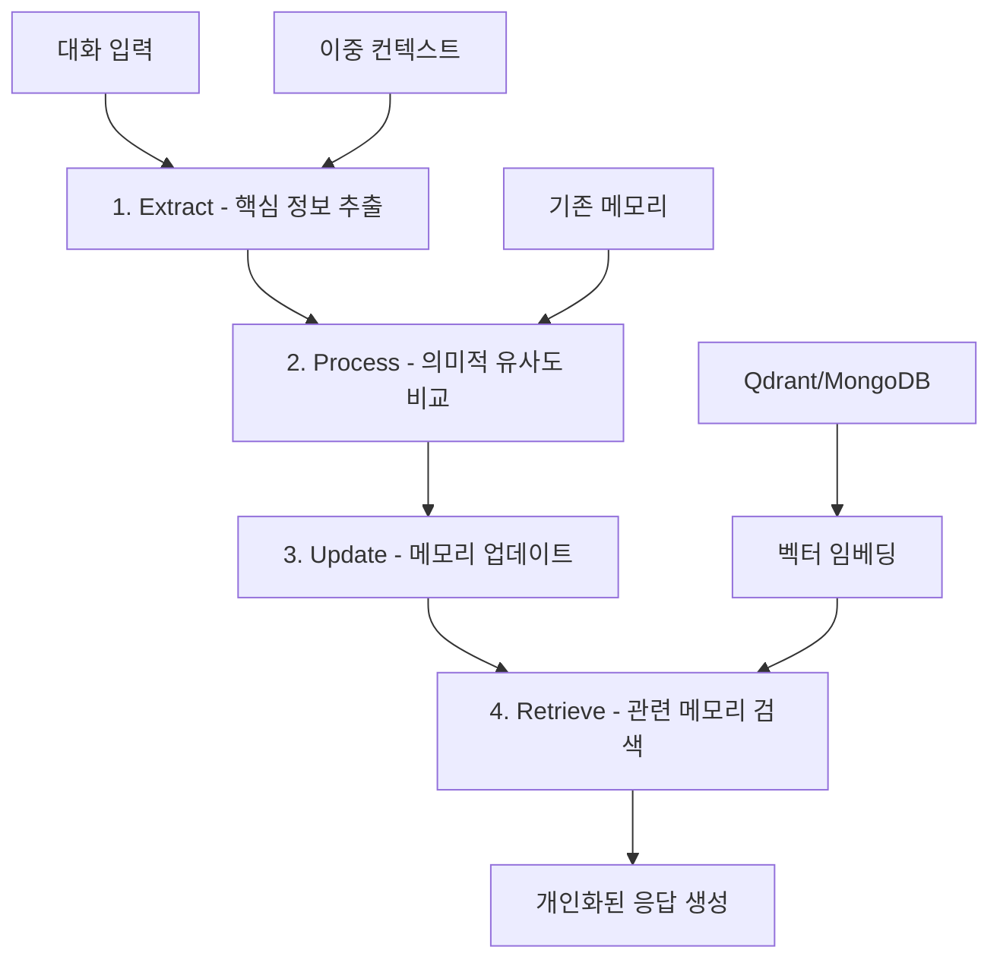

⏱️ **예상 읽기 시간**: 15분

## 서론: 기억하는 AI의 혁명

LLM의 가장 큰 한계 중 하나는 **상태가 없다(stateless)**는 점입니다. 매번 대화할 때마다 처음 만나는 사람처럼 행동하죠. [Philipp Schmid의 혁신적인 접근법](https://www.philschmid.de/gemini-with-memory)은 이 문제를 **Mem0 프레임워크**와 **Gemini 2.5**의 결합으로 해결했습니다.

이 글에서는 단순한 기술 소개를 넘어 **Mem0가 열어주는 무한한 가능성**을 탐구합니다. 개인 맞춤형 AI 어시스턴트부터 엔터프라이즈급 지식 관리 시스템까지, 장기 메모리 AI가 만들어낼 창의적 응용 사례들을 살펴보겠습니다.

## 🧠 Mem0 프레임워크 심화 분석

### 📊 4단계 메모리 처리 파이프라인

Mem0의 핵심은 **반응형 메모리 추출 및 관리** 시스템입니다:



### 🔧 기술 스택 구성

**Philipp Schmid의 구현 방식:**

```python
# Mem0 + Gemini 2.5 통합 설정
from google import genai
from mem0 import Memory

config = {
    "embedder": {
        "provider": "gemini",
        "config": {
            "model": "models/text-embedding-004",  # 768차원 임베딩
        }
    },
    "llm": {
        "provider": "gemini", 
        "config": {
            "model": "gemini-2.5-flash",
            "temperature": 0.0,  # 일관성 있는 메모리 추출
            "max_tokens": 2000,
        }
    },
    "vector_store": {
        "config": {
            "embedding_model_dims": 768,
            "collection_name": "user_memories"
        }
    }
}

memory = Memory.from_config(config)
```

### 🎯 메모리 연산 분류

Mem0는 4가지 메모리 연산을 지능적으로 수행합니다:

| 연산 | 설명 | 트리거 조건 |
|------|------|-------------|
| **ADD** | 새로운 정보 추가 | 이전에 없던 정보 발견 |
| **UPDATE** | 기존 정보 갱신 | 모순되거나 더 구체적인 정보 |
| **DELETE** | 잘못된 정보 제거 | 명시적 정정 또는 만료 |
| **NOOP** | 변경 없음 | 이미 알고 있는 정보 |

## 🚀 창의적 응용 사례: 15가지 혁신 시나리오

### 1. 🎓 개인 맞춤형 AI 튜터

**시나리오**: 학습자의 진도, 약점, 선호도를 기억하는 AI 선생님

```python
class PersonalizedTutor:
    def __init__(self):
        self.memory = Memory.from_config(tutor_config)
        self.learning_analytics = LearningAnalytics()
    
    def adapt_lesson(self, student_id, topic):
        """학생별 맞춤형 수업 생성"""
        
        # 학습 기록 조회
        learning_history = self.memory.search(
            query=f"학습 진도 {topic}",
            user_id=student_id
        )
        
        # 약점 분석
        weaknesses = self.extract_weaknesses(learning_history)
        
        # 개인화된 커리큘럼 생성
        personalized_lesson = self.generate_adaptive_content(
            topic=topic,
            weaknesses=weaknesses,
            learning_style=self.get_learning_style(student_id)
        )
        
        return personalized_lesson
    
    def track_progress(self, student_id, quiz_results):
        """학습 진도 자동 추적"""
        
        progress_data = {
            "role": "system",
            "content": f"학생이 {quiz_results['topic']}에서 "
                      f"{quiz_results['score']}점을 받았습니다. "
                      f"틀린 문제: {quiz_results['wrong_answers']}"
        }
        
        self.memory.add([progress_data], user_id=student_id)
```

**실제 대화 예시:**
```
학생: "이차방정식 문제가 어려워요"
AI: "지난번에 인수분해는 잘 했는데, 완전제곱식에서 실수가 많았죠. 
     오늘은 완전제곱공식부터 차근차근 연습해볼까요?"
```

### 2. 🏥 의료 상담 AI 어시스턴트

**시나리오**: 환자의 병력, 알레르기, 복용 약물을 기억하는 의료 AI

```python
class MedicalAssistant:
    def __init__(self):
        self.memory = Memory.from_config(medical_config)
        self.drug_interaction_db = DrugInteractionDB()
    
    def check_drug_safety(self, patient_id, new_medication):
        """새 처방약의 안전성 검사"""
        
        # 환자 병력 및 현재 복용약 조회
        medical_history = self.memory.search(
            query="복용 중인 약물, 알레르기, 기존 질환",
            user_id=patient_id
        )
        
        # 약물 상호작용 분석
        interactions = self.drug_interaction_db.check(
            current_meds=self.extract_current_medications(medical_history),
            new_med=new_medication
        )
        
        if interactions:
            return {
                "safe": False,
                "warning": f"{new_medication}은(는) 현재 복용 중인 "
                          f"{interactions['conflicting_drug']}와 상호작용할 수 있습니다.",
                "recommendation": "처방의사와 상담하세요."
            }
        
        return {"safe": True, "message": "안전한 처방입니다."}
```

### 3. 💼 엔터프라이즈 지식 관리 AI

**시나리오**: 회사의 모든 문서, 정책, 프로젝트 히스토리를 기억하는 기업 AI

```python
class EnterpriseKnowledgeAI:
    def __init__(self):
        self.memory = Memory.from_config(enterprise_config)
        self.document_indexer = DocumentIndexer()
    
    def onboard_new_employee(self, employee_id, department):
        """신입사원 온보딩 맞춤화"""
        
        # 부서별 필수 지식 조회
        dept_knowledge = self.memory.search(
            query=f"{department} 부서 필수 정책 프로세스",
            user_id="company_wide"
        )
        
        # 개인화된 온보딩 가이드 생성
        onboarding_plan = self.create_personalized_onboarding(
            department=department,
            knowledge_base=dept_knowledge
        )
        
        return onboarding_plan
    
    def answer_policy_question(self, employee_id, question):
        """정책 관련 질문 답변 (컨텍스트 고려)"""
        
        # 직원의 역할과 프로젝트 히스토리 고려
        employee_context = self.memory.search(
            query="담당 프로젝트 역할 부서",
            user_id=employee_id
        )
        
        # 관련 정책 문서 검색
        relevant_policies = self.memory.search(
            query=question,
            user_id="company_policies"
        )
        
        return self.generate_contextual_answer(
            question=question,
            policies=relevant_policies,
            employee_context=employee_context
        )
```

### 4. 🎨 창작 지원 AI 파트너

**시나리오**: 작가의 스타일, 캐릭터, 플롯을 기억하는 창작 도우미

```python
class CreativeWritingPartner:
    def __init__(self):
        self.memory = Memory.from_config(creative_config)
        self.style_analyzer = WritingStyleAnalyzer()
    
    def maintain_character_consistency(self, author_id, character_name):
        """캐릭터 일관성 유지"""
        
        # 캐릭터 설정 조회
        character_info = self.memory.search(
            query=f"{character_name} 성격 외모 배경 말투",
            user_id=author_id
        )
        
        # 최근 캐릭터 행동 패턴 분석
        recent_actions = self.memory.search(
            query=f"{character_name} 최근 행동 대사",
            user_id=author_id,
            limit=10
        )
        
        return {
            "character_profile": character_info,
            "recent_development": recent_actions,
            "consistency_check": self.check_character_consistency(
                character_info, recent_actions
            )
        }
    
    def suggest_plot_development(self, author_id, current_scene):
        """플롯 발전 제안"""
        
        # 전체 스토리 아크 조회
        story_arc = self.memory.search(
            query="주요 플롯 갈등 복선 미해결 사건",
            user_id=author_id
        )
        
        # 장르별 패턴 분석
        genre_patterns = self.analyze_genre_patterns(author_id)
        
        return self.generate_plot_suggestions(
            current_scene=current_scene,
            story_context=story_arc,
            author_style=genre_patterns
        )
```

### 5. 🛒 초개인화 쇼핑 AI

**시나리오**: 고객의 취향, 구매 패턴, 라이프스타일을 기억하는 쇼핑 도우미

```python
class HyperPersonalizedShoppingAI:
    def __init__(self):
        self.memory = Memory.from_config(shopping_config)
        self.product_catalog = ProductCatalog()
        self.trend_analyzer = FashionTrendAnalyzer()
    
    def recommend_products(self, customer_id, occasion=None):
        """상황별 맞춤 상품 추천"""
        
        # 고객 프로필 종합
        customer_profile = self.memory.search(
            query="선호 브랜드 스타일 사이즈 색상 가격대 라이프스타일",
            user_id=customer_id
        )
        
        # 구매 히스토리 분석
        purchase_history = self.memory.search(
            query="최근 구매 상품 만족도 반품",
            user_id=customer_id
        )
        
        # 특별한 상황 고려
        if occasion:
            occasion_needs = self.memory.search(
                query=f"{occasion} 관련 이전 구매 선호도",
                user_id=customer_id
            )
        
        return self.generate_smart_recommendations(
            profile=customer_profile,
            history=purchase_history,
            occasion=occasion,
            current_trends=self.trend_analyzer.get_trends()
        )
    
    def predict_future_needs(self, customer_id):
        """미래 구매 니즈 예측"""
        
        # 계절별, 이벤트별 구매 패턴 분석
        seasonal_patterns = self.memory.search(
            query="계절별 구매 패턴 이벤트 구매",
            user_id=customer_id
        )
        
        return self.forecast_purchasing_needs(seasonal_patterns)
```

### 6. 🎮 적응형 게임 AI

**시나리오**: 플레이어의 스킬, 선호도, 플레이 스타일을 학습하는 게임 AI

```python
class AdaptiveGameAI:
    def __init__(self):
        self.memory = Memory.from_config(gaming_config)
        self.difficulty_balancer = DifficultyBalancer()
    
    def adjust_difficulty(self, player_id, game_session):
        """실시간 난이도 조정"""
        
        # 플레이어 스킬 레벨 조회
        skill_profile = self.memory.search(
            query="게임 스킬 레벨 강점 약점 선호 장르",
            user_id=player_id
        )
        
        # 최근 게임 성과 분석
        recent_performance = self.memory.search(
            query="최근 게임 성과 클리어 시간 사망 횟수",
            user_id=player_id,
            limit=5
        )
        
        # 동적 난이도 계산
        optimal_difficulty = self.difficulty_balancer.calculate(
            skill_level=skill_profile,
            recent_performance=recent_performance,
            current_session=game_session
        )
        
        return optimal_difficulty
    
    def generate_personalized_content(self, player_id):
        """개인 맞춤형 콘텐츠 생성"""
        
        # 플레이 선호도 분석
        preferences = self.memory.search(
            query="선호 게임 모드 캐릭터 타입 플레이 스타일",
            user_id=player_id
        )
        
        # 맞춤형 퀘스트/도전 과제 생성
        return self.create_custom_challenges(preferences)
```

### 7. 💰 개인 재정 AI 어드바이저

**시나리오**: 개인의 수입, 지출 패턴, 재정 목표를 기억하는 금융 상담사

```python
class PersonalFinanceAI:
    def __init__(self):
        self.memory = Memory.from_config(finance_config)
        self.market_analyzer = MarketAnalyzer()
    
    def analyze_spending_patterns(self, user_id):
        """지출 패턴 분석 및 개선 제안"""
        
        # 지출 히스토리 조회
        spending_history = self.memory.search(
            query="월별 지출 카테고리별 소비 패턴",
            user_id=user_id
        )
        
        # 재정 목표 확인
        financial_goals = self.memory.search(
            query="저축 목표 투자 계획 재정 목표",
            user_id=user_id
        )
        
        # 개인화된 절약 제안
        savings_suggestions = self.generate_savings_tips(
            spending_patterns=spending_history,
            goals=financial_goals
        )
        
        return savings_suggestions
    
    def investment_advice(self, user_id, amount):
        """개인 맞춤형 투자 조언"""
        
        # 투자 성향 및 경험 조회
        investment_profile = self.memory.search(
            query="투자 성향 위험 선호도 투자 경험",
            user_id=user_id
        )
        
        # 시장 상황과 개인 상황 종합
        advice = self.create_investment_recommendation(
            profile=investment_profile,
            amount=amount,
            market_conditions=self.market_analyzer.get_current_state()
        )
        
        return advice
```

### 8. 🏋️ 개인 트레이너 AI

**시나리오**: 운동 능력, 부상 기록, 목표를 기억하는 AI 트레이너

```python
class PersonalTrainerAI:
    def __init__(self):
        self.memory = Memory.from_config(fitness_config)
        self.exercise_database = ExerciseDatabase()
    
    def create_workout_plan(self, user_id):
        """개인 맞춤형 운동 계획"""
        
        # 현재 체력 수준 및 목표 조회
        fitness_profile = self.memory.search(
            query="현재 체력 수준 운동 목표 선호 운동",
            user_id=user_id
        )
        
        # 부상 기록 및 제한 사항 확인
        limitations = self.memory.search(
            query="부상 기록 운동 제한 사항 주의사항",
            user_id=user_id
        )
        
        # 진행도 기반 운동 강도 조절
        progress_data = self.memory.search(
            query="최근 운동 성과 체력 향상",
            user_id=user_id,
            limit=10
        )
        
        return self.generate_adaptive_workout(
            fitness_level=fitness_profile,
            limitations=limitations,
            progress=progress_data
        )
```

### 9. 🍳 요리 AI 셰프

**시나리오**: 취향, 알레르기, 냉장고 재료를 기억하는 요리 도우미

```python
class CulinaryAI:
    def __init__(self):
        self.memory = Memory.from_config(culinary_config)
        self.recipe_database = RecipeDatabase()
        self.nutrition_analyzer = NutritionAnalyzer()
    
    def suggest_recipes(self, user_id, available_ingredients=None):
        """맞춤형 레시피 추천"""
        
        # 음식 취향 및 제약사항 조회
        culinary_profile = self.memory.search(
            query="좋아하는 음식 싫어하는 음식 알레르기 다이어트",
            user_id=user_id
        )
        
        # 최근 요리 기록 분석
        recent_cooking = self.memory.search(
            query="최근 만든 요리 성공 실패 경험",
            user_id=user_id,
            limit=7
        )
        
        # 영양 균형 고려
        nutritional_needs = self.analyze_nutritional_balance(
            recent_cooking, culinary_profile
        )
        
        return self.recommend_balanced_recipes(
            preferences=culinary_profile,
            ingredients=available_ingredients,
            nutrition_goals=nutritional_needs
        )
```

### 10. 🌱 정신건강 AI 동반자

**시나리오**: 감정 패턴, 스트레스 요인, 대처 방식을 기억하는 심리 지원 AI

```python
class MentalHealthCompanion:
    def __init__(self):
        self.memory = Memory.from_config(mental_health_config)
        self.mood_analyzer = MoodAnalyzer()
        self.coping_strategies = CopingStrategiesDB()
    
    def track_emotional_patterns(self, user_id, mood_entry):
        """감정 패턴 추적 및 분석"""
        
        # 기존 감정 패턴 조회
        emotional_history = self.memory.search(
            query="감정 상태 스트레스 요인 기분 변화",
            user_id=user_id
        )
        
        # 트리거 패턴 분석
        triggers = self.identify_mood_triggers(emotional_history)
        
        # 개인화된 대처 전략 제안
        personalized_coping = self.suggest_coping_strategies(
            current_mood=mood_entry,
            historical_patterns=emotional_history,
            known_triggers=triggers
        )
        
        return personalized_coping
    
    def provide_emotional_support(self, user_id, current_situation):
        """상황별 맞춤형 정서적 지원"""
        
        # 효과적이었던 지원 방식 조회
        effective_support = self.memory.search(
            query="도움이 된 조언 위로 방식 회복 전략",
            user_id=user_id
        )
        
        return self.generate_personalized_support(
            situation=current_situation,
            proven_methods=effective_support
        )
```

## 🏢 엔터프라이즈 배포 전략

### 🔧 스케일링 아키텍처

```python
# 엔터프라이즈급 Mem0 클러스터 구성
class EnterpriseMemoryCluster:
    def __init__(self):
        self.config = {
            "embedder": {
                "provider": "azure_openai",  # 기업 환경
                "config": {
                    "model": "text-embedding-ada-002",
                    "api_key": os.getenv("AZURE_OPENAI_KEY"),
                    "endpoint": os.getenv("AZURE_OPENAI_ENDPOINT")
                }
            },
            "llm": {
                "provider": "azure_openai",
                "config": {
                    "model": "gpt-4",
                    "temperature": 0.1,
                    "max_tokens": 4000,
                }
            },
            "vector_store": {
                "provider": "qdrant_cloud",  # 클라우드 벡터 DB
                "config": {
                    "url": os.getenv("QDRANT_CLOUD_URL"),
                    "api_key": os.getenv("QDRANT_API_KEY"),
                    "collection_name": "enterprise_memories",
                    "embedding_model_dims": 1536
                }
            }
        }
    
    def setup_multi_tenant_isolation(self):
        """멀티테넌트 격리 설정"""
        
        tenant_configs = {}
        for tenant in self.get_active_tenants():
            tenant_configs[tenant.id] = {
                **self.config,
                "vector_store": {
                    **self.config["vector_store"],
                    "collection_name": f"tenant_{tenant.id}_memories"
                }
            }
        
        return tenant_configs
```

### 📊 모니터링 및 관리

```python
class MemoryOpsMonitoring:
    def __init__(self):
        self.metrics_collector = MetricsCollector()
        self.alerting = AlertingSystem()
    
    def monitor_memory_health(self):
        """메모리 시스템 상태 모니터링"""
        
        metrics = {
            "memory_size": self.get_total_memory_size(),
            "query_latency": self.measure_query_performance(),
            "embedding_quality": self.assess_embedding_quality(),
            "memory_freshness": self.check_memory_staleness(),
            "user_satisfaction": self.get_satisfaction_scores()
        }
        
        # 임계치 기반 알림
        for metric, value in metrics.items():
            if self.is_critical_threshold_exceeded(metric, value):
                self.alerting.send_alert(
                    severity="critical",
                    message=f"Memory system {metric} exceeded threshold: {value}"
                )
        
        return metrics
    
    def auto_cleanup_stale_memories(self):
        """오래된 메모리 자동 정리"""
        
        stale_memories = self.identify_stale_memories(
            threshold_days=90,
            relevance_score_threshold=0.3
        )
        
        for memory_id in stale_memories:
            self.archive_memory(memory_id)
            
        return f"Archived {len(stale_memories)} stale memories"
```

## 🔒 보안 및 프라이버시 고려사항

### 🛡️ 데이터 보호 전략

```python
class MemorySecurityManager:
    def __init__(self):
        self.encryption = AdvancedEncryption()
        self.access_control = RoleBasedAccessControl()
    
    def encrypt_sensitive_memories(self, user_id, memory_content):
        """민감한 메모리 암호화"""
        
        # PII 탐지
        pii_detected = self.detect_personal_info(memory_content)
        
        if pii_detected:
            encrypted_content = self.encryption.encrypt(
                data=memory_content,
                key=self.get_user_encryption_key(user_id)
            )
            
            return {
                "content": encrypted_content,
                "encrypted": True,
                "pii_tags": pii_detected
            }
        
        return {
            "content": memory_content,
            "encrypted": False
        }
    
    def implement_right_to_be_forgotten(self, user_id):
        """GDPR 잊혀질 권리 구현"""
        
        # 사용자 관련 모든 메모리 탐색
        user_memories = self.find_all_user_memories(user_id)
        
        # 완전 삭제 실행
        deletion_log = []
        for memory in user_memories:
            self.permanently_delete_memory(memory.id)
            deletion_log.append(memory.id)
        
        # 백업에서도 제거
        self.purge_from_backups(user_id)
        
        return {
            "deleted_memories": len(deletion_log),
            "deletion_timestamp": datetime.now(),
            "verification_hash": self.generate_deletion_proof(deletion_log)
        }
```

## 📈 성능 최적화 가이드

### ⚡ 메모리 검색 최적화

```python
class MemoryPerformanceOptimizer:
    def __init__(self):
        self.cache = RedisCache()
        self.query_optimizer = QueryOptimizer()
    
    def implement_smart_caching(self):
        """지능형 캐싱 전략"""
        
        # 자주 조회되는 메모리 캐싱
        frequent_queries = self.analyze_query_patterns()
        
        for query_pattern in frequent_queries:
            cached_results = self.cache.get(query_pattern.hash)
            if not cached_results:
                results = self.memory.search(query_pattern.query)
                self.cache.set(
                    key=query_pattern.hash,
                    value=results,
                    ttl=3600  # 1시간 캐시
                )
    
    def optimize_vector_search(self):
        """벡터 검색 성능 최적화"""
        
        optimization_strategies = {
            "index_tuning": self.tune_vector_index(),
            "embedding_compression": self.compress_embeddings(),
            "query_rewriting": self.optimize_query_structure(),
            "batch_processing": self.enable_batch_search()
        }
        
        return optimization_strategies
```

## 🔮 미래 발전 방향

### 🧠 차세대 메모리 AI 기능

```python
# 미래 Mem0 기능 예상
class NextGenMemoryFeatures:
    def __init__(self):
        self.graph_memory = GraphMemoryEngine()
        self.temporal_reasoning = TemporalReasoningEngine()
        self.multi_modal_memory = MultiModalMemoryEngine()
    
    def implement_memory_graphs(self):
        """그래프 기반 메모리 네트워크"""
        
        # 메모리 간 관계 매핑
        memory_graph = self.graph_memory.build_relationship_graph()
        
        # 연관 메모리 자동 발견
        related_memories = self.graph_memory.find_implicit_connections(
            target_memory="user_preference_italian_food",
            relationship_types=["causal", "temporal", "semantic"]
        )
        
        return related_memories
    
    def temporal_memory_reasoning(self):
        """시간적 추론 기반 메모리"""
        
        # 시간 경과에 따른 메모리 변화 추적
        temporal_changes = self.temporal_reasoning.track_changes(
            memory_type="user_preferences",
            time_window="last_6_months"
        )
        
        # 미래 상태 예측
        future_predictions = self.temporal_reasoning.predict_future_state(
            current_memories=temporal_changes,
            prediction_horizon="3_months"
        )
        
        return future_predictions
```

## 실제 구현 가이드

### 🚀 단계별 구현 로드맵

```bash
# 1단계: 환경 설정
pip install google-genai mem0ai qdrant-client

# 2단계: 기본 설정
export GOOGLE_API_KEY="your_gemini_api_key"
export QDRANT_URL="your_qdrant_instance_url"

# 3단계: Docker 컨테이너 실행 (선택사항)
docker run -p 6333:6333 qdrant/qdrant
```

### 💡 프로덕션 배포 체크리스트

```yaml
인프라 준비:
  ☐ 벡터 데이터베이스 클러스터 구축
  ☐ 로드 밸런서 설정
  ☐ 백업 및 복구 시스템
  ☐ 모니터링 대시보드 구축

보안 설정:
  ☐ API 키 관리 시스템
  ☐ 데이터 암호화 구현
  ☐ 접근 권한 관리
  ☐ 감사 로깅 활성화

성능 최적화:
  ☐ 캐싱 레이어 구현
  ☐ 벡터 인덱스 튜닝
  ☐ 쿼리 최적화
  ☐ 부하 테스트 수행

운영 준비:
  ☐ 알림 시스템 구축
  ☐ 장애 복구 절차
  ☐ 용량 계획 수립
  ☐ 팀 교육 완료
```

## 결론: 기억하는 AI가 만드는 새로운 세상

**Mem0와 Gemini 2.5의 결합**은 단순한 기술적 진보를 넘어 **AI와 인간의 관계를 근본적으로 변화**시키고 있습니다. 더 이상 AI는 매번 처음부터 설명해야 하는 도구가 아니라, 우리를 이해하고 기억하는 **진정한 디지털 파트너**가 되고 있습니다.

### 🎯 핵심 가치 제안

**개인화의 혁신:**
- ✅ **진짜 개인 맞춤형** 서비스 - 표면적 개인화를 넘어선 깊은 이해
- ✅ **학습하는 관계** - 시간이 지날수록 더 나아지는 AI 파트너
- ✅ **상황 인식** - 과거 맥락을 고려한 지능적 응답

**비즈니스 혁신:**
- 💰 **고객 만족도 극대화** - 개인화된 경험으로 충성도 향상
- 📈 **운영 효율성** - 반복 질문 감소, 문제 해결 시간 단축
- 🔮 **예측적 서비스** - 고객 니즈 선제 파악 및 대응

### 🌟 성공 구현을 위한 핵심 요소

```python
# 성공적인 메모리 AI 구현의 공식
def memory_ai_success_formula():
    return (
        "고품질 데이터 수집" * 0.3 +
        "지능적 메모리 관리" * 0.25 +
        "사용자 경험 최적화" * 0.20 +
        "보안 및 프라이버시" * 0.15 +
        "지속적 학습 및 개선" * 0.10
    )
```

### 🔮 다음 단계: 실천 방안

**즉시 시작 가능한 프로젝트:**

1. **개인 프로젝트**: [Philipp Schmid의 튜토리얼](https://www.philschmid.de/gemini-with-memory) 따라하기
2. **팀 프로젝트**: 내부 지식 관리 챗봇 구축
3. **비즈니스 프로젝트**: 고객 서비스 AI에 메모리 기능 추가

**장기 로드맵:**
- 📊 **분석**: 현재 AI 시스템의 메모리 부족 문제점 식별
- 🚀 **시범**: 작은 규모 POC로 효과 검증
- 📈 **확장**: 성공 사례를 기반으로 전사 확산
- 🔄 **진화**: 사용자 피드백 기반 지속적 개선

**Mem0가 제시하는 미래**는 AI가 우리의 생각과 행동을 더 깊이 이해하고, 더 의미 있는 방식으로 도움을 주는 세상입니다. 이제 우리는 **"AI에게 매번 같은 설명을 반복하는 피로"**에서 벗어나 **"나를 이해하는 AI와 함께 성장하는 즐거움"**을 경험할 수 있습니다.

기억하는 AI의 시대가 시작되었습니다. 이 혁명에 동참할 준비가 되셨나요? 🚀

**참고 자료:**
- [Philipp Schmid - Integrating Long-Term Memory with Gemini 2.5](https://www.philschmid.de/gemini-with-memory)
- [Mem0 공식 문서](https://docs.mem0.ai/)
- [Google Gemini API 가이드](https://ai.google.dev/docs)
- [Qdrant 벡터 데이터베이스](https://qdrant.tech/documentation/)
- [메모리 AI 보안 가이드라인](https://arxiv.org/search/?query=memory+ai+privacy) 