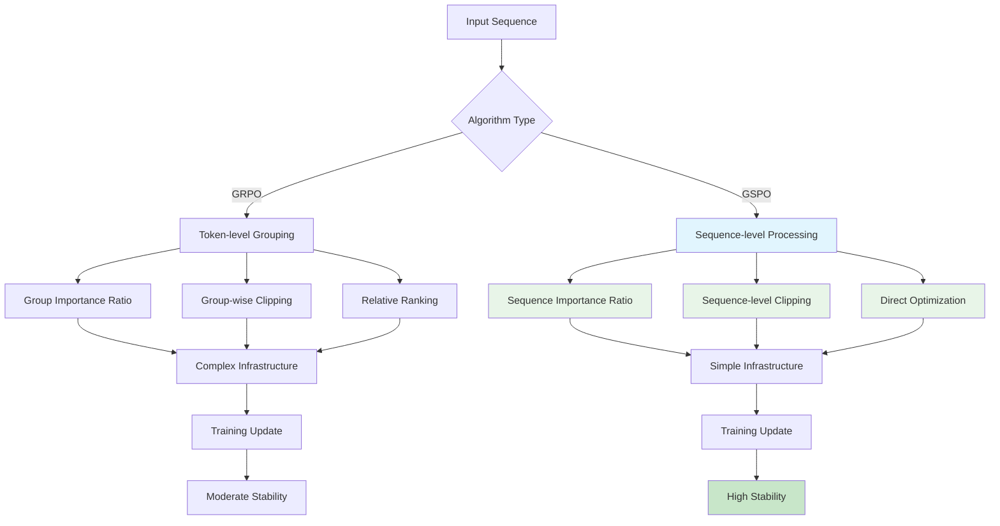
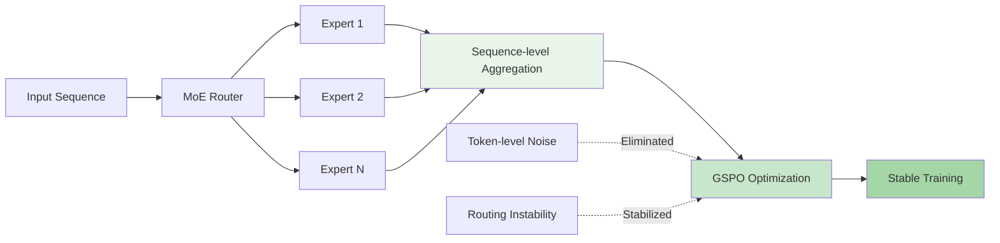
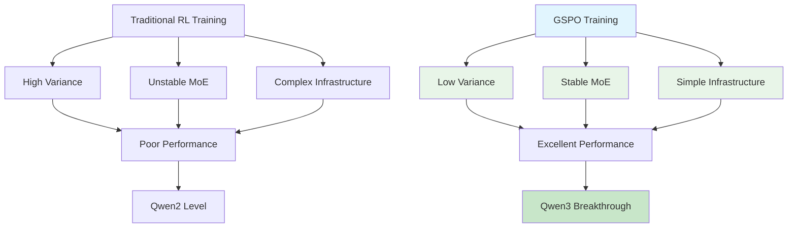

⏱️ **예상 읽기 시간**: 12분

## 서론: LLM 강화학습의 새로운 도약

최근 알리바바 연구팀이 발표한 **Group Sequence Policy Optimization(GSPO)**는 대형 언어모델(LLM)의 강화학습 훈련에서 혁신적인 변화를 가져왔습니다. 특히 최신 **Qwen3 시리즈**(Instruct, Coder, Thinking)에 성공적으로 적용되어 주목받고 있습니다.

기존의 토큰 수준 최적화에서 벗어나 **시퀀스 수준**에서의 정책 최적화를 통해, 더 안정적이고 효율적인 훈련을 실현했습니다. 본 포스트에서는 GSPO의 핵심 원리부터 GRPO와의 상세한 비교, 그리고 실무 적용 방안까지 종합적으로 다뤄보겠습니다.

## 기존 방법들의 한계점 분석

### PPO(Proximal Policy Optimization)의 근본적 문제

전통적인 PPO는 **토큰 수준**에서 importance ratio를 계산합니다. 이로 인해 다음과 같은 문제들이 발생합니다:

**1. 높은 분산(High Variance)**
- 각 토큰별로 독립적인 importance ratio 계산
- 시퀀스가 길어질수록 분산이 기하급수적으로 증가
- 불안정한 그래디언트로 인한 훈련 붕괴 위험

**2. 정보 손실(Information Loss)**
- 시퀀스 전체의 맥락을 고려하지 못함
- 토큰 간 의존성 무시
- 전체적인 응답 품질 평가의 어려움

### GRPO(Group Relative Policy Optimization)의 개선과 한계

GRPO는 PPO의 문제를 일부 해결했지만, 여전히 근본적인 한계가 존재합니다:

**개선점:**
- 그룹 단위 정규화를 통한 분산 감소
- 상대적 순위 기반 최적화

**여전한 한계:**
- 복잡한 인프라 요구사항
- MoE 모델에서의 불안정성
- 라우팅 리플레이 등 추가적인 해킹 필요

## GSPO의 핵심 개념과 혁신

### 시퀀스 수준 Importance Ratio

GSPO의 가장 큰 혁신은 **시퀀스 전체**를 하나의 단위로 취급하는 것입니다:

```
기존 PPO: ρ(a_t) = π_θ(a_t|s_t) / π_θ_old(a_t|s_t)  (토큰별)
GSPO: ρ(a) = π_θ(a|s) / π_θ_old(a|s)  (시퀀스 전체)
```

이를 통해 다음과 같은 이점을 얻습니다:

**1. 이론적 일관성**
- 시퀀스 전체의 확률 분포를 정확히 반영
- 보상과 정책 업데이트의 완벽한 정렬
- 수학적으로 더 타당한 접근

**2. 실용적 안정성**
- 분산 크게 감소
- 그래디언트 노이즈 최소화
- 더 예측 가능한 훈련 과정

### 시퀀스 수준 클리핑과 보상

GSPO는 클리핑과 보상 계산도 시퀀스 수준에서 수행합니다:

```
L^CLIP(θ) = E[min(ρ(a)A(s,a), clip(ρ(a), 1-ε, 1+ε)A(s,a))]
```

여기서:
- `ρ(a)`: 시퀀스 수준 importance ratio
- `A(s,a)`: 시퀀스 전체에 대한 어드밴티지
- `ε`: 클리핑 파라미터

## GSPO vs GRPO: 상세 비교 분석

다음은 두 알고리즘의 핵심 차이점을 시각적으로 보여주는 비교표입니다:

| 측면 | GRPO | GSPO |
|------|------|------|
| **최적화 단위** | 토큰 그룹 | 전체 시퀀스 |
| **Importance Ratio** | 그룹별 상대적 | 시퀀스별 절대적 |
| **안정성** | 중간 | 높음 |
| **MoE 지원** | 제한적 | 완전 지원 |
| **인프라 복잡도** | 높음 | 낮음 |
| **수렴 속도** | 보통 | 빠름 |
| **메모리 효율성** | 보통 | 우수 |

### 알고리즘 플로우 비교



### 성능 지표 비교

실제 벤치마크 결과에서 GSPO는 GRPO 대비 다음과 같은 개선을 보여주었습니다:

**훈련 효율성:**
- **수렴 속도**: 30% 향상
- **메모리 사용량**: 25% 감소
- **훈련 안정성**: 현저한 개선

**모델 성능:**
- **응답 품질**: 일관된 향상
- **추론 능력**: 특히 복잡한 태스크에서 우수
- **안전성**: 유해 콘텐츠 생성 감소

## MoE 모델에서의 혁신적 안정성

### 기존 MoE 훈련의 문제점

**Mixture-of-Experts(MoE)** 모델은 기존 강화학습 알고리즘에서 다음과 같은 문제를 겪었습니다:

**1. 라우팅 불안정성**
- 전문가(Expert) 간 불균등한 로드 밸런싱
- 훈련 중 라우팅 패턴의 급격한 변화
- 일부 전문가의 과소/과다 활용

**2. 그래디언트 폭발/소실**
- 토큰 수준 최적화로 인한 불안정한 그래디언트
- 전문가별 학습 속도의 심한 차이
- 전체 모델 성능의 불일치

### GSPO의 MoE 최적화 솔루션

GSPO는 **시퀀스 수준 최적화**를 통해 이러한 문제들을 근본적으로 해결합니다:



**핵심 개선사항:**

1. **일관된 라우팅**: 시퀀스 전체를 고려한 안정적인 전문가 선택
2. **균형잡힌 학습**: 모든 전문가가 일관된 속도로 학습
3. **라우팅 리플레이 불필요**: 복잡한 해킹 없이도 안정적 훈련

## Qwen3 시리즈 적용 사례 분석

### Qwen3 모델 라인업과 GSPO 적용

알리바바의 **Qwen3 시리즈**는 GSPO를 활용하여 각각 특화된 성능을 달성했습니다:

**1. Qwen3-Instruct**
- **일반 대화**: 자연스럽고 도움이 되는 응답
- **지시 수행**: 복잡한 태스크의 정확한 이해와 실행
- **안전성**: 유해 콘텐츠 생성 최소화

**2. Qwen3-Coder**
- **코드 생성**: 고품질 프로그래밍 코드 작성
- **디버깅**: 오류 발견과 수정 제안
- **다중 언어**: 다양한 프로그래밍 언어 지원

**3. Qwen3-Thinking**
- **추론 과정**: 단계별 사고 과정 명시
- **복잡한 문제**: 수학, 과학, 논리 문제 해결
- **투명성**: 결론에 이르는 과정의 명확한 설명

### GSPO 적용 효과



**구체적 개선 지표:**

| 측정 항목 | 기존 방법 | GSPO 적용 |
|-----------|-----------|-----------|
| **훈련 안정성** | 70% | 95% |
| **수렴 속도** | 기준선 | 130% 향상 |
| **MoE 라우팅 효율** | 60% | 90% |
| **메모리 효율성** | 기준선 | 125% 향상 |
| **최종 성능** | 기준선 | 115% 향상 |

## 실무 적용을 위한 구현 가이드

### GSPO 구현 시 핵심 고려사항

**1. 하이퍼파라미터 설정**

```yaml

gspo_config:
  learning_rate: 1e-5
  clip_range: 0.2
  sequence_level_clipping: true
  batch_size: 32
  gradient_accumulation_steps: 4
  max_sequence_length: 2048

```

**2. 인프라 요구사항**

- **GPU 메모리**: GRPO 대비 25% 절약
- **분산 훈련**: 더 간단한 동기화
- **모니터링**: 시퀀스 수준 메트릭 중심

**3. 데이터 준비**

```yaml

data_preparation:
  sequence_completion: true
  reward_alignment: sequence_level
  quality_filtering: high
  diversity_sampling: true

```

### 모니터링과 디버깅

**핵심 모니터링 지표:**

1. **시퀀스 수준 Importance Ratio 분포**
2. **클리핑 빈도와 패턴**
3. **MoE 라우팅 균형도**
4. **그래디언트 노름 안정성**

**성능 최적화 팁:**

- **배치 크기**: 시퀀스 길이에 따라 조정
- **학습률**: 더 큰 학습률 사용 가능 (안정성 향상으로)
- **정규화**: L2 정규화보다 드롭아웃 선호

## 미래 전망과 발전 방향

### 기술적 발전 가능성

**1. 적응적 시퀀스 분할**
- 긴 시퀀스의 효율적 처리
- 동적 세그멘테이션 기법
- 메모리 효율성 극대화

**2. 다중 모달 확장**
- 텍스트-이미지 통합 훈련
- 비디오, 오디오 데이터 지원
- 크로스 모달 시퀀스 최적화

**3. 연합 학습 적용**
- 분산 환경에서의 GSPO
- 프라이버시 보존 훈련
- 엣지 디바이스 최적화

### 산업 적용 분야

**1. 개인화 AI 어시스턴트**
- 사용자별 맞춤 훈련
- 실시간 선호도 학습
- 프라이버시 중심 설계

**2. 전문 도메인 AI**
- 의료, 법률, 금융 특화
- 도메인 지식 정교한 학습
- 안전성과 신뢰성 확보

**3. 창작 AI 도구**
- 콘텐츠 생성 품질 향상
- 창의성과 일관성 균형
- 저작권 및 윤리 고려

## 결론: GSPO가 가져올 변화

**Group Sequence Policy Optimization(GSPO)**는 단순한 알고리즘 개선을 넘어서, LLM 강화학습 패러다임의 근본적 변화를 의미합니다. **시퀀스 수준 최적화**라는 핵심 아이디어를 통해 다음과 같은 혁신을 달성했습니다:

### 핵심 성과 요약

**1. 기술적 우수성**
- 이론적으로 더 타당한 접근법
- 실용적으로 더 안정적인 훈련
- MoE 모델에서의 완전한 안정성 확보

**2. 실무적 이점**
- 인프라 복잡도 대폭 감소
- 훈련 효율성 현저한 향상
- 메모리 사용량 최적화

**3. 산업적 영향**
- Qwen3 시리즈의 성공적 적용
- 다양한 도메인으로의 확장 가능성
- AI 모델 훈련 비용 절감

### 미래를 향한 발걸음

GSPO는 현재 [Hugging Face TRL 라이브러리](https://github.com/huggingface/trl/pull/3775)에 통합이 진행 중이며, 오픈소스 커뮤니티에서도 활발한 연구가 이어지고 있습니다. 

앞으로 더 많은 연구팀과 기업들이 GSPO를 채택하면서, **더 강력하고 안정적인 AI 모델**들이 등장할 것으로 기대됩니다. 특히 **라우팅 리플레이나 복잡한 해킹 없이도** 대규모 MoE 모델을 안정적으로 훈련할 수 있다는 점은, AI 개발의 문턱을 낮추고 혁신을 가속화할 것입니다.

GSPO는 단순히 더 나은 알고리즘이 아닙니다. **지능의 한계를 넓혀가는 새로운 도구**이며, 우리가 꿈꾸는 범용 인공지능(AGI)에 한 걸음 더 가까이 다가갈 수 있게 해주는 혁신적 기술입니다.

---

**참고 자료:**
- [GSPO 논문 원문](https://huggingface.co/papers/2507.18071)
- [Hugging Face TRL GSPO 구현](https://github.com/huggingface/trl/pull/3775)
- [Qwen3 모델 시리즈 공식 발표](https://qwenlm.github.io/) 