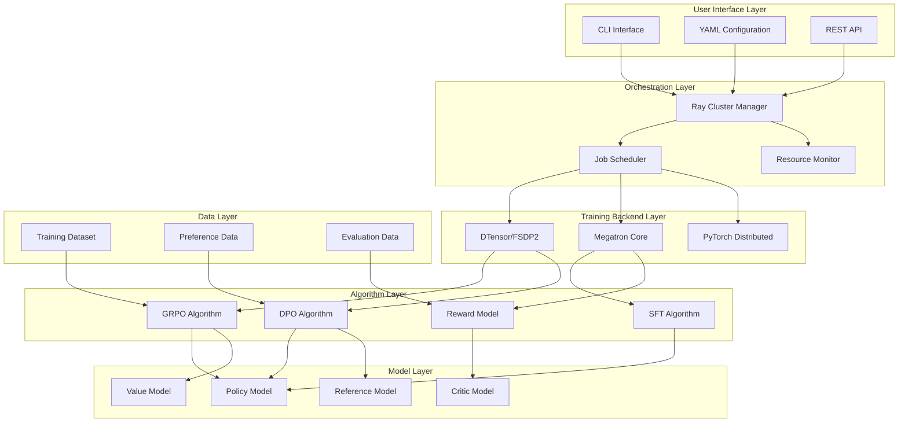
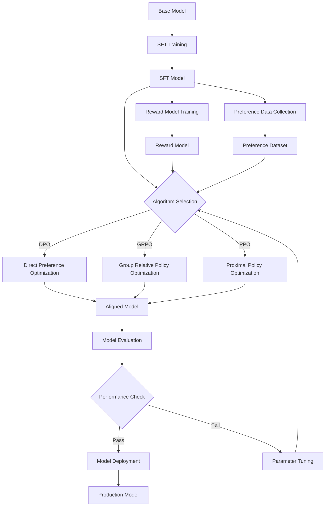

⏱️ **예상 읽기 시간**: 15분

## 서론

대규모 언어모델(LLM)의 성능을 최대화하기 위해서는 사전 훈련 이후의 포스트 트레이닝 과정이 핵심적입니다. NVIDIA NeMo RL은 이러한 포스트 트레이닝 분야에서 혁신적인 접근방식을 제시하는 강화학습 프레임워크로, 단일 GPU부터 수천 개의 GPU까지 확장 가능한 아키텍처를 제공합니다.

[NVIDIA NeMo RL GitHub 레포지토리](https://github.com/NVIDIA-NeMo/RL)는 662개의 스타와 104개의 포크를 기록하며 활발한 개발이 이루어지고 있는 프로젝트입니다. 이 글에서는 NeMo RL의 아키텍처부터 실제 활용 방법까지 종합적으로 분석해보겠습니다.

## NVIDIA NeMo RL 개요

### 핵심 특징

NVIDIA NeMo RL은 **"Scalable toolkit for efficient model reinforcement"**라는 슬로건으로 다음과 같은 핵심 특징을 제공합니다:

- **확장성**: 1개 GPU부터 수천 개 GPU까지 선형적 확장
- **모듈화**: 플러그인 방식의 컴포넌트 아키텍처
- **효율성**: 메모리 최적화된 분산 처리
- **범용성**: 다양한 강화학습 알고리즘 지원

### 기존 NeMo Aligner와의 차이점

NeMo RL은 기존 NeMo Aligner의 발전된 형태로, 다음과 같은 개선사항을 제공합니다:

| 구분 | NeMo Aligner | NeMo RL |
|------|-------------|---------|
| **아키텍처** | 모놀리식 구조 | 모듈화된 마이크로서비스 |
| **확장성** | 제한적 확장 | 무제한 수평 확장 |
| **백엔드** | Megatron 중심 | DTensor + Megatron 멀티 백엔드 |
| **알고리즘** | RLHF, DPO | GRPO, DPO, SFT, RM + 확장 |

## 아키텍처 심층 분석

### 전체 시스템 아키텍처

NeMo RL의 아키텍처는 계층화된 구조로 설계되어 있으며, 각 계층은 명확한 역할과 책임을 가집니다:

#### 주요 아키텍처 계층

1. **사용자 인터페이스 계층**
   - CLI Interface: 명령줄 기반 실행 인터페이스
   - YAML Configuration: 선언적 설정 관리
   - REST API: 프로그래매틱 접근을 위한 API

2. **오케스트레이션 계층**
   - Ray Cluster Manager: 분산 컴퓨팅 리소스 관리
   - Job Scheduler: 훈련 작업 스케줄링 및 관리
   - Resource Monitor: 실시간 리소스 모니터링

3. **훈련 백엔드 계층**
   - DTensor/FSDP2: PyTorch의 차세대 분산 훈련 기술
   - Megatron Core: 대규모 모델을 위한 NVIDIA의 병렬 처리 엔진
   - PyTorch Distributed: 기본 분산 훈련 백엔드

### 핵심 컴포넌트 분석

#### Ray 기반 분산 처리 아키텍처

NeMo RL은 Ray를 기반으로 한 분산 처리 시스템을 통해 확장성을 확보합니다:

- **자동 리소스 관리**: Ray가 GPU, CPU, 메모리 리소스를 자동으로 관리
- **동적 스케일링**: 워크로드에 따른 자동 스케일 업/다운
- **내결함성**: 노드 장애 시 자동 복구 메커니즘
- **멀티 클러스터 지원**: Kubernetes, Slurm 등 다양한 클러스터 환경 지원

#### 멀티 백엔드 훈련 시스템

NeMo RL의 독특한 특징 중 하나는 여러 훈련 백엔드를 지원하는 것입니다:

| 백엔드 | 최적 사용 사례 | 메모리 효율성 | 확장성 |
|--------|-------------|-------------|--------|
| **DTensor/FSDP2** | 소규모~중규모 모델 (< 100B) | 매우 높음 | 중간 |
| **Megatron Core** | 대규모 모델 (> 100B) | 높음 | 매우 높음 |
| **PyTorch Distributed** | 프로토타이핑 및 소규모 실험 | 중간 | 낮음 |

#### 자동 백엔드 선택 메커니즘

NeMo RL은 YAML 설정을 기반으로 최적의 백엔드를 자동으로 선택합니다:

- **모델 크기 기반**: 파라미터 수에 따른 자동 백엔드 선택
- **하드웨어 구성 기반**: GPU 수와 메모리에 따른 최적화
- **작업 유형 기반**: SFT, DPO, GRPO 등 알고리즘별 최적화

## 기술 스택 및 라이브러리 생태계

### 핵심 기술 스택

NeMo RL의 기술 스택은 다음과 같은 최신 기술들로 구성되어 있습니다:

#### 언어 및 프레임워크
- **Python 95.1%**: 메인 개발 언어
- **Shell Scripts 4.7%**: 자동화 및 배포 스크립트
- **Docker 0.2%**: 컨테이너화 및 배포

#### 딥러닝 프레임워크
- **PyTorch**: 핵심 딥러닝 프레임워크
- **PyTorch Lightning**: 고수준 훈련 추상화
- **Hugging Face Transformers**: 사전 훈련된 모델 생태계

#### 분산 처리 및 병렬화
- **Ray**: 분산 컴퓨팅 오케스트레이션
- **NVIDIA Megatron**: 대규모 모델 병렬 처리
- **PyTorch FSDP2**: 차세대 분산 데이터 병렬 처리

#### 패키지 관리 및 개발 도구
- **UV**: 고성능 Python 패키지 매니저
- **Pre-commit**: 코드 품질 관리
- **Docker**: 컨테이너화 및 배포 환경

### 외부 라이브러리 의존성

NeMo RL은 다음과 같은 주요 외부 라이브러리들과 통합됩니다:

- **vLLM**: 고성능 추론 엔진
- **TensorBoard/WandB**: 실험 추적 및 모니터링
- **Hydra**: 설정 관리 프레임워크
- **APEX**: NVIDIA의 혼합 정밀도 훈련 라이브러리

## 강화학습 알고리즘 상세 분석

### GRPO (Group Relative Policy Optimization)

GRPO는 NeMo RL의 핵심 알고리즘 중 하나로, 수학적 추론 능력 향상에 특화되어 있습니다:

#### GRPO 핵심 특징
- **그룹 기반 최적화**: 여러 응답을 그룹으로 묶어 상대적 성능 비교
- **안정성 향상**: 기존 PPO 대비 훈련 안정성 개선
- **효율성**: 메모리 사용량 최적화
- **수학적 추론**: OpenInstructMath2 데이터셋 활용

### DPO (Direct Preference Optimization)

DPO는 인간의 선호도를 직접 모델링하는 알고리즘입니다:

#### DPO 장점
- **단순성**: PPO 대비 구현 복잡도 감소
- **안정성**: 보상 모델 없이 직접 최적화
- **효율성**: 훈련 시간 단축
- **확장성**: 대규모 모델에 적용 가능

### SFT (Supervised Fine-Tuning)

SFT는 지도 학습 기반의 파인 튜닝 방법론입니다:

#### SFT 특징
- **기본 파인 튜닝**: RLHF 이전 단계의 기본 파인 튜닝
- **다양한 데이터셋 지원**: Custom 데이터셋 쉬운 통합
- **효율적 훈련**: 단일 GPU부터 멀티 노드까지 지원

### RM (Reward Model)

보상 모델은 인간의 선호도를 학습하는 핵심 컴포넌트입니다:

#### RM 역할
- **선호도 모델링**: 인간 피드백 기반 보상 함수 학습
- **품질 평가**: 생성된 응답의 품질 평가
- **강화학습 신호**: RLHF를 위한 보상 신호 제공

## 훈련 워크플로우 및 파이프라인

### 전체 훈련 파이프라인

NeMo RL의 훈련 파이프라인은 체계적이고 모듈화된 접근방식을 따릅니다:

#### 파이프라인 단계별 설명

1. **Base Model**: 사전 훈련된 기본 모델 (Llama, Mistral 등)
2. **SFT Training**: 지도 학습 기반 초기 파인 튜닝
3. **Reward Model Training**: 인간 선호도 기반 보상 모델 훈련
4. **Algorithm Selection**: DPO, GRPO, PPO 중 최적 알고리즘 선택
5. **Model Evaluation**: 다양한 벤치마크를 통한 성능 평가
6. **Production Deployment**: 운영 환경 배포

### 멀티 노드 분산 훈련 워크플로우

NeMo RL은 대규모 클러스터 환경에서의 효율적인 분산 훈련을 지원합니다:

#### 클러스터 환경 지원
- **Slurm**: HPC 환경에서의 작업 스케줄링
- **Kubernetes**: 컨테이너 기반 오케스트레이션
- **Ray Cluster**: 자동 리소스 관리 및 스케일링

#### 분산 훈련 최적화
- **Gradient Accumulation**: 메모리 효율적인 그래디언트 업데이트
- **Mixed Precision**: FP16/BF16을 통한 메모리 및 속도 최적화
- **Pipeline Parallelism**: 모델 레이어 간 파이프라인 병렬 처리
- **Tensor Parallelism**: 텐서 수준의 병렬 처리

## 기업 환경에서의 활용 방법

### 도입 전략

#### 1단계: 환경 구성 및 검증
- **하드웨어 요구사항 분석**: GPU 메모리, 네트워크 대역폭 평가
- **소프트웨어 스택 구성**: CUDA, PyTorch, Ray 환경 설정
- **소규모 실험**: 단일 GPU 환경에서 개념 검증

#### 2단계: 파일럿 프로젝트
- **데이터셋 준비**: 도메인 특화 데이터 수집 및 전처리
- **모델 선택**: 기업 요구사항에 맞는 기본 모델 선택
- **초기 파인 튜닝**: SFT를 통한 기본 성능 확보

#### 3단계: 프로덕션 확장
- **멀티 노드 확장**: 대규모 클러스터 환경으로 확장
- **모니터링 구축**: WandB, TensorBoard 기반 실험 추적
- **CI/CD 구축**: 자동화된 훈련 및 배포 파이프라인

### 비용 최적화 전략

#### 리소스 최적화
- **동적 스케일링**: 워크로드에 따른 자동 리소스 조정
- **스팟 인스턴스 활용**: 클라우드 환경에서 비용 절감
- **체크포인팅**: 훈련 중단 시 재시작 비용 최소화

#### 효율성 향상
- **PEFT 기법 활용**: LoRA, AdaLoRA 등으로 파라미터 효율성 극대화
- **데이터 병렬 처리**: 효율적인 데이터 로딩 및 전처리
- **메모리 최적화**: Gradient Checkpointing, Activation Checkpointing 활용

### 보안 및 거버넌스

#### 데이터 보안
- **데이터 암호화**: 훈련 데이터 및 모델 가중치 암호화
- **접근 제어**: 역할 기반 접근 제어 (RBAC) 구현
- **감사 로그**: 모든 훈련 활동에 대한 추적 가능성 확보

#### 모델 거버넌스
- **버전 관리**: 모델 및 실험 버전 체계적 관리
- **성능 모니터링**: 지속적인 모델 성능 추적
- **윤리적 AI**: 편향성 검사 및 공정성 평가

## 성능 벤치마크 및 평가

### 평가 메트릭

NeMo RL은 다양한 평가 지표를 통해 모델 성능을 측정합니다:

#### 일반 성능 지표
- **MATH-500**: 수학적 추론 능력 평가
- **HumanEval**: 코딩 능력 평가
- **HellaSwag**: 상식 추론 능력 평가
- **MMLU**: 다분야 언어 이해 능력 평가

#### 정렬 성능 지표
- **Reward Model Accuracy**: 보상 모델의 인간 선호도 예측 정확도
- **Win Rate**: 인간 평가자 대비 승률
- **Safety Score**: 안전성 및 유해성 평가

### 성능 최적화 전략

#### 하이퍼파라미터 튜닝
- **Learning Rate Scheduling**: 적응적 학습률 조정
- **Batch Size Optimization**: 메모리와 성능의 균형점 찾기
- **Regularization**: 과적합 방지를 위한 정규화 기법

#### 알고리즘 선택 가이드
- **GRPO**: 수학적 추론, 논리적 사고가 중요한 태스크
- **DPO**: 일반적인 대화 성능 향상, 빠른 훈련이 필요한 경우
- **SFT**: 기본 파인 튜닝, 도메인 적응이 주목적인 경우

## 향후 전망 및 로드맵

### 기술적 발전 방향

#### 알고리즘 혁신
- **New RL Algorithms**: 더 효율적인 강화학습 알고리즘 개발
- **Multi-Agent Training**: 다중 에이전트 협력 학습
- **Continual Learning**: 지속적 학습 및 적응 능력

#### 플랫폼 확장
- **Edge Deployment**: 엣지 디바이스에서의 추론 최적화
- **Federated Learning**: 분산 학습 환경 지원
- **AutoML Integration**: 자동화된 하이퍼파라미터 최적화

### 생태계 확장

#### 커뮤니티 기여
- **오픈소스 생태계**: 활발한 커뮤니티 기여 및 확장
- **연구 협력**: 학계와의 연구 협력 강화
- **도구 통합**: 다양한 MLOps 도구와의 통합

#### 상업적 활용
- **Enterprise Solutions**: 기업용 솔루션 제공
- **Cloud Integration**: 주요 클라우드 플랫폼과의 깊은 통합
- **Managed Services**: 관리형 서비스 제공

## 결론

NVIDIA NeMo RL은 대규모 언어모델의 강화학습 기반 포스트 트레이닝 분야에서 혁신적인 솔루션을 제시합니다. Ray 기반의 확장 가능한 아키텍처, 다양한 훈련 백엔드 지원, 그리고 GRPO, DPO 등의 최신 알고리즘을 통해 기업 환경에서 실질적으로 활용 가능한 프레임워크로 자리잡고 있습니다.

### 핵심 강점 요약

1. **확장성**: 단일 GPU부터 수천 개 GPU까지의 선형적 확장
2. **모듈화**: 플러그인 방식의 유연한 아키텍처
3. **효율성**: 메모리 최적화된 분산 처리
4. **범용성**: 다양한 강화학습 알고리즘 지원
5. **생산성**: 기업 환경에 최적화된 도구 체인

### 도입 권장사항

- **연구 기관**: 최신 강화학습 알고리즘 실험 및 연구
- **대기업**: 대규모 언어모델의 도메인 특화 파인 튜닝
- **스타트업**: 효율적인 모델 정렬 및 성능 최적화
- **클라우드 제공업체**: 관리형 AI 서비스 구축

NVIDIA NeMo RL은 LLMOps 분야에서 새로운 표준을 제시하며, 향후 대규모 언어모델의 산업적 활용을 가속화할 것으로 전망됩니다. 지속적인 커뮤니티 기여와 기술 발전을 통해 AI 생태계의 핵심 인프라로 자리잡을 것입니다.
