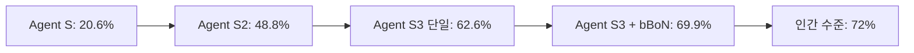

⏱️ **예상 읽기 시간**: 12분

## 서론: 컴퓨터 사용 에이전트의 새로운 지평

컴퓨터 사용 에이전트(Computer Use Agent, CUA) 분야에서 획기적인 발전이 이루어졌습니다. Simular에서 개발한 **Agent S3**가 OSWorld 벤치마크에서 **69.9%의 정확도**를 달성하며, 인간 수준의 72%에 근접한 성능을 보여주었습니다. 이는 불과 1년 전 Agent S의 20.6%에서 시작하여 Agent S2의 48.8%를 거쳐 이룬 놀라운 발전입니다.

Agent S3는 단순히 성능 향상에 그치지 않고, **Behavior Best-of-N (bBoN)** 기법이라는 혁신적인 확장 프레임워크를 도입하여 컴퓨터 사용 에이전트의 패러다임을 바꾸고 있습니다. 이 글에서는 Agent S3의 핵심 기술과 혁신적 접근법을 상세히 분석해보겠습니다.

## Agent S3의 핵심 혁신 사항

### 1. 프레임워크 단순화와 네이티브 코딩 에이전트

Agent S3의 첫 번째 주요 개선사항은 **프레임워크의 단순화**입니다. 이전 버전인 Agent S2는 계층적 매니저-워커(manager-worker) 구조를 사용했지만, 이는 불필요한 오버헤드를 발생시켰습니다.

#### 기존 Agent S2의 한계점
- 복잡한 계층 구조로 인한 처리 지연
- 매니저와 워커 간 통신 오버헤드
- 코드 생성과 GUI 작업 간의 비효율적 분리

#### Agent S3의 개선된 접근법
Agent S3는 이러한 계층 구조를 제거하고 **네이티브 코딩 에이전트**를 통합했습니다. 이를 통해:

```python
# Agent S3의 통합된 접근법 (의사코드)
class AgentS3:
    def __init__(self):
        self.code_generator = NativeCodingAgent()
        self.gui_controller = GUIController()
        self.unified_planner = UnifiedPlanner()
    
    def execute_task(self, task):
        # 코드와 GUI 작업을 통합적으로 처리
        plan = self.unified_planner.create_plan(task)
        
        for step in plan:
            if step.type == "code":
                result = self.code_generator.execute(step)
            elif step.type == "gui":
                result = self.gui_controller.execute(step)
            
            # 결과를 통합적으로 평가
            self.evaluate_step_result(result)
```

이러한 개선을 통해 Agent S3는 단일 에이전트 성능에서 **62.6%의 정확도**를 달성했습니다.

### 2. Behavior Best-of-N (bBoN) 기법의 도입

Agent S3의 가장 혁신적인 기술은 **Behavior Best-of-N (bBoN)** 기법입니다. 이는 컴퓨터 사용 에이전트의 근본적인 문제인 **높은 변동성**을 해결하기 위한 접근법입니다.

#### 컴퓨터 사용 에이전트의 변동성 문제

장기간 작업을 수행하는 컴퓨터 사용 에이전트는 다음과 같은 문제에 직면합니다:

- **작은 실수의 누적**: 잘못된 클릭, 늦은 응답, 예상치 못한 팝업 등
- **환경의 불확실성**: 웹페이지 로딩 시간, 시스템 응답 지연 등
- **작업 복잡성**: 다단계 작업에서 각 단계의 성공률이 곱해지는 문제

#### bBoN 기법의 작동 원리

bBoN 기법은 다음 세 단계로 구성됩니다:

**1단계: 사실 생성(Fact Generation)**
```python
def generate_facts(agent_run):
    """
    에이전트 실행의 상세한 로그에서 핵심 사실만 추출
    """
    facts = []
    for step in agent_run.steps:
        if step.is_significant():
            fact = {
                "action": step.action,
                "result": step.result,
                "success": step.success,
                "context": step.context
            }
            facts.append(fact)
    return facts
```

**2단계: 행동 서술 생성(Behavior Narrative Creation)**
```python
def create_behavior_narrative(facts):
    """
    추출된 사실들을 연결하여 명확한 행동 서술 생성
    """
    narrative = BehaviorNarrative()
    
    for fact in facts:
        narrative.add_step(
            action=fact["action"],
            outcome=fact["result"],
            success_indicator=fact["success"]
        )
    
    return narrative.to_concise_summary()
```

**3단계: 판단 및 선택(Judge Selection)**
```python
def select_best_run(behavior_narratives):
    """
    여러 행동 서술을 비교하여 최적의 실행 선택
    """
    judge = BehaviorJudge()
    
    scores = []
    for narrative in behavior_narratives:
        score = judge.evaluate(
            task_completion=narrative.task_completion_rate,
            efficiency=narrative.efficiency_score,
            error_handling=narrative.error_recovery_rate
        )
        scores.append(score)
    
    best_run_index = scores.index(max(scores))
    return behavior_narratives[best_run_index]
```

### 3. 확장성을 통한 성능 향상

bBoN 기법의 핵심은 **확장성(Scalability)**입니다. 더 많은 에이전트 실행을 수행할수록 성능이 향상됩니다:

| 실행 횟수 | GPT-5 성능 | GPT-5 Mini 성능 |
|-----------|------------|-----------------|
| 1회       | 62.6%      | 52.1%           |
| 5회       | 66.8%      | 56.4%           |
| 10회      | 69.9%      | 60.2%           |

이는 전통적인 모델 스케일링과는 다른 **에이전트 실행 스케일링**이라는 새로운 패러다임을 제시합니다.

## 벤치마크 성능 분석

### OSWorld 벤치마크 결과

OSWorld는 컴퓨터 사용 에이전트의 성능을 평가하는 표준 벤치마크입니다. Agent S3의 성과는 다음과 같습니다:



### 다양한 환경에서의 일반화 성능

Agent S3는 OSWorld뿐만 아니라 다른 환경에서도 우수한 성능을 보여줍니다:

#### WindowsAgentArena
- **기본 성능**: 50.2%
- **bBoN 적용 후**: 56.6% (+6.4% 향상)

#### AndroidWorld
- **기본 성능**: 68.1%
- **bBoN 적용 후**: 71.6% (+3.5% 향상)

이러한 결과는 bBoN 기법이 특정 환경에 국한되지 않고 **범용적으로 적용 가능**함을 보여줍니다.

## 기술적 구현 세부사항

### 판단 시스템의 정확도

bBoN 기법의 핵심인 판단 시스템의 성능을 분석해보면:

- **판단 시스템이 개선 가능한 작업**: OSWorld의 44%
- **판단 시스템의 정확도**: 78.4%
- **인간 평가와의 일치도**: 92.8%

이는 판단 시스템이 인간의 선호도와 높은 일치도를 보이며, 실제 성능이 **76.3%**에 달할 수 있음을 시사합니다.

### 에러 처리 및 복구 메커니즘

Agent S3는 강화된 에러 처리 시스템을 포함합니다:

```python
class ErrorRecoverySystem:
    def __init__(self):
        self.recovery_strategies = [
            RetryStrategy(),
            AlternativePathStrategy(),
            FallbackStrategy()
        ]
    
    def handle_error(self, error, context):
        for strategy in self.recovery_strategies:
            if strategy.can_handle(error):
                recovery_action = strategy.generate_recovery(error, context)
                if self.execute_recovery(recovery_action):
                    return True
        
        # 모든 복구 전략이 실패한 경우
        return self.escalate_to_human(error, context)
```

## 실제 적용 사례 및 활용 방안

### 1. 업무 자동화 시나리오

Agent S3는 다음과 같은 복잡한 업무 자동화에 활용될 수 있습니다:

#### 데이터 분석 워크플로우
```python
# Agent S3를 활용한 데이터 분석 자동화 예시
workflow = [
    "웹에서 데이터 수집",
    "Excel 파일로 데이터 정리",
    "Python으로 분석 스크립트 작성 및 실행",
    "결과를 PowerPoint 프레젠테이션으로 생성",
    "이메일로 보고서 전송"
]

agent_s3 = AgentS3()
result = agent_s3.execute_workflow(workflow, use_bbon=True, num_runs=5)
```

#### 소프트웨어 테스팅 자동화
- 웹 애플리케이션의 UI 테스트 자동화
- 다양한 브라우저에서의 호환성 테스트
- 사용자 시나리오 기반 종단간 테스트

### 2. 개발자 도구로서의 활용

Agent S3는 개발자의 생산성을 크게 향상시킬 수 있습니다:

- **코드 리뷰 자동화**: GitHub PR의 자동 검토 및 피드백
- **배포 파이프라인 관리**: CI/CD 프로세스의 자동 모니터링 및 문제 해결
- **문서화 자동화**: 코드 변경사항에 따른 문서 자동 업데이트

## 한계점과 향후 개선 방향

### 현재의 한계점

1. **계산 비용**: bBoN 기법은 여러 번의 실행을 필요로 하므로 계산 비용이 증가합니다.

2. **실시간 응답성**: 여러 실행을 비교하는 과정에서 응답 시간이 지연될 수 있습니다.

3. **복잡한 추론 작업**: 단순한 작업 실행을 넘어선 복잡한 추론이 필요한 경우 한계가 있습니다.

### 향후 개선 방향

#### 1. 효율성 최적화
```python
# 병렬 처리를 통한 효율성 개선
class OptimizedBBoN:
    def __init__(self):
        self.parallel_executor = ParallelExecutor()
        self.early_stopping = EarlyStoppingCriteria()
    
    def execute_with_optimization(self, task, max_runs=10):
        # 병렬로 여러 실행 시작
        futures = []
        for i in range(max_runs):
            future = self.parallel_executor.submit(self.execute_single_run, task)
            futures.append(future)
        
        # 조기 종료 조건 확인
        completed_runs = []
        for future in futures:
            if future.is_ready():
                completed_runs.append(future.result())
                
                # 충분히 좋은 결과가 나오면 조기 종료
                if self.early_stopping.should_stop(completed_runs):
                    break
        
        return self.select_best_run(completed_runs)
```

#### 2. 적응형 실행 전략
- 작업의 복잡도에 따른 동적 실행 횟수 조정
- 과거 성공 패턴을 학습한 개인화된 전략 개발
- 실시간 성능 모니터링을 통한 자동 최적화

## 경쟁 기술과의 비교

### Claude Sonnet 4.5와의 비교

| 메트릭 | Agent S3 (단일) | Agent S3 (bBoN) | Claude Sonnet 4.5 |
|--------|-----------------|-----------------|-------------------|
| OSWorld 성능 | 62.6% | 69.9% | 61.4% |
| 일관성 | 높음 | 매우 높음 | 중간 |
| 계산 비용 | 중간 | 높음 | 중간 |

### 기존 자동화 도구와의 차별점

#### 전통적인 RPA 도구
- **한계**: 정적인 규칙 기반, 환경 변화에 취약
- **Agent S3의 장점**: 동적 적응, 복잡한 추론 능력

#### 기존 AI 에이전트
- **한계**: 단일 실행의 불안정성, 낮은 성공률
- **Agent S3의 장점**: bBoN을 통한 안정성 확보, 높은 성공률

## 산업 적용 전망

### 1. 금융 서비스
- **거래 모니터링**: 이상 거래 패턴 자동 감지 및 보고
- **규제 준수**: 자동화된 컴플라이언스 체크 및 문서 생성
- **고객 서비스**: 복잡한 금융 상품 문의 자동 처리

### 2. 헬스케어
- **의료 기록 관리**: 환자 데이터의 자동 입력 및 정리
- **진단 보조**: 의료 영상 분석 결과의 자동 문서화
- **약물 관리**: 처방전 검증 및 상호작용 확인

### 3. 교육 기술
- **자동 채점**: 복잡한 과제의 자동 평가 및 피드백
- **개인화 학습**: 학습자 수준에 맞는 콘텐츠 자동 생성
- **행정 업무**: 학사 관리 시스템의 자동화

## 개발자를 위한 실습 가이드

### Agent S3 환경 설정

현재 Agent S3의 정확한 GitHub 저장소나 공개 API는 확인되지 않았지만, 유사한 기능을 구현하기 위한 기본 구조를 제시합니다:

```python
# requirements.txt
"""
openai>=1.0.0
selenium>=4.0.0
beautifulsoup4>=4.9.0
requests>=2.25.0
numpy>=1.21.0
pandas>=1.3.0
"""

# agent_s3_framework.py
import asyncio
from typing import List, Dict, Any
from dataclasses import dataclass

@dataclass
class TaskResult:
    success: bool
    output: Any
    execution_time: float
    error_message: str = None

class BehaviorBestOfN:
    def __init__(self, num_runs: int = 5):
        self.num_runs = num_runs
        self.judge = TaskJudge()
    
    async def execute_task(self, task: str) -> TaskResult:
        # 병렬로 여러 실행 수행
        tasks = [self.single_execution(task) for _ in range(self.num_runs)]
        results = await asyncio.gather(*tasks, return_exceptions=True)
        
        # 최적의 결과 선택
        best_result = self.judge.select_best(results)
        return best_result
    
    async def single_execution(self, task: str) -> TaskResult:
        # 단일 에이전트 실행 로직
        pass

class TaskJudge:
    def select_best(self, results: List[TaskResult]) -> TaskResult:
        # 결과 평가 및 최적 선택 로직
        valid_results = [r for r in results if isinstance(r, TaskResult) and r.success]
        
        if not valid_results:
            return TaskResult(success=False, output=None, execution_time=0, 
                            error_message="All executions failed")
        
        # 성공률, 실행 시간, 출력 품질을 종합적으로 평가
        best_result = max(valid_results, key=self.calculate_score)
        return best_result
    
    def calculate_score(self, result: TaskResult) -> float:
        # 점수 계산 로직 (성공률, 효율성, 품질 등 고려)
        base_score = 1.0 if result.success else 0.0
        efficiency_bonus = max(0, 1.0 - result.execution_time / 60.0)  # 1분 기준
        return base_score + efficiency_bonus * 0.1
```

### 실제 활용 예제

```python
# 웹 스크래핑 자동화 예제
async def web_scraping_example():
    agent = BehaviorBestOfN(num_runs=3)
    
    task = """
    1. Google에서 'Agent S3 computer use agent' 검색
    2. 상위 5개 결과의 제목과 URL 수집
    3. 각 페이지의 주요 내용 요약
    4. CSV 파일로 결과 저장
    """
    
    result = await agent.execute_task(task)
    
    if result.success:
        print(f"작업 완료: {result.output}")
    else:
        print(f"작업 실패: {result.error_message}")

# 실행
asyncio.run(web_scraping_example())
```

## 보안 및 윤리적 고려사항

### 보안 측면

1. **권한 관리**: Agent S3는 시스템 전체에 접근할 수 있으므로 적절한 권한 제한이 필요합니다.

```python
class SecurityManager:
    def __init__(self):
        self.allowed_actions = set([
            "web_browsing",
            "file_read",
            "file_write_temp",
            "application_launch"
        ])
        self.forbidden_actions = set([
            "system_modification",
            "network_configuration",
            "user_account_management"
        ])
    
    def validate_action(self, action: str) -> bool:
        return action in self.allowed_actions and action not in self.forbidden_actions
```

2. **데이터 보호**: 민감한 정보 처리 시 암호화 및 접근 제어가 필수입니다.

### 윤리적 고려사항

1. **투명성**: 에이전트의 의사결정 과정을 추적 가능하게 만들어야 합니다.
2. **책임성**: 에이전트의 행동에 대한 명확한 책임 체계 구축이 필요합니다.
3. **인간 중심**: 최종 의사결정은 항상 인간이 할 수 있도록 보장해야 합니다.

## 결론: 컴퓨터 사용 자동화의 새로운 시대

Agent S3는 컴퓨터 사용 에이전트 분야에서 **패러다임의 전환**을 보여줍니다. 단순히 더 강력한 모델을 사용하는 것이 아니라, **Behavior Best-of-N**이라는 혁신적인 확장 기법을 통해 에이전트의 안정성과 신뢰성을 크게 향상시켰습니다.

### 주요 성과 요약

1. **성능 혁신**: OSWorld에서 69.9% 달성으로 인간 수준(72%)에 근접
2. **기술 혁신**: bBoN 기법을 통한 새로운 확장 패러다임 제시
3. **실용성 향상**: 다양한 환경에서의 일반화 성능 확보

### 미래 전망

Agent S3의 성공은 컴퓨터 사용 자동화 분야의 밝은 미래를 보여줍니다. 앞으로 다음과 같은 발전이 기대됩니다:

- **더 높은 성능**: 인간 수준을 넘어서는 성능 달성
- **더 넓은 적용**: 다양한 산업 분야로의 확산
- **더 나은 효율성**: 계산 비용 최적화를 통한 실용성 향상

컴퓨터 사용 에이전트는 이제 실험실의 연구 주제를 넘어 **실제 업무 환경에서 활용 가능한 기술**로 발전하고 있습니다. Agent S3가 제시한 방향성을 따라, 우리는 곧 AI가 복잡한 컴퓨터 작업을 인간만큼 잘 수행하는 시대를 맞이하게 될 것입니다.

---

**참고 자료**:
- [Simular AI - Agent S3 공식 블로그](https://www.simular.ai/articles/agent-s3)
- OSWorld 벤치마크 공식 문서
- WindowsAgentArena 및 AndroidWorld 평가 결과

**관련 글**:
- [컴퓨터 사용 에이전트의 진화: Agent S에서 S3까지](/ko/llmops/computer-use-agent-evolution/)
- [AI 자동화 도구 비교 분석](/ko/tutorials/ai-automation-tools-comparison/)
- [LLMOps에서의 에이전트 활용 전략](/ko/llmops/agent-utilization-strategies/)
