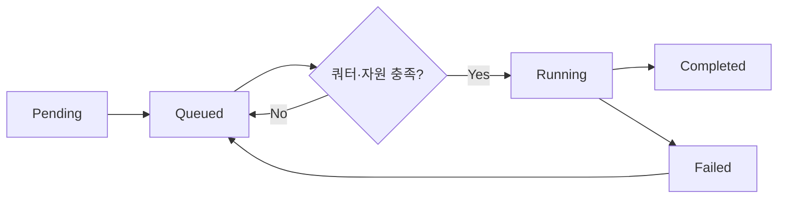
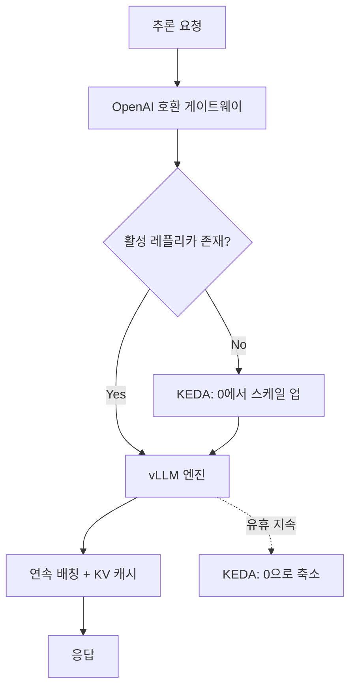
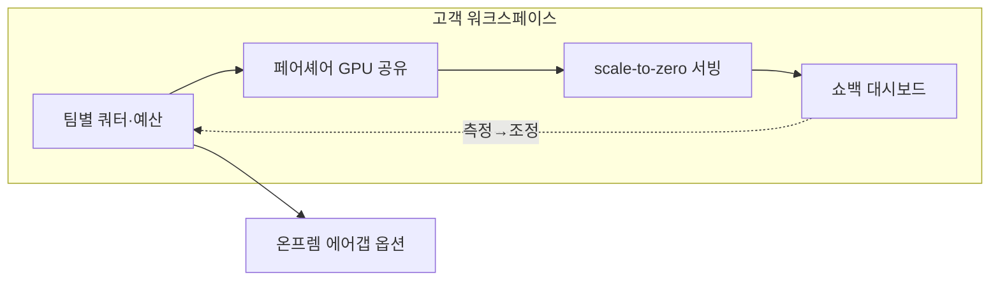

## 비용이 안 보이면 줄일 수 없다

AI 추론 비용을 줄이는 일은 보통 "더 싼 GPU를 사자"에서 시작하지만, 그건 거의 항상 틀린 출발점입니다. 같은 H100이라도 어떻게 스케줄링하고, 어떤 엔진으로 서빙하고, 어떤 모델 티어로 요청을 라우팅하느냐에 따라 토큰당 원가는 몇 배씩 벌어집니다. 하드웨어는 비용의 바닥일 뿐이고, 진짜 낭비는 그 위 운영 레이어에서 조용히 새어 나갑니다.

ThakiCloud는 Kubernetes 기반 AI/ML 플랫폼을 운영하면서 이 문제를 매일 마주합니다. 이 글은 우리가 내부에서 추론 비용을 어떻게 깎는지, 그리고 같은 레버를 고객이 우리 제품 위에서 어떻게 당길 수 있는지를 수식과 실제 설정으로 풀어 정리한 것입니다. 마케팅 슬라이드가 아니라, 우리가 실제로 쓰는 산식과 패턴을 그대로 공개합니다.

핵심 주장은 하나입니다. **비용은 측정 가능한 단위로 못 박은 다음에야 줄어든다.** 그래서 GPU 원가를 식으로 고정하는 것부터 시작합니다.

## 1. GPU 시간당 원가를 식으로 못 박기

"H100 한 장에 얼마"라는 질문은 절반만 맞습니다. 구매가는 자본 지출(CapEx)이고, 전기와 상면, 인력은 매달 나가는 운영 지출(OpEx)입니다. 둘을 시간당 한 숫자로 합쳐야 토큰 원가를 계산할 수 있습니다.

우리 내부 원가 계산기(`scripts/gen_model_token_cost_xlsx.py`)는 이 산식을 코드로 박아 둡니다.

```text
월 감가상각 = 구매가 / 48개월
시간당 GPU 원가 = (월 감가상각 + 월 OpEx) / 730시간
토큰 원가($/1K) = 시간당 GPU 원가 / (초당 처리량 tok/s × 3.6)
```

48개월(4년) 상각은 데이터센터 GPU의 보수적인 수명 가정입니다. 730은 한 달 평균 시간(24 × 365 / 12)이고요. 여기서 중요한 건 **OpEx를 뭉뚱그리지 않고 분해**하는 점입니다.

| OpEx 항목 | 월 비용(USD) | 산출 근거 |
|---|---|---|
| 전력 | $58 | TDP × PUE 1.3 × $0.08/kWh × 730h |
| 코로케이션(상면) | $312 | 랙 공간·냉각 |
| 네트워크 | $150 | 대역폭·트랜짓 |
| 인력 배분 | $100 | 운영 인건비 안분 |
| 소프트웨어 라이선스 | $52 | 모니터링·오케스트레이션 |
| **합계** | **$672/월** | GPU 종류와 무관하게 동일 |

전력이 $58인데 상면이 $312라는 점에 주목할 만합니다. 흔히 "GPU는 전기를 많이 먹어서 비싸다"고 생각하지만, 실제 OpEx에서 전력은 일부일 뿐이고 상면과 네트워크가 더 큽니다. 전기료만 들여다보는 최적화가 헛다리를 짚는 이유입니다.

여기에 한국 시장의 현실을 하나 더 얹습니다. GPU 도입가에는 관세·물류·유통 마진이 붙어 **약 30% 프리미엄**이 발생합니다. 우리 계산기는 이걸 명시적으로 반영합니다. H100 본체 기준가 $32,500은 한국 도입가 $42,250으로, B200 $20,000은 $26,000으로 보정됩니다.

이 산식을 실제로 돌리면 GPU 한 장의 시간당 원가가 한 숫자로 떨어지고, 그 위에서 비로소 "이 모델을 이 처리량으로 서빙하면 토큰당 얼마"가 계산됩니다. 원가가 식으로 고정되면, 최적화는 추측이 아니라 산수가 됩니다.


## 2. 자가호스팅 vs API: 격차의 해부

원가를 식으로 잡고 나면 다음 질문이 자명해집니다. 같은 토큰을 외부 API로 사는 것과 자가호스팅으로 찍어내는 것, 어느 쪽이 싼가.

우리 계산기의 API 비교 시트는 상용 API와 자가호스팅 토큰 원가 사이에 **50배에서 100배** 격차가 난다고 보여줍니다. 물론 이 격차는 가동률(utilization)이 충분히 높을 때만 성립합니다. GPU를 절반만 쓰면 자가호스팅 토큰 원가는 두 배가 되니까요. 그래서 자가호스팅의 경제성은 "GPU를 놀리지 않는 능력", 즉 스케줄링과 서빙 효율에 통째로 달려 있습니다.

참고로 외부 API 단가는 우리 일일 비용 감사 스크립트(`scripts/cost_audit.py`)에 공식 가격으로 박혀 있습니다.

```python
# scripts/cost_audit.py 내 단가 테이블 (USD / MTok, 입력/출력)
PRICING = {
    "opus":   {"in": 15.0, "out": 75.0},
    "sonnet": {"in": 3.0,  "out": 15.0},
    "haiku":  {"in": 0.80, "out": 4.0},
}
```

Opus 출력 토큰은 Haiku의 약 19배입니다. 이 단가표 하나만 내면화해도 "왜 같은 작업을 Opus로 돌리면 비용이 폭발하는가"가 설명됩니다. 자가호스팅이든 API든, 비용 최적화의 절반은 **올바른 모델을 올바른 작업에 붙이는 것**입니다. 이 라우팅 이야기는 뒤에서 다시 다룹니다.

> 내부 운영 수치 한 가지를 공유하면, 우리는 한때 에이전트 워크로드의 상당 부분을 외부 Claude API로 돌리며 월 ₩40M 이상(약 $30K)을 지출한 시기가 있었습니다. [추정] 이 중 Opus 비중이 절반 가까이였고, 이 관측이 자가호스팅 전환과 모델 티어 라우팅을 밀어붙인 직접적 계기였습니다.

## 3. 스케줄링: GPU를 놀리지 않기

자가호스팅 경제성이 가동률에 달려 있다면, 스케줄러가 비용 최적화의 심장입니다. ThakiCloud는 Kubernetes 위에서 **Kueue + KAI 스케줄러**로 GPU 워크로드를 큐잉합니다.

핵심 메커니즘은 세 가지입니다.

첫째, **갱 스케줄링(gang scheduling)**. 분산 학습 작업은 필요한 모든 GPU가 동시에 확보될 때만 시작합니다. 절반만 잡고 나머지를 기다리며 GPU를 점유하는 낭비를 막습니다.

둘째, **팀별 페어셰어(fair-share) 큐**. 여러 팀이 한 클러스터를 공유할 때, 한 팀이 자원을 독점하지 않도록 공정 분배합니다. 비어 있는 쿼터는 다른 팀이 빌려 쓰다가, 원래 팀이 요청하면 반납합니다.

셋째, **LocalQueue + ClusterQueue 쿼터**. 워크스페이스 단위로 쓸 수 있는 GPU 상한을 강제합니다. 이게 곧 뒤에 나올 고객용 예산 통제의 토대입니다.

워크로드는 명확한 수명 주기를 따라 흐릅니다.



이 구조의 핵심은 **빈 패킹(bin packing)**입니다. 작은 작업들을 GPU에 촘촘히 끼워 넣어 단편화를 줄이면, 같은 하드웨어로 더 많은 일을 처리하고 토큰당 원가가 떨어집니다. 스케줄러가 잘 채울수록 자가호스팅의 50배 우위가 현실이 됩니다.


## 4. 서빙 레이어에서 더 짜내기

스케줄링이 GPU를 놀리지 않게 한다면, 서빙 엔진은 확보한 GPU에서 토큰을 최대한 많이 뽑아내는 단계입니다. 우리는 **vLLM + KEDA** 조합으로 추론을 서빙합니다.



여기서 비용을 깎는 레버는 세 개입니다.

**Scale-to-zero(0으로 축소).** KEDA가 트래픽이 없는 모델 엔드포인트를 0개 레플리카로 내립니다. 요청이 오면 다시 띄웁니다. 야간이나 저빈도 모델은 "켜 둔 채 놀리는" 비용을 아예 없앱니다. 자가호스팅에서 가장 큰 낭비가 유휴 GPU인데, 이걸 구조적으로 제거합니다.

**연속 배칭(continuous batching).** vLLM은 들어오는 요청을 동적으로 묶어 GPU를 빈틈없이 굴립니다. 요청당 처리량이 올라가면 1절의 산식에서 분모(초당 처리량)가 커지고, 토큰 원가는 그만큼 내려갑니다.

**KV 캐시 재사용과 양자화.** 같은 프롬프트 접두부를 공유하는 요청은 KV 캐시를 재활용해 중복 연산을 줄입니다. 양자화는 같은 GPU에서 더 큰 모델 또는 더 높은 처리량을 가능하게 합니다. (양자화 벤치마크는 우리 로드맵의 다음 항목입니다.)

여기에 외부 API 호출까지 줄이는 레이어가 하나 더 있습니다. 우리 **Agent Tool Gateway(ATG)**는 외부 도구 호출에 캐싱·중복 제거·압축을 적용합니다. 에이전트가 같은 외부 호출을 반복할 때 결과를 재사용해, 토큰뿐 아니라 외부 API 청구 자체를 줄입니다.


## 5. 라우팅과 관측: 운영비를 잡는 마지막 30%

하드웨어와 서빙을 최적화해도, 잘못된 모델에 작업을 붙이면 비용은 다시 샙니다. ThakiCloud의 내부 규칙은 **작업 성격에 따라 모델 티어를 라우팅**하는 것입니다. 이건 우리 에이전트 운영 규칙에 그대로 코드화되어 있습니다.

| 작업 유형 | 모델 티어 | 상대 비용 |
|---|---|---|
| 탐색·파일 읽기·검색·grep | haiku | ~1x |
| 구현·리뷰·테스트·요약 | sonnet | ~4x |
| 아키텍처·복잡한 다단계 추론 | opus | ~19x |

원칙은 단순합니다. **워커는 싸게, 게이트만 비싸게.** 탐색은 haiku로 던지고, 정말 복잡한 판단이 필요한 단계에만 opus를 씁니다. 품질이 안 나올 때 무작정 상위 모델로 올리기 전에, 먼저 검증 단계를 추가하는 쪽이 보통 더 싸고 더 정확합니다.

그리고 이 모든 걸 **매일 측정**합니다. `cost_audit.py`는 세션 트랜스크립트를 파싱해 모델 티어별 비용, 캐시 적중률, 도구·명령 사용량을 집계합니다.

```python
# 캐시 적중률 = 비싼 재처리를 얼마나 피했는가
cache_hit_ratio = cache_read / (cache_read + cache_write + input_tokens)
```

이 감사 한 번이 우리에게 가장 비싼 교훈을 줬습니다. 하루 비용의 대부분이 단 하나의 거대한 모니터링 세션에서, 그것도 Opus 단가로 발생하고 있었다는 사실이었죠. 측정하지 않았다면 영원히 몰랐을 누수입니다. **비용 최적화는 대시보드가 아니라 습관**이고, 그 습관의 출발점은 매일 돌리는 감사입니다.

## 6. 고객이 같은 레버를 당기는 법

지금까지가 "우리가 어떻게 하는가"였다면, 같은 메커니즘은 그대로 제품 기능이 되어 고객에게 열려 있습니다. ThakiCloud 플랫폼 위에서 고객은 별도 인프라 팀 없이도 아래 레버를 당길 수 있습니다.

**워크스페이스 쿼터와 예산.** 3절의 ClusterQueue/LocalQueue가 고객에게는 "팀별 GPU 예산"으로 보입니다. 부서마다 상한을 걸고, 남는 쿼터는 자동으로 다른 팀이 빌려 씁니다. 예산 초과 폭주가 구조적으로 불가능해집니다.

**GPU 공유와 페어셰어.** 작은 추론 작업 여러 개가 한 GPU를 공정하게 나눠 씁니다. "팀마다 GPU 한 장씩"이라는 과다 프로비저닝을 없애고, 같은 하드웨어로 더 많은 워크로드를 돌립니다.

**Scale-to-zero 서빙.** 고객의 모델 엔드포인트도 트래픽이 없으면 0으로 내려갑니다. 사내 데모나 저빈도 모델을 24시간 켜 두는 비용을 내지 않습니다. 쓴 만큼만 냅니다.

**쇼백/차지백 가시성.** 백엔드(`ai-platform-backend`)의 빌링·잡 오케스트레이션 API가 워크스페이스별 사용량을 집계합니다. 어느 팀이, 어느 모델로, 얼마를 썼는지 보이면 비로소 줄일 수 있습니다. 5절에서 말한 "측정 먼저"가 고객에게도 똑같이 적용됩니다.

**온프레미스 배포.** 규제 산업 고객은 `k0s` 기반 에어갭(망 분리) 환경에 플랫폼을 통째로 올릴 수 있습니다. 토큰을 외부 API로 흘려보내는 대신, 자기 GPU에서 찍어냅니다. 데이터 주권과 비용 우위를 동시에 가져가는 구조입니다.



## ThakiCloud 관점: 쓸수록 싸지는 비용 구조

마지막으로 이 모든 레버가 합쳐지면 어떤 그림이 되는지 짚겠습니다.

상용 API의 비용 구조는 변동비입니다. 토큰을 쓰는 만큼 선형으로 청구되고, 많이 쓸수록 더 냅니다. 자가호스팅과 온프레미스로 옮기면 비용이 **고정비(CapEx + 한계 전기료)**로 바뀝니다. GPU를 한 번 사 두면, 추가 토큰의 한계비용은 거의 전기료뿐입니다. **쓸수록 평균 원가가 내려가는** 구조가 됩니다. 이게 우리가 말하는 비용 해자(cost moat)의 핵심입니다.

여기에 자가학습 루프를 얹습니다. 오픈 웨이트 모델(예: Kimi K2.5 계열)을 고객 데이터로 파인튜닝해 도메인 에이전트를 만들면, 외부 API 의존과 데이터 유출 위험을 동시에 줄입니다. 에이전트가 자기 후임을 우리 GPU 위에서 학습시키는 구조라, 규모가 커질수록 토큰 원가가 떨어집니다.

내부 목표 트라젝토리로는, 작업당 비용을 현재 수준에서 **약 83% 낮춰 $0.041 → $0.007/task** 수준까지 가져가는 것을 12개월 계획으로 잡고 있습니다. [추정] 이 숫자는 스케줄링·서빙·라우팅 최적화가 복리로 쌓일 때의 목표치이며, 단일 레버가 아니라 이 글에서 다룬 전체 스택의 합으로만 달성됩니다.

그리고 한국 시장의 현실적 요구도 이 구조와 맞물립니다. 공공·금융 고객을 위한 온프레미스·망분리 배포는 국정원 N²SF(국가망보안체계)와 보안기능확인서 같은 인증 요건을 충족해야 하고, 우리는 이를 2026년 릴리스의 핵심 목표로 두고 준비하고 있습니다. 비용 효율과 보안 규제 대응이 별개가 아니라, 같은 온프레미스 아키텍처에서 함께 풀리는 문제입니다.

## 마무리

추론 비용 최적화는 한 방의 묘수가 아니라 레이어마다 새는 곳을 막는 일입니다. GPU 원가를 식으로 고정하고, 스케줄러로 놀리지 않고, 서빙 엔진에서 짜내고, 라우팅으로 모델을 맞추고, 매일 측정해서 누수를 잡습니다. ThakiCloud는 이 스택을 내부에서 돌리고, 같은 레버를 제품 기능으로 고객에게 엽니다.

비용은 보이는 만큼만 줄어듭니다. 그래서 우리는 항상 측정부터 시작합니다.

---

*ThakiCloud는 Kubernetes 기반 AI/ML 플랫폼으로 GPU 스케줄링, 효율적 추론 서빙, 온프레미스 배포를 통한 비용 최적화를 제공합니다. 플랫폼이나 채용에 관심이 있다면 [ThakiCloud](https://thakicloud.github.io)를 방문해 주세요.*
