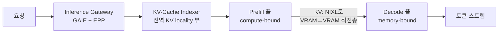
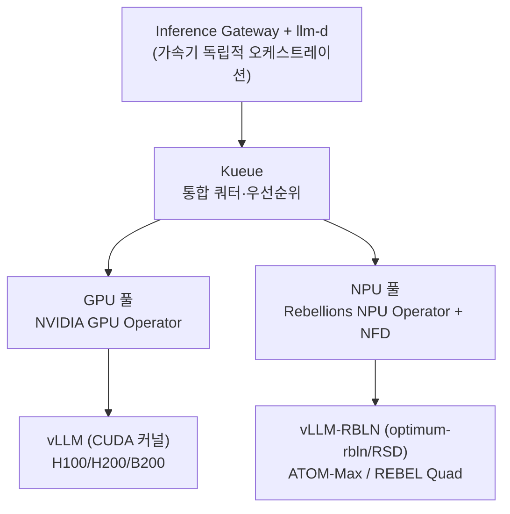

## GPU를 더 사도 추론이 안 빨라진다

LLM 추론을 운영하다 보면 직관에 반하는 벽을 만납니다. GPU를 더 사도 처리량이 그만큼 늘지 않는 것입니다. 원인은 추론이 성격이 정반대인 두 단계로 나뉘기 때문입니다.

프롬프트를 한 번에 계산하는 prefill 단계는 compute-bound라 GPU 활용률이 90%를 웃돕니다. 반면 토큰을 한 개씩 만드는 decode 단계는 memory-bound라 활용률이 30% 아래로 떨어집니다. 한 GPU가 이 둘을 다 처리하면 활용률이 출렁이고, 같은 시스템 프롬프트나 같은 접두부를 가진 요청들도 캐시를 나눠 쓰지 못합니다. 그래서 GPU를 수평 복제하는 scale-up은 비싸고 비효율적입니다. 정말 필요한 것은 같은 GPU에서 더 많은 요청을 처리하게 만드는 스케줄링입니다.

llm-d의 한 줄 요지가 바로 이것입니다. GPU를 더 사도 안 풀리는 것을 푸는 추론 스케줄러. 이 글은 우리가 내부 세미나와 아키텍처 리포트로 정리한 llm-d의 작동 원리와, 그 위에 GPU와 국산 NPU를 함께 얹는 이기종 구성도를 공개합니다. 마케팅 슬라이드가 아니라 우리가 검증하려는 레퍼런스 설계 그대로입니다.

## llm-d는 무엇인가: 검증된 3개 위에 선다

llm-d는 Kubernetes-native 고성능 분산 LLM 추론 프레임워크입니다. 중요한 점은 처음부터 새로 만들지 않고, 이미 검증된 세 개를 조립한다는 것입니다.

첫째는 vLLM입니다. PagedAttention, continuous batching, speculative decoding을 제공하는 실제 추론 엔진입니다. 둘째는 Kubernetes로, 배포와 스케줄, 오토스케일, 장애복구의 기반입니다. 셋째는 Inference Gateway(GAIE)로, 상태를 인지하는 라우팅을 위한 Gateway API 확장입니다.

이 위에서 llm-d가 더하는 핵심 기능은 두 가지입니다. KV-cache aware 라우팅과 prefill/decode 분리입니다. 거버넌스 측면에서도 신뢰를 확보했습니다. llm-d는 2026년 CNCF Sandbox에 채택되었고 IBM, Red Hat, Google, CoreWeave, NVIDIA가 후원합니다.

## 무기 1: KV-cache aware 라우팅

첫 번째 무기는 요청을 아무 Pod에나 보내지 않는 것입니다. 들어온 프롬프트의 접두부 KV 캐시를 이미 GPU 메모리에 들고 있는 Pod로 보냅니다. 서로 다른 사용자 사이에서도 마찬가지입니다.

효과는 중복 prefill 연산 제거입니다. 멀티턴 대화, RAG, 공통 시스템 프롬프트처럼 접두부가 겹치는 워크로드에서 특히 큽니다. 지연은 내려가고 처리량은 올라갑니다.

방식은 두 가지입니다. approximate는 트래픽 패턴으로 캐시 위치를 추정합니다. 가볍지만 부정확합니다. precise는 vLLM의 KV-Events를 직접 구독해 실제 KV 블록 상태를 읽습니다. 정확합니다. 이 둘을 받치는 것이 KV-Cache Indexer로, 전체 vLLM Pod의 KV 블록 locality를 near-real-time 전역 뷰로 유지하는 고성능 라이브러리입니다.

## 무기 2: Prefill / Decode 분리

두 번째 무기는 성격이 정반대인 두 단계를 물리적으로 분리하는 것입니다. prefill 풀과 decode 풀을 별도 Pod 풀로 쪼개 각 단계를 독립적으로 튜닝합니다. 그러면 한 GPU가 둘을 오가며 생기던 활용률 출렁임이 사라집니다.

핵심은 KV 캐시 전송 방식입니다. prefill 엔진의 VRAM에서 decode 엔진의 VRAM으로 NIXL을 통해 직전송하며, 이 전송은 비차단이라 전송 중에도 GPU는 다른 요청을 처리합니다. 덕분에 첫 토큰 지연(TTFT)과 토큰 간 지연(ITL)을 서로 간섭 없이 따로 최적화할 수 있습니다.

정직한 주의사항도 있습니다. 소규모, 저동시성 환경에서는 KV 전송 비용 때문에 오히려 20~30% 느려질 수 있습니다. 분리는 규모가 받쳐줄 때만 이득입니다.

## 컴포넌트와 성능 근거

전체 데이터 경로를 컴포넌트로 정리하면 다음과 같습니다.

| 컴포넌트 | 역할 |
|---|---|
| Inference Gateway (GAIE) + EPP | EPP가 Pod별 캐시 적중도를 점수화해 최적 Pod로 라우팅 |
| KV-Cache Indexer | 전 vLLM Pod의 KV 블록 locality를 전역 뷰로 유지 (approximate / precise) |
| Prefill/Decode 분리 | compute-bound 프리필과 memory-bound 디코드를 별도 풀로, KV는 NIXL 직전송 |
| vLLM (백엔드) | 실제 추론 엔진. PagedAttention, continuous batching |
| K8s Operator / CRD | 선언적 배포와 오토스케일, ArgoCD GitOps로 버전 관리 |

성능 근거도 공개된 수치로 확인됩니다. 16×16 B200 토폴로지에서 약 50,000 output tok/s와 order-of-magnitude 수준의 TTFT 감소가 보고되었습니다. AMD 쪽에서는 4×MI300X로 Llama-3.1-70B를 서빙할 때 prefix-cache aware 라우팅 적용 후 출력 처리량 3배, TTFT 2배 개선이 보고되었습니다.

다만 이 수치들은 토폴로지, 모델, 정밀도에 강하게 의존합니다. 같은 "N tok/s"라도 단일 처리량인지 합산 처리량인지, 입력 길이와 배치와 정밀도가 무엇인지에 따라 의미가 열 배씩 달라집니다. 라벨 없는 벤치마크 숫자는 신뢰하지 않는 것이 원칙입니다.

대안과의 관계도 명확히 해둡니다. 모델이 단일 노드 GPU에 들어가면 vLLM 단독이 가장 단순한 정답입니다. 단일 노드를 넘고 멀티모델과 K8s 스케일이 필요할 때 llm-d가 들어옵니다. NVIDIA Dynamo는 데이터센터 스케일 오케스트레이션을, SGLang은 MoE-EP와 최신 PD 분리 성능을 노립니다. llm-d와 Dynamo는 배타적이지 않습니다. Dynamo가 오케스트레이션, vLLM과 llm-d가 엔진 레이어로 공존할 수 있습니다.

## 이기종: GPU 위에 국산 NPU를 더한다

여기서부터가 우리 아키텍처 리포트의 핵심입니다. llm-d와 vLLM의 오케스트레이션 레이어는 가속기 종류와 독립적입니다. 라우팅과 disaggregation 로직은 그대로 두고 가속기 풀만 GPU에서 NPU로 바꿀 수 있다는 뜻입니다.

국산 AI 반도체 기업 Rebellions의 NPU는 vLLM-RBLN 플러그인으로 vLLM 생태계에 직접 연결됩니다. 모델은 optimum-rbln으로 컴파일한 뒤 vLLM-RBLN이 참조하고, FlashAttention과 PagedAttention, Sliding Window Attention을 NPU 메모리 계층에 이식해 단일 실행 그래프로 묶었습니다. 스케일아웃은 RSD(Rebellions Scalable Design)가 prefill/decode 분리와 멀티노드, MoE 라우팅을 담당합니다. 즉 llm-d가 하는 일의 일부를 NPU 레벨에서 자체 제공합니다.

| 칩 | 구성 | 메모리 | 용도 |
|---|---|---|---|
| ATOM+ (RBLN-CA22) | 단일 NPU | 16GB on-chip | 추론, vLLM-RBLN 지원 |
| ATOM-Max (RBLN-CA25) | 듀얼서버 8 NPU | 총 128GB | 70B급 모델 구동 가능 |
| REBEL / Rebel100 | 4 칩렛 + HBM3E | HBM3E 대용량 | PetaFLOPS급, MoE 최적화 |
| REBEL Quad | REBEL 4개 결합 | HBM3E | 2026 상반기 양산 예정 |

Kubernetes 통합도 GPU와 대칭입니다. Red Hat AI 레퍼런스 기준으로 OpenShift에서 NFD가 PCI vendor ID 1eff로 ATOM을 탐지하고, Rebellions NPU Operator가 드라이버와 device-plugin, 모니터링을 관리해 NPU를 allocatable 자원으로 등록합니다. vLLM 설정은 `VLLM_TARGET_DEVICE=rbln`, `VLLM_USE_V1=1`, `RBLN_KERNEL_MODE=triton` 환경변수로 제어하고, 전력과 온도, 메모리를 Prometheus로 노출합니다.

두 풀을 한 클러스터에서 비교하면 역할이 갈립니다.

| 구분 | GPU 풀 | Rebellions NPU 풀 |
|---|---|---|
| 대표 하드웨어 | H100/H200/B200 + NVLink | ATOM-Max(8 NPU·128GB) / REBEL Quad |
| 서빙 엔진 | vLLM (CUDA 커널) | vLLM-RBLN (optimum-rbln/RSD) |
| disagg/MoE | llm-d로 성숙 | RSD 자체 제공, llm-d 연동은 검증 대상 |
| 강점 | 생태계와 커널 성숙도, 최고 처리량 | 전력효율, 소버린(국산), MoE 최적 주장 |
| 주의 | 전력과 공급, 비용 | 분산 disagg/KV 라우팅, 대형모델 레퍼런스 적음 |

## ThakiCloud 적용과 도입 로드맵

이 구성의 가장 큰 장점은 우리 스택에 신규 인프라 없이 그대로 얹힌다는 것입니다. 이미 쓰는 Kubernetes, Kueue, ArgoCD 위에서 동작합니다. Kueue가 prefill과 decode 워커 풀을 gang-scheduling과 쿼터로 배치하고, ArgoCD가 CRD를 GitOps로 관리합니다. 관측성은 TTFT, ITL, tok/s, KV 적중률을 Prometheus와 Grafana로, 모델 티어별 SLO를 SRE 룰로 잡습니다.

도입은 정량 게이트를 통과하며 단계적으로 갑니다. Phase 0에서 GPU 풀에 llm-d 베이스라인을 구축하고 KV 라우팅과 PD 분리 효과를 측정합니다. Phase 1에서 prefix-cache 라우팅을 튜닝하고 멀티모델 서빙과 SLO를 수립합니다. Phase 2에서 Rebellions ATOM-Max 1노드를 K8s에 편입해 동일 모델을 NPU로 벤치합니다. Phase 3에서 이종 라우팅 정책을 세우고 REBEL Quad 양산 일정에 맞춰 MoE 워크로드를 재평가합니다. 각 단계 전에 측정 정의, 즉 단일과 합산, 입력 길이, 배치, 정밀도를 먼저 고정하는 것이 원칙입니다.

## 리스크와 반대 결론

좋은 설계 문서는 자기 주장을 스스로 공격해야 합니다. 이 구성의 약점을 정직하게 적습니다.

NPU 경로의 성숙도가 가장 큰 미지수입니다. vLLM-RBLN은 단일 노드 서빙에는 견고하지만, llm-d의 분산 disaggregation과 precise KV 라우팅을 NPU에서 그대로 쓸 수 있는지는 아직 검증되지 않았습니다. RSD가 자체 disaggregation을 제공하므로, "llm-d 위 NPU"가 아니라 "RSD 단독" 구성이 더 현실적일 수도 있습니다. 대형 모델 레퍼런스도 GPU 대비 적습니다. ATOM-Max 128GB로 70B는 되지만 744B급 MoE는 다수 노드와 대규모 RSD가 필요하고, 공개 레퍼런스가 부족합니다. 우리 PoC가 곧 레퍼런스가 된다는 점은 기회이자 리스크입니다.

그리고 반대 결론입니다. 만약 목표가 최단기 최고 처리량뿐이라면 NPU 도입은 복잡도만 늘립니다. 그때는 GPU와 llm-d로 충분합니다. NPU의 가치는 전력효율과 국산화, 공급망 다변화라는 별도의 전략 목표가 있을 때 비로소 성립합니다. 마찬가지로 모델이 단일 노드에 들어가고 트래픽이 작다면 llm-d 자체가 과투자이고 vLLM 단독이 정답입니다.

## ThakiCloud 관점: 가속기에 묶이지 않는 추론

우리가 이 아키텍처에 주목하는 이유는 단순합니다. llm-d의 오케스트레이션이 가속기에 독립적이라는 한 가지 성질이, GPU 풀과 국산 NPU 풀을 한 클러스터에서 운용하는 소버린 AI 추론 구성을 설계상 가능하게 만들기 때문입니다.

이것은 온프레미스 AI 플랫폼을 제공하는 우리에게 전략적으로 중요합니다. 고객은 전력 예산과 공급망, 그리고 국산화 요구에 따라 가속기를 선택할 수 있어야 하고, 그 선택이 추론 스택 전체를 다시 짜는 비용으로 이어져서는 안 됩니다. vLLM 추상화와 llm-d의 가속기 독립성이 그 비용을 없앱니다. 대형과 저지연은 GPU로, 중형과 전력효율은 NPU로 보내는 이종 정책을 같은 라우팅 로직 위에서 구현할 수 있습니다.

물론 이 모든 것은 레퍼런스 설계이며 PoC 검증 전입니다. 그래서 우리는 측정 정의를 먼저 고정하고, GPU 베이스라인부터 정량 게이트를 통과하며 NPU로 확장하는 단계적 경로를 택했습니다.

## 마무리

llm-d의 교훈은 추론 효율이 하드웨어 구매가 아니라 스케줄링의 문제라는 것입니다. KV-cache aware 라우팅으로 중복 연산을 없애고, prefill과 decode를 분리해 활용률을 안정화하면, 같은 GPU에서 더 많은 요청을 처리할 수 있습니다. 그리고 그 오케스트레이션이 가속기에 독립적이기 때문에, GPU 위에 국산 NPU를 더해 소버린 추론으로 확장하는 길이 열립니다.

ThakiCloud는 이 이기종 추론 아키텍처를 Kubernetes, Kueue, ArgoCD 위에서 검증하고 있습니다. 더 많은 이야기는 홈페이지에서 확인하실 수 있습니다.

## 출처

- Red Hat Developer, Master KV cache aware routing with llm-d: [https://developers.redhat.com/articles/2025/10/07/master-kv-cache-aware-routing-llm-d-efficient-ai-inference](https://developers.redhat.com/articles/2025/10/07/master-kv-cache-aware-routing-llm-d-efficient-ai-inference)
- llm-d 공식 사이트: [https://llm-d.ai/](https://llm-d.ai/)
- llm-d + KServe + vLLM 프로덕션: [https://llm-d.ai/blog/production-grade-llm-inference-at-scale-kserve-llm-d-vllm](https://llm-d.ai/blog/production-grade-llm-inference-at-scale-kserve-llm-d-vllm)
- llm-d GitHub: [https://github.com/llm-d/llm-d](https://github.com/llm-d/llm-d)
- Rebellions, LLM Serving with NPU: [https://rebellions.ai/llm-serving-with-npu/](https://rebellions.ai/llm-serving-with-npu/)
- Red Hat Developer, Running AI inference on Rebellions ATOM NPU: [https://developers.redhat.com/articles/2026/05/27/running-ai-inference-rebellions-atom-npu-red-hat-ai](https://developers.redhat.com/articles/2026/05/27/running-ai-inference-rebellions-atom-npu-red-hat-ai)
- vLLM-RBLN 플러그인: [https://github.com/rebellions-sw/vllm-rbln](https://github.com/rebellions-sw/vllm-rbln)

주: 구성도는 공개 자료 기반 레퍼런스 설계입니다. 일부 칩 사양은 공개 백서에 미기재되어 비워 두었고, llm-d 위 Rebellions NPU 통합은 vLLM-RBLN을 전제로 한 설계 가설로 PoC 검증 전입니다. 성능 수치는 환경 의존적이므로 단일과 합산 처리량을 구분해 해석해야 합니다.
