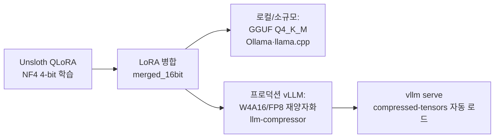

## 왜 또 양자화인가

서빙 비용의 대부분은 GPU 메모리와 처리량에서 나옵니다. 모델을 4비트로 줄이면 같은 카드에 더 큰 모델을 올리고, 같은 모델을 더 많은 동시 사용자에게 제공할 수 있습니다. 문제는 "어떤 양자화를 골라야 vLLM에서 실제로 잘 서빙되느냐"입니다.

우리가 앞서 다룬 [NVFP4 양자화](https://github.com/ThakiCloud/praxis)는 W4A4를 Blackwell(B200) 텐서코어에서 돌리는 최신 경로입니다. 다만 NVFP4 텐서코어는 Blackwell에만 있습니다. H100·A100 같은 이전 세대나, 혼합된 클러스터에서는 다른 기법이 필요합니다. 이 글은 NVFP4를 빼고, 지금 가진 하드웨어에서 vLLM으로 바로 서빙할 수 있는 기법을 실제 레시피와 함께 정리합니다. Unsloth Dynamic 2.0도 포함합니다.

## vLLM이 서빙하는 양자화 지도

| 방법 | 비트폭 | vLLM 로드 | GPU | 메모 |
|---|---|---|---|---|
| AWQ + Marlin | W4A16 | `--quantization awq` (Marlin 자동) | Turing+ | 프로덕션 4비트 표준 |
| GPTQ / GPTQModel | W4A16, W3 | `--quantization gptq` | Volta+ | 호환성 가장 넓음 |
| compressed-tensors | W4A16 / W8A8 / FP8 | 자동 감지(플래그 불요) | Turing+ ~ Blackwell | llm-compressor 공식 포맷 |
| FP8 (E4M3) | W8A8 FP8 | `--quantization fp8` 또는 자동 | Ada(cc≥8.9)·Hopper·Blackwell | MoE 1순위 |
| INT8 W8A8 | W8A8 INT8 | compressed-tensors 자동 | Turing+ | SmoothQuant 계열 |
| AutoRound | W4A16, INT2-4 | compressed-tensors 자동 | CUDA·CPU·Intel | 초저비트 정확도 우수 |
| bitsandbytes NF4 | W4A16 | `--quantization bitsandbytes` | Volta-Hopper | 메모리용, 처리량 낮음 |
| GGUF | Q4-Q8 | `repo:quant` (플러그인) | 실험적 | llama.cpp 생태계용 |

핵심은 두 가지입니다. 첫째, vLLM의 4비트 프로덕션 표준은 AWQ나 GPTQ를 **Marlin 커널**로 돌리는 W4A16입니다. JarvisLabs 벤치마크에서 Qwen2.5-32B 기준 Marlin-AWQ가 741 tok/s로, 기본 AWQ 커널 68 tok/s 대비 크게 빨랐습니다([출처](https://jarvislabs.ai/blog/vllm-quantization-complete-guide-benchmarks)). 둘째, neuralmagic(Red Hat)와 vLLM 프로젝트가 함께 만든 **compressed-tensors** 포맷은 모델의 `quantization_config`를 vLLM이 읽어 플래그 없이 자동 로드합니다.

## compressed-tensors와 llm-compressor: 권장 경로

`llm-compressor`로 양자화하면 결과물이 compressed-tensors 포맷으로 저장되고, vLLM이 자동 감지합니다. W4A16, W8A8-INT8, FP8을 모두 한 도구로 다룹니다([llm-compressor](https://github.com/vllm-project/llm-compressor)).

```python
# W4A16 (AWQ 스타일) llm-compressor 레시피
from llmcompressor.transformers import oneshot
from llmcompressor.modifiers.quantization import GPTQModifier

recipe = GPTQModifier(scheme="W4A16", targets="Linear", ignore=["lm_head"])
oneshot(
    model="Qwen/Qwen3-30B-A3B",
    dataset="open_platypus",   # 보정(calibration) 셋
    recipe=recipe,
    output_dir="Qwen3-30B-A3B-W4A16",
    max_seq_length=2048, num_calibration_samples=512,
)
```

서빙은 플래그가 거의 필요 없습니다.

```bash
# compressed-tensors는 자동 감지, --quantization 생략 가능
vllm serve ./Qwen3-30B-A3B-W4A16 --served-model-name qwen3-w4a16
# AWQ 체크포인트를 직접 서빙할 때
vllm serve TheBloke/...-AWQ --quantization awq
```

FP8은 보정 데이터 없이도 동적으로 만들 수 있어 가장 손이 적게 갑니다.

```python
from llmcompressor.modifiers.quantization import QuantizationModifier
recipe = QuantizationModifier(targets="Linear", scheme="FP8_DYNAMIC", ignore=["lm_head"])
```

## MoE 모델(Qwen3-MoE)은 FP8 블록-와이즈

우리 기본 서빙 대상은 Qwen3-MoE 계열입니다. MoE는 양자화에서 까다롭습니다. 결론부터 말하면 cc≥8.9 GPU(Ada·Hopper·Blackwell)에서는 **FP8 블록-와이즈**가 1순위입니다. 보정 데이터가 필요 없고 vLLM이 공식 지원합니다. 메모리가 더 빠듯하면 W4A16으로 내려갑니다. 단, Qwen3-MoE에서 FP8 per-tensor는 차원 불일치 버그가 보고됐으니 블록-와이즈를 쓰는 편이 안전합니다([이슈](https://github.com/vllm-project/llm-compressor/issues/2043)).

## Unsloth: 파인튜닝과 Dynamic 2.0 양자화

Unsloth는 두 가지로 유용합니다. 하나는 QLoRA 파인튜닝, 다른 하나는 Dynamic 2.0 양자화입니다.

**Dynamic 2.0(UD)**는 모든 레이어에 같은 비트폭을 일괄 적용하지 않고, 레이어별 민감도를 평가해 중요한 레이어는 높은 정밀도로, 덜 중요한 레이어는 더 낮은 비트로 압축합니다. 모델마다 다른 맞춤형 양자화 맵이 나옵니다. Unsloth가 공개한 벤치마크에서 Gemma 3 27B의 Dynamic Q4_K_XL이 MMLU 5-shot 71.47%로, Google QAT 베이스라인 70.64%보다 높으면서 파일은 15.64GB로 더 작았습니다(Unsloth-reported, [블로그](https://unsloth.ai/blog/dynamic-v2)). 초기 Dynamic이 MoE에서만 잘 동작했던 것과 달리 2.0은 dense 모델까지 확장됐습니다.

`unsloth/...-bnb-4bit` 모델은 NF4 4비트로 사전 양자화된 체크포인트로, 주로 QLoRA 파인튜닝의 출발점입니다. 학습 후에는 `save_pretrained_gguf()` 한 줄로 llama.cpp용 GGUF를 만들 수 있습니다.

### Unsloth 모델을 vLLM으로 서빙하는 현실적 경로

여기서 정직해야 합니다. Unsloth가 만든 포맷 중 vLLM 프로덕션 서빙에 바로 적합한 것은 제한적입니다. bitsandbytes NF4는 vLLM에서 로드되긴 하지만 처리량이 낮고(일부 모델에서 shape 오류 보고), Dynamic UD-GGUF는 vLLM 공식 문서에 없는 llama.cpp 전용 포맷입니다. vLLM의 GGUF 지원 자체가 "highly experimental"로 명시돼 있습니다([vLLM GGUF](https://docs.vllm.ai/en/latest/features/quantization/gguf/)).

그래서 프로덕션 경로는 **파인튜닝은 Unsloth, 서빙용 양자화는 다시**입니다.



```python
# Unsloth: QLoRA 학습 후 16bit 병합
model.save_pretrained_merged("merged_model", tokenizer, save_method="merged_16bit")
# 이어서 위 llm-compressor W4A16/FP8 레시피로 재양자화 → vLLM 서빙
```

로컬·실험 서빙이라면 Unsloth의 Dynamic GGUF를 Ollama나 llama.cpp로 그대로 쓰는 것이 정확도·편의 면에서 좋습니다. 멀티 사용자 프로덕션이라면 병합 후 W4A16 또는 FP8로 다시 양자화해 vLLM에 올리는 편이 처리량에서 유리합니다.

## 비용과 관측 관점

양자화는 비용 절감 수단이지만 공짜가 아닙니다. 세 가지를 함께 봐야 합니다. 첫째 메모리 절감(같은 카드에 더 큰 모델, 또는 더 긴 컨텍스트), 둘째 처리량(Marlin 커널 여부가 토큰/초를 좌우), 셋째 정확도(과제별 회귀를 반드시 측정). 서빙 후에는 vLLM의 메트릭으로 토큰 처리량과 TTFT, 카드별 메모리 점유를 모니터링하고, 양자화 전후로 핵심 평가셋을 돌려 회귀를 확인하는 절차를 권장합니다.

## ThakiCloud 관점: 왜 이 정리가 필요했나

ThakiCloud의 AI 플랫폼은 Kubernetes 위에서 Kueue로 GPU를 스케줄링하고 vLLM으로 모델을 서빙합니다. 우리 에이전트 플랫폼 Praxis는 self-hosted vLLM 백엔드(코드네임 Metis)를 OpenAI 호환 API로 호출합니다. 즉 양자화 선택은 곧 우리 서빙 단가와 직결됩니다.

운영 현실은 하드웨어가 섞여 있다는 것입니다. Blackwell(B200)에서는 NVFP4가 최선이지만, Hopper·Ampere 노드에서는 그 길이 막힙니다. 그래서 우리는 하드웨어 계층에 따라 양자화를 라우팅합니다. Blackwell은 NVFP4 또는 FP8 블록-와이즈, Hopper는 FP8과 W4A16, Ampere는 AWQ/GPTQ W4A16. 모두 compressed-tensors로 통일해두면 vLLM이 자동 감지하므로 서빙 코드를 거의 바꾸지 않아도 됩니다. 도메인 파인튜닝은 Unsloth로 저렴하게 끝내고, 서빙용으로는 병합 후 W4A16/FP8로 재양자화하는 경로를 표준으로 둡니다.

이 구성의 이점은 분명합니다. 온프레미스와 self-hosting 환경에서 데이터를 밖으로 내보내지 않고도, 고객이 가진 GPU 세대에 맞춰 가장 싼 서빙 단가를 뽑아낼 수 있습니다. 양자화는 단순한 압축이 아니라, 우리가 제안하는 비용 효율의 핵심 레버입니다.

## 정리

- vLLM 프로덕션 4비트 표준은 Marlin 커널을 쓰는 W4A16(AWQ/GPTQ)입니다.
- 한 도구로 통일하려면 llm-compressor + compressed-tensors가 가장 매끄럽습니다(자동 감지).
- MoE는 FP8 블록-와이즈가 1순위, 메모리가 빠듯하면 W4A16.
- Unsloth는 파인튜닝과 정확도 높은 Dynamic 양자화에 강하지만, vLLM 프로덕션 서빙은 병합 후 W4A16/FP8 재양자화가 현실적인 경로입니다.

## 더 보기

- vLLM 양자화 문서: [docs.vllm.ai](https://docs.vllm.ai/en/latest/features/quantization/)
- llm-compressor: [github.com/vllm-project/llm-compressor](https://github.com/vllm-project/llm-compressor)
- Unsloth Dynamic 2.0: [unsloth.ai/blog/dynamic-v2](https://unsloth.ai/blog/dynamic-v2)
- ThakiCloud Praxis: [github.com/ThakiCloud/praxis](https://github.com/ThakiCloud/praxis)
