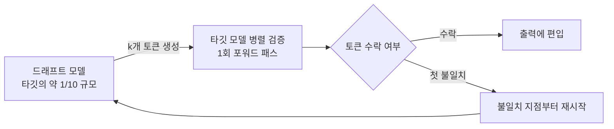

⏱️ **예상 읽기 시간**: 9분


*드래프트 모델이 토큰을 미리 생성하고 타깃 모델이 병렬로 검증하는 투기적 디코딩 구조를 형상화한 이미지입니다.*

투기적 디코딩(speculative decoding)은 드래프트 모델이 토큰을 빠르게 미리 생성하고 타깃 모델이 병렬로 검증하는 방식으로 레이턴시를 줄입니다. 이론은 2022년부터 있었지만 프로덕션 도입을 망설이게 만든 이유가 있었습니다. 드래프트 모델 관리 오버헤드, 배치 크기가 커지면 사라지는 이득, 그리고 프레임워크 지원 미흡이었습니다. 2026년 5월 EAGLE 3.1이 vLLM 메인 브랜치에 머지되면서 상황이 바뀌었습니다.

## 투기적 디코딩이 다시 주목받는 이유

일반 자기회귀 디코딩은 토큰을 하나씩 순차 생성합니다. GPU 메모리 대역폭이 병목이기 때문에 배치가 작을수록 GPU 활용률이 낮아지는 구조입니다. 투기적 디코딩은 이 구간을 노립니다.

드래프트 모델(보통 타깃의 1/10 규모)이 k개 토큰을 먼저 생성하면, 타깃 모델은 이를 한 번의 포워드 패스로 검증합니다. 검증 통과 토큰만 출력에 편입되고 첫 불일치 지점부터 재시작합니다. 수학적으로 출력 분포는 타깃 모델과 동일하게 유지됩니다. 즉 품질 저하 없이 속도를 올립니다.



EAGLE(Extrapolation Algorithm for Greater Language-model Efficiency)은 여기서 드래프트 품질을 크게 높입니다. 단순한 소형 언어 모델 대신, 타깃 모델의 피처 레이어를 활용해 다음 토큰을 예측하는 자동회귀 드래프트 헤드를 씁니다.

## EAGLE 3.1: 2026년 5월 vLLM 공식 통합

vLLM 팀이 2026년 5월 26일 게시한 블로그에 따르면, EAGLE 3.1은 기존 EAGLE-3 대비 추가 개선을 담았습니다. 핵심 수치를 살펴보면 동시 사용자 1명 기준 출력 처리량이 기존 대비 2.03배 높고, 동시성 4에서는 1.71배, 16에서는 1.66배입니다. 배치 크기가 늘어도 이득이 의미있게 유지되는 점이 이전 세대와 다릅니다.

AWS가 기여한 P-EAGLE도 이 시점에 vLLM 메인에 포함됐습니다. 코딩 태스크 벤치마크에서 EAGLE-3 단독 대비 20~30% 추가 개선을 보입니다.

## 설정: vLLM에서 EAGLE 3.1 활성화

vLLM v0.22.0 이상(또는 2026년 5월 이후 나이틀리)에서 아래처럼 활성화합니다.

```bash
vllm serve meta-llama/Llama-3.1-70B-Instruct \
  --speculative-model lmsys/eagle3-llama3.1-instruct-70b \
  --num-speculative-tokens 5 \
  --speculative-disable-by-batch-size 8 \
  --gpu-memory-utilization 0.92
```

`--speculative-disable-by-batch-size 8`은 동시 요청이 8개를 넘으면 투기적 디코딩을 자동 비활성화합니다. 배치가 클 때는 드래프트 오버헤드가 이득을 상회하기 때문에 이 파라미터를 반드시 설정해야 합니다.

EAGLE 드래프트 헤드는 타깃 모델과 같은 GPU를 공유하므로 별도 서버를 띄울 필요가 없습니다. 메모리 오버헤드는 드래프트 헤드 크기에 따라 다르지만 70B 타깃 기준 약 2~4GB 수준입니다.

## K8s 멀티테넌트 환경 적용 전략

ThakiCloud처럼 Kueue로 GPU 워크로드를 관리하는 환경에서는 몇 가지 고려가 필요합니다.

**워크로드 분리**: 투기적 디코딩은 단일 사용자 인터랙션(저배치)에서 효과가 큽니다. RAG 파이프라인이나 배치 추론처럼 동시 요청이 많은 워크로드는 일반 디코딩 경로가 낫습니다. Kueue의 LocalQueue를 활용해 인터랙티브 서빙용 큐와 배치 추론 큐를 분리하고, 인터랙티브 큐에 배포된 vLLM 인스턴스에만 EAGLE을 활성화합니다.

**ArgoCD 배포 관리**: EAGLE 드래프트 헤드는 타깃 모델 버전에 종속됩니다. Llama-3.1-70B를 업그레이드하면 eagle3-llama3.1-70b 드래프트도 같이 교체해야 합니다. Helm values에 두 모델 버전을 함께 명시하고, ArgoCD ApplicationSet으로 타깃-드래프트 쌍을 원자적으로 배포하도록 구성하면 버전 불일치를 막을 수 있습니다.

```yaml
# values.yaml 예시
serving:
  targetModel: "meta-llama/Llama-3.1-70B-Instruct"
  targetModelVersion: "v3.1"
  speculativeModel: "lmsys/eagle3-llama3.1-instruct-70b"
  speculativeModelVersion: "v3.1"
  numSpeculativeTokens: 5
  disableBatchSize: 8
```

**MIG 분리와의 호환**: A100/H100에서 MIG 파티셔닝을 쓰는 경우, EAGLE은 단일 MIG 인스턴스 내에서 실행됩니다. 드래프트 헤드와 타깃 모델이 같은 GPU 메모리를 쓰므로 MIG 슬라이스 크기 계획 시 추가 메모리를 반영해야 합니다.

## 핵심 메트릭 모니터링

vLLM은 `/metrics` 엔드포인트로 Prometheus 메트릭을 노출합니다. EAGLE 운용 시 중점적으로 봐야 할 지표는 다음과 같습니다.

```
# 투기적 디코딩 수락률 (높을수록 드래프트 품질 좋음)
vllm:spec_decode_accepted_tokens_total
vllm:spec_decode_draft_tokens_total

# KV 캐시 사용률 (드래프트 토큰이 캐시 압박을 높일 수 있음)
vllm:gpu_cache_usage_perc

# 배치당 처리량
vllm:generation_tokens_total
```

수락률이 60% 미만으로 떨어지면 드래프트 모델 미스매치나 입력 분포 변화를 의심합니다. 70% 이상이면 투기적 디코딩이 효과적으로 동작하는 것으로 봅니다.

## 언제 사용하고 언제 건너뛰나

투기적 디코딩이 유리한 시나리오는 명확합니다. 저배치(동시 요청 1~4개) 인터랙티브 채팅, 코딩 어시스턴트처럼 출력 분포가 예측 가능한 태스크, GPU 메모리가 드래프트 헤드를 수용할 여유가 있는 경우입니다.

반대로 대규모 배치 추론, 입력 분포가 매우 다양한 멀티모달 파이프라인, 그리고 TTFT(Time to First Token)보다 처리량 극대화가 목표인 워크로드에서는 일반 디코딩이 낫습니다.

EAGLE 3.1의 vLLM 통합은 드래프트 모델 관리 부담을 크게 줄였습니다. 서빙 레이턴시 개선이 필요한 인터랙티브 사용 사례라면 지금이 도입을 검토할 시점입니다.


## 관련 슬라이드

본문 내용을 NotebookLM(`prismatic_tech` 스타일)으로 요약한 슬라이드입니다.


## 출처

- vLLM Blog, "EAGLE 3.1: Advancing Speculative Decoding Through Collaboration Between the EAGLE Team, vLLM, and TorchSpec" (2026-05-26): <https://vllm.ai/blog/2026-05-26-eagle-3-1>
- Li et al., "EAGLE-3: Scaling up Inference Acceleration of Large Language Models via Training-Time Test" (arXiv:2503.01840): <https://arxiv.org/abs/2503.01840>
- AWS Machine Learning Blog, "P-EAGLE: Faster LLM inference with Parallel Speculative Decoding in vLLM": <https://aws.amazon.com/blogs/machine-learning/p-eagle-faster-llm-inference-with-parallel-speculative-decoding-in-vllm/>
- Red Hat Developer, "Fly Eagle(3) fly: Faster inference with vLLM & speculative decoding" (2025-07-01): <https://developers.redhat.com/articles/2025/07/01/fly-eagle3-fly-faster-inference-vllm-speculative-decoding>
