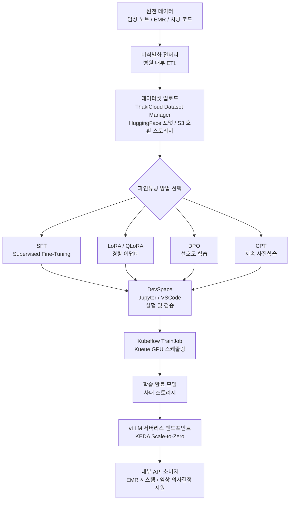

## 개요

의료·바이오 분야에서 LLM 도입이 빠르게 확산되고 있습니다. 임상 노트 요약, 진단 보조, 신약 문헌 분석, 처방 코드 자동화 등 응용 범위가 넓어지면서 병원, 제약사, 연구 기관들이 도메인 특화 모델 구축을 검토하기 시작했습니다.

그러나 의료 AI의 가장 큰 장벽은 기술이 아닙니다. 데이터 거버넌스입니다. 국내 의료법, 개인정보 보호법, 생명윤리법, 그리고 국정원 보안 요구사항은 환자 정보를 외부 서버로 전송하는 것을 사실상 금지하거나 극도로 제한합니다. 이 상황에서 "클라우드 API에 데이터를 올려 파인튜닝한다"는 접근은 법적으로도 실무적으로도 통하지 않습니다.

이 글에서는 가상의 대형병원과 제약 연구소 사례를 통해, 데이터를 외부로 반출하지 않고 사내 Kubernetes 클러스터에서 도메인 LLM을 파인튜닝하고 추론까지 운용하는 전체 워크플로를 설명합니다. ThakiCloud AI Platform을 기반으로 하며, 각 단계에서 실제로 어떤 컴포넌트가 동작하는지를 구체적으로 다룹니다.

---

## 의료 데이터가 클라우드로 못 가는 이유

### 규제 환경

국내 의료 데이터는 다층적인 규제로 묶여 있습니다.

**의료법 제21조**는 의료 기록의 외부 제공을 환자 동의 없이 금지합니다. **개인정보 보호법**은 민감 정보(진단명, 처방 내역, 유전 정보 등)의 제3자 이전에 명시적 동의와 안전조치 의무를 부과합니다. **생명윤리 및 안전에 관한 법률**은 인체 유래 물질 및 유전 정보의 국외 이전을 별도 승인 사항으로 봅니다. 또한 공공 의료기관과 국방 관련 연구기관은 국정원 보안 적합성 검토를 받아야 하며, 외부 API 연동 자체가 차단되는 에어갭(Air-Gap) 환경에서 운용되는 경우가 많습니다.

### 실무적 위험

규제 외에도 실무 리스크가 있습니다. 외부 AI API에 비식별화 처리 없이 임상 노트를 전송했다가 프라이버시 침해로 피소된 해외 사례들이 이미 보고되었습니다. "비식별화하면 괜찮다"는 주장도, 준식별자 재결합을 통한 재식별 가능성 때문에 법적으로 안전하다고 보기 어렵습니다.

결론은 명확합니다. 의료 AI 모델은 데이터가 있는 곳, 즉 사내 클러스터 안에서 학습되고 서빙되어야 합니다.

---

## 사내 파인튜닝 워크플로

ThakiCloud AI Platform은 Kubernetes 기반으로 설계되어 있으며, 모든 학습과 추론이 사내 클러스터 안에서 완결됩니다. 외부 네트워크로 데이터가 나가지 않습니다. 아래 파이프라인을 단계별로 따라가겠습니다.



*위 다이어그램은 개념적 흐름을 나타내며, 실제 구성 파라미터는 환경에 따라 다를 수 있습니다.*

### 1단계: 데이터셋 준비 및 업로드

의료 데이터는 원천 형태 그대로 파인튜닝에 사용할 수 없습니다. 병원 내부 ETL 파이프라인에서 비식별화(이름, 주민등록번호, 병원 번호 제거), 포맷 변환(FHIR JSON 또는 자유 텍스트를 instruction-response 쌍으로), 품질 필터링(중복 제거, 분량 이상 제거)을 거쳐야 합니다.

이렇게 전처리된 데이터는 ThakiCloud의 데이터셋 관리자를 통해 사내 스토리지에 업로드됩니다. 플랫폼은 HuggingFace 데이터셋 포맷과 S3 호환 오브젝트 스토리지를 지원하므로, 기존 데이터 파이프라인과 연동이 간편합니다. 볼륨과 스냅샷 기능을 통해 데이터셋 버전을 관리하고, 필요 시 이전 버전으로 롤백할 수 있습니다.

```python
# 개념적 예시 - 실제 API 명세가 아닌 플레이스홀더입니다
dataset_config = {
    "name": "clinical-notes-sft-v1",
    "format": "jsonl",
    "schema": {
        "instruction": "string",   # 예: "다음 임상 노트를 요약하시오."
        "input": "string",         # 임상 노트 본문
        "output": "string"         # 전문의 작성 요약
    },
    "storage": "s3://internal-bucket/datasets/clinical-notes/",
    "privacy_level": "restricted"  # 접근 권한을 RBAC으로 제한
}
```

RBAC(Keycloak 기반)을 통해 데이터셋 접근 권한을 프로젝트와 역할 단위로 제어합니다. 연구팀은 자신이 속한 프로젝트의 데이터셋만 볼 수 있으며, 조직 간 데이터 혼용을 시스템 레벨에서 차단합니다.

### 2단계: 파인튜닝 방법 선택

ThakiCloud AI Platform은 6종의 파인튜닝 방법을 지원합니다. 의료 도메인 특성에 맞춰 선택해야 합니다.

**SFT (Supervised Fine-Tuning)**: 가장 직관적입니다. instruction-response 쌍 데이터가 충분할 때 적합합니다. 임상 노트 요약, 처방 코드 분류, 검사 결과 해석 등 명확한 정답이 있는 태스크에 적합합니다. 데이터 품질이 중요하며, 전문의가 검수한 고품질 소량 데이터가 대량의 미검수 데이터보다 결과가 좋은 경우가 많습니다.

**LoRA / QLoRA (Low-Rank Adaptation)**: GPU 메모리가 제한된 환경에서 대형 베이스 모델을 효율적으로 파인튜닝할 수 있습니다. 어댑터 레이어만 학습하므로, 전체 파라미터 대비 [추정] 1-5%의 파라미터만 업데이트합니다. 사내 A100 GPU가 몇 장 없는 중소 병원이나 연구소에서 Llama-3 70B 또는 Qwen-2.5 72B 급 모델을 파인튜닝할 때 현실적인 선택입니다.

**DPO (Direct Preference Optimization)**: 두 응답 중 더 좋은 것을 선택한 선호도 데이터로 학습합니다. "진단 보조 시스템이 더 안전하고 보수적인 답변을 해야 한다"는 의료 도메인 요구사항을 반영하기에 적합합니다. SFT 이후 정렬 단계로 주로 사용됩니다.

**CPT (Continued Pre-Training)**: 의료 논문, 약학 교재, 임상 가이드라인 등 대용량 비구조화 텍스트로 도메인 지식을 베이스 모델에 주입할 때 사용합니다. 데이터 규모가 크고 학습 시간이 길지만, 모델이 의학 용어와 개념을 더 깊이 이해하게 됩니다.

**GKD (Generalized Knowledge Distillation)**: 더 큰 teacher 모델(내부에서 이미 검증된 모델)의 지식을 작은 student 모델로 전이합니다. 추론 비용을 낮추면서 품질을 유지해야 할 때 유용합니다. 실제 서빙 모델은 작고 빠른 student여야 하지만, teacher의 전문성을 최대한 살리고 싶은 경우에 적합합니다.

**GRPO (Group Relative Policy Optimization)**: 강화학습 기반으로 그룹 상대 보상을 사용합니다. 복잡한 추론이 필요한 의료 진단 태스크나, 특정 안전 지침을 강화하는 목적에 사용됩니다.

### 3단계: DevSpace에서 실험과 검증

파인튜닝을 본격적으로 실행하기 전에, DevSpace를 통해 소규모로 실험합니다. DevSpace는 Kubernetes Pod 위에서 실행되는 Jupyter Notebook 또는 VS Code 환경으로, 사내 클러스터의 GPU에 직접 접근합니다.

연구자는 Pod SSH를 통해 DevSpace 환경에 접속하고, 소량의 데이터로 학습 스크립트를 테스트합니다. 하이퍼파라미터(학습률, 배치 크기, LoRA rank 등) 조정과 데이터 포맷 검증을 이 단계에서 완료하면, 이후 전체 학습 잡에서 낭비되는 GPU 시간을 줄일 수 있습니다.

```bash
# DevSpace Pod 접속 예시 (플레이스홀더 - 실제 명령어는 플랫폼 설정에 따라 다릅니다)
# ssh <devspace-pod-name>.<namespace>.svc.cluster.local

# 소규모 LoRA 실험 예시
python train.py \
  --model_name_or_path /mnt/models/llama3-8b \
  --data_path /mnt/datasets/clinical-notes-sample \
  --method lora \
  --lora_r 16 \
  --lora_alpha 32 \
  --num_train_epochs 3 \
  --per_device_train_batch_size 4 \
  --output_dir /mnt/checkpoints/exp-001
```

### 4단계: Kubeflow TrainJob으로 전체 학습

실험 결과가 만족스러우면 Kubeflow TrainJob을 통해 전체 데이터셋 대상 학습을 실행합니다. Kueue와 KAI 스케줄러가 병원 내 다른 워크로드와 GPU 자원을 공유하면서도, 학습 잡에 필요한 GPU를 우선순위에 따라 할당합니다.

멀티 GPU 분산 학습(예: PyTorch DDP 또는 DeepSpeed ZeRO)도 Kubeflow TrainJob 스펙으로 선언적으로 설정할 수 있습니다.

```yaml
# 개념적 TrainJob 예시 - 플레이스홀더입니다
apiVersion: kubeflow.org/v1
kind: PyTorchJob
metadata:
  name: clinical-notes-sft-run1
  namespace: hospital-ai
spec:
  pytorchReplicaSpecs:
    Master:
      replicas: 1
      template:
        spec:
          containers:
          - name: trainer
            image: registry.internal/thakicloud/trainer:v1.2
            args:
            - "--method=sft"
            - "--data=/mnt/datasets/clinical-notes-v1"
            - "--model=/mnt/models/qwen2.5-7b"
            - "--output=/mnt/checkpoints/clinical-qwen-v1"
            resources:
              limits:
                nvidia.com/gpu: "4"
    Worker:
      replicas: 3
      # ...
```

DCGM GPU 텔레메트리를 통해 학습 중 GPU 활용률, 메모리 사용, 온도를 실시간으로 모니터링합니다. 이상 징후 발생 시 알람이 발생하고, 체크포인트 기반으로 안전하게 재시작할 수 있습니다.

학습이 완료된 모델은 사내 스토리지(볼륨/스냅샷 관리 포함)에 저장됩니다. 데이터가 처음부터 끝까지 내부 클러스터를 벗어나지 않습니다.

---

## 서빙과 운영

### vLLM 서버리스 엔드포인트

학습된 도메인 모델은 vLLM 기반 서버리스 추론 엔드포인트로 서빙됩니다. vLLM은 PagedAttention을 통해 GPU 메모리를 효율적으로 사용하고, 연속 배치(continuous batching)로 처리량을 높입니다.

KEDA(Kubernetes Event-Driven Autoscaling)와 연동해 Scale-to-Zero 기능을 구현합니다. 요청이 없을 때 추론 서버를 0으로 축소했다가, 요청이 들어오면 자동으로 스케일업합니다. 병원의 LLM 사용 패턴은 낮 시간대에 집중되는 경우가 많으므로, 심야 시간에 GPU를 유휴 상태로 두지 않아도 됩니다.

```yaml
# 개념적 KEDA ScaledObject 예시 - 플레이스홀더입니다
apiVersion: keda.sh/v1alpha1
kind: ScaledObject
metadata:
  name: clinical-llm-endpoint
  namespace: hospital-ai
spec:
  scaleTargetRef:
    name: clinical-llm-deployment
  minReplicaCount: 0      # Scale-to-Zero
  maxReplicaCount: 4
  triggers:
  - type: prometheus
    metadata:
      serverAddress: http://prometheus:9090
      metricName: vllm_requests_pending
      threshold: "5"      # 대기 요청 5개 이상이면 스케일업
```

### 추론 비용 구조

외부 LLM API(예: GPT-4 API)는 토큰당 과금 방식입니다. 임상 노트 요약처럼 입력 컨텍스트가 긴 태스크를 대량으로 처리하면 월 청구액이 빠르게 불어납니다. 또한 API를 통해 임상 데이터를 전송하는 것 자체가 전술한 규제 위험을 수반합니다.

사내 vLLM 엔드포인트는 초기 GPU 인프라 비용이 필요하지만, 이후 토큰당 추가 비용이 없습니다. 병원이 이미 보유한 GPU 서버 또는 임상 연구용으로 도입한 HPC 인프라를 재활용할 수 있다면 한계 비용은 전력과 운영 인건비 수준으로 내려갑니다.

### RBAC과 멀티 테넌트 격리

대형 의료 기관은 진료과, 연구팀, 행정 부서가 각자 다른 데이터와 모델에 접근해야 합니다. ThakiCloud의 Keycloak 기반 RBAC은 조직, 프로젝트, 역할(Admin/Developer/Viewer) 단위로 권한을 관리합니다. JWT 토큰에 그룹 정보를 포함시켜 실시간으로 접근을 검증합니다.

내분비내과 팀이 파인튜닝한 당뇨 진단 보조 모델은 심장내과 팀이 접근하지 못하도록 프로젝트 스코프를 제한할 수 있습니다. 이는 내부 데이터 격리뿐만 아니라, 모델 오용(wrong model for wrong context) 위험도 낮춥니다.

### lm-eval 벤치마킹

서빙 전 모델 품질을 정량화하기 위해 lm-eval 벤치마킹 기능을 사용합니다. 내부에서 구축한 의료 도메인 평가 데이터셋(전문의가 검수한 QA 셋)을 등록하고, 학습된 모델이 베이스 모델 대비 얼마나 개선되었는지 측정합니다.

---

## ThakiCloud 적용 시사점

### 가상 사례: 상급 종합병원 임상 노트 요약

가상의 A 병원을 예로 들겠습니다. A 병원은 입원 환자의 퇴원 요약 작성에 의사 시간이 상당히 소요된다는 문제를 갖고 있었습니다. 외부 AI API 도입은 개인정보 처리 위탁 계약, 보안 심사, 정보보호위원회 승인 등 복잡한 절차 때문에 실행에 어려움이 있었습니다.

온프렘 접근을 선택했다면 다음 순서로 진행할 수 있습니다.

1. 비식별화된 과거 퇴원 요약 데이터(원문 임상 노트와 전문의 작성 요약 쌍)를 사내 ETL로 가공합니다.
2. ThakiCloud 데이터셋 관리자에 업로드하고, 임상 정보팀 프로젝트에 접근 권한을 부여합니다.
3. DevSpace에서 소규모 SFT 실험으로 적절한 베이스 모델(예: Llama-3 8B 또는 Qwen2.5 7B)과 하이퍼파라미터를 탐색합니다.
4. Kubeflow TrainJob으로 전체 학습을 실행합니다. 분산 학습은 병원 내 8장 GPU 노드를 활용합니다.
5. lm-eval로 ROUGE 및 도메인 QA 점수를 측정해 품질 기준을 충족하면 vLLM 엔드포인트로 배포합니다.
6. EMR 시스템이 내부 API를 통해 요약 결과를 받아 의사에게 초안을 제공합니다.

데이터는 A 병원 데이터센터 밖을 나가지 않습니다.

### 가상 사례: 제약 연구기관 임상시험 문헌 분석

가상의 B 연구소는 임상시험 프로토콜 문서와 의약품 부작용 보고서를 분석해 안전성 신호를 추출하는 작업을 자동화하려 했습니다. 이 데이터에는 연구 피험자 정보와 미공개 임상 결과가 포함되어 있어 외부 반출이 불가능한 상황이었습니다.

CPT(Continued Pre-Training)로 내부 확보 의학 문헌 수십만 건으로 베이스 모델의 도메인 지식을 강화한 뒤, SFT로 안전성 신호 추출 태스크에 특화시키는 두 단계 접근이 유효합니다. Scale-to-Zero 설정으로 연구팀이 사용할 때만 GPU를 할당하고, 야간과 주말에는 다른 연산 워크로드가 GPU를 활용할 수 있습니다.

---

## 한계 및 고려사항

### 운영 역량 요건

온프렘 LLM 플랫폼은 외부 SaaS와 달리 내부 운영 역량을 요구합니다. Kubernetes 클러스터 관리, GPU 드라이버 유지보수, 모델 버전 관리, 보안 패치 적용을 담당할 MLOps 엔지니어가 필요합니다. 소규모 병원이나 연구소의 경우, 이 역량을 내재화하기 어려울 수 있습니다.

### 데이터 품질이 성능을 결정합니다

파인튜닝 결과는 데이터 품질에 절대적으로 의존합니다. 전문의가 검수하지 않은 임상 노트로 SFT를 진행하면 오류를 학습하는 결과가 나올 수 있습니다. 고품질 레이블 데이터 확보를 위한 전문의 시간과 어노테이션 프로세스 비용을 사전에 계획해야 합니다.

### 베이스 모델 라이선스 확인

LoRA나 SFT를 적용하더라도 베이스 모델의 라이선스 조건을 반드시 확인해야 합니다. 상업적 이용 허가 여부, 의료 목적 사용 제한 조항이 모델마다 다릅니다. Llama-3, Qwen, Gemma 등 주요 오픈소스 모델들도 각각 다른 사용 약관을 가지고 있으므로, 법무팀 검토가 선행되어야 합니다.

### 추론 지연 시간(Latency) 관리

Scale-to-Zero 설정에서는 첫 요청 시 모델 로딩 시간(Cold Start)이 발생합니다. 7B 규모 모델도 GPU에 로딩하는 데 수십 초가 걸릴 수 있습니다. 실시간 임상 의사결정 지원처럼 지연 시간이 중요한 애플리케이션이라면, 최소 레플리카를 1로 유지하거나 다른 사전 워밍 전략을 적용해야 합니다.

### 모델 검증과 규제 대응

AI 기반 의료 의사결정 지원 시스템은 식약처 의료기기 인허가 대상이 될 수 있습니다. 모델이 "진단"을 내리는 방식으로 활용된다면 소프트웨어 의료기기(SaMD) 규정을 검토해야 합니다. lm-eval 벤치마킹 결과와 내부 검증 데이터는 이 과정에서 근거 자료가 됩니다. 그러나 규제 대응은 플랫폼 기능의 범위를 넘어 전문 규제 컨설팅이 필요한 영역입니다.

---

의료·바이오 분야의 LLM 도입에서 "데이터를 어떻게 지키면서 AI를 활용하느냐"는 질문은 기술 문제이기 이전에 거버넌스 문제입니다. 온프렘 파인튜닝 플랫폼은 그 질문에 대한 하나의 실질적인 해법입니다. 데이터는 사내에 두고, 모델 품질은 포기하지 않는 접근이 이제 Kubernetes 환경에서 운용 가능한 수준으로 성숙했습니다.

*본 문서의 가상 사례는 설명 목적으로 작성되었으며, 실제 기관을 지칭하지 않습니다. 의료 AI 시스템 구축 전 법무팀 및 규제 전문가와의 검토를 권장합니다.*
