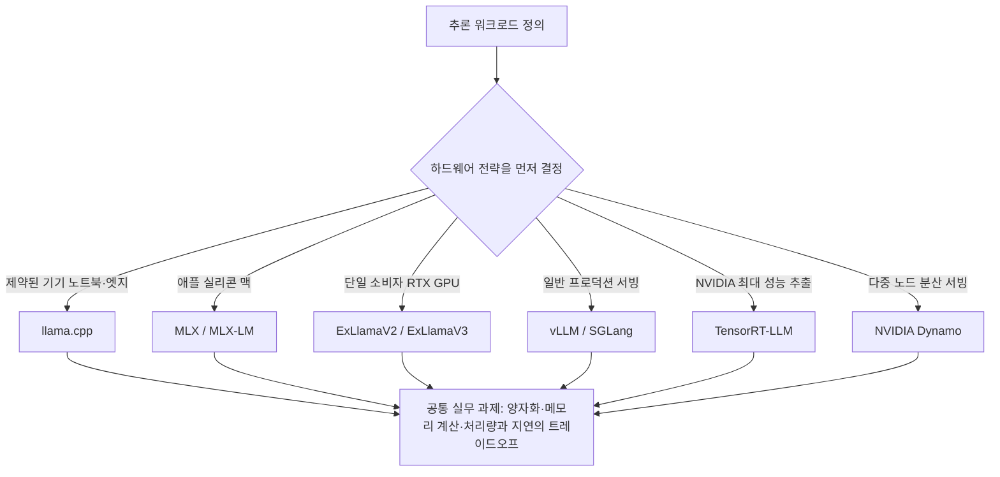

로컬 LLM 추론을 처음 시작하는 사람이 가장 먼저 부딪히는 질문은 "어떤 엔진을 써야 하나"입니다. llama.cpp, vLLM, SGLang, TensorRT-LLM 같은 이름이 쏟아지지만, 무엇을 기준으로 골라야 하는지는 잘 정리되어 있지 않습니다. r/LocalLLaMA의 GPU 모더레이터인 Ahmad Osman(@TheAhmadOsman)이 최근 이 공백을 메우는 종합 가이드를 무료로 공개했습니다.

저희 ThakiCloud는 K8s 기반 AI/ML SaaS 플랫폼에서 모델 서빙을 다룹니다. 이 가이드가 던지는 메시지가 저희 같은 GPU 클라우드와 온프레미스 AI 사업자에게 어떤 의미인지 정리하겠습니다.

## 이 가이드는 무엇인가

Ahmad Osman의 가이드는 단순한 설치 튜토리얼이 아닙니다. 로컬 LLM 추론을 처음부터 끝까지 정리한 일종의 참고서입니다. 핵심 메시지는 명확합니다. 추론 엔진을 먼저 고르는 것이 아니라 하드웨어 전략을 먼저 정하고 거기에 맞는 엔진이 따라온다는 것입니다.

이 관점이 중요한 이유는, 엔진을 먼저 고르면 보유한 하드웨어의 제약을 무시하게 되기 때문입니다. 단일 노트북에서 돌릴 모델과 네 장짜리 GPU 서버에서 돌릴 모델은 애초에 선택지가 다릅니다. 가이드는 이 점을 인정하고 실행 환경을 여러 갈래로 나눠 다룹니다. 노트북과 엣지 같은 제약된 기기, 맥 중심 워크플로, 단일 RTX GPU, 두 장에서 네 장 이상의 NVIDIA CUDA 멀티 GPU, 일반적인 프로덕션 서빙, 롱컨텍스트와 MoE 라우팅, NVIDIA 최대 성능 추출, 그리고 클러스터 오케스트레이션까지 시나리오별로 어떤 도구가 적합한지를 짚어 줍니다.

아래 도표는 가이드의 핵심 논리를 하드웨어 시나리오와 추론 엔진의 대응으로 정리한 것입니다.

엔진은 시나리오마다 다르지만, 양자화와 메모리 계산, 처리량과 지연 사이의 균형이라는 실무 과제는 어느 경로를 택하든 똑같이 부딪힙니다. 가이드가 이 공통 과제를 함께 설명한다는 점이 참고서로서의 가치를 높입니다.

## 추론 엔진 지형도

소프트웨어 측면에서 이 가이드는 현재 로컬 추론 생태계의 주요 스택을 거의 망라합니다. 각 엔진은 잘하는 영역이 다릅니다.

- **llama.cpp**: VRAM이 빠듯하고 RAM이 넉넉할 때 CPU와 GPU 어디서든 돌아가는 범용성이 강점입니다. 진입 장벽이 가장 낮은 출발점입니다.
- **MLX와 MLX-LM**: 애플 실리콘에 최적화된 스택입니다. 맥북이나 맥 스튜디오에서 통합 메모리를 활용해 추론하려는 사용자에게 맞습니다.
- **ExLlamaV2와 ExLlamaV3**: 소비자급 GPU에서 빠른 양자화 추론을 노립니다. 단일 RTX 카드로 최대한의 속도를 뽑으려는 경우에 적합합니다.
- **vLLM과 SGLang**: 프로덕션 서빙의 사실상 표준입니다. PagedAttention과 연속 배칭으로 다중 요청 처리량을 끌어올립니다.
- **TensorRT-LLM**: NVIDIA 하드웨어에서 극한의 성능을 뽑는 엔진입니다. 커널 수준 최적화로 지연을 낮추지만 빌드와 운영 난도가 높습니다.
- **NVIDIA Dynamo**: 여러 노드에 걸친 분산 서빙을 겨냥합니다. 단일 서버를 넘어선 규모에서 추론을 분산하는 경우에 쓰입니다.

이 목록을 보면 한 가지가 분명해집니다. "최고의 추론 엔진" 같은 것은 없습니다. 제약된 기기에서 llama.cpp가 정답일 수 있고, 수천 동시 요청을 받는 서비스에서는 vLLM이나 TensorRT-LLM이 정답일 수 있습니다. 선택의 기준은 엔진의 우열이 아니라 워크로드와 하드웨어의 조합입니다.

## 왜 지금 로컬 추론인가

로컬 추론에 대한 관심이 커지는 이유는 분명합니다. 가이드와 커뮤니티 논의가 공통으로 꼽는 동기는 네 가지로 정리됩니다.

첫째, 데이터 주권과 프라이버시입니다. 민감한 데이터를 외부 API로 내보내지 않고 사내에서 처리하려는 수요는 의료, 금융, 공공 부문에서 특히 강합니다. 둘째, 비용 구조입니다. 토큰당 과금에서 벗어나 고정 하드웨어 비용으로 추론을 운영하면, 사용량이 많은 조직일수록 경제성이 역전됩니다. 셋째, 지연입니다. 네트워크를 거치지 않는 로컬 추론은 응답 지연을 줄일 수 있습니다. 넷째, 통제권입니다. 모델과 인프라를 직접 쥐고 있으면 버전, 양자화, 라우팅을 조직의 요구에 맞춰 조정할 수 있습니다.

클라우드 API에 전적으로 의존하던 흐름에서 온프렘과 엣지로 무게중심이 옮겨가는 지금, 어떤 하드웨어에 어떤 엔진을 얹을지 한 번에 비교할 수 있는 자료의 수요는 계속 커지고 있습니다. Ahmad Osman의 가이드가 주목받는 배경입니다.

## ThakiCloud K8s AI/ML SaaS 플랫폼 적용 및 시사점

이 가이드가 다루는 로컬 및 온프렘 LLM 서빙은 ThakiCloud 사업의 정중앙에 있습니다. K8s 기반 AI/ML SaaS 플랫폼, 소버린과 온프렘 AI, GPU 클라우드, MSP, Enterprise AI라는 저희 포지션이 바로 이 자료가 설명하는 문제를 푸는 일이기 때문입니다.

가이드의 핵심 논리인 "하드웨어 전략이 먼저고 엔진은 따라온다"는 관점은, 저희가 고객에게 GPU 자원과 추론 스택을 제안할 때 그대로 쓸 수 있는 프레임입니다. 단일 RTX부터 멀티 GPU, 클러스터 오케스트레이션까지 이어지는 스펙트럼은 저희 Kueue 기반 워크로드 스케줄링과 GPU 라이프사이클 관리가 실제로 커버하는 영역과 정확히 겹칩니다. 고객의 하드웨어 등급을 먼저 파악하고 거기에 맞는 서빙 구성을 매칭하는 작업이 저희가 매일 하는 일입니다.

기회 측면에서, vLLM과 SGLang, TensorRT-LLM, NVIDIA Dynamo 같은 프로덕션 서빙 스택을 K8s 위에서 매니지드 형태로 묶어 제공하면, 고객이 직접 엔진을 고르고 튜닝하는 부담을 저희가 흡수할 수 있습니다. 가이드 한 권을 읽고 엔진을 직접 빌드하는 것과, 검증된 서빙 스택을 SLA와 함께 제공받는 것은 운영 부담이 전혀 다릅니다. 데이터 주권과 비용 통제를 원하는 엔터프라이즈와 공공 고객에게는, 클라우드 API 대비 온프렘 추론의 TCO 우위를 정량적으로 제시하는 근거 자료로도 이런 가이드를 활용할 수 있습니다.

저희가 다루는 진짜 과제는 단일 머신 데모를 멀티테넌트 프로덕션 서빙으로 키우는 일입니다. 가이드가 시나리오의 끝에 둔 클러스터 오케스트레이션이 바로 그 지점이고, 거기서부터는 엔진 선택을 넘어 자원 격리, GPU 효율, 운영 자동화의 문제가 됩니다.

## 한계 및 반론

다만 위협도 함께 봐야 합니다. 이런 바이블급 무료 가이드와 llama.cpp, MLX 같은 도구의 성숙은 진입 장벽을 낮춰 고객이 직접 셀프호스팅으로 가는 길을 쉽게 만듭니다. 추론 엔진 자체가 오픈소스이고, 설치법을 정리한 자료까지 무료로 풀린 상황에서, 단순히 "엔진을 대신 깔아 드립니다"는 제안은 차별화가 되지 않습니다.

그래서 저희의 차별점은 엔진 자체가 아니라 멀티테넌트 격리, GPU 효율 극대화, 운영 자동화, SLA에 있어야 합니다. 무엇을 쓰는지가 아니라 어떻게 안정적으로 운영해 주는지로 가치를 증명해야 합니다. 가이드가 알려 주는 것은 "어떤 엔진이 어떤 하드웨어에 맞는가"까지이고, "그것을 24시간 다수 테넌트에게 안정적으로 서빙하려면 무엇이 더 필요한가"는 가이드 바깥의 영역입니다. 그 영역이 저희가 책임지는 곳입니다.

또 하나 짚어 둘 점은, 가이드가 제시하는 처리량이나 성능 수치는 작성자의 특정 하드웨어 환경에서 나온 값이라는 것입니다. 실제 배포에서는 모델 크기, 하드웨어, 처리량의 트레이드오프를 자신의 워크로드 성격에 맞춰 다시 측정해야 합니다. 가이드는 지도이지 보장이 아닙니다.

## 마치며

Ahmad Osman의 로컬 LLM 추론 가이드는 "엔진이 아니라 하드웨어부터"라는 단순하지만 실용적인 프레임을 제시합니다. llama.cpp부터 NVIDIA Dynamo까지의 지형도를 한눈에 정리해, 로컬 추론을 시작하는 사람에게 좋은 출발점이 됩니다. 저희 같은 서빙 사업자에게 이 자료는 고객 제안의 프레임이자, 동시에 셀프호스팅이라는 경쟁 압력을 상기시키는 자료이기도 합니다. 엔진을 넘어 운영으로 가치를 증명하는 일에 관심 있는 엔지니어라면, 이런 문제가 매일의 과제인 곳입니다.

---

출처: Ahmad Osman(@TheAhmadOsman, r/LocalLLaMA GPU 모더레이터)의 로컬 LLM 추론 종합 가이드. 저자 사이트 [ahmadosman.com](https://ahmadosman.com), 원문 [트윗](https://x.com/hjguyhan/status/2068706994480115949), 추론 엔진 비교 참고 [2026 로컬 추론 엔진 비교](https://www.local-llm.net/compare/inference-engines-2026/). 성능 수치는 작성자 환경 기준이며 실측 시 재검증이 필요합니다.
