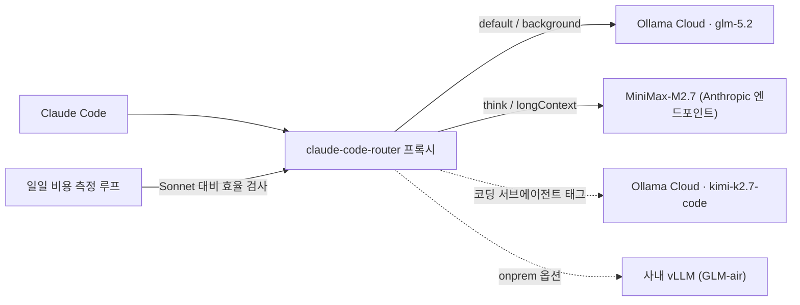

## 개요

Claude Code는 터미널에서 동작하는 에이전트형 코딩 도구입니다. 기본 동작은 Anthropic API로 요청을 보내는 것이지만, 모든 요청이 같은 무게를 갖지는 않습니다. 백그라운드 요약, 짧은 자동완성, 긴 컨텍스트 분석, 깊은 추론이 필요한 리팩터링은 서로 다른 모델 등급을 요구합니다. 모든 요청을 가장 비싼 모델로 처리하면 비용이 빠르게 쌓이고, 반대로 전부 값싼 모델로 처리하면 품질이 무너집니다.

`claude-code-router`(이하 CCR)는 이 문제를 라우팅 계층으로 풉니다. Claude Code와 모델 백엔드 사이에 프록시를 두고, 요청 종류에 따라 다른 제공자와 모델로 트래픽을 분기합니다. 이 글은 개념 소개에 그치지 않습니다. 실제로 세 개의 외부 모델을 호출해 동작을 검증하고, 그 과정에서 만난 문제(죽은 API 키, thinking 태그 누수)를 고치고, 마지막으로 "이 라우팅이 정말 Anthropic Sonnet보다 싼가"를 상시 측정하는 루프까지 붙인 기록입니다.

핵심 원칙을 먼저 박아 둡니다. **CCR로 보내는 모든 모델은 Claude Sonnet보다 비용 효율적일 때만 의미가 있습니다.** 그렇지 않다면 품질만 떨어뜨리고 돈은 그대로 나가는 셈입니다. 그래서 단정하지 않고 측정합니다.

---


*개념 다이어그램*

## claude-code-router는 무엇인가

CCR은 Anthropic 메시지 형식의 요청을 받아 OpenAI 호환 형식 등으로 변환한 뒤 설정된 제공자로 전달하는 프록시 서버입니다. Claude Code 클라이언트 자체는 건드리지 않습니다. `ccr code`로 세션을 띄우면 그 세션의 트래픽이 `localhost:3456` 프록시를 거쳐 라우팅됩니다.

핵심 기능은 다음과 같습니다.

- **요청 유형별 라우팅**: `default`, `background`, `think`, `longContext`, `webSearch` 등 유형마다 다른 모델을 지정합니다.
- **멀티 제공자**: OpenAI 호환 엔드포인트면 무엇이든 등록할 수 있습니다. 이번에는 Ollama Cloud와 MiniMax를 씁니다.
- **transformer**: 제공자마다 다른 API 규격을 변환기가 흡수합니다. Anthropic 네이티브 엔드포인트를 위한 `Anthropic` 패스스루 변환기가 이 글의 핵심 도구로 등장합니다.
- **동적 전환**: 세션 안에서 `/model provider,model` 명령으로 즉시 모델을 바꿉니다.

검증에 사용한 CCR 버전은 `1.0.62`입니다. 설정 파일은 `~/.claude-code-router/config.json`이며, 핵심은 `Providers` 배열과 `Router` 객체입니다.

---

## 무엇을 라우팅하는가 - 세 모델로 고정

이번 구성의 모델 풀은 정확히 세 개입니다. 모델을 늘리면 라우팅 표가 복잡해지고 검증 비용이 커지므로 의도적으로 좁혔습니다.

| 역할 | 모델 | 제공자 | 비고 |
|------|------|--------|------|
| 주력 (default·background) | `glm-5.2` | Ollama Cloud | 일상 코딩, 강력하고 저렴 |
| 추론 (think·longContext) | `MiniMax-M2.7` | MiniMax | thinking 분리, per-token이 매우 저렴 |
| 코딩 서브에이전트 | `kimi-k2.7-code` | Ollama Cloud | 어려운 코딩 턴 전용 |

`glm-5.2`를 주력으로 두고, 깊은 추론과 긴 컨텍스트만 MiniMax로, 까다로운 코딩 한 턴은 Kimi로 보내는 구조입니다.

---

## 실제 검증 결과 - 가정하지 않고 호출했다

설정을 쓰기 전에 세 모델을 직접 호출했습니다. 추정 수치를 적지 않기 위해 실제 응답을 확인했고, 그 과정에서 세 가지 사실이 드러났습니다.

**첫째, Ollama Cloud 키 하나가 GLM과 Kimi를 모두 커버합니다.** `glm-5.2`와 `kimi-k2.7-code` 모두 `https://ollama.com/v1`에서 정상 응답(HTTP 200)했습니다. Ollama Cloud는 GLM, Kimi, DeepSeek, Qwen 계열을 한 키로 묶어 제공합니다.

**둘째, 단독 Kimi 키는 죽어 있었습니다.** `.env`에 넣어 둔 Moonshot 단독 키는 moonshot.ai, moonshot.cn, Anthropic 호환 엔드포인트 모두에서 401(Invalid Authentication)을 반환했습니다. 다행히 Kimi K2는 Ollama Cloud의 `kimi-k2.7-code`로 동일하게 쓸 수 있어, 죽은 키는 막다른 길이 아니었습니다.

**셋째, MiniMax는 엔드포인트 선택이 품질을 가릅니다.** OpenAI 호환 엔드포인트(`/v1/chat/completions`)로 부르면 모델이 추론을 `<think>...</think>` 태그로 응답 본문에 인라인해 버리고, CCR의 변환 레이어가 이를 떼어내지 못해 그대로 사용자에게 노출됩니다(musistudio/claude-code-router#964). 같은 모델을 네이티브 Anthropic 엔드포인트(`/anthropic/v1/messages`)로 부르면 응답이 `thinking` 블록과 `text` 블록으로 깔끔하게 분리되어 옵니다.

마지막 항목은 단순히 "MiniMax를 빼자"로 끝낼 문제가 아니라 고쳐야 할 버그였습니다. 해결책은 아래 설정에 반영했습니다.

---

## 설정 - 비밀키는 저장소 밖, 설정은 코드로 생성

키를 설정 파일에 직접 박지 않습니다. 저장소의 `.env`를 읽어 `~/.claude-code-router/config.json`을 만드는 생성기 스크립트를 두었습니다. 저장소에는 키가 남지 않고, 키를 교체하면 스크립트만 다시 돌리면 됩니다.

생성되는 핵심 설정은 다음과 같습니다.

```json
{
  "LOG": true,
  "HOST": "127.0.0.1",
  "PORT": 3456,
  "API_TIMEOUT_MS": 1800000,
  "Providers": [
    {
      "name": "ollama",
      "api_base_url": "https://ollama.com/v1/chat/completions",
      "api_key": "<OLLAMA_GLM_API_KEY>",
      "models": ["glm-5.2", "kimi-k2.7-code"],
      "transformer": { "use": [["maxtoken", { "max_tokens": 16000 }]] }
    },
    {
      "name": "minimax",
      "api_base_url": "https://api.minimax.io/anthropic/v1/messages",
      "api_key": "<MINIMAX_API_KEY>",
      "models": ["MiniMax-M2.7"],
      "transformer": { "use": ["Anthropic"] }
    }
  ],
  "Router": {
    "default": "ollama,glm-5.2",
    "background": "ollama,glm-5.2",
    "think": "minimax,MiniMax-M2.7",
    "longContext": "minimax,MiniMax-M2.7",
    "longContextThreshold": 60000,
    "webSearch": "ollama,glm-5.2"
  }
}
```

MiniMax provider의 두 줄이 thinking 누수를 해결한 핵심입니다. `api_base_url`을 네이티브 Anthropic 경로로 두고 `Anthropic` 패스스루 변환기를 쓰면, MiniMax가 처음부터 Anthropic 메시지 형식(`thinking` + `text` 블록)으로 응답합니다. 프록시를 통과시켜 다시 확인했을 때 응답 블록은 `["thinking", "text"]`였고 `<think>` 누수는 0이었습니다.

추론 모델은 출력이 느리므로 타임아웃을 넉넉히(`1800000ms`) 잡고, GLM·Kimi처럼 추론을 먼저 토해내는 모델이 본문 전에 토큰을 소진하지 않도록 `maxtoken`으로 출력 헤드룸을 확보했습니다.

서브에이전트는 설정이 아니라 프롬프트 선두 태그로 분기합니다. 어려운 코딩 작업을 위임할 때는 프롬프트 맨 앞에 `<CCR-SUBAGENT-MODEL>ollama,kimi-k2.7-code</CCR-SUBAGENT-MODEL>`를 붙입니다.

---

## 어디에 어떻게 연결하는가

연결 지점은 하나입니다. 작업할 저장소에서 `ccr code`로 세션을 시작하면 그 세션의 메인과 서브 트래픽 전부가 프록시를 거쳐 위 라우팅대로 흐릅니다. 네이티브 `claude`는 그대로 Anthropic에 직결되므로 영향이 없습니다.

```bash
# 설정 생성 후 라우터 기동
python3 scripts/ccr/gen_ccr_config.py && ccr restart

# 비용 라우팅 세션 시작 (이게 연결 지점)
ccr code

# 세션 안에서 작업별로 모델 즉시 전환
/model ollama,kimi-k2.7-code     # 어려운 코딩 턴
/model minimax,MiniMax-M2.7      # 깊은 추론 턴
/model ollama,glm-5.2            # 일상 코딩
```

비용 효율 관점에서 권장하는 사용 패턴은 하이브리드입니다. 대량·반복·AFK 성격의 작업(테스트 생성, 일괄 리팩터, 로그 분석, 번역, 코드 탐색)은 `ccr code`로 돌려 비용을 깎고, 아키텍처 결정이나 미묘한 디버깅처럼 판단이 어려운 작업만 네이티브 `claude` 구독 세션으로 처리합니다. 일상 전체를 라우팅 세션으로 옮기면 메인이 GLM이 되어 어려운 작업의 품질이 떨어질 수 있기 때문입니다.

---

## 비용 효율 - Sonnet보다 싼지 상시 측정한다

이 구성의 존재 이유는 비용입니다. 그래서 "싸다"고 주장하지 않고 측정합니다.

2026년 6월 24일 기준 확인한 단가입니다(100만 토큰당 USD).

| 모델 | 입력 | 출력 | 과금 형태 | Sonnet 대비 |
|------|------|------|-----------|-------------|
| Claude Sonnet 4.6 (기준) | $3.00 | $15.00 | per-token | 1.0배 |
| MiniMax-M2.7 | $0.24 | $0.96 | per-token | 약 0.07배 |
| glm-5.2 / kimi-k2.7-code | - | - | 구독 $20/월(Pro) | 사용량 의존 |

MiniMax-M2.7은 토큰당 단가가 Sonnet의 7~8% 수준이라 언제나 압도적으로 쌉니다. 반면 Ollama Cloud는 토큰당이 아니라 월정액 구독제입니다. 즉 실효 단가는 `월 요금 ÷ 월 사용 토큰`이고, 적게 쓰면 $20 정액이 오히려 손해입니다. blended $9/M 기준으로 계산하면 **월 약 220만 토큰을 넘겨야** Sonnet보다 싸집니다.

이 손익분기는 추정이 아니라 측정 대상입니다. CCR 로그에는 요청마다 라우팅된 모델과 입출력 토큰이 남습니다. 이를 집계해 per-token 모델은 실제 비용 대 Sonnet 환산 비용의 비율을, 구독 모델은 월 투영 Sonnet 비용 대 구독료를 비교하는 측정 스크립트를 두었습니다. 측정 결과는 이력 파일에 누적되어 추세를 봅니다. 개선이란 시간이 지나며 비율이 더 낮아지는 것입니다.

이 루프는 launchd로 매일 한 번 자동 실행됩니다. Claude를 루프에 두지 않고 순수 스크립트만 cron으로 돌리므로 측정 자체의 비용은 0입니다. 측정에서 per-token 모델이 Sonnet보다 비싸지는 이상 신호가 잡히면 사내 Slack으로 경보가 갑니다. 구독 모델이 손익분기에 미달하는 저사용 상태는 경보 대신 리포트에만 남겨 램프업 초기의 잡음을 막습니다.

행동 규칙도 측정에 묶여 있습니다. per-token 모델의 비율이 1.0 이상이면(즉 Sonnet보다 비싸지면) 그 모델은 즉시 라우팅에서 내립니다. 구독 모델이 여러 달 저사용이면 플랜을 낮추거나 그 경로를 저가 per-token 모델로 바꿉니다. 단가가 바뀌면 가격표 파일만 갱신하면 다음 측정부터 반영됩니다.

---

## ThakiCloud 플랫폼 관점

이 라우팅 모델은 ThakiCloud가 이미 운용하는 인프라와 자연스럽게 맞물립니다.

**코드 보안**입니다. 금융, 공공, 의료처럼 소스 코드 외부 반출이 제한되는 환경에서는 위 설정의 `default`를 사내 vLLM 엔드포인트로 바꾸기만 하면 됩니다. Claude Code의 사용성을 유지하면서 프롬프트와 코드가 외부로 나가지 않는 구성이 됩니다. 이번 글의 외부 모델 구성은 비용 검증용이고, 같은 골격에 사내 GPU 서빙을 끼우면 온프레미스 버전이 됩니다.

**비용 통제**입니다. 작업별 라우팅은 곧 비용별 라우팅입니다. 빈도는 높지만 난도는 낮은 요청을 저가 모델로 보내고 고난도 추론만 상위 모델로 보내면, 비싼 모델 사용량을 실제로 필요한 곳으로 좁힐 수 있습니다. 그리고 그 효과를 측정 루프가 숫자로 증명합니다.

**정책의 코드화**입니다. 제공자와 라우팅 규칙, 가격표, 측정 기준이 모두 텍스트 파일로 관리되고 저장소에 커밋됩니다. 키만 `.env`에 남고 설정은 생성기로 재현되므로, 다른 머신에서도 같은 구성이 복원됩니다.

---

## 한계 및 반론

라우터를 도입한다고 모든 문제가 풀리지는 않습니다. 냉정하게 볼 지점이 여럿 있습니다.

- **품질 격차**: 라우팅의 가치는 백엔드 모델 품질에 종속됩니다. 복잡한 멀티스텝 리팩터링이나 미묘한 디버깅에서 오픈 모델이 상위 폐쇄 모델을 늘 따라잡지는 못합니다. 그래서 하이브리드를 권합니다.
- **도구 호출 신뢰도**: Claude Code는 도구 호출에 크게 의존합니다. OpenAI 호환 변환 레이어를 거치면 도구 호출 포맷이 흔들릴 수 있어, 탐색·요약 서브에이전트에는 안전하지만 편집·구현 서브에이전트에는 단계적 확대가 안전합니다.
- **구독제의 함정**: Ollama Cloud는 정액이라 적게 쓰면 손해입니다. 손익분기를 넘기지 못하면 차라리 Sonnet이 쌉니다. 측정 루프가 바로 이 지점을 감시합니다.
- **프록시는 단일 장애점**: 메인 트래픽도 CCR을 통과하므로 프록시가 죽으면 세션이 멈춥니다. 폴백은 네이티브 `claude`입니다.
- **"무료" 프레이밍의 함정**: 일부 변형판은 텔레메트리나 안전 가드 제거를 내세우며 "무료"를 강조합니다. 회사가 권장할 수 없는 방향입니다. 우리가 취하는 가치는 무료가 아니라 통제권, 즉 어떤 요청을 어떤 모델로 보낼지를 우리가 정하고 그 비용을 우리가 측정한다는 점입니다.

결론적으로 CCR은 비용을 줄이는 마법이 아니라 라우팅이라는 통제 장치입니다. 그 통제권을 검증된 모델 풀, thinking 누수 같은 실제 버그의 수정, 그리고 Sonnet 대비 상시 측정과 결합할 때 비로소 보안과 비용 양쪽에서 의미 있는 이득이 됩니다.

---

## 출처

- claude-code-router (musistudio): [https://github.com/musistudio/claude-code-router](https://github.com/musistudio/claude-code-router)
- MiniMax thinking 누수 이슈: [claude-code-router#964](https://github.com/musistudio/claude-code-router/issues/964)
- MiniMax M2.7 단가: [openrouter.ai/minimax/minimax-m2.7](https://openrouter.ai/minimax/minimax-m2.7)
- Ollama Cloud 요금: [ollama.com/pricing](https://ollama.com/pricing)
- Claude API 단가: [platform.claude.com/docs pricing](https://platform.claude.com/docs/en/about-claude/pricing)
