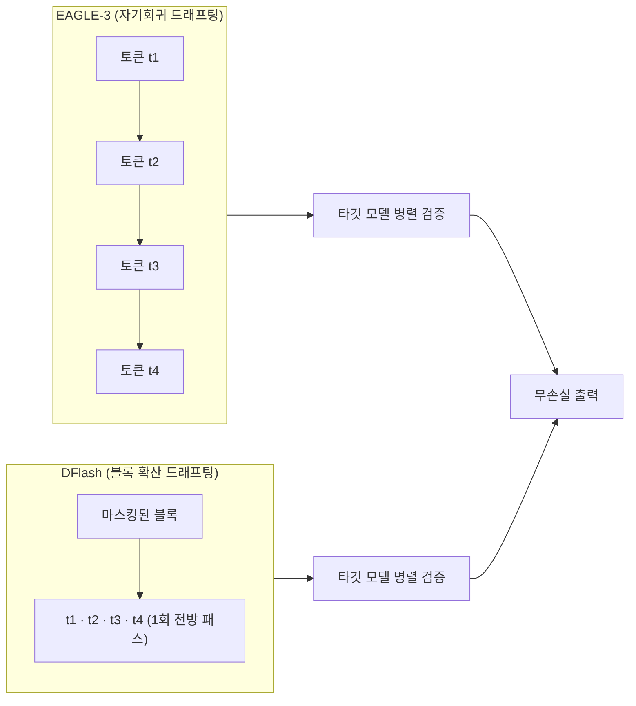

추측 디코딩의 드래프팅 단계를 순차에서 병렬로 바꾼 DFlash의 개념을 형상화한 이미지입니다.

## 개요

대규모 언어 모델 서빙에서 비용과 사용자 체감 속도를 동시에 결정하는 것은 디코딩 처리량입니다. 모델이 토큰을 한 개씩 자기회귀(autoregressive)로 생성하는 한, GPU 연산이 아무리 빨라도 매 토큰마다 전체 모델을 한 번씩 통과해야 하는 구조적 한계가 남습니다. 추측 디코딩(speculative decoding)은 이 병목을 우회하는 가장 실용적인 기법으로 자리 잡았지만, 그동안의 드래프터 역시 토큰을 순차적으로 그렸기 때문에 가속 배수가 대체로 2~3배 근처에서 멈췄습니다.

2026년 6월 23일, NVIDIA 기술 블로그가 UC 샌디에이고 연구진의 DFlash를 소개했습니다. DFlash는 추측 디코딩의 드래프팅 단계에 블록 확산(block diffusion) 모델을 도입해, 미래 토큰을 한 개씩이 아니라 블록 단위로 한 번의 전방 패스에서 제안합니다. 공개 수치 기준 단일 스트림 무손실 가속이 최대 6배, NVIDIA Blackwell에서의 처리량은 동일 응답성 목표 기준 최대 15배로 보고됩니다.

무엇보다 중요한 운영상의 특징은 **드롭인 통합**입니다. DFlash는 vLLM, SGLang, TensorRT-LLM에 모두 지원되며, vLLM에서는 기존 EAGLE-3 추측 설정을 DFlash 설정으로 바꾸는 것만으로 애플리케이션 코드 수정 없이 적용됩니다. 이 글은 DFlash가 어떻게 동작하는지, 공개된 벤치마크가 무엇을 말하는지, 그리고 K8s 기반 멀티테넌트 AI/ML 서빙 플랫폼을 운영하는 ThakiCloud 관점에서 어떤 의미가 있는지를 정리합니다. 본 글의 수치는 모두 NVIDIA와 UCSD가 공개한 공식 측정치이며, ThakiCloud 자체 하드웨어에서의 재현은 별도 항목에서 정직하게 다룹니다.

## 이 기술은 무엇인가

추측 디코딩은 두 단계로 나뉩니다. 작은 드래프트 모델이 미래 토큰을 제안하고, 큰 타깃 모델이 그 토큰들을 병렬로 검증해 유효한 가장 긴 접두사를 받아들입니다. 드래프트가 맞으면 타깃 모델 한 번의 검증 패스로 여러 토큰을 확정합니다. 문제는 전통적 드래프터가 자기회귀 방식이라, 추측 토큰 수가 늘어날수록 드래프팅 비용이 선형으로 증가한다는 점입니다. 이 때문에 처리량을 더 끌어올리기 어려웠습니다.

DFlash는 이 자기회귀 드래프터를 가벼운 블록 확산 드래프터로 교체합니다. 블록 확산 모델은 마스킹된 토큰 블록을 한 번에 디노이징해서, 병렬 생성과 자기회귀적 블록 구조를 결합합니다. DFlash는 이 아이디어를 드래프팅 단계에만 적용하고, 검증은 여전히 신뢰할 수 있는 자기회귀 타깃 모델이 담당합니다. 이 분리가 품질을 지키는 핵심입니다. 단독 확산 LLM은 정확도가 자기회귀 모델에 못 미치는 경우가 많고 디노이징 단계도 여러 번 필요하지만, DFlash에서 드래프트는 "검증을 통과할 만큼만" 좋으면 충분하고, 최종 출력 분포는 타깃 모델의 병렬 검증이 보장합니다. 즉 무손실(lossless)입니다.



두 번째 이점은 드래프팅 비용 구조입니다. 자기회귀 드래프터의 비용은 추측 토큰 수에 비례해 늘어나지만, 확산 드래프터는 모든 토큰을 한 번의 병렬 패스로 생성하므로 블록이 커져도 드래프팅 지연이 거의 평탄하게 유지됩니다. 덕분에 DFlash는 지연을 늘리지 않으면서 더 깊고 표현력 있는 드래프트 모델을 쓸 수 있습니다. 실제로 DFlash는 작은 5계층 드래프터(Qwen3-Coder의 경우 8계층)를 사용합니다. 이전의 확산 드래프터 연구(DiffuSpec, SpecDiff-2)가 70억 파라미터급 대형 드래프터를 써서 가속을 3~4배에서 막아버렸던 것과 대조됩니다.

DFlash가 결합한 세 가지 기술은 다음과 같습니다. 첫째, **블록 확산 드래프팅**으로 여러 미래 토큰을 병렬 예측합니다. 둘째, **타깃 은닉 상태 조건화(target hidden-state conditioning)**로 타깃 모델의 컨텍스트 특징을 KV 주입을 통해 드래프터에 전달합니다. 셋째, 검증 친화적 학습으로 드래프트 블록의 수용률을 높입니다. 이 조합이 "작은 드래프터 + 병렬 블록 제안 + 무손실 검증"이라는 균형을 만들어 냅니다.

## 설치 및 통합

DFlash는 체크포인트와 프레임워크 지원을 함께 배포하기 때문에 도입에 필요한 코드가 거의 없습니다. 공개 체크포인트는 Hugging Face의 `z-lab/dflash` 컬렉션에서 받을 수 있으며, 발표 시점 기준 20종의 체크포인트가 제공됩니다. vLLM에서는 EAGLE-3 설정을 DFlash 설정으로 교체하는 것만으로 끝나며, 애플리케이션 리팩터링이 필요 없습니다. 아래는 공식 문서가 제시하는 vLLM 실행 예시입니다.

```bash
vllm serve Qwen/Qwen3.5-27B \
  --speculative-config '{"method": "dflash", "model": "z-lab/Qwen3.5-27B-DFlash", "num_speculative_tokens": 15}' \
  --attention-backend flash_attn \
  --max-num-batched-tokens 32768
```

`--speculative-config`의 `method`를 `dflash`로 지정하고 드래프트 체크포인트 경로를 넘기는 것이 핵심입니다. 기존 EAGLE-3 서빙에서 쓰던 플래그 구조를 거의 그대로 유지하므로, 운영 중인 vLLM 배포에 추측 디코딩 방식만 갈아끼우는 형태가 됩니다. SGLang과 TensorRT-LLM도 동일하게 추측 디코딩 API를 통해 DFlash 드래프트 체크포인트를 받습니다.

Transformers 백엔드는 Qwen3와 LLaMA-3.1 계열을 지원하며, 드래프트 모델과 타깃 모델을 짝지어 호출하는 `spec_generate` 인터페이스를 제공합니다.

```python
from transformers import AutoModel, AutoModelForCausalLM, AutoTokenizer

draft = AutoModel.from_pretrained(
    "z-lab/Qwen3-8B-DFlash-b16", trust_remote_code=True,
    dtype="auto", device_map="cuda:0").eval()
target = AutoModelForCausalLM.from_pretrained(
    "Qwen/Qwen3-8B", dtype="auto", device_map="cuda:0").eval()
tokenizer = AutoTokenizer.from_pretrained("Qwen/Qwen3-8B")

messages = [{"role": "user", "content": "196의 양의 약수는 몇 개인가?"}]
input_ids = tokenizer.apply_chat_template(
    messages, return_tensors="pt", add_generation_prompt=True,
    enable_thinking=False).to(draft.device)

output = draft.spec_generate(
    input_ids=input_ids, max_new_tokens=2048, temperature=0.0, target=target)
```

위 코드 블록은 모두 NVIDIA 기술 블로그와 MarkTechPost가 공개한 공식 예시를 인용한 것이며, ThakiCloud 환경에서 직접 실행해 캡처한 결과가 아닙니다. DFlash의 처리량 수치는 NVIDIA Blackwell(DGX B300, 8 GPU) 환경에서 측정되었고, 본 글을 작성한 환경에는 해당 가속기와 체크포인트가 갖춰져 있지 않아 동일 조건 재현은 수행하지 못했습니다. 따라서 아래 결과는 모두 출처가 명확한 공개 수치이며, 자체 측정으로 검증한 수치는 포함하지 않았습니다.

## 실제 실험 결과 (공개 수치 기준)

DFlash의 가속 수치는 두 가지로 나뉘며, 측정 방식이 다르므로 구분해서 읽어야 합니다.

첫째, **단일 스트림 무손실 가속**입니다. UCSD 논문은 Qwen3-8B 그리디 디코딩(Transformers 백엔드) 기준 평균 4.86배, MATH-500에서 최고 6.08배를 보고합니다. 같은 조건에서 EAGLE-3는 트리 크기 16에서 평균 1.76배, 60에서 2.02배입니다. 작업별 수치는 아래 차트와 같습니다.


위 그래프는 UCSD DFlash 논문의 공식 수치를 시각화한 것이며 ThakiCloud의 직접 측정이 아닙니다. GSM8K 5.15배, MATH-500 6.08배, AIME25 5.62배, HumanEval 5.14배, LiveCodeBench 5.51배처럼 수학·코드 추론 작업에서 가속폭이 특히 큽니다. 반면 다양한 응답이 가능한 대화형 MT-Bench는 2.75배로 상대적으로 낮습니다. 추측 디코딩 가속이 "출력이 예측 가능할수록(수용률이 높을수록) 커진다"는 일반 원리와 일치합니다.

둘째, **고정 응답성 목표에서의 처리량**입니다. NVIDIA가 보고한 15배는 gpt-oss-120b를 DGX B300(8 Blackwell GPU)에서 TensorRT-LLM으로 서빙할 때, 사용자당 500~600 토큰/초 구간에서 자기회귀 디코딩 대비 15배 이상의 처리량을 낸다는 의미입니다. 같은 지점에서 EAGLE-3 대비로는 약 1.5배입니다. 별도의 NVIDIA Speed-Bench(동일 동시성 기준 응답성 가속)에서는 gpt-oss-120b가 DFlash 2.3배 대 EAGLE-3 1.7배, Llama 3.1 8B Instruct가 DFlash 2.8배 대 EAGLE-3 2.2배를 보였습니다. 작업 전반에서는 Gemma 4 31B 최대 5.8배(vLLM), Qwen3 8B 5.1배(SGLang)까지 보고됩니다.

정리하면, "6배"는 단일 요청 무손실 가속이고 "15배"는 다수 사용자를 같은 응답성으로 묶었을 때의 서빙 처리량입니다. 두 숫자는 서로 다른 질문에 답하므로, 운영 환경에서 기대 효과를 가늠할 때는 자신의 동시성과 응답성 목표를 먼저 정한 뒤 해당 구간의 수치를 봐야 합니다.

## ThakiCloud K8s AI/ML SaaS 플랫폼 적용 시사점

ThakiCloud는 K8s 위에서 Kueue로 GPU를 스케줄링하고 vLLM으로 다수 테넌트의 모델을 서빙하는 구조를 운영합니다. DFlash는 이 스택에 특히 잘 맞는 종류의 최적화입니다. 이유는 세 가지입니다.

첫째, **드롭인 교체**라 운영 리스크가 낮습니다. 추측 디코딩을 EAGLE-3로 이미 쓰고 있다면, `--speculative-config`의 method와 드래프트 체크포인트만 DFlash로 바꿔 카나리 배포로 검증할 수 있습니다. 애플리케이션 계약(API 스키마, 출력 분포)이 바뀌지 않는 무손실 기법이라 테넌트가 체감하는 응답 내용은 동일하고, 처리량과 지연만 개선됩니다. 멀티테넌트 SaaS에서 출력 일관성을 깨지 않는 최적화는 매우 귀합니다.

둘째, **GPU 효율이 곧 단가**입니다. 같은 GPU로 동일 응답성에서 더 많은 동시 요청을 처리할 수 있다는 것은, 테넌트당 서빙 비용이 내려간다는 뜻입니다. 온프레미스나 국내 리전 GPU처럼 증설이 까다로운 환경일수록 효과가 큽니다. ThakiCloud가 강조하는 온프렘·비용효율·self-hosting 메시지에 정확히 부합하는 레버입니다. 다만 NVIDIA의 15배는 Blackwell + TensorRT-LLM 조합의 상한값이므로, 보유한 GPU 세대와 서빙 백엔드에 맞춰 기대치를 보정해야 합니다.

셋째, **수학·코드 워크로드에서 가속폭이 큽니다.** 사내 코딩 에이전트, 데이터 분석 파이프라인, 도구 호출이 많은 에이전트 워크로드는 출력이 비교적 구조적이라 수용률이 높습니다. 이런 워크로드를 많이 서빙하는 테넌트라면 DFlash의 이득이 평균 이상으로 나타날 가능성이 높습니다. ThakiCloud가 멀티테넌트 에이전트 플랫폼을 지향하는 만큼, 코드·추론 중심 테넌트에 DFlash 서빙 프로필을 우선 적용하는 전략을 검토할 수 있습니다.

성숙 단계 로드맵으로는, vLLM 서빙 차트에 추측 디코딩 방식을 테넌트별 프로필로 노출하고, 백그라운드 비용 측정 루프로 "DFlash 적용 후 토큰당 단가가 실제로 내려갔는가"를 상시 추적하는 그림이 자연스럽습니다. 단정하지 않고 측정하는 원칙은 추론 최적화에서도 동일합니다.

## 한계 및 반론

DFlash가 만능은 아닙니다. 먼저 보고된 최대 수치는 특정 하드웨어와 백엔드에 묶여 있습니다. 15배는 Blackwell + TensorRT-LLM 조합의 결과이고, 구형 GPU나 다른 서빙 스택에서는 가속폭이 줄어듭니다. 무손실 6배 역시 그리디 디코딩 단일 스트림 기준이라, 높은 온도 샘플링이나 다양성이 큰 대화형 워크로드에서는 수용률이 낮아져 이득이 작아집니다(MT-Bench 2.75배가 이를 보여 줍니다).

둘째, 추측 디코딩 자체가 추가 메모리를 요구합니다. 드래프트 모델과 그 KV 캐시가 GPU 메모리를 점유하므로, 메모리가 빠듯한 멀티테넌트 환경에서는 동시성 상한과 트레이드오프가 생길 수 있습니다. 드래프터가 작다는 점이 이 부담을 줄여 주지만, 0은 아닙니다.

셋째, 운영 검증의 책임은 도입자에게 있습니다. 공개 수치는 출처가 명확하지만, 자신의 모델·트래픽·동시성에서 동일하게 재현된다는 보장은 없습니다. 본 글에서도 ThakiCloud 환경 재현은 수행하지 못했고, 따라서 실제 도입 전에는 카나리 배포로 토큰당 단가와 p50/p99 지연을 직접 측정해 검증해야 합니다. 마지막으로, 블록 확산 드래프터는 비교적 새로운 접근이라 모든 모델 아키텍처에 대한 체크포인트가 갖춰져 있지 않을 수 있으므로, 서빙하려는 타깃 모델에 맞는 드래프트 체크포인트의 존재 여부를 먼저 확인해야 합니다.

## 출처

- [Boost Inference Performance up to 15x on NVIDIA Blackwell Using DFlash Speculative Decoding (NVIDIA Technical Blog, 2026-06-23)](https://developer.nvidia.com/blog/boost-inference-performance-up-to-15x-on-nvidia-blackwell-using-dflash-speculative-decoding)
- [DFlash Speculative Decoding Drafts Whole Token Blocks in Parallel (MarkTechPost, 2026-06-24)](https://www.marktechpost.com/2026/06/24/dflash-speculative-decoding-drafts-whole-token-blocks-in-parallel-for-up-to-15x-higher-throughput-on-nvidia-blackwell/)
- [DFlash 공개 체크포인트 컬렉션 (Hugging Face, z-lab/dflash)](https://huggingface.co/collections/z-lab/dflash)
- [vLLM Speculative Decoding 문서](https://docs.vllm.ai/en/latest/features/speculative_decoding/)
