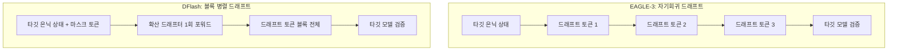

## 개요

LLM 서빙에서 가장 비싼 자원은 GPU 시간이고, 그 GPU 시간을 가장 많이 잡아먹는 단계는 토큰을 한 개씩 순차적으로 뽑아내는 디코딩입니다. 추측 디코딩(speculative decoding)은 이 병목을 정면으로 공격하는 기법입니다. 작은 드래프터 모델이 토큰 여러 개를 미리 추측하고, 큰 타깃 모델이 그 추측을 한 번에 검증하는 방식으로 순차 생성의 한계를 우회합니다.

최근 vLLM 진영에서 화제가 된 DFlash는 이 추측 디코딩의 새로운 변종입니다. 6월 24일 vLLM 프로젝트 계정이 NVIDIA AI 팀의 DFlash 지원 발표를 공유하면서 주목을 받았습니다. 핵심 메시지는 단순합니다. vLLM에서 기존 EAGLE-3 드래프터를 DFlash 체크포인트로 바꾸기만 하면 추가 코드 없이 더 큰 가속을 얻는다는 것입니다.

이 글은 DFlash가 EAGLE-3와 무엇이 다른지, vLLM에서 어떻게 켜는지, 그리고 자체호스팅으로 모델을 서빙하는 ThakiCloud 같은 조직에게 이 기법이 왜 중요한지를 정리합니다. 벤치마크 수치는 NVIDIA와 Red Hat이 공개한 발표 값을 출처와 함께 인용하며, 직접 재현하지 않은 수치는 분명히 표시합니다.

## DFlash는 무엇인가

추측 디코딩의 성능은 결국 두 가지에 달려 있습니다. 드래프터가 한 번에 얼마나 많은 토큰을 제안하느냐(드래프트 길이), 그리고 그 제안이 얼마나 자주 채택되느냐(수용률)입니다. EAGLE 계열은 드래프터가 타깃 모델의 은닉 상태(hidden state)를 입력으로 받아 다음 토큰을 자기회귀적으로, 즉 한 번에 한 토큰씩 그려냅니다. 정확하지만 드래프트 단계 자체가 여러 번의 작은 포워드 패스로 나뉘는 구조입니다.

DFlash는 접근을 바꿉니다. 작은 확산(diffusion) LLM 드래프터가 토큰 블록 전체를 단 한 번의 포워드 패스로 예측합니다. 타깃 모델의 은닉 상태를 조건으로 받되, EAGLE-3의 인과적(causal) 어텐션 대신 비인과적(non-causal) 어텐션 마스크를 사용해 각 쿼리가 검증자의 은닉 상태와 마스크 토큰 임베딩을 동시에 바라봅니다. 그 결과 블록 안의 드래프트 토큰을 한꺼번에 생성합니다.

이 블록 병렬 방식이 핵심입니다. 자기회귀 드래프팅이 가진 순차 의존성을 제거하기 때문에, NVIDIA와 vLLM 측 설명에 따르면 동기(synchronous) 요청에서 EAGLE-3 대비 2~3배 큰 가속을 낼 수 있습니다. 드래프트 길이를 늘리면서도 드래프트 생성 자체의 지연을 키우지 않는다는 점에서, 추측 디코딩이 원래 노렸던 "한 번에 많이, 빠르게 제안한다"는 목표에 더 충실한 구조입니다.

아래 도표는 두 방식의 차이를 단순화한 것입니다.



## vLLM에서 DFlash 켜기

DFlash를 vLLM에 붙이는 통로는 Speculators 라이브러리입니다. Speculators는 추측 디코딩 알고리즘을 만들고 평가하고 저장하는 vLLM 공식 라이브러리로, 드래프터를 타깃 모델의 추론 경로 안에서 은닉 상태에 연결하는 역할을 합니다. Red Hat 개발자 블로그에 따르면 Speculators v0.5.0에서 DFlash 지원과 온라인 학습이 추가되었습니다.

실무적으로 중요한 점은 체크포인트 교체만으로 동작한다는 것입니다. NVIDIA는 vLLM에서 EAGLE-3를 DFlash 체크포인트로 바꾸는 데 설정 외의 코드 변경이 필요 없다고 설명합니다. vLLM이 지원하는 추측 디코딩 방식 목록에는 이미 n-gram, suffix, EAGLE, 그리고 DFlash가 들어 있습니다.

vLLM의 추측 디코딩은 `--speculative-config`(또는 동등한 Python 인자)로 켭니다. DFlash 체크포인트를 드래프터로 지정하는 형태는 대략 다음과 같습니다. 체크포인트는 Speculators 포맷으로 저장되어 있어 vLLM이 알고리즘 타입을 자동으로 인식합니다.

```bash
# DFlash 드래프터로 타깃 모델 서빙 (대표 형태)
# 체크포인트 정확한 repo id는 HF의 RedHatAI / NVIDIA speculator 컬렉션에서 확인
vllm serve <target-model> \
  --speculative-config '{"model": "<dflash-speculator-checkpoint>", "num_speculative_tokens": 8}'
```

학습이나 자체 체크포인트 제작까지 들어가면 Speculators는 `--speculator-type dflash`, `--draft-vocab-size`, `--block-size`, `--max-anchors`, `--num-layers`, `--target-layer-ids` 같은 DFlash 전용 파라미터를 노출합니다. 블록 크기(`--block-size`)가 곧 한 번에 제안할 토큰 수를 결정하는 핵심 손잡이입니다.

NVIDIA는 DFlash 체크포인트 20종을 Hugging Face에 공개하면서 Blackwell과 Hopper GPU용 레시피를 함께 제공한다고 밝혔습니다. 즉 사전 학습된 드래프터를 받아 바로 vLLM에 물릴 수 있고, 필요하면 자기 도메인 데이터로 온라인 학습까지 돌릴 수 있는 경로가 열려 있습니다.

> 참고: 이 글의 설정 예시는 vLLM의 `--speculative-config` 스키마를 바탕으로 한 대표 형태입니다. 정확한 체크포인트 repo id와 최신 인자명은 vLLM Speculators 공식 문서에서 확인하시기 바랍니다. 본 환경(Apple Silicon / MPS)에서는 Blackwell·Hopper 의존성 때문에 직접 벤치마크를 재현하지 않았으며, 아래 수치는 모두 발표 값입니다.

## 발표된 성능 수치

직접 재현한 값이 아니라 NVIDIA와 vLLM 측이 공개한 수치임을 먼저 밝힙니다.

- gpt-oss-120b를 NVIDIA Blackwell에서 서빙할 때, 동일한 인터랙티비티(interactivity, 사용자가 체감하는 응답 속도) 수준에서 추론 성능을 최대 15배까지 끌어올렸습니다. [NVIDIA 발표]
- Llama 3.1 8B의 경우 동일 동시성(concurrency)에서 최신 EAGLE-3 추측 디코딩 대비 인터랙티비티를 거의 두 배로 높였습니다. [NVIDIA 발표]
- 동기 요청 기준 EAGLE-3 대비 2~3배 큰 가속이라는 설명도 함께 제시되었습니다. [vLLM 발표]

여기서 "최대 15배"라는 숫자는 특정 모델(gpt-oss-120b)과 특정 하드웨어(Blackwell), 특정 운용 조건(동일 인터랙티비티)에서 나온 상한값입니다. 모델 크기가 작거나 하드웨어가 다르거나 동시성이 높아지면 이득은 줄어듭니다. Llama 3.1 8B에서 "거의 두 배"라는 더 보수적인 수치가 같이 제시된 것이 이 점을 보여줍니다. 마케팅 헤드라인 한 줄만 보고 모든 워크로드에 15배를 기대하면 안 됩니다.

## ThakiCloud K8s AI/ML SaaS 플랫폼 적용 시사점

ThakiCloud는 Kubernetes 위에서 Kueue로 GPU를 스케줄링하고 vLLM으로 모델을 서빙하는 멀티테넌트 AI/ML 플랫폼을 운영합니다. 추측 디코딩은 이 구조에서 가장 직접적으로 비용에 닿는 최적화입니다. 같은 GPU에서 더 많은 토큰을 뽑아낼 수 있다면, 테넌트당 단가가 내려가거나 같은 비용으로 더 높은 동시성을 받을 수 있기 때문입니다.

DFlash가 ThakiCloud 관점에서 매력적인 이유는 세 가지입니다.

첫째, 도입 비용이 낮습니다. 이미 vLLM과 Speculators를 쓰고 있고 EAGLE-3 드래프터를 운용 중이라면, DFlash 전환은 사실상 체크포인트 교체와 설정 변경 수준입니다. 서빙 스택을 갈아엎을 필요가 없습니다. K8s 환경에서는 드래프터 체크포인트를 담은 컨테이너 이미지와 `--speculative-config` 값만 바꾼 새 디플로이먼트를 올려 카나리로 검증하는 흐름이 자연스럽습니다.

둘째, 블록 병렬 구조는 인터랙티브 워크로드에서 특히 빛납니다. 코딩 어시스턴트, 채팅, 에이전트 루프처럼 응답 지연(latency)이 사용자 경험을 직접 좌우하는 워크로드에서 동일 인터랙티비티 기준의 가속은 곧 더 낮은 P50/P99 지연으로 이어집니다. 멀티테넌트 환경에서 한 테넌트의 토큰 처리량이 올라가면 다른 테넌트에게 양보할 GPU 슬랙도 늘어납니다.

셋째, 온프레미스와 비용 효율이라는 우리 강점과 정확히 맞물립니다. 보안 요구가 높은 고객은 모델을 자체 인프라 안에 가두려 합니다. 추측 디코딩으로 토큰당 단가를 낮추면, 클라우드 API를 쓰지 않고 온프레미스에서 서빙해도 경제성이 유지된다는 논거가 강해집니다. DFlash 체크포인트가 Blackwell뿐 아니라 Hopper용 레시피까지 제공된다는 점은, 최신 세대 GPU가 없는 온프레미스 환경에서도 적용 여지가 있다는 뜻입니다.

다만 도입 전에 우리 워크로드 분포로 직접 측정하는 단계가 반드시 필요합니다. 발표된 15배는 우리 숫자가 아니라 NVIDIA의 숫자입니다. ThakiCloud가 주로 서빙하는 모델 크기와 동시성 패턴에서 실제 수용률과 가속을 카나리로 재고, 그 값을 근거로 테넌트 단가 모델을 갱신하는 것이 책임 있는 순서입니다.

## 한계 및 반론

DFlash가 만능은 아닙니다. 도입을 검토할 때 짚어야 할 약점이 분명히 있습니다.

추측 디코딩의 이득은 동시성에 민감합니다. 배치가 가득 찬 고부하 상황에서는 GPU가 이미 검증 연산만으로도 포화되기 때문에, 드래프터가 만들어내는 여분의 병렬성이 충분히 활용되지 못합니다. 발표 수치가 "동일 인터랙티비티" 또는 "동일 동시성" 같은 조건을 단 것도 이 때문이며, 무조건적인 처리량 향상으로 읽으면 안 됩니다.

드래프터 품질에 대한 의존도 큽니다. 확산 드래프터가 타깃 분포를 잘 근사하지 못하면 수용률이 떨어지고, 거부된 토큰을 다시 뽑는 비용이 이득을 깎아먹습니다. 도메인이 특수할수록 사전 학습된 일반 체크포인트의 수용률이 낮을 수 있고, 그러면 온라인 학습으로 드래프터를 우리 데이터에 맞춰야 하는 추가 작업이 생깁니다.

생태계 성숙도도 변수입니다. DFlash는 등장한 지 얼마 되지 않은 기법이고, Speculators v0.5.0에서 막 지원이 들어왔습니다. 공개된 체크포인트가 우리가 서빙하는 모델 전부를 덮지는 않으며, 최신 가속의 상당 부분이 Blackwell에 묶여 있다는 점도 하드웨어 의존성을 키웁니다. 안정적인 프로덕션 적용까지는 우리 환경에서의 검증과 운영 노하우 축적이 더 필요합니다.

그럼에도 방향성은 분명합니다. 추측 디코딩은 더 이상 선택적 최적화가 아니라 LLM 서빙의 기본 계층으로 자리 잡고 있고, DFlash는 그 계층의 경쟁을 한 단계 끌어올린 기법입니다. vLLM과 Speculators를 운용하는 조직이라면 적은 비용으로 시험해볼 가치가 충분합니다.

## 출처

- [Boost Inference Performance up to 15x on NVIDIA Blackwell Using DFlash Speculative Decoding - NVIDIA Technical Blog](https://developer.nvidia.com/blog/boost-inference-performance-up-to-15x-on-nvidia-blackwell-using-dflash-speculative-decoding)
- [Dflash - Speculators Docs (vLLM)](https://docs.vllm.ai/projects/speculators/en/latest/user_guide/algorithms/dflash/)
- [Speculators v0.5.0: DFlash support and online training - Red Hat Developer](https://developers.redhat.com/articles/2026/06/04/speculators-v050-dflash-support-and-online-training)
- [Speculative Decoding - vLLM Documentation](https://docs.vllm.ai/en/stable/features/speculative_decoding/)
- [vllm-project/speculators - GitHub](https://github.com/vllm-project/speculators)
